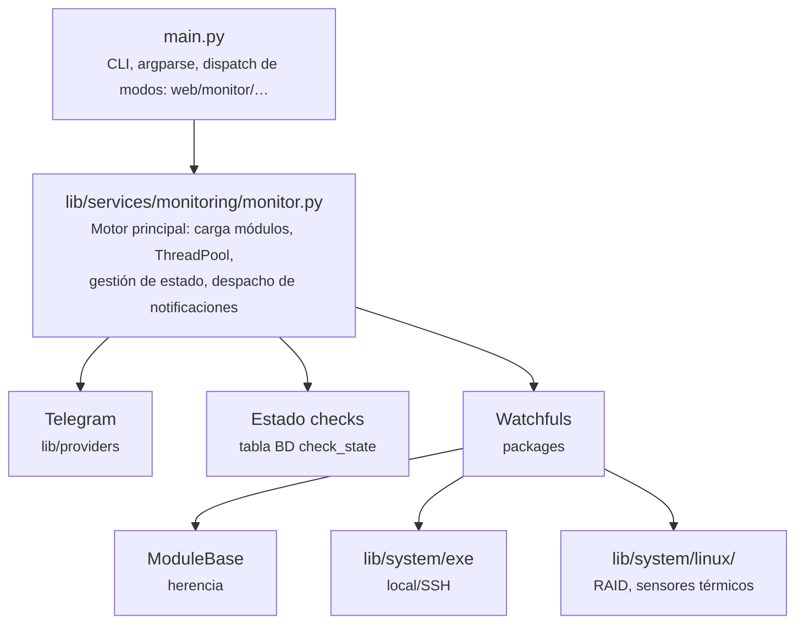
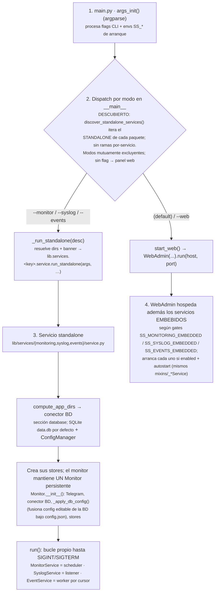
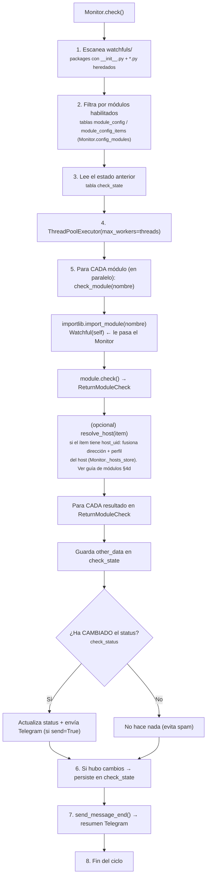
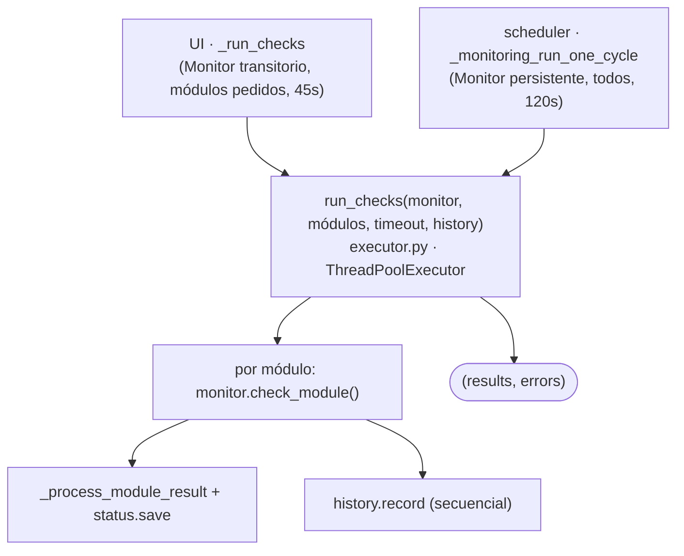
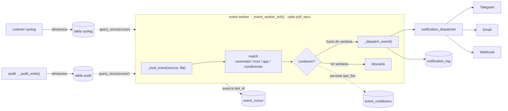
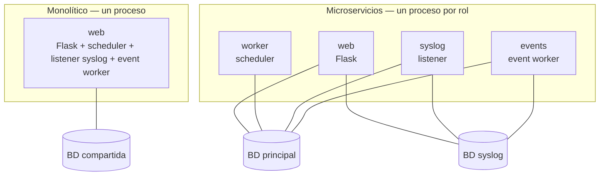

# Arquitectura

Visión técnica del diseño interno de ServiceSentry: diagrama de componentes,
jerarquía de clases, estructura de directorios y flujo de ejecución.

---

## Diagrama de Componentes



---

## Jerarquía de Clases

```text
ObjectBase (lib/core/object_base.py)
├── debug: Debug  ← instancia compartida por TODAS las clases
│
├── Main (main.py)
├── Monitor (lib/services/monitoring/monitor.py)
├── Telegram (lib/providers/telegram.py)
├── ConfigManager (lib/config/manager.py)         ← ÚNICO dueño de la E/S de config (read/write/migrate)
│   ├── ConfigStore-BD (lib/core/config/store.py)      ← capa editable: tabla `config` (una fila por sección|campo)
│   ├── ConfigControl (lib/config/config_control.py)  ← I/O JSON de config.json (solo arranque + pins)
│   └── lib/config/resolve.py: resolve_config() fusiona env > config.json > BD > default;
│       migrate_config_to_db() migración única; FILE_ONLY_SECTIONS = {database}
│       (webhooks NO: tienen su propia tabla, lib/core/notify/webhook/store.py)
│       (lib/config/spec.py: registro central de defaults; load_config() ya NO siembra a disco)
├── WebAdmin (lib/web_admin/app.py)
│   # Dominios de núcleo empaquetados como módulos self-contained en lib/core/<d>/
│   # (store + mixin + routes + service + permissions); las rutas son finas (solo HTTP:
│   # parseo, sesión, persistencia, audit) y delegan la validación/mutación en service.py
│   # (sin Flask, reutilizable por CLI); WebAdmin HEREDA su mixin:
│   ├── _UsersMixin      (lib/core/users/mixin.py)
│   ├── _RolesMixin      (lib/core/roles/mixin.py)
│   ├── _GroupsMixin     (lib/core/groups/mixin.py)
│   ├── _SessionsMixin   (lib/core/sessions/mixin.py)
│   ├── _AuditMixin      (lib/core/audit/mixin.py)   (store en el módulo; también lo importan monitoring/events)
│   ├── _ChecksMixin     (lib/services/monitoring/checks_mixin.py) ← Checks tab = glue del motor de monitoring
│   # Glue que sigue en lib/web_admin/mixins/ (infra sin permisos propios / host de discovery):
│   ├── _PermissionsMixin(lib/web_admin/mixins/permissions.py)  ← calcula permisos efectivos
│   ├── _AuthMixin       (lib/web_admin/mixins/auth.py)         ← login local/LDAP/OIDC/SAML
│   └── _ServicesMixin   (lib/web_admin/mixins/services.py) ← descubre + controla los servicios embebidos
│   # Los servicios NO se heredan: WebAdmin COMPONE un objeto embebido por servicio
│   # (self._embedded_services), construido en __init__:
│   ├─ EmbeddedMonitor  (lib/services/monitoring/embedded.py)  ← _MonitoringMixin + contexto del host
│   ├─ EmbeddedSyslog   (lib/services/syslog/embedded.py)      ← _SyslogMixin + gate SS_SYSLOG_EMBEDDED/autostart
│   └─ EmbeddedEvents   (lib/services/events/embedded.py)      ← _EventsMixin + worker desacoplado
│       (cada objeto comparte su lógica con el servicio standalone del mismo paquete)
├── BaseConnector (lib/db/base.py)              ← capa de BD pluggable
│   ├── SQLiteConnector       (lib/db/sqlite.py)      [por defecto]
│   ├── MySQLConnector        (lib/db/mysql.py)
│   └── PostgreSQLConnector   (lib/db/postgresql.py)
├── Stores (reciben un BaseConnector inyectado)
│   # Stores de dominios de núcleo movidos a su módulo (lib/core/<d>/store.py):
│   ├── UsersStore      (lib/core/users/store.py)     → tablas users, users_groups
│   ├── GroupsStore     (lib/core/groups/store.py)    → tablas groups, groups_roles
│   ├── RolesStore      (lib/core/roles/store.py)     → tabla roles
│   ├── SessionsStore   (lib/core/sessions/store.py)  → tabla sessions
│   ├── AuditStore      (lib/core/audit/store.py)        → tabla audit (COMPARTIDO: lo usan monitoring/events)
│   # Resto de stores, en su servicio/dominio (lib/services/*/store, lib/core/*):
│   ├── CheckStateStore (lib/services/monitoring/check_state/store.py)  → tabla check_state (estado vivo de checks)
│   ├── CredentialsStore(lib/core/credentials/store.py)  → tabla credentials (identidades SSH reutilizables)
│   ├── HistoryStore    (lib/core/history/store.py)      → tabla history (series temporales)
│   ├── HostsStore      (lib/core/hosts/store.py)        → tabla hosts (servidores + perfiles de conexión)
│   ├── ModulesStore    (lib/core/modules/store.py)  → tablas module_config, module_config_items (config de módulos/ítems)
│   ├── ConfigStore     (lib/core/config/store.py)       → tabla config (capa editable: una fila por sección|campo)
│   ├── WebhooksStore   (lib/core/notify/webhook/store.py) → tabla webhooks (destinos HTTP salientes)
│   ├── EventRulesStore (lib/services/events/store/rules.py)  → tabla event_rules (reglas de notificación)
│   ├── NotificationLogStore (lib/services/events/store/log.py) → tabla notification_log (log de envíos)
│   ├── EventStateStore (lib/services/events/store/state.py)   → tablas event_cooldowns + event_cursor (estado del worker de eventos)
│   ├── SyslogStore     (lib/services/syslog/store/messages.py)  → tabla syslog (mensajes; puede ir en BD dedicada)
│   └── SyslogDropsStore(lib/services/syslog/store/drops.py)     → tabla syslog_drops (orígenes descartados por la allowlist)
└── ModuleBase (lib/modules/module_base.py)
    ├── watchfuls.cpu::Watchful               🌐 (multiplataforma)
    ├── watchfuls.datastore::Watchful         🌐 (multiplataforma; MySQL/PostgreSQL/MSSQL/Mongo/Redis/Influx/Elastic)
    ├── watchfuls.dns::Watchful               🌐 (multiplataforma)
    ├── watchfuls.filesystemusage::Watchful  🌐 (multiplataforma)
    ├── watchfuls.hddtemp::Watchful
    ├── watchfuls.keepalived::Watchful        (Linux; cluster VRRP multi-nodo)
    ├── watchfuls.m365::Watchful              🌐 (multiplataforma; Microsoft Graph / SharePoint)
    ├── watchfuls.ntp::Watchful               🌐 (multiplataforma)
    ├── watchfuls.ping::Watchful              🌐 (multiplataforma)
    ├── watchfuls.process::Watchful           🌐 (multiplataforma)
    ├── watchfuls.proxmox::Watchful           🌐 (multiplataforma; Proxmox VE REST)
    ├── watchfuls.raid::Watchful
    ├── watchfuls.ram_swap::Watchful          🌐 (multiplataforma)
    ├── watchfuls.service_status::Watchful   🌐 (multiplataforma)
    ├── watchfuls.snmp::Watchful             🌐 (multiplataforma; SNMPv1/v2c/v3 + gestión de MIBs)
    ├── watchfuls.ssl_cert::Watchful          🌐 (multiplataforma)
    ├── watchfuls.temperature::Watchful
    ├── watchfuls.ups::Watchful               🌐 (multiplataforma; NUT)
    └── watchfuls.web::Watchful              🌐 (multiplataforma)
```

---

## Estructura de Directorios

```text
ServiceSentry/
├── README.md                            # Portada del repositorio
├── src/
│   ├── main.py                          # Punto de entrada
│   ├── requirements.txt                 # Dependencias de producción
│   ├── requirements-dev.txt             # Dependencias de desarrollo (pytest)
│   ├── conftest.py                      # Helper compartido para tests
│   ├── pytest.ini                       # Configuración pytest (testpaths = tests watchfuls)
│   ├── lib/
│   │   ├── __init__.py                  # Exports: ObjectBase, DictFilesPath, Monitor, Telegram, Exec, ExecResult, Mem, MemInfo
│   │   ├── i18n/                        # Traducciones de toda la app (UI web + emails): __init__.py (loader, DEFAULT_LANG/SUPPORTED_LANGS/TRANSLATIONS/coerce_lang) + lang/ (en_EN.py, es_ES.py)
│   │   ├── util/                        # Helpers puros sin estado: tools.py (bytes2human) + os_detect.py (SO local/remoto) + entity_audit.py (touch_entity/track_change)
│   │   ├── security/                    # Primitivas de seguridad: secret_manager.py (cifrado Fernet, enc: prefix, ENCRYPT_KEYS) + net_guard.py (validate_external_url, guard SSRF)
│   │   ├── system/                      # Capa de acceso al host: ejecución (exe) + colectores de métricas (mem, linux/)
│   │   │   ├── exe.py                   # Ejecución de comandos local/remoto (Exec, ExecResult)
│   │   │   ├── mem.py                   # Lectura de RAM/SWAP (multiplataforma vía psutil)
│   │   │   ├── mem_info.py              # Dataclass MemInfo (total, free, used, percent)
│   │   │   ├── linux/                   # Colectores específicos de Linux (RAID, térmico)
│   │   │   │   ├── thermal_base.py      # Clase base para datos térmicos
│   │   │   │   ├── thermal_node.py      # Nodo individual de sensor térmico
│   │   │   │   ├── thermal_info_collection.py   # Sensores térmicos /sys/class/thermal
│   │   │   │   └── raid_mdstat.py       # Parser /proc/mdstat (RAID)
│   │   │   └── windows/                 # Específico de Windows: ports.py (rangos TCP reservados vía netsh excludedportrange)
│   │   ├── core/                        # Núcleo: primitivas + infra transversal + dominios self-contained
│   │   │   ├── object_base.py           # ObjectBase (clase base con Debug compartido)
│   │   │   ├── constants.py             # SYSTEM_USER (centinela de autor de auditoría; fuente única)
│   │   │   ├── permissions.py           # RBAC: ROLES/PERMISSIONS/PERMISSION_GROUPS/BUILTIN_ROLE_* + is_*_perm + discover_permissions() (escanea lib.core.* + lib.services.*)
│   │   │   #   Cada dominio: routes.py fino (HTTP) + service.py (lógica sin Flask, reutilizable por CLI)
│   │   │   ├── users/ roles/ groups/ sessions/ audit/   # store.py + mixin.py + routes.py + service.py + permissions.py
│   │   │   ├── credentials/ history/ config/            # store.py + routes.py + service.py + permissions.py (sin mixin; store lo importan servicios; config/service.py incluye INT/BOOL_RULES + build_config_schema)
│   │   │   ├── modules/                                 # store.py + facade.py + service.py + routes.py (config CRUD + /api/v1/modules/watchfuls action dispatch) + permissions.py
│   │   │   ├── hosts/                                   # store.py + service.py (CRUD-transform + check fan-out/status/probe-prep) + routes.py (CRUD+test+migrate) + profiles/runner/ssh_client/resolve/probe/migrate + permissions.py (grupo perm = 'servers')
│   │   │   ├── overview/                                # service.py (layout/widgets) + routes.py + permissions.py (grupo virtual, sin store)
│   │   │   ├── clusters/                                # solo permissions.py (grupo virtual, sin store/routes propios)
│   │   │   └── notify/                  # Subsistema de notificación (sin Flask; lo usan web, monitor y daemons syslog/events)
│   │   │       ├── notification_dispatcher.py  # dispatch(): enruta cada evento a Telegram/Email/Webhook
│   │   │       ├── telegram/            # notify.py (canal, envuelve lib/providers/telegram.py) + routes.py
│   │   │       ├── email/               # notify.py (SMTP/M365 vía providers/entraid/Gmail) + templates.py (HTML i18n) + routes.py + template_routes.py
│   │   │       └── webhook/             # notify.py (HMAC opcional) + store.py (WebhooksStore, tabla webhooks) + routes.py + test_routes.py
│   │   ├── services/                    # Servicios de fondo (embebidos o standalone) + el controlador central
│   │   │   ├── __init__.py              # discover_embedded_services(): escanea los paquetes y recoge su EMBEDDED_SERVICE (auto-descubrimiento)
│   │   │   ├── base.py                  # ServiceDescriptor: contrato de un servicio (key/label/icon/status/control)
│   │   │   ├── registry.py              # ServiceRegistry: controlador central que la pestaña Services recorre
│   │   │   ├── embedded.py              # _EmbeddedBase: contexto delegado al host para los Embedded<X>
│   │   │   ├── monitoring/              # Monitor de servicios
│   │   │   │   ├── monitor.py           # Monitor: motor (carga módulos, check_module, estado, despacha notificaciones)
│   │   │   │   ├── executor.py          # run_checks(): ejecutor compartido (ThreadPool) — on-demand UI + ciclo del scheduler
│   │   │   │   ├── manager.py           # _MonitoringMixin: scheduler (sin Flask); compartido por WebAdmin y el standalone
│   │   │   │   ├── embedded.py          # EmbeddedMonitor: el monitor embebido en el web admin (composición)
│   │   │   │   └── service.py           # MonitorService: monitor standalone (main.py --monitor)
│   │   │   ├── syslog/                  # Receptor syslog (RFC 3164/5424)
│   │   │   │   ├── parser.py            # Parser de mensajes RFC 3164/5424
│   │   │   │   ├── server.py            # Listener UDP/TCP/TLS multi-bind (IPv4/IPv6) + allowlist + descartes
│   │   │   │   ├── manager.py           # _SyslogMixin: ciclo de vida del listener (cfg/apply/drops/retención); compartido web/standalone
│   │   │   │   ├── embedded.py          # EmbeddedSyslog: listener embebido (gate SS_SYSLOG_EMBEDDED + autostart)
│   │   │   │   └── service.py           # SyslogService: standalone (recibe→almacena→purga; reglas desacopladas), sin Flask
│   │   │   └── events/                  # Procesador de eventos desacoplado (sin Flask)
│   │   │       ├── manager.py           # _EventsMixin: evalúa reglas + worker por cursor (syslog/audit); compartido web/standalone
│   │   │       ├── embedded.py          # EmbeddedEvents: worker embebido (mode/autostart; stores delegados al host)
│   │   │       └── service.py           # EventService: worker standalone (main.py --events)
│   │   │   ├── ipban/                   # fail2ban interno: jail.py (IpBanManager) + manager.py (_IpBanMixin) + exposed.py + embedded.py + routes.py + store/ (una clase por tabla)
│   │   │   ├── manager/                 # Control-plane de servicios: instances.py + commands.py + leader.py + routes.py (/api/v1/services/*)
│   │   │   ├── control_server.py        # Servidor de control de servicios standalone
│   │   │   └── heartbeat.py             # Heartbeat entre instancias de servicio
│   │   │   # (hosts: primitivas de conexión/ejecución movidas a lib/core/hosts/ — ver bloque core/)
│   │   ├── db/                          # Capa de BD pluggable (SQLite/MySQL/PostgreSQL)
│   │   │   ├── __init__.py              # get_connector(config, default_sqlite_path)
│   │   │   ├── base.py                  # BaseConnector + reconcile_table() (reconciliación de esquema)
│   │   │   ├── schema.py                # TableSpec/Column/Index, diff_table(), generador de DDL
│   │   │   ├── sqlite.py                # SQLiteConnector (WAL, por defecto)
│   │   │   ├── mysql.py                 # MySQLConnector (PyMySQL)
│   │   │   ├── postgresql.py            # PostgreSQLConnector (psycopg2)
│   │   │   └── module_tables.py         # Tablas declaradas por módulos (reconciliadas en la BD general)
│   │   ├── config/
│   │   │   ├── __init__.py              # load_config(): SOLO lee config.json (nunca siembra a disco); CONFIG_FILENAME
│   │   │   ├── spec.py                  # Registro central de defaults/reglas/overrides por env (cfg_default, registry_defaults)
│   │   │   ├── manager.py               # ConfigManager: ÚNICO dueño de la E/S de config (read/write/migrate)
│   │   │   ├── resolve.py               # resolve_config(): fusiona env > config.json > BD > default; FILE_ONLY_SECTIONS
│   │   │   ├── config_store.py          # I/O JSON (lectura/escritura)
│   │   │   ├── config_control.py        # Operaciones sobre config (get/set/exist)
│   │   │   └── config_type_return.py    # Enum tipos de retorno
│   │   ├── debug/
│   │   │   ├── debug.py                 # Sistema de debug con niveles
│   │   │   └── debug_level.py           # Enum: null, debug, info, warning, error, emergency
│   │   ├── modules/
│   │   │   ├── module_base.py           # Clase base para todos los watchfuls
│   │   │   ├── dict_return_check.py     # Estructura ReturnModuleCheck
│   │   │   └── discovery/               # Descubrimiento por escaneo de watchfuls
│   │   │       ├── credential_schemas.py  # Catálogo de tipos de credencial (escanea watchfuls + i18n)
│   │   │       └── overview_widgets.py    # Catálogo de widgets de Overview (reutiliza helpers de credential_schemas)
│   │   ├── providers/                   # Integraciones externas (identidad/cloud); capa baja, sin Flask
│   │   │   ├── telegram.py              # Cliente de la Bot API de Telegram (Telegram + send_telegram)
│   │   │   ├── ldap/                    # LDAP/AD: auth.py (lógica ldap3) + routes.py (/api/v1/auth/ldap/*)
│   │   │   ├── oidc/                    # OIDC/OAuth2 SSO: auth.py (authlib) + routes.py (/auth/oidc/*)
│   │   │   ├── saml/                    # SAML2 SSO: auth.py (python3-saml) + routes.py (/auth/saml2/*) [alpha]
│   │   │   ├── scim/                    # SCIM 2.0: service.py (protocolo, sin Flask) + routes.py (/scim/v2/*)
│   │   │   └── entraid/                 # Microsoft Entra ID / Graph (paquete)
│   │   │       ├── client.py            # Constantes Graph/authority + graph_error()
│   │   │       ├── auth.py              # Tenant/token app-only + device-code (start/poll)
│   │   │       ├── directory.py         # Grupos de Entra (fetch_groups, lookup_group)
│   │   │       ├── mail.py              # Envío de correo vía Graph (Microsoft 365)
│   │   │       ├── provisioning.py      # Alta de apps (roles/scopes/consent/SSO)
│   │   │       ├── declarations.py      # Descubrimiento de __entraid_provision__ en watchfuls
│   │   │       └── routes.py            # /api/v1/auth/entraid/* (registro de app + device-code de provisión SCIM)
│   │   └── web_admin/                   # Interfaz web de administración (Flask)
│   │       ├── app.py                   # Clase WebAdmin (hereda mixins de lib/web_admin/mixins + lib/core/* + lib/services/*)
│   │       ├── constants.py             # SOLO HOME_PAGES + home_page_ids (landing pages).
│   │       │                            #   RBAC → lib/core/permissions.py; SYSTEM_USER → lib/core/constants.py; i18n → lib.i18n
│   │       ├── templates/               # Plantillas Jinja2 (+ partials JS por feature)
│   │       ├── mixins/                  # Glue de infra que NO es dominio propio:
│   │       │   └── permissions.py auth.py services.py   # permisos efectivos / login local / host de discovery de servicios
│   │       │   # Dominios (users/roles/groups/sessions/audit) → lib/core/<d>/mixin.py; checks → lib/services/monitoring/checks_mixin.py.
│   │       │   # Auth externa (LDAP/OIDC/SAML) → lib/providers/{ldap,oidc,saml}/.
│   │       └── routes/                  # Registradores de rutas Flask (ver web_admin.md)
│   │           ├── __init__.py          # register_all(app, wa) — registra también los routes de core/servicios/providers
│   │           ├── auth.py              # /login, /logout + _establish_session/_landing_url (login local; LDAP/OIDC/SAML se registran desde lib/providers/*)
│   │           ├── pages.py             # vistas HTML: / (entry), /admin, /overview
│   │           ├── ui.py                # sesión/API ligero: /lang/<code> (navegación), /api/v1/me, /api/v1/health
│   │           ├── status.py errors.py util.py
│   │           └── …                    # Los demás registradores viven con su dominio/servicio:
│   │                                    #   core:      users/roles/groups/sessions/audit/config/credentials/history/hosts/modules/notify/*
│   │                                    #   services:  monitoring/routes.py (/api/v1/monitoring/*), syslog/routes.py, events/routes.py, ipban, manager (/api/v1/services)
│   │                                    #   providers: ldap/oidc/saml/scim/entraid (auth externa + SCIM)
│   ├── watchfuls/                       # Módulos de monitorización (packages)
│   │   ├── filesystemusage/             # 🌐 Multiplataforma (psutil)
│   │   │   ├── __init__.py              # Implementación del módulo
│   │   │   ├── watchful.py              # Alias: from . import Watchful
│   │   │   ├── schema.json              # Esquema de campos
│   │   │   ├── info.json                # Metadatos (icono, descripción)
│   │   │   ├── lang/en_EN.json          # Etiquetas en inglés
│   │   │   ├── lang/es_ES.json          # Etiquetas en español
│   │   │   └── tests/test_filesystemusage.py
│   │   ├── datastore/                   # 🌐 Multiplataforma (conectores BD)
│   │   ├── hddtemp/                     # (misma estructura)
│   │   ├── ping/
│   │   ├── raid/
│   │   ├── ram_swap/                    # 🌐 Multiplataforma (psutil)
│   │   ├── service_status/              # 🌐 Multiplataforma (systemd/OpenRC/SysV/Windows)
│   │   ├── snmp/                        # 🌐 SNMPv1/v2c/v3 + gestión/compilación de MIBs
│   │   ├── temperature/
│   │   └── web/
│   └── tests/                           # Tests de core y web admin
│       ├── conftest.py                  # Fixtures: config_dir, var_dir, admin, client
│       ├── test_config_file.py
│       ├── test_debug.py
│       ├── test_dict_files_path.py
│       ├── test_dict_return_check.py
│       ├── test_exe.py
│       ├── test_mem.py
│       ├── test_parse_helpers.py
│       ├── test_thermal.py
│       ├── test_tools.py
│       ├── test_wa_init.py
│       ├── test_wa_users.py
│       ├── test_wa_roles.py
│       ├── test_wa_groups.py
│       ├── test_wa_config.py
│       ├── test_wa_modules.py
│       ├── test_wa_sessions.py
│       ├── test_wa_audit.py
│       ├── test_wa_security.py
│       ├── test_wa_telegram.py
│       ├── test_wa_ui.py
│       └── test_wa_json_helpers.py
├── data/                                # Datos en modo desarrollo (config_dir == var_dir)
│   ├── config.json                     # Capa de solo-lectura + arranque: sección `database`, credenciales de primer arranque, overrides bloqueados y datos de feature (webhooks/overview/plantillas)
│   └── data.db                         # BD SQLite por defecto (usuarios, roles, sesiones, auditoría, hosts, credenciales, historial, estado de checks, config de módulos/ítems Y la configuración editable: tabla `config`)
└── docs/
    ├── architecture.md                  # Este archivo
    ├── configuration.md
    ├── modules.md
    ├── web_admin.md
    ├── development.md
    └── watchful_guide.md
```

---

## Flujo de Ejecución

### Inicio



### Ciclo de Check



### Detección de Cambio de Estado

El sistema solo notifica cuando el estado **cambia**. Lógica en `Monitor.check_status()`:

```python
# Busca en check_state: [modulo][sub_key][status]
# Si no existe, asume el opuesto (not status) → primer check siempre notifica
# Si el valor almacenado ≠ status actual → ha cambiado → return True
```

Esto evita enviar la misma alerta repetidamente en cada ciclo.

---

## Servicios de fondo

ServiceSentry corre servicios de larga vida (monitor, syslog, eventos, fail2ban) con el
**mismo código** en dos modos — **embebido** en el panel o **standalone** (proceso/pod
dedicado). El panel los **descubre** (`EMBEDDED_SERVICE`, patrón self-describing →
[discovery.md](discovery.md#3-servicios-embebidos-embedded_service)), los **compone** y los
**controla**; en modo microservicios la coordinación va por la **BD compartida** (estado
deseado/observado, cola de comandos, lease de líder) con un *poke* HTTP opcional.

→ Toda la arquitectura de servicios (qué hay, cómo se crean, descubrimiento, estado y
comunicación en microservicios, alta disponibilidad) está en **[services.md](services.md)**.

### Ejecución de checks: un único ejecutor

El botón **"comprobar ahora"** (on-demand) y cada **ciclo del scheduler** comparten el
mismo ejecutor (`executor.py::run_checks`); solo difieren en qué Monitor usan y qué
módulos/timeout pasan.



---

## Procesamiento de Eventos (notificaciones)

> La **entrega** (dispatcher, canales Telegram/Email/Webhook, matriz de routing, HMAC, plantillas) — lo que ocurre a partir de `dispatch()` — está en **[notifications.md](notifications.md)**. Esta sección cubre la **generación** de eventos.

Las **reglas de notificación** (audit/syslog → Telegram/Email/Webhook) las evalúa
`_EventsMixin` (`lib/services/events/manager.py`, **sin Flask**, compartido por el WebAdmin y
los servicios standalone). El diseño está **desacoplado de la ingesta**: los
productores y el consumidor no se llaman en línea, sino que se comunican a través de
las **propias tablas de la BD** (la cola es la tabla de origen).



Los **productores** (listener syslog, `_audit_write`) solo escriben en sus tablas;
el **worker** las drena por cursor. La "cola" es la propia tabla de origen.

**Principios de diseño:**

- **La ingesta nunca se bloquea.** El listener syslog y `_audit_write` **solo
  almacenan**; el envío de notificaciones (I/O de red, posiblemente lento) ocurre
  fuera de ese camino. Una avalancha de syslog no descarta paquetes por estar
  notificando — primero se persiste, luego el worker drena a su ritmo.
- **Cursor por fuente** (`event_cursor`): el worker lee solo filas nuevas
  (`id > last_id`). En el **primer arranque** el cursor se sitúa en la cola
  (`max_id`) para no reprocesar el histórico; después avanza tras cada lote.
- **Cooldown persistido** (`event_cooldowns`): el antirebote vive en BD (no en
  memoria), por lo que una regla no vuelve a dispararse tras un reinicio y vale para
  más de una instancia.
- **Embebido o externo** (env `SS_EVENTS_EMBEDDED`), mismo núcleo — uniforme con
  monitor/syslog: `events.enabled` es el interruptor on/off; el hosting lo decide el
  entorno, no un campo de config:
  - *embebido* (por defecto, `SS_EVENTS_EMBEDDED=1`): un hilo dentro del WebAdmin
    (`_start_event_worker`).
  - *externo* (`SS_EVENTS_EMBEDDED=0` en el web): un proceso/contenedor propio —
    `EventService` (`lib/services/events/service.py`, `main.py --events`,
    `SS_SERVICE_ROLE=events`) que abre la BD compartida y corre el mismo
    `_event_worker_loop`.
  - `events.enabled=false`: sin evaluación (el worker sigue vivo pero no procesa).
- **Controlable** desde la pestaña Services (start/stop/estado) tanto embebido como
  externo: en externo el start/stop edita el estado deseado (`events.enabled`) que el
  contenedor reconcilia.

### ¿Qué proceso corre el worker en cada topología?

| | Monolítico / **embebido** | Microservicios / **externo** |
|---|---|---|
| Worker de eventos | hilo dentro del contenedor **web** | contenedor **`events`** dedicado |
| Hosting | `SS_EVENTS_EMBEDDED=1` (por defecto) | web: `SS_EVENTS_EMBEDDED=0` · events: `SS_SERVICE_ROLE=events` |
| `events.enabled` | `true` (on/off) | `true` (on/off) |
| Entrypoint | interno (`_start_event_worker`) | `main.py --events` → `EventService` |
| Control en Services | start / stop | start / stop (edita `events.enabled`) |
| Base de datos | compartida (principal + syslog) | la misma BD compartida |



**Accesos a BD por rol** (en microservicios, cuando `syslog_db.enabled`):

| Rol | BD principal (config, audit, reglas, log, historial…) | BD syslog (mensajes + descartes) |
|---|---|---|
| **web** | ✔ (todo el panel) | ✔ (lee y muestra los mensajes) |
| **worker** (scheduler) | ✔ | — |
| **syslog** (listener) | ✔ (lee su config de la sección `syslog`) | ✔ (escribe los mensajes) |
| **events** (worker) | ✔ (reglas, audit, cooldown, cursor) | ✔ (lee los mensajes por cursor) |

> Todos comparten la **misma** BD principal (y la misma BD de syslog cuando está
> separada); cada rol abre solo los conectores que necesita. La config (incl. la del
> syslog) vive siempre en la BD principal, por eso todos los roles la abren.

En ambos casos el núcleo es el mismo (`_event_worker_tick` / `_event_worker_loop`);
solo cambia **quién** lo hospeda y **cuándo** se arranca.

> Esto **sustituye** la evaluación en línea anterior (el hook por mensaje del
> listener y el `_eval_event` dentro de `_audit_write`), que acoplaba el envío de
> notificaciones a la recepción y era un cuello de botella a alto caudal de syslog.

---

## Modelo de Concurrencia

| Capa | Mecanismo |
| ---- | --------- |
| Monitor → módulos | `ThreadPoolExecutor` (un hilo por módulo) |
| Dentro de cada módulo | `ThreadPoolExecutor` (un hilo por ítem: ping, datastore, hddtemp…) |
| Envío Telegram | Hilo daemon separado con cola de mensajes |

---

## Capa de Persistencia y Esquema de BD

La capa de datos del core (`lib/db/`) abstrae el motor mediante `BaseConnector`,
con implementaciones para **SQLite** (por defecto), **MySQL/MariaDB** y
**PostgreSQL**. Todos los stores (repartidos en `lib/core/*/store.py` y `lib/services/*/store/`) (`users`, `groups`, `roles`,
`sessions`, `audit`, `check_state`, `credentials`, `history`, `hosts`, `modules`,
`config`, `webhooks`, `event_rules`, `notification_log`, `event_cooldowns`, `event_cursor`, `syslog`, `syslog_drops`)
reciben un conector inyectado y no hablan nunca con un driver concreto. Se crea **un único conector
compartido por proceso**: los stores lo reciben inyectado (no abren conexiones
propias).

### Base de datos de syslog dedicada

Los mensajes de syslog (alto volumen) pueden vivir en una **BD separada** de la
principal. `lib/db/build_syslog_connector(syslog_db_cfg, *, main_connector,
default_sqlite_path)` devuelve el `main_connector` cuando `syslog_db.enabled` es
falso, o crea un **segundo `BaseConnector`** apuntando a la sección `syslog_db`
cuando está activo. `SyslogStore`/`SyslogDropsStore` usan ese conector; el resto
sigue en la BD principal. La topología `docker-compose.microservices.yml` levanta
dos MariaDB y enruta syslog a la dedicada vía `SS_SYSLOG_DB_*` (ver
[configuration.md](configuration.md) y [docker.md](docker.md)).

El **store de módulos** (`lib/core/modules/store.py`) guarda la configuración de
watchfuls, en dos tablas: `module_config` (una
fila por módulo: campos a nivel de módulo —`enabled`, `alert`, `interval`, meta
`__*__`— como JSON) y `module_config_items` (una fila por ítem: `host_uid`/`label`/
`enabled` promovidos a columnas para joins/búsquedas, el resto del ítem como
JSON). El facade `DbBackedModules` subclasa `ConfigControl`, por lo que
`Monitor.config_modules` y el acceso desde el panel web son idénticos para quien
los usa, y la misma BD se comparte entre web y worker. Los secretos siguen
cifrados con Fernet a nivel de valor, ahora dentro
del JSON de las tablas.

### Reconciliación declarativa de esquema

Cada tabla se define una sola vez como `TableSpec` (`lib/db/schema.py`:
columnas, orden, tipos, nullable, defaults, PK, índices, renombrados). En el
arranque, `connector.reconcile_table(spec)` compara la tabla real con la
definición y la **actualiza automáticamente** (añade columnas, corrige orden,
tipos, nullable, defaults e índices; reconstruye la tabla preservando los datos
cuando un `ALTER` no basta). Las columnas presentes en la BD pero ausentes del
spec **se conservan y se reportan en log, nunca se borran**.

### Convención de tipos de fecha/hora

Las fechas (`created_at`, `updated_at`, `sessions.created`/`last_seen`…) se
almacenan como **`TEXT` en formato ISO 8601 UTC** (`2026-06-05T12:00:00Z`).
Motivo: **SQLite no tiene tipo nativo de fecha** (solo `NULL/INTEGER/REAL/TEXT/
BLOB`), y el texto ISO ordena cronológicamente con orden lexicográfico, es
legible, no ambiguo y portable e idéntico entre los tres motores. Las series
temporales de alto volumen (`history.ts`) usan **`REAL` (epoch Unix)** para
aritmética/agregación baratas.

> **TODO (revisar en futuras actualizaciones):** actualmente el token `TEXT` se
> mapea a `TEXT` también en MySQL y PostgreSQL. Estos motores **sí** tienen tipos
> temporales nativos (`DATETIME(6)` / `TIMESTAMPTZ`) que serían más eficientes y
> correctos a gran volumen. Evaluar añadir un token simbólico `DATETIME` que
> mapee a `TEXT` (SQLite) / `DATETIME(6)` (MySQL) / `TIMESTAMPTZ` (PostgreSQL).
> Requeriría: normalizar el formato de escritura por motor (MySQL no acepta la
> `T`/`Z` de ISO directamente), manejar el tipo devuelto al leer, y añadir
> `DATETIME` a `canonical_type()` en el motor de diff. **No prioritario** mientras
> el volumen de las tablas de entidad sea bajo.

---

## Convenciones de Código

- **Prefijo `_`** (un solo guión bajo) para métodos y atributos privados (no `__`).
- **Type hints** en firmas de métodos y atributos de clase.
- **Docstrings** en todas las clases y métodos públicos.
- **`IntEnum` / `StrEnum`** para enumeraciones (no `Enum` base).
- **`match/case`** (Python 3.10+) para toda la lógica de despacho.
- **`encoding='utf-8'`** explícito en todas las operaciones de I/O.

---

## Notas Multiplataforma

| Módulo | Plataforma | Implementación |
| ------ | ---------- | -------------- |
| `datastore` | Linux / Windows / macOS | Conectores nativos de BD; túnel SSH vía `paramiko` |
| `filesystemusage` | Linux / Windows / macOS | `psutil.disk_partitions()` + `psutil.disk_usage()` |
| `ram_swap` / `mem` | Linux / Windows / macOS | `psutil.virtual_memory()` + `psutil.swap_memory()` |
| `web` | Linux / Windows / macOS | `urllib.request` (stdlib) |
| `ping` | Linux / macOS / Windows\* | `pythonping` (principal); fallback raw socket ICMP |
| `service_status` | Linux (systemd / OpenRC / SysV) + Windows | `systemctl` / `rc-service` / `service` / `psutil` |
| `temperature` | Linux / macOS | `psutil.sensors_temperatures()` |
| `raid` | Linux (local) / cualquier plataforma (SSH remoto) | `/proc/mdstat` local + SSH/paramiko remoto. El campo `local` está guardado por `supported_platforms: ["linux"]` — en otras plataformas la UI lo muestra como "No compatible" |
| `hddtemp` | Linux | Socket TCP al demonio hddtemp |

> \* **Windows (ping):** requiere `pythonping` (`pip install pythonping`). Sin él se usa el fallback raw socket ICMP, que requiere privilegios de Administrador en Windows.
