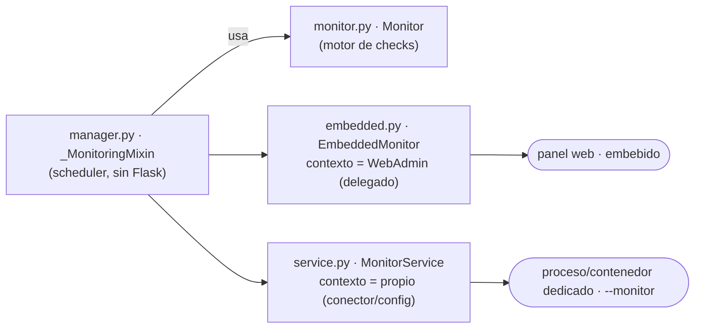
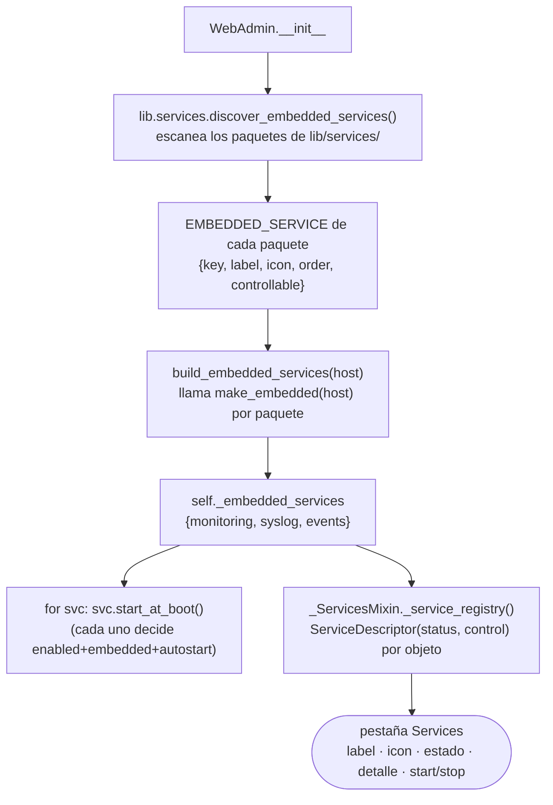
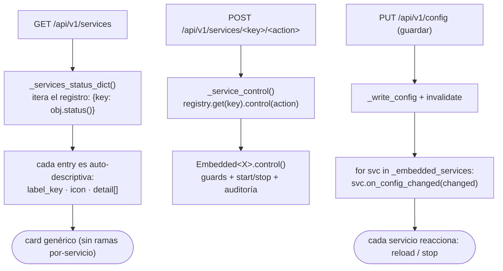
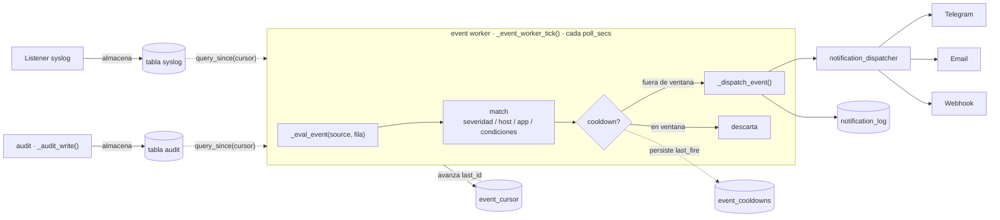
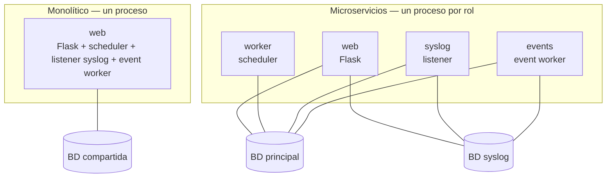

# Arquitectura

Visión técnica del diseño interno de ServiceSentry: diagrama de componentes,
jerarquía de clases, estructura de directorios y flujo de ejecución.

---

## Diagrama de Componentes

```text
┌─────────────────────────────────────────────────────┐
│                     main.py                         │
│  (CLI, argparse, dispatch de modos: web/monitor/…)  │
└──────────────────────┬──────────────────────────────┘
                       │
                       ▼
┌─────────────────────────────────────────────────────┐
│                  lib/services/monitoring/monitor.py                     │
│  (Motor principal: carga módulos, ThreadPool,       │
│   gestión de estado, despacho de notificaciones)    │
└───────┬──────────┬──────────┬───────────────────────┘
        │          │          │
        ▼          ▼          ▼
┌──────────┐ ┌──────────────┐ ┌──────────────┐
│ Telegram │ │ Estado checks │ │  Watchfuls   │
│(lib/core)│ │ (tabla BD     │ │  (packages)  │
│          │ │  check_state) │ │              │
└──────────┘ └──────────────┘ └──────┬───────┘
                                 │
                    ┌────────────┼────────────┐
                    ▼            ▼            ▼
              ModuleBase  lib/system/exe  lib/system/linux/
              (herencia)   (local/SSH)    (RAID, sensores térmicos)
```

---

## Jerarquía de Clases

```text
ObjectBase (lib/core/object_base.py)
├── debug: Debug  ← instancia compartida por TODAS las clases
│
├── Main (main.py)
├── Monitor (lib/services/monitoring/monitor.py)
├── Telegram (lib/core/telegram.py)
├── ConfigManager (lib/config/manager.py)         ← ÚNICO dueño de la E/S de config (read/write/migrate)
│   ├── ConfigStore-BD (lib/stores/config.py)      ← capa editable: tabla `config` (una fila por sección|campo)
│   ├── ConfigControl (lib/config/config_control.py)  ← I/O JSON de config.json (solo arranque + pins)
│   └── lib/config/resolve.py: resolve_config() fusiona env > config.json > BD > default;
│       migrate_config_to_db() migración única; FILE_ONLY_SECTIONS = {database}
│       (webhooks NO: tienen su propia tabla, lib/stores/webhooks.py)
│       (lib/config/spec.py: registro central de defaults; load_config() ya NO siembra a disco)
├── WebAdmin (lib/web_admin/app.py)
│   ├── _UsersMixin      (lib/web_admin/mixins/users.py)
│   ├── _RolesMixin      (lib/web_admin/mixins/roles.py)
│   ├── _GroupsMixin     (lib/web_admin/mixins/groups.py)
│   ├── _PermissionsMixin(lib/web_admin/mixins/permissions.py)
│   ├── _SessionsMixin   (lib/web_admin/mixins/sessions.py)
│   ├── _AuditMixin      (lib/web_admin/mixins/audit.py)
│   ├── _ChecksMixin     (lib/web_admin/mixins/checks.py)   ← checks on-demand (UI); usan el ejecutor compartido
│   └── _ServicesMixin   (lib/web_admin/mixins/services.py) ← descubre + controla los servicios embebidos
│   # Los servicios NO se heredan: WebAdmin COMPONE un objeto embebido por servicio
│   # (self._embedded_services), construido en __init__:
│   ├─ EmbeddedMonitor  (lib/services/monitoring/embedded.py)  ← _MonitoringMixin + contexto del host
│   ├─ EmbeddedSyslog   (lib/services/syslog/embedded.py)      ← _SyslogMixin + gate SS_SYSLOG_EMBEDDED/autostart
│   └─ EmbeddedEvents   (lib/services/events/embedded.py)      ← _EventsMixin + worker desacoplado
│       (cada objeto comparte su lógica con el servicio standalone del mismo paquete)
├── BaseConnector (lib/db/base.py)              ← capa de BD pluggable
│   ├── SQLiteConnector       (lib/db/sqlite.py)      [por defecto]
│   ├── MySQLConnector        (lib/db/mysql.py)
│   └── PostgreSQLConnector   (lib/db/postgresql.py)
├── Stores (lib/stores/, reciben un BaseConnector inyectado)
│   ├── UsersStore      (lib/stores/users.py)        → tablas users, users_groups
│   ├── GroupsStore     (lib/stores/groups.py)       → tablas groups, groups_roles
│   ├── RolesStore      (lib/stores/roles.py)        → tabla roles
│   ├── SessionsStore   (lib/stores/sessions.py)     → tabla sessions
│   ├── AuditStore      (lib/stores/audit.py)        → tabla audit
│   ├── CheckStateStore (lib/stores/check_state/store.py)  → tabla check_state (estado vivo de checks)
│   ├── CredentialsStore(lib/stores/credentials.py)  → tabla credentials (identidades SSH reutilizables)
│   ├── HistoryStore    (lib/stores/history.py)      → tabla history (series temporales)
│   ├── HostsStore      (lib/stores/hosts.py)        → tabla hosts (servidores + perfiles de conexión)
│   ├── ModulesStore    (lib/stores/modules/store.py)  → tablas module_config, module_config_items (config de módulos/ítems)
│   ├── ConfigStore     (lib/stores/config.py)       → tabla config (capa editable: una fila por sección|campo)
│   ├── WebhooksStore   (lib/stores/webhooks.py)     → tabla webhooks (destinos HTTP salientes)
│   ├── EventRulesStore (lib/stores/event/rules.py)  → tabla event_rules (reglas de notificación)
│   ├── NotificationLogStore (lib/stores/event/log.py) → tabla notification_log (log de envíos)
│   ├── EventStateStore (lib/stores/event/state.py)   → tablas event_cooldowns + event_cursor (estado del worker de eventos)
│   ├── SyslogStore     (lib/stores/syslog/messages.py)  → tabla syslog (mensajes; puede ir en BD dedicada)
│   └── SyslogDropsStore(lib/stores/syslog/drops.py)     → tabla syslog_drops (orígenes descartados por la allowlist)
└── ModuleBase (lib/modules/module_base.py)
    ├── watchfuls.datastore::Watchful         🌐 (multiplataforma)
    ├── watchfuls.filesystemusage::Watchful  🌐 (multiplataforma)
    ├── watchfuls.hddtemp::Watchful
    ├── watchfuls.ping::Watchful              🌐 (multiplataforma)
    ├── watchfuls.raid::Watchful
    ├── watchfuls.ram_swap::Watchful          🌐 (multiplataforma)
    ├── watchfuls.service_status::Watchful   🌐 (multiplataforma)
    ├── watchfuls.snmp::Watchful             🌐 (multiplataforma; SNMPv1/v2c/v3 + gestión de MIBs)
    ├── watchfuls.temperature::Watchful
    └── watchfuls.web::Watchful              🌐 (multiplataforma)
```

---

## Estructura de Directorios

```text
ServiceSentry/
├── README.md                            # Portada del repositorio
├── src/
│   ├── main.py                          # Punto de entrada
│   ├── requirements.txt                 # Dependencias de producción
│   ├── requirements-dev.txt             # Dependencias de desarrollo (pytest)
│   ├── conftest.py                      # Helper compartido para tests
│   ├── pytest.ini                       # Configuración pytest (testpaths = tests watchfuls)
│   ├── lib/
│   │   ├── __init__.py                  # Exports: ObjectBase, DictFilesPath, Monitor, Telegram, Exec, ExecResult, Mem, MemInfo
│   │   ├── core/                        # Primitivas compartidas del núcleo
│   │   │   ├── object_base.py           # Clase base con el Debug compartido por TODAS las clases
│   │   │   └── telegram.py              # Cliente de alertas (cola), usado por el monitor y por lib/notify
│   │   ├── i18n/                        # Traducciones de toda la app (UI web + emails): __init__.py (loader) + lang/ (en_EN.py, es_ES.py)
│   │   ├── util/                        # Helpers puros sin estado: tools.py (bytes2human) + os_detect.py (detección de SO local/remoto)
│   │   ├── security/                    # Primitivas de seguridad: secret_manager.py (cifrado Fernet, enc: prefix, ENCRYPT_KEYS) + net_guard.py (validate_external_url, guard SSRF)
│   │   ├── system/                      # Capa de acceso al host: ejecución (exe/ssh_client) + colectores de métricas (mem, linux/)
│   │   │   ├── exe.py                   # Ejecución de comandos local/remoto (Exec, ExecResult)
│   │   │   ├── ssh_client.py            # Cliente SSH (paramiko) compartido
│   │   │   ├── mem.py                   # Lectura de RAM/SWAP (multiplataforma vía psutil)
│   │   │   ├── mem_info.py              # Dataclass MemInfo (total, free, used, percent)
│   │   │   ├── linux/                   # Colectores específicos de Linux (RAID, térmico)
│   │   │   │   ├── thermal_base.py      # Clase base para datos térmicos
│   │   │   │   ├── thermal_node.py      # Nodo individual de sensor térmico
│   │   │   │   ├── thermal_info_collection.py   # Sensores térmicos /sys/class/thermal
│   │   │   │   └── raid_mdstat.py       # Parser /proc/mdstat (RAID)
│   │   │   └── windows/                 # Específico de Windows: ports.py (rangos TCP reservados vía netsh excludedportrange)
│   │   ├── stores/                      # Repositorios DB-backed, uno por entidad (cada uno declara su TableSpec)
│   │   │   ├── users.py                 # UsersStore      → tablas users, users_groups
│   │   │   ├── groups.py                # GroupsStore     → tablas groups, groups_roles
│   │   │   ├── roles.py                 # RolesStore      → tabla roles
│   │   │   ├── sessions.py              # SessionsStore   → tabla sessions
│   │   │   ├── audit.py                 # AuditStore      → tabla audit
│   │   │   ├── check_state/             # paquete: store.py (CheckStateStore, tabla check_state) + facade.py (DbBackedStatus)
│   │   │   ├── credentials.py           # CredentialsStore→ tabla credentials (identidades SSH reutilizables)
│   │   │   ├── history.py               # HistoryStore    → tabla history (series temporales)
│   │   │   ├── hosts.py                 # HostsStore      → tabla hosts (servidores + perfiles)
│   │   │   ├── modules/                 # paquete: store.py (ModulesStore, tablas module_config[_items]) + facade.py (DbBackedModules)
│   │   │   ├── config.py                # ConfigStore     → tabla config (capa editable: una fila por sección|campo)
│   │   │   ├── webhooks.py              # WebhooksStore   → tabla webhooks (destinos HTTP salientes)
│   │   │   ├── event/                   # paquete: rules.py (EventRulesStore) + state.py (EventStateStore: event_cooldowns/event_cursor) + log.py (NotificationLogStore)
│   │   │   └── syslog/                  # paquete: messages.py (SyslogStore; BD dedicada opcional) + drops.py (SyslogDropsStore). Distinto de lib.services.syslog (el receptor)
│   │   ├── services/                    # Servicios de fondo (embebidos o standalone) + el controlador central
│   │   │   ├── __init__.py              # discover_embedded_services(): escanea los paquetes y recoge su EMBEDDED_SERVICE (auto-descubrimiento)
│   │   │   ├── base.py                  # ServiceDescriptor: contrato de un servicio (key/label/icon/status/control)
│   │   │   ├── registry.py              # ServiceRegistry: controlador central que la pestaña Services recorre
│   │   │   ├── embedded.py              # _EmbeddedBase: contexto delegado al host para los Embedded<X>
│   │   │   ├── monitoring/              # Monitor de servicios
│   │   │   │   ├── monitor.py           # Monitor: motor (carga módulos, check_module, estado, despacha notificaciones)
│   │   │   │   ├── executor.py          # run_checks(): ejecutor compartido (ThreadPool) — on-demand UI + ciclo del scheduler
│   │   │   │   ├── manager.py           # _MonitoringMixin: scheduler (sin Flask); compartido por WebAdmin y el standalone
│   │   │   │   ├── embedded.py          # EmbeddedMonitor: el monitor embebido en el web admin (composición)
│   │   │   │   └── service.py           # MonitorService: monitor standalone (main.py --monitor)
│   │   │   ├── syslog/                  # Receptor syslog (RFC 3164/5424)
│   │   │   │   ├── parser.py            # Parser de mensajes RFC 3164/5424
│   │   │   │   ├── server.py            # Listener UDP/TCP/TLS multi-bind (IPv4/IPv6) + allowlist + descartes
│   │   │   │   ├── manager.py           # _SyslogMixin: ciclo de vida del listener (cfg/apply/drops/retención); compartido web/standalone
│   │   │   │   ├── embedded.py          # EmbeddedSyslog: listener embebido (gate SS_SYSLOG_EMBEDDED + autostart)
│   │   │   │   └── service.py           # SyslogService: standalone (recibe→almacena→purga; reglas desacopladas), sin Flask
│   │   │   └── events/                  # Procesador de eventos desacoplado (sin Flask)
│   │   │       ├── manager.py           # _EventsMixin: evalúa reglas + worker por cursor (syslog/audit); compartido web/standalone
│   │   │       ├── embedded.py          # EmbeddedEvents: worker embebido (mode/autostart; stores delegados al host)
│   │   │       └── service.py           # EventService: worker standalone (main.py --events)
│   │   ├── hosts/                       # Dominio de hosts (no la tabla; eso es stores/hosts.py)
│   │   │   ├── profiles.py              # Catálogo protocolo→campos (de __host_profile__)
│   │   │   ├── runner.py                # Ejecución de comandos local/SSH (run, is_remote)
│   │   │   ├── probe.py                 # Ejecuta un check de un módulo una sola vez (asistente)
│   │   │   └── migrate.py               # Asistente: agrupar conexiones inline en hosts
│   │   ├── db/                          # Capa de BD pluggable (SQLite/MySQL/PostgreSQL)
│   │   │   ├── __init__.py              # get_connector(config, default_sqlite_path)
│   │   │   ├── base.py                  # BaseConnector + reconcile_table() (reconciliación de esquema)
│   │   │   ├── schema.py                # TableSpec/Column/Index, diff_table(), generador de DDL
│   │   │   ├── sqlite.py                # SQLiteConnector (WAL, por defecto)
│   │   │   ├── mysql.py                 # MySQLConnector (PyMySQL)
│   │   │   ├── postgresql.py            # PostgreSQLConnector (psycopg2)
│   │   │   └── module_tables.py         # Tablas declaradas por módulos (reconciliadas en la BD general)
│   │   ├── config/
│   │   │   ├── __init__.py              # load_config(): SOLO lee config.json (nunca siembra a disco); CONFIG_FILENAME
│   │   │   ├── spec.py                  # Registro central de defaults/reglas/overrides por env (cfg_default, registry_defaults)
│   │   │   ├── manager.py               # ConfigManager: ÚNICO dueño de la E/S de config (read/write/migrate)
│   │   │   ├── resolve.py               # resolve_config(): fusiona env > config.json > BD > default; FILE_ONLY_SECTIONS
│   │   │   ├── config_store.py          # I/O JSON (lectura/escritura)
│   │   │   ├── config_control.py        # Operaciones sobre config (get/set/exist)
│   │   │   └── config_type_return.py    # Enum tipos de retorno
│   │   ├── debug/
│   │   │   ├── debug.py                 # Sistema de debug con niveles
│   │   │   └── debug_level.py           # Enum: null, debug, info, warning, error, emergency
│   │   ├── modules/
│   │   │   ├── module_base.py           # Clase base para todos los watchfuls
│   │   │   ├── credential_schemas.py    # Catálogo de tipos de credencial (escanea watchfuls + i18n)
│   │   │   ├── overview_widgets.py      # Catálogo de widgets de Overview (escanea watchfuls; reutiliza helpers de credential_schemas)
│   │   │   ├── dict_files_path.py       # Diccionario de rutas de archivos
│   │   │   ├── dict_return_check.py     # Estructura ReturnModuleCheck
│   │   │   └── enum_config_options.py   # Enum opciones de config comunes
│   │   ├── notify/                      # Subsistema de notificación (sin Flask; lo usan web, monitor y daemons syslog/events)
│   │   │   ├── notification_dispatcher.py  # dispatch(): enruta cada evento a Telegram/Email/Webhook
│   │   │   ├── telegram_notify.py       # Canal Telegram
│   │   │   ├── email_notify.py          # Canal email (SMTP / Microsoft 365 / Gmail)
│   │   │   ├── email_templates.py       # Plantillas HTML de email (i18n vía lib.i18n)
│   │   │   └── webhook_notify.py        # Canal webhooks (HMAC opcional)
│   │   └── web_admin/                   # Interfaz web de administración (Flask)
│   │       ├── app.py                   # Clase WebAdmin (hereda de los 11 mixins)
│   │       ├── constants.py             # PERMISSIONS (52), BUILTIN_ROLE_UIDS/GROUP_UIDS, SYSTEM_USER
│   │       ├── templates/               # Plantillas Jinja2 (+ partials JS por feature)
│   │       ├── auth/                    # Autenticación externa (opcional)
│   │       │   ├── ldap_auth.py         # LDAP/AD (ldap3)
│   │       │   ├── oidc_auth.py         # OIDC/OAuth2 SSO (authlib)
│   │       │   └── saml_auth.py         # SAML2 SSO (python3-saml) [alpha]
│   │       ├── mixins/                  # Lógica de negocio por dominio (8 mixins; los servicios NO son mixins)
│   │       │   ├── users.py roles.py groups.py permissions.py
│   │       │   ├── sessions.py audit.py checks.py
│   │       │   └── services.py          # _ServicesMixin: descubre + controla los servicios embebidos (composición, lib/services/*/embedded.py)
│   │       └── routes/                  # Registradores de rutas Flask (ver web_admin.md)
│   │           ├── __init__.py          # register_all(app, wa)
│   │           ├── auth/                # /login, /logout, /api/v1/auth/ldap|entra/*
│   │           ├── users/               # /api/v1/users, /me, roles, groups
│   │           ├── sessions/            # /api/v1/sessions, /api/v1/audit
│   │           ├── modules/             # /api/v1/modules, status, overview, checks/run
│   │           ├── notify/              # /api/v1/notify/* (telegram, email, webhook, templates)
│   │           ├── config/ (paquete)  events/ (paquete)  hosts/ (paquete)  syslog/ (paquete)
│   │           ├── watchfuls.py history.py daemon.py credentials.py services.py
│   │           ├── notify/webhooks.py  (webhooks bajo notify/)
│   │           ├── status.py ui.py errors.py
│   │           └── …                    # (inventario completo de endpoints en web_admin.md)
│   ├── watchfuls/                       # Módulos de monitorización (packages)
│   │   ├── filesystemusage/             # 🌐 Multiplataforma (psutil)
│   │   │   ├── __init__.py              # Implementación del módulo
│   │   │   ├── watchful.py              # Alias: from . import Watchful
│   │   │   ├── schema.json              # Esquema de campos
│   │   │   ├── info.json                # Metadatos (icono, descripción)
│   │   │   ├── lang/en_EN.json          # Etiquetas en inglés
│   │   │   ├── lang/es_ES.json          # Etiquetas en español
│   │   │   └── tests/test_filesystemusage.py
│   │   ├── datastore/                   # 🌐 Multiplataforma (conectores BD)
│   │   ├── hddtemp/                     # (misma estructura)
│   │   ├── ping/
│   │   ├── raid/
│   │   ├── ram_swap/                    # 🌐 Multiplataforma (psutil)
│   │   ├── service_status/              # 🌐 Multiplataforma (systemd/OpenRC/SysV/Windows)
│   │   ├── snmp/                        # 🌐 SNMPv1/v2c/v3 + gestión/compilación de MIBs
│   │   ├── temperature/
│   │   └── web/
│   └── tests/                           # Tests de core y web admin
│       ├── conftest.py                  # Fixtures: config_dir, var_dir, admin, client
│       ├── test_config.py
│       ├── test_debug.py
│       ├── test_dict_files_path.py
│       ├── test_dict_return_check.py
│       ├── test_exe.py
│       ├── test_mem.py
│       ├── test_parse_helpers.py
│       ├── test_thermal.py
│       ├── test_tools.py
│       ├── test_wa_init.py
│       ├── test_wa_users.py
│       ├── test_wa_roles.py
│       ├── test_wa_groups.py
│       ├── test_wa_config.py
│       ├── test_wa_modules.py
│       ├── test_wa_sessions.py
│       ├── test_wa_audit.py
│       ├── test_wa_security.py
│       ├── test_wa_telegram.py
│       ├── test_wa_ui.py
│       └── test_wa_json_helpers.py
├── data/                                # Datos en modo desarrollo (config_dir == var_dir)
│   ├── config.json                     # Capa de solo-lectura + arranque: sección `database`, credenciales de primer arranque, overrides bloqueados y datos de feature (webhooks/overview/plantillas)
│   └── data.db                         # BD SQLite por defecto (usuarios, roles, sesiones, auditoría, hosts, credenciales, historial, estado de checks, config de módulos/ítems Y la configuración editable: tabla `config`)
└── docs/
    ├── architecture.md                  # Este archivo
    ├── configuration.md
    ├── modules.md
    ├── web_admin.md
    ├── development.md
    └── watchful_guide.md
```

---

## Flujo de Ejecución

### Inicio

```text
1. main.py: args_init() (argparse) procesa los flags CLI y los envs SS_* de arranque
2. Dispatch por modo en __main__ (mutuamente excluyentes; SIN flag → panel web):
   ├── --monitor → start_monitor() → MonitorService(...).run(once = (-t 0))
   ├── --syslog  → start_syslog()  → SyslogService(...).run()
   ├── --events  → start_events()  → EventService(...).run()
   └── (default) / --web → start_web() → WebAdmin(...).run(host, port)
3. Cada servicio standalone (lib/{monitor,syslog,events}/service.py):
   ├── Resuelve config_dir/var_dir (compute_app_dirs)
   ├── Abre el conector de BD (sección database; SQLite data.db por defecto) + ConfigManager
   ├── Crea sus stores; el monitor mantiene UN Monitor persistente
   │   └── Monitor.__init__(): Telegram, conector de BD, _apply_db_config()
   │       (fusiona la config editable de la BD bajo config.json), stores
   └── run(): bucle propio hasta SIGINT/SIGTERM
       (MonitorService = scheduler de checks; SyslogService = listener; EventService = worker por cursor)
4. start_web (WebAdmin) hospeda además los servicios EMBEBIDOS según los gates
   SS_MONITORING_EMBEDDED / SS_SYSLOG_EMBEDDED / SS_EVENTS_EMBEDDED, arrancando cada
   uno si está enabled + autostart (reutilizando los mismos mixins/_*Service).
```

### Ciclo de Check

```text
Monitor.check():
│
├── 1. Escanea watchfuls/ (packages con __init__.py y archivos *.py heredados)
├── 2. Filtra por módulos habilitados (config de módulos en la BD: tablas module_config/module_config_items, vía Monitor.config_modules)
├── 3. Lee el estado anterior (tabla check_state)
├── 4. Crea ThreadPoolExecutor(max_workers=threads)
│
├── 5. Para CADA módulo (en paralelo):
│   └── check_module(nombre):
│       ├── importlib.import_module(nombre)
│       ├── Watchful(self) ← le pasa el Monitor
│       ├── module.check() → ReturnModuleCheck
│       │   └── (opcional) self.resolve_host(item): si el ítem tiene host_uid,
│       │       fusiona dirección + perfil del host (Monitor._hosts_store) sobre
│       │       la conexión antes de comprobar. Ver guía de módulos §4d.
│       │
│       └── Para CADA resultado en ReturnModuleCheck:
│           ├── Guarda other_data en check_state
│           ├── ¿Ha CAMBIADO el status? (check_status)
│           │   ├── SÍ → Actualiza status + envía Telegram (si send=True)
│           │   └── NO → No hace nada (evita spam)
│           └── return True (hubo cambios)
│
├── 6. Si hubo cambios → persiste en check_state
├── 7. send_message_end() → resumen Telegram
└── 8. Fin del ciclo
```

### Detección de Cambio de Estado

El sistema solo notifica cuando el estado **cambia**. Lógica en `Monitor.check_status()`:

```python
# Busca en check_state: [modulo][sub_key][status]
# Si no existe, asume el opuesto (not status) → primer check siempre notifica
# Si el valor almacenado ≠ status actual → ha cambiado → return True
```

Esto evita enviar la misma alerta repetidamente en cada ciclo.

---

## Servicios de fondo: registro, descubrimiento y composición

Los tres servicios de larga vida (monitor, syslog, eventos) viven en `lib/services/`
y cada uno corre en **dos modos** con el **mismo código**: **embebido** en el panel
web o **standalone** como su propio proceso (`--monitor`/`--syslog`/`--events`). La
lógica del ciclo de vida está en el mixin compartido del paquete (`manager.py`); solo
cambia el *host* que aporta el contexto (config, stores, debug).

### Mismo código, dos hosts (embebido vs standalone)



> syslog y events siguen el mismo patrón (`manager.py` compartido + `embedded.py` +
> `service.py`).  El gate `SS_*_EMBEDDED` decide si el panel lo hospeda (`embedded.py`)
> o lo posee un proceso dedicado (`service.py`).

### Arranque del panel web: descubrir → componer → arrancar

El WebAdmin **no hereda** los servicios: los **compone**.  Cada paquete se
autodescribe (`EMBEDDED_SERVICE`), el registro los descubre, y el panel construye un
objeto embebido por servicio que se arranca a sí mismo según su gating.



### Pestaña Services: estado y control (iterando el registro)



### Ejecución de checks: un único ejecutor

El botón **"comprobar ahora"** (on-demand) y cada **ciclo del scheduler** comparten el
mismo ejecutor (`executor.py::run_checks`); solo difieren en qué Monitor usan y qué
módulos/timeout pasan.


> Añadir un servicio nuevo a la pestaña = soltar un paquete en `lib/services/` con su
> `EMBEDDED_SERVICE` + `embedded.py` (que aporta `status`/`control`/`start_at_boot` y,
> opcionalmente, `on_config_changed`).  Aparece solo en la API, el card, el log de
> arranque y el control — **cero ediciones** en el panel ni el frontend.

---

## Procesamiento de Eventos (notificaciones)

Las **reglas de notificación** (audit/syslog → Telegram/Email/Webhook) las evalúa
`_EventsMixin` (`lib/services/events/manager.py`, **sin Flask**, compartido por el WebAdmin y
los servicios standalone). El diseño está **desacoplado de la ingesta**: los
productores y el consumidor no se llaman en línea, sino que se comunican a través de
las **propias tablas de la BD** (la cola es la tabla de origen).



Los **productores** (listener syslog, `_audit_write`) solo escriben en sus tablas;
el **worker** las drena por cursor. La "cola" es la propia tabla de origen.

**Principios de diseño:**

- **La ingesta nunca se bloquea.** El listener syslog y `_audit_write` **solo
  almacenan**; el envío de notificaciones (I/O de red, posiblemente lento) ocurre
  fuera de ese camino. Una avalancha de syslog no descarta paquetes por estar
  notificando — primero se persiste, luego el worker drena a su ritmo.
- **Cursor por fuente** (`event_cursor`): el worker lee solo filas nuevas
  (`id > last_id`). En el **primer arranque** el cursor se sitúa en la cola
  (`max_id`) para no reprocesar el histórico; después avanza tras cada lote.
- **Cooldown persistido** (`event_cooldowns`): el antirebote vive en BD (no en
  memoria), por lo que una regla no vuelve a dispararse tras un reinicio y vale para
  más de una instancia.
- **Embebido o externo** (`events.mode`), mismo núcleo:
  - *embedded* (por defecto): un hilo dentro del WebAdmin
    (`_start_event_worker`, gate de entorno `SS_EVENTS_EMBEDDED`).
  - *external*: un proceso/contenedor propio — `EventService`
    (`lib/services/events/service.py`, `main.py --events`, `SS_SERVICE_ROLE=events`) que abre
    la BD compartida y corre el mismo `_event_worker_loop`. El WebAdmin se lanza con
    `SS_EVENTS_EMBEDDED=0`.
  - *off*: sin evaluación.
- **Controlable** desde la pestaña Services (start/stop/estado) cuando es embebido.

### ¿Qué proceso corre el worker en cada topología?

| | Monolítico / **embebido** | Microservicios / **externo** |
|---|---|---|
| Worker de eventos | hilo dentro del contenedor **web** | contenedor **`events`** dedicado |
| `events.mode` | `embedded` (por defecto) | `external` |
| Entorno | `SS_EVENTS_EMBEDDED=1` (por defecto) | web: `SS_EVENTS_EMBEDDED=0` · events: `SS_SERVICE_ROLE=events` |
| Entrypoint | interno (`_start_event_worker`) | `main.py --events` → `EventService` |
| Control en Services | start / stop | solo lectura (otro proceso) |
| Base de datos | compartida (principal + syslog) | la misma BD compartida |



**Accesos a BD por rol** (en microservicios, cuando `syslog_db.enabled`):

| Rol | BD principal (config, audit, reglas, log, historial…) | BD syslog (mensajes + descartes) |
|---|---|---|
| **web** | ✔ (todo el panel) | ✔ (lee y muestra los mensajes) |
| **worker** (scheduler) | ✔ | — |
| **syslog** (listener) | ✔ (lee su config de la sección `syslog`) | ✔ (escribe los mensajes) |
| **events** (worker) | ✔ (reglas, audit, cooldown, cursor) | ✔ (lee los mensajes por cursor) |

> Todos comparten la **misma** BD principal (y la misma BD de syslog cuando está
> separada); cada rol abre solo los conectores que necesita. La config (incl. la del
> syslog) vive siempre en la BD principal, por eso todos los roles la abren.

En ambos casos el núcleo es el mismo (`_event_worker_tick` / `_event_worker_loop`);
solo cambia **quién** lo hospeda y **cuándo** se arranca.

> Esto **sustituye** la evaluación en línea anterior (el hook por mensaje del
> listener y el `_eval_event` dentro de `_audit_write`), que acoplaba el envío de
> notificaciones a la recepción y era un cuello de botella a alto caudal de syslog.

---

## Modelo de Concurrencia

| Capa | Mecanismo |
| ---- | --------- |
| Monitor → módulos | `ThreadPoolExecutor` (un hilo por módulo) |
| Dentro de cada módulo | `ThreadPoolExecutor` (un hilo por ítem: ping, datastore, hddtemp…) |
| Envío Telegram | Hilo daemon separado con cola de mensajes |

---

## Capa de Persistencia y Esquema de BD

La capa de datos del core (`lib/db/`) abstrae el motor mediante `BaseConnector`,
con implementaciones para **SQLite** (por defecto), **MySQL/MariaDB** y
**PostgreSQL**. Todos los stores de `lib/stores/` (`users`, `groups`, `roles`,
`sessions`, `audit`, `check_state`, `credentials`, `history`, `hosts`, `modules`,
`config`, `webhooks`, `event_rules`, `notification_log`, `event_cooldowns`, `event_cursor`, `syslog`, `syslog_drops`)
reciben un conector inyectado y no hablan nunca con un driver concreto. Se crea **un único conector
compartido por proceso**: los stores lo reciben inyectado (no abren conexiones
propias).

### Base de datos de syslog dedicada

Los mensajes de syslog (alto volumen) pueden vivir en una **BD separada** de la
principal. `lib/db/build_syslog_connector(syslog_db_cfg, *, main_connector,
default_sqlite_path)` devuelve el `main_connector` cuando `syslog_db.enabled` es
falso, o crea un **segundo `BaseConnector`** apuntando a la sección `syslog_db`
cuando está activo. `SyslogStore`/`SyslogDropsStore` usan ese conector; el resto
sigue en la BD principal. La topología `docker-compose.microservices.yml` levanta
dos MariaDB y enruta syslog a la dedicada vía `SS_SYSLOG_DB_*` (ver
[configuration.md](configuration.md) y [docker.md](docker.md)).

El **store de módulos** (`lib/stores/modules/store.py`) guarda la configuración de
watchfuls, en dos tablas: `module_config` (una
fila por módulo: campos a nivel de módulo —`enabled`, `alert`, `interval`, meta
`__*__`— como JSON) y `module_config_items` (una fila por ítem: `host_uid`/`label`/
`enabled` promovidos a columnas para joins/búsquedas, el resto del ítem como
JSON). El facade `DbBackedModules` subclasa `ConfigControl`, por lo que
`Monitor.config_modules` y el acceso desde el panel web son idénticos para quien
los usa, y la misma BD se comparte entre web y worker. Los secretos siguen
cifrados con Fernet a nivel de valor, ahora dentro
del JSON de las tablas.

### Reconciliación declarativa de esquema

Cada tabla se define una sola vez como `TableSpec` (`lib/db/schema.py`:
columnas, orden, tipos, nullable, defaults, PK, índices, renombrados). En el
arranque, `connector.reconcile_table(spec)` compara la tabla real con la
definición y la **actualiza automáticamente** (añade columnas, corrige orden,
tipos, nullable, defaults e índices; reconstruye la tabla preservando los datos
cuando un `ALTER` no basta). Las columnas presentes en la BD pero ausentes del
spec **se conservan y se reportan en log, nunca se borran**.

### Convención de tipos de fecha/hora

Las fechas (`created_at`, `updated_at`, `sessions.created`/`last_seen`…) se
almacenan como **`TEXT` en formato ISO 8601 UTC** (`2026-06-05T12:00:00Z`).
Motivo: **SQLite no tiene tipo nativo de fecha** (solo `NULL/INTEGER/REAL/TEXT/
BLOB`), y el texto ISO ordena cronológicamente con orden lexicográfico, es
legible, no ambiguo y portable e idéntico entre los tres motores. Las series
temporales de alto volumen (`history.ts`) usan **`REAL` (epoch Unix)** para
aritmética/agregación baratas.

> **TODO (revisar en futuras actualizaciones):** actualmente el token `TEXT` se
> mapea a `TEXT` también en MySQL y PostgreSQL. Estos motores **sí** tienen tipos
> temporales nativos (`DATETIME(6)` / `TIMESTAMPTZ`) que serían más eficientes y
> correctos a gran volumen. Evaluar añadir un token simbólico `DATETIME` que
> mapee a `TEXT` (SQLite) / `DATETIME(6)` (MySQL) / `TIMESTAMPTZ` (PostgreSQL).
> Requeriría: normalizar el formato de escritura por motor (MySQL no acepta la
> `T`/`Z` de ISO directamente), manejar el tipo devuelto al leer, y añadir
> `DATETIME` a `canonical_type()` en el motor de diff. **No prioritario** mientras
> el volumen de las tablas de entidad sea bajo.

---

## Convenciones de Código

- **Prefijo `_`** (un solo guión bajo) para métodos y atributos privados (no `__`).
- **Type hints** en firmas de métodos y atributos de clase.
- **Docstrings** en todas las clases y métodos públicos.
- **`IntEnum` / `StrEnum`** para enumeraciones (no `Enum` base).
- **`match/case`** (Python 3.10+) para toda la lógica de despacho.
- **`encoding='utf-8'`** explícito en todas las operaciones de I/O.

---

## Notas Multiplataforma

| Módulo | Plataforma | Implementación |
| ------ | ---------- | -------------- |
| `datastore` | Linux / Windows / macOS | Conectores nativos de BD; túnel SSH vía `paramiko` |
| `filesystemusage` | Linux / Windows / macOS | `psutil.disk_partitions()` + `psutil.disk_usage()` |
| `ram_swap` / `mem` | Linux / Windows / macOS | `psutil.virtual_memory()` + `psutil.swap_memory()` |
| `web` | Linux / Windows / macOS | `urllib.request` (stdlib) |
| `ping` | Linux / macOS / Windows\* | `pythonping` (principal); fallback raw socket ICMP |
| `service_status` | Linux (systemd / OpenRC / SysV) + Windows | `systemctl` / `rc-service` / `service` / `psutil` |
| `temperature` | Linux / macOS | `psutil.sensors_temperatures()` |
| `raid` | Linux (local) / cualquier plataforma (SSH remoto) | `/proc/mdstat` local + SSH/paramiko remoto. El campo `local` está guardado por `supported_platforms: ["linux"]` — en otras plataformas la UI lo muestra como "No compatible" |
| `hddtemp` | Linux | Socket TCP al demonio hddtemp |

> \* **Windows (ping):** requiere `pythonping` (`pip install pythonping`). Sin él se usa el fallback raw socket ICMP, que requiere privilegios de Administrador en Windows.
