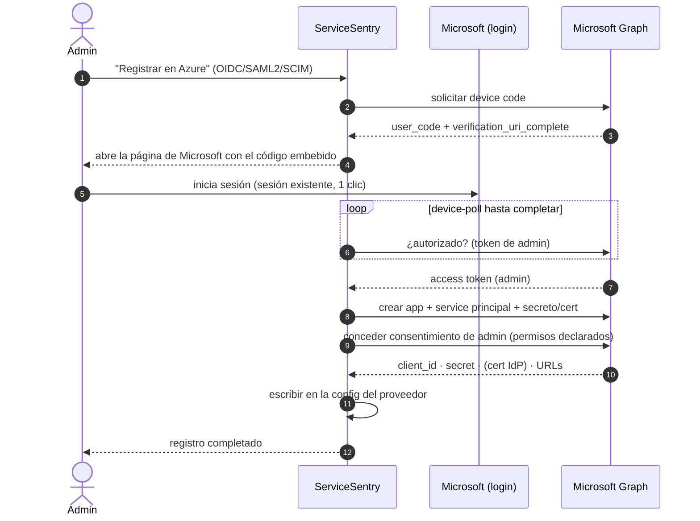
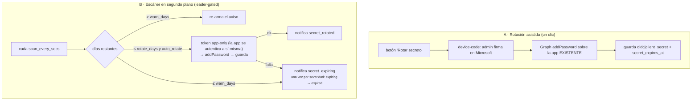

# Microsoft Entra ID (SSO OIDC/SAML2 · registro de apps)

Todo lo específico de **Microsoft Entra ID** en ServiceSentry: el inicio de sesión único
(SSO) por OIDC y SAML2, y los **asistentes "Registrar en Azure"** (Device Code Flow) que
crean apps en el tenant automáticamente — para SSO, para el aprovisionamiento **SCIM**, y
para las notificaciones de **Microsoft 365 (email)** y **Teams**.

- **OIDC / OAuth2** — recomendado. Registro **totalmente automático**, sin pasos manuales.
- **SAML2** — registro **casi** automático; un último paso (la *Configuración básica de
  SAML*) **debe hacerse a mano en el portal** por una limitación de la API de Graph.

Todos los asistentes viven en la pestaña **Config** y usan el mismo motor de provisioning
(`lib/providers/entraid/`).

> **SCIM** (aprovisionamiento proactivo) es un **estándar agnóstico del IdP** (RFC 7643/7644):
> su funcionamiento general, activación y semántica están en **[caso-scim.md](caso-scim.md)**.
> Aquí se documenta solo el **atajo específico de Entra** para registrar la app SCIM
> automáticamente ([§ Registro SCIM en Entra](#registro-scim-en-entra)).

---

## 1. Aspectos comunes (asistente, permisos, provisioning de usuarios)

### El asistente de registro

1. El admin pulsa **Registrar en Azure** (o **Registrar SAML2 en Azure**).
2. Se abre el **Device Code Flow**: ServiceSentry pide un `user_code`, abre la página de
   Microsoft con el código ya embebido (`verification_uri_complete`) y el admin inicia
   sesión con su sesión existente (un clic).
3. Con el token de admin, ServiceSentry llama a **Microsoft Graph** para crear la app,
   el service principal, el secreto/certificado y **conceder el consentimiento** de los
   permisos declarados.
4. Los valores resultantes (client_id, secret, cert IdP, URLs…) se **escriben en la
   config** del proveedor correspondiente.

> El flujo de **login** (una vez registrada la app) se documenta con sus diagramas en
> [explica-seguridad.md § Flujo de autenticación](explica-seguridad.md#flujo-de-autenticación).

El asistente también tiene una pestaña **Manual** con los scripts equivalentes de
**PowerShell (Microsoft.Graph)** y **Azure CLI**, por si se prefiere crear la app a mano.

### Permisos de API (difieren entre OIDC y SAML2)

| Permiso | OIDC | SAML2 | Para qué |
|---|:---:|:---:|---|
| `openid`, `email`, `profile`, `User.Read` (delegados) | ✅ | ❌ | Login OIDC: leer el perfil del usuario vía el token |
| `Group.Read.All` (aplicación) | ✅ | ✅ | Mapeo Grupos→Rol: listar/resolver grupos vía Graph |

**Es normal que la app SAML2 solo tenga `Group.Read.All`.** SAML **no usa OAuth**: la
identidad (email, nombre, grupos) viaja dentro de la **aserción SAML firmada** (los
*Atributos y reclamaciones* que Azure rellena solo: `givenname`, `surname`, `emailaddress`,
`name`, `groups`), no por permisos de API. Los scopes OIDC no aplican a SAML.

El consentimiento de admin de `Group.Read.All` se otorga automáticamente durante el flujo.

### Provisioning de usuarios (JIT)

ServiceSentry crea el usuario **la primera vez que inicia sesión** por SSO (Just-In-Time),
a partir de los claims de la aserción/token — controlado por el campo `auto_create_users`
(activo por defecto en OIDC y SAML2, en `sync_user()` de `lib/providers/oidc/auth.py`/`lib/providers/saml/auth.py`):

- En el primer login se crea la cuenta (email, nombre) y se le asigna rol según el **mapeo
  Grupos→Rol** (o `default_role` si no casa ningún grupo). En logins posteriores se
  actualizan datos/rol.

### Rotación del secreto de cliente (OIDC)

El secreto de la app OIDC **caduca** (la política del tenant decide cuánto dura, así que el
único valor fiable es el `endDateTime` que Graph devuelve al emitirlo — se guarda en
`oidc|secret_expires_at`). Hay tres piezas, todas opcionales e independientes:

| Pieza | Clave de config | Qué hace |
|---|---|---|
| **Rotación asistida** (un clic) | — (botón) | Botón **Rotar secreto** en Config → Autenticación → OIDC |
| **Aviso de caducidad** | `oidc\|secret_notify_expiry` + `oidc\|secret_warn_days` (30) | Notifica `secret_expiring` cuando quedan ≤ N días |
| **Rotación desatendida** | `oidc\|secret_auto_rotate` + `oidc\|secret_rotate_days` (15) | Emite el reemplazo cuando quedan ≤ N días (**margen**) |

> **Clave**: añadir un secreto en Entra **no revoca el anterior** — ambos son válidos hasta
> que el viejo caduque. Por eso la rotación (asistida o automática) **no corta los inicios de
> sesión**.

**Requisito de la rotación desatendida (B):** la app se autentica **como ella misma**
(client-credentials) y necesita permiso para **modificar su propio registro** en Entra. Si no
lo tiene, la rotación falla y el sistema **degrada a solo aviso** (nunca se queda en silencio).
Si la rotación automática no es viable en tu tenant, deja solo el aviso + el botón de rotación
asistida.

> ⚠️ **No deducible del código:** cuánta vida concede realmente Entra a un secreto depende de
> la **política del tenant** (el código pide `2099-12-31`, pero Entra puede recortarlo). Por eso
> se guarda y usa el `endDateTime` devuelto, no el solicitado. Si `secret_expires_at` está
> vacío (caducidad desconocida), el escáner **no** puede avisar ni rotar.

Endpoints: `POST /api/v1/auth/entraid/oidc/secret/device-code` y `…/device-poll` — ver
[ref-api.md](ref-api.md#provider--entra-id-json--libprovidersentraidroutespy).

### Registro SCIM en Entra

**SCIM 2.0** (aprovisionamiento proactivo de usuarios/grupos) es agnóstico del IdP; su
funcionamiento, activación (endpoint `/scim/v2`, token, URL base), tabla JIT-vs-SCIM,
semántica de baja y badges están en **[caso-scim.md](caso-scim.md)**. Aquí solo el **atajo
específico de Entra**.

- **Registrar SCIM en Azure** (botón, análogo a OIDC/SAML2): por Device Code Flow crea una
  **app empresarial** con un **trabajo de sincronización SCIM** (plantilla *customappsso*) ya
  apuntado a la URL base + token de ServiceSentry (`BaseAddress`/`SecretToken`). El último
  paso es manual en el portal: **asignar** los usuarios/grupos y pulsar **Iniciar
  aprovisionamiento** (SCIM solo empuja principales asignados). Junto al botón, **Abrir en
  Entra ID** enlaza a la hoja *Aprovisionamiento* de la app. Guarda `sp_app_id`/`sp_object_id`
  para el deep link. También hay pestaña **Manual** con los scripts PowerShell/Azure CLI.
  - **Sin token previo**: si al pulsar el botón no hay token (ni en el campo ni guardado), se
    **genera uno automáticamente** (server-side) y se **guarda** antes de registrar, para que
    el flujo funcione de un tirón.
  - **Cliente Graph CLI**: el flujo SCIM usa *Microsoft Graph Command Line Tools*
    (`14d82eec-…`) en vez de Azure PowerShell, porque el scope `Synchronization.ReadWrite.All`
    (necesario para el sync job/secrets) no está preautorizado en Azure PowerShell → daría
    `AADSTS65002`. OIDC/SAML2 siguen con el cliente por defecto.
  - **El token no viaja en la petición**: el backend lo lee de config (`_config_section('scim')`)
    y no lo acepta ni lo devuelve; el frontend solo sabe *si está seteado*.
- **Re-sincronización del token** (evita el desajuste ServiceSentry↔Entra que causa 401 en el
  *Test Connection*): al **Generar** un token con una app ya registrada, se re-empuja
  automáticamente a la app **existente** (`provisioning.update_scim_secrets`, reusa
  `sp_object_id`, sin crear otra) — un device-code ligero (login + PUT de secrets).

Código relevante:
- Provider: `lib/providers/entraid/` (`auth`, `provisioning`, `directory`, `client`).
- Rutas: `lib/providers/entraid/routes.py`.
- Wizard genérico (JS): `partials/credentials/_provision_wizard.html`
  (`showEntraIdProvisionWizard`).
- Glue por protocolo: `partials/cfg/auth/_renderers.html` (OIDC),
  `partials/cfg/auth/_wizard_saml.html` (SAML2) y `partials/cfg/auth/_wizard_scim.html` (SCIM).
- Otro consumidor del mismo wizard: **notificaciones Email → Microsoft 365**
  (`partials/cfg/notify/_email.html` :: `showEntraEmailWizard`), que registra una app con el
  permiso de aplicación `Mail.Send` reutilizando la spec inline del endpoint genérico.
- Y **notificaciones Microsoft Teams → activity feed** (`partials/cfg/notify/_msteams.html` ::
  `showEntraMsTeamsWizard`), que registra una app con el permiso `TeamsActivity.Send` por la misma
  vía y con `expose_api=true` → el provisioning además configura el **SSO surface** (Application ID
  URI `api://<clientId>` + scope `access_as_user` + preautorización de los client ids de Teams) para
  que la app de Teams generada sea **admin-instalable** (la instalación unificada valida el SSO).
  (El modo *bot* de Teams NO usa este wizard: requiere un recurso Azure Bot, que es ARM/Bot Service
  y no Graph.)
- SCIM: backend `provisioning.provision_scim_app` (crear) + `provisioning.update_scim_secrets`
  (re-sync) + rutas `entraid/scim/device-code|device-poll` en `lib/providers/entraid/routes.py` (cliente
  `GRAPH_CLI_CLIENT_ID`); endpoint SCIM `lib/providers/scim/routes.py` (transporte) + `lib/providers/scim/` (lógica); generador de token
  `lib/util/generate_token` expuesto en `routes/util.py` (`GET /api/v1/util/token`).
- URL pública única: `WebAdmin.public_base_url()` (override por `public_url` → auto-detección
  proxy-aware), inyectada como `SERVER_BASE_URL` y usada por `publicBaseUrl()`/`roCopyRow` en el
  front (redirect URI OIDC, ACS/Entity ID SAML2 read-only, URL base SCIM).

---

## 2. OIDC / OAuth2 (automático)

### Qué automatiza

`provisioning.provision_entra_app` crea un **registro de aplicación** OIDC con:

- **Redirect URI**: `{public_url}/auth/oidc/callback`.
- **Delegated scopes**: `openid`, `email`, `profile`, `User.Read`.
- **App role**: `Group.Read.All` + consentimiento de admin.
- **Group claims** (`groupMembershipClaims = SecurityGroup`) para que el token traiga los
  grupos.
- **Require assignment** (`appRoleAssignmentRequired = true`): solo usuarios/grupos
  asignados pueden entrar.
- Nombre por defecto: **`ServiceSentry - OIDC`** (constante única en
  `lib/providers/entraid/declarations.py::OIDC_APP_NAME`).

Al terminar, escribe en la config `oidc|*`: `provider_url`, `client_id`, `client_secret`
y el mapeo de claims (`username_claim=preferred_username`, `email_claim=email`,
`name_claim=name`, `groups_claim=groups`).

La card OIDC muestra la **Redirect URI (callback)** como fila **solo-lectura** (derivada de la
URL pública, con botón de copiar) — es el valor que se registra como *redirect URI* permitida
en el IdP (Entra/Google/Keycloak). Para un IdP no-Entra se usan los **presets** (Entra ID /
Google / Keycloak) que rellenan `provider_url` + claims.

### Flujo de login

- `/auth/oidc/login` → redirige a Entra (authorization code + PKCE vía `authlib`).
- `/auth/oidc/callback` → intercambia el código, valida el id_token y crea/actualiza el
  usuario (`lib/providers/oidc/auth.py`).

### Rutas de provisioning

| Método | Ruta | Descripción |
|--------|------|-------------|
| POST | `/api/v1/auth/entraid/provision/device-code` | Inicia el Device Code Flow (acepta un `profile` de módulo o una spec inline). |
| POST | `/api/v1/auth/entraid/provision/device-poll` | Sondea; al completar crea la app + SP + consentimiento y devuelve client_id/secret/tenant. |

### Campos de config (`oidc|…`)

`enabled`, `auto_create_users`, `provider_url`, `client_id`, `client_secret`, `scopes`
(por defecto `openid email profile`), `username_claim`, `email_claim`, `name_claim`,
`groups_claim`, `group_role_map`, `default_role`, `button_label`.

> **OIDC no tiene pasos manuales**: la config de apps OIDC/OAuth de Entra **sí** es
> establecible por Graph (redirect URIs, claims, permisos), así que el asistente lo deja
> todo listo.

---

## 3. SAML2 (casi automático)

### Qué automatiza

`provisioning.provision_saml2_app`:

1. **`POST /applicationTemplates/8adf8e6e-67b2-4cf2-a259-e3dc5476c621/instantiate`** — crea
   la **aplicación y el service principal enlazados** en una sola llamada. Esto es
   **imprescindible**: crear ambos por separado los deja sin enlazar y bloquea la
   activación del modo SAML (ver limitaciones).
2. Espera a que la app propague (replicación asíncrona de Entra).
3. Configura la app: `groupMembershipClaims`, `requiredResourceAccess` (Graph
   `Group.Read.All`) y `identifierUris` (best-effort, ver limitaciones).
4. Crea el **certificado de firma de token** (`addTokenSigningCertificate`, 3 años).
5. Fija en el SP `preferredSingleSignOnMode = "saml"` + `servicePrincipalNames` (sincronizado
   con el `identifierUris` de la app) + `replyUrls` (ACS). Cada PATCH es best-effort.
6. Concede el consentimiento de `Group.Read.All`.

Al terminar escribe en `saml2|*`: `idp_entity_id` (`https://sts.windows.net/{tenant}/`),
`idp_sso_url` (`https://login.microsoftonline.com/{tenant}/saml2`), `idp_cert` (PEM del
cert de firma), `sp_entity_id` (tu URL pública), `sp_acs_url`, y para los enlaces al
portal `sp_app_id` (appId) + `sp_object_id` (objectId del SP).

Nombre por defecto: **`ServiceSentry - SAML2`** (`declarations.py::SAML2_APP_NAME`).

El **SP Entity ID** y la **SP ACS URL** son la identidad del propio ServiceSentry: se muestran
en la card como filas **solo-lectura** (candado + copiar), **no editables** — derivan de la URL
pública (o del valor `api://{appId}` que fije el asistente cuando el dominio no está verificado).
El backend (`lib/providers/saml/auth.py::_build_saml_settings`) también los deriva de `public_base_url()` si están
vacíos, así que no hay que teclearlos.

### El paso manual (Configuración básica de SAML)

La **"Configuración básica de SAML"** del portal — **Identificador (Entity ID)** y **URL de
respuesta (Reply URL / ACS)** — **no tiene API en Graph** y **debe rellenarse a mano**.
Para facilitarlo, al terminar el registro el asistente:

- **Abre automáticamente** la página de *Inicio de sesión único* de la app en el portal
  (`ManagedAppMenuBlade/~/SignOn/objectId/{spObjectId}/appId/{appId}`).
- **Muestra los dos valores** a pegar (Identificador + Reply URL), con botón de copiar,
  tanto en el panel de éxito como en el propio formulario SAML2 (líneas de solo lectura).

Pasos en el portal: **Aplicaciones empresariales → (la app) → Inicio de sesión único →
Configuración básica de SAML → Editar** → pegar **Identificador** y **URL de respuesta** →
**Guardar**.

### Certificado

El asistente **ya rellena `idp_cert`** automáticamente. Si tuvieras que descargarlo del
portal, usa **Certificado (Base64)** (PEM `-----BEGIN CERTIFICATE-----`). *No* uses el
"sin procesar" (DER binario) ni el "XML de metadatos de federación".

### SP Certificate / SP Private Key

**No hacen falta** en el flujo estándar. Solo se usan si activas **firma de AuthnRequests**
o **cifrado de token** (ninguna activa por defecto — `lib/providers/saml/auth.py` no define sección
`security`). Déjalos en blanco.

### Rutas de provisioning

| Método | Ruta | Descripción |
|--------|------|-------------|
| POST | `/api/v1/auth/entraid/saml2/device-code` | Inicia el registro SAML2 (Device Code). |
| POST | `/api/v1/auth/entraid/saml2/device-poll` | Sondea; al completar crea app+SP (template), cert, modo SAML, `graph_secret` y devuelve la metadata IdP. |
| POST | `/api/v1/auth/entraid/saml2/secret/device-code` | "Añadir credencial de grupos": añade un `graph_secret` a la app SAML2 existente (sin recrearla). |
| POST | `/api/v1/auth/entraid/groups`, `/group_lookup` | Listar/resolver grupos vía Graph para el mapeo (OIDC o SAML2, según `sec` — cada uno con sus credenciales). |

### Campos de config (`saml2|…`)

`enabled`, `auto_create_users`, `sp_entity_id`, `sp_acs_url`, `sp_cert`, `sp_key`,
`sp_app_id`, `sp_object_id`, `graph_secret`, `idp_entity_id`, `idp_sso_url`, `idp_cert`,
`username_attr`, `email_attr`, `name_attr`, `groups_attr`, `group_role_map`,
`default_role`, `button_label`. Los campos PEM (`sp_cert`, `sp_key`, `idp_cert`) se
renderizan como **textarea**.

### Mapeo Grupos → Rol

Igual que OIDC/LDAP: columna *Display Name*, botón **Fetch groups (Entra ID)** y
**Refresh names**, que resuelven los grupos del directorio vía Graph.  Para ello la app
SAML2 necesita **sus propias credenciales de Graph** (`graph_secret`) — no reutiliza las
de OIDC.  El asistente crea ese secret al registrar; para una app registrada **antes** de
esta función, usa el botón **Añadir credencial de grupos** (hace solo el `addPassword`
sobre la app existente, sin recrearla).

---

## 4. Limitaciones (importante)

Entra ID expone bien la API para apps **OIDC/OAuth**, pero la parte **SAML** de Graph es
incompleta. Estas son las limitaciones reales y cómo las gestiona ServiceSentry:

1. **La "Configuración básica de SAML" (Identificador + Reply URL) no se puede fijar por
   API.** Es el único paso manual. El asistente abre la página correcta y muestra los
   valores a pegar. *(Referencia: Microsoft Q&A 22497.)*

2. **`identifierUris` exige dominio verificado.** Graph rechaza un Entity ID sobre un
   dominio no verificado (p. ej. un `*.lan` interno). En cambio, **el campo Identificador
   del portal (manual) acepta cualquier URI sin verificar** — por eso el paso manual usa tu
   URL pública directamente. (El asistente intenta `api://{appId}` como identificador de la
   *app* de Graph solo por completar; **no afecta** al Identificador SAML manual.)

3. **El SP Entity ID de ServiceSentry debe ser idéntico al Identificador de Azure.** Es lo
   que ServiceSentry envía como *Issuer* SAML. Si no coinciden:
   `AADSTS700016: Application with identifier '…' was not found`.
   Usa el **mismo** valor en ambos lados (la URL pública es lo más limpio).

4. **Crear la app y el SP por separado falla.** Un `New app` + `New servicePrincipal`
   quedan sin enlazar y el PATCH del modo SAML da *"One or more properties on the service
   principal does not match the application object"*. **Solución: `applicationTemplates/
   instantiate`** (crea ambos enlazados).

5. **`servicePrincipalNames` no se auto-sincroniza** con el `identifierUris` de la app: es
   una propiedad editable aparte. Al cambiar el identificador hay que actualizar también
   `servicePrincipalNames` en el SP, o cualquier PATCH del SP falla con el mismo
   *"properties do not match"*.

6. **Nunca pongas `web.redirectUris` en una app SAML.** Son URLs de respuesta **OAuth**;
   su presencia hace que Entra trate la app como **OIDC** ("Inicio de sesión basado en
   OIDC"). La ACS SAML va en `servicePrincipal.replyUrls`, **después** de activar el modo
   SAML.

7. **Latencia de replicación.** Tras `instantiate` (y tras cambiar el identificador) los
   objetos tardan segundos en propagar; los PATCH se reintentan ante el error transitorio.

8. **El endpoint ACS es solo-POST.** `GET https://<host>/auth/saml2/acs` devuelve **405** —
   es normal: solo recibe el `SAMLResponse` que Azure envía por POST.

---

## 5. Resolución de problemas

| Síntoma | Causa | Solución |
|---|---|---|
| `AADSTS700016 … identifier '…' was not found` | SP Entity ID (ServiceSentry) ≠ Identificador (Azure) | Igualar ambos; borrar valores `api://{appId}` obsoletos de registros previos. |
| La app sale como **"Inicio de sesión basado en OIDC"** | Se le pusieron `web.redirectUris` | No usar redirectUris en SAML; recrear con el asistente actual. |
| *"properties … do not match the application object"* al activar SAML | app/SP sin enlazar o `servicePrincipalNames` desincronizado | Usar `instantiate` + sincronizar `servicePrincipalNames` (lo hace el asistente). |
| **Configuración básica de SAML** en blanco | Es el paso manual (sin API) | Pegar Identificador + Reply URL en el portal y Guardar. |
| `api://… identifier uri is invalid` | Propagación del appId tras crear la app | Reintento (lo hace el asistente); o esperar unos segundos. |
| **405** al abrir la ACS en el navegador | El ACS es solo-POST | Normal, no es un error. |
| Login OK pero sin grupos/roles | Falta consentimiento de `Group.Read.All` o el claim de grupos | Verificar consentimiento de admin y el mapeo `group_role_map`. |
| **Fetch groups** en SAML2: "The SAML2 app has no Graph credentials" | App registrada antes de guardar el `graph_secret` | Pulsar **Añadir credencial de grupos** (junto a Registrar SAML2). |
| La app SAML2 solo tiene el permiso `Group.Read.All` | Normal | SAML no usa scopes OAuth; la identidad va en los claims de la aserción. |

---

## Resumen: qué hace el asistente vs. qué es manual

| Paso | OIDC | SAML2 |
|---|:---:|:---:|
| Crear app + service principal | ✅ | ✅ (via `instantiate`) |
| Secreto / certificado de firma | ✅ | ✅ |
| Permisos + consentimiento (`Group.Read.All`) | ✅ | ✅ |
| Claims de grupo / atributos | ✅ | ✅ |
| Redirect URI / modo SSO | ✅ | ✅ (modo SAML) |
| **Identificador + Reply URL (Config básica)** | ✅ | ⚠️ **Manual** (sin API de Graph) |
| Rellenar la config de ServiceSentry | ✅ | ✅ (menos el paso manual del portal) |
