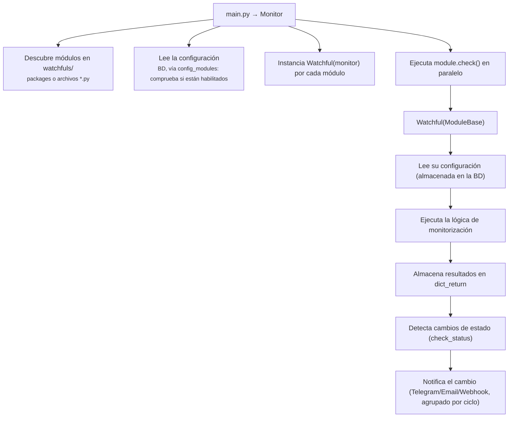

# Creación de un módulo de monitorización (Watchful)

Guía paso a paso para crear un módulo de monitorización desde cero en ServiceSentry.

---

## 1. Arquitectura general



### Jerarquía de clases

```text
ObjectBase          <- instancia de debug compartida
  +-- ModuleBase    <- configuración, rutas, dict_return, mensajería
        +-- Watchful  <- tu módulo concreto
```

---

## 2. Estructura de archivos

Para un módulo llamado `mi_modulo`, crea una carpeta package:

```text
watchfuls/
  +-- mi_modulo/
        +-- __init__.py       <- Implementación del módulo (obligatorio)
        +-- watchful.py       <- Alias: `from . import Watchful` (obligatorio)
        +-- schema.json       <- Schema de campos
        +-- info.json         <- Metadatos del módulo: icono y descripción
        +-- lang/
              +-- en_EN.json  <- Etiquetas de campos en inglés y nombre visible
              +-- es_ES.json  <- Etiquetas en español (u otros idiomas)
        +-- tests/
              +-- test_mi_modulo.py  <- Tests unitarios (recomendado)
```

No es necesario registrar el módulo en ningún sitio. El `Monitor` descubre
automáticamente cualquier carpeta con `__init__.py` dentro de `watchfuls/`.

---

## 3. Plantilla mínima de módulo

```python
#!/usr/bin/env python3
# -*- coding: utf-8 -*-
"""Módulo de monitorización: mi_modulo."""

import concurrent.futures
import json
import os

from lib.debug import DebugLevel
from lib.modules import ModuleBase

# Carga el schema de campos desde schema.json en la carpeta del package
_SCHEMA = json.load(open(os.path.join(os.path.dirname(__file__), 'schema.json'), encoding='utf-8'))


class Watchful(ModuleBase):
    """Monitoriza <descripción de lo que hace>."""

    # Schema cargado desde schema.json — define campos, tipos, valores por defecto y rangos.
    # La UI web lo usa para generar formularios y aplicar valores por defecto automáticamente.
    ITEM_SCHEMA = _SCHEMA

    # Atajo para acceder rápidamente a los valores por defecto.
    # Usa el helper de ModuleBase: salta las meta-claves __*__ y admite
    # los formatos rich ({default: …}) y simple ({campo: valor}).
    _DEFAULTS = ModuleBase._schema_defaults(_SCHEMA['list'])

    # Constantes del módulo (opcional)
    _MI_VALOR_DEFAULT = 42

    def __init__(self, monitor):
        super().__init__(monitor, __package__)
        # __package__ será 'watchfuls.mi_modulo' -> usado como name_module

        # Registrar herramientas del sistema si se necesitan
        # self.paths.set('miherramienta', '/usr/bin/miherramienta')

        # Estado interno (no persiste entre ciclos de monitorización)
        # self._fail_count: dict[str, int] = {}

    def check(self):
        """Punto de entrada principal. Ejecuta la lógica de monitorización."""

        # 1. Leer la lista de ítems configurados
        items = self._get_items()

        # 2. Ejecutar comprobaciones en paralelo
        self._run_checks(items)

        # 3. OBLIGATORIO: llamar a super().check() (registra el log de debug)
        super().check()

        # 4. OBLIGATORIO: devolver dict_return
        return self.dict_return

    # -- Métodos privados -------------------------------------------------

    def _get_items(self):
        """Parsea la configuración y devuelve los ítems habilitados."""
        result = []
        for key, value in self.get_conf('list', {}).items():
            if isinstance(value, bool):
                is_enabled = value
                target = key  # compatibilidad hacia atrás: la clave es el dato operativo
            elif isinstance(value, dict):
                is_enabled = value.get('enabled', self._DEFAULTS['enabled'])
                # El campo 'target' contiene el dato real; si está vacío,
                # se usa la clave como fallback (compatibilidad hacia atrás)
                target = (value.get('target', '') or '').strip() or key
            else:
                is_enabled = self._DEFAULTS['enabled']
                target = key

            self._debug(f"Ítem: {key} - Habilitado: {is_enabled}", DebugLevel.info)
            if is_enabled:
                result.append((key, target))

        return result

    def _run_checks(self, items):
        """Ejecuta las comprobaciones en paralelo usando ThreadPoolExecutor."""
        with concurrent.futures.ThreadPoolExecutor(
                max_workers=max(1, self.module_default('threads', self._default_threads))
        ) as executor:
            futures = {
                executor.submit(self._item_check, name, target): (name, target)
                for name, target in items
            }
            for future in concurrent.futures.as_completed(futures):
                name, target = futures[future]
                try:
                    future.result()
                except Exception as exc:
                    message = self._msg('mimod_error', name, exc)  # texto en lang/*.json → messages
                    self.dict_return.set(name, False, message)

    def _item_check(self, name, target):
        """Ejecuta la comprobación individual para un ítem."""
        timeout = self.get_conf_in_list('timeout', name, self._DEFAULTS['timeout'])

        # === Aquí va tu lógica de monitorización ===
        status, detail = self._do_check(target, timeout)

        # Construir el mensaje con _msg (textos en lang/*.json → sección messages)
        s_message = self._msg('mimod_ok', name) if status else self._msg('mimod_fail', name, detail)

        # Almacenar resultado (severity='warning' si es un aviso de umbral blando, '' si es caída)
        other_data = {'detail': detail}
        self.dict_return.set(name, status, s_message, False, other_data, name=name)

        # Notificar si el estado cambió
        if self.check_status(status, self.name_module, name):
            self.send_message(s_message, status, item=name)

    def _do_check(self, target, timeout):
        """Realiza la verificación real. Devuelve (status: bool, detail: str)."""
        # Implementa aquí tu lógica específica
        # Ejemplos:
        #   - Hacer una petición HTTP
        #   - Ejecutar un comando: stdout, stderr = self._run_cmd(cmd)
        #   - Conectar a un socket
        #   - Leer un archivo
        raise NotImplementedError("Implementa _do_check")
```

### schema.json

Crea `schema.json` en la raíz de la carpeta del package. Define los campos a
nivel de módulo y por ítem:

```json
{
    "__module__": {
        "enabled": {"type": "bool", "default": true},
        "threads": {"type": "int",  "default": 5, "min": 1, "max": 100}
    },
    "list": {
        "enabled": {"type": "bool", "default": true},
        "target":  {"type": "str",  "default": ""},
        "timeout": {"type": "int",  "default": 10, "min": 1, "max": 300}
    }
}
```

---

## 4. Referencia de campos (`schema.json`)

Los campos se declaran en `schema.json` en la raíz del package — no como dicts
Python inline. El archivo tiene una clave de primer nivel por **colección**:
`__module__` para ajustes a nivel de módulo y una clave por colección nombrada
(habitualmente `list`, a veces `remote` o `config`).

```json
{
    "__module__": {
        "enabled": {"type": "bool", "default": true},
        "threads": {"type": "int",  "default": 5, "min": 1, "max": 100}
    },
    "list": {
        "__field_order__": ["enabled", "label", "mode", "host", "port", "password"],
        "__group_when__": {
            "advanced": {"mode": ["ssh"]}
        },
        "__actions__": [
            {
                "id":        "test_conn",
                "url":       "/api/v1/modules/watchfuls/mi_modulo/test_connection",
                "extra":     {},
                "icon":      "bi-plug",
                "variant":   "info",
                "full_width": true,
                "result":    "toast"
            }
        ],
        "enabled":  {"type": "bool", "default": true},
        "label":    {"type": "str",  "default": "", "group": "connection"},
        "mode":     {"type": "str",  "default": "tcp", "options": ["tcp", "ssh"], "group": "connection"},
        "host":     {"type": "str",  "default": "", "show_when": {"mode": ["tcp", "ssh"]}, "group": "server"},
        "port":     {"type": "int",  "default": 3306, "min": 1, "max": 65535,
                     "show_when": {"mode": ["tcp", "ssh"]}, "group": "server"},
        "password": {"type": "str",  "default": "", "sensitive": true, "group": "server"},
        "db":       {"type": "str",  "default": "", "group": "server",
                     "input_action": {
                         "id":           "list_dbs",
                         "url":          "/api/v1/modules/watchfuls/mi_modulo/list_databases",
                         "extra":        {},
                         "icon":         "bi-database",
                         "result":       "field_picker",
                         "result_field": "db"
                     }}
    }
}
```

La clase Python carga el archivo una vez al importar y lo expone como `ITEM_SCHEMA`:

```python
_SCHEMA = json.load(open(os.path.join(os.path.dirname(__file__), 'schema.json'), encoding='utf-8'))

class Watchful(ModuleBase):
    ITEM_SCHEMA = _SCHEMA
    _DEFAULTS = {k: v['default'] for k, v in _SCHEMA['list'].items()
                 if not k.startswith('__')}
```

### Campos y meta-claves más comunes

Cada campo es un objeto con, como mínimo, `type` y `default`. Las propiedades más habituales:

| Propiedad | Descripción |
|-----------|-------------|
| `type` | `"bool"`, `"int"`, `"float"`, `"str"` o `"list"` (**obligatorio**) |
| `default` | Valor por defecto cuando el campo falta en la config (**obligatorio**) |
| `min` / `max` | Rango permitido para campos numéricos |
| `sensitive` | `true` → campo de contraseña (oculto en la UI); con nombre reservado, cifrado en reposo |
| `options` | Lista de valores permitidos para `str` → desplegable |
| `show_when` | `{campo: [valores]}` — visibilidad condicional según otro campo |

Además, las claves `__*__` de una colección (p. ej. `__field_order__`, `__group_when__`,
`__actions__`, `__discovery__`, `__discovery_field__`, `__key_mirrors_field__`) controlan el
comportamiento de la UI y **no** son campos de datos.

> **Referencia completa en [ref-schema-json.md](ref-schema-json.md).** Esta guía cubre lo esencial.
> Para funciones avanzadas consulta ref-schema-json.md: **sub-colecciones** (`type:
> "sub_collection"`), **placeholders** (`placeholder`/`placeholder_module`/
> `placeholder_map`/`zero_as_blank`), **descubrimiento enriquecido**
> (`__discovery_method__`, `__discovery_subtitle__`, `__discovery_type_field__`,
> `__discovery_category_field__`, `__discovery_categories__`,
> `__check_title_field__`, `__title_editable__`, `__discovery_label_template__`),
> opciones (`options_int`, `options_deps`), campos (`hidden`, `readonly`,
> `numericString`, `multi`, `nullable`, `inherit_blank`), historial (`__history__`)
> y **gating por dependencias** (`MISSING_DEPS`/`PARTIAL_DEPS` en la clase).

### Acciones de formulario (`__actions__`)

Cada acción en `__actions__` genera un botón en el formulario del ítem:

| Propiedad      | Tipo   | Descripción |
|----------------|--------|-------------|
| `id`           | str    | Identificador de la acción. Debe coincidir con una clave en `action_labels` del archivo de idioma |
| `url`          | str    | Endpoint al que se hace POST con el contenido actual del ítem |
| `extra`        | dict   | Campos extra añadidos al payload (p. ej. `{"_test_mode": "ssh"}`) |
| `icon`         | str    | Clase Bootstrap Icons (p. ej. `"bi-plug"`) |
| `variant`      | str    | Variante Bootstrap **sólida** del botón (p. ej. `"info"`, `"secondary"`, `"warning"`) |
| `full_width`   | bool   | Si `true`, el botón ocupa el 100 % del ancho disponible |
| `show_when`    | dict   | Igual que en campos: oculta el botón según el valor de otro campo |
| `group`        | str    | Si se especifica, el botón se inyecta dentro del bloque visual del grupo indicado (debajo del último campo de ese grupo) en lugar de al pie del formulario |
| `result`       | str    | Cómo mostrar la respuesta: `"toast"` (notificación emergente, por defecto/fallback), `"list"` (badges), `"field_picker"` (modal de selección), `"modal"` (modal genérico) o `"fields"` (rellena varios campos) |
| `result_field` | str    | Solo para `result: "field_picker"`: nombre del campo del ítem que se rellenará con el valor elegido |

### Acción inline en campo (`input_action`)

Un campo `str` puede tener un botón de icono acoplado como input-group Bootstrap:

```json
"db": {
    "type": "str",
    "default": "",
    "group": "server",
    "input_action": {
        "id":           "list_databases",
        "url":          "/api/v1/modules/watchfuls/datastore/list_databases",
        "extra":        {},
        "icon":         "bi-database",
        "result":       "field_picker",
        "result_field": "db"
    }
}
```

El botón hace POST al endpoint indicado, recibe `{"ok": true, "items": [...]}` y abre el modal `#fieldPickerModal` con la lista. Al seleccionar un valor se escribe directamente en el campo `db` del ítem.

### Archivos de idioma (`lang/*.json`)

Además de `pretty_name` y `labels`, los archivos de idioma pueden incluir:

```json
{
    "pretty_name": "Mi Módulo",
    "labels": {
        "enabled": "Habilitado",
        "mode":    "Modo",
        "host":    "Host"
    },
    "hints": {
        "mode": "Cómo conectar al servidor: TCP directo o túnel SSH.",
        "host": "Dirección IP o hostname del servidor."
    },
    "options": {},
    "option_labels": {
        "mode": {
            "tcp": "TCP directo",
            "ssh": "Túnel SSH"
        }
    },
    "group_labels": {
        "connection": "Conexión",
        "server":     "Servidor"
    },
    "action_labels": {
        "test_conn":  "Probar conexión",
        "list_dbs":   "Listar bases de datos"
    },
    "collections": {"list": "Servidores"}
}
```

| Sección | Descripción |
|---------|-------------|
| `labels` | Etiqueta visible de cada campo |
| `hints` | Texto de ayuda que aparece bajo el campo en la UI |
| `option_labels` | Etiquetas de las opciones de campos con `options` (desplegables) |
| `group_labels` | Nombre visible de cada grupo visual |
| `action_labels` | Etiqueta del botón de cada acción (`__actions__` e `input_action`) |
| `collections` | Nombre del grupo de colección (p. ej. `"list": "Servidores"`) |
| `messages` | Textos de **notificación** del módulo, resueltos con `self._msg('clave', …)`. `{}` posicional (`{}` secuencial e indexado `{0}`/`{1}`); admiten override del admin por idioma |
| `messages_vars` | Esquema de **tags** de cada texto de `messages`: `{clave: [nombre, …]}` — el hook que descubre los placeholders para el editor. Tantos nombres como `{}` tenga el texto, en ambos idiomas |
| `rename_item_prompt` | Texto personalizado para el modal de renombrar ítem (reemplaza el texto genérico). Ejemplo: `"Introduce el nuevo nombre de host:"` |
| `new_item_key_label` | Etiqueta personalizada para el campo de clave en el modal de nuevo ítem. Ejemplo: `"Nombre de host o identificador:"` |

---

## 4b. Classmethods de integración con la UI

La UI web puede invocar métodos de clase del módulo a través de un endpoint REST genérico:

```text
GET|POST /api/v1/modules/watchfuls/<module_name>/<action>
```

Para exponer un classmethod como acción web, debes añadir su nombre a la variable de clase `WATCHFUL_ACTIONS`:

```python
class Watchful(ModuleBase):
    WATCHFUL_ACTIONS: frozenset[str] = frozenset({'test_connection', 'list_databases'})
```

Solo los métodos listados en `WATCHFUL_ACTIONS` son accesibles desde la UI. Cualquier petición a un nombre de acción no incluido recibe un `404`. La base `ModuleBase` define por defecto `WATCHFUL_ACTIONS = frozenset()` (ninguna acción expuesta).

### `READ_ONLY_ACTIONS`

Subconjunto de `WATCHFUL_ACTIONS` para acciones que no producen efectos secundarios. Las acciones aquí listadas no generan entrada en el **log de auditoría**, lo que evita ruido en el registro por consultas frecuentes.

```python
class Watchful(ModuleBase):
    WATCHFUL_ACTIONS: frozenset[str] = frozenset({
        'discover', 'list_items', 'get_details', 'test_connection',
    })
    READ_ONLY_ACTIONS: frozenset[str] = frozenset({
        'discover', 'list_items', 'get_details',
    })
```

### `audit_detail(cls, action, result) → dict | None`

Classmethod hook para personalizar las entradas del log de auditoría. Si está definido, el route handler lo llama después de cada acción no incluida en `READ_ONLY_ACTIONS`.

- Devolver un `dict` con campos extra que se fusionan en la entrada de auditoría.
- Devolver `None` para suprimir la entrada completamente (útil para polls intermedios).

```python
@classmethod
def audit_detail(cls, action: str, result: dict) -> dict | None:
    # Suprimir polls intermedios de un job en curso
    if action == 'compile_status' and result.get('done') is False:
        return None
    # Para la acción final, enriquecer la entrada
    if result.get('done'):
        return {
            'ok':      result.get('result_ok', True),
            'compiled': result.get('compiled', 0),
            'name':    f"{result.get('total', 0)} items processed",
        }
    return {'ok': result.get('ok', True), 'name': action}
```

Si el módulo no define `audit_detail`, el route handler genera una entrada genérica con `{module, action, ok}`.

### `WATCHFUL_TOOLBAR`

Tupla de definiciones de botones para la barra de herramientas del card del módulo en la UI. Cada botón llama a una función JS al pulsarlo, pasando el nombre del módulo como argumento.

```python
class Watchful(ModuleBase):
    WATCHFUL_TOOLBAR: tuple[dict, ...] = (
        {
            'icon':      'bi-database-gear',
            'label_key': 'file_manager',      # clave en lang/*.json → ui.file_manager
            'onclick':   'openFileManagerModal',  # función JS global
        },
        {
            'icon':      'bi-diagram-3',
            'label_key': 'mib_browser',
            'onclick':   'openMibBrowserModal',
        },
    )
```

`module_base.py` propaga esta tupla al schema como `__toolbar__`. La UI itera el array genéricamente — no hay lógica específica de módulo en el código del dashboard. La función JS especificada en `onclick` debe ser global y aceptar el nombre del módulo como primer argumento.

> Seguridad: el route handler valida que `onclick` sea un identificador JS válido (`^[a-zA-Z_$][a-zA-Z0-9_$]*$`) antes de renderizarlo.

| Módulo | `WATCHFUL_ACTIONS` |
|--------|-------------------|
| `datastore` | `{'test_connection', 'list_databases'}` |
| `service_status` | `{'discover'}` |
| `filesystemusage` | `{'discover'}` |
| `temperature` | `{'discover'}` |

---

### `test_connection(config: dict) -> dict`

Invocado por `POST /api/v1/modules/watchfuls/<modulo>/test_connection`. Recibe los datos del formulario del ítem y devuelve `{"ok": bool, "message": str}`.

```python
@classmethod
def test_connection(cls, config: dict) -> dict:
    try:
        # ... lógica de prueba ...
        return {"ok": True, "message": "Conexión correcta"}
    except Exception as exc:
        return {"ok": False, "message": str(exc)}
```

El resultado se muestra como un toast en la UI. La acción queda registrada en el **log de auditoría** bajo el evento `watchful_action`.

### `list_databases(config: dict) -> dict`

Invocado por `POST /api/v1/modules/watchfuls/<modulo>/list_databases`. Devuelve `{"ok": bool, "items": list[str]}`.

```python
@classmethod
def list_databases(cls, config: dict) -> dict:
    try:
        dbs = [...]  # lista de nombres
        return {"ok": True, "items": dbs}
    except Exception as exc:
        return {"ok": False, "items": [], "message": str(exc)}
```

La acción queda registrada en el **log de auditoría** bajo el evento `watchful_action`.

### `discover(config=None) -> list[dict]`

Invocado por el endpoint de la acción `discover` (que debe estar en
`WATCHFUL_ACTIONS`). Por defecto la UI hace **GET** y el método se llama **sin
argumentos**; si el `schema.json` declara `"__discovery_method__": "POST"`, la UI
hace POST y el método recibe la **configuración del módulo** como `dict` (acepta
`config=None`). Devuelve una lista de ítems descubiertos (servicios, particiones,
sensores…). La UI los muestra en el modal de descubrimiento para incorporarlos con
un clic.

```python
@classmethod
def discover(cls, config=None) -> list[dict]:
    return [
        {"name": "item1", "display_name": "Nombre visible", "status": True},
    ]
```

Cada ítem usa **`name`** (identificador que se guarda como clave/valor del ítem) y
**`display_name`** (texto visible). `status` (bool) es opcional. Campos extra
(`type`, categoría…) los consumen las meta-claves `__discovery_*__` para enriquecer
el modal (badges de tipo/categoría, subtítulos) — ver [ref-schema-json.md](ref-schema-json.md).

---

## 4c. Tablas propias en la base de datos general

Un módulo puede declarar tablas propias (cachés, índices derivados, estado) en
la **base de datos general** de la aplicación en lugar de inventar su propio
almacenamiento; el gestor de BD las crea/migra en el arranque con el mismo motor
declarativo que las tablas core.

> El mecanismo completo (namespacing `mod_<modulo>_<nombre>`, reconciliación,
> arranque de web y monitor) está en
> [explica-descubrimiento.md](explica-descubrimiento.md). Aquí basta con lo que
> escribe el autor del módulo.

**1. Declarar las tablas** con una función a nivel de módulo `discover_db_tables()`,
que construye cada `TableSpec` con `module_table(...)`:

```python
# watchfuls/mi_modulo/__init__.py
from lib.db.module_tables import module_table
from lib.db.schema import Column, Index

def discover_db_tables():
    return [module_table('mi_modulo', 'cache', (
        Column('clave', 'TEXT', nullable=False, unique=True),
        Column('valor', 'TEXT'),
    ), indexes=(Index('por_clave', ('clave',)),))]
```

**2. Usar el conector en runtime** — hay dos contextos:

- **Monitor** (en `check()`, arranque del módulo…): `self.db` devuelve el
  conector compartido (`lib.db.BaseConnector`), o `None` si no está disponible.
- **Web** (classmethods de acción): el route inyecta el conector en
  `config['__connector__']`.

```python
# contexto monitor
self.db.execute("INSERT INTO mod_mi_modulo_cache (clave, valor) VALUES (?, ?)", (k, v))
self.db.commit()

# contexto web (classmethod de acción)
@classmethod
def mi_accion(cls, config):
    db = config.get('__connector__')
    rows = db.fetchall("SELECT clave, valor FROM mod_mi_modulo_cache")
    ...
```

Usa siempre `?` como placeholder (los conectores lo traducen al estilo nativo) y
`with db.transaction():` para escrituras multi-sentencia portables entre
backends.

> Nota: la BD general es ideal para datos del despliegue. Para **caché derivada
> de ficheros locales** por instancia (p. ej. dependiente de `var_dir`), ten en
> cuenta que una BD remota compartida entre varias instancias mezclaría filas;
> en ese caso añade una columna de instancia o mantén la caché local.

---

## 4d. Config host-céntrica (vincular checks a un host)

Por defecto cada módulo define la conexión **dentro de cada ítem** (host, puerto,
credenciales…). Para no repetir el mismo servidor en varios módulos, un módulo
puede declararse **host-capaz**: sus campos de conexión pasan a un **Host**
(definido una vez en la sección *Servers*) y los checks lo referencian por
`host_uid`, heredando dirección + credenciales en tiempo de ejecución.

**1. Declarar `__host_profile__` en `schema.json`** (a nivel raíz, hermano de
`__module__`). Indica el protocolo, qué campo recibe la dirección del host
(`address_field`) y qué campos son de conexión (van al perfil del host):

```json
"__host_profile__": {"key": "snmp", "address_field": "host",
    "fields": ["host", "port", "version", "community",
               "snmpv3_username", "snmpv3_auth_key", "snmpv3_priv_key",
               "snmpv3_auth_protocol", "snmpv3_priv_protocol", "timeout", "retries"]},
```

Puede ser una **lista** de specs para módulos con varios protocolos (p. ej.
`datastore` declara `db` + `ssh`). Solo los specs con `address_field` reciben la
dirección del host; el resto aportan sus campos de perfil. `__host_profile__` es
metadata (no una colección): `discover_schemas` y la UI lo ignoran como tal.

**2. Resolver en el `check()`** con `self.resolve_host(item)`: si el ítem (o, en
SNMP, el *server*) tiene `host_uid`, devuelve una copia con `address` + el perfil
del protocolo fusionados (gana el host); si no, devuelve el ítem igual (los
checks *inline* clásicos siguen funcionando — coexistencia):

```python
def check(self):
    for key, value in self.get_conf('list', {}).items():
        item = self.resolve_host(value)          # no-op si es inline
        host = item.get('host')                  # viene del host si está vinculado
        ...
```

Para módulos que leen campo-a-campo (`get_conf_in_list`), cachea el ítem resuelto
por cycle y lee de él (patrón `_resolved_item` en `datastore`/`web`).

> **Qué cubre el host, dónde se almacena y cómo se cifra** (el host posee *cómo
> conectar*, el ítem *qué comprobar*; la UI oculta los campos de conexión al
> vincular; los hosts viven en `HostsStore` con los secretos cifrados) está en
> [explica-hosts.md](explica-hosts.md).

**Cuándo NO declararlo.** Si el "target" del módulo no es un servidor con
conexión/credenciales sino un sujeto de la comprobación (p. ej. **dns**, cuyo
target es un dominio a resolver), **no** declares `__host_profile__`: el módulo
se queda inline-only.

---

## 5. Referencia de la API de ModuleBase

### Configuración

| Método | Propósito | Ejemplo |
|--------|-----------|---------|
| `get_conf(key, default)` | Leer configuración a nivel de módulo | `self.get_conf('timeout', 10)` |
| `module_default(field, fallback)` | Resolver un ajuste de módulo (`threads`, `timeout`…) por la cadena ítem→módulo→global. Devuelve el valor del módulo si está; si el campo está en blanco, hereda el global `modules\|<field>` de `config.json`; si no existe, el default del schema. Siempre devuelve `int` | `self.module_default('threads', self._default_threads)` |
| `get_conf_in_list(field, item_key, default)` | Leer un campo de un ítem de la colección `list` | `self.get_conf_in_list('port', 'mibd', 3306)` |
| `get_conf_in_list(field, item_key, default, key_name_list='config')` | Leer un campo de una colección distinta a `list` | `self.get_conf_in_list('alert', 'ram', 80, 'config')` |
| `_parse_conf_int(value, default, min_val=1)` | Parsear a entero (descarta valores < `min_val`) | `self._parse_conf_int('5', 0)` |
| `_parse_conf_float(value, default, min_val=0)` | Parsear a flotante (descarta valores ≤ `min_val`) | `self._parse_conf_float('3.14', 0.0)` |
| `_parse_conf_str(value, default='')` | Parsear a string (descarta cadenas vacías) | `self._parse_conf_str(val, 'localhost')` |

**`key_name_list`** — por defecto `"list"`. Úsalo cuando tu módulo usa la colección `config` en lugar de `list` (p. ej. módulos sin ítems individuales como `ram_swap`):

```python
alert = self.get_conf_in_list('alert', 'ram', 80, key_name_list='config')
```

**`select_module`** — `get_conf()` acepta un parámetro adicional `select_module` para leer la configuración de otro módulo. No es necesario en el uso habitual; si se omite, se usa el módulo actual:

```python
ping_timeout = self.get_conf('timeout', 5, select_module='watchfuls.ping')
```

### Resultados

```python
self.dict_return.set(key, status, message, send_msg=False, other_data=None,
                     severity=None, name='')
```

| Parámetro | Tipo | Descripción |
|-----------|------|-------------|
| `key` | str | Nombre/ID del ítem — se usa como clave en el dict de resultados y en la tabla `check_state`. En módulos host-céntricos suele ser el `host_uid` (un UID, no legible) |
| `status` | bool | `True` = OK, `False` = Error |
| `message` | str | Texto del resultado. Se envía **en texto plano** en las notificaciones (el Markdown de Telegram se elimina, ya que se rompía al agrupar) — no incrustes `*`/`_` esperando formato |
| `send_msg` | bool | `False` (por defecto) — no enviar el mensaje automáticamente. Usa `send_message()` después de `check_status()` para controlar cuándo se envía |
| `other_data` | dict | Datos extra que se almacenan en `check_state` junto al resultado. Accesibles en la página pública `/status` bajo la clave `extra` de cada ítem |
| `severity` | str | Severidad de un estado no-OK: `'warning'` (aviso, amarillo → kind `warn`) o `'error'` (por defecto). Los OK llevan `''` |
| `name` | str | **Nombre amigable del ítem** para las notificaciones (p.ej. `PVE04`). Rellena la columna *Item* del digest; sin él, el monitor intenta resolver `host_uid → nombre`. Pásalo siempre que tengas el label del host/servicio |

**`other_data` en la API de estado:** lo que pases en `other_data` aparece como `extra` en la respuesta de la página `/status`:

```python
# En el módulo:
self.dict_return.set('Mi Servidor', False, 'Error', other_data={'message': 'Connection refused', 'latency_ms': 120})

# En la respuesta /status:
# {
#   "name": "Mi Servidor",
#   "ok": false,
#   "extra": {"message": "Connection refused", "latency_ms": 120}
# }
```

#### Métodos adicionales de `dict_return`

| Método | Descripción |
| --- | --- |
| `update(key, option, value)` | Actualiza un campo de un resultado ya guardado. `option` puede ser `"status"`, `"message"`, `"send"` o `"other_data"` |
| `get(key) -> dict` | Devuelve el dict completo de un resultado (`{"status": ..., "message": ..., "send": ..., "other_data": ...}`) |
| `get_status(key) -> bool` | Devuelve solo el campo `status` de un resultado |
| `get_message(key) -> str` | Devuelve solo el campo `message` |
| `get_name(key) -> str` | Devuelve el nombre amigable del ítem (`''` si no se pasó `name=`) |
| `get_other_data(key) -> dict` | Devuelve solo el campo `other_data` |
| `is_exist(key) -> bool` | Comprueba si ya existe un resultado para esa clave |
| `remove(key) -> bool` | Elimina un resultado del dict |
| `items()` | Itera sobre todos los resultados como pares `(key, dict)` — equivale a `dict.items()` |
| `keys()` | Devuelve las claves de todos los resultados registrados |
| `count` | Número de resultados almacenados (propiedad, no método) |

```python
# Corregir el mensaje de un resultado ya registrado
self.dict_return.set('Mi Servidor', False, 'Error inicial')
# ... más lógica ...
self.dict_return.update('Mi Servidor', 'message', 'Error definitivo')

# Leer el estado registrado antes de notificar
if self.dict_return.get_status('Mi Servidor'):
    self.send_message('OK', True)
```

### Estado y notificaciones

#### `check_status(status, module_name, key) -> bool`

Devuelve `True` si el estado del ítem **cambió** respecto al ciclo anterior. Solo en ese caso se debe enviar notificación.

```python
if self.check_status(ok, self.name_module, 'Mi Servidor'):
    self.send_message(s_message, ok)
```

**Primera ejecución:** si el ítem no existe aún en `check_state`, se asume que el estado anterior era `None`. Como `None != cualquier_bool`, el primer ciclo **siempre** devuelve `True` y notifica — independientemente de si el estado es OK o Error. Esto garantiza que al arrancar el sistema se recibe un informe inicial del estado actual.

#### `check_status_custom(status, key, status_msg) -> bool`

Como `check_status`, pero también devuelve `True` cuando el estado sigue siendo `False` (error) pero el **mensaje de error ha cambiado**. Útil cuando el tipo de fallo importa.

```python
# Escenario: ayer era "Connection refused", hoy es "Access denied"
# → ambos son False, pero el problema cambió → notificar igualmente
if self.check_status_custom(ok, 'Mi Servidor', error_msg):
    self.send_message(s_message, ok)
```

Lógica interna:
1. Si el estado actual es `True` (OK), o el estado **cambió** → se comporta igual que `check_status`
2. Si ambos estados son `False` (error persistente) → compara el campo `other_data.message` del ciclo anterior con `status_msg`. Si difieren, devuelve `True`

> Usa `check_status_custom` cuando pasas el mensaje de error en `other_data={'message': ...}` y quieres que un cambio de tipo de error genere una nueva notificación.

#### `send_message(message, status=None, item='', severity='')`

Emite una alerta ad-hoc por las notificaciones (Telegram / Email / Webhook / Teams, según la
matriz de routing) — no solo Telegram. El `status` y la `severity` fijan el *kind* (y con
ello la zona del digest y el color):

| `status` | `severity` | kind | Zona del digest / color |
|---|---|---|---|
| `True` | — | `recovery` | **Recuperados** (verde) |
| `False` | `'warning'` | `warn` | **Con problemas** (ámbar — umbral blando) |
| `False` | `''` (resto) | `down` | **Con problemas** (rojo — caída) |

Pasa **`item`** con el nombre amigable del host/servicio para rellenar la columna *Item* del
digest (equivale a `name=` en `dict_return.set`); sin él, la fila sale sin nombre. El mensaje
se envía en **texto plano** (el Markdown se elimina al agrupar por ciclo). El mapeo
`(status, severity) → kind` lo hace `Monitor._alert_kind`; ver
[explica-notificaciones.md → Severidad warning](explica-notificaciones.md#severidad-warning).

> Nota: los watchfuls host-céntricos que devuelven el resultado con `dict_return.set(...,
> send_msg=True)` notifican por esa vía (estructurada) — ahí el nombre va en `name=` y la
> severidad en `severity=`. `send_message()` es para el patrón `set(send_msg=False)` +
> notificación manual.

#### `_msg(key, *args)` — textos de notificación traducibles

**La forma correcta de construir el texto de una notificación** no es concatenar cadenas
inline (`'OK'` / `f'MiModulo: *{name}*'`) — que además incrustan `*` de Markdown que hoy se
elimina — sino declarar el texto en el fichero de idioma del módulo y resolverlo con
`self._msg('clave', arg1, arg2, …)`.

`_msg` resuelve el texto (override del admin → sección `messages` del `lang/<lang>.json`
→ la propia clave) y rellena los placeholders **posicionalmente** (`{}` secuencial e
indexado `{0}`/`{1}`…).

Declara los textos y sus **tags** en cada `lang/<lang>.json` del módulo:

```json
"messages": {
    "cpu_ok":   "CPU ({}) uso normal {}% ✅",
    "cpu_high": "CPU ({}) uso excesivo {}% ⚠️"
},
"messages_vars": {
    "cpu_ok":   ["host", "uso %"],
    "cpu_high": ["host", "uso %"]
}
```

`messages_vars` mapea cada clave a los nombres de sus placeholders (tantos tags como `{}`
haya, en **ambos** idiomas). El esquema de tags, la capa de resolución y el editor de textos
están en [ref-i18n.md](ref-i18n.md). Uso en el `check()`:

```python
status = used < alert
msg = self._msg('cpu_ok' if status else 'cpu_high', host, used)
self.dict_return.set(key, status, msg, severity='' if status else 'warning', name=host)
if self.check_status(status, self.name_module, key):
    self.send_message(msg, status, item=host, severity='' if status else 'warning')
```

Los 19 módulos incluidos ya usan este mecanismo. Detalle completo (capa de resolución,
catálogo, esquema de tags, editor) en
[explica-notificaciones.md → Sistema de textos de notificación](explica-notificaciones.md#sistema-de-textos-de-notificación-plantillas-listados-y-tags).

### Herramientas del sistema

#### `self.paths` — registro de rutas

`DictFilesPath` es un registro clave→ruta para herramientas del sistema. Permite que el módulo declare qué ficheros o ejecutables necesita sin harcodear rutas.

```python
# En __init__:
self.paths.set('mdstat', '/proc/mdstat')
self.paths.set('tool', '/usr/bin/mi_herramienta')

# En el resto del módulo:
path = self.paths.find('mdstat')          # devuelve '/proc/mdstat'
path = self.paths.find('missing', '/tmp') # devuelve '/tmp' si no existe
```

#### `self._run_cmd(cmd, return_str_err=False, return_exit_code=False)`

Ejecuta un comando local y devuelve su salida.

| `return_str_err` | `return_exit_code` | Retorno |
|:-:|:-:|---------|
| `False` | `False` | `stdout: str` |
| `True` | `False` | `(stdout, stderr)` |
| `False` | `True` | `(stdout, exit_code)` |
| `True` | `True` | `(stdout, stderr, exit_code)` |

```python
# Solo stdout
output = self._run_cmd('systemctl status nginx')

# Con stderr
out, err = self._run_cmd('cat /proc/mdstat', return_str_err=True)

# Con código de salida
out, code = self._run_cmd('ping -c 1 8.8.8.8', return_exit_code=True)
ok = (code == 0)
```

Para ejecución **remota por SSH** usa directamente `Exec` — ver sección 5b.

### `SUPPORTED_PLATFORMS` — guardia de plataforma a nivel de módulo

Si tu módulo solo funciona en determinadas plataformas, declara esta variable de clase:

```python
class Watchful(ModuleBase):
    SUPPORTED_PLATFORMS = ('linux',)   # solo Linux
```

Cuando la plataforma actual no está en la lista, **la colección entera del módulo** se muestra en la UI con un badge "No compatible" en lugar de formularios interactivos. Los módulos `temperature` y `raid` (campo `local`) usan este mecanismo.

Para restringir **solo un campo** (no el módulo entero), usa `supported_platforms` en `schema.json` — ver [`ref-schema-json.md`](ref-schema-json.md#supported_platforms).

### Debug

Todos los niveles disponibles de `DebugLevel`:

| Nivel | Valor | Uso recomendado |
|-------|:-----:|-----------------|
| `null` | 0 | Sin nivel (desactivado) |
| `debug` | 1 | Trazas detalladas de ejecución interna |
| `info` | 2 | Información general del ciclo |
| `warning` | 3 | Advertencias no críticas (degradado, umbral superado) |
| `error` | 4 | Errores recuperables |
| `emergency` | 5 | Errores críticos irrecuperables |

```python
self._debug("Iniciando check", DebugLevel.info)
self._debug(f"Resultado raw: {raw}", DebugLevel.debug)
self._debug("Umbral superado", DebugLevel.warning)
self._debug(f"Error al conectar: {exc}", DebugLevel.error)
```

---

## 5b. Ejecución de comandos (`_run_cmd` y `Exec`)

### Comandos locales — `_run_cmd`

Para comandos locales simples usa el método heredado de `ModuleBase` (ver sección 5 arriba). Internamente usa `Exec.execute()`.

### Comandos locales y remotos — `Exec` / `ExecResult`

Para control completo — especialmente ejecución remota por SSH — usa directamente la clase `Exec` de `lib`:

```python
from lib import Exec, ExecResult
```

#### `ExecResult` — estructura del resultado

Todos los métodos de `Exec` devuelven un `ExecResult`:

| Atributo | Tipo | Descripción |
|----------|------|-------------|
| `.out` | `str \| None` | Salida estándar (stdout) |
| `.err` | `str \| None` | Salida de error (stderr) |
| `.code` | `int \| None` | Código de salida del proceso (`None` si no arrancó) |
| `.exception` | `Exception \| None` | Excepción capturada si el comando no pudo ejecutarse |

Comprueba siempre `.exception` antes de usar `.out`:

```python
result = Exec.execute('cat /proc/mdstat')
if result.exception:
    return False, f'Error: {result.exception}'
stdout = result.out or ''
```

#### Ejecución local

```python
# Forma estática (más común)
result = Exec.execute('systemctl status nginx')
print(result.out)   # stdout
print(result.code)  # 0 = OK, distinto de 0 = fallo

# Equivalente usando _run_cmd (solo stdout)
output = self._run_cmd('systemctl status nginx')
```

#### Ejecución remota por SSH

```python
# Con contraseña
result = Exec.execute(
    command='cat /proc/mdstat',
    host='192.168.1.10',
    port=22,
    user='root',
    password='mi_pass',
    timeout=30.0,
)

# Con clave privada (recomendado)
result = Exec.execute(
    command='df -h',
    host='192.168.1.10',
    port=22,
    user='root',
    key_file='/home/user/.ssh/id_rsa',
)

if result.exception:
    return False, f'SSH error: {result.exception}'
if result.err:
    return False, f'Remote error: {result.err}'
output = result.out or ''
```

#### API orientada a objetos (para múltiples comandos al mismo host)

```python
from lib.system.exe import Exec   # (o `from lib import Exec`)

runner = Exec()
runner.set_remote(
    host='192.168.1.10',
    port=22,
    user='root',
    key_file='/home/user/.ssh/id_rsa',
    timeout=15.0,
)

runner.command = 'uptime'
r1 = runner.start()

runner.command = 'df -h /'
r2 = runner.start()
```

`set_remote()` parámetros:

| Parámetro | Tipo | Por defecto | Descripción |
|-----------|------|-------------|-------------|
| `host` | str | `""` | Hostname o IP del servidor remoto |
| `port` | int | `22` | Puerto SSH |
| `user` | str | `"root"` | Usuario SSH |
| `password` | str\|None | `None` | Contraseña (usar solo si no hay clave) |
| `key_file` | str\|None | `None` | Ruta al fichero de clave privada |
| `timeout` | float\|None | `None` | Timeout en segundos (mantiene el valor actual si `None`) |

---

## 5c. Utilidades Linux (`lib/system/linux/`)

Utilidades para módulos que monitorizan hardware Linux específico. Solo disponibles en plataformas Linux.

### `ThermalInfoCollection` — sensores térmicos

Lee los sensores de `/sys/class/thermal/thermal_zone*`.

```python
from lib.system.linux import ThermalInfoCollection

# Detectar automáticamente todos los sensores
col = ThermalInfoCollection(autodetect=True)

print(col.count)          # número de sensores encontrados
for node in col.nodes:    # lista de ThermalNode
    print(node.dev)       # "thermal_zone0", "thermal_zone1", …
    print(node.type)      # "x86_pkg_temp", "acpitz", …
    print(node.temp)      # temperatura en °C como float
```

```python
# Detección manual (por si necesitas controlar el momento)
col = ThermalInfoCollection()
col.detect()
col.clear()   # vacía la lista para volver a detectar
```

Cada `ThermalNode` expone:

| Propiedad | Tipo | Descripción |
|-----------|------|-------------|
| `.dev` | str | Nombre del dispositivo (`thermal_zone0`, …) |
| `.type` | str | Tipo del sensor (`x86_pkg_temp`, `acpitz`, …) |
| `.temp` | float | Temperatura actual en °C |

### `RaidMdstat` — estado de arrays RAID

Parsea `/proc/mdstat` local o remoto (vía SSH).

```python
from lib.system.linux import RaidMdstat

# ── Local ──────────────────────────────────────────────────
md = RaidMdstat()
if md.is_exist:
    status = md.read_status()

# ── Remoto vía SSH ─────────────────────────────────────────
md = RaidMdstat(
    host='192.168.1.10',
    port=22,
    user='root',
    key_file='/path/to/id_rsa',   # o password='...'
    timeout=30,
)
if md.is_exist:
    status = md.read_status()
```

`RaidMdstat()` acepta un primer argumento opcional `mdstat` para usar una ruta alternativa en lugar de `/proc/mdstat` (útil en tests).

#### Resultado de `read_status()`

Devuelve un `dict[str, dict]` con un entry por array:

```python
{
    'md0': {
        'status': 'active',          # estado del array
        'type':   'raid1',           # tipo RAID
        'disk':   ['sda1', 'sdb1'],  # discos miembro
        'blocks': '1953381376',      # bloques totales
        'update': RaidMdstat.UpdateStatus.ok,

        # Solo si hay recovery en curso:
        'recovery': {
            'percent': 23.4,
            'blocks':  ['227033088', '975690432'],
            'finish':  '63.5min',
            'speed':   '234560K/sec',
        }
    }
}
```

#### `RaidMdstat.UpdateStatus`

| Valor | Descripción |
|-------|-------------|
| `ok` | Array saludable — todos los discos activos |
| `error` | Array degradado — algún disco falla |
| `recovery` | Array reconstruyéndose |
| `unknown` | Estado no reconocido |

```python
update = status['md0'].get('update', RaidMdstat.UpdateStatus.unknown)
is_ok = (update == RaidMdstat.UpdateStatus.ok)
```

---

## 6. Configuración del módulo

La configuración de los módulos se almacena en la **base de datos** (tablas
`module_config` + `module_config_items`). El `Monitor` la lee a través de `config_modules`
(una fachada `DbBackedModules` sobre el almacén) para decidir qué módulos están
habilitados y con qué configuración. El modelo de desarrollo no cambia: sigues
leyendo con `self.get_conf(...)` y el siguiente dict es la estructura que editas
en la UI y la que devuelve `get_conf`:

```json
{
    "mi_modulo": {
        "enabled": true,
        "threads": 5,
        "timeout": 10,
        "list": {
            "Servidor Principal": {
                "enabled": true,
                "target": "192.168.1.100",
                "timeout": 5
            },
            "Servidor de Backup": {
                "enabled": true,
                "target": "192.168.1.200"
            },
            "192.168.1.50": true
        }
    }
}
```

### Modelo de datos de un ítem

La **clave del diccionario** es el **nombre descriptivo** del ítem (mostrado
como título en la UI y en los mensajes de Telegram).

El **dato operativo** (IP, URL, nombre del servicio…) va en un **campo dentro
del dict del ítem** (p. ej. `target`, `host`, `url`, `service`).

Por **compatibilidad hacia atrás**, si el campo operativo está vacío o ausente,
se usa la clave como valor operativo.

```python
# Formato nuevo (recomendado)
"Mi Router": {"enabled": true, "host": "192.168.1.1", "timeout": 2}

# Formato simple (compat. hacia atrás)
"192.168.1.1": true

# Formato simple con dict (compat. hacia atrás)
"192.168.1.1": {"enabled": true, "timeout": 2}
```

### Valores sensibles — prefijo `enc:`

Los campos marcados como `sensitive: true` en `schema.json` (contraseñas, tokens, claves SSH) se guardan cifrados en la configuración del módulo (BD) con el prefijo `enc:`:

```json
{
    "datastore": {
        "list": {
            "Mi BD": {
                "enabled": true,
                "db_type": "mysql",
                "host": "192.168.1.10",
                "user": "root",
                "password": "enc:gAAAAABl..."
            }
        }
    }
}
```

**No tienes que manejar este prefijo en tu código.** El `Monitor` descifra todos los valores `enc:` automáticamente antes de construir la configuración. Cuando tu módulo llama a `self.get_conf()` o `self.get_conf_in_list()`, recibe siempre el valor en texto plano.

Hay dos mecanismos independientes:

| Mecanismo | Cómo activarlo | Efecto |
| --- | --- | --- |
| **Campo contraseña en UI** | `"sensitive": true` en `schema.json` | El campo se renderiza como `<input type="password">` — el valor queda oculto en pantalla |
| **Cifrado en reposo** | El nombre del campo debe ser `password`, `ssh_password`, `token` o `secret` | El valor se guarda con prefijo `enc:` en la configuración del módulo (BD) y se descifra automáticamente al leerlo |

Si añades un campo sensible con un nombre distinto a esos cuatro (p. ej. `api_key`), márcalo con `"sensitive": true` — la UI lo ocultará visualmente — pero **no se cifrará en reposo** a menos que el nombre esté en `ENCRYPT_KEYS`. Para cifrado en reposo, usa uno de los cuatro nombres reservados.

---

## 7. Cómo se descubren los módulos

```text
watchfuls/
  |-- ping/             <- package descubierto -> importlib.import_module('watchfuls.ping')
  |    |-- __init__.py  <- implementación
  |    +-- watchful.py  <- alias
  |-- web/              <- package descubierto
  |-- service_status/   <- package descubierto
  +-- mi_modulo/        <- ¡descubierto automáticamente!
       +-- __init__.py
```

El `Monitor`:
1. Escanea `watchfuls/` en busca de subdirectorios con `__init__.py` (packages)
2. También descubre módulos legacy `watchfuls/*.py` de archivo único
3. Comprueba `config_modules.get_conf([mi_modulo, "enabled"])` (por defecto: `True`)
4. Usa `importlib.import_module('watchfuls.mi_modulo')`
5. Instancia `Watchful(monitor)`
6. Llama a `check()`

---

## 8. Personalización en la UI web

### Icono y descripción del módulo

Se definen en `info.json` en la raíz del package del módulo:

```json
{
    "name": "mi_modulo",
    "version": "1.0.0",
    "description": "Descripción breve de lo que hace el módulo.",
    "icon": "🔍",
    "dependencies": []
}
```

### Etiquetas de campos e i18n

Crea archivos `lang/en_EN.json` y `lang/es_ES.json` con el nombre visible
del módulo y las etiquetas de cada campo:

```json
{
    "pretty_name": "Mi Módulo",
    "labels": {
        "enabled": "Habilitado",
        "target":  "Dirección destino",
        "timeout": "Tiempo máximo (s)"
    }
}
```

El sistema multilanguage es automático: `ModuleBase.discover_schemas()` fusiona
estos archivos con `schema.json` e `info.json` al arrancar, y la UI los usa
sin ninguna configuración adicional.

> **Documentación completa del sistema i18n** → [explica-i18n.md](explica-i18n.md)
> (arquitectura de dos niveles, pipeline de `discover_schemas`, resolución de
> etiquetas en el navegador, constantes JS, cómo añadir un idioma nuevo)

---

## 9. Tests

### Estructura básica de tests

```python
#!/usr/bin/env python3
# -*- coding: utf-8 -*-
"""Tests para watchfuls.mi_modulo."""

from unittest.mock import patch
import pytest
from conftest import create_mock_monitor


class TestMiModuloInit:

    def test_init(self):
        from watchfuls.mi_modulo import Watchful
        mock_monitor = create_mock_monitor({'watchfuls.mi_modulo': {}})
        w = Watchful(mock_monitor)
        assert w.name_module == 'watchfuls.mi_modulo'


class TestMiModuloCheck:

    def setup_method(self):
        from watchfuls.mi_modulo import Watchful
        self.Watchful = Watchful

    def test_check_empty_list(self):
        """Sin ítems configurados no hay resultados."""
        config = {'watchfuls.mi_modulo': {'list': {}}}
        mock_monitor = create_mock_monitor(config)
        w = self.Watchful(mock_monitor)
        result = w.check()
        assert len(result.items()) == 0

    def test_check_disabled_item(self):
        """Un ítem deshabilitado no se procesa."""
        config = {
            'watchfuls.mi_modulo': {
                'list': {'test': False}
            }
        }
        mock_monitor = create_mock_monitor(config)
        w = self.Watchful(mock_monitor)
        result = w.check()
        assert len(result.items()) == 0

    def test_check_item_ok(self):
        """Ítem que supera la comprobación → status True."""
        config = {
            'watchfuls.mi_modulo': {
                'list': {'Mi Servidor': {'enabled': True, 'target': '1.2.3.4'}}
            }
        }
        mock_monitor = create_mock_monitor(config)
        w = self.Watchful(mock_monitor)

        with patch.object(w, '_do_check', return_value=(True, 'OK')):
            result = w.check()
            items = result.list
            assert 'Mi Servidor' in items
            assert items['Mi Servidor']['status'] is True

    def test_check_item_fail(self):
        """Ítem que falla la comprobación → status False."""
        config = {
            'watchfuls.mi_modulo': {
                'list': {'Mi Servidor': {'enabled': True, 'target': '1.2.3.4'}}
            }
        }
        mock_monitor = create_mock_monitor(config)
        w = self.Watchful(mock_monitor)

        with patch.object(w, '_do_check', return_value=(False, 'timeout')):
            result = w.check()
            items = result.list
            assert items['Mi Servidor']['status'] is False

    def test_backward_compat_key_as_target(self):
        """Sin campo target, se usa la clave como fallback."""
        config = {
            'watchfuls.mi_modulo': {
                'list': {'1.2.3.4': True}
            }
        }
        mock_monitor = create_mock_monitor(config)
        w = self.Watchful(mock_monitor)

        with patch.object(w, '_do_check', return_value=(True, 'OK')):
            result = w.check()
            assert '1.2.3.4' in result.list


class TestMiModuloDefaults:

    def test_defaults_from_schema(self):
        from watchfuls.mi_modulo import Watchful
        for key, meta in Watchful.ITEM_SCHEMA['list'].items():
            assert key in Watchful._DEFAULTS
            assert Watchful._DEFAULTS[key] == meta['default']

    def test_schema_types(self):
        from watchfuls.mi_modulo import Watchful
        for key, meta in Watchful.ITEM_SCHEMA['list'].items():
            assert 'type' in meta
            assert 'default' in meta
```

### Cómo funciona `create_mock_monitor`

Esta función crea un `MagicMock` que simula el `Monitor` real:
- La clave de configuración en el mock es el `name_module` completo:
  `'watchfuls.mi_modulo'` (no `'mi_modulo'`)
- `check_status` devuelve `False` por defecto (no dispara notificaciones)
- `send_message` es un mock silencioso

---

## 10. Ejemplo completo: módulo verificador de puertos TCP

```python
#!/usr/bin/env python3
# -*- coding: utf-8 -*-
"""Módulo de monitorización: tcp_check — comprueba que los puertos TCP están abiertos."""

import concurrent.futures
import json
import os
import socket

from lib.debug import DebugLevel
from lib.modules import ModuleBase

_SCHEMA = json.load(
    open(os.path.join(os.path.dirname(__file__), 'schema.json'), encoding='utf-8')
)


class Watchful(ModuleBase):

    ITEM_SCHEMA = _SCHEMA
    _DEFAULTS = ModuleBase._schema_defaults(_SCHEMA['list'])

    def __init__(self, monitor):
        super().__init__(monitor, __package__)

    def check(self):
        items = []
        for key, value in self.get_conf('list', {}).items():
            if isinstance(value, bool):
                is_enabled = value
                host = key
            elif isinstance(value, dict):
                is_enabled = value.get('enabled', self._DEFAULTS['enabled'])
                host = (value.get('host', '') or '').strip() or key
            else:
                is_enabled = self._DEFAULTS['enabled']
                host = key

            self._debug(f"TCP: {key} - Habilitado: {is_enabled}", DebugLevel.info)
            if is_enabled:
                items.append((key, host))

        with concurrent.futures.ThreadPoolExecutor(
                max_workers=max(1, self.module_default('threads', self._default_threads))
        ) as executor:
            futures = {
                executor.submit(self._tcp_check, name, host): (name, host)
                for name, host in items
            }
            for future in concurrent.futures.as_completed(futures):
                name, host = futures[future]
                try:
                    future.result()
                except Exception as exc:
                    message = self._msg('tcp_error', name, exc)  # texto en lang/*.json → messages
                    self.dict_return.set(name, False, message)

        super().check()
        return self.dict_return

    def _tcp_check(self, name, host):
        port = self.get_conf_in_list('port', name, self._DEFAULTS['port'])
        timeout = self.get_conf_in_list('timeout', name, self._DEFAULTS['timeout'])

        status = self._tcp_connect(host, port, timeout)

        # Textos en lang/*.json → sección messages (tags en messages_vars)
        s_message = self._msg('tcp_ok' if status else 'tcp_fail', name, host, port)

        other_data = {'host': host, 'port': port}
        self.dict_return.set(name, status, s_message, False, other_data, name=name)

        if self.check_status(status, self.name_module, name):
            self.send_message(s_message, status, item=name)

    @staticmethod
    def _tcp_connect(host, port, timeout):
        """Intenta conectar a host:port. Devuelve True si el puerto responde."""
        try:
            with socket.create_connection((host, port), timeout=timeout):
                return True
        except (OSError, socket.timeout):
            return False
```

### `schema.json` para este ejemplo

```json
{
    "__module__": {
        "enabled": {"type": "bool", "default": true},
        "threads": {"type": "int",  "default": 5, "min": 1, "max": 100}
    },
    "list": {
        "enabled": {"type": "bool", "default": true},
        "host":    {"type": "str",  "default": ""},
        "port":    {"type": "int",  "default": 80,  "min": 1, "max": 65535},
        "timeout": {"type": "int",  "default": 5,   "min": 1, "max": 60}
    }
}
```

### `lang/es_ES.json` para este ejemplo

```json
{
    "pretty_name": "Verificador TCP",
    "labels": {
        "enabled": "Habilitado",
        "host":    "Host",
        "port":    "Puerto",
        "timeout": "Timeout (s)"
    },
    "messages": {
        "tcp_ok":    "TCP {} ({}:{}) OK ✅",
        "tcp_fail":  "TCP {} ({}:{}) FALLO ⚠️",
        "tcp_error": "TCP {} error: {}"
    },
    "messages_vars": {
        "tcp_ok":    ["nombre", "host", "puerto"],
        "tcp_fail":  ["nombre", "host", "puerto"],
        "tcp_error": ["nombre", "error"]
    }
}
```

### Configuración del módulo (almacenada en la BD)

```json
{
    "tcp_check": {
        "enabled": true,
        "list": {
            "Servidor Web": {
                "enabled": true,
                "host": "192.168.1.10",
                "port": 443,
                "timeout": 3
            },
            "Gateway SSH": {
                "enabled": true,
                "host": "10.0.0.1",
                "port": 22
            },
            "192.168.1.1:80": true
        }
    }
}
```

---

## 11. Lista de comprobación para la creación

**Estructura básica (obligatorio)**

- [ ] Crear carpeta `watchfuls/mi_modulo/`
- [ ] Crear `__init__.py` con una clase `Watchful(ModuleBase)`
- [ ] Crear `watchful.py` con `from . import Watchful`
- [ ] Crear `schema.json` con las definiciones de campos `__module__` y `list`
- [ ] Crear `info.json` con `name`, `version`, `description`, `icon` y `dependencies` (las cinco claves son obligatorias; `dependencies` puede ser `[]`)
- [ ] Crear `lang/en_EN.json` con `pretty_name` y `labels`
- [ ] Crear `lang/es_ES.json` con `pretty_name` y `labels` traducidos
- [ ] Cargar `_SCHEMA` desde `schema.json` y asignar `ITEM_SCHEMA = _SCHEMA`
- [ ] Definir `_DEFAULTS` a partir de `_SCHEMA['list']` excluyendo claves `__*__`
- [ ] Implementar `__init__` llamando a `super().__init__(monitor, __package__)`
- [ ] Implementar `check()` devolviendo `self.dict_return`
- [ ] Llamar a `super().check()` antes de devolver
- [ ] Usar `dict_return.set()` para almacenar cada resultado (con `name=` para el nombre amigable)
- [ ] Definir los textos de notificación en `messages` de `lang/*.json` (con sus tags en `messages_vars`) y construirlos con `self._msg('clave', …)` — no cadenas inline con `*` de Markdown
- [ ] Marcar `severity='warning'` en los avisos de umbral blando (en `dict_return.set(..., severity=…)` y/o `send_message(..., severity=…)`) para enrutarlos como kind `warn` (ámbar) en vez de `down`
- [ ] Usar `check_status()` + `send_message()` para las notificaciones
- [ ] Habilitar el módulo en su configuración (UI / `config_modules`) con `enabled: true`
- [ ] Crear `tests/test_mi_modulo.py` con tests unitarios
- [ ] Ejecutar `pytest tests/ watchfuls/ -q` y verificar que todo pasa

**UI avanzada (opcional, según las necesidades del módulo)**

- [ ] Añadir `__field_order__` si el orden de los campos importa
- [ ] Añadir `group` en los campos y `group_labels` en los archivos de idioma para agrupar campos visualmente
- [ ] Añadir `show_when` en campos que solo tienen sentido según el valor de otro campo
- [ ] Añadir `__group_when__` si algún encabezado de grupo debe mostrarse condicionalmente
- [ ] Añadir `options` + `option_labels` para campos con una lista cerrada de valores (desplegable)
- [ ] Añadir `hints` en los archivos de idioma para los campos que necesiten explicación adicional
- [ ] Añadir `__actions__` con botones de test (endpoint `test_connection`) o descubrimiento
- [ ] Implementar classmethod `test_connection(cls, config)` si hay botón de test
- [ ] Implementar classmethod `list_databases(cls, config)` si hay selector de recurso
- [ ] Implementar classmethod `discover(cls)` si hay botón de descubrimiento automático
- [ ] Añadir `input_action` en el campo de selección de recurso si aplica `field_picker`
- [ ] Añadir `action_labels` en los archivos de idioma para cada acción definida
- [ ] Añadir `__discovery__` + `__discovery_field__` si se quiere botón de búsqueda inline en un campo `str`
- [ ] Añadir `__key_mirrors_field__` si la clave del ítem debe sincronizarse con el campo descubierto
- [ ] Añadir `supported_platforms` en campos que solo tienen sentido en determinadas plataformas
- [ ] Declarar `SUPPORTED_PLATFORMS = ('linux',)` en la clase si el módulo entero no soporta todas las plataformas
- [ ] Declarar `WATCHFUL_ACTIONS: frozenset[str]` con los classmethods que se expondrán como endpoints web
- [ ] Implementar los classmethods listados en `WATCHFUL_ACTIONS` como `@classmethod` con firma `(cls, config: dict)` para POST o `(cls)` para GET
- [ ] Añadir `rename_item_prompt` en los archivos de idioma para personalizar el texto del modal de renombrar
- [ ] Añadir `new_item_key_label` en los archivos de idioma para personalizar la etiqueta del campo de clave en el modal de nuevo ítem

**Funcionalidades avanzadas de monitorización (opcional)**

- [ ] Usar `check_status_custom(status, key, error_msg)` en lugar de `check_status` cuando el tipo de error importa (re-notifica si el mensaje cambia aunque el estado siga siendo `False`)
- [ ] Usar `Exec.execute(command, host, port, user, ...)` para ejecución remota por SSH (ver sección 5b)
- [ ] Usar `ThermalInfoCollection` para leer sensores de temperatura en Linux (ver sección 5c)
- [ ] Usar `RaidMdstat` para parsear `/proc/mdstat` local o remotamente (ver sección 5c)
- [ ] Pasar `other_data` en `dict_return.set()` para exponer datos extra en la página pública `/status`
