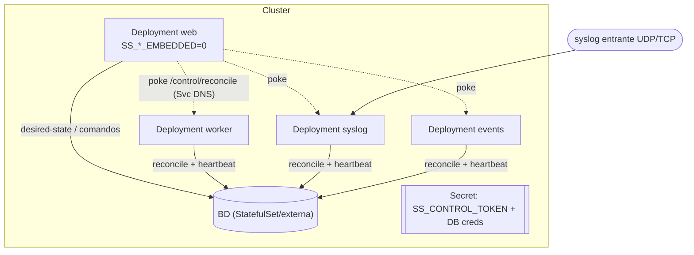

# Despliegue en Kubernetes

> **Atajo**: hay un **Helm chart** en [`helm/servicesentry/`](../helm/servicesentry)
> que genera todo lo de esta página (Deployments por rol, Services, Secret/ConfigMap,
> clave de cifrado compartida, plano de control y probes). Esta página explica los
> manifiestos por debajo; para desplegar rápido usa el chart
> (`helm install ss ./helm/servicesentry …`, ver su [README](../helm/servicesentry/README.md)).

ServiceSentry corre igual en Kubernetes que en la topología de microservicios de
Docker (ver [caso-docker.md](caso-docker.md)): **un Deployment por rol** que comparten una
**base de datos** y se coordinan por el **plano de control distribuido** (ver
[explica-servicios.md → Plano de control distribuido](explica-servicios.md#modo-microservicios-plano-de-control-distribuido)).

- **web** — panel de administración (`SS_*_EMBEDDED=0`: no programa checks, no liga
  syslog, no evalúa reglas; solo checks on-demand y la UI).
- **worker** — el scheduler de monitorización (`SS_SERVICE_ROLE=worker`).
- **syslog** — el receptor syslog (liga UDP/TCP/TLS; necesita un Service de ingress).
- **events** — el procesador de eventos por cursor.

El `web` **declara** el desired-state (config en BD) y encola comandos; cada
servicio **reconcilia** y publica su latido (`service_instances`). Para control
**instantáneo**, define `SS_CONTROL_TOKEN` (un Secret) y un **Service por rol** para
que el `web` pueda hacer el *poke* `POST /control/reconcile` por DNS de cluster. Sin
token, el control sigue funcionando por el reconcile periódico.



> **Probes**: usa `GET /control/health` (sin auth) como `readinessProbe`/
> `livenessProbe` de worker/syslog/events; el `web` usa `GET /`.

---

## Secret y configuración común

```yaml
apiVersion: v1
kind: Secret
metadata:
  name: servicesentry
type: Opaque
stringData:
  SS_USERNAME: admin
  SS_PASSWORD: change-me
  SS_DB_PASSWORD: db-password
  # Token compartido del poke de control (mismo valor en todos los pods).
  # Genéralo con:  openssl rand -hex 32
  SS_CONTROL_TOKEN: replace-with-a-long-random-token
---
apiVersion: v1
kind: ConfigMap
metadata:
  name: servicesentry-env
data:
  SS_DB_DRIVER: mysql
  SS_DB_HOST: servicesentry-db
  SS_DB_PORT: "3306"
  SS_DB_NAME: servicesentry
  SS_DB_USER: servicesentry
  SS_LANG: es_ES
  SS_CHECK_INTERVAL: "300"
```

Cada Deployment monta ambos con `envFrom` (`configMapRef` + `secretRef`).

## Deployment: web

El panel **no** hospeda los servicios (`SS_*_EMBEDDED=0`): los poseen los pods
dedicados.

```yaml
apiVersion: apps/v1
kind: Deployment
metadata:
  name: servicesentry-web
spec:
  replicas: 1
  selector: { matchLabels: { app: servicesentry, role: web } }
  template:
    metadata: { labels: { app: servicesentry, role: web } }
    spec:
      containers:
        - name: web
          image: servicesentry:latest
          envFrom:
            - configMapRef: { name: servicesentry-env }
            - secretRef:    { name: servicesentry }
          env:
            - { name: SS_SERVICE_ROLE,        value: web }
            - { name: SS_MONITORING_EMBEDDED, value: "0" }
            - { name: SS_SYSLOG_EMBEDDED,     value: "0" }
            - { name: SS_EVENTS_EMBEDDED,     value: "0" }
          ports: [{ containerPort: 8080 }]
          readinessProbe:
            httpGet: { path: /api/v1/health, port: 8080 }
            initialDelaySeconds: 15
---
apiVersion: v1
kind: Service
metadata: { name: servicesentry-web }
spec:
  selector: { app: servicesentry, role: web }
  ports: [{ port: 80, targetPort: 8080 }]
```

## Deployment + Service: worker / events

`SS_CONTROL_ADVERTISE` debe ser el **nombre del Service** del rol, para que el
`control_url` que el pod publica resuelva por DNS desde el `web`.

```yaml
apiVersion: apps/v1
kind: Deployment
metadata: { name: servicesentry-worker }
spec:
  replicas: 1
  selector: { matchLabels: { app: servicesentry, role: worker } }
  template:
    metadata: { labels: { app: servicesentry, role: worker } }
    spec:
      containers:
        - name: worker
          image: servicesentry:latest
          envFrom:
            - configMapRef: { name: servicesentry-env }
            - secretRef:    { name: servicesentry }
          env:
            - { name: SS_SERVICE_ROLE,      value: worker }
            - { name: SS_CONTROL_ADVERTISE, value: servicesentry-worker }
            - { name: SS_CONTROL_PORT,      value: "8765" }
          ports: [{ containerPort: 8765, name: control }]
          readinessProbe:
            httpGet: { path: /control/health, port: 8765 }
          livenessProbe:
            httpGet: { path: /control/health, port: 8765 }
            initialDelaySeconds: 20
---
apiVersion: v1
kind: Service
metadata: { name: servicesentry-worker }   # = SS_CONTROL_ADVERTISE
spec:
  selector: { app: servicesentry, role: worker }
  ports: [{ port: 8765, targetPort: 8765 }]
```

El Deployment **events** es idéntico cambiando `role`/`SS_SERVICE_ROLE`/nombres a
`events` (su Service también escucha en 8765; no necesita ingress externo).

## Deployment + Services: syslog

Igual que worker/events para el control, **más** un Service de ingress para los
puertos syslog (UDP/TCP). Como un Service no mezcla UDP y TCP, usa dos (o un
`LoadBalancer` con `appProtocol`):

```yaml
apiVersion: apps/v1
kind: Deployment
metadata: { name: servicesentry-syslog }
spec:
  replicas: 1
  selector: { matchLabels: { app: servicesentry, role: syslog } }
  template:
    metadata: { labels: { app: servicesentry, role: syslog } }
    spec:
      containers:
        - name: syslog
          image: servicesentry:latest
          envFrom:
            - configMapRef: { name: servicesentry-env }
            - secretRef:    { name: servicesentry }
          env:
            - { name: SS_SERVICE_ROLE,      value: syslog }
            - { name: SS_CONTROL_ADVERTISE, value: servicesentry-syslog }
          ports:
            - { containerPort: 8765, name: control }
            - { containerPort: 514,  name: syslog-udp, protocol: UDP }
            - { containerPort: 514,  name: syslog-tcp, protocol: TCP }
          readinessProbe:
            httpGet: { path: /control/health, port: 8765 }
---
apiVersion: v1
kind: Service
metadata: { name: servicesentry-syslog }   # = SS_CONTROL_ADVERTISE (control poke)
spec:
  selector: { app: servicesentry, role: syslog }
  ports: [{ port: 8765, targetPort: 8765 }]
---
apiVersion: v1
kind: Service
metadata: { name: servicesentry-syslog-ingress }
spec:
  type: LoadBalancer
  selector: { app: servicesentry, role: syslog }
  ports:
    - { name: udp, port: 514, targetPort: 514, protocol: UDP }
    - { name: tcp, port: 514, targetPort: 514, protocol: TCP }
```

## NetworkPolicy (opcional, recomendado)

Restringe el listener de control para que **solo el `web`** lo alcance:

```yaml
apiVersion: networking.k8s.io/v1
kind: NetworkPolicy
metadata: { name: servicesentry-control }
spec:
  podSelector: { matchLabels: { app: servicesentry } }
  policyTypes: [Ingress]
  ingress:
    - from:
        - podSelector: { matchLabels: { app: servicesentry, role: web } }
      ports:
        - { port: 8765, protocol: TCP }
```

## Alta disponibilidad (réplicas > 1)

`worker` y `events` admiten **varias réplicas con failover**: un **lease de líder**
en BD hace que solo una haga el trabajo y las demás queden en **hot-standby**; si la
activa cae, otra toma el relevo en ~30 s (ver
[explica-servicios.md → Alta disponibilidad](explica-servicios.md#alta-disponibilidad-lease-de-líder--hot-standby)).
Así que puedes poner `replicas: 2` en esos Deployments para tolerar la caída de un
pod sin duplicar checks ni alertas. La pestaña **Servicios** marca cuál es **Líder**
y cuáles **En espera**.

`syslog` es **active-active**: detrás de su Service, el balanceo reparte los mensajes
entre réplicas (cada paquete va a una sola), así que escala horizontalmente para
ingesta — sube `replicas` sin más.

## Notas

- **Sin token**: si omites `SS_CONTROL_TOKEN`, no levantes los Services de control
  ni las probes a `/control/health`; el control se propaga por el reconcile
  periódico (≤15 s) igualmente.
- **Base de datos**: usa un MySQL/PostgreSQL gestionado o un StatefulSet; apunta
  `SS_DB_*` ahí. Para syslog de alto volumen, una segunda BD con `SS_SYSLOG_DB_*`
  (ver [caso-docker.md](caso-docker.md)).
