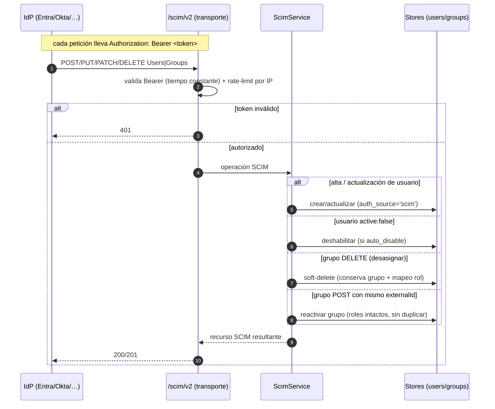

# Aprovisionamiento SCIM 2.0

> Cómo activar y usar el **aprovisionamiento proactivo de usuarios y grupos** vía SCIM 2.0.
>
> SCIM es un **estándar agnóstico del IdP** (RFC 7643/7644): cualquier proveedor de identidad
> compatible (Microsoft Entra ID, Okta, OneLogin, JumpCloud…) puede dar de alta, actualizar y
> dar de baja principales en ServiceSentry **antes** de que inicien sesión.

El servidor SCIM vive en `lib/providers/scim/` (`routes.py` = transporte HTTP;
`service.py`/`__init__.py` = lógica) y **no** es específico de ningún IdP.

- **Endpoints y contrato HTTP** (Users/Groups/Schemas, Bearer, paginación): [ref-api.md](ref-api.md#scim-20--libprovidersscimroutespy).
- **Seguridad** (token Bearer, comparación en tiempo constante, rate-limit por IP, scoping):
  [explica-seguridad.md](explica-seguridad.md#scim-20-aprovisionamiento-proactivo).
- **Atajo de registro automático en Entra ID**: [caso-entra-id.md](caso-entra-id.md#registro-scim-en-entra).

---

## JIT vs. SCIM

ServiceSentry soporta dos formas de crear cuentas desde un IdP; **coexisten**:

| | JIT (login) | SCIM (push) |
|---|:---:|:---:|
| Cuándo se crea el usuario | Al primer login SSO | Cuando el IdP sincroniza (aunque no haya entrado) |
| Baja automática | No | Sí (`active:false` → deshabilita si `auto_disable`) |
| Requiere | `auto_create_users` | Endpoint SCIM activo + token |

Un patrón habitual: **SCIM** para altas/bajas centralizadas + **JIT** como respaldo al primer
login. El JIT se documenta en [caso-entra-id.md](caso-entra-id.md) (Entra) y por proveedor en
[explica-seguridad.md](explica-seguridad.md).

---

## Activar SCIM

En **Config → Autenticación → SCIM provisioning**:

- **Enabled** + un **token** (Bearer secreto, cifrado en reposo). La card muestra:
  - La **URL base SCIM** — `https://<tu public_url>/scim/v2` — como fila **solo-lectura**
    (candado + copiar), derivada de la URL pública (`public_url`, ver
    [ref-configuracion.md](ref-configuracion.md)).
  - Un input-group de **token** con botón **Generar** (pide un token aleatorio fuerte al
    servidor, `lib/util/generate_token` vía `GET /api/v1/util/token`, y lo pone en el campo; no
    se guarda hasta pulsar **Guardar**) y botón **Copiar**.
- Como todo secreto, el token **nunca se re-emite al navegador** tras guardarse (se muestra
  enmascarado con un placeholder "token configurado").
- **`default_role`** — rol asignado a los usuarios aprovisionados que no casen ningún grupo.
- **`auto_disable`** — si está activo, una asignación retirada (`active:false`) **deshabilita**
  al usuario.

En la pestaña de aprovisionamiento del IdP se configura: *Tenant/SCIM URL* = la URL base,
*Secret Token* = el token.

---

## Configurar el IdP

### Entra ID (atajo automático)

ServiceSentry puede **registrar la app SCIM en Entra por ti** (Device Code Flow: crea la app
empresarial con el sync job *customappsso* ya apuntado a tu URL + token). Ver
[caso-entra-id.md § Registro SCIM en Entra](caso-entra-id.md#registro-scim-en-entra).

### Otros IdP (Okta, OneLogin, JumpCloud…)

No hay atajo específico, pero el endpoint es SCIM 2.0 estándar: en la app de aprovisionamiento
del IdP, introduce **manualmente**:

- **Base URL / SCIM connector base URL:** `https://<tu public_url>/scim/v2`
- **API token / Secret token:** el token Bearer generado arriba.

El IdP validará la conexión contra `/scim/v2/ServiceProviderConfig` y empezará a empujar
`Users`/`Groups`.

> No se ha probado con cada IdP concreto; el contrato es SCIM 2.0 estándar (RFC 7643/7644). Si
> un IdP requiere un dialecto no estándar, indícalo — no puede deducirse del código.

---

## Flujo de aprovisionamiento

Detalle del contrato HTTP en [ref-api.md](ref-api.md#scim-20--libprovidersscimroutespy) y de la
seguridad (Bearer, rate-limit, scope) en
[explica-seguridad.md](explica-seguridad.md#scim-20-aprovisionamiento-proactivo).

## Comportamiento de altas y bajas

- **Usuarios** creados por SCIM llevan `auth_source: 'scim'` y muestran un **badge SCIM** en la
  lista de Usuarios (junto a OIDC/SAML2/LDAP).
- **Grupos** SCIM se mapean a grupos de ServiceSentry (asigna roles a esos grupos y los
  miembros los heredan); llevan `source: 'scim'` y un **badge SCIM** en la pestaña Grupos
  (frente a los `local`).
- **Desasignar / baja:**
  - Un **usuario** desasignado se **desactiva** (`active:false`).
  - Un **grupo** se desactiva mediante **soft-delete**: el IdP manda `DELETE`, pero ServiceSentry
    **conserva** el grupo y su mapeo grupo→rol (un grupo desactivado no concede roles). Al
    **reasignar**, el IdP hace `POST` con el mismo `externalId` y el grupo se **reactiva** con sus
    roles intactos (sin duplicar).

Detalle de la semántica de seguridad en
[explica-seguridad.md](explica-seguridad.md#scim-20-aprovisionamiento-proactivo).

---

## Ver también

- [caso-entra-id.md](caso-entra-id.md) — registro automático de la app SCIM en Entra ID
- [ref-api.md](ref-api.md#scim-20--libprovidersscimroutespy) — endpoints SCIM
- [explica-seguridad.md](explica-seguridad.md#scim-20-aprovisionamiento-proactivo) — token, rate-limit, scoping
- [ref-configuracion.md](ref-configuracion.md) — `public_url` y sección `scim`
- [ref-permisos.md](ref-permisos.md) — cómo los grupos conceden roles
