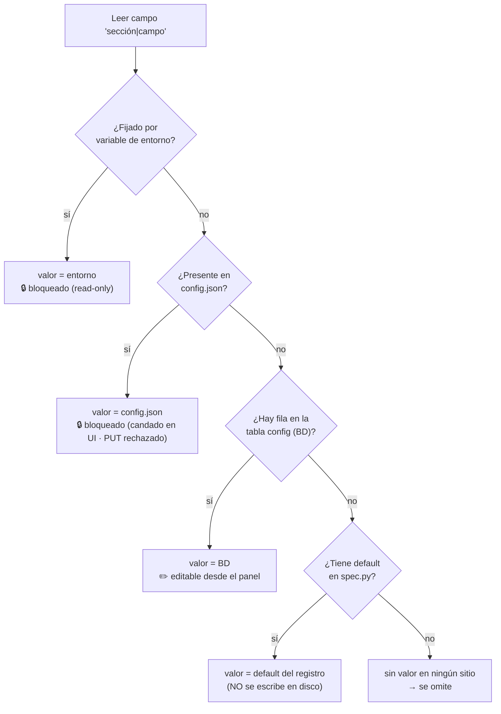

# Referencia de Configuración

Referencia completa de todos los archivos de configuración y opciones CLI de ServiceSentry.

---

## Rutas de los Archivos de Configuración

| Modo | Directorio config | Directorio var |
|------|------------------|----------------|
| **Desarrollo** (detecta `src` en la ruta) | `../data/` (relativo) | igual que directorio config (`../data/`) |
| **Producción Linux / macOS** | `/etc/ServiSesentry/` | `/var/lib/ServiSesentry/` |
| **Producción Windows** | `/etc/ServiSesentry/` | `%PROGRAMDATA%\ServiSesentry` |
| **Personalizado** (`-p path`) | ruta especificada | según modo dev/prod |

---

## Dónde vive la configuración (BD + `config.json`)

La **configuración editable** (todos los campos del registro `lib/config/spec.py`)
vive ahora en la **base de datos** (tabla `config`, una fila por `sección|campo`).
Se lee y se escribe desde el panel web y se comparte con el monitor a través de la
misma BD. `config.json` se sigue usando como **capa de solo-lectura y de
arranque**:

- **Una sola entrada (lectura)** — todo el sistema lee la *configuración
  efectiva*: los valores editables de la BD con las claves de `config.json`
  superpuestas encima. Precedencia por campo: **variable de entorno > `config.json`
  > BD > default del registro**.
- **Una sola salida (escritura)** — al guardar, los campos del registro se
  escriben en la BD (los secretos cifrados); el resto permanece en `config.json`.
- **Solo lectura**: un campo presente en `config.json` (igual que uno fijado por
  variable de entorno) **anula** la BD y se muestra bloqueado en la UI con un
  candado y el tooltip «valor fijado en config.json». Para volver a hacerlo
  editable, elimínalo del fichero.
- **Qué se queda en `config.json`** (única-fuente-de-verdad `FILE_ONLY_SECTIONS`):
  solo la sección **`database`** (arranque — el conector se construye a partir de
  ella, antes de que exista la capa de config en BD), la lista **`webhooks`** (es
  una lista top-level de objetos con su propia CRUD, no encaja en `sección|campo`)
  y las **credenciales** de primer arranque (`web_admin.username` / `password`).
- **Todo lo demás va a la BD**, incluida la configuración de feature con forma
  `sección|campo`: el layout `overview`, las plantillas `notif_templates` /
  `notif_html_templates`. Tienen su propia UI y nunca aparecen como tarjetas de
  configuración (el frontend las omite vía `FEATURE_NONCONFIG_KEYS`).
- **Los defaults NO se escriben en disco.** Faltando un valor, se resuelve con el
  default del registro (`spec.py`) en tiempo de lectura. `load_config()` ya no
  siembra `config.json` (`seed=False`), así que ni el worker ni el web rellenan el
  fichero al arrancar.

### Resolución de un campo (lectura)

Para cada campo `sección|campo`, la lectura resuelve el valor efectivo por
precedencia y marca como **bloqueado** (solo-lectura) los que vienen de entorno o de
`config.json`. Lo hace `resolve_config()` (`lib/config/resolve.py`), que devuelve
`(config_efectiva, paths_bloqueados)`:



- **Nada guardado** → cae hasta el **default del registro** (`spec.py`); no se
  persiste en disco ni en BD.
- **En `config.json`** (o entorno) → ese valor **gana** sobre la BD y queda
  **bloqueado**: la UI lo muestra con candado y el `PUT /api/v1/config` lo rechaza.
  Para volver a editarlo, quítalo del fichero.
- La sección **`database`** es una excepción de arranque: se lee siempre de
  `config.json`/entorno y **nunca** de la BD (el paso «BD» se salta).

### Migración automática (una vez)

La primera vez que arranca con esta versión, si existe un `config.json` con la
configuración antigua, se **importan** sus campos editables a la BD, se respalda
el fichero como `config.json.bak` y se recorta `config.json` para dejar solo la
capa de arranque (`database` + credenciales). A partir de ahí la configuración se
edita en la BD y el fichero solo contiene overrides de solo-lectura y el arranque.

## config.json

El ejemplo siguiente muestra la **forma efectiva** de la configuración (lo que
devuelve la lectura única); en disco, tras la migración, solo quedan las claves de
solo-lectura/arranque.

```json
{
    "monitoring": {
        "enabled": true,
        "autostart": true,
        "timer_check": 300
    },
    "global": {
        "log_level": "off"
    },
    "telegram": {
        "token": "BOT_TOKEN_AQUÍ",
        "chat_id": "CHAT_ID_AQUÍ",
        "group_messages": false
    },
    "notifications": {
        "telegram_on_down": true,
        "telegram_on_recovery": true,
        "telegram_on_warn": false,
        "email_on_down": true,
        "email_on_recovery": true,
        "email_on_warn": false,
        "webhook_on_down": true,
        "webhook_on_recovery": true,
        "webhook_on_warn": false
    },
    "web_admin": {
        "lang": "en_EN",
        "dark_mode": false,
        "public_status": false,
        "status_refresh_secs": 60,
        "status_lang": "",
        "secure_cookies": false,
        "remember_me_days": 30,
        "audit_max_entries": 500,
        "pw_min_len": 8,
        "pw_max_len": 128,
        "pw_require_upper": true,
        "pw_require_digit": true,
        "pw_require_symbol": false,
        "proxy_count": 0
    }
}
```

### Sección `monitoring`

El monitor de servicios. `enabled` es el interruptor maestro y `autostart` decide si
el monitor **embebido** arranca al iniciar el panel web (un proceso `--monitor`
independiente ignora `autostart`). Si el panel hospeda el monitor lo decide el env
`SS_MONITORING_EMBEDDED` (`0` = lo posee un contenedor/proceso dedicado), no un campo.

| Clave | Tipo | Por defecto | Descripción |
|-------|------|-------------|-------------|
| `monitoring.enabled` | bool | `true` | Interruptor maestro (env `SS_MONITORING_ENABLED`). Desactivado = el monitor se apaga (y se detiene si corría) y no es arrancable desde la pestaña Servicios |
| `monitoring.autostart` | bool | `true` | Arrancar el monitor embebido al iniciar el panel web (env `SS_MONITORING_AUTOSTART`). Off = arranca **parado** pero iniciable a mano desde Servicios. Solo aplica al modo embebido |
| `monitoring.timer_check` | int | 300 | Segundos entre ciclos de comprobación (rango 10–86400; env `SS_CHECK_INTERVAL`) |

### Sección `global`

| Clave | Tipo | Por defecto | Descripción |
|-------|------|-------------|-------------|
| `global.log_level` | string | `"off"` | Verbosidad del log de depuración. `off` = sin debug; en otro caso el nivel mínimo mostrado: `debug` < `info` < `warning` < `error`. Seleccionable en **Configuración → Interfaz**. Sustituye al antiguo booleano `global.debug` (migrado automáticamente). |

### Sección `database`

Selecciona el motor de base de datos donde se persisten usuarios, roles, grupos,
sesiones, auditoría e historial. Si se omite, se usa **SQLite** sobre el fichero
`data.db` del directorio var. El esquema de cada tabla se valida y reconcilia
automáticamente en cada arranque (ver [architecture.md](architecture.md) →
*Capa de Persistencia y Esquema de BD*).

| Clave | Tipo | Por defecto | Descripción |
|-------|------|-------------|-------------|
| `database.driver` | string | `"sqlite"` | Motor: `sqlite`, `postgresql`, `mysql` o `mariadb` |
| `database.path` | string | `data.db` (var) | **SQLite** — ruta al fichero `.db`. Solo se usa con `driver=sqlite`. |
| `database.host` | string | `"localhost"` | **PostgreSQL/MySQL** — host del servidor |
| `database.port` | int | `5432` / `3306` | **PostgreSQL/MySQL** — puerto (5432 PG, 3306 MySQL) |
| `database.name` | string | `"servicesentry"` | **PostgreSQL/MySQL** — nombre de la base de datos |
| `database.user` | string | `""` | **PostgreSQL/MySQL** — usuario |
| `database.password` | string | `""` | **PostgreSQL/MySQL** — contraseña (cifrada en disco) |

```json
"database": { "driver": "sqlite" }
"database": { "driver": "postgresql", "host": "db", "port": 5432,
              "name": "servicesentry", "user": "ss", "password": "secret" }
"database": { "driver": "mysql", "host": "db", "port": 3306,
              "name": "servicesentry", "user": "ss", "password": "secret" }
```

> PostgreSQL requiere `psycopg2-binary`; MySQL/MariaDB requiere `PyMySQL`. Ambos
> son dependencias opcionales — sin ellas, solo está disponible SQLite.
> `mariadb` es un **alias** de `mysql` (mismo conector PyMySQL).
>
> **Convención de fechas:** las columnas de fecha/hora se almacenan como `TEXT`
> ISO 8601 UTC en los tres motores (SQLite no tiene tipo de fecha nativo). Ver
> la nota *TODO* en [architecture.md](architecture.md).

#### Configuración por variables de entorno (`SS_DB_*`)

A diferencia del resto de la config (que solo se sobreescribe por env en la capa
web), la sección `database` se lee en el **arranque**, antes de que exista el
conector, por lo que sus env se superponen ahí mismo
(`lib.config.manager.bootstrap_database_cfg`). Esto permite apuntar a
MySQL/MariaDB/PostgreSQL **solo con variables de entorno**, sin editar
`config.json` — ideal para contenedores. Lo usan por igual el panel web, el
worker (monitor) y el receptor syslog independiente.

| Variable | Equivale a | Ejemplo |
|----------|------------|---------|
| `SS_DB_DRIVER` | `database.driver` | `mysql` |
| `SS_DB_HOST` | `database.host` | `db` |
| `SS_DB_PORT` | `database.port` | `3306` |
| `SS_DB_NAME` | `database.name` | `servicesentry` |
| `SS_DB_USER` | `database.user` | `servicesentry` |
| `SS_DB_PASSWORD` | `database.password` | `secret` |
| `SS_DB_PATH` | `database.path` | `/var/lib/.../data.db` |

> El `docker-compose.microservices.yml` usa estas variables para compartir un
> contenedor **MariaDB** entre los servicios `web`, `worker` y `syslog`.

#### Base de datos de syslog (`SS_SYSLOG_DB_*`)

El receptor syslog puede guardar sus mensajes (de alto volumen) en una **base de
datos dedicada**, separada de la principal. Se activa con
`SS_SYSLOG_DB_ENABLED=1`; si está desactivada, los mensajes van a la BD principal.
Las claves equivalen a la sección `syslog_db` del `config.json` y replican las de
`database`:

| Variable | Equivale a | Ejemplo |
|----------|------------|---------|
| `SS_SYSLOG_DB_ENABLED` | `syslog_db.enabled` | `1` |
| `SS_SYSLOG_DB_DRIVER` | `syslog_db.driver` | `mysql` |
| `SS_SYSLOG_DB_HOST` | `syslog_db.host` | `syslog-db` |
| `SS_SYSLOG_DB_PORT` | `syslog_db.port` | `3306` |
| `SS_SYSLOG_DB_NAME` | `syslog_db.name` | `servicesentry_syslog` |
| `SS_SYSLOG_DB_USER` | `syslog_db.user` | `servicesentry` |
| `SS_SYSLOG_DB_PASSWORD` | `syslog_db.password` | `secret` |
| `SS_SYSLOG_DB_PATH` | `syslog_db.path` | `/var/lib/.../syslog.db` |

> El `docker-compose.microservices.yml` levanta un segundo contenedor MariaDB
> (`syslog-db`) y apunta los servicios `web` y `syslog` a él con estas variables.
> Cambiar la BD de syslog requiere **reiniciar** (banner de reinicio pendiente en
> la UI).

### Sección `telegram`

| Clave | Tipo | Por defecto | Descripción |
|-------|------|-------------|-------------|
| `telegram.token` | string | `""` | Token del Bot de Telegram |
| `telegram.chat_id` | string | `""` | ID del chat o grupo de Telegram (solo dígitos) |
| `telegram.group_messages` | bool | false | Si `true`, agrupa todos los mensajes en un bloque por ciclo |

### Sección `notifications`

Matriz de routing: qué eventos se envían por cada canal. Los webhooks individuales también tienen su propio flag `enabled`, por lo que un evento solo se entrega a los webhooks que estén activos.

| Clave | Tipo | Por defecto | Descripción |
|-------|------|-------------|-------------|
| `notifications.telegram_on_down` | bool | `false` | Enviar por Telegram cuando un check falla |
| `notifications.telegram_on_recovery` | bool | `false` | Enviar por Telegram cuando un check se recupera |
| `notifications.telegram_on_warn` | bool | `false` | Enviar por Telegram en estado de advertencia |
| `notifications.telegram_on_syslog` | bool | `false` | Enviar por Telegram en eventos de syslog |
| `notifications.email_on_down` | bool | `false` | Enviar por email cuando un check falla |
| `notifications.email_on_recovery` | bool | `false` | Enviar por email cuando un check se recupera |
| `notifications.email_on_warn` | bool | `false` | Enviar por email en estado de advertencia |
| `notifications.email_on_syslog` | bool | `false` | Enviar por email en eventos de syslog |
| `notifications.webhook_on_down` | bool | `false` | Enviar a webhooks cuando un check falla |
| `notifications.webhook_on_recovery` | bool | `false` | Enviar a webhooks cuando un check se recupera |
| `notifications.webhook_on_warn` | bool | `false` | Enviar a webhooks en estado de advertencia |
| `notifications.webhook_on_syslog` | bool | `false` | Enviar a webhooks en eventos de syslog |

Esta matriz es configurable desde la pestaña **Configuración → Notifications → Routing** del panel web.

### Sección `web_admin`

| Clave | Tipo | Por defecto | Descripción |
|-------|------|-------------|-------------|
| `web_admin.lang` | string | `"en_EN"` | Idioma por defecto de la interfaz web (`en_EN` o `es_ES`) |
| `web_admin.landing_page` | string | `"admin"` | Página a la que llega el usuario tras iniciar sesión: `admin` (panel) o `status` (página pública de estado). Sobreescribible por grupo y por usuario (precedencia usuario → grupo → global); ver [web_admin.md](web_admin.md#usuarios). |
| `web_admin.dark_mode` | bool | `false` | Modo oscuro por defecto para sesiones nuevas |
| `web_admin.public_status` | bool | `false` | Exponer `/status` públicamente sin autenticación. Los usuarios logueados siempre pueden acceder. |
| `web_admin.status_refresh_secs` | int | `60` | Intervalo de refresco automático de la página `/status` (10–3600 segundos) |
| `web_admin.status_lang` | string | `""` | Idioma de la página pública `/status`. Prioridad: sesión del usuario → este campo → `web_admin.lang`. Dejar vacío para usar el idioma por defecto del panel. |
| `web_admin.secure_cookies` | bool | `false` | Marcar la cookie de sesión como `Secure` (solo HTTPS). **Recomendado** cuando el acceso es solo por HTTPS (incl. tras proxy TLS como NPM/nginx): el flag no se deduce del esquema de la petición, hay que activarlo aquí (o `force_https`). Con `Secure` activo se pierde el acceso por HTTP/IP en LAN. Ver [security.md → cookies](security.md#cabeceras-de-seguridad-http-y-cookies). |
| `web_admin.remember_me_days` | int | `30` | Duración de sesiones persistentes ("Recuérdame") en días (1–365) |
| `web_admin.audit_max_entries` | int | `500` | Número máximo de entradas en el registro de auditoría (10–10000) |
| `web_admin.pw_min_len` | int | `8` | Longitud mínima de contraseña (1–128) |
| `web_admin.pw_max_len` | int | `128` | Longitud máxima de contraseña (8–256) |
| `web_admin.pw_require_upper` | bool | `true` | Exigir al menos una letra mayúscula y una minúscula en la contraseña |
| `web_admin.pw_require_digit` | bool | `true` | Exigir al menos un dígito en la contraseña |
| `web_admin.pw_require_symbol` | bool | `false` | Exigir al menos un símbolo (`!`, `@`, `#`…) en la contraseña |
| `web_admin.proxy_count` | int | `0` | Número de proxies inversos delante del servidor Flask (0–10). Activa `ProxyFix` de Werkzeug para leer correctamente la IP real del cliente. |
| `web_admin.port` | int | `8080` | Puerto TCP del servidor web. Puede sobreescribirse con `--web-port`. |
| `web_admin.host` | string | `"0.0.0.0"` | Dirección IP (IPv4/IPv6) donde escucha el servidor. Puede sobreescribirse con `--web-host`. Validada como IP. |
| `web_admin.public_status_detail` | bool | `false` | Mostrar el detalle por ítem en la página pública `/status` |
| `web_admin.public_url` | string | `""` | Host público (sin esquema) cuando se sirve tras un proxy; **override** de la URL base efectiva. Vacío → se **auto-detecta** de la petición (proxy-aware vía `ProxyFix`/`proxy_count`). Fuente única: `WebAdmin.public_base_url()`, inyectada al front como `SERVER_BASE_URL` y usada por `publicBaseUrl()` (redirect URIs OIDC, ACS SAML2, URL SCIM, deep links) |
| `web_admin.force_https` | bool | `false` | Generar URLs `https://` (proxy con terminación TLS) |
| `web_admin.force_fqdn` | bool | `false` | Redirigir a `public_url` si se accede por IP u otro host (requiere `public_url`) |
| `web_admin.default_page_size` | int | `25` | Tamaño de página por defecto en los listados (0 = "Todos") (0–200) |
| `web_admin.config_poll_secs` | int | `30` | Intervalo del poll de versiones de config para detectar cambios concurrentes (10–300) |
| `web_admin.config_update_banner_secs` | int | `8` | Segundos que se muestra el banner de "configuración actualizada" (0–60) |
| `web_admin.lockout_max_attempts` | int | `5` | Intentos fallidos antes de bloquear la cuenta (0 = desactivado) (0–100) |
| `web_admin.lockout_duration_secs` | int | `900` | Duración del bloqueo de cuenta en segundos (60–86400) |
| `web_admin.ipban_enabled` | bool | `true` | [fail2ban interno](security.md#fail2ban-interno-bans-de-ip-a-nivel-de-servicio): interruptor maestro (`false` ⇒ nunca banea) |
| `web_admin.ipban_auth_threshold` | int | `10` | Ofensas de la vía `auth` (login fallido, CSRF…) antes del ban (0 = off) (0–1000) |
| `web_admin.ipban_auth_window_secs` | int | `600` | Ventana deslizante de la vía `auth` (10–86400) |
| `web_admin.ipban_authz_threshold` | int | `30` | Ofensas de la vía `authz` (acceso sin permiso) antes del ban (0 = off) (0–1000) |
| `web_admin.ipban_authz_window_secs` | int | `600` | Ventana deslizante de la vía `authz` (10–86400) |
| `web_admin.ipban_durations` | string | `"900,3600,21600,86400"` | Escalera de duraciones de ban en segundos (CSV); tras el último nivel → permanente |
| `web_admin.ipban_permanent_after` | int | `4` | Nivel de ban a partir del cual es permanente (0 = nunca) (0–100) |
| `web_admin.ipban_whitelist` | string | `""` | IP/CIDR nunca baneados (CSV); se unen al *loopback* y a la lista blanca gestionada en la UI |
| `web_admin.session_check_secs` | int | `20` | Intervalo del poll de keepalive de sesión (detecta revocación) (5–300) |
| `web_admin.session_revoke_redirect_secs` | int | `3` | Segundos antes de redirigir al login tras detectar la sesión revocada (0–30) |
| `web_admin.access_poll_secs` | int | `30` | Intervalo de auto-refresco de la pestaña Access (5–300) |
| `web_admin.force_reload_on_update` | bool | `false` | Forzar recarga del navegador cuando cambia la versión de arranque del servidor |
| `web_admin.force_reload_secs` | int | `10` | Margen antes de forzar la recarga del navegador (1–300) |

> `web_admin.username`/`web_admin.password` son **credenciales de primer arranque** (crean el admin inicial); no se persisten en `config.json` ni se editan desde el panel (ver `SS_USERNAME`/`SS_PASSWORD`).

### Sección `modules` (defaults globales)

Valores por defecto heredados por todos los módulos (cada módulo/ítem puede sobreescribirlos; en blanco hereda este global, mostrado como placeholder).

| Clave | Tipo | Por defecto | Descripción |
|-------|------|-------------|-------------|
| `modules.threads` | int | `5` | Hilos paralelos por defecto para procesar ítems |
| `modules.timeout` | int | `15` | Timeout por defecto de las comprobaciones (segundos) |

### Secciones `users` / `groups`

| Clave | Tipo | Por defecto | Descripción |
|-------|------|-------------|-------------|
| `users.default_role` | string | `""` | Rol asignado por defecto a usuarios nuevos (vacío = `none`). Solo-admin |
| `groups.default_role` | string | `""` | Rol asignado por defecto a grupos nuevos (vacío = `none`). Solo-admin |

### Sección `ldap`

Requiere el paquete opcional `ldap3` (`pip install ldap3`). Si no está instalado, el campo `enabled` es ignorado.

| Clave | Tipo | Por defecto | Descripción |
|-------|------|-------------|-------------|
| `ldap.enabled` | bool | `false` | Activar autenticación LDAP/Active Directory |
| `ldap.server` | string | `""` | Hostname o IP del servidor LDAP |
| `ldap.port` | int | `389` | Puerto (389 sin TLS / 636 con LDAPS) (1–65535) |
| `ldap.use_ssl` | bool | `false` | Usar LDAPS (TLS) en lugar de LDAP plano |
| `ldap.timeout` | int | `5` | Timeout de conexión en segundos (1–60) |
| `ldap.bind_dn` | string | `""` | DN de la cuenta de servicio para búsquedas |
| `ldap.bind_password` | string | `""` | Contraseña de la cuenta de servicio (cifrada en disco) |
| `ldap.base_dn` | string | `""` | Base DN para búsqueda de usuarios |
| `ldap.user_filter` | string | `"(sAMAccountName={username})"` | Filtro LDAP para localizar al usuario; `{username}` se sustituye en tiempo de ejecución |
| `ldap.email_attr` | string | `"mail"` | Atributo LDAP del que se lee el email |
| `ldap.name_attr` | string | `"displayName"` | Atributo LDAP del que se lee el nombre visible |
| `ldap.username_attr` | string | `""` | Atributo del que derivar el username (vacío = usa el introducido en login) |
| `ldap.group_attr` | string | `"memberOf"` | Atributo LDAP del que se leen los grupos |
| `ldap.group_role_map` | string (JSON) | `"{}"` | Objeto JSON `{"CN=Admins,...": "admin", ...}` que mapea grupos LDAP a roles de la app |
| `ldap.group_display_names` | dict | `{}` | Cache `{DN: nombre visible}` de grupos (autocompletado del mapeo) |
| `ldap.default_role` | string | `""` | Rol por defecto para usuarios LDAP sin mapeo de grupo (vacío = `none`) |
| `ldap.fallback_to_local` | bool | `true` | Si LDAP falla por error de red (no por credenciales incorrectas), intentar autenticación local |
| `ldap.allow_email_login` | bool | `false` | Permitir que los usuarios introduzcan su dirección de email en lugar del username LDAP |

Los usuarios autenticados por LDAP se crean o sincronizan automáticamente en la tabla `users` de la base de datos con `auth_source: "ldap"`. Los usuarios locales (`auth_source: "local"`) nunca pasan por LDAP.

### Sección `oidc`

Requiere el paquete opcional `authlib` (`pip install authlib`).

| Clave | Tipo | Por defecto | Descripción |
|-------|------|-------------|-------------|
| `oidc.enabled` | bool | `false` | Activar SSO OIDC/OAuth2 |
| `oidc.provider_url` | string | `""` | URL de discovery del IdP (p.ej. `https://login.microsoftonline.com/{tenant}/v2.0`) |
| `oidc.client_id` | string | `""` | Client ID de la aplicación registrada en el IdP |
| `oidc.client_secret` | string | `""` | Client Secret (cifrado en disco con Fernet) |
| `oidc.scopes` | string | `"openid email profile"` | Scopes OAuth2 separados por espacio |
| `oidc.username_claim` | string | `"preferred_username"` | Claim del ID token del que se extrae el username |
| `oidc.email_claim` | string | `"email"` | Claim del que se extrae el email |
| `oidc.name_claim` | string | `"name"` | Claim del que se extrae el nombre visible |
| `oidc.groups_claim` | string | `"groups"` | Claim del que se leen los grupos (p.ej. Object IDs en Entra ID) |
| `oidc.group_role_map` | string (JSON) | `"{}"` | Objeto JSON que mapea valores del claim de grupos a roles de la app |
| `oidc.group_display_names` | dict | `{}` | Cache `{id de grupo: nombre visible}` (autocompletado del mapeo) |
| `oidc.default_role` | string | `""` | Rol por defecto para usuarios OIDC sin mapeo de grupo (vacío = `none`) |
| `oidc.auto_create_users` | bool | `true` | Crear automáticamente el usuario en la tabla `users` de la base de datos en el primer login |

Cuando está habilitado, aparece el botón **Login with SSO** en la pantalla de login. El wizard integrado en la pestaña de configuración puede registrar la aplicación en Microsoft Entra ID automáticamente mediante Device Code Flow.

### Sección `saml2`

Requiere el paquete opcional `python3-saml` (`pip install python3-saml`). **[alpha]**

| Clave | Tipo | Por defecto | Descripción |
|-------|------|-------------|-------------|
| `saml2.enabled` | bool | `false` | Activar SSO SAML2 |
| `saml2.sp_entity_id` | string | `""` | Entity ID del Service Provider (esta aplicación) |
| `saml2.sp_acs_url` | string | `""` | URL del Assertion Consumer Service (`…/auth/saml2/acs`) |
| `saml2.sp_cert` | string | `""` | Certificado del SP en PEM |
| `saml2.sp_key` | string | `""` | Clave privada del SP en PEM (cifrada en disco) |
| `saml2.idp_entity_id` | string | `""` | Entity ID del Identity Provider |
| `saml2.idp_sso_url` | string | `""` | URL de Single Sign-On del IdP |
| `saml2.idp_cert` | string | `""` | Certificado del IdP (base64) |
| `saml2.username_attr` | string | `""` | Atributo SAML del que se lee el username |
| `saml2.email_attr` | string | `"email"` | Atributo SAML del que se lee el email |
| `saml2.name_attr` | string | `"displayName"` | Atributo SAML del que se lee el nombre visible |
| `saml2.groups_attr` | string | `"groups"` | Atributo SAML del que se leen los grupos |
| `saml2.group_role_map` | string (JSON) | `"{}"` | Mapeo `{grupo SAML: rol}` |
| `saml2.group_display_names` | dict | `{}` | Cache `{grupo: nombre visible}` (autocompletado del mapeo) |
| `saml2.default_role` | string | `""` | Rol por defecto para usuarios SAML sin mapeo de grupo (vacío = `none`) |
| `saml2.auto_create_users` | bool | `true` | Crear el usuario en el primer login |
| `saml2.sp_app_id` | string | `""` | AppId (client id) de la app registrada en Entra ID — para el enlace "Abrir en Entra ID" |
| `saml2.sp_object_id` | string | `""` | ObjectId del servicePrincipal en Entra — para el deep-link a la sección SSO del portal |
| `saml2.graph_secret` | string | `""` | Client secret **propio** de la app SAML2 (cifrado) para leer grupos vía Graph en el mapeo Grupos→Rol. Lo crea el asistente; ver [sso-entra.md](sso-entra.md) |

Rutas: `/auth/saml2/login` (inicio), `/auth/saml2/acs` (callback), `/auth/saml2/metadata` (metadatos SP para registrar en el IdP). Los usuarios se sincronizan con `auth_source: "saml2"`. El registro asistido de la app en Entra ID y sus limitaciones están en [sso-entra.md](sso-entra.md).

### Sección `scim`

Aprovisionamiento **proactivo** por SCIM 2.0: el IdP (Entra ID, Okta…) empuja altas/cambios/bajas de usuarios y grupos a `/scim/v2/*` **antes** del primer login (complementa el JIT). Se configura en *Config → Autenticación → SCIM provisioning*.

| Clave | Tipo | Por defecto | Descripción |
|-------|------|-------------|-------------|
| `scim.enabled` | bool | `false` | Exponer `/scim/v2` (si off, devuelve 401) |
| `scim.token` | string | `""` | Bearer token que envía el IdP (cifrado). En el IdP: URL de Tenant = `https://<public_url>/scim/v2`, Secret Token = este valor |
| `scim.default_role` | string | `""` | Rol de los usuarios aprovisionados (nombre o uid; vacío = `none`) |
| `scim.auto_disable` | bool | `true` | `active:false` del IdP → deshabilita el usuario (en vez de ignorarlo) |

Usuarios creados con `auth_source: "scim"`; los grupos SCIM se mapean a grupos de ServiceSentry. Ver [sso-entra.md](sso-entra.md) (§Provisioning proactivo) y [web_admin.md](web_admin.md) (endpoints).

### Sección `email`

| Clave | Tipo | Por defecto | Descripción |
|-------|------|-------------|-------------|
| `email.enabled` | bool | `false` | Activar notificaciones por email |
| `email.provider` | string | `"smtp"` | Proveedor de envío: `smtp`, `microsoft365` o `gmail` |
| `email.recipients` | string | `""` | Direcciones de destino separadas por comas |
| `email.subject_prefix` | string | `""` | Prefijo opcional para el asunto del mensaje |
| `email.notify_on_down` | bool | `true` | Enviar alerta cuando un check falla *(obsoleto: sustituido por la matriz `notifications`; se mantiene por compatibilidad)* |
| `email.notify_on_recovery` | bool | `true` | Enviar alerta cuando se recupera un check *(obsoleto: sustituido por la matriz `notifications`; se mantiene por compatibilidad)* |
| `email.notify_on_warn` | bool | `true` | Enviar alerta en estado de advertencia *(obsoleto: sustituido por la matriz `notifications`; se mantiene por compatibilidad)* |
| `email.from_email` | string | `""` | Dirección de envío (campo `From:`) |
| `email.from_name` | string | `"ServiceSentry"` | Nombre del remitente que aparece en el campo `From:` |
| `email.lang` | string | `""` | Idioma de las notificaciones de email. Vacío = usa el idioma por defecto del panel (`web_admin.lang`). |
| `email.smtp_host` | string | `""` | Servidor SMTP (solo para `provider=smtp`) |
| `email.smtp_port` | int | `587` | Puerto SMTP (1–65535) |
| `email.smtp_use_tls` | bool | `true` | Usar STARTTLS (habitual en el puerto 587) |
| `email.smtp_use_ssl` | bool | `false` | Usar SSL/TLS directo (habitual en el puerto 465) |
| `email.smtp_username` | string | `""` | Usuario para autenticación SMTP |
| `email.smtp_password` | string | `""` | Contraseña SMTP (cifrada en disco) |
| `email.ms365_tenant_id` | string | `""` | ID del tenant de Microsoft 365 (solo `provider=microsoft365`) |
| `email.ms365_client_id` | string | `""` | Client ID de la app Microsoft 365 (solo `provider=microsoft365`) |
| `email.ms365_client_secret` | string | `""` | Client Secret de Microsoft 365 (cifrado en disco; solo `provider=microsoft365`) |
| `email.gmail_client_id` | string | `""` | Client ID de la app Gmail OAuth2 (solo `provider=gmail`) |
| `email.gmail_client_secret` | string | `""` | Client Secret de Gmail (cifrado en disco; solo `provider=gmail`) |
| `email.gmail_refresh_token` | string | `""` | Refresh token de OAuth2 para Gmail (cifrado en disco; solo `provider=gmail`) |

> **Nota:** los campos `email.notify_on_*` han sido reemplazados por la matriz de routing de la sección `notifications` y se conservan únicamente por compatibilidad con configuraciones anteriores. Los nuevos despliegues deben usar `notifications.email_on_*`.

---

## Sección `modules` (configuración editable, en BD)

Defaults globales que **heredan todos los módulos** cuando su propio valor se
deja en blanco. La resolución sigue la cadena **item → default del módulo →
global**. Se edita en **Configuration > Modules** del panel web y, como el resto
de la configuración editable, se persiste en la tabla `config` de la BD (un
`config.json` con `modules` lo dejaría de solo-lectura).

```json
{
    "modules": { "threads": 5, "timeout": 15 }
}
```

| Clave | Tipo | Por defecto | Descripción |
|-------|------|-------------|-------------|
| `threads` | int | 5 | Hilos en paralelo: cuántos módulos comprueba el monitor a la vez y, dentro de cada módulo, cuántos ítems en paralelo |
| `timeout` | int | 15 | Timeout de conexión por defecto (segundos) |

---

## Configuración de módulos (en base de datos)

Configuración por módulo. **Se persiste en la base de datos**, en dos tablas
(ver [architecture.md](architecture.md)):

Tabla `module_config`: una fila por módulo — los campos a nivel de módulo
(`enabled`, `alert`, meta `__*__`) como JSON en la columna `data`.

Tabla `module_config_items`: una fila por ítem — `host_uid`, `label` y `enabled`
promovidos a columnas (para joins y búsquedas) y el resto del ítem como JSON en
la columna `data`.

La configuración de módulos solo vive en la BD (las tablas se crean y reconcilian
automáticamente al arrancar); **el único fichero de configuración que queda en
disco es `config.json`**.

Los **secretos** siguen cifrados a nivel de valor con Fernet (`enc:…`), ahora
dentro del JSON almacenado en las tablas: se descifran al leer y se vuelven a
cifrar al guardar, igual que hacían los helpers de fichero.

La estructura lógica que se edita en **Configuration > Modules** del panel web
(y que devuelve la API) sigue siendo el árbol anidado por módulo, donde cada
clave de primer nivel coincide con el nombre de la carpeta del módulo en
`watchfuls/`:

```json
{
    "nombre_modulo": {
        "enabled": true,
        ...configuración específica del módulo...,
        "list": {
            "uid-del-item": { "host_uid": "...", "label": "...", "enabled": true, ... }
        }
    }
}
```

Consulta [modules.md](modules.md) para la referencia completa de configuración de cada módulo.

---

## Sección `webhooks` (en config.json, auto-gestionada)

Lista de webhooks HTTP para notificaciones salientes, almacenada como el array
`webhooks` dentro de `config.json`. Esta sección es **gestionada
automáticamente** por el panel web — no es necesario editarla a mano. Los
webhooks se crean, editan y eliminan desde la pestaña **Configuración →
Notifications → Providers**.

```json
{
    "webhooks": [
        {
            "id": "uuid4-aquí",
            "name": "Slack Alertas",
            "enabled": true,
            "url": "https://hooks.slack.com/services/...",
            "method": "POST",
            "timeout": 10,
            "headers": "",
            "body_template": "{\"text\": \"[{kind}] {module}/{item} → {status}\"}",
            "secret": "enc:gAAAAABn...",
            "secret_header": "X-Hub-Signature-256"
        }
    ]
}
```

| Campo | Tipo | Descripción |
|-------|------|-------------|
| `id` | string (UUID4) | Identificador único del webhook |
| `name` | string | Nombre descriptivo |
| `enabled` | bool | Si `false`, el webhook no recibe notificaciones aunque la matriz de routing lo habilite |
| `url` | string | URL de destino (HTTP o HTTPS) |
| `method` | string | Método HTTP: `POST`, `PUT` o `GET` |
| `timeout` | int | Timeout de la petición en segundos (1–60) |
| `headers` | string (JSON) | Cabeceras HTTP adicionales en formato `{"X-Key": "val"}`. Vacío = sin cabeceras extra. |
| `body_template` | string | Plantilla del cuerpo. Variables disponibles: `{kind}`, `{module}`, `{item}`, `{status}`, `{message}`, `{timestamp}`. |
| `secret` | string | Secreto para firmar el payload con HMAC-SHA256 (cifrado en disco con Fernet). Vacío = sin firma. |
| `secret_header` | string | Cabecera HTTP donde se incluye la firma (por defecto `X-Hub-Signature-256`) |

### Firma HMAC

Si `secret` no está vacío, el servidor añade la cabecera `<secret_header>: sha256=<firma>` a cada petición, donde la firma es `HMAC-SHA256(body, secret)` codificada en hex. El receptor puede verificar la autenticidad del payload calculando la misma firma.

---

## Servidor Syslog (sección `syslog`, en BD)

ServiceSentry puede actuar como **servidor de syslog**, recibiendo eventos (RFC
3164 / RFC 5424) de servidores externos por **UDP/TCP(+TLS)**, almacenándolos en
la tabla `syslog` de la base de datos y mostrándolos en la pestaña **Syslog** del
panel. Las notificaciones de syslog se gestionan con el **Gestor de eventos**
(reglas con `source='syslog'`, ver [Gestor de eventos](#gestor-de-eventos)), no con
campos de alerta en esta sección.

Configurable en **Configuration > Syslog Receiver** (es config editable en BD,
solo-admin). Campos:

| Clave | Tipo | Por defecto | Descripción |
|-------|------|-------------|-------------|
| `enabled` | bool | true | Interruptor maestro del receptor. Desactivado = apagado (y se detiene si corría); no arrancable desde Servicios. |
| `autostart` | bool | true | Arrancar el listener embebido al iniciar el panel web (env `SS_SYSLOG_AUTOSTART`). Off = arranca parado pero iniciable desde Servicios. Solo modo embebido (un `--syslog` lo ignora). |
| `bind_host` | str | `0.0.0.0, ::` | Interfaces de escucha (lista de IPs IPv4/IPv6, coma/espacio). Validadas como IP. Vacío = todas las IPv4 (`0.0.0.0`). |
| `udp_port` | int | 514 | Puerto UDP (0 = desactivado). <1024 requiere privilegios. Vacío = default. |
| `tcp_port` | int | 514 | Puerto TCP (0 = desactivado). |
| `tls_port` | int | 0 | Puerto TCP+TLS (RFC 5425; 0 = desactivado). |
| `tls_cert` / `tls_key` | str | `''` | Rutas del cert/clave PEM para TLS. |
| `allowed_sources` | str | `''` | IPs **o** CIDRs permitidos (coma/espacio/líneas), como lista de chips validada. Vacío = todos. |
| `retention_days` | int | 30 | Borra mensajes más antiguos (0 = sin límite). |
| `max_rows` | int | 500000 | Tope de filas; rota las más antiguas (0 = sin tope). |

Los orígenes que no pasan el `allowed_sources` se descartan y quedan registrados en
el **registro de descartes** (panel colapsable en la pestaña Syslog, con
búsqueda/orden y borrado por IP). El listener corre en hilos de fondo del proceso
web (o en el contenedor `syslog` dedicado) y se reinicia al guardar cambios; la
retención se aplica periódicamente. Soporta escuchar en **varias interfaces**
(IPv4 e IPv6). Los mensajes pueden almacenarse en una **BD dedicada** (ver
[Base de datos de syslog](#base-de-datos-de-syslog-ss_syslog_db_)). Permisos:
`syslog_view` (ver) y `syslog_delete` (vaciar).

### Receptor syslog como servicio independiente

El receptor puede ejecutarse como **proceso/contenedor propio**, compartiendo la
misma base de datos y `config.json`:

```bash
python3 main.py --syslog        # (env: SS_SYSLOG=true / SS_SERVICE_ROLE=syslog)
```

Recibe → almacena → alerta → purga, sin arrancar Flask ni el monitor. Lee la
config de syslog (y de notificaciones, para las alertas) del mismo sitio que el
resto y **vigila** la BD compartida: activar/desactivar el receptor o cambiar sus
puertos desde la UI surte efecto **sin reiniciar el contenedor**.

Cuando el receptor corre aparte, el panel web debe arrancarse con
`SS_SYSLOG_EMBEDDED=0`: sigue mostrando la pestaña Syslog y sirviendo los mensajes
almacenados, pero **no liga los puertos** (los gestiona el contenedor dedicado).
El `docker-compose.microservices.yml` lo configura así (contenedor `syslog`).

---

## Gestor de eventos

La pestaña **Events** centraliza las **reglas de notificación**: cada regla observa
una fuente de eventos, filtra por condiciones y, al coincidir, envía a uno o varios
canales. Sustituye a las antiguas opciones de alerta del receptor syslog. Las reglas
viven en la tabla `event_rules` (columnas `uid`/`name`/`enabled`/`description` + un
blob JSON con el resto), y cada envío queda registrado en `notification_log`.

El modal de edición se organiza en tres pestañas:

- **General** — nombre, UID, descripción y activación.
- **Conditions** — `source` (`audit` o `syslog`); filtros por evento/severidad/host/
  app; y el `match_type` (`contains` / `not_contains` / `starts` / `ends` / `regex` /
  `any`) con su `match_text`.
- **Notifications** — canales destino (Telegram, email y **webhooks concretos** por
  su id) y el `cooldown` por regla.

**Cooldown global.** `events.cooldown` define el *cooldown* por defecto (segundos)
entre notificaciones de una misma regla; dejar el campo de la regla en blanco hace
que **herede** el global (el placeholder muestra el valor heredado).

**Procesador de eventos (desacoplado).** La evaluación de las reglas **no** ocurre
en línea con la recepción: un **worker** lee por cursor los mensajes syslog y los
eventos de auditoría **ya almacenados** (tablas `syslog`/`audit`, cada una con su
posición en `event_cursor`), evalúa las reglas y despacha. Así una avalancha de
syslog nunca bloquea la ingesta — primero se guarda, luego se evalúa al ritmo del
worker. El *cooldown* se persiste en BD (`event_cooldowns`), de modo que una regla
no vuelve a dispararse tras un reinicio. Configuración (Configuration → Notifications):

| Clave | Por defecto | Descripción |
|-------|-------------|-------------|
| `events.enabled` | `true` | Interruptor on/off del procesador de eventos (evalúa reglas y notifica). Que corra dentro del panel web o en un contenedor `--events` dedicado lo decide el env `SS_EVENTS_EMBEDDED` (0 = contenedor aparte), no esta clave. |
| `events.autostart` | `true` | Arrancar el worker embebido al iniciar el panel web (env `SS_EVENTS_AUTOSTART`); un `--events` aparte lo ignora. Off = arranca parado pero iniciable desde Servicios. |
| `events.cooldown` | `0` | *Cooldown* global por defecto (segundos) que heredan las reglas sin `cooldown` propio; `0` = notificar en cada coincidencia (0–86400). |
| `events.poll_secs` | `2` | Cada cuántos segundos busca filas nuevas que evaluar (1–3600). |

En modo `external` se ejecuta como contenedor propio (`SS_SERVICE_ROLE=events` →
`main.py --events`) y el panel web arranca con `SS_EVENTS_EMBEDDED=0` para que un
único worker sea el dueño de la evaluación. Se ve y se controla (start/stop/estado)
desde la pestaña **Services**.

La pestaña incluye además el **log de notificaciones** (qué regla disparó, canales,
resultado y mensaje), con el mismo sistema de columnas (orden/mostrar-ocultar/
reordenar/redimensionar, persistido por usuario) que el resto de tablas. En el
**Overview** hay un widget *Events* con el total de reglas, activas/inactivas y
notificaciones enviadas. Permisos: `events_view`, `events_add`, `events_edit` (y
vaciar el log) y `events_delete`.

---

## Pestaña Services (estado y control de servicios)

> Arquitectura de servicios (embebido vs standalone, descubrimiento, plano de control en microservicios, alta disponibilidad): ver **[services.md](services.md)**.

La pestaña **Services** muestra de forma centralizada el estado de los servicios
de fondo y permite **iniciar/detener** los que se ejecutan dentro del propio
proceso web:

| Servicio | Estado | Control |
|----------|--------|---------|
| **Scheduler** (monitor embebido) | running / stopped | start / stop |
| **Receptor syslog** | running / stopped / disabled / external | start / stop (si embebido y activo) |
| **Procesador de eventos** | running / stopped / external / disabled | start / stop (si embebido) |
| **Worker** (monitor externo) | active / stale / unknown | solo lectura (vive en otro proceso) |
| **Base de datos** | running / error (sonda `SELECT 1`) | solo lectura |

El worker externo se detecta por la **actividad reciente de checks** en la BD
compartida (`HistoryStore.latest_ts()`). Los servicios que viven en otro
contenedor se muestran en solo-lectura. API: `GET /api/v1/services` y
`POST /api/v1/services/<name>/<start|stop>`. Permisos: `services_view` (ver) y
`services_control` (operar).

---

## Estado de los checks (tabla `check_state`)

El **último estado conocido** de cada comprobación se persiste en la tabla
`check_state` de la base de datos (en `data.db` con SQLite), no en un fichero.
Sobrevive a los reinicios, de modo que un cambio de estado no se vuelve a
notificar al arrancar. Ver [check_state_store](architecture.md) para el detalle.

Ejecuta con `-c` / `--clear` (`SS_CLEAR`) para vaciar el estado antes de empezar
y forzar la re-notificación en el siguiente ciclo.

---

## Opciones de Línea de Comandos

```bash
python3 main.py [opciones]
```

> **Modo por defecto:** sin ningún flag de rol, `main.py` arranca el **panel web**.
> Los modos alternativos son `--monitor`, `--syslog` y `--events` (mutuamente
> excluyentes).

### Monitor y opciones generales

| Opción | Env var | Descripción |
|--------|---------|-------------|
| `--monitor` | `SS_MONITOR` | Ejecuta el monitor de servicios (continuo; `-t 0` = una sola pasada y salir) |
| `--events` | `SS_EVENTS` | Ejecuta **solo** el procesador de eventos independiente (sin web ni monitor) |
| `-t N`, `--timer N` | `SS_TIMER` | Segundos entre comprobaciones del monitor (`0` = una pasada y salir). Por defecto = `monitoring.timer_check` |
| `-c`, `--clear` | `SS_CLEAR` | Limpia el estado de los checks antes de ejecutar |
| `-v`, `--verbose` | `SS_VERBOSE` | Modo verbose (debug ON, nivel `null` → muestra todo). Tiene prioridad sobre `global.log_level`. |
| `--log-level LEVEL` | `SS_LOG_LEVEL` | Nivel de log: `off`/`debug`/`info`/`warning`/`error`. Sobreescribe `global.log_level` (`-v` sigue forzando debug). |
| `-l`, `--lang LANG` | `SS_LANG` | Idioma de la interfaz/banners (`en_EN` / `es_ES`) |
| `-V`, `--version` | — | Imprime la versión y sale |
| `--nocolor`, `--no-color` | `SS_NOCOLOR` / `NO_COLOR` | Desactiva los colores ANSI del debug (útil al redirigir a fichero). Los colores también se desactivan solos si la salida no es un terminal. |
| `-p PATH`, `--path PATH` | `SS_CONFIG_DIR` | Ruta personalizada al directorio de configuración |

### Panel web (`--web`)

| Opción | Env var | Descripción |
|--------|---------|-------------|
| `--web` | `SS_WEB` | Arranca el panel de administración web (explícito; es además el modo por defecto cuando no se pasa ningún flag de rol) |
| `--web-host HOST` | `SS_WEB_HOST` | IP/hostname donde escucha Flask (por defecto `0.0.0.0`) |
| `--web-port PORT` | `SS_WEB_PORT` | Puerto TCP del panel web (por defecto `8080` o el valor de `config.json`) |

> Los valores `--web-host` y `--web-port` tienen prioridad sobre `web_admin.host` y `web_admin.port` de `config.json`.

### Receptor syslog (`--syslog`)

| Opción | Env var | Descripción |
|--------|---------|-------------|
| `--syslog` | `SS_SYSLOG` | Arranca **solo** el receptor syslog independiente (sin web ni monitor), compartiendo la BD |
| `--syslog-host HOST` | `SS_SYSLOG_HOST` | Override del host de escucha del receptor (vacío = valor de config) |
| `--syslog-port PORT` | `SS_SYSLOG_PORT` | Override del puerto UDP **y** TCP del receptor (TLS conserva su puerto) |

> En Docker el rol se elige con `SS_SERVICE_ROLE` (`web` / `worker` / `syslog` /
> `events`), que **el `entrypoint.sh` traduce** al flag correspondiente (`worker`
> → `--monitor`); `main.py` en sí no lee `SS_SERVICE_ROLE`. El panel web que
> delega los puertos a este contenedor debe arrancar con `SS_SYSLOG_EMBEDDED=0`.

### Variables de entorno

Cada argumento del CLI puede darse también por **variable de entorno** `SS_*` (práctico para Docker, donde los flags son incómodos). El flag explícito tiene prioridad sobre el env. Los booleanos se activan con `1`/`true`/`yes`/`on`.

```bash
# Equivalente a:  python3 main.py --web --web-port 9090 --verbose
SS_WEB=true SS_WEB_PORT=9090 SS_VERBOSE=1 python3 main.py
```

Esto es independiente de las variables de entorno que sobreescriben **campos de `config.json`** (todas con prefijo `SS_*`, p. ej. `SS_CHECK_INTERVAL`, `SS_TELEGRAM_TOKEN`, `SS_MONITORING_ENABLED`) — ver [docker.md](docker.md). Aquellas fijan valores de configuración en runtime; las `SS_*` de arranque controlan cómo se lanza el proceso.

**Plano de control distribuido (despliegues multi-proceso/HA):** el listener de control HTTP se activa con `SS_CONTROL_TOKEN` (`SS_CONTROL_PORT`/`SS_CONTROL_BIND`/`SS_CONTROL_ADVERTISE` ajustan puerto/bind/URL anunciada). Permite el *poke* `/control/reconcile` entre roles (web ↔ workers) para aplicar cambios de config sin esperar al poll. Detalles en [architecture.md](architecture.md), [docker.md](docker.md) y [kubernetes.md](kubernetes.md).

### Ejemplos

```bash
# Una sola pasada de monitorización
python3 main.py --monitor -t 0

# Monitor continuo, comprobación cada 5 minutos
python3 main.py --monitor -t 300

# Salida detallada + ruta de config personalizada
python3 main.py -v -p /opt/myconfig/

# Limpiar estado y arrancar el monitor continuo
python3 main.py --monitor -c -t 60

# Panel web en el puerto por defecto
python3 main.py --web

# Panel web en host y puerto específicos
python3 main.py --web --web-host 127.0.0.1 --web-port 9090
```

---

## Notificaciones Telegram

### Funcionamiento

```
Telegram.__init__():
├── Crea un hilo daemon (pool_run) que corre permanentemente
└── Lista de mensajes (list_msg) actuando como cola

Flujo de envío:
1. Monitor llama tg.send_message(msg) → se añade a list_msg
2. El hilo pool_run recoge el mensaje
3. Modo normal: envía cada mensaje individualmente
4. Modo group_messages: acumula mensajes, envía bloque cuando la cola queda vacía
5. Al final del ciclo: send_message_end() → añade resumen + espera a que la cola se vacíe
```

### Formato de mensajes

```
✅ 💻 [hostname]: Servicio OK                       (status=True)
❎ 💻 [hostname]: Servicio con problemas             (status=False)
ℹ️ Summary *hostname*, get *N* new Message. ☝☝☝   (resumen del ciclo)
```

### API de Telegram

- Endpoint: `https://api.telegram.org/bot{token}/sendMessage`
- Parámetros: `chat_id`, `text`, `parse_mode=Markdown`
- Códigos de retorno internos: `200`=OK, `-1`=token null, `-2`=chat_id null, `-3`=ambos null

---

## Exec (Ejecución de Comandos)

La clase `Exec` en `lib/system/exe.py` abstrae la ejecución de comandos local y remota.

| Modo | Implementación |
|------|---------------|
| **Local** | `subprocess.Popen(shlex.split(cmd))` → stdout, stderr, exit_code |
| **Remoto** | `paramiko.SSHClient()` → `client.exec_command(cmd)` → stdout, stderr, exit_code |

> **Nota de seguridad:** la política de host SSH por defecto es `RejectPolicy`. Los hosts desconocidos son rechazados. Añade los hosts conocidos a `~/.ssh/known_hosts` antes de usar la ejecución remota.

### ExecResult

```python
ExecResult(
    stdout: str,          # Salida estándar
    stderr: str,          # Salida de error
    exit_code: int,       # Código de salida
    exception: Exception  # Excepción si hubo un error
)
```

### Uso directo (estático)

```python
from lib.system.exe import Exec   # (o `from lib import Exec`)

# Comando local
result = Exec.execute("ls -la")

# Comando remoto vía SSH
result = Exec.execute(
    command="cat /proc/mdstat",
    host="192.168.1.10",
    port=22,
    user="root",
    password="secret",
    timeout=30
)
```

---

## Sistema de Debug

### Niveles (DebugLevel)

| Nivel | Valor | Uso |
|-------|-------|-----|
| `null` | 0 | Muestra todo |
| `debug` | 1 | Información detallada de debugging |
| `info` | 2 | Información general de flujo |
| `warning` | 3 | Advertencias |
| `error` | 4 | Errores |
| `emergency` | 5 | Emergencias críticas |

### Lógica de filtrado

Un mensaje se muestra si:
- `debug.enabled == True` **Y**
- `debug.level.value <= msg_level.value`

El nivel configurado actúa como **filtro mínimo**. Con `level=info`, se muestran mensajes `info`, `warning`, `error` y `emergency`, pero NO `debug`.

### Instancia compartida

`ObjectBase.debug` es un atributo de **clase** (no de instancia). Todos los objetos que heredan de `ObjectBase` comparten la misma instancia de `Debug`. Al cambiar el nivel en uno, cambia para todos.

### Configuración del nivel

El nivel mínimo a mostrar se controla con **`global.log_level`** (`off` / `debug` / `info` / `warning` / `error`), seleccionable en **Configuración → Interfaz**:

- `off` → debug desactivado.
- cualquier otro nombre → debug activado, usando ese nivel como filtro mínimo.

El flag `--verbose` (`SS_VERBOSE`) fuerza debug ON con nivel `null` (todo) y tiene prioridad sobre `global.log_level`. El cambio en la UI se aplica **al guardar** (sin reinicio), y el scheduler lo re-aplica en cada ciclo.

### Prefijo y colores

Cada línea lleva el prefijo del nivel, alineado: `[DEBUG  ]`, `[INFO   ]`, `[WARNING]`, `[ERROR  ]`.

Si la salida es un terminal (TTY), cada nivel se colorea (gris/cian/amarillo/rojo). Los colores se desactivan automáticamente al redirigir a fichero/pipe, o explícitamente con `--nocolor` (`SS_NOCOLOR` o el estándar `NO_COLOR`). En Windows se habilita el procesamiento ANSI de la consola automáticamente.

### Qué se traza (con `log_level=debug`)

Capas transversales que cubren todas las áreas:

- **HTTP** — una línea por petición de **cualquier** endpoint: método, ruta, función handler, claves de entrada (query + body, **nunca valores** → sin secretos), estado, motivo del rechazo (4xx/5xx), tiempo y tamaño.
- **SQL** — cada consulta a BD (statement, **nunca los params**).
- **Config** — lecturas de `config.json` (cache miss) y guardado paso a paso.
- **Dominio** — login/auth (LDAP/local/SSO), notificaciones (canales/SMTP/webhook), scheduler (ciclo/módulo/ítem), inicialización de DB y Telegram.

Nada de esto registra contraseñas, tokens ni secretos.
