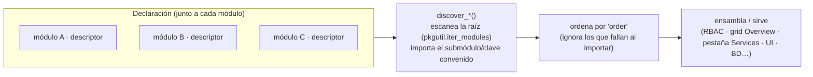
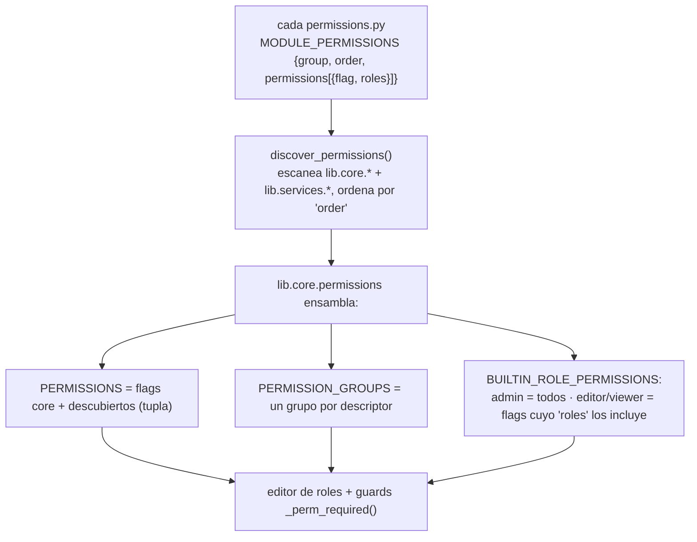
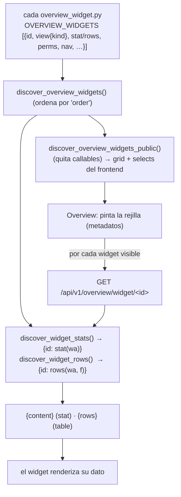
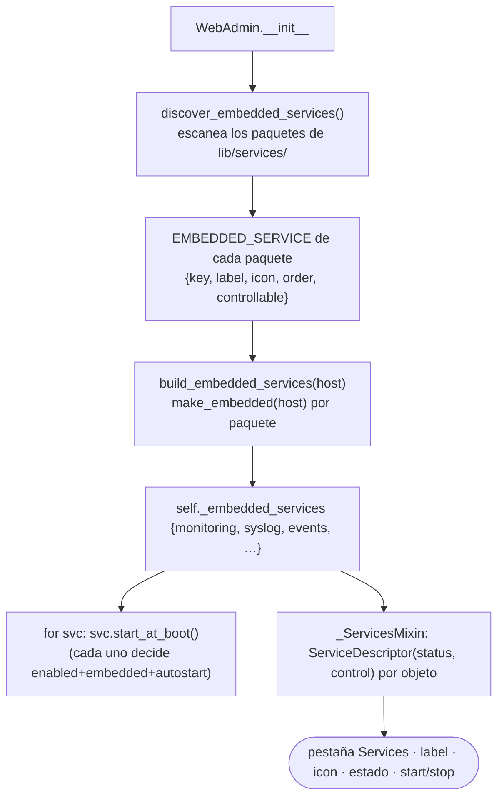
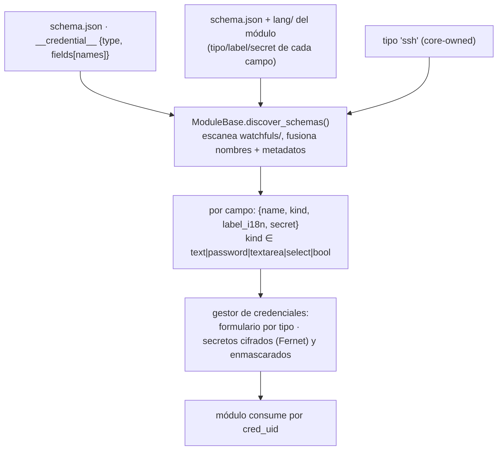
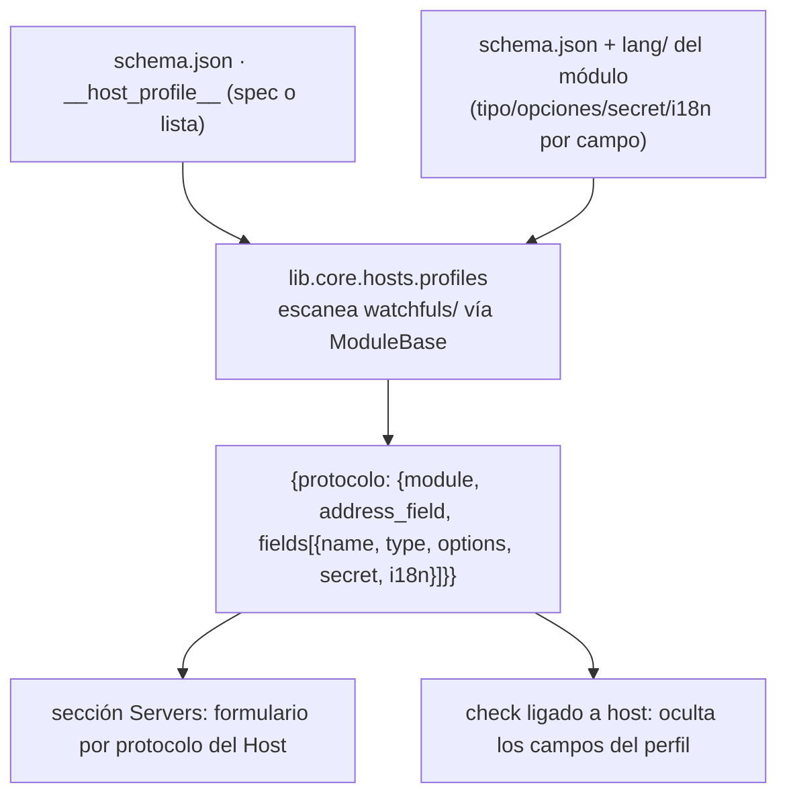
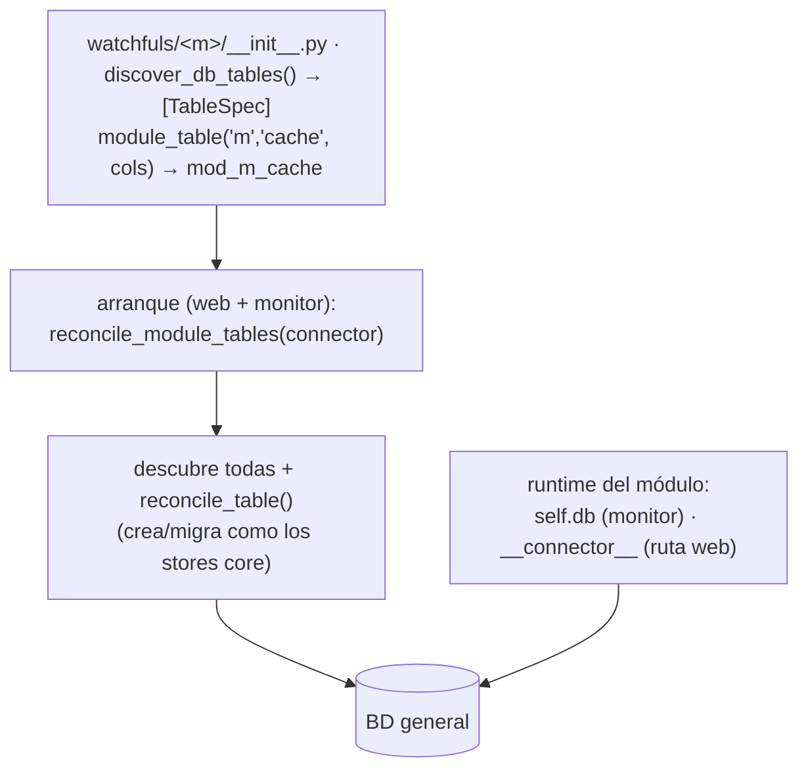
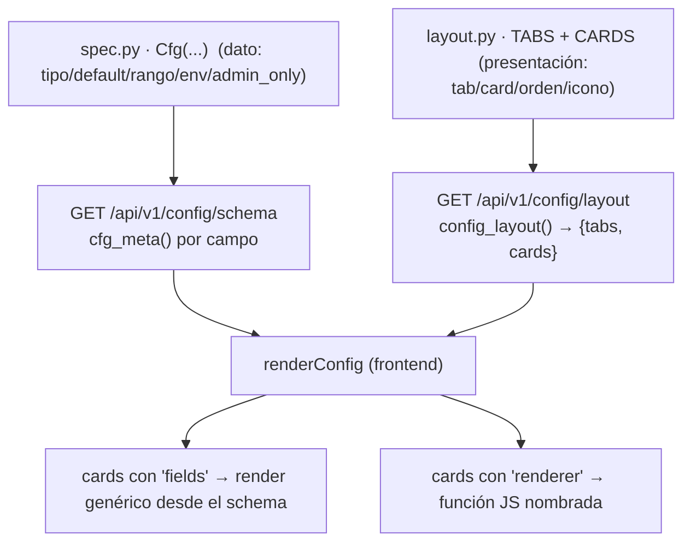

# Sistemas de descubrimiento (self-describing)

ServiceSentry evita los registros centrales hardcodeados: **cada pieza declara lo que
posee en un sitio convenido, y una función `discover_*()` lo recopila en arranque**.
Añadir una capacidad = soltar/editar un descriptor junto a su módulo; quitarla = borrarlo.
Nada del núcleo ni del frontend hay que tocar.

Este documento define **todos** los mecanismos de descubrimiento: qué declara cada uno,
quién lo escanea, el flujo de datos y qué datos fluyen y a dónde.

---

## El patrón común

Todos siguen la misma forma: **escanear una raíz de paquetes → importar un submódulo/clave
convenida de cada uno → recopilar su descriptor → ordenar → ensamblar/servir**. Un fallo de
import en un módulo nunca rompe el resto (se ignora ese módulo).



Difieren solo en **qué raíz escanean** y **qué declaran**:

| Mecanismo | Declara (símbolo) | Raíz escaneada | Recolector | Consume / ensambla |
|---|---|---|---|---|
| [Permisos](#1-permisos-module_permissions) | `permissions.py` · `MODULE_PERMISSIONS` | `lib.core.*` + `lib.services.*` | `discover_permissions()` | `PERMISSIONS` / `PERMISSION_GROUPS` / `BUILTIN_ROLE_PERMISSIONS` |
| [Widgets de Overview](#2-widgets-de-overview-overview_widgets) | `overview_widget.py` · `OVERVIEW_WIDGETS` | `lib.core.*` + `lib.services.*` | `discover_overview_widgets()` (+ `_stats` / `_rows` / `_public`) | grid de Overview + AJAX por widget |
| [Servicios embebidos](#3-servicios-embebidos-embedded_service) | `__init__.py` · `EMBEDDED_SERVICE` (`embedded.py` · `make_embedded`) | `lib.services.*` | `discover_embedded_services()` | pestaña Services (estado + control) |
| [Tipos de credencial](#4-tipos-de-credencial-__credential__) | `schema.json` · `__credential__` | `watchfuls/*` | `ModuleBase.discover_schemas()` | gestor de credenciales (formularios por tipo) |
| [Perfiles de host](#5-perfiles-de-host-__host_profile__) | `schema.json` · `__host_profile__` | `watchfuls/*` | `lib.core.hosts.profiles` | sección Servers (formularios por protocolo) |
| [Tablas de módulo](#6-tablas-de-módulo-discover_db_tables) | `__init__.py` · `discover_db_tables()` | `watchfuls/*` | `reconcile_module_tables()` | BD general (crea/migra `mod_<m>_<n>`) |
| [Provisión Entra](#7-provisión-entra-__entraid_provision__) | `schema.json`/OIDC · `__entraid_provision__` | `watchfuls/*` + config OIDC | `normalize_entraid_provision()` | asistente device-code → registro de app en Graph |
| [Registro de config](#8-registro-de-config-spec-y-layout) | `spec.py` (`Cfg`) + `layout.py` (`TABS`/`CARDS`) | — (registro central, no escaneo) | `config_layout()` / `cfg_meta()` | pantalla de config renderizada desde datos |

> Los tres primeros escanean **dominios de núcleo y servicios** (`lib.core.*` / `lib.services.*`);
> los cuatro siguientes escanean **módulos watchful** (`watchfuls/*`); el último es el registro
> central data-driven de la configuración.

---

## 1. Permisos (`MODULE_PERMISSIONS`)

Cada dominio de núcleo y cada servicio declara los permisos que posee; el editor de roles y
el modelo RBAC se ensamblan a partir de ellos. Solo el grupo `services` queda hardcodeado
(es el anfitrión del mecanismo).

**Descriptor** (`lib/core/<d>/permissions.py` o `lib/services/<s>/permissions.py`) — data pura,
etiquetas i18n por clave:

```python
MODULE_PERMISSIONS = {
    'group': 'perm_group_audit',   # clave i18n del encabezado del grupo en el editor de roles
    'order': 140,                  # posición del grupo (servicios 10–40; dominios de núcleo después)
    'permissions': (
        {'flag': 'audit_view',   'roles': ('editor', 'viewer')},  # a qué roles builtin concede
        {'flag': 'audit_delete', 'roles': ()},                    # () = solo admin
    ),
}
```

**Flujo y datos:**



- **Qué datos:** flags (`str`), a qué roles builtin concede cada flag, y el grupo i18n donde
  se agrupan en el editor.
- **Dónde acaban:** en `lib.core.permissions` (`PERMISSIONS`, `PERMISSION_GROUPS`,
  `BUILTIN_ROLE_PERMISSIONS`), que consumen los mixins de permisos y todos los `@app.route`
  con `_perm_required(<flag>)`.
- **Claves per-instancia** (`module.<n>.*`, `server.<uid>.*`, `cluster.<uid>.*`) NO están en
  `PERMISSIONS`: se validan por patrón con `is_module_perm` / `is_server_perm` / `is_cluster_perm`.


---

## 2. Widgets de Overview (`OVERVIEW_WIDGETS`)

Cada dominio/servicio contribuye tarjetas al dashboard de inicio declarándolas; el frontend
no tiene un `_DW_DEFS` hardcodeado. Cada widget **se describe entero en un descriptor**
(metadatos + proveedor de datos) y **pide sus propios datos por AJAX**.

**Descriptor** (`lib/core/<d>/overview_widget.py`):

```python
def credentials_stat(wa) -> dict:                 # proveedor de datos (server-side)
    ...
    return {'value': total, 'badges': badges}     # forma estándar de una stat card

OVERVIEW_WIDGETS = [
    {'id': 'credentials', 'icon': 'bi-key', 'label_key': 'overview_credentials',
     'cols': 2, 'h': 'auto', 'has_h': False, 'order': 90,   # layout por defecto (span/alto)
     'perms': {'any': ['credentials_view', 'servers_view', 'modules_view']},  # expresión declarativa
     'nav':   {'tab': '#tab-access', 'sub': '#subtab-credentials'},           # click-through
     'stat':  credentials_stat,                                              # ← callable de datos
     'view':  {'kind': 'stat', 'icon': 'bi-key-fill', 'accent': 'teal',
               'data_url': '/api/v1/overview/widget/credentials'}},
]
```

- `view.kind`: `'stat'` (tarjeta con `stat(wa)` → `{value, accent?, icon?, badges}`) o
  `'table'` (lista con `rows(wa, f)` → filas ya filtradas por `f`, + `columns`).
- `perms`: expresión declarativa evaluada en el frontend — `any` = mostrar si el usuario tiene
  ALGUNO de esos flags; `prefix` = OR de cualquier flag que empiece por esos prefijos (per-servidor).
- `view.filter` (solo tablas): filtrado server-side declarativo. `store` = clave del `dataset`
  del widget donde el toolbar guarda el valor; `param` = nombre del query-param con que el
  frontend lo envía **y bajo el que el endpoint lo lee** (default `'f'`; p.ej. syslog usa
  `'severity_max'`). El indicador del filtro activo en la cabecera se declara así:
  - `options: [{v, label_key, badge:{color,bg}}]` → un badge para la opción activa;
  - una opción con `badges: [{label_key,color,bg}, …]` → **varios** badges (filtro compuesto;
    p.ej. Servers `errmaint` → Error + Mantenimiento);
  - `badge_fn: 'sev'` → resuelve nombre/color de la severidad desde el catálogo del frontend
    (syslog) y lo pinta como "≥ nivel" (mínimo de severidad).

**Flujo y datos:**



- **Qué datos:** metadatos (id/icono/label/layout/perms/nav/view) serializados al front; y, por
  AJAX bajo demanda, el contenido real (`{value, badges}` para stats; `{rows}` para tablas).
- **Dónde acaban:** la rejilla de Overview; cada widget carga su dato independiente por el endpoint
  genérico `/api/v1/overview/widget/<id>` (sin agregado monolítico).

---

## 3. Servicios embebidos (`EMBEDDED_SERVICE`)

Cada servicio de fondo (monitoring, syslog, events, ipban…) se autodescribe para la pestaña
Services; el panel los **descubre y compone** (no los hereda). Un servicio nuevo aparece solo
con soltar su paquete en `lib/services/`.

**Descriptor** (`lib/services/<s>/__init__.py`): `EMBEDDED_SERVICE = {key, label, icon, order,
controllable}` (el mismo `__init__` expone `STANDALONE` para el modo dedicado que despacha
`main.py`); la fábrica `make_embedded(host)` vive en `embedded.py`.

**Flujo y datos:**



- **Qué datos:** identidad y capacidades del servicio (clave, etiqueta, icono, si es controlable);
  en runtime, `status()` (estado + detalle) y `control(action)`.
- **Dónde acaban:** la pestaña Services los itera genéricamente (sin ramas por-servicio) para
  pintar tarjeta, estado y botones. Detalle en [services.md](services.md).

---

## 4. Tipos de credencial (`__credential__`)

Un *tipo de credencial* describe los campos que guarda una credencial reutilizable. El tipo
`ssh` es del núcleo; un módulo watchful que necesita su propio secreto (p.ej. el módulo `web`,
autenticación HTTP) declara un tipo que el gestor puede crear/editar y el módulo consume por
referencia (`cred_uid`).

**Descriptor** (en `watchfuls/<m>/schema.json`) — solo nombres de campo, **sin traducciones**:

```json
"__credential__": { "type": "web_auth", "fields": ["auth_user", "auth_password"] }
```

(`__credentials__` — lista — para módulos con varios.)

**Flujo y datos:**



- **Qué datos:** clave del tipo + lista de campos; resueltos a `{name, kind, label_i18n, secret}`.
  Los `secret` se cifran en reposo y se enmascaran en la API.
- **Dónde acaban:** el gestor de credenciales (crear/editar por tipo) y, por referencia
  `cred_uid`, la config de checks del módulo.

---

## 5. Perfiles de host (`__host_profile__`)

Un módulo declara qué **protocolo de conexión** aporta a un Host y qué campos lleva (SNMP,
SSH, un perfil de BD…). El panel usa el catálogo para pintar los formularios por-protocolo de
la sección Servers y para saber qué campos ocultar en un check una vez ligado a un host.

**Descriptor** (en `watchfuls/<m>/schema.json`): `__host_profile__` = un spec o una lista
(datastore aporta varios: túnel `ssh` + perfil `db`).

**Flujo y datos:**



- **Qué datos:** por protocolo, el módulo dueño, el campo de dirección y la lista de campos con
  sus metadatos (tipo, opciones, secret, i18n).
- **Dónde acaban:** los formularios de la sección Servers y la resolución host-céntrica de checks.
  Ver [modules.md](modules.md) y [schema.md](schema.md).

---

## 6. Tablas de módulo (`discover_db_tables`)

Un módulo watchful que necesita tablas propias (cachés, índices derivados, estado) las declara
en vez de inventar almacenamiento; van a la **misma BD** (SQLite/MySQL/PostgreSQL) que los
stores del núcleo.

**Descriptor** (en `watchfuls/<m>/__init__.py`): una función `discover_db_tables()` que devuelve
`TableSpec` construidos con `module_table('<módulo>', '<nombre>', columns)` — namespaced como
`mod_<módulo>_<nombre>` para que nunca colisionen con tablas core ni entre sí.

**Flujo y datos:**



- **Qué datos:** especificaciones de tabla (`TableSpec`: columnas, índices), namespaced por módulo.
- **Dónde acaban:** la BD compartida; el módulo obtiene el conector en runtime vía `self.db`
  (contexto monitor) o la clave `__connector__` inyectada por la ruta web de watchfuls — ambas
  resuelven al mismo conector (misma BD y modelo transaccional que todo lo demás).

---

## 7. Provisión Entra (`__entraid_provision__`)

Un módulo (o la config OIDC) declara la app de Entra que el asistente device-code compartido
debe registrar para su credencial: qué recurso(s) de API, qué roles de *aplicación* y scopes
*delegados*, y — para una app de inicio de sesión — las propiedades tipo SSO (redirect URIs,
claim de grupos, require-assignment).

**Descriptor** (en `watchfuls/<m>/schema.json` o la config OIDC): `__entraid_provision__`
(un dict que `normalize_entraid_provision()` normaliza a una forma estable). El recurso por
defecto es Microsoft Graph (`GRAPH_APP_ID`); los nombres de app son fuente única en
`lib/providers/entraid/declarations.py` (`DEFAULT_APP_NAME`, `OIDC_APP_NAME`, …).

**Flujo y datos:**

```mermaid
flowchart TB
    decl["__entraid_provision__ {resource, app_roles, delegated_scopes, sso_props}"]
    decl --> norm["normalize_entraid_provision() → forma estable"]
    norm --> wiz["asistente device-code (POST /api/v1/auth/entraid/*/device-code|device-poll)"]
    wiz --> graph["lib.providers.entraid.provisioning:<br/>registra app + SP + consentimiento en Microsoft Graph"]
    graph --> cred["devuelve client_id/secret/tenant → credencial del módulo / SSO"]
```

- **Qué datos:** recurso de API, roles de aplicación, scopes delegados y (SSO) redirect URIs +
  claim de grupos; normalizados a una forma estable.
- **Dónde acaban:** el asistente los usa para registrar la app en Entra vía Graph y devolver las
  credenciales. Detalle en [sso-entra.md](sso-entra.md).

---

## 8. Registro de config (spec y layout)

La configuración no se descubre por escaneo de paquetes, pero sí es **data-driven desde una
fuente única**, con la misma filosofía: el dato y la presentación se declaran una vez y la UI
se renderiza desde ahí (nunca hardcodeada en JS).

- **`lib/config/spec.py`** — fuente única del *dato* de cada opción: `Cfg('sección|campo', tipo,
  default, attr=…, env=…, admin_only=…, validación…)`. `cfg_default()` da el valor por defecto;
  `cfg_meta()` la metadata por campo (tipo/rango/opciones/etiquetas).
- **`lib/config/layout.py`** — fuente única de la *presentación*: `TABS` (sub-pestañas
  `{id, label_key, icon}`) y `CARDS` (tarjetas `{tab, id, icon}` con **o** `fields:['sec|campo', …]`
  genéricas **o** `renderer:'database'|'auth'|…` a medida).

**Flujo y datos:**



- **Qué datos:** por campo, tipo/default/rango/opciones/etiquetas (schema) y su ubicación
  (tab+card+orden) en el layout.
- **Dónde acaban:** `renderConfig` pinta la pantalla de Config íntegra desde estas dos fuentes;
  añadir una opción = un `Cfg(...)` en spec.py + (si hace falta) una entrada en un `CARDS`.
  Ver [configuration.md](configuration.md) y [web_admin.md](web_admin.md).

---

## Cómo añadir cada cosa (resumen)

| Quiero… | Toco… |
|---|---|
| Un permiso nuevo en un dominio/servicio | su `permissions.py` → `MODULE_PERMISSIONS.permissions` (+ i18n del flag/grupo) |
| Una tarjeta en el Overview | su `overview_widget.py` → `OVERVIEW_WIDGETS` (+ `stat`/`rows`) |
| Un servicio de fondo nuevo | un paquete en `lib/services/<s>/` con `EMBEDDED_SERVICE` + `make_embedded(host)` |
| Un tipo de credencial para un módulo | `schema.json` → `__credential__` (+ campos en schema/lang) |
| Un protocolo de conexión de host | `schema.json` → `__host_profile__` |
| Una tabla propia de un módulo | `discover_db_tables()` en el `__init__.py` del módulo |
| Registrar una app de Entra para un módulo | `schema.json` → `__entraid_provision__` |
| Una opción de configuración | `Cfg(...)` en `spec.py` (+ entrada en `CARDS` de `layout.py`) |

En todos los casos: **solo el descriptor del módulo** — el núcleo lo descubre y lo integra solo.
