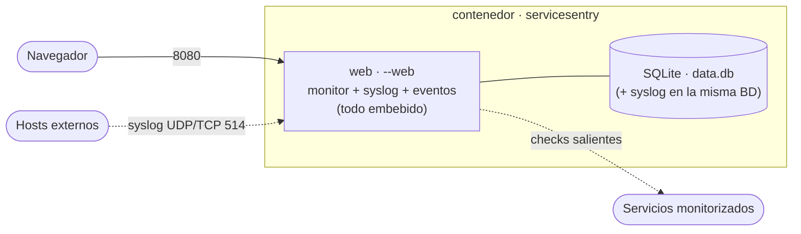
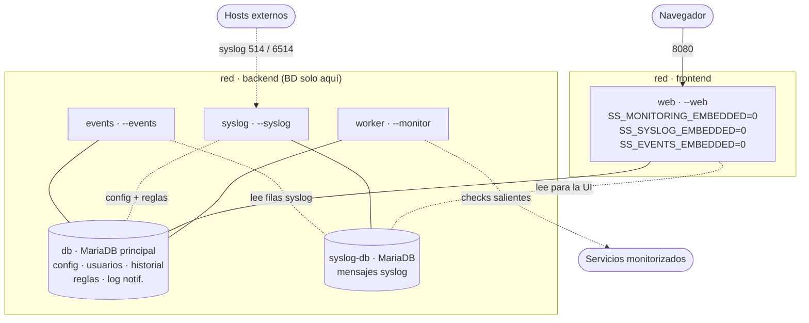
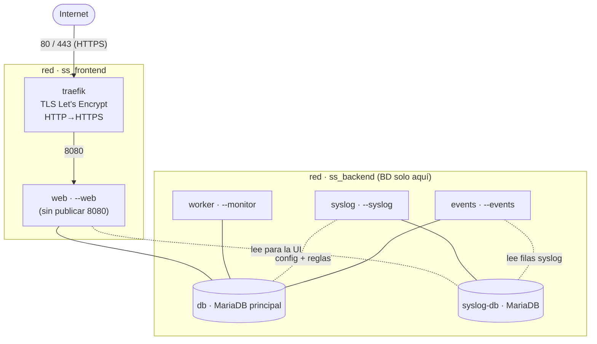
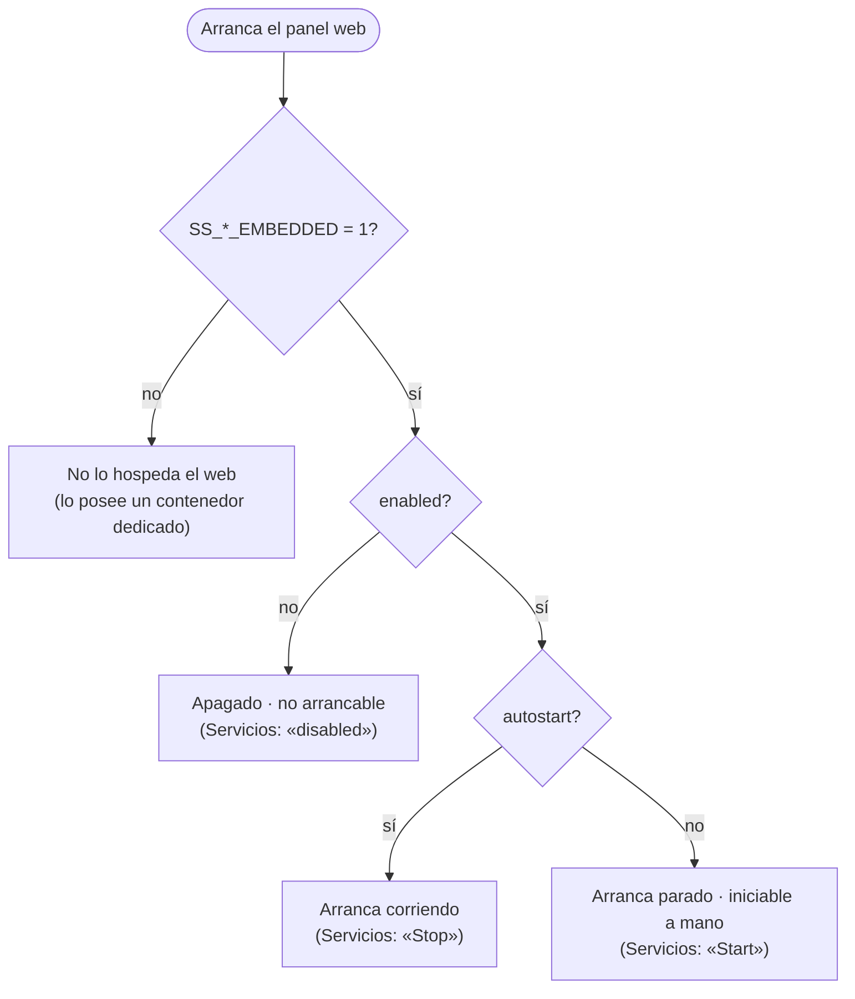

# Despliegue con Docker

Se ofrecen tres topologías a partir de la misma imagen; elige una:

- **Monolítica** (`docker/docker-compose.monolithic.yml`) — un solo contenedor
  `servicesentry`: el panel web hospeda **todos los servicios embebidos** (el
  monitor periódico, el receptor syslog y el procesador de eventos corren en el
  propio proceso). Es el comportamiento por defecto de la imagen (los gates
  `*_EMBEDDED` están activos salvo que se pongan a `0`), así que no necesita env
  extra. La opción más simple.
- **Microservicios** (`docker/docker-compose.microservices.yml`) — seis
  contenedores y **dos** MariaDB: `servicesentry-db` (BD principal: config,
  usuarios, historial, reglas de eventos, log de notificaciones…),
  `servicesentry-syslog-db` (BD dedicada para los mensajes syslog, de alto
  volumen, aislados de la principal), `servicesentry-web` (panel Flask, `--web`),
  `servicesentry-worker` (monitor de servicios independiente, `--monitor`),
  `servicesentry-syslog` (receptor syslog independiente, `--syslog`) y
  `servicesentry-events` (procesador de eventos desacoplado, `--events`: lee por
  cursor los mensajes/eventos almacenados, evalúa las reglas y notifica). Separa
  cada responsabilidad: el monitoreo sobrevive a reinicios del web, y el receptor
  syslog (que liga puertos de red y procesa entrada no confiable) queda aislado
  del panel.
- **Microservicios + Traefik** (`docker/docker-compose.microservices-traefik.yml`)
  — la misma topología anterior **más** un contenedor `servicesentry-traefik`
  como proxy inverso, para **publicar a Internet** por HTTPS con certificado
  **Let's Encrypt** automático (redirección HTTP→HTTPS incluida). Es el único que
  expone los puertos `80`/`443` al host; el `web` ya no publica el `8080`. Requiere
  definir `SS_DOMAIN` y `SS_ACME_EMAIL` (ver tabla más abajo) y apuntar el DNS de
  `SS_DOMAIN` a este host **antes** del primer arranque, para que el challenge
  TLS-ALPN-01 pueda validar el certificado.

La conexión a la BD principal se inyecta por env `SS_DB_*` y la de syslog por
`SS_SYSLOG_DB_*` (ver [configuration.md](configuration.md) → *Sección `database`*);
el `web` arranca con `SS_MONITORING_EMBEDDED=0` para **no** ejecutar el monitor
(lo hace el contenedor `worker`), `SS_SYSLOG_EMBEDDED=0` para **no** ligar los
puertos syslog (los gestiona el contenedor `syslog`) y `SS_EVENTS_EMBEDDED=0` para
**no** evaluar reglas en el panel (lo hace el contenedor `events`). Los contenedores
comparten los volúmenes con nombre y las bases de datos, por lo que leen y escriben
el mismo estado.

Ambas topologías de microservicios definen dos **redes** (ver
[Redes](#redes)): `backend` (tráfico interno servicio↔servicio y bases de datos —
las BD viven **solo** aquí) y `frontend` (plano externo: el panel web y, en la
variante Traefik, el proxy↔web).

> **No mezcles las dos.** En la topología de microservicios el `web` lleva
> `SS_MONITORING_EMBEDDED=0` precisamente para que **no** corra el monitor a la vez
> que el `worker`: serían dos procesos sin lock compartido y duplicarían cada check
> (histórico doble y tormenta de notificaciones). En monolítica corre solo el
> monitor embebido del `web`, sin `worker`.

## Diagramas de arquitectura

### Monolítica

Un único contenedor: el `web` hospeda todos los servicios embebidos y guarda el
estado en SQLite. Sencillo de operar; un solo proceso lo hace todo.



### Microservicios

Cada responsabilidad en su propio contenedor: el `web` solo sirve el panel (con
los gates `*_EMBEDDED=0`), y `worker` / `syslog` / `events` poseen el monitor, el
receptor y el procesador de reglas. Dos MariaDB (principal + syslog) y dos redes
(`backend` interna, `frontend` expuesta).



### Microservicios + Traefik

Idéntica a la anterior **más** un `traefik` como proxy inverso que publica por
HTTPS (Let's Encrypt) en los puertos `80`/`443`; el `web` ya no expone el `8080`
(solo es alcanzable por el proxy en la red `frontend`).



### Control de un servicio (embebido)

Para cada servicio embebido, dos ejes deciden si corre: el gate de entorno
`*_EMBEDDED` (¿lo hospeda el `web`?) y, dentro del panel, `enabled` (interruptor
maestro) + `autostart` (¿arrancar al iniciar la web?). `autostart` solo aplica al
modo embebido; un proceso dedicado lo ignora.



## Inicio rápido

```bash
# Monolítica (un contenedor)
docker compose -f docker/docker-compose.monolithic.yml up -d

# Microservicios (web + worker + syslog + events, 2 BD)
docker compose -f docker/docker-compose.microservices.yml up -d

# Microservicios + Traefik (publicado a Internet por HTTPS)
docker compose -f docker/docker-compose.microservices-traefik.yml up -d
```

El panel web de administración queda disponible en `http://tu-servidor:8080`
(o en `https://SS_DOMAIN` con la topología Traefik).

## Construir y ejecutar

```bash
# Construir la imagen e iniciar (ejemplo con la topología monolítica)
docker compose -f docker/docker-compose.monolithic.yml up -d --build

# Ver logs
docker logs -f servicesentry            # monolítica
docker logs -f servicesentry-web        # microservicios
docker logs -f servicesentry-worker     # microservicios
docker logs -f servicesentry-syslog     # microservicios (receptor syslog)
docker logs -f servicesentry-events     # microservicios (procesador de eventos)
docker logs -f servicesentry-traefik    # topología Traefik (proxy/TLS)

# Parar
docker compose -f docker/docker-compose.monolithic.yml down
```

## Configuración

La configuración se pasa como variables de entorno. Los secretos y ajustes
custom viven en `docker/.env` (copia de `docker/env.example`, gitignored), que
ambos compose cargan con `env_file`; en los compose solo quedan los valores que
dependen del servicio/topología (`SS_SERVICE_ROLE`, `SS_WEB_HOST`/`SS_WEB_PORT`, y
los gates `SS_MONITORING_EMBEDDED`/`SS_SYSLOG_EMBEDDED`/`SS_EVENTS_EMBEDDED`). Los
valores de `environment:` del compose tienen prioridad sobre los del `.env`.
El script de arranque `entrypoint.sh` solo traduce a flags del CLI `SS_SERVICE_ROLE`,
`SS_WEB_HOST`, `SS_WEB_PORT`, `SS_VERBOSE`, `SS_LOG_LEVEL` y `SS_SYSLOG_HOST`/
`SS_SYSLOG_PORT`; el resto de variables (config.json,
`SS_*`) las aplica en runtime el proceso Python y **nunca
se escriben a `config.json`**. Las variables que no estén definidas dejan el valor
de configuración existente sin modificar, por lo que los cambios realizados desde
el panel web sobreviven a los reinicios del contenedor.

### Referencia de variables de entorno

| Variable | Valor por defecto | Descripción |
| -------- | ----------------- | ----------- |
| `SS_SERVICE_ROLE` | *(obligatorio)* | `web`, `worker`, `syslog` o `events` |
| `TZ` | `UTC` | Zona horaria del contenedor |
| **Base de datos** (microservicios) | | |
| `SS_DB_DRIVER` | `sqlite` | Motor: `sqlite` / `mysql` / `postgresql` (`mariadb` = alias de `mysql`) |
| `SS_DB_HOST` | `localhost` | Host del servidor de BD (p. ej. `db`) |
| `SS_DB_PORT` | *(según motor)* | Puerto (3306 MySQL/MariaDB, 5432 PostgreSQL) |
| `SS_DB_NAME` | `servicesentry` | Nombre de la base de datos |
| `SS_DB_USER` | *(vacío)* | Usuario de la BD |
| `SS_DB_PASSWORD` | *(vacío)* | Contraseña de la BD |
| `SS_DB_ROOT_PASSWORD` | *(vacío)* | Solo para el contenedor MariaDB del compose (root) |
| **Base de datos de syslog** (microservicios) | | |
| `SS_SYSLOG_DB_ENABLED` | `0` | `1` enruta los mensajes syslog a su BD dedicada; `0`/vacío los deja en la BD principal |
| `SS_SYSLOG_DB_DRIVER` | `sqlite` | Motor de la BD de syslog (`sqlite` / `mysql` / `postgresql`) |
| `SS_SYSLOG_DB_HOST` | `localhost` | Host de la BD de syslog (p. ej. `syslog-db`) |
| `SS_SYSLOG_DB_PORT` | *(según motor)* | Puerto de la BD de syslog |
| `SS_SYSLOG_DB_NAME` | `servicesentry_syslog` | Nombre de la BD de syslog |
| `SS_SYSLOG_DB_USER` | *(vacío)* | Usuario de la BD de syslog |
| `SS_SYSLOG_DB_PASSWORD` | *(vacío)* | Contraseña de la BD de syslog |
| `SS_SYSLOG_DB_ROOT_PASSWORD` | *(vacío)* | Solo para el contenedor MariaDB `syslog-db` del compose (root) |
| **Traefik / TLS público** (topología Traefik) | | |
| `SS_DOMAIN` | *(obligatorio)* | FQDN público, p. ej. `monitor.example.com`. Usado por el router de Traefik y como `SS_PUBLIC_URL` |
| `SS_ACME_EMAIL` | *(obligatorio)* | Email para el registro del certificado Let's Encrypt |
| **Servidor web** | | |
| `SS_WEB_HOST` | `0.0.0.0` | Dirección a la que se enlaza el panel web |
| `SS_MONITORING_EMBEDDED` | `1` | `0` para que el web **no** ejecute el monitor de servicios (lo hace el contenedor `worker`). Se pone a `0` en el `web` de microservicios |
| `SS_SYSLOG_EMBEDDED` | `1` | `0` para que el web **no** ligue los puertos syslog (los gestiona el contenedor `syslog`) |
| `SS_EVENTS_EMBEDDED` | `1` | `0` para que el web **no** evalúe las reglas de eventos (lo hace el contenedor `events`) |
| `SS_WEB_PORT` | `8080` | Puerto en el que escucha el panel web (argumento `--web-port`). Tiene prioridad sobre `SS_PORT` y el valor guardado en `config.json` |
| `SS_PORT` | `8080` | Override en runtime del puerto web (`web_admin` → `port`); equivalente al campo **Puerto web** en Configuración → Acceso Externo. Si además se define `SS_WEB_PORT`, manda **`SS_WEB_PORT`** (prioridad: `SS_WEB_PORT` > `SS_PORT` > `config.json`) |
| **Receptor syslog** (rol `syslog`) | | |
| `SS_SYSLOG_HOST` | *(vacío)* | Override del host de escucha del receptor (`--syslog-host`); vacío = valor de config |
| `SS_SYSLOG_PORT` | *(vacío)* | Override del puerto UDP **y** TCP del receptor (`--syslog-port`); TLS conserva su puerto |
| **Credenciales** | | |
| `SS_USERNAME` | *(obligatorio)* | Usuario del panel de administración |
| `SS_PASSWORD` | *(obligatorio)* | Contraseña del panel de administración |
| **Apariencia** | | |
| `SS_LANG` | `en_EN` | Idioma de la interfaz (`en_EN` / `es_ES`) |
| `SS_DARK_MODE` | `false` | Activar el modo oscuro por defecto |
| **Seguridad** | | |
| `SS_SECURE_COOKIES` | `false` | Poner a `true` al servir sobre HTTPS |
| `SS_REMEMBER_ME_DAYS` | `30` | Duración de la sesión en días |
| `SS_PROXY_COUNT` | `0` | Número de proxies inversos delante de la aplicación |
| `SS_PUBLIC_URL` | *(vacío)* | Nombre de host público, sin esquema — p. ej. `monitor.example.com` o `monitor.example.com:8080`. Necesario para los enlaces de Telegram y el acceso directo a la página de estado cuando se accede por un dominio distinto a la IP del servidor |
| `SS_FORCE_HTTPS` | `false` | `true` cuando el proxy inverso termina HTTPS — la app generará URLs `https://` aunque internamente use HTTP |
| `SS_FORCE_FQDN` | `false` | `true` para redirigir al hostname de `SS_PUBLIC_URL` si se accede por IP u otro nombre, conservando la ruta y los parámetros. Requiere `SS_PUBLIC_URL` |
| **Página de estado pública** | | |
| `SS_PUBLIC_STATUS` | `false` | Habilitar el endpoint `/status` sin autenticación |
| `SS_PUBLIC_STATUS_DETAIL` | `false` | Mostrar el detalle por ítem en la página de estado pública |
| `SS_STATUS_REFRESH_SECS` | `60` | Intervalo de refresco automático en la página de estado |
| `SS_STATUS_LANG` | *(vacío)* | Idioma específico para la página de estado; por defecto usa `SS_LANG` |
| **Log de auditoría** | | |
| `SS_AUDIT_MAX_ENTRIES` | `500` | Número máximo de entradas a conservar en el log de auditoría |
| **Monitor / Worker** | | |
| `SS_CHECK_INTERVAL` | `300` | Segundos entre comprobaciones (periodo del worker y del scheduler embebido) |
| **Telegram** | | |
| `SS_TELEGRAM_TOKEN` | *(no definido)* | Token del bot de Telegram |
| `SS_TELEGRAM_CHAT_ID` | *(no definido)* | ID del chat o grupo de Telegram |
| `SS_TELEGRAM_GROUP_MESSAGES` | `false` | Agrupar varias alertas en un único mensaje |
| **Varios** | | |
| `SS_VERBOSE` | `false` | Activar salida detallada / debug (fuerza el nivel máximo, equivale a `--verbose`). Para un nivel concreto usa `SS_LOG_LEVEL` o `global.log_level` desde el panel (**Configuración → Interfaz**) |
| `SS_LOG_LEVEL` | *(vacío)* | Nivel de log para cualquier rol (`off`/`debug`/`info`/`warning`/`error`); sobreescribe el valor guardado. `SS_VERBOSE`/`-v` siguen forzando debug. Vacío = usa el valor guardado |
| `NO_COLOR` | *(no definido)* | Si se define (cualquier valor), desactiva los colores ANSI del debug. Los logs de Docker no son un TTY, así que el color ya se desactiva solo |

> **Nota:** las variables `SS_WEB_HOST`, `SS_WEB_PORT` y `SS_VERBOSE` las traduce el
> `entrypoint.sh` a los flags `--web-host`/`--web-port`/`--verbose`.
> Alternativamente, el CLI lee directamente variables `SS_*` (`SS_WEB`,
> `SS_WEB_PORT`, `SS_WEB_HOST`, `SS_VERBOSE`, `SS_NOCOLOR`, `SS_CONFIG_DIR`…)
> sin pasar por el entrypoint — ver [configuration.md](configuration.md#variables-de-entorno).
> Los campos de `config.json` (variables `SS_*` como `SS_LANG`, `SS_CHECK_INTERVAL`,
> `SS_TELEGRAM_TOKEN`) se aplican en runtime por el proceso Python y nunca se escriben a disco.

#### Servicios embebidos vs. dedicados

Cada servicio (monitor, syslog, eventos) tiene **dos ejes** independientes: dónde
corre y cómo se controla.

- **Dónde corre** lo deciden los gates de entorno `SS_MONITORING_EMBEDDED` /
  `SS_SYSLOG_EMBEDDED` / `SS_EVENTS_EMBEDDED` (`1` = lo hospeda el `web`; `0` = lo
  posee un contenedor dedicado `worker`/`syslog`/`events`). Es decisión de
  topología y vive en el compose.
- **Cómo se controla** son ajustes de config editables en el panel (Configuración
  → pestaña del servicio + pestaña Servicios): `enabled` (interruptor maestro) y
  `autostart` (¿arrancar al iniciar el panel web?). `autostart` **solo aplica al
  modo embebido**; un proceso dedicado (`--monitor` / `--syslog` / `--events`) lo
  ignora y corre siempre que el servicio esté `enabled`.

### Variables sensibles

`SS_USERNAME`, `SS_PASSWORD`, `SS_TELEGRAM_TOKEN` y `SS_TELEGRAM_CHAT_ID` no tienen
valor por defecto en la imagen y deben definirse explícitamente. Para despliegues
en producción considera usar
[Docker Secrets](https://docs.docker.com/engine/swarm/secrets/) en lugar de
variables de entorno en texto plano.

## Volúmenes

```yaml
volumes:
  config:        # → /etc/ServiSesentry      (config.json)
  vardata:       # → /var/lib/ServiSesentry  (data.db: usuarios, roles, grupos, sesiones, auditoría, hosts, credenciales, historial, estado de checks y config de módulos/ítems — tablas module_config/module_config_items)
  dbdata:        # MariaDB principal           (solo microservicios)
  syslogdbdata:  # MariaDB de syslog           (solo microservicios)
  letsencrypt:   # acme.json de Traefik        (solo topología Traefik)
```

Todos son volúmenes con nombre gestionados por Docker. Para inspeccionar su
ubicación en disco:

```bash
docker volume inspect docker_config
docker volume inspect docker_vardata
docker volume inspect docker_dbdata
docker volume inspect docker_syslogdbdata
```

Para hacer una copia de seguridad o precargar el volumen de configuración:

```bash
# Copiar un fichero de configuración local al volumen
docker run --rm -v docker_config:/data -v $(pwd)/data:/src alpine \
    cp /src/config.json /data/config.json
```

## Redes

Las topologías de microservicios segmentan el tráfico en dos redes para aislar
las bases de datos del plano expuesto:

| Red | Quién la usa | Para qué |
| --- | ------------ | -------- |
| `backend` | `db`, `syslog-db`, `web`, `worker`, `syslog` | Tráfico interno servicio↔servicio y a las bases de datos. Las BD viven **solo** aquí, así que nunca quedan en el plano externo. |
| `frontend` | `web` (y `traefik` en la variante con proxy) | Plano externo. En la variante Traefik, el proxy enruta al `web` por esta red. |

- El `worker` solo necesita `backend` (alcanza la BD y hace egress de
  monitorización por el gateway de esa red).
- El `syslog` está solo en `backend`; su entrada externa es el mapeo de puertos
  al host (UDP/TCP crudo), no el plano `frontend`.
- En la variante Traefik las redes llevan **nombres fijos** (`ss_backend` /
  `ss_frontend`) para que el routing del proxy (`providers.docker.network` y la
  label `traefik.docker.network`) no dependa del nombre del proyecto compose.

## Actualización

```bash
# (usa el mismo fichero compose con el que arrancaste)
docker compose -f docker/docker-compose.monolithic.yml pull   # o reconstruir
docker compose -f docker/docker-compose.monolithic.yml up -d --build
```

Los ficheros de configuración en los volúmenes con nombre se conservan entre
actualizaciones.

## Proxy inverso

Consulta la [guía de proxy inverso](deployment.md#proxy-inverso) para las instrucciones completas de NPM y Traefik.

Al ejecutar detrás de cualquier proxy inverso con terminación HTTPS, configura estas variables en tu fichero compose:

```yaml
environment:
  SS_PROXY_COUNT: "1"
  SS_PUBLIC_URL: "monitor.example.com"   # sin esquema, sin barra final
  SS_FORCE_HTTPS: "true"
  SS_SECURE_COOKIES: "true"
```

### Traefik

La forma más sencilla es usar el compose ya preparado
`docker/docker-compose.microservices-traefik.yml`, que incluye un contenedor
Traefik con TLS Let's Encrypt automático y todo cableado (solo necesitas
`SS_DOMAIN` y `SS_ACME_EMAIL` en `docker/.env`):

```bash
docker compose -f docker/docker-compose.microservices-traefik.yml up -d
```

Si en cambio ya tienes una instancia de Traefik propia y solo quieres exponer el
`web`, añade las labels al servicio `servicesentry-web` y conéctalo a la red de
tu Traefik:

```yaml
services:
  servicesentry-web:
    networks:
      - traefik_public
    labels:
      - "traefik.enable=true"
      - "traefik.http.routers.sentry.rule=Host(`monitor.example.com`)"
      - "traefik.http.routers.sentry.entrypoints=websecure"
      - "traefik.http.routers.sentry.tls.certresolver=letsencrypt"
      - "traefik.http.services.sentry.loadbalancer.server.port=8080"
    environment:
      SS_PROXY_COUNT: "1"
      SS_PUBLIC_URL: "monitor.example.com"
      SS_FORCE_HTTPS: "true"
      SS_SECURE_COOKIES: "true"

networks:
  traefik_public:
    external: true
```

> `websecure` y `letsencrypt` son los nombres de entrypoint y certresolver
> habituales en una instalación estándar de Traefik. Ajústalos si los tuyos tienen
> nombres distintos.

#### Syslog y Traefik (por qué va directo)

En la topología Traefik, **Traefik frontea solo el `web` (HTTP/TLS)**; el contenedor
`syslog` publica sus puertos (`514/udp`, `514/tcp`, `6514/tcp`) **directamente en el
host**. Es deliberado: Traefik es un proxy que reabre la conexión hacia el backend,
así que el receptor syslog vería **la IP de Traefik** como origen de *todos* los
mensajes en vez de la del emisor real. Eso rompería:

- el allowlist **`allowed_sources`** (filtrado por IP/CIDR),
- el campo **"source"** de la pestaña Syslog,
- el **matching por host** de las reglas de eventos.

UDP no puede preservar la IP en absoluto; TCP solo con PROXY protocol, que el listener
no interpreta. Por eso mantener los puertos directos en el `syslog` conserva la IP de
origen, que es lo que esas funciones necesitan.

**Enrutarlo igualmente por Traefik (single-ingress).** Si priorizas un único punto de
entrada y **no** usas filtrado/atribución por IP, Traefik v3 sí puede frontear syslog
con routers **TCP y UDP**. El compose `docker-compose.microservices-traefik.yml` lleva
un **bloque `OPCIONAL` comentado** con la receta exacta (entrypoints `syslog-udp`/
`syslog-tcp`/`syslog-tls`, mover el `ports:` del `syslog` al `traefik`, conectar
`syslog` a la red `frontend` y sus labels de router con `HostSNI(\`*\`)` para TCP y
`tls.passthrough=true` para el 6514). Recuerda el trade-off: con esa variante **se
pierde la IP de origen** y el allowlist por IP deja de ser fiable.

### Nginx Proxy Manager (NPM)

NPM no requiere configuración de cabeceras manual — las añade automáticamente.

1. Crea un **Proxy Host** apuntando a `http://<ip-del-servidor>:8080`
2. En la pestaña **SSL** activa el certificado Let's Encrypt y marca *Force SSL*
3. Configura las variables de entorno en tu fichero compose:

```yaml
environment:
  SS_PROXY_COUNT: "1"
  SS_PUBLIC_URL: "monitor.example.com"
  SS_FORCE_HTTPS: "true"
  SS_SECURE_COOKIES: "true"
```
