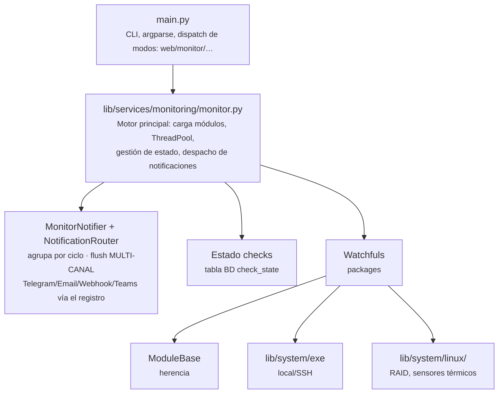
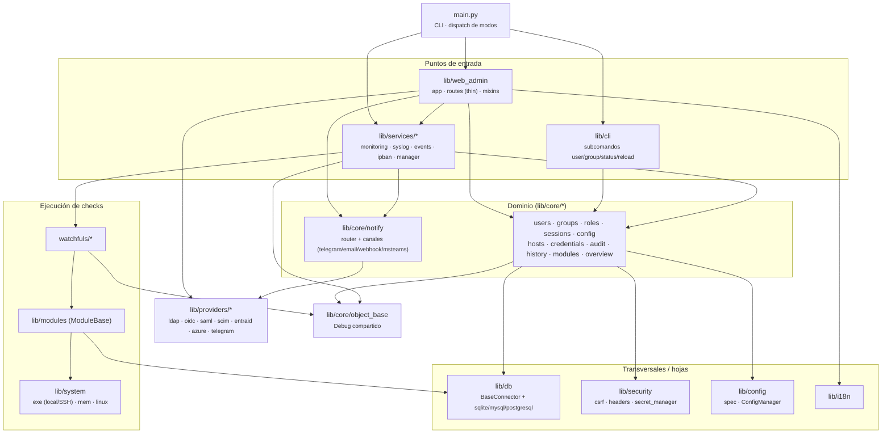
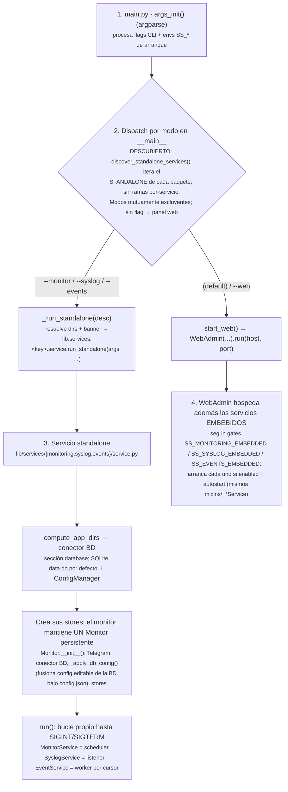
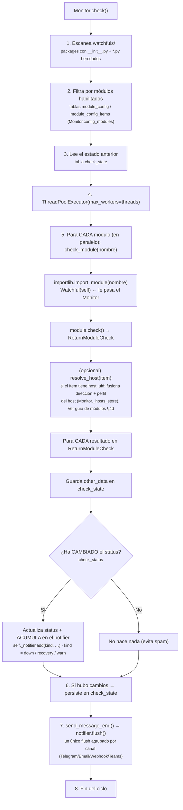
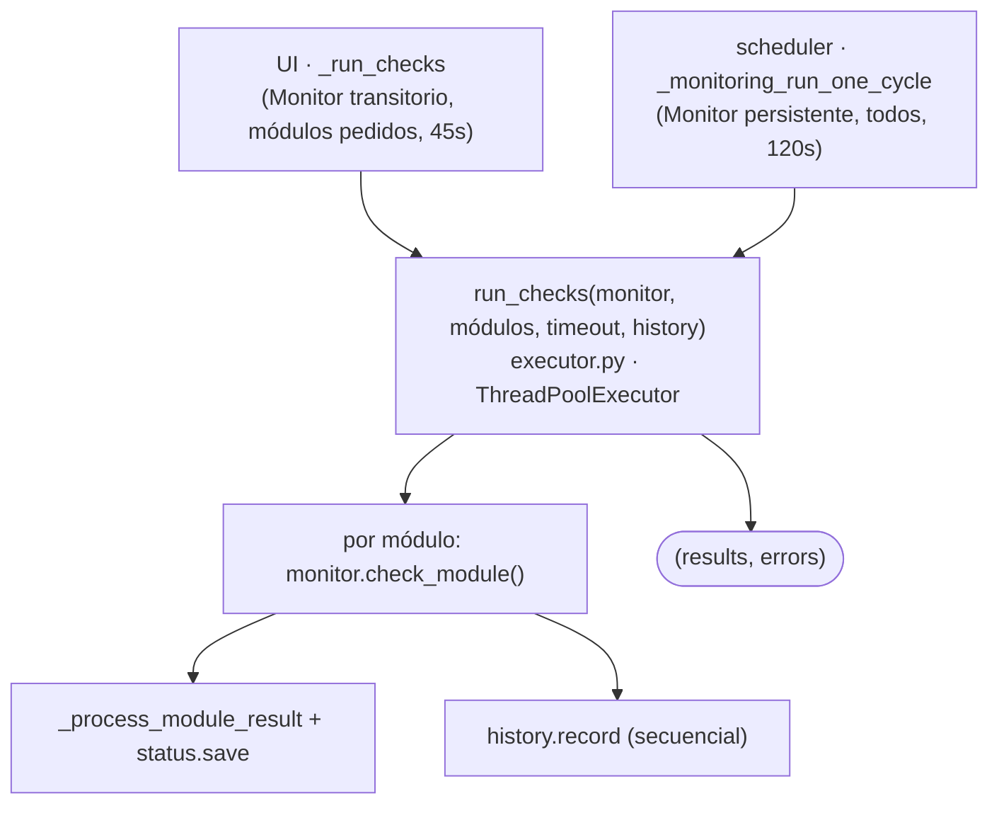
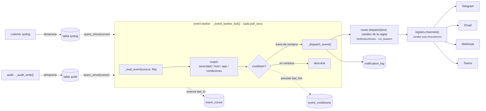

# Arquitectura

Visión técnica del diseño interno de ServiceSentry: diagrama de componentes,
jerarquía de clases, estructura de directorios y flujo de ejecución.

---

## Diagrama de Componentes



---

## Dependencias entre módulos

Vista de **capas** (alto nivel): las flechas indican "depende de / usa". Las dependencias
apuntan hacia abajo; `lib/db`, `lib/security`, `lib/config` e `lib/i18n` son hojas
transversales, y `lib/core/object_base` (con el `Debug` compartido) es la base de todo.



> Es una vista de capas, no el grafo de importaciones completo. El **catálogo físico** de
> stores por dominio está en [ref-esquema-bd.md](ref-esquema-bd.md); la organización de
> ficheros exacta, en la [estructura de directorios](#estructura-de-directorios).

## Jerarquía de Clases

```text
ObjectBase (lib/core/object_base.py)
├── debug: Debug  ← instancia compartida por TODAS las clases
│
├── Main (main.py)
├── Monitor (lib/services/monitoring/monitor.py)
├── Telegram (lib/providers/telegram.py)          ← cliente de bajo nivel de la Bot API (send_telegram); lo envuelve el canal telegram/
├── NotificationRouter (lib/core/notify/router.py) ← POSEE los stores de canal y ES el routing; dispatch(kind,…) (sin Flask, agnóstico de canal)
│   └── NotifyContext (lib/core/notify/context.py)  ← bundle de colaboradores (db, read_config, fernet, dbg, audit, public_url, panel_user_emails); nunca Flask ni el web admin
│       # Canales auto-registrados (registry.py) + kinds descubiertos (events.py). Detalle de entrega → explica-notificaciones.md
├── ConfigManager (lib/config/manager.py)         ← ÚNICO dueño de la E/S de config (read/write/migrate)
│   ├── ConfigStore-BD (lib/core/config/store.py)      ← capa editable: tabla `config` (una fila por sección|campo)
│   ├── ConfigControl (lib/config/config_control.py)  ← I/O JSON de config.json (solo arranque + pins)
│   └── lib/config/resolve.py: resolve_config() fusiona env > config.json > BD > default;
│       migrate_config_to_db() migración única; FILE_ONLY_SECTIONS = {database}
│       (webhooks NO: tienen su propia tabla, lib/core/notify/webhook/store.py)
│       (lib/config/spec.py: registro central de defaults; load_config() ya NO siembra a disco)
├── WebAdmin (lib/web_admin/app.py)
│   # Dominios de núcleo empaquetados como módulos self-contained en lib/core/<d>/
│   # (store + mixin + routes + service + permissions); las rutas son finas (solo HTTP:
│   # parseo, sesión, persistencia, audit) y delegan la validación/mutación en service.py
│   # (sin Flask, reutilizable por CLI); WebAdmin HEREDA su mixin:
│   ├── _UsersMixin      (lib/core/users/mixin.py)
│   ├── _RolesMixin      (lib/core/roles/mixin.py)
│   ├── _GroupsMixin     (lib/core/groups/mixin.py)
│   ├── _SessionsMixin   (lib/core/sessions/mixin.py)
│   ├── _AuditMixin      (lib/core/audit/mixin.py)   (store en el módulo; también lo importan monitoring/events)
│   ├── _ChecksMixin     (lib/services/monitoring/checks_mixin.py) ← Checks tab = glue del motor de monitoring
│   ├── _PermissionsMixin(lib/core/permissions/mixin.py)  ← calcula permisos efectivos
│   ├── _ConfigMixin     (lib/core/config/mixin.py)       ← leer/aplicar/escribir config + overlay SS_*
│   # Glue que sigue en lib/web_admin/mixins/ (no es un dominio: ni store ni permisos propios):
│   ├── _AuthMixin       (lib/web_admin/mixins/auth.py)         ← login local/LDAP/OIDC/SAML
│   ├── _ServicesMixin   (lib/web_admin/mixins/services.py) ← descubre + controla los servicios embebidos
│   ├── _StoresMixin     (lib/web_admin/mixins/stores.py)   ← construir los stores al arrancar
│   ├── _ScannersMixin   (lib/web_admin/mixins/scanners.py) ← salud de servicios, certificados, secretos
│   └── _EmbedMixin      (lib/web_admin/mixins/embed.py)    ← frame-ancestors + SameSite de la cookie
│   # Los servicios NO se heredan: WebAdmin COMPONE un objeto embebido por servicio
│   # (self._embedded_services), construido en __init__:
│   ├─ EmbeddedMonitor  (lib/services/monitoring/embedded.py)  ← _MonitoringMixin + contexto del host
│   ├─ EmbeddedSyslog   (lib/services/syslog/embedded.py)      ← _SyslogMixin + gate SS_SYSLOG_EMBEDDED/autostart
│   └─ EmbeddedEvents   (lib/services/events/embedded.py)      ← _EventsMixin + worker desacoplado
│       (cada objeto comparte su lógica con el servicio standalone del mismo paquete)
├── BaseConnector (lib/db/base.py)              ← capa de BD pluggable
│   ├── SQLiteConnector       (lib/db/sqlite.py)      [por defecto / tests]
│   ├── MySQLConnector        (lib/db/mysql.py)       [producción, con PostgreSQL]
│   └── PostgreSQLConnector   (lib/db/postgresql.py)  [producción]
│   # SQL portable a los 3 motores: quote_ident cita los identificadores reservados
│   # (key/user/virtual/tabla groups); el atributo KIND ramifica lo específico de dialecto
│   # (CONCAT vs ||, json_extract vs jsonb_extract_path_text, CAST INTEGER/SIGNED, last_insert_id);
│   # rebuild de migración atómico en MySQL (RENAME) y transaccional en SQLite/PG.
│   # Verificado contra MySQL/MariaDB + PostgreSQL reales (tests/e2e/test_db_portability_live.py).
├── Stores (reciben un BaseConnector inyectado)
│   # Stores de dominios de núcleo movidos a su módulo (lib/core/<d>/store.py):
│   ├── UsersStore      (lib/core/users/store.py)     → tablas users, users_groups
│   ├── GroupsStore     (lib/core/groups/store.py)    → tablas groups, groups_roles
│   ├── RolesStore      (lib/core/roles/store.py)     → tabla roles
│   ├── SessionsStore   (lib/core/sessions/store.py)  → tabla sessions
│   ├── AuditStore      (lib/core/audit/store.py)        → tabla audit (COMPARTIDO: lo usan monitoring/events)
│   # Resto de stores, en su servicio/dominio (lib/services/*/store, lib/core/*):
│   ├── CheckStateStore (lib/services/monitoring/check_state/store.py)  → tabla check_state (estado vivo de checks)
│   ├── CredentialsStore(lib/core/credentials/store.py)  → tabla credentials (identidades SSH reutilizables)
│   ├── HistoryStore    (lib/core/history/store.py)      → tabla history (series temporales)
│   ├── HostsStore      (lib/core/hosts/store.py)        → tabla hosts (servidores + perfiles de conexión)
│   ├── ModulesStore    (lib/core/modules/store.py)  → tablas module_config, module_config_items (config de módulos/ítems)
│   ├── ConfigStore     (lib/core/config/store.py)       → tabla config (capa editable: una fila por sección|campo)
│   ├── WebhooksStore   (lib/core/notify/webhook/store.py) → tabla webhooks (destinos HTTP salientes)
│   ├── EventRulesStore (lib/services/events/store/rules.py)  → tabla event_rules (reglas de notificación)
│   ├── NotificationLogStore (lib/services/events/store/log.py) → tabla notification_log (log de envíos)
│   ├── EventStateStore (lib/services/events/store/state.py)   → tablas event_cooldowns + event_cursor (estado del worker de eventos)
│   ├── SyslogStore     (lib/services/syslog/store/messages.py)  → tabla syslog (mensajes; puede ir en BD dedicada)
│   └── SyslogDropsStore(lib/services/syslog/store/drops.py)     → tabla syslog_drops (orígenes descartados por la allowlist)
└── ModuleBase (lib/modules/module_base.py)
    ├── watchfuls.cpu::Watchful               🌐 (multiplataforma)
    ├── watchfuls.datastore::Watchful         🌐 (multiplataforma; MySQL/PostgreSQL/MSSQL/Mongo/Redis/Influx/Elastic)
    ├── watchfuls.dns::Watchful               🌐 (multiplataforma)
    ├── watchfuls.filesystemusage::Watchful  🌐 (multiplataforma)
    ├── watchfuls.hddtemp::Watchful
    ├── watchfuls.keepalived::Watchful        (Linux; cluster VRRP multi-nodo)
    ├── watchfuls.m365::Watchful              🌐 (multiplataforma; Microsoft Graph / SharePoint)
    ├── watchfuls.ntp::Watchful               🌐 (multiplataforma)
    ├── watchfuls.ping::Watchful              🌐 (multiplataforma)
    ├── watchfuls.process::Watchful           🌐 (multiplataforma)
    ├── watchfuls.proxmox::Watchful           🌐 (multiplataforma; Proxmox VE REST)
    ├── watchfuls.raid::Watchful
    ├── watchfuls.ram_swap::Watchful          🌐 (multiplataforma)
    ├── watchfuls.service_status::Watchful   🌐 (multiplataforma)
    ├── watchfuls.snmp::Watchful             🌐 (multiplataforma; SNMPv1/v2c/v3 + gestión de MIBs)
    ├── watchfuls.ssl_cert::Watchful          🌐 (multiplataforma)
    ├── watchfuls.temperature::Watchful
    ├── watchfuls.ups::Watchful               🌐 (multiplataforma; NUT)
    └── watchfuls.web::Watchful              🌐 (multiplataforma)
```

---

## Estructura de Directorios

```text
ServiceSentry/
├── README.md                            # Portada del repositorio
├── src/
│   ├── main.py                          # Punto de entrada
│   ├── requirements.txt                 # Dependencias de producción
│   ├── requirements-dev.txt             # Dependencias de desarrollo (pytest)
│   ├── conftest.py                      # Helper compartido para tests
│   ├── pytest.ini                       # Configuración pytest (testpaths = tests watchfuls)
│   ├── lib/
│   │   ├── __init__.py                  # Exports (__all__): ObjectBase, DictFilesPath, Monitor, Exec, ExecResult, Mem, MemInfo (Telegram NO se exporta; es cliente de bajo nivel en lib/providers/)
│   │   ├── i18n/                        # Traducciones de toda la app (UI web + emails): __init__.py (loader, DEFAULT_LANG/SUPPORTED_LANGS/TRANSLATIONS/coerce_lang) + lang/ (en_EN.py, es_ES.py)
│   │   ├── util/                        # Helpers puros sin estado: tools.py (fmt_bytes/to_bytes + bytes2human) + os_detect.py (SO local/remoto) + entity_audit.py (touch_entity/track_change)
│   │   ├── security/                    # Primitivas de seguridad: secret_manager.py (cifrado Fernet, enc: prefix, ENCRYPT_KEYS) + net_guard.py (validate_external_url, guard SSRF)
│   │   ├── system/                      # Capa de acceso al host: ejecución (exe) + colectores de métricas (mem, linux/)
│   │   │   ├── exe.py                   # Ejecución de comandos local/remoto (Exec, ExecResult)
│   │   │   ├── mem.py                   # Lectura de RAM/SWAP (multiplataforma vía psutil)
│   │   │   ├── mem_info.py              # Dataclass MemInfo (total, free, used, percent)
│   │   │   ├── linux/                   # Colectores específicos de Linux (RAID, térmico)
│   │   │   │   ├── thermal_base.py      # Clase base para datos térmicos
│   │   │   │   ├── thermal_node.py      # Nodo individual de sensor térmico
│   │   │   │   ├── thermal_info_collection.py   # Sensores térmicos /sys/class/thermal
│   │   │   │   └── raid_mdstat.py       # Parser /proc/mdstat (RAID)
│   │   │   └── windows/                 # Específico de Windows: ports.py (rangos TCP reservados vía netsh excludedportrange)
│   │   ├── core/                        # Núcleo: primitivas + infra transversal + dominios self-contained
│   │   │   ├── object_base.py           # ObjectBase (clase base con Debug compartido)
│   │   │   ├── constants.py             # Constantes sin capa: SYSTEM_USER + identidades integradas (BUILTIN_ROLE_UIDS/BUILTIN_GROUP_UIDS/BUILTIN_GROUP_UID_SET + ROLES, derivado). Fuente única: las nombran users/groups/roles/permisos/SCIM/CLI, no las posee ningún dominio
│   │   │   ├── permissions/             # Dominio permisos: __init__.py = catálogo (PERMISSIONS/PERMISSION_GROUPS/BUILTIN_ROLE_PERMISSIONS + is_*_perm/is_valid_perm + discover_permissions()) · mixin.py = resolución efectiva (sin store: no se persisten; las identidades → constants.py)
│   │   │   #   Cada dominio: routes.py fino (HTTP) + service.py (lógica sin Flask, reutilizable por CLI)
│   │   │   ├── users/ roles/ groups/ sessions/ audit/   # store.py + mixin.py + routes.py + service.py + manifest.py
│   │   │   ├── credentials/ history/ config/            # store.py + routes.py + service.py + manifest.py. credentials/history no tienen mixin (sus stores los importan los servicios); config/ SÍ: mixin.py es su pegamento con el panel (_read_config_file/_write_config/_apply_config_on_save + overlay SS_*), y añade overview_widget.py. config/service.py incluye INT/BOOL_RULES + build_config_schema
│   │   │   ├── modules/                                 # store.py + facade.py + service.py + routes.py (config CRUD + /api/v1/modules/watchfuls action dispatch) + manifest.py
│   │   │   ├── hosts/                                   # store.py + service.py (CRUD-transform + check fan-out/status/probe-prep) + routes.py (CRUD+test+migrate) + profiles/runner/ssh_client/resolve/probe/migrate + manifest.py (grupo perm = 'servers')
│   │   │   ├── overview/                                # service.py (layout/widgets) + routes.py + manifest.py (grupo virtual, sin store)
│   │   │   ├── clusters/                                # solo manifest.py (grupo virtual, sin store/routes propios)
│   │   │   ├── health/                  # Auto-monitorización de la plataforma (sin Flask); emite notificaciones vía el router
│   │   │   │   ├── health.py            # ServiceHealthMonitor: clasifica heartbeats up/down/idle → service_down/service_up (una vez por transición, leader-gated)
│   │   │   │   ├── cert_scan.py         # CertExpiryScanner: escanea certs de los checks ssl_cert → cert_expiring (una vez por severidad expiring/expired)
│   │   │   │   └── manifest.py          # NOTIFY_EVENTS: service_down/service_up/cert_expiring (matrix)
│   │   │   └── notify/                  # Subsistema de notificación / ENTREGA (sin Flask; lo usan web, monitor, health y daemons syslog/events) — ver explica-notificaciones.md
│   │   │       ├── context.py          # NotifyContext: bundle de colaboradores del router (db, read_config, fernet, dbg, audit, public_url, panel_user_emails); sin Flask
│   │   │       ├── doc_store.py        # JsonDocStore: CRUD sobre tabla uid + JSON data + auditoría; lo heredan los stores de webhook y msteams (cada uno solo declara su tabla)
│   │   │       ├── router.py           # NotificationRouter (posee los stores de canal + ES el routing) + run_dispatch(surface, kind, …)
│   │   │       ├── registry.py         # Registro de canales: Channel(send/flush) auto-descubierto de <canal>/channel.py (sin lista central)
│   │   │       ├── events.py           # Registro de kinds descubiertos (NOTIFY_EVENTS en lib/**/manifest.py; flags matrix/ui)
│   │   │       ├── monitor_notifier.py # MonitorNotifier: acumula las alertas de un ciclo y hace un único flush agrupado por canal
│   │   │       ├── notification_dispatcher.py  # SHIM legacy dispatch(wa, kind, …): ya NO enruta, delega en run_dispatch
│   │   │       ├── formatting.py       # Capa de texto: resolución custom→i18n (notify_text/text_override/event_title/notify_lang/_fill)
│   │   │       ├── text_catalog.py     # Descubrimiento de los textos editables (paquetes core/módulos/email + esquema de tags)
│   │   │       ├── telegram/           # channel.py (send+flush, auto-registrado) + notify.py (envuelve lib/providers/telegram.py) + routes.py
│   │   │       ├── email/              # channel.py + notify.py (SMTP/M365 vía providers/entraid/Gmail) + templates.py (HTML i18n) + routes.py + template_routes.py
│   │   │       ├── webhook/            # channel.py + notify.py (HMAC opcional) + store.py (WebhooksStore, tabla webhooks) + routes.py + test_routes.py
│   │   │       └── msteams/            # channel.py + notify.py + store.py (canales Teams) + bot_store.py + bot_inbound.py + cards.py + app_package.py + routes.py
│   │   ├── services/                    # Servicios de fondo (embebidos o standalone) + el controlador central
│   │   │   ├── __init__.py              # discover_embedded_services(): escanea los paquetes y recoge su EMBEDDED_SERVICE (auto-descubrimiento)
│   │   │   ├── base.py                  # ServiceDescriptor: contrato de un servicio (key/label/icon/status/control)
│   │   │   ├── registry.py              # ServiceRegistry: controlador central que la pestaña Services recorre
│   │   │   ├── embedded.py              # _EmbeddedBase: contexto delegado al host para los Embedded<X>
│   │   │   ├── monitoring/              # Monitor de servicios
│   │   │   │   ├── monitor.py           # Monitor: motor (carga módulos, check_module, estado, despacha notificaciones)
│   │   │   │   ├── executor.py          # run_checks(): ejecutor compartido (ThreadPool) — on-demand UI + ciclo del scheduler
│   │   │   │   ├── manager.py           # _MonitoringMixin: scheduler (sin Flask); compartido por WebAdmin y el standalone
│   │   │   │   ├── embedded.py          # EmbeddedMonitor: el monitor embebido en el web admin (composición)
│   │   │   │   └── service.py           # MonitorService: monitor standalone (main.py --monitor)
│   │   │   ├── syslog/                  # Receptor syslog (RFC 3164/5424)
│   │   │   │   ├── parser.py            # Parser de mensajes RFC 3164/5424
│   │   │   │   ├── server.py            # Listener UDP/TCP/TLS multi-bind (IPv4/IPv6) + allowlist + descartes
│   │   │   │   ├── manager.py           # _SyslogMixin: ciclo de vida del listener (cfg/apply/drops/retención); compartido web/standalone
│   │   │   │   ├── embedded.py          # EmbeddedSyslog: listener embebido (gate SS_SYSLOG_EMBEDDED + autostart)
│   │   │   │   └── service.py           # SyslogService: standalone (recibe→almacena→purga; reglas desacopladas), sin Flask
│   │   │   └── events/                  # Procesador de eventos desacoplado (sin Flask)
│   │   │       ├── manager.py           # _EventsMixin: evalúa reglas + worker por cursor (syslog/audit); compartido web/standalone
│   │   │       ├── embedded.py          # EmbeddedEvents: worker embebido (mode/autostart; stores delegados al host)
│   │   │       └── service.py           # EventService: worker standalone (main.py --events)
│   │   │   ├── ipban/                   # fail2ban interno: jail.py (IpBanManager) + manager.py (_IpBanMixin) + exposed.py + embedded.py + routes.py + store/ (una clase por tabla)
│   │   │   ├── manager/                 # Control-plane de servicios: instances.py + commands.py + leader.py + routes.py (/api/v1/services/*)
│   │   │   ├── control_server.py        # Servidor de control de servicios standalone
│   │   │   └── heartbeat.py             # Heartbeat entre instancias de servicio
│   │   │   # (hosts: primitivas de conexión/ejecución movidas a lib/core/hosts/ — ver bloque core/)
│   │   ├── db/                          # Capa de BD pluggable (SQLite/MySQL/PostgreSQL)
│   │   │   ├── __init__.py              # get_connector(config, default_sqlite_path)
│   │   │   ├── base.py                  # BaseConnector + reconcile_table() (reconciliación de esquema)
│   │   │   ├── schema.py                # TableSpec/Column/Index, diff_table(), generador de DDL
│   │   │   ├── sqlite.py                # SQLiteConnector (WAL, por defecto)
│   │   │   ├── mysql.py                 # MySQLConnector (PyMySQL)
│   │   │   ├── postgresql.py            # PostgreSQLConnector (psycopg2)
│   │   │   └── module_tables.py         # Tablas declaradas por módulos (reconciliadas en la BD general)
│   │   ├── config/
│   │   │   ├── __init__.py              # load_config(): SOLO lee config.json (nunca siembra a disco); CONFIG_FILENAME
│   │   │   ├── spec.py                  # Registro central de defaults/reglas/overrides por env (cfg_default, registry_defaults)
│   │   │   ├── manager.py               # ConfigManager: ÚNICO dueño de la E/S de config (read/write/migrate)
│   │   │   ├── resolve.py               # resolve_config(): fusiona env > config.json > BD > default; FILE_ONLY_SECTIONS
│   │   │   ├── config_store.py          # I/O JSON (lectura/escritura)
│   │   │   ├── config_control.py        # Operaciones sobre config (get/set/exist)
│   │   │   └── config_type_return.py    # Enum tipos de retorno
│   │   ├── debug/
│   │   │   ├── debug.py                 # Sistema de debug con niveles
│   │   │   └── debug_level.py           # Enum: null, debug, info, warning, error, emergency
│   │   ├── modules/
│   │   │   ├── module_base.py           # Clase base para todos los watchfuls: bucle, config, mensajes, _emit (registrar + notificar)
│   │   │   ├── host_binding.py          # Cómo un check alcanza su máquina: host_uid → dirección, perfil, credencial, SO, comando
│   │   │   ├── dict_return_check.py     # Estructura ReturnModuleCheck (el CONTRATO de resultado)
│   │   │   ├── check_runner.py          # Ejecuta el check() real de un módulo UNA vez, sin monitor (botón "probar" + refresco en vivo); RESULT_FIELDS = qué campos del contrato sobreviven
│   │   │   ├── page_support.py          # Para watchfuls con sección propia (__page__): lang_section + run_item_once
│   │   │   └── discovery/               # Descubrimiento por escaneo de watchfuls
│   │   │       ├── schemas.py             # ModuleBase.discover_schemas: escanea schema.json de cada watchful (el catálogo que pinta el panel)
│   │   │       ├── credential_schemas.py  # Catálogo de tipos de credencial (escanea watchfuls + i18n)
│   │   │       └── overview_widgets.py    # Catálogo de widgets de Overview (reutiliza helpers de credential_schemas)
│   │   ├── providers/                   # Integraciones externas (identidad/cloud); capa baja, sin Flask
│   │   │   ├── role_map.py              # grupos del IdP → rol de la app (compartido por OIDC y SAML;
│   │   │   │                            #   LDAP mantiene su variante: AD devuelve DNs)
│   │   │   ├── telegram.py              # Cliente de la Bot API de Telegram (Telegram + send_telegram)
│   │   │   ├── ldap/                    # LDAP/AD: auth.py (lógica ldap3) + routes.py (/api/v1/auth/ldap/*)
│   │   │   │                            #   + entry.py (lectura de atributos: ldap3 LANZA si no existen)
│   │   │   ├── oidc/                    # OIDC/OAuth2 SSO: auth.py (authlib) + routes.py (/auth/oidc/*)
│   │   │   ├── saml/                    # SAML2 SSO: auth.py (python3-saml) + routes.py (/auth/saml2/*) [alpha]
│   │   │   ├── scim/                    # SCIM 2.0: service.py (protocolo, sin Flask) + routes.py (/scim/v2/*)
│   │   │   ├── entraid/                 # Microsoft Entra ID / Graph (paquete)
│   │   │   │   ├── client.py            # Constantes Graph/authority + EntraApiError + api_error()/graph_error()
│   │   │   │   ├── auth.py              # Tenant/token app-only + device-code (start/poll) [requests]
│   │   │   │   ├── graph_api.py         # EntraApi: transporte del lado MONITOR (urllib, sin requests).
│   │   │   │   │                        #   Lo heredan los watchfuls m365 y azure: request/token/paginado
│   │   │   │   ├── permissions.py       # LEE permisos concedidos + merge_row(). Solo-stdlib a propósito:
│   │   │   │   │                        #   el demonio de monitorización lo importa barato
│   │   │   │   ├── app_permissions.py   # ESCRIBE: concede a una app existente lo que le falta (par del anterior)
│   │   │   │   ├── directory.py         # Grupos de Entra (fetch_groups, lookup_group)
│   │   │   │   ├── mail.py              # Envío de correo vía Graph (Microsoft 365)
│   │   │   │   ├── provisioning.py      # Alta de app de la que parten los demás (app-only / OIDC)
│   │   │   │   ├── provision_saml.py    # SAML2: certificado de firma, modo SSO, reply URL, claims
│   │   │   │   ├── provision_scim.py    # SCIM: Entra empuja usuarios HACIA nosotros (dirección contraria)
│   │   │   │   ├── app_secrets.py       # Añadir secreto sin invalidar el anterior (rotación segura)
│   │   │   │   ├── device_flow.py       # El flujo device-code, UNA vez: aparcar, sondear, consumir
│   │   │   │   ├── cred_link.py         # Costura entre una app de Entra y la credencial que la guarda
│   │   │   │   ├── sections.py          # Qué es una *sección* de auth para Entra (SAML ACS, SCIM base…)
│   │   │   │   ├── teams.py             # Entrega dirigida a usuario en Teams (activity feed / bot)
│   │   │   │   ├── tab_sso.py           # Valida el token de tab SSO de Teams (getAuthToken del JS SDK)
│   │   │   │   ├── sso_routes.py        # Login de pestaña personal de Teams (flujo de auth de Entra)
│   │   │   │   ├── declarations.py      # Descubrimiento de __entraid_provision__ en watchfuls
│   │   │   │   └── routes.py            # /api/v1/auth/entraid/* (registro de app + device-code de provisión SCIM)
│   │   │   └── azure/                   # Azure Resource Manager — audiencia y consentimiento DISTINTOS de Graph
│   │   │       ├── arm.py               # Endpoints, versiones de API y ArmApi(EntraApi) [lado monitor]
│   │   │       └── rbac.py              # Suscripciones, asignación de rol y sonda de acceso [lado web, requests]
│   │   └── web_admin/                   # Interfaz web de administración (Flask)
│   │       ├── app.py                   # Clase WebAdmin (hereda mixins de lib/web_admin/mixins + lib/core/* + lib/services/*)
│   │       ├── constants.py             # SOLO HOME_PAGES + home_page_ids (landing pages).
│   │       │                            #   RBAC → lib/core/permissions/; SYSTEM_USER e identidades integradas → lib/core/constants.py; i18n → lib.i18n
│   │       ├── templates/               # Plantillas Jinja2 (+ partials JS por feature)
│   │       ├── mixins/                  # Glue que NO es un dominio propio:
│   │       │   └── auth.py services.py stores.py scanners.py embed.py
│   │       │   # Dominios (users/roles/groups/sessions/audit) → lib/core/<d>/mixin.py; checks → lib/services/monitoring/checks_mixin.py.
│   │       │   # Auth externa (LDAP/OIDC/SAML) → lib/providers/{ldap,oidc,saml}/.
│   │       └── routes/                  # Registradores de rutas Flask (ver explica-web-admin.md)
│   │           ├── __init__.py          # register_all(app, wa) — registra también los routes de core/servicios/providers
│   │           ├── auth.py              # /login, /logout + _establish_session/_landing_url (login local; LDAP/OIDC/SAML se registran desde lib/providers/*)
│   │           ├── pages.py             # vistas HTML: / (entry), /admin, /overview
│   │           ├── ui.py                # sesión/API ligero: /lang/<code> (navegación), /api/v1/me, /api/v1/health
│   │           ├── status.py errors.py util.py
│   │           └── …                    # Los demás registradores viven con su dominio/servicio:
│   │                                    #   core:      users/roles/groups/sessions/audit/config/credentials/history/hosts/modules/notify/*
│   │                                    #   services:  monitoring/routes.py (/api/v1/monitoring/*), syslog/routes.py, events/routes.py, ipban, manager (/api/v1/services)
│   │                                    #   providers: ldap/oidc/saml/scim/entraid (auth externa + SCIM)
│   ├── watchfuls/                       # Módulos de monitorización (packages)
│   │   ├── filesystemusage/             # 🌐 Multiplataforma (psutil)
│   │   │   ├── __init__.py              # Implementación del módulo
│   │   │   ├── schema.json              # Esquema de campos
│   │   │   ├── info.json                # Metadatos (icono, descripción)
│   │   │   ├── lang/en_EN.json          # Etiquetas en inglés
│   │   │   ├── lang/es_ES.json          # Etiquetas en español
│   │   │   └── watchfuls/filesystemusage/tests/test_filesystemusage.py
│   │   ├── datastore/                   # 🌐 Multiplataforma (conectores BD)
│   │   ├── hddtemp/                     # (misma estructura)
│   │   ├── ping/
│   │   ├── raid/
│   │   ├── ram_swap/                    # 🌐 Multiplataforma (psutil)
│   │   ├── service_status/              # 🌐 Multiplataforma (systemd/OpenRC/SysV/Windows)
│   │   ├── snmp/                        # 🌐 SNMPv1/v2c/v3 + gestión/compilación de MIBs
│   │   ├── temperature/
│   │   └── web/
│   └── tests/                           # Tests de core y web admin (repartidos por lo que tocan)
│       ├── conftest.py                  # Fixtures compartidas (config_dir, var_dir, admin, client); se hereda en las subcarpetas
│       ├── unit/                        # Aislado: sin app, sin BD, sin HTTP
│       │   ├── test_monitor.py
│       │   ├── test_thermal.py
│       │   ├── test_hosts_store.py
│       │   ├── test_secret_manager.py
│       │   └── …                        # (test_config_control, test_exe, test_parse_helpers, …)
│       ├── integration/                 # Arranca Flask vía test_client/_login
│       │   ├── test_wa_users.py
│       │   ├── test_wa_config.py
│       │   ├── test_wa_groups.py
│       │   ├── test_wa_security.py
│       │   └── …                        # (test_wa_hosts, test_wa_auth, test_wa_scim, …)
│       ├── e2e/                         # Recursos vivos: motores de BD reales + navegador Playwright
│       │   ├── test_ui_playwright.py
│       │   ├── test_db_portability_live.py
│       │   └── test_security_live.py
│       └── meta/                        # Leen la estructura del propio repo (fuente/docs/plantillas/git)
│           ├── test_docs_tests_inventory.py
│           ├── test_changelog_frozen.py
│           ├── test_routes_documented.py
│           └── …                        # (los *_views.py, test_wa_partials_convention, …)
│       # Un fichero que mezclaba categorías se partió por clase en un fichero por carpeta
│       # (misma base): p. ej. test_credentials.py → unit/ + integration/. Ver ref-tests.md.
├── data/                                # Datos en modo desarrollo (config_dir == var_dir)
│   ├── config.json                     # Capa de solo-lectura + arranque: sección `database`, credenciales de primer arranque, overrides bloqueados y datos de feature (webhooks/overview/plantillas)
│   └── data.db                         # BD SQLite por defecto (usuarios, roles, sesiones, auditoría, hosts, credenciales, historial, estado de checks, config de módulos/ítems Y la configuración editable: tabla `config`)
└── docs/
    ├── explica-arquitectura.md                  # Este archivo
    ├── ref-configuracion.md
    ├── explica-notificaciones.md                  # Entrega de notificaciones (dispatcher/canales/matriz/textos) — FUENTE CANÓNICA
    ├── explica-servicios.md                       # Servicios de fondo (embebido/standalone, microservicios, HA)
    ├── explica-descubrimiento.md                      # Patrones self-describing (permisos, servicios, widgets, eventos)
    ├── explica-hosts.md                          # Modelo host-céntrico (hosts + perfiles de conexión)
    ├── ref-modulos.md
    ├── caso-guia-watchful.md
    ├── caso-guia-modulo-ia.md
    ├── explica-web-admin.md
    ├── ref-schema-json.md
    ├── explica-i18n.md
    ├── explica-seguridad.md
    ├── caso-entra-id.md
    ├── caso-ssh-hardening.md
    ├── caso-desarrollo.md
    ├── ref-tests.md
    ├── ref-cli.md
    ├── caso-docker.md
    ├── caso-kubernetes.md
    └── caso-despliegue.md
```

---

## Flujo de Ejecución

### Inicio



### Ciclo de Check



### Detección de Cambio de Estado

El sistema solo notifica cuando el estado **cambia**. Lógica en `Monitor.check_status()`:

```python
# Busca en check_state: [modulo][sub_key][status]
# Si no existe, asume el opuesto (not status) → primer check siempre notifica
# Si el valor almacenado ≠ status actual → ha cambiado → return True
```

Esto evita enviar la misma alerta repetidamente en cada ciclo.

El modelo **no es binario** OK/DOWN: cada cambio se clasifica en un *kind* —
`down` (rojo), `recovery` (verde) o `warn` (ámbar, umbral **blando**: CPU/memoria altas,
certificado próximo a caducar…) — vía `Monitor._alert_kind(status, severity)`. La entrega
(qué canales, agrupación, textos custom→i18n) la cubre
[explica-notificaciones.md](explica-notificaciones.md) — ver **[Severidad warning](explica-notificaciones.md#severidad-warning)**.

---

## Servicios de fondo

ServiceSentry corre servicios de larga vida (monitor, syslog, eventos, fail2ban) con el
**mismo código** en dos modos — **embebido** en el panel o **standalone** (proceso/pod
dedicado). El panel los **descubre** (`EMBEDDED_SERVICE`, patrón self-describing →
[explica-descubrimiento.md](explica-descubrimiento.md#3-servicios-embebidos-embedded_service)), los **compone** y los
**controla**; en modo microservicios la coordinación va por la **BD compartida** (estado
deseado/observado, cola de comandos, lease de líder) con un *poke* HTTP opcional.

→ Toda la arquitectura de servicios (qué hay, cómo se crean, descubrimiento, estado y
comunicación en microservicios, alta disponibilidad) está en **[explica-servicios.md](explica-servicios.md)**.

### Ejecución de checks: un único ejecutor

El botón **"comprobar ahora"** (on-demand) y cada **ciclo del scheduler** comparten el
mismo ejecutor (`executor.py::run_checks`); solo difieren en qué Monitor usan y qué
módulos/timeout pasan.



---

## Procesamiento de Eventos (notificaciones)

> La **entrega** (canales Telegram/Email/Webhook/Teams, matriz de routing, HMAC, plantillas, textos custom→i18n) — lo que ocurre a partir de `dispatch()` — está en **[explica-notificaciones.md](explica-notificaciones.md)**. Esta sección cubre la **generación** de eventos.

### Arquitectura de entrega (resumen)

El subsistema de entrega vive en `lib/core/notify` (**sin Flask**, **sin** dependencia de
`web_admin`) y se articula sobre cuatro piezas — detalle en
[explica-notificaciones.md → arquitectura](explica-notificaciones.md#arquitectura-contexto--router--registros):

- **`NotifyContext`** (`context.py`): *bundle* explícito de colaboradores que el router
  necesita de su host — `db`, `read_config`, `fernet`, `dbg`, `audit`, `public_url`,
  `panel_user_emails` — como **valores/callables planos**, nunca Flask ni el web admin.
- **`NotificationRouter`** (`router.py`): **posee** los stores de canal y **es** el routing;
  `dispatch(kind, …)` reparte a cada canal habilitado por la matriz (o los canales explícitos
  de una regla). `run_dispatch(surface, …)` es la misma lógica a nivel de módulo.
- **Registro de canales** (`registry.py`): cada canal es un `Channel(send, flush)` que se
  **auto-registra** al importarse; `load_builtin_channels()` descubre todos los
  `lib/core/notify/<canal>/channel.py` (orden estable), sin lista central.
- **Registro de eventos/kinds** (`events.py`): los *kinds* son **descubiertos** de los
  `manifest.py` (`NOTIFY_EVENTS`) por dominio, con flags `matrix`/`ui`.

`notification_dispatcher.py` es ahora un **shim** de compatibilidad (`dispatch(wa, kind, …)`):
ya **no** enruta, delega en `run_dispatch`. Los canales son **cuatro** (Telegram/Email/Webhook/
**Teams**), descubiertos del registro. La **auto-monitorización de la plataforma**
(`lib/core/health`) también emite por este router: `ServiceHealthMonitor` → `service_down`/
`service_up` y `CertExpiryScanner` → `cert_expiring`. Los **textos** de toda notificación se
resuelven **custom (por idioma) → i18n → key** (`formatting.py`: `notify_text`/`text_override`/
`event_title`/`notify_lang`/`_fill`, con placeholders `{}` secuenciales e indexados `{0}`).

Las **reglas de notificación** (audit/syslog → Telegram/Email/Webhook/Teams) las evalúa
`_EventsMixin` (`lib/services/events/manager.py`, **sin Flask**, compartido por el WebAdmin y
los servicios standalone). El diseño está **desacoplado de la ingesta**: los
productores y el consumidor no se llaman en línea, sino que se comunican a través de
las **propias tablas de la BD** (la cola es la tabla de origen).



Los **productores** (listener syslog, `_audit_write`) solo escriben en sus tablas;
el **worker** las drena por cursor. La "cola" es la propia tabla de origen.

**Principios de diseño:**

- **La ingesta nunca se bloquea.** El listener syslog y `_audit_write` **solo
  almacenan**; el envío de notificaciones (I/O de red, posiblemente lento) ocurre
  fuera de ese camino. Una avalancha de syslog no descarta paquetes por estar
  notificando — primero se persiste, luego el worker drena a su ritmo.
- **Cursor por fuente** (`event_cursor`): el worker lee solo filas nuevas
  (`id > last_id`). En el **primer arranque** el cursor se sitúa en la cola
  (`max_id`) para no reprocesar el histórico; después avanza tras cada lote.
- **Cooldown persistido** (`event_cooldowns`): el antirebote vive en BD (no en
  memoria), por lo que una regla no vuelve a dispararse tras un reinicio y vale para
  más de una instancia.
- **Embebido o externo** (env `SS_EVENTS_EMBEDDED`), mismo núcleo — uniforme con
  monitor/syslog: `events.enabled` es el interruptor on/off; el hosting lo decide el
  entorno, no un campo de config:
  - *embebido* (por defecto, `SS_EVENTS_EMBEDDED=1`): un hilo dentro del WebAdmin
    (`_start_event_worker`).
  - *externo* (`SS_EVENTS_EMBEDDED=0` en el web): un proceso/contenedor propio —
    `EventService` (`lib/services/events/service.py`, `main.py --events`,
    `SS_SERVICE_ROLE=events`) que abre la BD compartida y corre el mismo
    `_event_worker_loop`.
  - `events.enabled=false`: sin evaluación (el worker sigue vivo pero no procesa).
- **Controlable** desde la pestaña Services (start/stop/estado) tanto embebido como
  externo: en externo el start/stop edita el estado deseado (`events.enabled`) que el
  contenedor reconcilia.

### Topología del worker (embebido vs. externo)

El worker corre como hilo dentro del contenedor **web** (monolítico/embebido) o como
contenedor **`events`** dedicado (microservicios), con el **mismo núcleo**
(`_event_worker_tick` / `_event_worker_loop`); solo cambia **quién** lo hospeda y
**cuándo** se arranca.

→ Las tablas de topología por rol, los accesos a BD por rol y el diagrama MONO/MICRO
están en **[explica-servicios.md](explica-servicios.md)**.

> Esto **sustituye** la evaluación en línea anterior (el hook por mensaje del
> listener y el `_eval_event` dentro de `_audit_write`), que acoplaba el envío de
> notificaciones a la recepción y era un cuello de botella a alto caudal de syslog.

---

## Modelo de Concurrencia

El monitor paraleliza los módulos con un `ThreadPoolExecutor` de `min(len(módulos), 16)` hilos (**cap 16**, `executor.py`), cada módulo paraleliza a su vez sus ítems con otro pool, y el envío de notificaciones es **síncrono** en el `flush` del `MonitorNotifier` al cierre del ciclo (sin hilo/cola de fondo).

→ Tratamiento completo (cuellos de botella, cachés, límites de recursos) en [explica-rendimiento.md](explica-rendimiento.md#modelo-de-concurrencia).

---

## Más de un proceso sobre la misma BD

Roles, usuarios y grupos se leen **una vez**, al arrancar el WebAdmin, y cada petición
responde desde esos diccionarios en memoria. Eso da por hecho que hay **un solo escritor**, y
en este producto es falso por dos vías: el **CLI** escribe usuarios y grupos contra la misma
BD, y una **segunda réplica** del web escribe los tres. De ahí dos problemas distintos, con
dos soluciones distintas.

### Leer: el proceso que no hizo el cambio no se enteraba

Seguía sirviendo lo que cargó —incluidos permisos ya revocados— hasta que alguien lo
reiniciaba. Recargar en cada petición lo arreglaría releyendo y reparseando todo para
descubrir que no cambió nada, que es el caso normal. En su lugar cada tabla se sonda con algo
barato (`lib/db/freshness.py`) y solo se relee cuando la respuesta se mueve.

La sonda pregunta por un **contador de versión**, no por una marca de tiempo: cada escritor
incrementa `entity_versions` de su tabla **dentro de la misma transacción** que la escritura,
así que la versión y las filas que describe se hacen visibles a la vez. Un contador dice «algo
cambió» sin que intervenga el reloj de nadie, y eso importa precisamente porque los escritores
son máquinas distintas: con timestamps, una réplica con el reloj unos segundos atrasado
escribe una fila sellada por debajo del máximo actual y su cambio queda invisible para todos
los demás hasta que una escritura ajena mueva el máximo. Falla en silencio, y en el escenario
exacto para el que existe el mecanismo. La sonda arrastra además el recuento de filas y el
`updated_at` más reciente, en la misma ida y vuelta, como red por si alguien escribe saltándose
el contador (una fila editada a mano, un script de migración, una build antigua).

La comprobación va en `before_request` y **solo ahí**: una recarga sustituye el diccionario
entero, así que hacerla dentro de un handler tiraría la edición en curso. Intervalo en
`web_admin|cache_reload_secs` (0 = cada petición).

> **Por qué no se lee directamente de la BD en cada petición.** Medido sobre 25 roles, 500
> usuarios y 40 grupos en SQLite local: la sonda cuesta **0,28 ms** y la recarga completa
> **10,8 ms** (9,6 de ellos, los usuarios). Ambas dan la **misma** frescura —la del inicio de
> la petición—, así que sería 39× el coste por el mismo resultado. La variante que sí ganaría
> es leer **por entidad** (ese usuario, sus grupos, esos roles): unas pocas filas
> independientemente del tamaño de la tabla. Su ventaja no es la frescura sino dejar de
> escalar con el número de usuarios, y cuesta cambiar los ~38 sitios que hoy tratan esas
> colecciones como diccionarios completos. Decisión por escala, no por corrección.

### Escribir: el segundo en guardar borraba el trabajo del primero

El guardado era `DELETE FROM <tabla>` + reinsertar todo lo que había en memoria. Dos admins en
dos réplicas editando roles **distintos** no perdían un campo cada uno: el segundo en guardar
**borraba el rol del otro** y dejaba la tabla como estaba en su memoria. Sin error y sin log.

Ahora cada guardado escribe la **diferencia** contra el estado que ese proceso leyó
(`lib/core/entity_sync.py`). La regla que importa es la de los borrados: solo se borra una
fila que este proceso **tenía** y ya no tiene; una fila que apareció mientras editábamos es de
otro y no se toca. El CLI escribe igual.

---

## Capa de Persistencia y Esquema de BD

Cada store es dueño de **su** tabla: columnas, joins, payloads JSON y cómo una fila se
convierte en dict. Nada de eso se comparte. Lo que sí se comparte —y estaba copiado en cada
uno— vive en `lib/db/store_base.py`: `BaseStore` aporta el conector, `close()` (no-op: el
dueño del ciclo de vida es el conector), `count()`, la sonda `stamp()`, el relleno de columnas
de auditoría y **el** formato de fecha; `EncryptedPayloadMixin` aporta cifrar/descifrar el
payload para los dos stores que guardan secretos (credenciales y perfiles de host).

Un store declara dos nombres, no uno: el **lógico** (clave del contador de versiones, y como
lo llama la documentación) y el **identificador SQL**, que puede necesitar comillas —`groups`
y `user` son palabras reservadas—. Separarlos no es pulcritud: la sonda de frescura salió con
el nombre crudo de una tabla citada, y en MySQL 8 eso no lanza error, hace que la sonda
conteste «no sé» y una sonda que no puede contestar no recarga nunca.

La capa de datos del core (`lib/db/`) abstrae el motor mediante `BaseConnector`,
con implementaciones para **SQLite** (por defecto), **MySQL/MariaDB** y
**PostgreSQL**. Todos los stores (repartidos en `lib/core/*/store.py` y `lib/services/*/store/`) (`users`, `groups`, `roles`,
`sessions`, `audit`, `check_state`, `credentials`, `history`, `hosts`, `modules`,
`config`, `webhooks`, `event_rules`, `notification_log`, `event_cooldowns`, `event_cursor`, `syslog`, `syslog_drops`)
reciben un conector inyectado y no hablan nunca con un driver concreto. Se crea **un único conector
compartido por proceso**: los stores lo reciben inyectado (no abren conexiones
propias).

### Base de datos de syslog dedicada

Los mensajes de syslog (alto volumen) pueden vivir en una **BD separada** de la
principal. `lib/db/build_syslog_connector(syslog_db_cfg, *, main_connector,
default_sqlite_path)` devuelve el `main_connector` cuando `syslog_db.enabled` es
falso, o crea un **segundo `BaseConnector`** apuntando a la sección `syslog_db`
cuando está activo. `SyslogStore`/`SyslogDropsStore` usan ese conector; el resto
sigue en la BD principal. La topología `docker-compose.microservices.yml` levanta
dos MariaDB y enruta syslog a la dedicada vía `SS_SYSLOG_DB_*` (ver
[ref-configuracion.md](ref-configuracion.md) y [caso-docker.md](caso-docker.md)).

El **store de módulos** (`lib/core/modules/store.py`) persiste la configuración de
watchfuls en dos tablas (`module_config` + `module_config_items`) vía el facade
`DbBackedModules` (subclase de `ConfigControl`), de modo que `Monitor.config_modules`
y el panel web comparten la misma BD. El detalle de columnas y el cifrado Fernet a
nivel de valor están en [ref-esquema-bd.md](ref-esquema-bd.md#portabilidad-multi-motor).

### Reconciliación declarativa de esquema

Cada tabla se define una sola vez como `TableSpec` (`lib/db/schema.py`) y, en el
arranque, `connector.reconcile_table(spec)` alinea la tabla real con la definición
(reconstruyendo y preservando datos cuando un `ALTER` no basta; nunca borra columnas
ausentes del spec).

→ Esquema completo, tablas y portabilidad multi-motor en [ref-esquema-bd.md](ref-esquema-bd.md#portabilidad-multi-motor).

### Convención de tipos de fecha/hora

Las fechas (`created_at`, `updated_at`, `sessions.created`/`last_seen`…) se
almacenan como **`TEXT` en formato ISO 8601 UTC** (`2026-06-05T12:00:00Z`).
Motivo: **SQLite no tiene tipo nativo de fecha** (solo `NULL/INTEGER/REAL/TEXT/
BLOB`), y el texto ISO ordena cronológicamente con orden lexicográfico, es
legible, no ambiguo y portable e idéntico entre los tres motores. Las series
temporales de alto volumen (`history.ts`) usan **`REAL` (epoch Unix)** para
aritmética/agregación baratas.

> **TODO (revisar en futuras actualizaciones):** actualmente el token `TEXT` se
> mapea a `TEXT` también en MySQL y PostgreSQL. Estos motores **sí** tienen tipos
> temporales nativos (`DATETIME(6)` / `TIMESTAMPTZ`) que serían más eficientes y
> correctos a gran volumen. Evaluar añadir un token simbólico `DATETIME` que
> mapee a `TEXT` (SQLite) / `DATETIME(6)` (MySQL) / `TIMESTAMPTZ` (PostgreSQL).
> Requeriría: normalizar el formato de escritura por motor (MySQL no acepta la
> `T`/`Z` de ISO directamente), manejar el tipo devuelto al leer, y añadir
> `DATETIME` a `canonical_type()` en el motor de diff. **No prioritario** mientras
> el volumen de las tablas de entidad sea bajo.

---

## Convenciones de Código

- **Prefijo `_`** (un solo guión bajo) para métodos y atributos privados (no `__`).
- **Type hints** en firmas de métodos y atributos de clase.
- **Docstrings** en todas las clases y métodos públicos.
- **`IntEnum` / `StrEnum`** para enumeraciones (no `Enum` base).
- **`match/case`** (Python 3.10+) para toda la lógica de despacho.
- **`encoding='utf-8'`** explícito en todas las operaciones de I/O.

### Nombres de los partials del web-admin

Todo lo de `web_admin/templates/partials/` lleva prefijo `_` (nunca se sirve suelto) y se
nombra por **su rol**, no por su tamaño. Hay **dos familias**, y confundirlas es el error
clásico del árbol:

- **Partials de *script*** — se concatenan en un **único `<script>`** vía
  `partials/_js_sections.html`. Son la inmensa mayoría. Como comparten ámbito global, el
  **orden de inclusión importa** (primero el shell) y **incluir uno dos veces rompe la carga**
  (redeclara sus `const`).
- **Partials de *markup*** — Jinja/HTML que va en el `<body>`: `_sidebar`, `_modals` +
  `modals/*`, `account/_page`, `_status_body`. Los incluye la plantilla de página
  (`dashboard.html`, `status.html`), no el bundle JS.

Ojo con los homónimos: `modals/_user.html` es **markup** y `users/_modal.html` es **script**;
`account/_page.html` es markup y `account/_render.html`, script.

Vocabulario dentro de cada carpeta de dominio:

| Fichero | Contiene |
| ------- | -------- |
| `_render.html` | el *shell* de la sección: su punto de entrada (`render<Seccion>()`) y el andamiaje (sub-pestañas, chrome). Nada de filas ni de specs de tabla. Uno como mucho por carpeta. |
| `_list.html` | la lista de la sección: la spec de `createListTable`, o la lista escrita a mano si no usa la fábrica. |
| `_columns.html` | definición de columnas + estado de visibilidad/orden/anchura, para tablas construidas a mano (`events`, `syslog`). |
| `_modal.html` | el modal de alta/edición. |
| `_views.html` | el **registro de vistas** de la sección y lo que todas comparten: el conmutador, el estado (`createViewState`) y el vocabulario del dominio — incluido el **único** sitio donde sus permisos se vuelven botones. Uno por carpeta. |
| `_view_<nombre>.html` | **una** vista alternativa (`_view_cards`, `_view_status`, `_view_usage`…). El registro la nombra por cadena y estos ficheros se concatenan **después** de él. |
| `_index.html` | orquestador de carpeta: solo incluye a sus hermanos (`cfg/auth`, `cfg/notify`). |
| `_macros.html` | biblioteca de macros Jinja; se **importa** (``), por eso sí puede usarse desde varias plantillas. |
| `_<concern>.html` | una preocupación extraída al crecer: `_filters`, `_export`, `_poll`, `_detail`, `_series`, `_bans`… |

> `_table.html` está **retirado**: significaba dos cosas distintas (la lista entera en
> `clusters`, el estado de columnas en `events`/`syslog`).

Una sección con varias sub-secciones (syslog, events, fail2ban) deja el shell en `_render.html`
y pone cada sub-sección en su propio fichero (`_bans` / `_history` / `_whitelist`). Si un
`_render.html` se dispara de tamaño, casi siempre es que arrastra sub-secciones sin separar.

**Y la regla que decide entre `core/` y una carpeta de sección:** el fichero de una sección es
para lo que **solo** esa sección hace. En cuanto dos o tres secciones leen algo, deja de ser
suyo — da igual quién lo escribiera primero. Los síntomas son fáciles de reconocer: un
`typeof _COSA !== 'undefined' ? _COSA : <valor>` (alguien sabe que puede no estar cargado), un
comentario que dice «shared across …» sin haberse movido, o dos funciones con el mismo
propósito y nombres parecidos (`_modPrettyName` frente a `modulePrettyName`) que además no
contestan igual. Se detecta a máquina: para cada símbolo definido en una sección, contar desde
cuántas **otras** secciones se referencia.

Todo esto lo verifica `tests/meta/test_wa_partials_convention.py`: nombres, un solo `_render` por
carpeta, sin `_table`, sin partials huérfanos, sin dobles inclusiones y un tope de líneas
para los shells.

---

## Notas Multiplataforma

| Módulo | Plataforma | Implementación |
| ------ | ---------- | -------------- |
| `datastore` | Linux / Windows | Conectores nativos de BD; túnel SSH vía `paramiko` |
| `filesystemusage` | Linux / Windows | `psutil.disk_partitions()` + `psutil.disk_usage()` |
| `ram_swap` / `mem` | Linux / Windows | `psutil.virtual_memory()` + `psutil.swap_memory()` |
| `web` | Linux / Windows | `urllib.request` (stdlib) |
| `ping` | Linux / Windows\* | `pythonping` (principal); fallback raw socket ICMP |
| `service_status` | Linux (systemd / OpenRC / SysV) + Windows | `systemctl` / `rc-service` / `service` / `psutil` |
| `temperature` | Linux | `psutil.sensors_temperatures()` |
| `raid` | Linux (local) / cualquier plataforma (SSH remoto) | `/proc/mdstat` local + SSH/paramiko remoto. El campo `local` está guardado por `supported_platforms: ["linux"]` — en otras plataformas la UI lo muestra como "No compatible" |
| `hddtemp` | Linux | Socket TCP al demonio hddtemp |

> \* **Windows (ping):** requiere `pythonping` (`pip install pythonping`). Sin él se usa el fallback raw socket ICMP, que requiere privilegios de Administrador en Windows.
