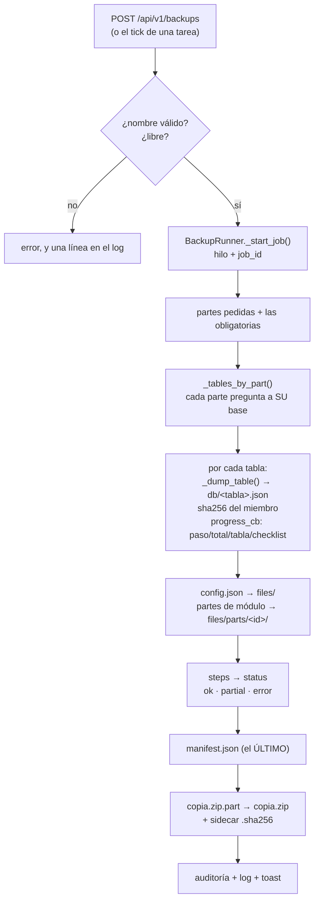
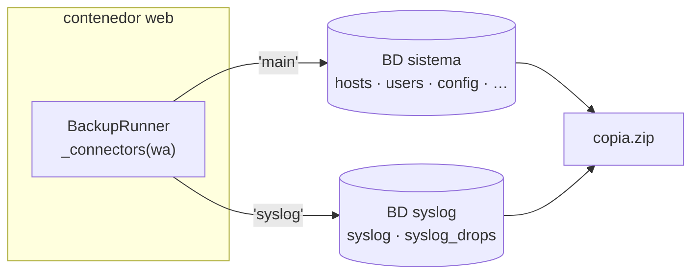
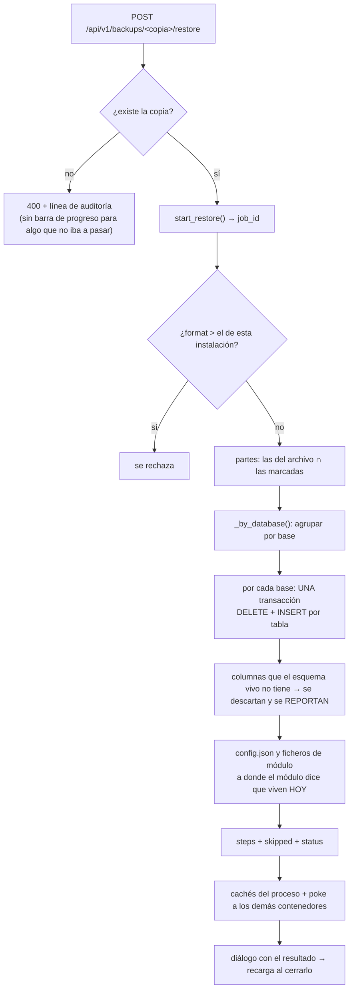
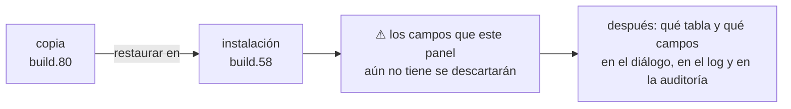
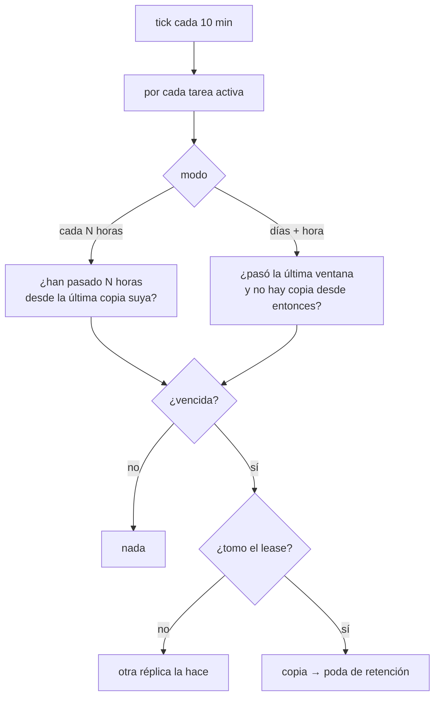
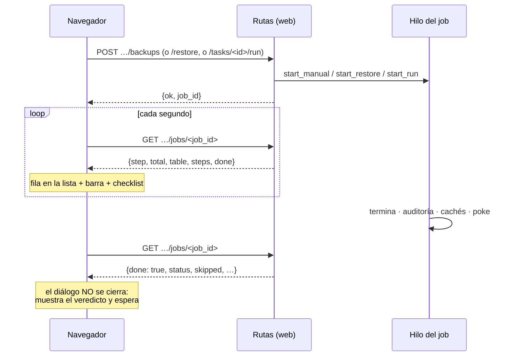
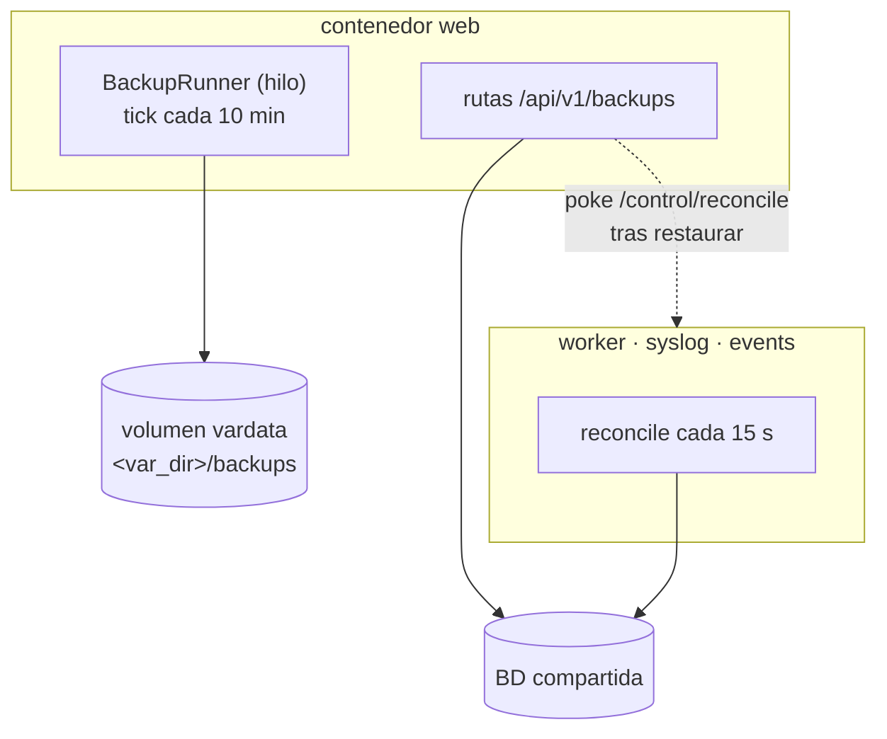

# Copias de seguridad y restauración

> Qué es una copia en ServiceSentry, qué lleva dentro, cómo se hace, cómo se devuelve y qué
> decisiones de diseño hay detrás. Fuente única del tema: el resto de documentos enlazan aquí.
>
> Código: [`src/lib/core/backup/`](../src/lib/core/backup/) —
> `service.py` (sin Flask: conectores y rutas de disco), `runner.py` (el hilo y los jobs),
> `schedule.py` (funciones puras de *cuándo*), `tasks_store.py`, `routes.py`, `manifest.py`.
> Interfaz: [`templates/partials/backup/`](../src/lib/web_admin/templates/partials/backup/).

---

## Resumen en una tabla

| | |
|---|---|
| **Formato** | ZIP de ficheros JSON (uno por tabla) + ficheros sueltos + `manifest.json` |
| **Portabilidad** | Filas fuera y filas dentro **por el conector**: una copia de SQLite se restaura sobre MySQL |
| **Qué lleva** | Se elige por **partes** (`core`, `config_file`, `history`, `audit`, `syslog`, + las que aporten los módulos) |
| **Secretos** | Decisión **por copia**; el manifiesto registra cuál fue |
| **Integridad** | `sha256` por miembro dentro del manifiesto + `<copia>.zip.sha256` al lado |
| **Veredicto** | `ok` / `partial` / `error`, escrito **dentro** del archivo, con una entrada por parte |
| **Programación** | Lista de **tareas**, cada una con sus partes, su frecuencia y su retención |
| **Quién la ejecuta** | El rol **web** (en microservicios, el contenedor `web`) |
| **Permisos** | 7 flags distintos — ver [§ Permisos](#permisos) |

---

## Por qué un ZIP de JSON y no un volcado de la base

El panel corre sobre **SQLite, MySQL, PostgreSQL o SQL Server**, y la copia tiene que
sobrevivir al salto: una instalación que creció en SQLite y se está levantando sobre MySQL es
*exactamente* cuándo se pide una copia, y un `.db` responde a eso con nada.

Así que no se copia el fichero de base de datos: se leen **filas por el conector** y se
escriben **filas por el conector**. El precio es que una copia es más lenta y más grande que un
`mysqldump`; lo que se compra es que sirva en el único momento en que hace falta.

---

## Las partes de una copia

Qué puede llevar una copia está declarado en `PARTS` ([`service.py`](../src/lib/core/backup/service.py)),
y ese catálogo lo leen **la API, el formulario y la restauración**. Una parte añadida ahí
aparece en los tres sin tocar nada más.

| Parte | Tipo | Base | Por defecto | Qué es |
|---|---|---|---|---|
| `core` | tablas | sistema | ✅ · **obligatoria** | **Toda tabla que ninguna otra parte reclamó** |
| `config_file` | fichero | — | ✅ | `config.json` (arranque, solo lectura) |
| `history` | tablas | sistema | ❌ | `history`, `check_state` |
| `audit` | tablas | sistema | ❌ | `audit` |
| `syslog` | tablas | **syslog** | ❌ | `syslog`, `syslog_drops` |
| *(las que declare un módulo)* | ficheros | — | según declare | p. ej. los MIB del módulo SNMP |

### La regla de `core` está invertida a propósito

`core` no es una lista de tablas: es **todo lo que nadie más reclamó**. Una tabla añadida
mañana —incluidas las que los módulos crean en ejecución vía
[`lib/db/module_tables.py`](../src/lib/db/module_tables.py)— entra en la copia **por defecto**
en vez de quedarse fuera en silencio.

> Una copia que se salta lo que no reconoció es de esos fallos que se descubren una sola vez.

### Un módulo aporta la suya

El núcleo **no lleva ninguna cadena que nombre un módulo**. Un módulo con ficheros propios lo
declara en su `schema.json`:

```json
"__backup_part__": {"id": "mibs", "dir": "snmp_mibs/raw",
                    "label_key": "backup_part_mibs", "default": false}
```

Detalle del descriptor y sus reglas (el `dir` no puede salirse de `var_dir`, no puede robar un
id del núcleo, la etiqueta sale del `lang/` del módulo) en
[explica-descubrimiento.md §6b](explica-descubrimiento.md#6b-partes-de-backup-aportadas-por-un-módulo-__backup_part__).

Las **tablas** de un módulo no se declaran: ya están en `core` por la regla invertida.

---

## Anatomía del archivo

```text
copia-20260811-210233.zip
├── db/
│   ├── hosts.json            {"columns": [...], "rows": [[...], ...]}
│   ├── users.json
│   ├── config.json           ← la tabla `config`, no el fichero
│   └── …                     una por tabla
├── files/
│   ├── config.json           ← el FICHERO de arranque (parte `config_file`)
│   └── parts/
│       └── mibs/…            ← los ficheros de un módulo (parte `mibs`)
└── manifest.json             ← escrito el ÚLTIMO, a propósito

copia-20260811-210233.zip.sha256    ← al lado, formato `sha256sum -c`
```

**El manifiesto se escribe el último** para que *un manifiesto presente sea un manifiesto
cierto*: un archivo interrumpido a medias no lo tiene, y `read_manifest` lo rechaza en vez de
anunciar una copia que lleva menos de lo que dice.

### Qué guarda el manifiesto

| Campo | Para qué |
|---|---|
| `format` | Versión del **formato del archivo** (hoy `1`). Uno mayor que el que conoce esta instalación se rechaza |
| `name`, `created_by` | Quién la hizo. En una automática, `(schedule: <tarea>)` |
| `app_version`, `engine` | Build y motor de BD que la escribieron |
| `parts`, `secrets` | Qué se pidió y si lleva credenciales |
| `tables` | `{tabla: nº de filas}` |
| `files` | `{parte: nº de ficheros}` |
| `steps` | **Una entrada por parte**: `ok`, filas, tablas y el primer motivo del fallo |
| `status` | El veredicto: `ok` / `partial` / `error` |
| `sha256` | Digest **por miembro** del ZIP |

Todo lo que enseña la ficha **Detalles** sale de aquí. Nada lo calcula la pantalla: la copia es
lo que alguien restaura meses después, y un veredicto deducido al pintar es un veredicto que no
viajó con el fichero.

---

## Flujo de una copia



Puntos que no se ven en el diagrama y explican por qué está así:

- **Una tabla ilegible marca su parte y deja seguir al resto.** Una copia con nueve de diez
  tablas vale algo; una que abortó en la décima no vale nada. El manifiesto dice cuál.
- **El progreso es por tabla**, no por bytes: las filas no tienen tope (una tabla de syslog son
  seis cifras) y el tamaño del ZIP no se sabe hasta cerrarlo. *«syslog 4/11»* es una frase.
- **El resultado es por parte**, que es la unidad que alguien marcó en el formulario.
- Se escribe a `.part` y se renombra al final: un fichero a medias nunca aparece en la lista.

### La segunda base de datos

Con `syslog_db|enabled`, las tablas de syslog **no están en la base del sistema**. Cada parte
declara en qué base vive y el llamador pasa un mapa de conectores:



`core` sigue siendo *toda tabla que nadie reclamó* **en la base del sistema**, así que nada de
la segunda base se cuela ahí por accidente. Una segunda base inalcanzable cuesta su parte y
nada más.

> Esto fue un bug real: leer las tablas de syslog del conector principal daba una copia vacía
> **en verde**. Ficha completa en [caso-diagnostico.md](caso-diagnostico.md).

---

## Secretos

Es una decisión **por copia**, y el manifiesto registra cuál fue — una copia sin credenciales
que parece completa se descubre al restaurar.

Al excluirlos se **vacía todo valor cifrado a cualquier profundidad**. El marcador es el
prefijo `enc:` con que el panel escribe lo que cifra, y no una lista de nombres de campo: los
módulos declaran sus propios campos secretos en sus esquemas, así que una pasada por nombres
conocidos enviaría el token de un módulo diciendo que no lleva ninguno. Además el secreto suele
vivir **dentro** de una columna JSON, no ser la columna.

> Los valores incluidos siguen siendo **cifrado**: solo la misma `SS_SECRET_KEY` los lee. Una
> copia restaurada en otra instalación sin esa clave deja las credenciales ilegibles aunque
> todo lo demás cuadre.

---

## Integridad: sha256

Dos niveles, porque responden preguntas distintas:

| Dónde | Qué cubre | Para qué |
|---|---|---|
| `manifest.sha256` | cada **miembro** del ZIP | *Verificar* dice **qué** miembro cambió, no solo que algo cambió |
| `<copia>.zip.sha256` | el **archivo entero** | El digest de un fichero no puede vivir dentro de él. Formato `sha256sum -c`: se valida en otra máquina sin este panel |

**Verificar** compara el fichero contra su propio manifiesto y distingue los dos fallos: *«el
fichero no coincide con su sha256»* (llegó dañado o incompleto) y *«N miembros no coinciden»*
(el contenido se alteró). Son causas distintas.

---

## Flujo de una restauración



### Reemplaza, no fusiona

Una tabla se **vacía y se rellena**. Fusionar daría un tercer estado que no existió nunca en
ningún sitio, y una copia es una afirmación sobre cómo era la instalación.

### Una transacción por base

Las tablas del sistema **entran juntas o no entra ninguna**: usuarios restaurados con roles sin
restaurar es una instalación en la que nadie puede entrar. Dos bases no pueden compartir una
transacción, así que cada una lleva la suya — datos masivos de log entrando en su propio paso
no dejan a nadie fuera.

### Restaurar solo una parte

`parts` acota lo que se aplica. `required` dice qué debe **contener** una copia, no qué debe
aplicarse: leerlo como lo segundo convertiría toda restauración parcial en total, que es lo
contrario de lo que se pide al restaurar solo los hosts tras una importación mala.

---

## Restaurar entre versiones

Lo **único** que se rechaza es un `format` de archivo más nuevo que el que esta instalación
conoce. La versión de la aplicación **no bloquea nada**: el esquema avanza en casi cada build, y
un panel que rechazara copias «viejas» sería inútil justo el día que hace falta.

Lo que hace en cambio es **no callarse**:

| Situación | Qué pasa | Qué se dice |
|---|---|---|
| Columna **añadida** desde la copia | Las filas entran sin ella (NULL/default) | nada: no se perdió nada |
| Columna **eliminada** desde la copia | Su valor se descarta | «campos descartados: X» + warning en el log + auditoría |
| **Tabla** que ya no existe | Se salta entera | «la tabla ya no existe: N filas no entraron» |
| Copia de un build **posterior** | Se descartan los campos que este esquema aún no tiene | Aviso ámbar **antes** de pulsar |
| Copia de un build **anterior** | Normal | Línea informativa con los dos builds |



**No hay migraciones al restaurar.** Reescribir filas según lo que un build supone del anterior
es la clase de código que rompe la copia mientras la aplica; la garantía que se ofrece es la
transacción única, no una traducción.

> Riesgo que ningún chequeo detecta: si un build cambió el **significado** de un valor (la forma
> de un JSON dentro de una columna), la copia vieja entra con la forma vieja.

---

## Programación

Una **lista de tareas**, no un intervalo global. El caso que lo motivó: la configuración y el
inventario merecen copia diaria; el syslog y los MIB quizá semanal — y con una sola
programación eso no se puede decir sin copiarlo todo al ritmo de la parte más exigente, que es
como se llena un disco.

Cada tarea (tabla `backup_tasks`) lleva: **nombre**, sus **partes**, si incluye **secretos**,
**cuándo** y **cuántas conservar**.

### Cuándo: intervalo o calendario



La pregunta del modo calendario es **«¿pasó la ventana sin copia desde entonces?»**, no «¿son
las 03:00 ahora?». Preguntado de la forma ingenua sería falso 1439 minutos de cada 1440 y se
perdería la ventana siempre que el proceso no estuviera arriba justo en ella. Así, un panel que
vuelve a las 09:00 **toma igualmente la copia de las 03:00**, y un tick cada diez minutos la
caza igual de bien que uno cada minuto.

- **Ningún día marcado significa TODOS los días**, nunca «ningún día»: una tarea creada que no
  se ejecuta jamás es el fallo contra el que existe toda esta función.
- Una tarea **sin modo** es de intervalo — es lo que era toda tarea antes de que existiera el
  calendario.

### Retención

Es **por tarea**, y esa fue la razón del rediseño: con un contador compartido, la tarea diaria
podaba las copias de la mensual — borrando exactamente las que tardaron un mes en merecer la
pena. El nombre de la copia lleva la tarea que la hizo (`auto-<tarea>-<fecha>`).

- Se poda **después** de que la copia nueva esté en disco: al revés, un disco lleno borraría la
  vieja y fallaría al escribir la nueva.
- Se podan **las más antiguas primero**.
- Una copia hecha **a mano nunca se poda**: un contador no decide sobre algo que alguien hizo a
  propósito.
- `keep = 0` significa **conservarlas todas**. Leer el 0 como «bórralas todas» es la lectura que
  pierde datos.

---

## Jobs: por qué nada se espera

Copiar y restaurar tardan minutos en una instalación grande, y una petición abierta ese rato es
una que el navegador o un proxy inverso acaba abandonando — dejando al operador sin saber si
funcionó. Las cuatro operaciones largas arrancan un **job** y devuelven un `job_id`.



- Los jobs viven **en la memoria de ese proceso**. Un `404` tras un reinicio es la verdad, no un
  error: el navegador deja de preguntar en vez de esperar una respuesta que no llegará.
- El diálogo **no se cierra solo** al terminar. Ese es justo el instante en que su resultado
  merece leerse, y una copia parcial es el desenlace que no puede descartar la pantalla por ti.
- Tras una **restauración** la página se recarga **al cerrar** el diálogo: todo lo que había en
  pantalla se leyó antes de que las tablas cambiaran debajo.

---

## Permisos

Siete flags, no uno. El archivo es la instalación entera en un fichero, así que las acciones no
son intercambiables.

| Flag | Cubre | Por qué es propio |
|---|---|---|
| `backup_view` | Ver la lista y las tareas | Ver que existen copias ya dice qué hay y desde cuándo |
| `backup_verify` | Verificar una copia | No escribe nada, pero recorre y hashea un archivo de gigabytes |
| `backup_create` | Crear una copia · **ejecutar una tarea ahora** | Ejecutar una tarea **es** hacer una copia |
| `backup_download` | Descargar el fichero | Quien puede bajarlo tiene la instalación |
| `backup_restore` | Aplicar una copia | Sobrescribe usuarios y roles: puede entregar el panel |
| `backup_delete` | Borrar una copia del disco | Destruye datos |
| `backup_schedule` | Crear, editar y borrar **tareas** | No destruye ningún archivo, pero decide cada cuánto se protege la instalación |

Ninguno se concede a los roles integrados: una copia es una herramienta de administración.
Los botones siguen los mismos flags — uno que devuelve 403 dice que el panel está roto, no que
falta el permiso. Catálogo completo del RBAC en [ref-permisos.md](ref-permisos.md).

---

## Auditoría y log

**Todo** queda auditado, la descarga incluida: *«quién se llevó una copia de esta máquina, y
cuándo»* es una pregunta que el registro tiene que poder responder.

| Evento | Severidad | Detalle que lleva |
|---|---|---|
| `backup_created` | success | partes, secretos, tablas, tamaño, **veredicto** |
| `backup_downloaded` | warning | nombre — escrito **antes** de que el fichero salga |
| `backup_restored` | danger | partes, tablas, **build de origen** y **qué no se pudo aplicar** |
| `backup_deleted` | danger | nombre(s); en la poda, la tarea |
| `backup_verified` | warning | resultado |
| `backup_task_saved` / `_deleted` | warning / danger | la tarea |
| `backup_task_migrated` | muted | la conversión única de los ajustes anteriores |
| `backup_dir_created` | muted | la carpeta creada desde el explorador |

En el **log** del panel (`global|log_level`, ver [explica-logging.md](explica-logging.md)):

```
[INFO   ] > Backup > job a3f9c1 >> restore 'copia-20260811-2102' started
[INFO   ] > Backup > restore >> 'copia-20260811-2102' parts=['config_file', 'core'] made with 0.0.1+build.40
[DEBUG  ] > Backup > restore >> hosts: 12 rows
[WARNING] > Backup > restore >> credentials: table is gone, 4 rows not applied
[WARNING] > Backup > restore >> 'copia-20260811-2102' done, 148 rows in 9 tables, 1 could not be applied in full
```

---

## En microservicios



- **Las copias programadas las toma el rol `web`**, y solo ése: el hilo lo arranca el
  `WebAdmin`. El worker, el receptor de syslog y el de eventos no lo crean nunca. Con el rol web
  parado **no se toma ninguna copia programada**.
- Con **varias réplicas de web**, el *lease* (`backup`, TTL 900 s) decide cuál la hace: si no,
  cada una escribiría su archivo y leería todas las tablas.
- La carpeta de copias tiene que estar montada **en el contenedor web**. En el compose que se
  distribuye, los cuatro roles comparten `vardata`, así que caen en un sitio persistente.
- Tras restaurar, los demás contenedores reciben un **poke** (`/control/reconcile`) para
  releer ya, en vez de esperar a su poll de 15 s.

### Qué converge solo y qué no

| Cambia | ¿Se aplica sin reiniciar? |
|---|---|
| Filas (hosts, usuarios, roles, checks, credenciales) | **Sí, al instante** — se leen de la BD compartida |
| Config editable (tabla `config`) | **Sí** — poke inmediato, y en su defecto el poll de 15 s |
| Puertos de syslog, allowlist, certificados | **Sí** — el listener se recarga solo… |
| …pero el **puerto publicado de Docker** | **No.** Se fijó al crear el contenedor: hay que tocar el compose |
| Sección `database` de la copia | **No en caliente**; al siguiente reinicio podría apuntar a otro sitio si no lo fija `SS_DB_*` |
| Puertos fijados por CLI (`--port`) en un contenedor | **No, y es lo correcto**: lo que fija el despliegue no lo cambia una copia |
| `SS_SECRET_KEY` | No viaja en la copia. Sin la misma clave, los valores `enc:` no se descifran |

---

## Dónde caen las copias

`web_admin|backup_dir`, y vacío significa `<var_dir>/backups`. Es configurable porque una copia
en el mismo disco que los datos que copia sobrevive a un error humano y a nada más.

La ruta se resuelve **en cada operación**, no al arrancar: quien la cambia a mitad de día no
tiene que reiniciar, y una ruta capturada al registrar las rutas escribiría la copia siguiente
en el sitio viejo y la buscaría en el nuevo.

El campo lleva un **explorador de carpetas** (con crear carpeta y comprobación de escritura) que
cuelga de un registro genérico por ruta de config: el renderizador de campos pinta doscientos
campos y no tiene por qué saber que uno de ellos es una carpeta.

---

## Trampas conocidas

1. **`SS_SECRET_KEY`.** Restaurar en otra instalación sin la misma clave deja toda credencial
   ilegible. No lo detecta nada.
2. **Rol web parado = sin copias programadas.** Nada lo anuncia. La regla de intervalo salva el
   reinicio, no el apagado prolongado.
3. **Puertos de Docker.** La aplicación rebinda; la red del contenedor no.
4. **Cambios de significado entre builds.** Ningún chequeo de versión los ve.
5. **`backup_dir` fuera del volumen compartido** en microservicios: las copias caerían en el
   sistema de ficheros efímero del contenedor web.

---

## Ver también

- [ref-api.md](ref-api.md) — los endpoints con su permiso y su formato
- [ref-permisos.md](ref-permisos.md) — el catálogo RBAC completo
- [explica-descubrimiento.md](explica-descubrimiento.md#6b-partes-de-backup-aportadas-por-un-módulo-__backup_part__) — cómo un módulo aporta su parte
- [explica-servicios.md](explica-servicios.md) — lease de líder, control-plane y modo microservicios
- [caso-docker.md](caso-docker.md) — topologías, volúmenes y variables
- [caso-diagnostico.md](caso-diagnostico.md) — el bug de la segunda base de syslog
- [ref-tests.md](ref-tests.md) — qué cubre cada test de esta sección
