# Sistemas de descubrimiento (self-describing)

ServiceSentry evita los registros centrales hardcodeados: **cada pieza declara lo que
posee en un sitio convenido, y una función `discover_*()` lo recopila en arranque**.
Añadir una capacidad = soltar/editar un descriptor junto a su módulo; quitarla = borrarlo.
Nada del núcleo ni del frontend hay que tocar.

Este documento define **todos** los mecanismos de descubrimiento: qué declara cada uno,
quién lo escanea, el flujo de datos y qué datos fluyen y a dónde.

---

## El patrón común

Todos siguen la misma forma: **escanear una raíz de paquetes → importar un submódulo/clave
convenida de cada uno → recopilar su descriptor → ordenar → ensamblar/servir**. Un fallo de
import en un módulo nunca rompe el resto (se ignora ese módulo).

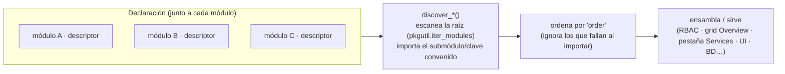

Difieren solo en **qué raíz escanean** y **qué declaran**:

| Mecanismo | Declara (símbolo) | Raíz escaneada | Recolector | Consume / ensambla |
|---|---|---|---|---|
| [Permisos](#1-permisos-module_permissions) | `permissions.py` · `MODULE_PERMISSIONS` | `lib.core.*` + `lib.services.*` | `discover_permissions()` | `PERMISSIONS` / `PERMISSION_GROUPS` / `BUILTIN_ROLE_PERMISSIONS` |
| [Widgets de Overview](#2-widgets-de-overview-overview_widgets) | `overview_widget.py` · `OVERVIEW_WIDGETS` | `lib.core.*` + `lib.services.*` | `discover_overview_widgets()` (+ `_stats` / `_rows` / `_public`) | grid de Overview + AJAX por widget |
| [Servicios embebidos](#3-servicios-embebidos-embedded_service) | `__init__.py` · `EMBEDDED_SERVICE` (`embedded.py` · `make_embedded`) | `lib.services.*` | `discover_embedded_services()` | pestaña Services (estado + control) |
| [Tipos de credencial](#4-tipos-de-credencial-__credential__) | `schema.json` · `__credential__` | `watchfuls/*` | `ModuleBase.discover_schemas()` | gestor de credenciales (formularios por tipo) |
| [Perfiles de host](#5-perfiles-de-host-__host_profile__) | `schema.json` · `__host_profile__` | `watchfuls/*` | `lib.core.hosts.profiles` | sección Servers (formularios por protocolo) |
| [Tablas de módulo](#6-tablas-de-módulo-discover_db_tables) | `__init__.py` · `discover_db_tables()` | `watchfuls/*` | `reconcile_module_tables()` | BD general (crea/migra `mod_<m>_<n>`) |
| [Provisión Entra](#7-provisión-entra-__entraid_provision__) | `schema.json`/OIDC · `__entraid_provision__` | `watchfuls/*` + config OIDC | `normalize_entraid_provision()` | asistente device-code → registro de app en Graph |
| [Registro de config](#8-registro-de-config-spec-y-layout) | `spec.py` (`Cfg`) + `layout.py` (`TABS`/`CARDS`) | — (registro central, no escaneo) | `config_layout()` / `cfg_meta()` | pantalla de config renderizada desde datos |

> Los tres primeros escanean **dominios de núcleo y servicios** (`lib.core.*` / `lib.services.*`);
> los cuatro siguientes escanean **módulos watchful** (`watchfuls/*`); el último es el registro
> central data-driven de la configuración.

---

## 0. La convención común: `manifest.py` + un único escáner

Todos los mecanismos de este documento comparten la **misma forma**: un paquete *declara* lo
que aporta y el core genérico lo recoge. Para que esa forma sea una y no N:

- Cada paquete declara **todo** lo que aporta en su **`manifest.py`**
  (`lib/core/<d>/manifest.py`, `lib/services/<s>/manifest.py`, `lib/providers/<p>/manifest.py`).
- Un **único** escáner, `lib/discovery.py`, lo recoge: `scan(CONST)` devuelve el valor de esa
  constante en cada paquete que la declare (`scan_values` / `scan_flat` para las variantes).

```python
# lib/core/credentials/manifest.py
from .overview_widget import credentials_stat      # el proveedor pesado se queda en su módulo

MODULE_PERMISSIONS = {...}
OVERVIEW_WIDGETS = [{'id': 'credentials', ..., 'stat': credentials_stat}]
```

El manifiesto contiene los **descriptores**; las implementaciones pesadas (p. ej. el proveedor
de datos de un widget, de 150-200 líneas) siguen en su propio módulo y se **importan** en el
manifiesto, para que este sea una lista legible de "qué ofrece este paquete" y no un cajón.

**Por qué Python y no JSON:** un descriptor puede ligar objetos vivos (una función `stat`, una
factoría). Los **watchfuls** son el caso opuesto —plugins drop-in que no traen código del
core— y por eso declaran en `schema.json` (datos puros), recogidos por el pipeline de schemas.

| Constante | Qué aporta | Mecanismo |
|---|---|---|
| `MODULE_PERMISSIONS` | permisos del dominio | §1 |
| `OVERVIEW_WIDGETS` | widgets del Overview | §2 |
| `EMBEDDED_SERVICE` / `STANDALONE` | servicio de fondo | §3 |
| `CONFIG_ACTIONS` | botones en una sección de config | §7b |
| `GROUP_SOURCES` | origen de grupos de directorio de una sección | §7c |
| `NOTIFY_EVENTS` | eventos notificables | §10 |

> **Regla:** para añadir un mecanismo nuevo **no** copies un escáner ni inventes un nombre de
> fichero: declara la constante en el `manifest.py` del paquete y léela con
> `lib.discovery.scan*`.

---

## 1. Permisos (`MODULE_PERMISSIONS`)

Cada dominio de núcleo y cada servicio declara los permisos que posee; el editor de roles y
el modelo RBAC se ensamblan a partir de ellos. Solo el grupo `services` queda hardcodeado
(es el anfitrión del mecanismo).

**Descriptor** (`lib/core/<d>/permissions.py` o `lib/services/<s>/permissions.py`) — data pura,
etiquetas i18n por clave:

```python
MODULE_PERMISSIONS = {
    'group': 'perm_group_audit',   # clave i18n del encabezado del grupo en el editor de roles
    'order': 140,                  # posición del grupo (servicios 10–40; dominios de núcleo después)
    'permissions': (
        {'flag': 'audit_view',   'roles': ('editor', 'viewer')},  # a qué roles builtin concede
        {'flag': 'audit_delete', 'roles': ()},                    # () = solo admin
    ),
}
```

**Flujo y datos:**

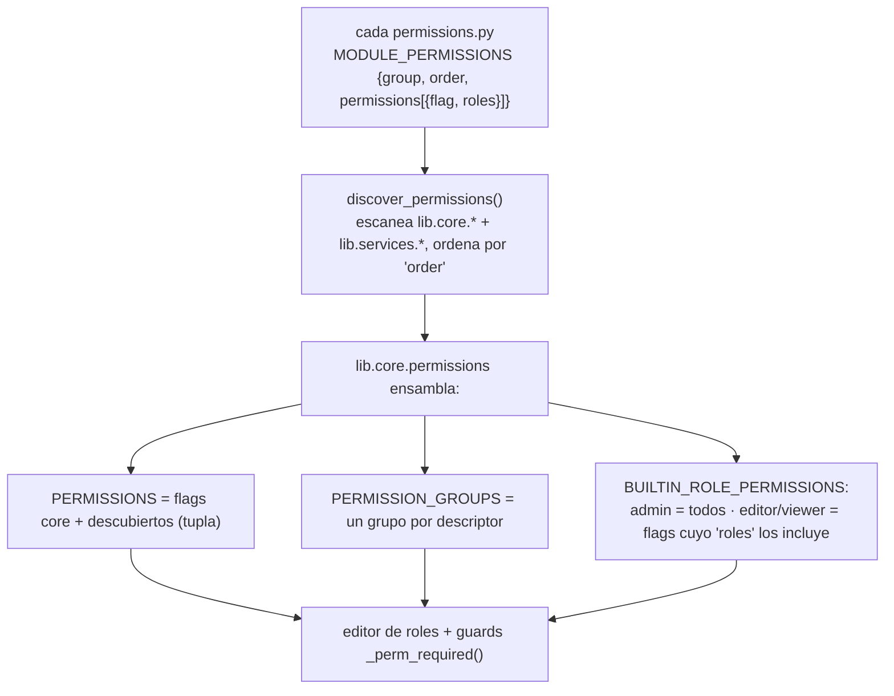

- **Qué datos:** flags (`str`), a qué roles builtin concede cada flag, y el grupo i18n donde
  se agrupan en el editor.
- **Dónde acaban:** en `lib.core.permissions` (`PERMISSIONS`, `PERMISSION_GROUPS`,
  `BUILTIN_ROLE_PERMISSIONS`), que consumen los mixins de permisos y todos los `@app.route`
  con `_perm_required(<flag>)`.
- **Claves per-instancia** (`module.<n>.*`, `server.<uid>.*`, `cluster.<uid>.*`) NO están en
  `PERMISSIONS`: se validan por patrón con `is_module_perm` / `is_server_perm` / `is_cluster_perm`.


---

## 2. Widgets de Overview (`OVERVIEW_WIDGETS`)

Cada dominio/servicio contribuye tarjetas al dashboard de inicio declarándolas; el frontend
no tiene un `_DW_DEFS` hardcodeado. Cada widget **se describe entero en un descriptor**
(metadatos + proveedor de datos) y **pide sus propios datos por AJAX**.

**Descriptor** (`lib/core/<d>/overview_widget.py`):

```python
def credentials_stat(wa) -> dict:                 # proveedor de datos (server-side)
    ...
    return {'value': total, 'badges': badges}     # forma estándar de una stat card

OVERVIEW_WIDGETS = [
    {'id': 'credentials', 'icon': 'bi-key', 'label_key': 'overview_credentials',
     'cols': 2, 'h': 'auto', 'has_h': False, 'order': 90,   # layout por defecto (span/alto)
     'perms': {'any': ['credentials_view', 'servers_view', 'modules_view']},  # expresión declarativa
     'nav':   {'tab': '#tab-access', 'sub': '#subtab-credentials'},           # click-through
     'stat':  credentials_stat,                                              # ← callable de datos
     'view':  {'kind': 'stat', 'icon': 'bi-key-fill', 'accent': 'teal',
               'data_url': '/api/v1/overview/widget/credentials'}},
]
```

- `view.kind`: `'stat'` (tarjeta con `stat(wa)` → `{value, accent?, icon?, badges}`) o
  `'table'` (lista con `rows(wa, f)` → filas ya filtradas por `f`, + `columns`).
- `perms`: expresión declarativa evaluada en el frontend — `any` = mostrar si el usuario tiene
  ALGUNO de esos flags; `prefix` = OR de cualquier flag que empiece por esos prefijos (per-servidor).
- `view.filter` (solo tablas): filtrado server-side declarativo. `store` = clave del `dataset`
  del widget donde el toolbar guarda el valor; `param` = nombre del query-param con que el
  frontend lo envía **y bajo el que el endpoint lo lee** (default `'f'`; p.ej. syslog usa
  `'severity_max'`). El indicador del filtro activo en la cabecera se declara así:
  - `options: [{v, label_key, badge:{color,bg}}]` → un badge para la opción activa;
  - una opción con `badges: [{label_key,color,bg}, …]` → **varios** badges (filtro compuesto;
    p.ej. Servers `errmaint` → Error + Mantenimiento);
  - `badge_fn: 'sev'` → resuelve nombre/color de la severidad desde el catálogo del frontend
    (syslog) y lo pinta como "≥ nivel" (mínimo de severidad).

**Flujo y datos:**

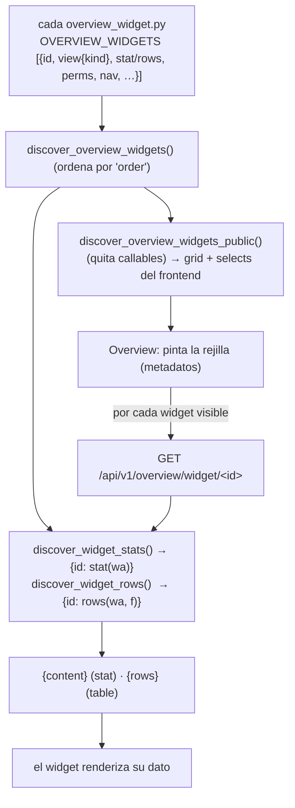

- **Qué datos:** metadatos (id/icono/label/layout/perms/nav/view) serializados al front; y, por
  AJAX bajo demanda, el contenido real (`{value, badges}` para stats; `{rows}` para tablas).
- **Dónde acaban:** la rejilla de Overview; cada widget carga su dato independiente por el endpoint
  genérico `/api/v1/overview/widget/<id>` (sin agregado monolítico).

---

## 2b. Widgets contribuidos por un módulo watchful (`__overview_widget__`)

Aparte de los widgets del core (§2), **un watchful puede aportar sus propios widgets** al Overview
desde su `schema.json`. El core no sabe nada del módulo: solo lee claves genéricas y llama a un hook.
El catálogo (`lib/modules/discovery/overview_widgets.py`) es **código 100 % genérico** — nada
específico de un módulo vive ahí (ni URLs, ni scopes, ni iconos): todo lo aporta el módulo.

**Declaración** (`schema.json`, un dict o una **lista** para aportar varios widgets):

```json
"__overview_widget__": [
    {"id": "health", "view": "stat",  "icon": "bi-...", "scope": "health",
     "link": "https://ejemplo/estado"},
    {"id": "table",  "view": "table", "icon": "bi-...", "selector": true, "cols": 4, "h": 340}
]
```

Claves por widget (todas opcionales salvo lo indicado):

- `view` — **`stat`** (tarjeta tipo Servers: número grande + un badge de color por estado
  N OK / N Warning / N Error; por defecto) o **`table`** (listado denso).
- `id` — distingue los widgets del módulo: `''` = el primario (clave `mw_<módulo>`); los demás son
  `mw_<módulo>_<id>`. Cada uno es un tipo de widget añadible independiente en la barra "Añadir widget".
- `icon`, `cols`, `h`, `perm` — icono BI, span/alto por defecto y permiso (default `modules_view`).
- `scope` (stat) — **qué entrada muestra la tarjeta**, por su `id` en los `entries` del hook
  (`''` = agregado de todas). El título de la tarjeta es el `pretty_name` traducido del módulo.
- `selector` (table) — muestra el selector de scope (Todos / Agregado / cada entrada) en el toolbar
  (modo edición, como el resto de filtros de widget); se persiste en el layout (`mws`). La tabla
  ordena **peor primero** (error → warning → ok) y ofrece un **filtro de nivel** (Todos / ≥ warning /
  solo error, dataset `mwlvl`). En scope Agregado la tabla se colapsa a una stat card (altura auto,
  no redimensionable, sin filtro de nivel).
- `link` — hace el widget **clicable**: abre esa URL externa en pestaña nueva (soporte genérico en
  `_dwIsNavigable` / `_dwNavigate`).

**Datos** — el hook del módulo `Watchful.overview_widget(items, status, lang) -> dict`:

```python
{
  'entries': [                       # una entrada por "tipo de check" (kind)
    {'id': 'health', 'name': 'Service health', 'ok': False, 'state': 'warn',
     'counts': {'ok': 23, 'warn': 4, 'error': 0, 'total': 27},   # alimenta los badges del stat card
     'rows': [{'name': 'Exchange Online', 'state': 'warn', 'detail': ''}, …],  # filas de la tabla
     'stats': [{'label': 'OK', 'value': '23/27', 'state': 'warn'}]},
  ],
  'aggregate': {'count': 8, 'count_label': 'Checks',
                'counts': {'ok': 30, 'warn': 4, 'error': 0, 'total': 34}},
}
```

El catálogo devuelve `{módulo: {module, label_i18n, widgets:[descriptor, …]}}`; el frontend expande
cada descriptor en una definición `_DW_MODULE` (clave `mw_<módulo>[_<id>]`). Los mismos datos del hook
alimentan **todos** los widgets del módulo (la vista los presenta distinto).

**Flujo (declaración → catálogo → datos → render):**

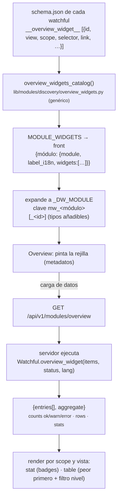

> Los widgets de **módulo** obtienen su dato del snapshot `GET /api/v1/modules/overview` (que
> ejecuta el hook), a diferencia de los widgets del **core** (§2), que piden
> `GET /api/v1/overview/widget/<id>` por widget. La **detección de estado** (ok/warn/error de cada
> entrada) la hace el propio módulo dentro de `overview_widget()` a partir de sus `items`/`status`
> — el core solo pinta los `counts`/`state` que el módulo reporta.

### Comportamiento de hover del dashboard (genérico para futuros widgets)

Reglas en `web_admin.css` + `_dwOnGridHover` (`partials/overview/_layout.html`) — **no hay que
reinventarlo por widget**:

- Los stat cards del **core** hacen "pop" (`scale(1.04)` + glow) y los vecinos se encogen/atenúan.
- Los **widgets de módulo** llevan la clase `dw-module` (la añade `_render.html`). Como suelen ser
  **anchos**, un scale proporcional los desbordaría o solaparía; en su lugar `_dwOnGridHover` fija
  `--dw-pop = 1 + 8px/ancho` (tope 1.04) → **crecimiento fijo ~8px** como los estrechos, y apunta el
  `transform-origin` al lado con hueco para no salirse de la ventana. Los vecinos también se apartan,
  así el pop tiene sitio en vez de solaparse. Solo la vista stat card hace pop (las tablas no).
- La barra de acento superior de los stat cards redondea sus esquinas (`border-radius: …-lg …-lg 0 0`)
  porque Chromium deja de recortar `overflow:hidden`+`border-radius` cuando un ancestro tiene
  `transform` (el pop) → sin ese redondeo, la esquina del acento se ve cuadrada. `.dw` lleva el mismo
  radio para que outline y glow huguen las esquinas.

> **Cache-busting del CSS**: `web_admin.css` se enlaza con `?v={{ asset_v }}` (mtime del archivo,
> inyectado por el context processor). El `dev_watch` **no** reinicia con cambios `.css`; sin este
> parámetro, los cambios de estilo no llegaban al navegador hasta un refresco forzado.

---

## 3. Servicios embebidos (`EMBEDDED_SERVICE`)

Cada servicio de fondo (monitoring, syslog, events, ipban…) se autodescribe para la pestaña
Services; el panel los **descubre y compone** (no los hereda). Un servicio nuevo aparece solo
con soltar su paquete en `lib/services/`.

**Descriptor** (`lib/services/<s>/__init__.py`): `EMBEDDED_SERVICE = {key, label, icon, order,
controllable}` (el mismo `__init__` expone `STANDALONE` para el modo dedicado que despacha
`main.py`); la fábrica `make_embedded(host)` vive en `embedded.py`.

**Flujo y datos:**

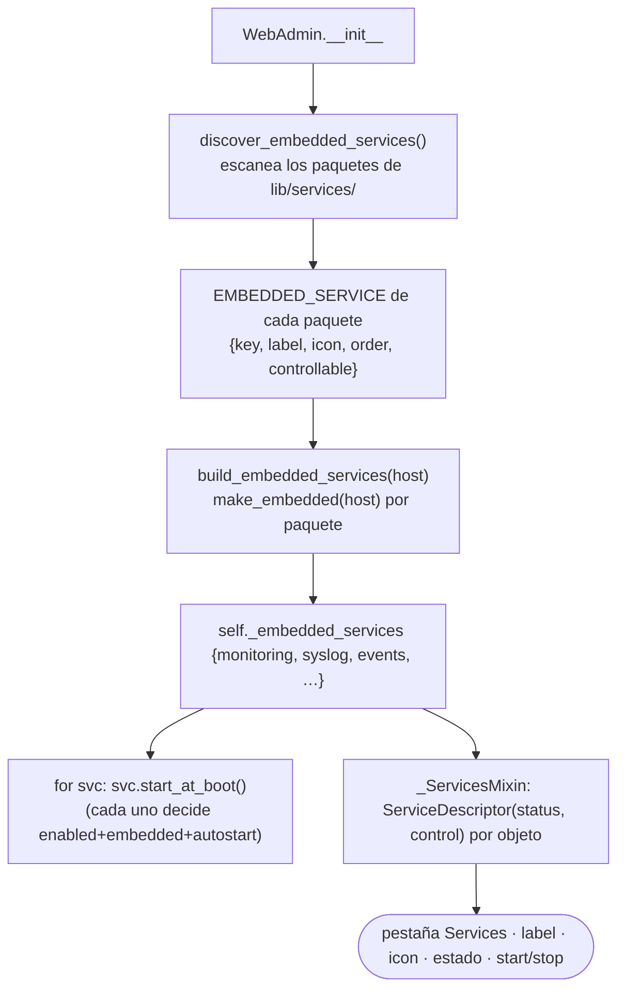

- **Qué datos:** identidad y capacidades del servicio (clave, etiqueta, icono, si es controlable);
  en runtime, `status()` (estado + detalle) y `control(action)`.
- **Dónde acaban:** la pestaña Services los itera genéricamente (sin ramas por-servicio) para
  pintar tarjeta, estado y botones. Detalle en [explica-servicios.md](explica-servicios.md).

---

## 4. Tipos de credencial (`__credential__`)

Un *tipo de credencial* describe los campos que guarda una credencial reutilizable. El tipo
`ssh` es del núcleo; un módulo watchful que necesita su propio secreto (p.ej. el módulo `web`,
autenticación HTTP) declara un tipo que el gestor puede crear/editar y el módulo consume por
referencia (`cred_uid`).

**Descriptor** (en `watchfuls/<m>/schema.json`) — solo nombres de campo, **sin traducciones**:

```json
"__credential__": { "type": "web_auth", "fields": ["auth_user", "auth_password"] }
```

(`__credentials__` — lista — para módulos con varios.)

**Flujo y datos:**

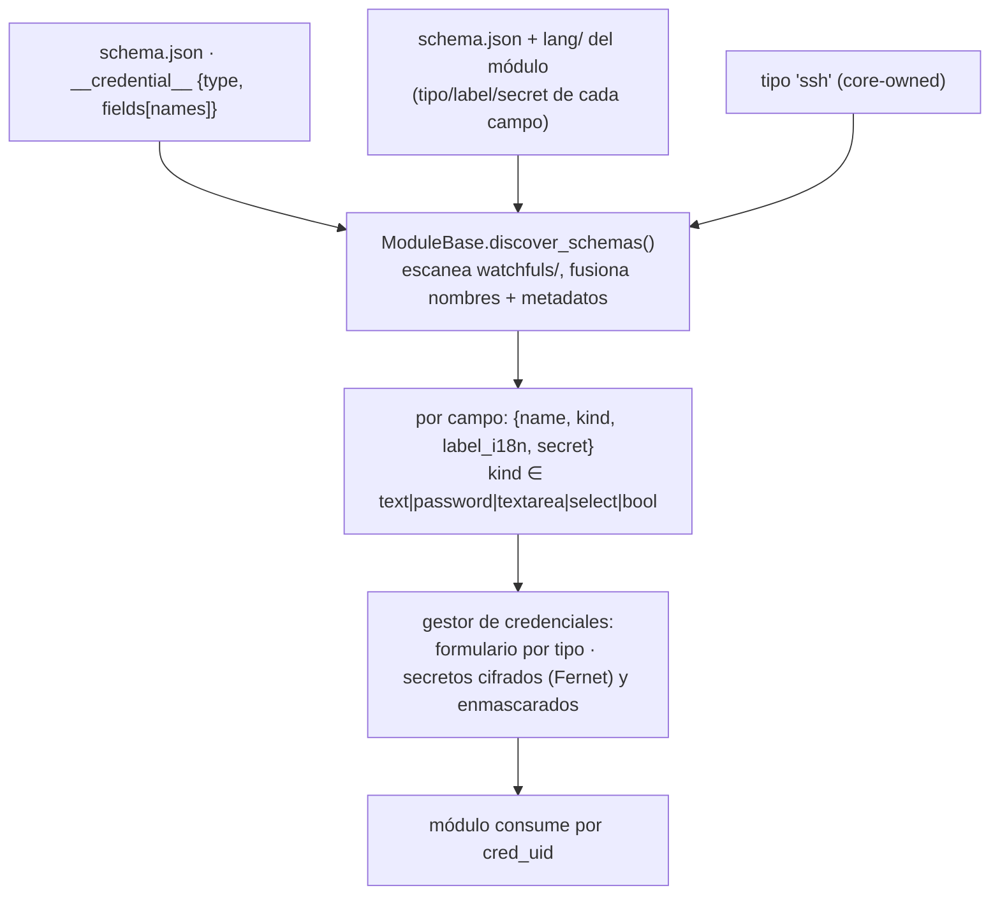

- **Qué datos:** clave del tipo + lista de campos; resueltos a `{name, kind, label_i18n, secret}`.
  Los `secret` se cifran en reposo y se enmascaran en la API.
- **Dónde acaban:** el gestor de credenciales (crear/editar por tipo) y, por referencia
  `cred_uid`, la config de checks del módulo.

---

## 5. Perfiles de host (`__host_profile__`)

Un módulo declara qué **protocolo de conexión** aporta a un Host y qué campos lleva (SNMP,
SSH, un perfil de BD…). El panel usa el catálogo para pintar los formularios por-protocolo de
la sección Servers y para saber qué campos ocultar en un check una vez ligado a un host.

**Descriptor** (en `watchfuls/<m>/schema.json`): `__host_profile__` = un spec o una lista
(datastore aporta varios: túnel `ssh` + perfil `db`).

**Flujo y datos:**

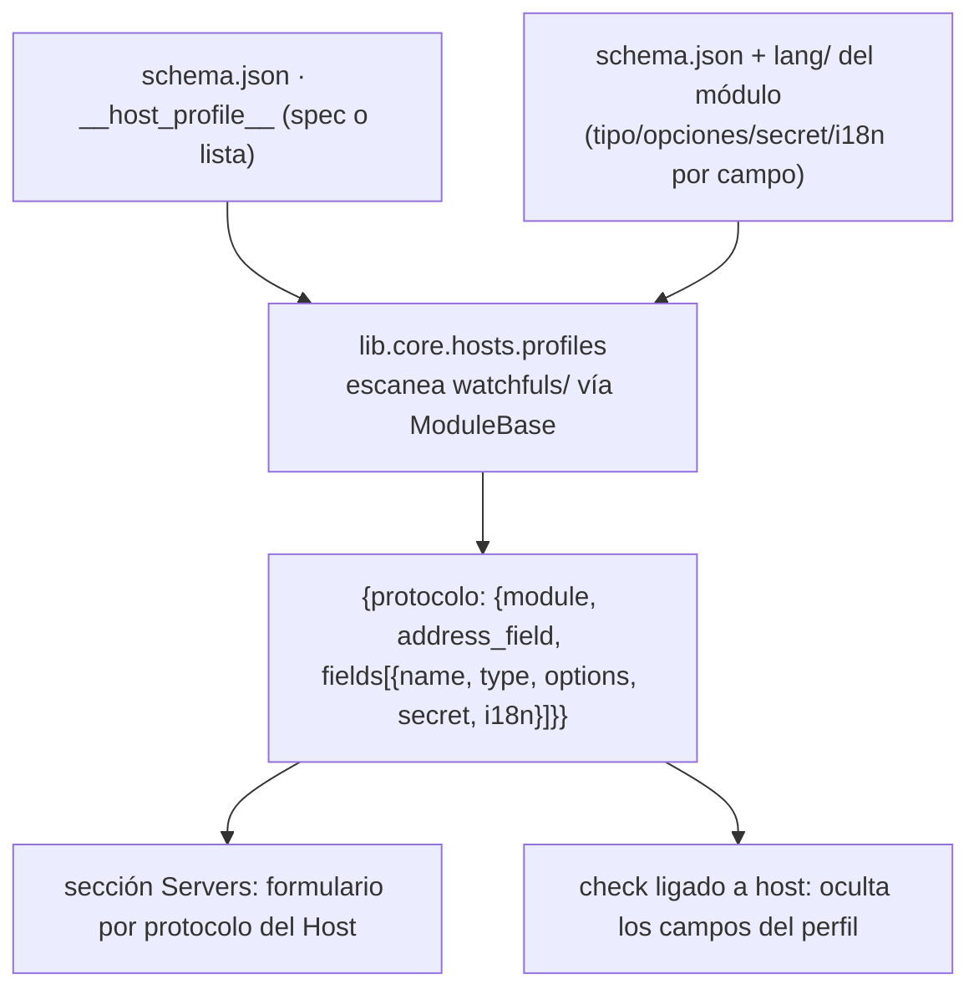

- **Qué datos:** por protocolo, el módulo dueño, el campo de dirección y la lista de campos con
  sus metadatos (tipo, opciones, secret, i18n).
- **Dónde acaban:** los formularios de la sección Servers y la resolución host-céntrica de checks.
  Ver [ref-modulos.md](ref-modulos.md) y [ref-schema-json.md](ref-schema-json.md).

---

## 6. Tablas de módulo (`discover_db_tables`)

Un módulo watchful que necesita tablas propias (cachés, índices derivados, estado) las declara
en vez de inventar almacenamiento; van a la **misma BD** (SQLite/MySQL/PostgreSQL) que los
stores del núcleo.

**Descriptor** (en `watchfuls/<m>/__init__.py`): una función `discover_db_tables()` que devuelve
`TableSpec` construidos con `module_table('<módulo>', '<nombre>', columns)` — namespaced como
`mod_<módulo>_<nombre>` para que nunca colisionen con tablas core ni entre sí.

**Flujo y datos:**

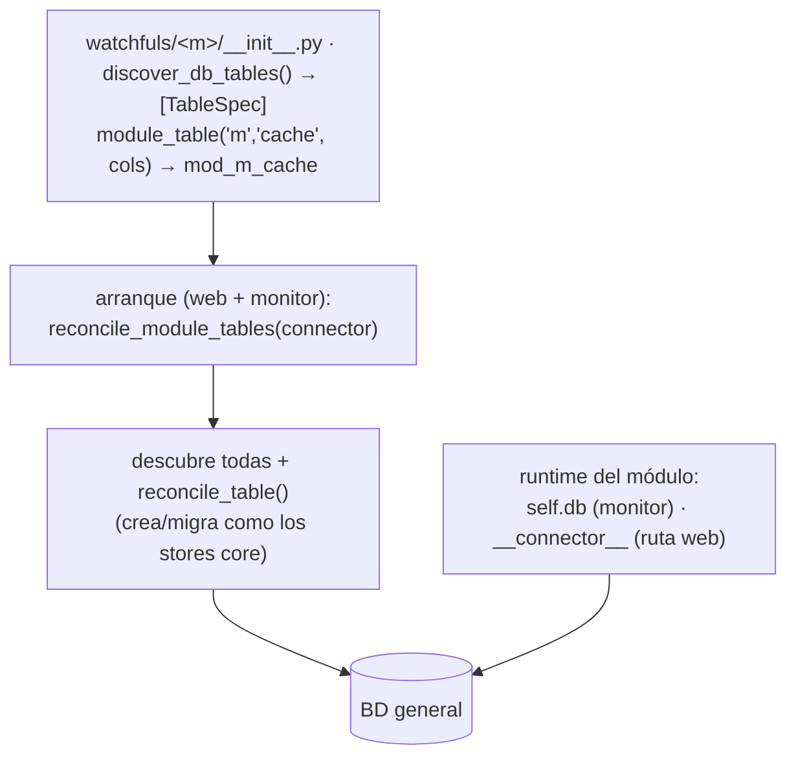

- **Qué datos:** especificaciones de tabla (`TableSpec`: columnas, índices), namespaced por módulo.
- **Dónde acaban:** la BD compartida; el módulo obtiene el conector en runtime vía `self.db`
  (contexto monitor) o la clave `__connector__` inyectada por la ruta web de watchfuls — ambas
  resuelven al mismo conector (misma BD y modelo transaccional que todo lo demás).

---

## 7. Provisión Entra (`__entraid_provision__`)

Un módulo (o la config OIDC) declara la app de Entra que el asistente device-code compartido
debe registrar para su credencial: qué recurso(s) de API, qué roles de *aplicación* y scopes
*delegados*, y — para una app de inicio de sesión — las propiedades tipo SSO (redirect URIs,
claim de grupos, require-assignment).

**Descriptor** (en `watchfuls/<m>/schema.json` o la config OIDC): `__entraid_provision__`
(un dict que `normalize_entraid_provision()` normaliza a una forma estable). El recurso por
defecto es Microsoft Graph (`GRAPH_APP_ID`); los nombres de app son fuente única en
`lib/providers/entraid/declarations.py` (`DEFAULT_APP_NAME`, `OIDC_APP_NAME`, …).

**Flujo y datos:**

```mermaid
flowchart TB
    decl["__entraid_provision__ {resource, app_roles, delegated_scopes, sso_props}"]
    decl --> norm["normalize_entraid_provision() → forma estable"]
    norm --> wiz["asistente device-code (POST /api/v1/auth/entraid/*/device-code|device-poll)"]
    wiz --> graph["lib.providers.entraid.provisioning:<br/>registra app + SP + consentimiento en Microsoft Graph"]
    graph --> cred["devuelve client_id/secret/tenant → credencial del módulo / SSO"]
```

- **Qué datos:** recurso de API, roles de aplicación, scopes delegados y (SSO) redirect URIs +
  claim de grupos; normalizados a una forma estable.
- **Dónde acaban:** el asistente los usa para registrar la app en Entra vía Graph y devolver las
  credenciales. Detalle en [caso-entra-id.md](caso-entra-id.md).

---

## 7b. Acciones de config y UI aportadas por un paquete (`CONFIG_ACTIONS` + `web/`)

Un **provider/servicio/módulo** puede añadir **botones** a una sección de config y aportar su
propio **JavaScript**, sin que una sola línea específica del paquete viva en `web_admin`.

**Descriptor** (`lib/providers/<p>/config_actions.py`, o el mismo fichero en un servicio/módulo):

```python
CONFIG_ACTIONS = [
    {'section': 'oidc', 'id': 'rotate_secret', 'order': 30,
     'label_key': 'entra_oidc_secret_rotate',        # i18n del texto
     'tooltip_key': 'entra_oidc_secret_rotate_tt',   # opcional
     'icon': 'bi-arrow-repeat', 'variant': 'warning',
     'fn': 'showEntraOidcRotateSecret',              # función JS que aporta el paquete
     'group_label_key': 'entra_id',                  # rótulo de la fila (opcional)
     'show_when': {'field': 'client_id', 'not_empty': True}},
]
```

- `fn` nombra una función JS que **el mismo paquete** publica en su `web/*_ui.html` → el
  comportamiento viaja con el paquete; el panel solo sabe "pinta un botón que llama a este nombre".
- `show_when` es una condición declarativa mínima evaluada en el frontend contra los valores de
  la sección (`{field, not_empty}`) — p. ej. no ofrecer "rotar secreto" hasta que haya app.
- `variant` usa nombres **sólidos** de Bootstrap (nunca `outline-*`).

**UI del paquete** — mismo mecanismo que ya usaban los watchfuls, ahora también para providers:

| Fichero | Dónde se inyecta |
|---|---|
| `<pkg>/web/_styles.html` | dentro de `<head>` |
| `<pkg>/web/_ui.html` | dentro del bloque `<script>` |
| `<pkg>/web/_modals.html` | antes de `</body>` |

Se descubren en `WebAdmin.__init__` escaneando `watchfuls/` **y** `lib/providers/` (los providers
se referencian con prefijo `providers/…` para que su ruta no pueda colisionar con un watchful del
mismo nombre). Puede haber **varios** `*_ui.html` por paquete (p. ej. `_oidc_ui.html`,
`_saml_ui.html`, `_scim_ui.html`).

**Flujo y datos:**

```mermaid
flowchart TB
    decl["config_actions.py :: CONFIG_ACTIONS<br/>[{section, id, label_key, icon, variant, fn, show_when}]"]
    decl --> disc["discover_config_actions()<br/><small>escanea lib.providers / lib.services / lib.core</small>"]
    disc --> lay["config_layout(): adjunta 'actions' a la card de esa sección"]
    lay --> api["GET /api/v1/config/layout"]
    api --> ren["_cfgSectionActions(sec, data)<br/><small>evalúa show_when y pinta los botones</small>"]
    ren --> click["onclick → fn()"]
    js["<pkg>/web/*_ui.html (JS del paquete)"] --> inj["module_web_ui → bloque script"]
    inj -.-> click
```

- **Qué datos:** metadatos del botón (sección, id, i18n, icono, variante, orden, condición) y el
  **nombre** de la función; nunca la implementación.
- **Dónde acaban:** la card de esa sección en Config. Ejemplo real: el provider Entra ID declara
  *Registrar en Azure*, *Abrir en Entra ID* y *Rotar secreto* para `oidc`, y *Registrar SAML2* /
  *Añadir credencial de grupos* para `saml2` — ver [caso-entra-id.md](caso-entra-id.md).

> **Regla:** si necesitas un botón o JS específico de un paquete, **no** lo escribas en
> `web_admin`; decláralo aquí y publica el JS en el `web/` del paquete.

---

## 7c. Origen de grupos de directorio (`GROUP_SOURCES`)

El widget de mapeo **grupo→rol** permite traer los grupos directamente del directorio que
respalda esa sección, en vez de teclear DNs u object ids. Qué directorio es depende del
proveedor — conocimiento que **antes vivía en `web_admin`** como ramas
`sec === 'ldap'` / `'oidc'|'saml2'`, incluyendo el endpoint de cada uno y hasta el nombre del
campo del body (`dn` vs `group_id`).

**Descriptor** (`lib/providers/<p>/manifest.py`):

```python
GROUP_SOURCES = [
    {'section': 'ldap',                          # sección de config que respalda
     'label_key': 'grm_fetch_groups', 'icon': 'bi-cloud-download',
     'fetch_fn': '_ldapFetchGroups',             # JS que publica el propio provider
     'pick_fn':  '_ldapPickGroup',
     'lookup_url': '/api/v1/auth/ldap/group_lookup',
     'lookup_key': 'dn',                         # campo del body con el id del grupo
     'picker_id': 'ldapGroupPicker', 'hint_key': 'grm_pick_hint'},
]
```

El provider de Entra declara **dos** (`oidc` y `saml2`) apuntando al mismo endpoint de Graph
con distinto `picker_id`, para que ambas secciones puedan estar abiertas a la vez.

**Flujo y datos:**

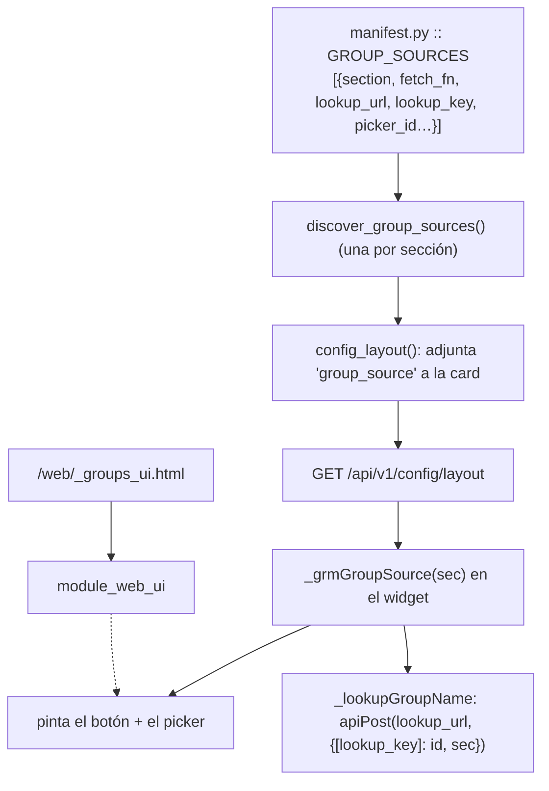

- **La capacidad manda, no el nombre**: `hasNames` (mostrar columna de nombres) pasó de ser una
  lista fija de secciones a `!!_grmGroupSource(sec)`. Una sección sin origen no muestra botón de
  traer grupos ni columna de nombres, sin tocar el panel.
- **Añadir un IdP nuevo** (Okta, etc.) = soltar un provider con su `manifest.py` + su
  `web/_groups_ui.html`. **Cero cambios en `web_admin`**.

> Cubierto por `tests/test_wa_group_sources.py`, que además vigila que no reaparezcan las ramas
> `sec === '…'` ni los ids de botón antiguos.

---

## 8. Registro de config (spec y layout)

La configuración no se descubre por escaneo de paquetes, pero sí es **data-driven desde una
fuente única**, con la misma filosofía: el dato y la presentación se declaran una vez y la UI
se renderiza desde ahí (nunca hardcodeada en JS).

- **`lib/config/spec.py`** — fuente única del *dato* de cada opción: `Cfg('sección|campo', tipo,
  default, attr=…, env=…, admin_only=…, validación…)`. `cfg_default()` da el valor por defecto;
  `cfg_meta()` la metadata por campo (tipo/rango/opciones/etiquetas).
- **`lib/config/layout.py`** — fuente única de la *presentación*: `TABS` (sub-pestañas
  `{id, label_key, icon}`) y `CARDS` (tarjetas `{tab, id, icon}` con **o** `fields:['sec|campo', …]`
  genéricas **o** `renderer:'database'|'auth'|…` a medida).

**Flujo y datos:**

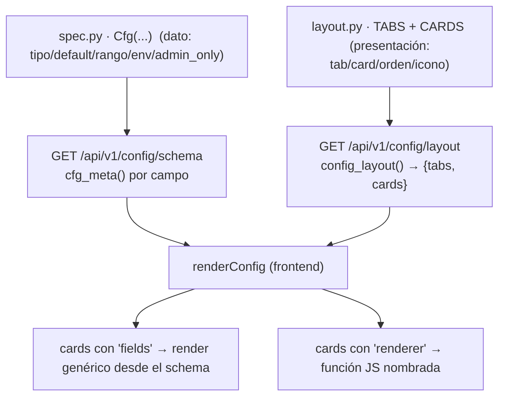

- **Qué datos:** por campo, tipo/default/rango/opciones/etiquetas (schema) y su ubicación
  (tab+card+orden) en el layout.
- **Dónde acaban:** `renderConfig` pinta la pantalla de Config íntegra desde estas dos fuentes;
  añadir una opción = un `Cfg(...)` en spec.py + (si hace falta) una entrada en un `CARDS`.
  Ver [ref-configuracion.md](ref-configuracion.md) y [explica-web-admin.md](explica-web-admin.md).

---

## 9. Canales de notificación (`register_channel` / `Channel`)

El core posee **qué canales de notificación existen**. Cada canal (Telegram, Email, Webhook,
Microsoft Teams) es un `Channel(name, send, flush)` que **se auto-registra** al importarse; el
router y el notificador por ciclo del monitor iteran el registro en vez de hardcodear la lista.

**Descriptor** (`lib/core/notify/<canal>/channel.py`): `register_channel(Channel(name, send, flush))`
—`send(router, cfg, **event)` entrega un evento; `flush(router, cfg, alerts, hostname, public_url)`
entrega las alertas agrupadas de un ciclo—. `load_builtin_channels()` **descubre** cada
`lib/core/notify/<name>/channel.py` (orden alfabético estable) y lo importa; no hay lista central.

**Flujo y datos:**

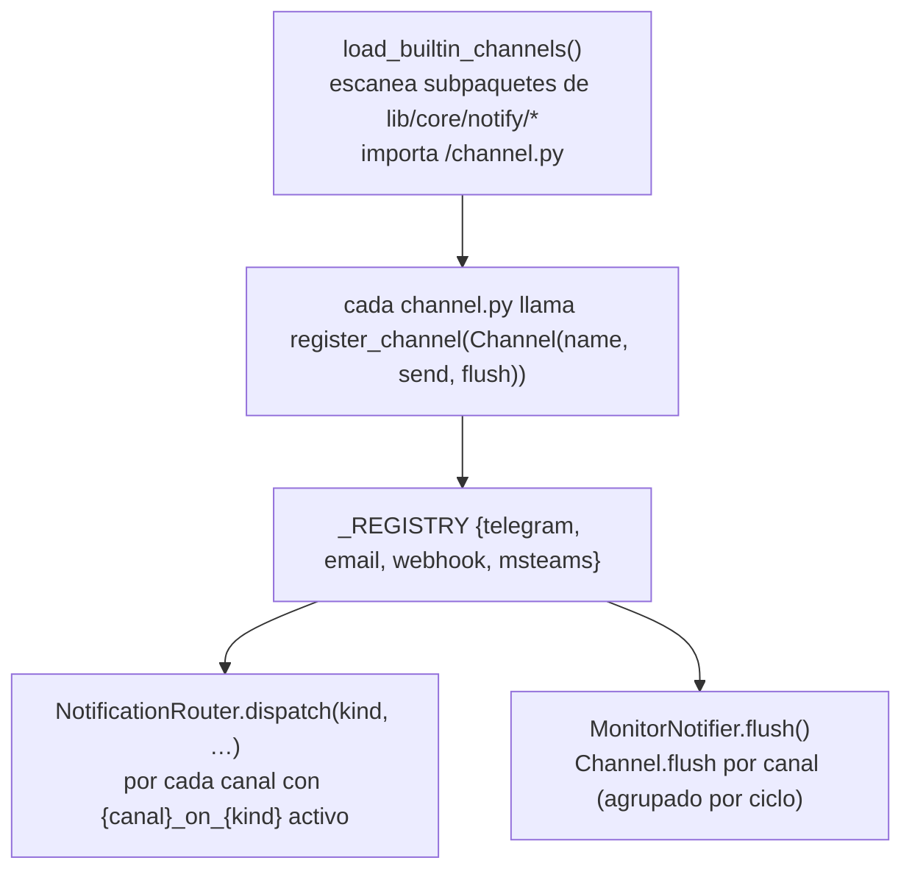

- **Qué datos:** el nombre del canal y sus dos funciones de entrega (evento suelto / flush agrupado).
- **Dónde acaban:** el router y el notificador del monitor los iteran genéricamente. Añadir un
  canal = un `channel.py` que se registra; nada en el router ni en el monitor cambia. Detalle en
  [explica-notificaciones.md](explica-notificaciones.md#canales).

---

## 10. Eventos de notificación (`NOTIFY_EVENTS`)

Simétrico a los canales (los *endpoints*): el registro de las **fuentes/tipos** que se pueden
notificar. Cada `kind` (`down`/`recovery`/`warn`/`manual_run`/`ipban_*`/`service_*`/
`cert_expiring`/`syslog`/`event`…) es el valor de `dispatch(kind=…)` y la clave de la matriz
`notifications|{canal}_on_{kind}`.

**Descriptor** (`lib/<raíz>/<dominio>/notify_events.py` · `NOTIFY_EVENTS`) — data pura, etiquetas
i18n por `label_key`:

```python
NOTIFY_EVENTS = [
    {'key': 'down', 'source': 'monitoring', 'label_key': 'notif_event_down',
     'matrix': True, 'ui': True, 'order': 10},
]
```

`matrix=True` genera columnas `{canal}_on_{key}` (auto-routing); `matrix=False` marca una fuente
que no auto-enruta (p.ej. `event`: las reglas eligen canal). `ui=False` oculta la fila en la UI de
routing (p.ej. `syslog`, sin dispatcher activo).

**Flujo y datos:**

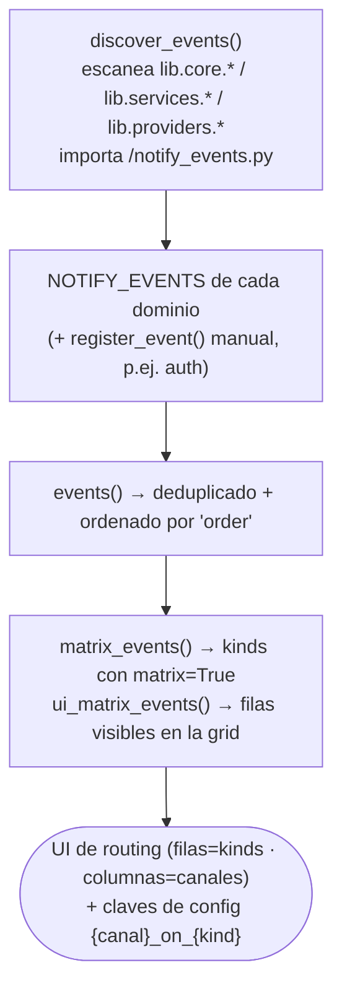

- **Qué datos:** por evento, la key (kind), su dominio (`source`), su etiqueta i18n y los flags
  `matrix`/`ui`/`order`.
- **Dónde acaban:** la matriz de routing y su UI se generan de aquí (filas dinámicas); las claves de
  config `{canal}_on_{kind}` **no** se declaran en `spec.py` — son dinámicas y por defecto off.
  Detalle en [explica-notificaciones.md](explica-notificaciones.md#eventos-kinds-y-su-registro).

---

## Cómo añadir cada cosa (resumen)

| Quiero… | Toco… |
|---|---|
| Un permiso nuevo en un dominio/servicio | su `permissions.py` → `MODULE_PERMISSIONS.permissions` (+ i18n del flag/grupo) |
| Una tarjeta en el Overview (dominio/servicio del core) | su `overview_widget.py` → `OVERVIEW_WIDGETS` (+ `stat`/`rows`) |
| Uno o varios widgets de Overview desde un **módulo watchful** | `schema.json` → `__overview_widget__` (lista) + hook `Watchful.overview_widget()` — ver §2b |
| Un servicio de fondo nuevo | un paquete en `lib/services/<s>/` con `EMBEDDED_SERVICE` + `make_embedded(host)` |
| Un tipo de credencial para un módulo | `schema.json` → `__credential__` (+ campos en schema/lang) |
| Un protocolo de conexión de host | `schema.json` → `__host_profile__` |
| Una tabla propia de un módulo | `discover_db_tables()` en el `__init__.py` del módulo |
| Registrar una app de Entra para un módulo | `schema.json` → `__entraid_provision__` |
| Una opción de configuración | `Cfg(...)` en `spec.py` (+ entrada en `CARDS` de `layout.py`) |
| Un canal de notificación nuevo | un `lib/core/notify/<canal>/channel.py` → `register_channel(Channel(...))` |
| Un evento/tipo notificable nuevo | `notify_events.py` → `NOTIFY_EVENTS` (o `register_event(...)`) en el dominio |

En todos los casos: **solo el descriptor del módulo** — el núcleo lo descubre y lo integra solo.
