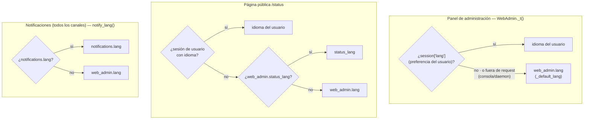
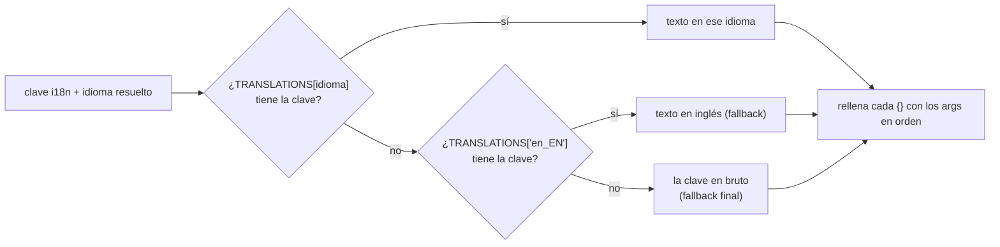

# Soporte de múltiples idiomas (i18n)

Referencia completa del sistema de internacionalización de ServiceSentry: cómo
funcionan las dos capas de traducción, cómo `discover_schemas()` construye el
pipeline, cómo lo usa el navegador, cómo se traducen los **textos de
notificación** (claves, overlays y esquemas de tags) y cómo añadir un idioma
nuevo.

---

## Arquitectura de traducción

ServiceSentry tiene dos **capas** de traducción y una **tercera preocupación**
—los textos de notificación— que no es una capa nueva, sino que **reutiliza las
dos existentes**:

| Capa | Ubicación | Formato | Alcance |
|-------|-----------|---------|---------|
| **Global de la UI** | `src/lib/i18n/lang/<idioma>.py` | Python `LANG = {...}` | Navegación, botones, mensajes de error, etiquetas genéricas de campos, **claves de notificación del core** (`notif_*`) y **plantillas de email** (`email_tpl`) |
| **Por módulo** | `src/watchfuls/<modulo>/lang/<idioma>.json` | JSON `{pretty_name, labels, messages, messages_vars, …}` | Nombre visible del módulo, etiquetas de campos en la pestaña Módulos y **textos i18n de los checks** (`messages`) con su **esquema de tags** (`messages_vars`) |

Ambas capas se auto-descubren en tiempo de arranque: no hay ningún archivo de
registro central que modificar al añadir un módulo o un idioma nuevo.

**Textos de notificación** (tercera preocupación): el texto que ve el receptor
de una alerta (Telegram, email, webhook, Teams…) se obtiene de esas mismas dos
capas — el diccionario global aporta las claves `notif_*` y las cadenas
`email_tpl`; el JSON de cada módulo aporta su sección `messages`. Encima de todo
ello existe una capa de **overrides de administrador** (personalización por
idioma desde la UI) y un **esquema de tags** que documenta los placeholders de
cada texto. Todo eso se detalla en
[Traducción de textos de notificación](#traducción-de-textos-de-notificación).
El detalle del **editor** y sus endpoints vive en
[explica-notificaciones.md → «Sistema de textos de notificación»](explica-notificaciones.md); aquí
se documenta solo la parte de **traducción**.

---

## Nivel 1 — Traducciones globales de la UI

### Estructura de archivos

```text
src/lib/i18n/lang/
  +-- en_EN.py    ← inglés (idioma por defecto del sistema)
  +-- es_ES.py    ← español
  +-- fr_FR.py    ← (ejemplo de idioma adicional)
```

### Formato del archivo

Cada archivo debe exponer un diccionario llamado `LANG`:

```python
# src/lib/i18n/lang/fr_FR.py
LANG = {
    'admin_panel': 'Panneau d\'administration',
    'loading':     'Chargement…',
    'save':        'Enregistrer',
    'cancel':      'Annuler',
    # … resto de claves, siguiendo la estructura de en_EN.py
    'labels': {
        'enabled': 'Activé',
        'threads': 'Fils',
        # …
    },
    'sections': {
        'daemon':    'Démon',
        'global':    'Général',
        'telegram':  'Telegram',
        'web_admin': 'Panneau Web',
    },
}
```

### Carga automática

`lib/i18n/__init__.py` descubre todos los archivos `*.py` del paquete
`lib/i18n/lang/` mediante `pkgutil.iter_modules` e importa cada módulo
dinámicamente. El resultado se expone como:

```python
SUPPORTED_LANGS   # lista de códigos descubiertos: ['en_EN', 'es_ES', …]
DEFAULT_LANG      # 'en_EN'
TRANSLATIONS      # dict[lang_code, LANG_dict]
```

El `context_processor` de Flask inyecta la traducción activa como `i18n` en
todas las plantillas. El JavaScript la recibe en la constante `I18N`.

---

## Nivel 2 — Traducciones por módulo

Cada módulo aporta un fichero `src/watchfuls/<modulo>/lang/<idioma>.json` con su
nombre visible (`pretty_name`), las **etiquetas de campos** (`labels`, `hints`,
`group_labels`, `option_labels`, …) y sus **textos i18n de checks** (`messages`
+ esquema `messages_vars`). La estructura de carpetas, el formato completo y la
tabla de todas sus secciones están en
[ref-i18n.md → Fichero de idioma por módulo](ref-i18n.md#fichero-de-idioma-por-módulo-langjson).

Las claves de presentación (`labels`, `hints`, `group_labels`, …) se fusionan en
`label_i18n`/`__i18n__` por `discover_schemas()`; en cambio `messages` y
`messages_vars` **no** entran en el schema del navegador: son la parte de
**notificación** del fichero de módulo — ver
[Traducción de textos de notificación](#traducción-de-textos-de-notificación).

Cada campo declarado en `schema.json` debería tener una clave correspondiente
en `labels`. Si falta, la resolución cae en cascada (ver sección
[Resolución de etiquetas en el navegador](#resolución-de-etiquetas-en-el-navegador)).

---

## Cómo `discover_schemas()` construye el pipeline

`ModuleBase.discover_schemas()` se ejecuta una vez al arrancar e integra las
traducciones directamente en los metadatos del schema:

```
schema.json        →  definiciones de campos (type, default, min, max…)
lang/en_EN.json    →  label_i18n["en_EN"] inyectado en los metadatos de cada campo
lang/es_ES.json    →  label_i18n["es_ES"] inyectado en los metadatos de cada campo
info.json          →  icono fusionado en la entrada __i18n__
```

### Resultado: `ITEM_SCHEMAS`

El resultado se serializa como la constante JavaScript `ITEM_SCHEMAS` en el
dashboard. Está indexado por `"modulo|coleccion"`:

```json
"ping|list": {
    "enabled": {"type": "bool", "default": true,
                "label_i18n": {"en_EN": "Enabled", "es_ES": "Habilitado"}},
    "host":    {"type": "str",  "default": "",
                "label_i18n": {"en_EN": "Host",    "es_ES": "Host"}},
    "timeout": {"type": "int",  "default": 5,
                "label_i18n": {"en_EN": "Timeout (s)", "es_ES": "Timeout (s)"}}
}
```

### Entrada especial `__i18n__`

Para cada módulo basado en carpeta, `discover_schemas()` genera además la
clave `"modulo|__i18n__"` con el nombre visible y el icono por idioma:

```json
"ping|__i18n__": {
    "en_EN": {"pretty_name": "Ping", "icon": "🏓"},
    "es_ES": {"pretty_name": "Ping", "icon": "🏓"}
}
```

Este dato lo usa el JS para mostrar el nombre y el icono del módulo.

---

## Resolución de etiquetas en el navegador

Cuando JavaScript necesita la etiqueta de un campo, aplica esta cadena de
prioridad:

| Prioridad | Fuente | Descripción |
|-----------|--------|-------------|
| 1 | `schema.label` | Etiqueta estática embebida en el schema (módulos legacy) |
| 2 | `schema.label_i18n[CURRENT_LANG]` | Etiqueta para el idioma activo del usuario |
| 3 | `schema.label_i18n[SYSTEM_DEFAULT_LANG]` | Etiqueta para el idioma por defecto del sistema |
| 4 | `LABELS[fieldKey]` | Etiqueta global de la UI (`lib/i18n/lang/<lang>.py`) |
| 5 | `humanizeKey(fieldKey)` | Auto-generada: guiones bajos → espacios, Title Case |

Para el **nombre del módulo** (`modulePrettyName`):

| Prioridad | Fuente |
|-----------|--------|
| 1 | `config.pretty_name` (valor guardado por el usuario en la UI) |
| 2 | `ITEM_SCHEMAS["mod\|__i18n__"][CURRENT_LANG].name` |
| 3 | `ITEM_SCHEMAS["mod\|__i18n__"][SYSTEM_DEFAULT_LANG].name` |
| 4 | Nombre humanizado (`humanizeKey`) |

Para el **icono del módulo** (`moduleIcon`):

| Prioridad | Fuente |
|-----------|--------|
| 1 | `ITEM_SCHEMAS["mod\|__icon__"]` — declaración `bi-*` del `schema.json`, **canónica** (ver [ref-schema-json.md → `__icon__`](ref-schema-json.md#__icon__)) |
| 2 | `config.icon` (override para módulos que no declaran `__icon__`) |
| 3 | `ITEM_SCHEMAS["mod\|__i18n__"][CURRENT_LANG].icon` |
| 4 | `ITEM_SCHEMAS["mod\|__i18n__"][SYSTEM_DEFAULT_LANG].icon` |
| 5 | Emoji 📦 |

El `__icon__` declarativo gana **primero** para que el panel muestre exactamente el
mismo icono que la página `/status` (que también lee `__icon__` directo del schema,
sin pasar por la config guardada).

`moduleIcon` devuelve contenido **renderizable**: una clase `bi-*` se envuelve como
`<i class="bi …">`; un emoji/literal pasa tal cual. Es la **misma fuente** que usa la
página de estado pública (`/status`), así que el panel y `/status` muestran el mismo
icono. El avatar que envuelve al icono lleva la clase `.ss-mod-av` (tinte por `hue`
vía la variable CSS `--mh`), cuya **luminosidad la resuelve el tema activo** — así el
icono mantiene contraste tanto en modo claro como oscuro.

---

## Constantes JavaScript disponibles

Estas constantes se inyectan en el dashboard al renderizar la plantilla:

| Constante | Tipo | Contenido |
|-----------|------|-----------|
| `ITEM_SCHEMAS` | objeto | Schema completo con `label_i18n` y `__i18n__` por módulo |
| `CURRENT_LANG` | string | Idioma activo de la sesión actual (ej. `"es_ES"`) |
| `SYSTEM_DEFAULT_LANG` | string | Idioma por defecto configurado en `config.json` |
| `SUPPORTED_LANGS` | array | Lista de todos los idiomas descubiertos |
| `I18N` | objeto | Diccionario de traducción global para el idioma activo |

---

## Añadir un idioma nuevo

### Paso 1 — Traducciones globales de la UI

Crea `src/lib/i18n/lang/fr_FR.py` copiando `en_EN.py` como base y
traduciendo todos los valores del diccionario `LANG`. El cargador
`lib/i18n/__init__.py` lo descubrirá automáticamente mediante `pkgutil` sin
ningún paso adicional. Incluye también las estructuras de **notificación**:
las claves `notif_*`, el sub-dict `email_tpl` (plantillas de email) y los
esquemas de tags `notif_msg_vars` / `notif_email_vars` (ver
[Traducción de textos de notificación](#traducción-de-textos-de-notificación)).

### Paso 2 — Traducciones de cada módulo

Para cada módulo en `src/watchfuls/<modulo>/`, crea `lang/fr_FR.json`:

```json
{
    "pretty_name": "Nom du module",
    "labels": {
        "enabled": "Activé",
        "host":    "Hôte",
        "timeout": "Délai (s)"
    }
}
```

`discover_schemas()` descubre todos los `*.json` de la carpeta `lang/` de
forma automática — no hace falta registrarlos en ningún sitio. Si el módulo
emite textos de notificación, traduce también sus secciones `messages` y
`messages_vars` (ver [Nivel 2](#nivel-2--traducciones-por-módulo)).

### Resumen de cambios necesarios

| Qué crear | Dónde | ¿Registro manual? |
|-----------|-------|------------------|
| `fr_FR.py` con `LANG = {...}` | `src/lib/i18n/lang/` | No — auto-descubierto por `pkgutil` |
| `fr_FR.json` por módulo | `src/watchfuls/<mod>/lang/` | No — auto-descubierto por `discover_schemas()` |

---

## Selección de idioma por usuario

- Cada usuario puede cambiar su idioma desde el selector en la barra de navegación.
- La elección se persiste en la sesión del servidor (`session['lang']`).
- El idioma por defecto del sistema se configura en `config.json` →
  `web_admin.lang` y se aplica a sesiones nuevas o usuarios sin preferencia guardada.
- El valor de `web_admin.lang` debe ser uno de los códigos en `SUPPORTED_LANGS`;
  si no lo es, se ignora y se usa `en_EN`.

### Flujo 1 — ¿Qué idioma? (precedencia por superficie)

El idioma efectivo depende de **dónde** se genera el texto. Cada valor se valida con
`coerce_lang()` (si no está en `SUPPORTED_LANGS`, cae al siguiente candidato):



El idioma de **cualquier** canal de notificación (Telegram, email, webhook,
Teams…) lo resuelve `notify_lang(cfg)` (`lib/core/notify/formatting.py`):
`notifications|lang` → `web_admin|lang`.

### Flujo 2 — ¿Cómo se obtiene el texto de una clave?

Resuelto el idioma, la traducción busca la clave con **doble fallback** (idioma →
inglés → la clave en bruto) y rellena los `{}` con los argumentos. En backend lo hace
`translate(lang, key, *args)` / `WebAdmin._t(key, *args)` (`lib/i18n/__init__.py`); en el
navegador, la función `t(key, …)` sobre el mismo diccionario servido a la página.



> El **Nivel 2** (etiquetas de módulo) se fusiona en el mismo diccionario que sirve el
> backend al navegador (ver [Resolución de etiquetas en el navegador](#resolución-de-etiquetas-en-el-navegador)),
> así que `t(key)` resuelve tanto claves globales (Nivel 1) como de módulo (Nivel 2) con
> el mismo fallback.

---

## Traducción de textos de notificación

El texto que recibe el destinatario de una alerta (Telegram, email, webhook,
Teams…) se traduce reutilizando las dos capas anteriores. Esta sección cubre la
parte de **traducción**: qué claves existen, cómo se sobreescriben por idioma y
cómo se descubren los tags. El **editor** de la UI (Config → Notificaciones →
Templates) y sus endpoints se documentan en
[explica-notificaciones.md → «Sistema de textos de notificación: plantillas, listados y
tags»](explica-notificaciones.md).

### Familias de claves de notificación del core

En `lib/i18n/lang/<idioma>.py` (capa global) viven las claves que generan los
textos que produce el propio core (no un módulo):

| Familia | Ejemplo | Uso |
|---------|---------|-----|
| `notif_event_*` | `notif_event_down` = `Service Down` | **Título** por tipo de evento (`kind`); mismas keys que muestra la matriz de enrutado, mapeadas en `formatting.py::EVENT_LABEL_KEY` |
| `notif_msg_*` | `notif_msg_auth_login` = `{} signed in via {} from {}` | **Cuerpo** del mensaje; placeholders `{}` posicionales |
| `notif_status_*` | `notif_status_down` = `Down` | Etiqueta corta de estado |
| `notif_auth_*` | `notif_auth_oidc` = `SSO (OIDC)` | Nombre del método de autenticación |
| `notif_source_*` | `notif_source_monitoring` = `Monitoring (sensors)` | Nombre de la fuente/origen del evento |

Además, las claves del **editor** de textos (`notif_tpl_*`: `notif_tpl_title`,
`notif_tpl_desc`, `notif_tpl_placeholders_hint`, `notif_tpl_lbl_*`, …) traducen
la propia interfaz del editor.

### Plantillas de email: overlay `email_tpl`

Las cadenas de las plantillas HTML de email **no** son claves sueltas del
diccionario, sino un sub-dict `email_tpl` dentro de cada idioma. El flujo
(`lib/core/notify/email/templates.py::get_strings`) es:

1. **Base en inglés:** `_DEFAULT_STRINGS` (definido en `templates.py`) — el
   baseline con todas las cadenas (`footer`, `alert_down`, `summary_many`, …).
2. **Overlay por idioma:** si hay idioma, se fusiona
   `TRANSLATIONS[lang]['email_tpl']` encima → `{**_DEFAULT_STRINGS, **overlay}`.
   El dict fuente para español/inglés está en `lang/<idioma>.py` bajo la clave
   `email_tpl`.
3. **Overrides de admin:** por último, las personalizaciones del editor
   (solo claves conocidas de `_DEFAULT_STRINGS`) ganan sobre base y overlay.

Así, para traducir los emails a un idioma nuevo basta con añadir un dict
`email_tpl` (con las mismas claves que `_DEFAULT_STRINGS`) al `LANG` de ese
idioma; las claves ausentes caen al inglés.

### Los tres esquemas de tags

Cada texto de notificación admite **placeholders**, y cada uno tiene un esquema
que los nombra para el editor: `notif_msg_vars` y `notif_email_vars` (core, en
`lib/i18n/lang/<idioma>.py`) y `messages_vars` (por módulo, en su `lang/*.json`).
La tabla comparativa, sus formas y las dos convenciones de placeholder están en
[ref-i18n.md → Los tres esquemas de tags](ref-i18n.md#los-tres-esquemas-de-tags).

### Cómo un módulo emite texto traducido: `ModuleBase._msg()`

Un check llama a `self._msg(key, *args)`
(`lib/modules/module_base.py`) para producir su texto de notificación en el
idioma del sistema (`notify_lang()`). La precedencia del texto es:

1. **Override de admin:** `notif_text_overrides[lang]['mod:<module>:<key>']`.
2. **Sección `messages` del módulo:** `lang/<lang>.json` (idioma pedido; el
   `DEFAULT_LANG` rellena los huecos). Cacheada por `(módulo, idioma)` en
   `_MODULE_MSG_CACHE`.
3. **La propia key** como último fallback.

El resultado pasa por `_fill(text, args)`, que rellena los placeholders.

### Overrides de administrador

Encima de todo lo anterior, el editor de textos (Config → Notificaciones →
Templates) permite **personalizar por idioma cualquier texto** —eventos del
core, estados, cadenas de email y mensajes de cada módulo— y dejar un campo
vacío = usar el default de i18n. Los overrides se guardan en
`cfg['notif_text_overrides'][<lang>]` con claves con ámbito:

- `core:<i18n_key>` — resuelto por `notify_text(cfg, lang, 'core:'+key)`
  (`formatting.py`), para las claves del core (`notif_*`, `email_tpl`).
- `mod:<module>:<msg_key>` — resuelto por
  `text_override(cfg, lang, 'mod:<module>:<key>')`, para los `messages` de un
  módulo.

El detalle del editor y sus endpoints está en
[explica-notificaciones.md](explica-notificaciones.md).

### Placeholders: secuencial vs. indexado

El resultado de `_msg()` pasa por `_fill(text, args)`
(`lib/core/notify/formatting.py`), que soporta placeholders **secuenciales `{}`**
e **indexados `{0}`/`{1}`** (estos permiten reordenar los valores en overrides y
traducciones). El detalle está en
[ref-i18n.md → Placeholders: secuencial vs. indexado](ref-i18n.md#placeholders-secuencial-vs-indexado-_fill).

---

## Claves i18n en datos persistidos (auditoría)

Algunos campos del registro de auditoría (tabla `audit` en la base de datos) contienen **claves i18n en lugar de texto traducido**. Esto permite que cada administrador vea el texto en su propio idioma al leer el log, independientemente del idioma activo cuando se generó el evento.

Ejemplo: el campo `detail.reason` en eventos `login_failed`:

```json
{ "event": "login_failed", "detail": { "reason": "user_not_found" } }
```

El frontend traduce la clave en tiempo de visualización con `t(detail.reason)`. Si la clave no existe en el idioma actual, se muestra la clave en bruto como fallback.

Claves usadas actualmente en datos persistidos:

| Clave | Contexto |
|-------|---------|
| `user_not_found` | `login_failed` — usuario no existe |
| `account_disabled` | `login_failed` — cuenta desactivada |
| `account_locked` | `login_failed` — cuenta bloqueada por intentos fallidos |
| `invalid_credentials` | `login_failed` — contraseña incorrecta |

---

## Claves i18n recientes (referencia)

Claves añadidas que no pertenecen a ningún módulo concreto:

| Clave | Descripción |
|-------|------------|
| `account_disabled` | Mensaje de error en el formulario de login cuando la cuenta está desactivada |
| `account_locked` | Mensaje de error en el formulario de login cuando la cuenta está bloqueada; admite `{}` para los minutos restantes |
| `user_not_found` | Razón en auditoría cuando el usuario no existe |
| `session_terminated` | Toast mostrado al usuario cuando su sesión es revocada remotamente |
| `group_enabled_label` | Etiqueta del switch enabled/disabled en el modal de grupo |
| `role_enabled_label` | Etiqueta del switch enabled/disabled en el modal de rol |
