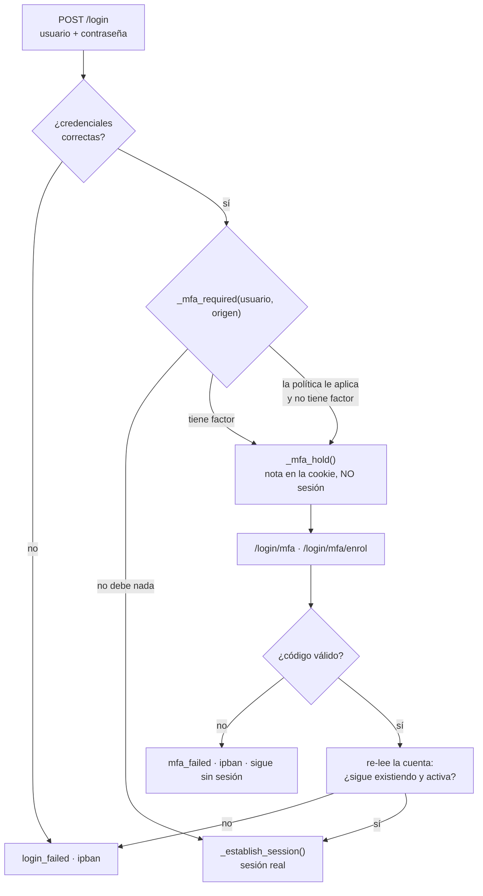
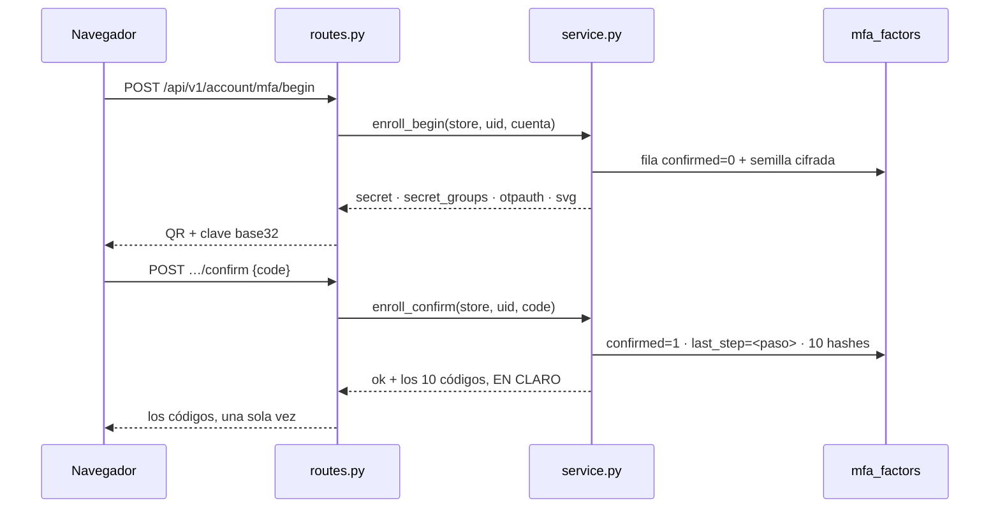
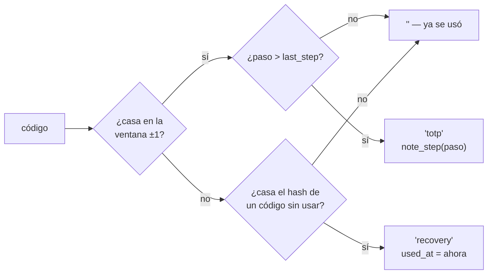
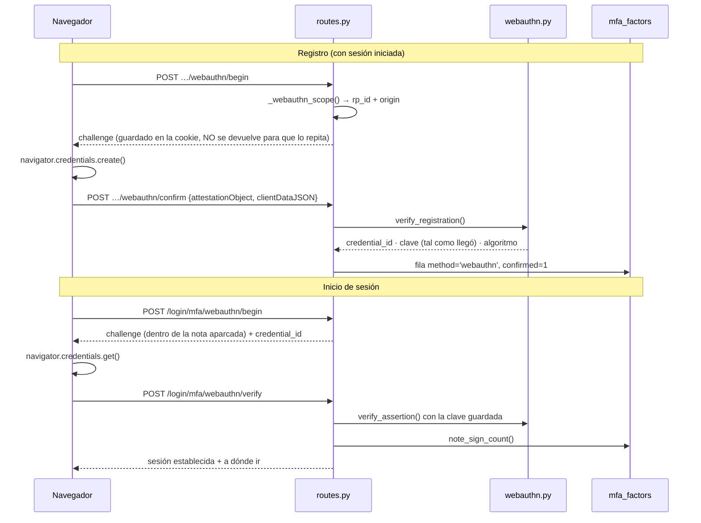

# Verificación en dos pasos (MFA)

> Qué es el segundo factor en ServiceSentry, cómo se integra con el inicio de sesión, qué
> decisiones de diseño hay detrás y qué queda por hacer. Fuente única del tema.
>
> Código: [`src/lib/core/mfa/`](../src/lib/core/mfa/) — `totp.py` (la aritmética del RFC 6238),
> `qr.py` (el cuadrado, escrito aquí), `store.py` (las dos tablas), `service.py` (alta,
> confirmación, verificación, códigos de recuperación), `policy.py` (**quién** debe llevar uno),
> `mixin.py` (el paso intermedio del login), `routes.py` (la API de la propia cuenta y el reset
> de otra), `manifest.py` (permiso y eventos de auditoría), y para las llaves de seguridad
> `cbor.py`, `cose.py` y `webauthn.py`. **Nada de esto importa Flask salvo `routes.py` y
> `mixin.py`** — la política decide sin tocar una petición, que es lo que la deja probable sin
> levantar la app. El mapa completo está en el docstring de
> [`__init__.py`](../src/lib/core/mfa/__init__.py).
> Interfaz: [`partials/account/_mfa.html`](../src/lib/web_admin/templates/partials/account/_mfa.html),
> [`login_mfa.html`](../src/lib/web_admin/templates/login_mfa.html) y
> [`login_mfa_enrol.html`](../src/lib/web_admin/templates/login_mfa_enrol.html).

---

## Resumen en una tabla

| | |
|---|---|
| **Factor** | TOTP (RFC 6238, SHA-1, 6 dígitos, 30 s, ventana ±1 paso) — **fijos**, no son ajustes ([por qué](#lo-que-a-propósito-no-es-configurable)) |
| **Alta** | QR **y** clave base32, siempre las dos |
| **Recuperación** | 10 códigos `XXXXX-XXXXX`, de un solo uso, mostrados **una vez** |
| **Política** | `off` · `admins` · `all` — y **nunca deja fuera a nadie**: quien no tiene, lo configura al entrar |
| **SSO** | Confianza **por proveedor** (`ldap\|oidc\|saml2 · mfa_trusted`): ese directorio ya lo pide |
| **Almacenamiento** | Semilla cifrada con Fernet (`SS_SECRET_KEY`); códigos, solo su hash |
| **Antirreplay** | Se guarda el **paso** aceptado; el mismo código no abre una segunda sesión |
| **Reset** | Permiso `mfa_reset_others`, y `main.py user mfa-reset` desde la máquina |
| **Llaves de seguridad** | WebAuthn completo: registro desde `/account` y aserción en el login |

---

## La propiedad de la que cuelga todo

Un inicio de sesión que debe un segundo factor **no es una sesión**.

No hay fila en la tabla de sesiones, no hay `logged_in`, no pasa por `_login_required`. Lo que
queda entre la contraseña y el código es una **nota en la cookie** (`mfa_pending`) que dice
quién está a medio entrar, por qué puerta y si pidió que le recordaran.

La alternativa evidente —crear la sesión y marcarla— reparte una sesión real y usable por API a
quien tenga la contraseña, y convierte cada guarda del panel en responsable de recordar un
campo más. Aquí no hay nada que recordar: hasta que el código verifica, la petición es anónima
**por no tener sesión**.



Dos detalles del diagrama que no son adorno:

- **`_mfa_hold` guarda un `source`.** El código se comprueba contra la cuenta que nombra la
  nota, no contra quien tenga un código que verifique.
- **Se vuelve a leer la cuenta.** Esto es la segunda mitad de una autenticación, y entre las
  dos la cuenta puede haberse desactivado.

---

## Quién debe llevar uno

`web_admin|mfa_required` toma tres valores, y la lógica vive en
[`policy.py`](../src/lib/core/mfa/policy.py):

| Valor | Alcance |
|---|---|
| `off` | Nadie está obligado. Quien lo configure voluntariamente lo sigue usando |
| `admins` | Quien sea administrador **por su rol o por un grupo que lo lleve** |
| `all` | Todas las cuentas |

Tres reglas que la hacen segura de encender:

1. **Encenderla no echa a nadie.** A quien le aplica y no tiene factor, no se le rechaza: se le
   lleva a una página de alta **dentro del propio inicio de sesión**. Refusar habría dejado
   fuera a todo el que no lo tuviera, que el día que enciendes la política son todos, el último
   administrador incluido.
2. **`admins` mira el rol *y* los grupos.** Preguntar solo por el rol propio es el fallo que la
   auditoría de agosto encontró en otras cuatro guardas; repetirlo aquí dejaría fuera justo a
   las cuentas que la política existe para proteger.
3. **Sin cifrado, la política se ignora** y se dice en el log. `MfaStore` se niega a escribir
   una semilla que no puede proteger, así que exigir un factor en una instalación sin
   `SS_SECRET_KEY` ni fichero de clave sería exigir algo que nadie puede dar de alta.

Y una que va aparte de la política: **una cuenta con factor lo verifica siempre**, valga lo que
valga el ajuste. Apagar la política no puede dejar de honrar en silencio lo que la gente ya
configuró.

### Confiar en un directorio que ya lo pide

`ldap|mfa_trusted`, `oidc|mfa_trusted`, `saml2|mfa_trusted` — apagados por defecto.

Cuando el IdP ya exige un segundo factor, volver a pedirlo es fricción sin ganancia: la cuenta
demostró dos cosas antes de que el panel la viera. La confianza salta **las dos mitades** —el
paso del código y el alta obligatoria—, porque las dos existen para establecer el mismo hecho.

Es una afirmación sobre **esa puerta**, no sobre la cuenta: quien además tenga contraseña local
sigue cumpliendo la política del panel cuando entra por ella. Y un inicio de sesión local nunca
se confía, diga lo que diga cualquier proveedor.

---

## El alta



Decisiones con motivo:

- **El QR y la clave, siempre las dos.** El QR es lo que usa todo el mundo; la clave es la
  mitad que alguien puede leer y comprobar, y la única que queda cuando la cámara no enfoca, el
  móvil no tiene, o el cuadrado salió mal — posibilidad que este proyecto se toma en serio
  porque **el codificador QR está escrito aquí** y ningún test puede poner un móvil delante de
  una pantalla.
- **La semilla se dibuja de lo que el servidor acaba de guardar.** Construir la URI en el
  navegador sería un segundo sitio decidiendo qué se está dando de alta.
- **Los códigos de recuperación salen en `confirm`, no en `begin`.** Un alta abandonada habría
  dejado detrás un juego funcionando: una forma de entrar en una cuenta cuyo dueño cree que
  nunca terminó.
- **Se guarda el paso aceptado.** El código que confirma el alta queda gastado, que es la regla
  antirreplay haciendo exactamente para lo que está.

---

## Verificar

`service.verify()` contesta `'totp'`, `'recovery'` o `''` — **qué** fue el código, no solo si
valía. Importa por dos razones: un código de recuperación usado merece línea de auditoría y
aviso (es el dueño en apuros, o alguien que no debería estar), y es lo que le dice a la página
cuántos le quedan.

Un código se prueba **primero como TOTP** y solo después como código de recuperación, así que
una cadena de seis dígitos nunca cuesta un código de recuperación.



`note_step` es monótono en el propio SQL (`WHERE last_step < ?`): dos peticiones a la vez no
pueden dejar que la segunda baje el listón para la primera.

---

## Qué se guarda

Dos tablas, en la base de datos principal ([`store.py`](../src/lib/core/mfa/store.py)):

**`mfa_factors`** — una fila por factor.

| Columna | Para qué |
|---|---|
| `user_uid` | La cuenta. Por **uid**, no por nombre: renombrar no puede desatar un factor |
| `method` | `totp` o `webauthn`. La columna existe desde el primer commit justo para que una llave conviva con la app, y hoy conviven |
| `secret` | La semilla, **cifrada** (Fernet, prefijo `enc:`). Sin clave, no se escribe |
| `confirmed` | Un alta a medias no es un factor |
| `last_step` | El antirreplay |
| `credential_id`, `public_key`, `alg`, `sign_count` | La llave de seguridad, cuando la haya |

Las cuatro últimas son **columnas propias y no reutilizan `secret`**: una clave pública no es un
secreto, y meterla ahí haría que dar de alta una llave fallara en una instalación sin cifrado —
por un valor que no tiene nada que proteger.

**`mfa_recovery`** — una fila por código, con `code_hash` y `used_at`. Nunca el código.

---

## Auditoría

Seis eventos, ninguno silenciado ([`manifest.py`](../src/lib/core/mfa/manifest.py)):

| Evento | Severidad | Cuándo |
|---|---|---|
| `mfa_enrolled` | warning | Se activó un factor |
| `mfa_disabled` | danger | Se desactivó |
| `mfa_recovery_regenerated` | warning | Juego de códigos nuevo |
| `mfa_failed` | warning | Código rechazado — con `stage` y `error` en el detalle |
| `mfa_recovery_used` | danger | Se gastó un código de recuperación |
| `mfa_reset_by_admin` | danger | Un administrador quitó el factor de otra cuenta |

Los dos últimos son los que más dicen: un código de recuperación es el dueño en apuros o
alguien dentro, y un reset es el único camino que quita un factor sin que el dueño demuestre
nada.

**El detalle registra más de lo que se contesta.** `mfa_failed` distingue `empty` de `bad_code`
—un formulario enviado vacío es alguien con prisa, una racha de códigos equivocados es alguien
probando— y por la red las dos contestan `bad_code`. Cuál de las dos fue no es algo que
devolverle a quien los está mandando.

Las palabras del detalle (`stage`, `error`, `method`, `source`) se traducen en pantalla por
**campo** y nunca por valor; ver [explica-i18n.md](explica-i18n.md) y las claves `audit_v_*` /
`audit_f_*`.

---

## Quitar el factor de otra cuenta

Un permiso, `mfa_reset_others`, **de nadie por defecto**. Es el camino de vuelta soportado para
quien perdió el móvil *y* los códigos, y es también lo que haría alguien con `users_edit` para
quitar la protección antes de ir a por la contraseña. Deliberado, o nada.

No existe el contrario: **nadie puede activar el MFA de otro**. Solo el dueño puede dar de alta
un autenticador que tiene en la mano, y un botón que sugiriera otra cosa sería mentir sobre lo
que un administrador puede hacer.

### Dónde se ve quién lleva uno

En **cuatro** sitios, y contestan lo mismo a propósito: si «¿quién no está protegido?» dependiera
de en qué vista estás, la respuesta no serviría para nada.

| Dónde | Qué dice |
|---|---|
| Usuarios, vista **tabla** | Columna MFA: sí / no |
| Usuarios, vista **tarjetas** | Lo mismo, en la tarjeta |
| **Acceso efectivo** | Lo mismo, junto al resto de lo que esa cuenta puede |
| **Editar usuario** | La insignia, **qué tipos** tiene (app de códigos y/o llave) y el botón de quitarlo |

Los tipos solo se pintan en el modal, y es deliberado: una columna que se lee de un vistazo por
cuarenta filas contesta «protegida o no», y de qué tipo no es una pregunta que se le haga a una
lista. En el modal sí, porque va de **una** cuenta y porque quitar el factor desregistra también
una llave que esa persona sigue llevando encima — la confirmación lo dice con esas palabras.

Lo que **no** viaja en ninguna de las cuatro es nada *sobre* el factor: ni semilla, ni id de
credencial, ni códigos. Toda la página cuesta **una consulta** (`methods_by_user()`), no una por
cuenta.

Desde la máquina, cuando ya no queda nadie que pueda entrar:

```bash
main.py user mfa-reset <usuario>     # quita factor y códigos
main.py user mfa-status              # qué cuentas llevan uno
```

---

## Configuración

| Clave | Env | Qué es |
|---|---|---|
| `web_admin\|mfa_required` | `SS_MFA_REQUIRED` | `off` · `admins` · `all` |
| `web_admin\|mfa_hold_secs` | `SS_MFA_HOLD_SECS` | Cuánto vive el login aparcado esperando el código (30..3600, por defecto 300). El **único** número del MFA que se ajusta, y el suelo de 30 s es un paso TOTP — no tiene nada que ver con el paso en sí, que no se toca |
| `web_admin\|webauthn_rp_id` | `SS_WEBAUTHN_RP_ID` | El dominio de las llaves. Vacío = se deduce de `public_url` |
| `ldap\|mfa_trusted` | — | Ese directorio ya exige un segundo factor |
| `oidc\|mfa_trusted` | — | Ídem |
| `saml2\|mfa_trusted` | — | Ídem |

Los tres `mfa_trusted` no tienen variable de entorno, y no es un olvido del MFA: **ninguna** de
las claves de `ldap`, `oidc` o `saml2` la tiene. Si un despliegue Docker tuviera que fijar el
SSO por entorno, es un trabajo de esas tres secciones enteras.

### Lo que a propósito NO es configurable

`PERIOD = 30`, `DIGITS = 6`, `ALGORITHM = 'SHA1'` y `SECRET_BYTES = 20` en
[`totp.py`](../src/lib/core/mfa/totp.py) **parecen** ajustes, porque el estándar los declara
parámetros de la URI `otpauth://` precisamente para poder cambiarlos. En la práctica la mayoría
de aplicaciones de autenticación ignoran cualquier cosa que no sea 30/6/SHA1 y usan los valores
por defecto igualmente.

O sea que ofrecer el ajuste crearía una instalación donde el administrador pone SHA256, el panel
genera un QR correcto según la norma, y a la gente le fallan los códigos sin nada en pantalla que
lo explique. Un ajuste que produce un fallo silencioso en el dispositivo de otro es peor que no
tenerlo.

`WINDOW = 1` (la tolerancia de reloj) tampoco: bajarlo a 0 rompe la función para cualquiera con
el reloj medio minuto desviado, y subirlo a 2 le da **noventa segundos de validez** al mismo
código, que es justo la ventana que el antirreplay existe para cerrar. El arreglo para un reloj
desviado es el reloj.

Y `RECOVERY_COUNT = 10` se puede cambiar en una línea, pero no es un estándar ni un ajuste: no
hay RFC que fije el número (Google da 10, GitHub 16, Microsoft 1). Lo que **sí** regula NIST
SP 800-63B es la entropía por código —mínimo 20 bits, y limitar intentos por debajo de 64— y los
nuestros llevan 50.

> **Cambiar `webauthn_rp_id` deja de funcionar todas las llaves ya registradas**, sin nada en
> pantalla que lo explique: el navegador las ata a ese valor y no se pueden mover. Por eso se
> deduce de la URL pública declarada y no de la petición, que detrás de un proxy inverso es lo
> que diga el proxy.

---

## Llaves de seguridad (WebAuthn)

Una llave se registra desde `/account` y sirve para terminar un inicio de sesión. Convive con la
aplicación de códigos: son dos filas de `mfa_factors` de la misma cuenta, y `methods_of()` es
quien dice cuáles hay.



Lo que hay que saber de esa secuencia:

- **El challenge nunca se devuelve para que el cliente lo repita.** En el registro vive en la
  cookie y se gasta de una; en el login vive **dentro de la nota aparcada**, así que muere con
  la espera en vez de sobrevivirla.
- **Se guarda confirmada de entrada.** A diferencia de un alta TOTP, la ceremonia **es** la
  prueba: la respuesta venía firmada sobre un challenge que emitió este servidor. Pedir un
  toque más sería teatro.
- **La clave se guarda tal como llegó** (base64url de su CBOR) y la vuelve a leer el mismo
  decodificador cuando llega una aserción: una representación, y ningún segundo sitio que pueda
  discrepar sobre qué es la clave.
- **El algoritmo se fija al registrar.** Una clave que elige el suyo cuando llega la aserción es
  el fallo del `alg` de JWT con otras palabras.
- **El botón lo decide el servidor.** La página del código solo ofrece la llave si esta cuenta
  tiene una y esta instalación puede acotarla; un botón que el servidor rechazaría enseña que la
  función está rota.
- **La aserción pasa por la misma puerta que el código**: relee la cuenta, limpia la espera,
  establece la sesión y registra el acceso, en ese orden. Es la misma autenticación con otro
  segundo factor, y una segunda copia de esa secuencia es una copia que se olvida de un paso.

La **attestation no se verifica**, y es una decisión: dice de qué modelo es el autenticador, y
esta pregunta el panel no la hace. Verificarla significaría mantener una lista de raíces de
fabricantes para contestar algo que a nadie aquí le importa.

### Lo que falta

`require_uv` —exigir PIN o huella en la llave, no solo tocarla— está soportado en las dos
ceremonias y hoy vale `False`. Es el siguiente ajuste natural de política, y no está expuesto:
encenderlo sin avisar dejaría fuera a quien registró una llave que solo pide un toque.

## Dónde toca el resto de la aplicación

El dominio vive entero en [`lib/core/mfa/`](../src/lib/core/mfa/), pero un segundo factor no
sirve de nada si no se **cruza** con el inicio de sesión, la config y las pantallas de
administración. Estas son todas las costuras, y no hay más: si algún día MFA se comporta raro en
un sitio que no está en esta tabla, es que la tabla se quedó corta.

| Dónde | Qué hace |
|---|---|
| [`web_admin/mixins/stores.py`](../src/lib/web_admin/mixins/stores.py) | Construye `_mfa_store` con el Fernet del panel. Único sitio donde se instancia en el web |
| [`web_admin/app.py`](../src/lib/web_admin/app.py) | Hereda `_MfaMixin` (el paso intermedio) y `_MfaPolicyMixin` (quién debe llevar uno) |
| [`web_admin/routes/auth.py`](../src/lib/web_admin/routes/auth.py) | El login decide entre sesión y **nota**, y sirve `/login/mfa`, `/login/mfa/enrol` y las dos rutas WebAuthn de la aserción |
| [`providers/oidc/routes.py`](../src/lib/providers/oidc/routes.py) · [`providers/saml/routes.py`](../src/lib/providers/saml/routes.py) · [`providers/entraid/sso_routes.py`](../src/lib/providers/entraid/sso_routes.py) | Las tres puertas SSO redirigen a `/login/mfa` cuando la vuelta del IdP debe factor. Es donde `mfa_trusted` decide **no** hacerlo |
| [`config/spec.py`](../src/lib/config/spec.py) | Las seis claves (`mfa_required`, `mfa_hold_secs`, `webauthn_rp_id` y los tres `mfa_trusted`) con sus rangos y sus `SS_*` |
| [`core/config/service.py`](../src/lib/core/config/service.py) | Rechaza al **guardar** un `mfa_required` que no sea uno de los tres: almacenado se leería como «ninguno de los que compruebo», que falla ABIERTO. Y publica sus etiquetas al selector de la UI |
| [`core/users/routes.py`](../src/lib/core/users/routes.py) | El listado lleva `mfa` (booleano) y `mfa_methods` (los tipos), de **una** consulta para toda la página |
| [`cli/commands.py`](../src/lib/cli/commands.py) · [`main.py`](../src/main.py) | `user mfa-reset` y `user mfa-status`, para cuando ya no queda nadie que pueda entrar por la web |
| [`i18n/lang/*.py`](../src/lib/i18n/lang/) | Los textos, incluidos los `audit_v_*` de las palabras que el detalle de auditoría escribe (`forced_enrol`, `bad_code`…) |

Y en la interfaz:

| Plantilla | Qué pinta |
|---|---|
| [`account/_mfa.html`](../src/lib/web_admin/templates/partials/account/_mfa.html) | La tarjeta de la propia cuenta: alta, códigos, llaves, desactivar |
| [`login_mfa.html`](../src/lib/web_admin/templates/login_mfa.html) · [`login_mfa_enrol.html`](../src/lib/web_admin/templates/login_mfa_enrol.html) | Las dos pantallas del login aparcado |
| [`users/_list.html`](../src/lib/web_admin/templates/partials/users/_list.html) | La columna MFA de la tabla y su marca en las tarjetas |
| [`users/_view_access.html`](../src/lib/web_admin/templates/partials/users/_view_access.html) | El acceso efectivo, con el recuento de **cuentas sin factor** |
| [`users/_modal.html`](../src/lib/web_admin/templates/partials/users/_modal.html) · [`modals/_user.html`](../src/lib/web_admin/templates/partials/modals/_user.html) | La fila de Editar usuario: estado, tipos y el reset |
| [`cfg/auth/_renderers.html`](../src/lib/web_admin/templates/partials/cfg/auth/_renderers.html) | El interruptor `mfa_trusted` dentro de cada proveedor SSO |

---

## Dónde están los tests

| Fichero | Qué prueba |
|---|---|
| `tests/unit/test_mfa_totp.py` | Los vectores del **apéndice B del RFC 6238** |
| `tests/unit/test_mfa_qr.py` | El cuadrado contra la norma ISO/IEC 18004 |
| `tests/unit/test_mfa_cbor.py` | Los vectores del **apéndice A del RFC 8949** |
| `tests/unit/test_mfa_cose.py` | Ida y vuelta de los tres algoritmos, y lo que **no** es una clave |
| `tests/unit/test_mfa_webauthn.py` | Ceremonias fabricadas, rompiendo una cosa cada vez |
| `tests/integration/test_wa_mfa.py` | Lo que ninguno de los anteriores ve: que la contraseña deja de bastar |

El detalle de cada uno, en [ref-tests.md](ref-tests.md).

---

## Ver también

- [explica-seguridad.md](explica-seguridad.md) — autenticación, sesiones, cifrado, auditoría
- [explica-web-admin.md](explica-web-admin.md) — el panel y sus rutas
- [caso-entra-id.md](caso-entra-id.md) — SSO con Entra ID, donde `mfa_trusted` suele aplicar
- [ref-cli.md](ref-cli.md) — `user mfa-reset` y `user mfa-status`
- [ref-permisos.md](ref-permisos.md) — `mfa_reset_others` en el catálogo de permisos
- [ref-api.md](ref-api.md#segundo-factor-mfa--libcoremfaroutespy) — los ocho endpoints, con sus guardas
- [ref-configuracion.md](ref-configuracion.md#sección-web_admin) — las claves de config y sus `SS_*`
- [ref-esquema-bd.md](ref-esquema-bd.md#mfa_factors--segundo-factor-dado-de-alta-por-usuario) — las dos tablas, columna a columna
- [ref-tests.md](ref-tests.md) — el detalle de cada fichero de tests
