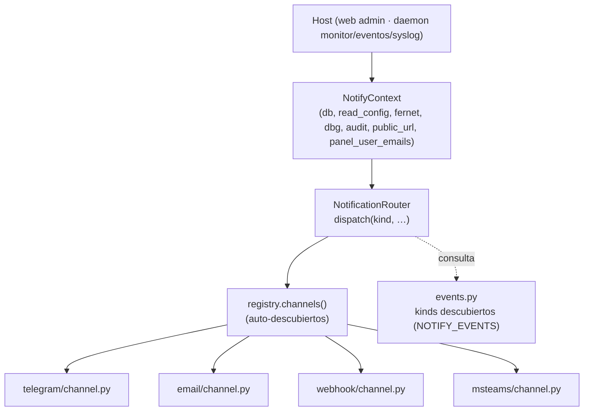
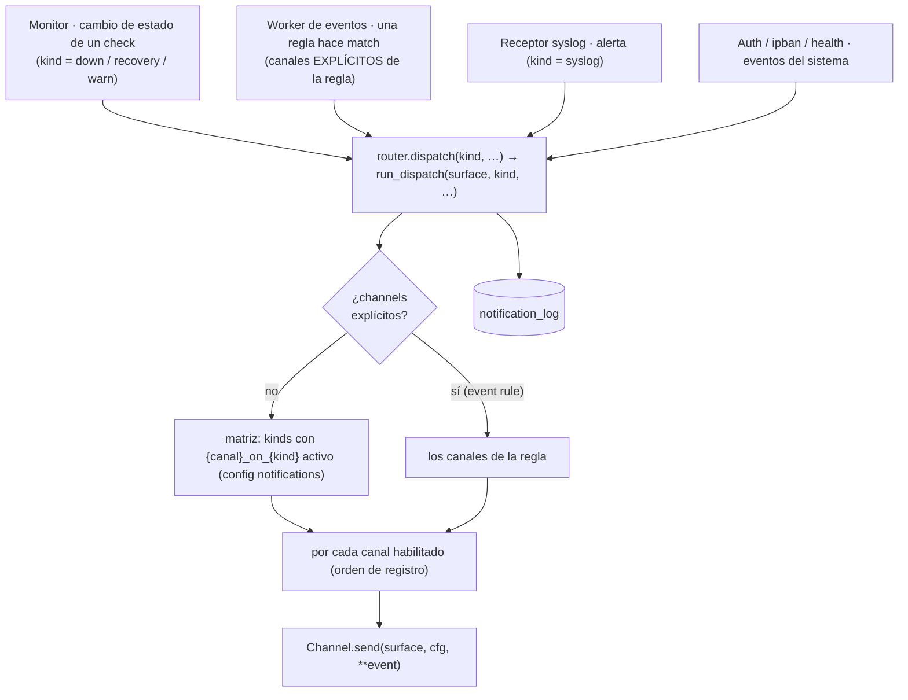
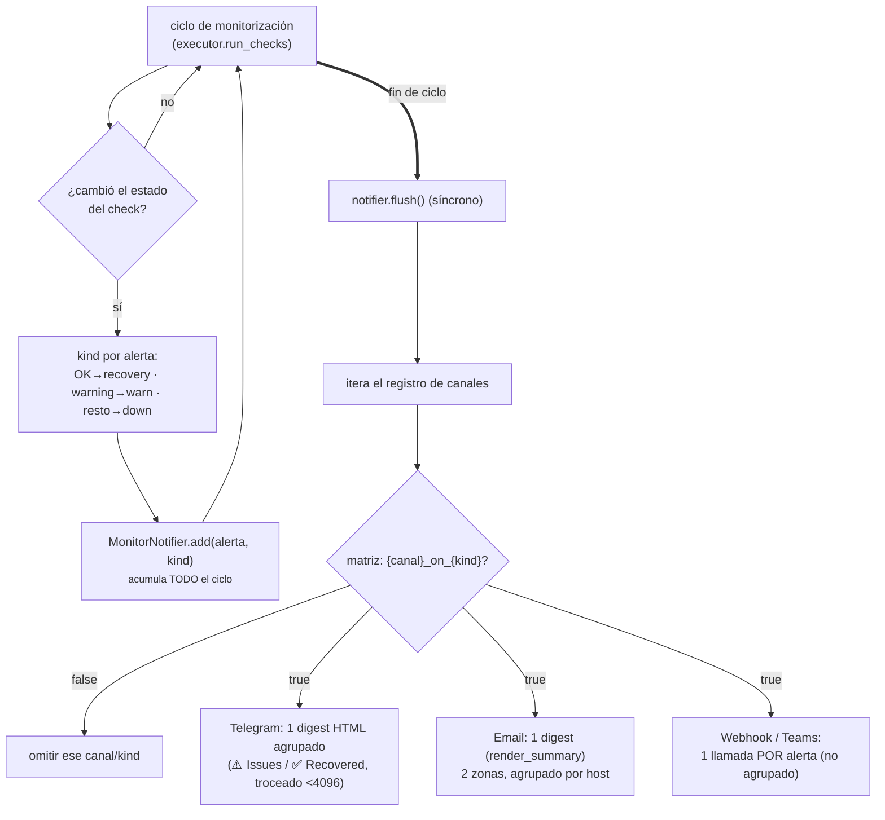
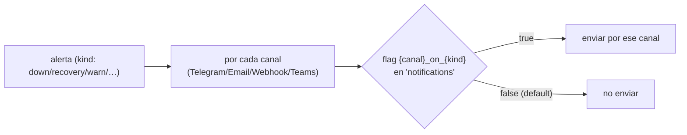
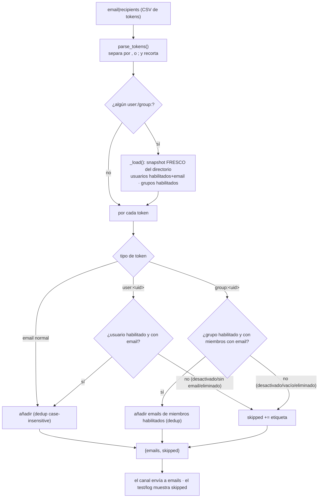

# Notificaciones

El subsistema de notificaciones (`lib/core/notify`, **sin Flask** y **sin dependencia de
`web_admin`**) es la capa de **entrega**: dado un evento, lo enruta a los canales
configurados — **Telegram**, **Email**, **Webhook** y **Microsoft Teams**. Lo usan el
monitor, el worker de eventos, el receptor syslog, la autenticación, el ipban y la
auto-monitorización de la plataforma (`lib/core/health`), y también corre en los procesos
de fondo (daemons); por eso vive en la librería general y no bajo el web.

Este documento cubre la **arquitectura** (contexto → router → registros de canales y de
eventos), el **flujo** evento→dispatch→canal, la **matriz de routing**, las
particularidades de cada canal, la **severidad warning**, y — en detalle — el sistema de
**textos/plantillas de notificación**: cómo se resuelven (custom→i18n), cómo se **generan
los listados** editables, y el **esquema de tags** de cada texto.

> La **generación** de eventos (worker que drena syslog/audit, reglas, cooldown) está en
> [explica-arquitectura.md → Procesamiento de Eventos](explica-arquitectura.md#procesamiento-de-eventos-notificaciones)
> y el servicio en [explica-servicios.md](explica-servicios.md). Aquí se documenta lo que pasa **a partir**
> de `dispatch()`.

---

## Arquitectura: contexto → router → registros

La entrega se articula sobre cuatro piezas, todas en `lib/core/notify`:

| Pieza | Fichero | Rol |
|---|---|---|
| **`NotifyContext`** | `context.py` | Bundle explícito de colaboradores que el router necesita de su host — **valores/callables planos**, nunca Flask ni el web admin: `db` (conector para los stores de canal), `read_config` (`() -> dict`), `fernet` (cifra secretos en reposo), `dbg`, `audit`, `public_url`, `panel_user_emails`. |
| **`NotificationRouter`** | `router.py` | **Posee** los stores de canal y **es** el routing. Se construye a partir de un `NotifyContext`; expone `dispatch(kind, …)`. Es también la "superficie" a la que los canales llaman de vuelta (`_read_config_file`, `_config_section`, `store(key, factory)`, `_panel_user_emails`, `public_base_url`…). No sabe que Flask existe. |
| **Registro de canales** | `registry.py` | Qué canales existen. Cada canal es un `Channel(name, send, flush)` que **se auto-registra** al importarse. `load_builtin_channels()` **descubre** todos los `lib/core/notify/<name>/channel.py` (orden estable, alfabético) e importa; no hay lista central. |
| **Registro de eventos** | `events.py` | Qué se puede notificar (los *kinds*). Cada dominio declara un `notify_events.py` con `NOTIFY_EVENTS`; `discover_events()` escanea `lib.core.*`, `lib.services.*`, `lib.providers.*` y los recolecta. |

La idea central: **cada host construye un `NotifyContext` desde su propia superficie y crea
un router**; todo subsistema notifica **a través de ese router** en vez de cablear canales.
El router es el único sitio donde se registran y despachan los canales, y es
**agnóstico de canal** — un canal que necesita persistencia pide su store con
`router.store(key, factory)`, así el código específico vive en el paquete del canal, no en
el router.



### El shim legacy `dispatch(wa, kind, …)`

`lib/core/notify/notification_dispatcher.py` mantiene compatibles las llamadas antiguas
`dispatch(wa, kind, …)`: enruta a través del router del host (`wa._notify`) si existe, o
—para un host legacy que solo expone la superficie de canal— corre la **misma** lógica
(`run_dispatch`) contra esa superficie. Devuelve `{canal: (ok, mensaje)}`. Es un shim de
migración; el punto de entrada real es `router.dispatch()` / `run_dispatch(surface, …)`.

---

## Canales

Cada canal es un subpaquete `lib/core/notify/<canal>/` con un `channel.py` que declara un
`Channel(name, send, flush)` y se registra al importarse:

- **`send(router, cfg, **event) -> (ok, msg)`** — entrega **un** evento ahora. `cfg` es la
  config efectiva completa; el canal lee su propia sección. `event` lleva
  `kind/module/item/status/message/timestamp` (+ extras como `webhook_ids` que otros
  canales ignoran vía `**_extra`).
- **`flush(router, cfg, alerts, hostname, public_url) -> (ok, msg)`** — entrega las alertas
  de **un ciclo del monitor** ya filtradas para ese canal, agrupadas como el canal quiera
  (un digest, un mensaje por alerta…).

| Canal | Transporte | Config (sección) | `send` (evento suelto) | `flush` (ciclo del monitor) |
|---|---|---|---|---|
| **Telegram** | Bot API | `telegram` | mensaje **HTML** (icono + título traducido + target + cuerpo en cita) | líneas emoji; con `group_messages` → secciones ⚠️/✅ en tarjetas `<blockquote>`, troceadas bajo el tope de 4096 |
| **Email** | SMTP · Microsoft 365 (Graph) · Gmail | `email` | `render_alert` (una alerta) | `render_summary` (digest, dos zonas agrupadas por item) |
| **Webhook** | HTTP POST | `webhooks` (lista) | POST con plantilla + HMAC opcional | **una llamada por alerta** (eventos discretos), no agrupado |
| **Microsoft Teams** | Incoming Webhook · Graph · Bot Framework | `msteams` + `msteams_channels` (lista) | tarjeta (a canal) y/o directo a usuario | una llamada por alerta |

Añadir un canal = un nuevo `channel.py` que llame a `register_channel(...)`. Nada en el
router ni en el monitor cambia.

---

## Eventos (kinds) y su registro

Un **kind** es el valor que viaja en `dispatch(kind=…)` y la clave de la matriz de routing
`notifications|{canal}_on_{kind}`. Los kinds son **descubiertos**, no hardcodeados: cada
dominio declara un `notify_events.py` con una lista `NOTIFY_EVENTS`. Descriptor:

```python
{'key': 'down', 'source': 'monitoring', 'label_key': 'notif_event_down',
 'matrix': True, 'ui': True, 'order': 10}
```

- **`matrix`** — si `True`, genera columnas `{canal}_on_{key}` en la matriz (auto-routing).
  `matrix=False` marca una fuente que **no** auto-enruta (p.ej. `event`: las reglas eligen
  sus canales), pero se conoce como fuente.
- **`ui`** — si `False`, es un kind de matriz que se **oculta** de la UI de routing (se
  mantiene por compatibilidad de config aunque ya no tenga dispatcher activo, p.ej.
  `syslog`).
- **`source`** — dominio propietario (agrupa en la UI).

Kinds actuales (declarados en los `notify_events.py`):

| kind | source | `notify_events.py` | matrix / ui |
|---|---|---|---|
| `down`, `recovery`, `warn` | monitoring | `lib/services/monitoring` | ✓ / ✓ |
| `scheduler_started`, `scheduler_stopped` | monitoring | `lib/services/monitoring` | ✓ / ✓ |
| `manual_run` | manual | `lib/services/monitoring` | ✓ / ✓ |
| `ipban_banned`, `ipban_unbanned` | ipban | `lib/services/ipban` | ✓ / ✓ |
| `service_down`, `service_up` | services | `lib/core/health` | ✓ / ✓ |
| `cert_expiring` | certs | `lib/core/health` | ✓ / ✓ |
| `syslog` | syslog | `lib/services/syslog` | ✓ / **✗** (sustituido por reglas de Event) |
| `event` | events | `lib/services/events` | **✗** / ✓ (las reglas eligen canales) |

`events()` devuelve todos deduplicados y ordenados por `order`; `matrix_events()` los que
generan matriz; `ui_matrix_events()` los que además se muestran como filas en la UI.

> Fíjate: la auto-monitorización de la plataforma (`lib/core/health`) publica
> `service_down`/`service_up` (crash del daemon de un servicio) y `cert_expiring`; sus
> evaluadores de fondo (`health.py`, `cert_scan.py`) usan la misma matriz.

---

## Flujo: quién dispara → dispatch → canales



- **Selección de canales por defecto** → la matriz: se envía por cada canal cuyo flag
  `{canal}_on_{kind}` esté activo.
- **Selección explícita** (`channels=[…]`) → la usa el **gestor de reglas de eventos**:
  cada regla elige sus propios canales e **ignora** la matriz global.
- **`webhook_ids`** → restringe el canal webhook a destinos concretos (vacío → todos).
- El resultado `{canal: (ok, mensaje)}` se registra en `notification_log`.

---

## El monitor: notificación agrupada por ciclo (`MonitorNotifier`)

A diferencia del worker de eventos / syslog / auth —que llaman a `dispatch()` **una vez por
evento**—, el monitor acumula todos los cambios de estado de un ciclo en un
**`MonitorNotifier`** (`lib/core/notify/monitor_notifier.py`) y al final del ciclo hace **un
único flush agrupado por canal**, iterando el **registro de canales** y llamando al `flush`
de cada uno, enrutado por la misma matriz (`{canal}_on_{kind}`):

- **Telegram** — HTML. Con `telegram|group_messages` activo → secciones **⚠️ Issues**
  (down/warn) y **✅ Recovered** (recovery), ordenadas por item, cada alerta como una tarjeta
  `<blockquote>`, más un **resumen** con enlace a `/status`; troceado bajo el tope de 4096.
  Sin agrupar → una línea por alerta.
- **Email** — **un digest** (`render_summary`) con esas dos zonas, cada una en una tabla
  agrupada por item (todas las filas de un host juntas).
- **Webhook / Teams** — **una llamada por alerta** (eventos discretos), no agrupado.

Detalles:

- **`route_kind`** — cuando se fija (p.ej. un **"Run all"** on-demand del Status), el flush
  completo enruta como **un** único kind (`manual_run`) en vez de por-kind; su digest sigue
  mostrando los estados reales down/recovery/warn.
- **Kind por alerta**: check OK → `recovery`; fallo con severidad `warning` → `warn`; resto
  → `down` (ver [Severidad warning](#severidad-warning)).
- **Sin hilo de fondo**: el flush es **síncrono**; el antiguo cliente Telegram con
  cola/hilo (`lib.providers.telegram.Telegram` / `pool_run`) ya no lo usa el monitor.



> `route_kind` (p.ej. **"Run all"** on-demand → `manual_run`) hace que el flush completo
> enrute como **un** único kind; el digest sigue mostrando los estados reales.

---

## Matriz de routing (`notifications`)

Un flag `bool` por **(canal × kind)** de los kinds con `matrix=True`; solo se envía por el
canal si su flag está activo. **Las claves se generan** del registro de eventos
(`{canal}_on_{kind}`), no están hardcodeadas — añadir un kind con `matrix=True` crea sus
columnas automáticamente. Todos por defecto `false`. Editable en *Config → Notificaciones →
Routing*.

| | `down` | `recovery` | `warn` | … (resto de kinds de matriz) |
|---|---|---|---|---|
| **Telegram** | `telegram_on_down` | `telegram_on_recovery` | `telegram_on_warn` | `telegram_on_<kind>` |
| **Email** | `email_on_down` | `email_on_recovery` | `email_on_warn` | `email_on_<kind>` |
| **Webhook** | `webhook_on_down` | `webhook_on_recovery` | `webhook_on_warn` | `webhook_on_<kind>` |
| **Teams** | `msteams_on_down` | `msteams_on_recovery` | `msteams_on_warn` | `msteams_on_<kind>` |



Las **reglas de eventos** NO usan esta matriz: cada regla lleva su propia lista de canales
(ver el gestor de eventos en [explica-servicios.md](explica-servicios.md)).
Detalle de las claves en
[ref-configuracion.md → notifications](ref-configuracion.md#sección-notifications-matriz-de-routing).

---

## Severidad warning

Un check no es solo OK/DOWN: un umbral **blando** (CPU alta, memoria, certificado cercano a
caducar, etc.) emite severidad `warning`, que el monitor mapea a kind **`warn`** (ámbar), no
`down` (rojo):

- **Emisor**: `lib/services/monitoring/monitor.py::Monitor._alert_kind(status, severity)` →
  `warn` si `severity == 'warning'`, si no `down`. `send_message(..., severity=…)` propaga la
  severidad.
- **Módulos**: pasan `severity='warning'` en la ruta ad-hoc (`send_message`) o
  `ReturnModuleCheck.set(..., severity='warning')` en la estructurada, cuando el fallo es una
  advertencia y no una caída (p.ej. certificado caducando emite `warn`; **certificado ya
  caducado sí es `down`**).
- **Routing**: `warn` es un kind de matriz propio (`{canal}_on_warn`).
- **UI**: Status, Overview (badge de `modules_list`, stat card CHECKS) y los widgets pintan
  el warning en ámbar; los widgets de Overview tienen filtro de severidad con operador
  `=`/`≥` y un `+mantenimiento` opcional.

---

## Particularidades por canal

### Telegram — HTML

`lib/core/notify/telegram/notify.py` (evento suelto) y `telegram/channel.py` (flush del
monitor) construyen mensajes en **HTML** (`parse_mode='HTML'`), no texto plano ni Markdown:
solo `& < >` necesitan escaparse (se hace por campo con `html.escape`), mientras que el
Markdown se rompía con el texto de los módulos (`pch_cannonlake`, `*PVE02*`). El evento
suelto lleva icono + **título traducido** (`event_title`, ver abajo), el target como
`<code>`, el cuerpo en `<blockquote>` y el timestamp en `<i>`.

### Email — SMTP / Microsoft 365 / Gmail + plantillas HTML

`lib/core/notify/email/notify.py` soporta tres transportes: **SMTP** genérico,
**Microsoft 365** (vía Graph, `lib/providers/entraid/mail.py`) y **Gmail**. El cuerpo se
construye con **plantillas HTML** (`lib/core/notify/email/templates.py`): `render_alert`
(una alerta), `render_summary` (digest agrupado) y `render_test`. Estilos inline (compatibles
con clientes de correo); strings traducibles y personalizables (ver
[Sistema de textos](#sistema-de-textos-de-notificación-plantillas-listados-y-tags)).

> **Microsoft 365 — asistente "Registrar en Azure".** El proveedor M365 reutiliza el mismo
> wizard Device Code Flow que el SSO (`showEntraIdProvisionWizard`) para registrar una app
> en Entra ID con el permiso de aplicación **`Mail.Send`** y rellenar
> `ms365_tenant_id`/`ms365_client_id`/`ms365_client_secret` (el secreto cifrado). Solo hay
> que indicar el remitente (`from_email`). Detalle en [caso-entra-id.md](caso-entra-id.md).

#### Resolución de destinatarios (usuarios y grupos → emails)

El campo de destinatarios (`email|recipients`, y también `msteams|recipients`) **no** guarda solo
direcciones: guarda **tokens**, y la lista real de emails se resuelve **en el momento de enviar**
contra el directorio vivo. Esto permite dirigir avisos a "el grupo Operaciones" sin mantener
manualmente una lista de correos.

**Formas de token** (string CSV; también acepta `;`):

| Token | Se resuelve a |
|---|---|
| `alguien@dominio.com` | esa dirección, tal cual |
| `user:<uid>` | el email **actual** de ese usuario del panel |
| `group:<uid>` | los emails de los **miembros habilitados** de ese grupo |

**Flujo end-to-end:**

1. **UI (edición)** — el campo es de **chips** con autocompletado (`suggest:'recipients'` en
   `build_config_schema()`) que sugiere **usuarios** y **grupos** activos vía
   `GET /api/v1/notify/recipients/suggest` (gate `config_edit`). Al elegir uno se inserta el token
   `user:<uid>`/`group:<uid>`; también puedes escribir un email suelto. Se persiste como string CSV.
2. **Envío** — el canal email pide el resolver al router (`router.store('recipients', lambda ctx:
   RecipientResolver(ctx.db))`, en `lib/core/notify/recipients.py`). Al vivir sobre el conector de
   BD compartido, **funciona igual en el panel web y en el proceso monitor**.
3. **`RecipientResolver.expand(raw)`** — tokeniza, y **solo si hay algún `user:`/`group:`** carga un
   snapshot **fresco** del directorio (`UsersStore`/`GroupsStore`) para que desactivar/editar surta
   efecto **inmediato**. Resuelve token a token, **deduplica** (case-insensitive, conservando el
   orden) y devuelve `{'emails': [...], 'skipped': [...]}`.
4. **Validación / omisiones** — un token que no aporta a nadie se acumula en `skipped` con una
   **etiqueta legible** (nombre del usuario/grupo; si fue eliminado, su uid). El canal **envía a
   `emails`** y el resultado del **test** de email (y el log) **muestra los `skipped`** para avisar.



**Estado del directorio (desactivar / eliminar)** — como la resolución es por token contra el
directorio vivo, el efecto es inmediato sin editar la config:

* **Usuario desactivado / sin email / eliminado** → `user:<uid>` no aporta email (se **omite**).
* **Grupo desactivado / vacío / eliminado** → `group:<uid>` no expande (se **omite**); un grupo
  activo solo aporta los emails de sus miembros **habilitados con email**.
* En la UI, el chip de un usuario/grupo que ya no está activo se muestra como *"usuario/grupo
  desconocido"* (el endpoint de sugerencias solo lista los activos), señal de que hay que quitarlo.

> El catálogo de grupos/usuarios y qué significa "habilitado" están en
> [ref-permisos.md](ref-permisos.md) y [ref-esquema-bd.md](ref-esquema-bd.md); el endpoint de
> sugerencias, en [ref-api.md](ref-api.md#notificaciones--canales).

### Webhook — HMAC + plantilla + múltiples destinos

Los webhooks son una **lista** (cada uno con URL, método, headers, timeout), no un campo
`sección|campo`; viven en su tabla (`webhooks`, `lib/core/notify/webhook/store.py`) con CRUD
propia.

- **Firma HMAC** (opcional): con `secret`, se firma el cuerpo y se envía en el header
  `secret_header` (por defecto `X-Signature`).
- **Plantilla de cuerpo** (`body_template`): JSON del POST con variables `{kind}`,
  `{module}`, `{item}`, `{status}`, `{message}`, `{timestamp}`.
- **Destinos concretos**: `dispatch(..., webhook_ids=[…])` limita a webhooks específicos.

### Microsoft Teams — a canal o a usuarios

El canal Teams (`lib/core/notify/msteams/`) es **un canal lógico** en la matriz
(`notifications|msteams_on_*`) con **dos tipos de destino** que conviven:

**(a) A canal — Incoming Webhook.** Destinos en su tabla (`msteams_channels`, CRUD en
`/api/v1/notify/msteams/channels*`; la URL se cifra en reposo). Cada alerta va como
**MessageCard** (color por tipo) a cada canal habilitado.

**(b) A usuarios — directo (sección `msteams`).** `user_enabled` + un **mecanismo**:

| Mecanismo (`msteams.delivery`) | Cómo | Requisitos |
|---|---|---|
| `activity_feed` | Graph `sendActivityNotification` (permiso **`TeamsActivity.Send`**) | App-registration Entra (wizard) **y** una **app de Teams instalada** para el usuario; solo salida. Botón **"Descargar app de Teams"** genera el paquete (`manifest.json` + iconos). |
| `bot` | **Bot Framework** proactivo 1:1, usando la *conversation reference* capturada en `/auth/msteams/messages` | **Azure Bot** + **endpoint HTTPS público** + el usuario inicia el bot una vez + **PyJWT** (validación del JWT; sin él el endpoint responde 501). |

Destinatarios (ambos): la lista `msteams.recipients` (UPN/email) y/o los **usuarios del
panel** (`notify_panel_users`, resueltos por email). El endpoint inbound del bot es público
(exento de login/CSRF) pero exige un JWT válido con `audience` == app id del bot.

> **Nota.** El modo `bot` es **opcional** y su endpoint público solo es viable si el
> despliegue expone ServiceSentry a Internet. Para despliegues internos, usa `activity_feed`
> (solo salida) o el envío a canal. Detalle del wizard Entra en [caso-entra-id.md](caso-entra-id.md).

---

## Sistema de textos de notificación: plantillas, listados y tags

Todo texto de una notificación (título de evento, cuerpos del core, estados, strings de
email, y los mensajes de **cada módulo**) es **traducible** e **personalizable por el admin
por idioma**, con la misma regla en todas partes:

> **texto custom del admin si existe → si no, i18n (idioma de notificación) → si no, la key.**

Esto tiene tres partes: la **capa de resolución** (qué texto sale en runtime), el
**catálogo/descubrimiento** (cómo se generan los listados editables) y el **esquema de tags**
(qué placeholder acepta cada texto).

### Idioma de notificación

Una notificación **no tiene contexto de usuario** pero **sí de sistema**, y el sistema puede
estar en varios idiomas. El idioma efectivo lo resuelve
`formatting.notify_lang(cfg)`:

```
notifications|lang  →  web_admin|lang  →  ''
```

`notifications|lang` es un ajuste **global** (Config → Notificaciones → **General**), con una
opción "— Default —" y la lista de idiomas mostrada **traducida**.

### 1) Capa de resolución (`lib/core/notify/formatting.py`)

| Función | Qué hace |
|---|---|
| `notify_text(cfg, lang, key, *args)` | Texto de una **key i18n del core**: override `notif_text_overrides[lang]['core:'+key]` si existe, si no `translate(lang, key)`; rellena placeholders con `*args`. |
| `text_override(cfg, lang, scoped_key)` | El texto custom del admin para un *scoped key* en *lang*, o `''`. |
| `event_title(kind, lang, cfg)` | **Título** localizado de un kind: mapea `kind → notif_event_*` (`EVENT_LABEL_KEY`) y resuelve por `notify_text` (override→i18n→key prettificada). Los mismos `notif_event_*` que muestra la UI de la matriz, así el título de un mensaje y su fila de la grid nunca divergen. |
| `event_icon(kind)` | Emoji por kind (`EVENT_ICON`, campana si desconocido). |
| `notify_lang(cfg)` | Idioma efectivo (arriba). |
| `_fill(text, args)` | Rellena placeholders; soporta `{}` secuencial e indexado `{0}`/`{1}` (reordenables). Detalle en [ref-i18n.md → Placeholders](ref-i18n.md#placeholders-secuencial-vs-indexado-_fill). |
| `plain(text)` | Quita la decoración Markdown de un mensaje de módulo (`*`, `\[`) para email/webhook/tarjetas. |

**Módulos** — `lib/modules/module_base.py::ModuleBase._msg(key, *args)`: resuelve el override
`mod:<módulo>:<key>` → si no, la sección `messages` del `lang/<lang>.json` del módulo (idioma
pedido → idioma por defecto) → si no, la key; usa el mismo `_fill`. El idioma sale de
`self._monitor.config.data` (cacheado en `_MODULE_MSG_CACHE`).

**Almacenamiento** (en la config, como *feature-data*, no como config editable normal):

```jsonc
"notif_text_overrides": {                 // core + módulos (claves con ámbito core:/mod:)
  "es_ES": {
    "core:notif_msg_auth_login": "…",
    "mod:ups:ups_reason_status": "…"
  }
},
"notif_templates":      { "es_ES": { "alert_down": "…" } },  // strings de EMAIL (store propio)
"notif_html_templates": { "alert": { "es_ES": "<!DOCTYPE …>" } }  // cuerpos HTML de email
```

Email conserva su **store propio** (`notif_templates`) por historia; core/módulos usan
`notif_text_overrides`. El endpoint unificado reparte cada clave a su store según el prefijo.
El significado de cada *scoped key* (`core:<i18n_key>`, `mod:<módulo>:<msg_key>`) y cómo se
resuelve se explica en
[explica-i18n.md → Overrides de administrador](explica-i18n.md#overrides-de-administrador).

### 2) El catálogo: cómo se generan los listados (`lib/core/notify/text_catalog.py`)

`discover_text_packages(lang, *, overrides, email_overrides, modules_dir)` descubre **todos
los paquetes de texto editables** para un idioma. Un **paquete** es un grupo de strings; cada
**entrada** lleva su `default` (i18n del idioma pedido, con fallback al idioma por defecto), el
`custom` actual del admin, y su esquema de `vars` (tags):

| Paquete (`id`) | grupo | Origen | Cómo se recolecta |
|---|---|---|---|
| `core.events` | core | i18n `notif_event_*` | prefijo `notif_event_` |
| `core.messages` | core | i18n `notif_msg_*` | prefijo `notif_msg_` |
| `core.statuses` | core | i18n `notif_status_*` + `notif_auth_*` + `notif_source_*` | prefijos combinados |
| `core.email` | core | `email/templates.py::_DEFAULT_STRINGS` (defaults) + overlay `email_tpl` por idioma; overrides desde `notif_templates` | claves de `_DEFAULT_STRINGS` |
| `mod.<módulo>` | modules | sección `messages` del `lang/<lang>.json` de cada watchful | un paquete por módulo con `messages` |

`_CORE_GROUPS` define los prefijos de los temas core. La recolección core **solo incluye
entradas de tipo string** — descarta claves meta como `notif_msg_vars` (un dict de nombres de
tag) que comparten prefijo pero no son texto de usuario. El scoped key de cada entrada es su
id estable: `core:<i18n_key>`, `email:<string_key>` o `mod:<módulo>:<key>`.

Forma de cada entrada:

```jsonc
{ "key": "core:notif_msg_auth_login",   // scoped key (id de override)
  "label": "notif_msg_auth_login",       // la i18n key (columna izquierda)
  "default": "{} signed in via {} from {}",
  "custom": "",                          // override actual del admin (vacío = usa default)
  "vars": [ {"i":0,"name":"user","ph":"{0}"}, … ] }  // esquema de tags (ver §3)
```

### 3) El esquema de tags (info por placeholder)

Cada texto que recibe valores dinámicos declara **qué representa cada placeholder**, en el
propio idioma (traducible), para que el editor muestre chips con nombre. Los esquemas son
**datos**, no código, y viven junto a las traducciones: `notif_msg_vars` y `notif_email_vars`
(core) y `messages_vars` (por módulo). La tabla comparativa con sus formas y ubicaciones está
en [ref-i18n.md → Los tres esquemas de tags](ref-i18n.md#los-tres-esquemas-de-tags).

Para `notif_msg_vars` y `messages_vars`, el catálogo convierte la lista de nombres en
`{'i': i, 'name': n, 'ph': '{i}'}` (placeholder posicional numerado). Para `notif_email_vars`,
cada par `[token, descripción]` da `{'ph': token, 'name': descripción}` (placeholder con
nombre, autodescriptivo).

Un texto con placeholders **debe** tener su esquema con el **mismo número de tags** que
placeholders tiene el string, en **ambos** idiomas. (Un módulo declara sus tags en su propio
`messages_vars`; así el sistema los descubre sin tocar el core.)

**Qué placeholders sustituye realmente el email:** el motor de email no hace sustitución
genérica — cada string reemplaza **solo su token concreto**. Por eso `notif_email_vars` mapea
exactamente esos 4 casos y ninguno más: `alert_*`→`{item}`, `summary_many`→`{n}`,
`summary_ts`→`{ts}`, `test_body_1`→`{sender}`. El resto de strings de email son estáticos (no
llevan tags). Las variables de **runtime** disponibles al editar el **cuerpo HTML completo**
(distinto de los strings) son otras: `HTML_TPL_VARS` en `templates.py` (`test`:
`{sender_name}`; `alert`: `{kind}{module}{item}{status}{message}{timestamp}{public_url}`;
`summary`: `{n}{timestamp}{public_url}`).

### 4) El editor (UI) y sus endpoints

*Config → Notificaciones → **Templates*** contiene dos tarjetas **colapsables**:

**"Notification Texts"** (`partials/cfg/notify/_tpl_strings.html`) — editor unificado
data-driven:

- Selector de **idioma** + selector de **paquete** (optgroups **Core** / **Modules**).
- Una fila por entrada: la key (columna estrecha) + un **input-group** con el campo y 4
  botones: **undo** (recarga el último valor guardado sin recargar la página), **use-default**
  (escribe el default numerado para editarlo), **copy** y **clean** (vacía → revierte a i18n).
- Debajo, **chips** por cada tag (`vars`) que se **insertan** en el cursor; el default de
  fondo se muestra con los placeholders **numerados** (`{}` → `{0}`, `{1}`) para dejar claro
  el orden y permitir reordenarlos. Un chip con placeholder autodescriptivo (`{item}`) no
  repite el nombre.
- **Guardar** hace un único `PUT` con todos los overrides del idioma (abarca todos los
  paquetes) y sincroniza el baseline de `undo`.

**"Custom HTML Body"** (`partials/cfg/notify/_tpl_html.html`) — editor del cuerpo HTML
completo del email por **Idioma → Tipo** (`test`/`alert`/`summary`), con la barra de
variables de `HTML_TPL_VARS` y preview en vivo.

Endpoints (`lib/core/notify/email/template_routes.py`):

| Método · ruta | Qué |
|---|---|
| `GET /api/v1/notify/text-packages?lang=` | Descubre los paquetes editables (core/módulos/email) con default + custom + tags. |
| `PUT /api/v1/notify/text-packages/<lang>` | Guarda todos los overrides del idioma. Body `{scoped_key: valor}` (valor vacío = revertir). `email:*` → `notif_templates`; `core:*`/`mod:*` → `notif_text_overrides`. |
| `GET /api/v1/notify/templates`, `PUT`/`DELETE /…/<lang>` | Strings de email legacy (defaults + overrides). |
| `GET /api/v1/notify/html-templates`, `…/<type>/built-in`, `POST …/<type>/preview`, `PUT`/`DELETE …/<type>/<lang>` | Cuerpos HTML de email (guardar/preview/built-in/borrar). Tipos válidos: `test`, `alert`, `summary`. |

Idioma y paridad de las claves i18n: ver [explica-i18n.md](explica-i18n.md).

---

## Dónde se configura y se prueba

- **Config** de cada canal + la matriz + el idioma de notificación:
  [ref-configuracion.md](ref-configuracion.md) (secciones `telegram`, `email`, `webhooks`, `msteams`,
  `notifications`).
- **UI y endpoints** (probar canal, gestionar webhooks/canales Teams, editar textos y cuerpos
  HTML): [explica-web-admin.md](explica-web-admin.md).
- **Reglas de evento** (qué eventos de audit/syslog notifican y por qué canales):
  [explica-arquitectura.md → Procesamiento de Eventos](explica-arquitectura.md#procesamiento-de-eventos-notificaciones)
  + el servicio `events` en [explica-servicios.md](explica-servicios.md).
- **Traducción y esquemas de tags**: [explica-i18n.md](explica-i18n.md).
