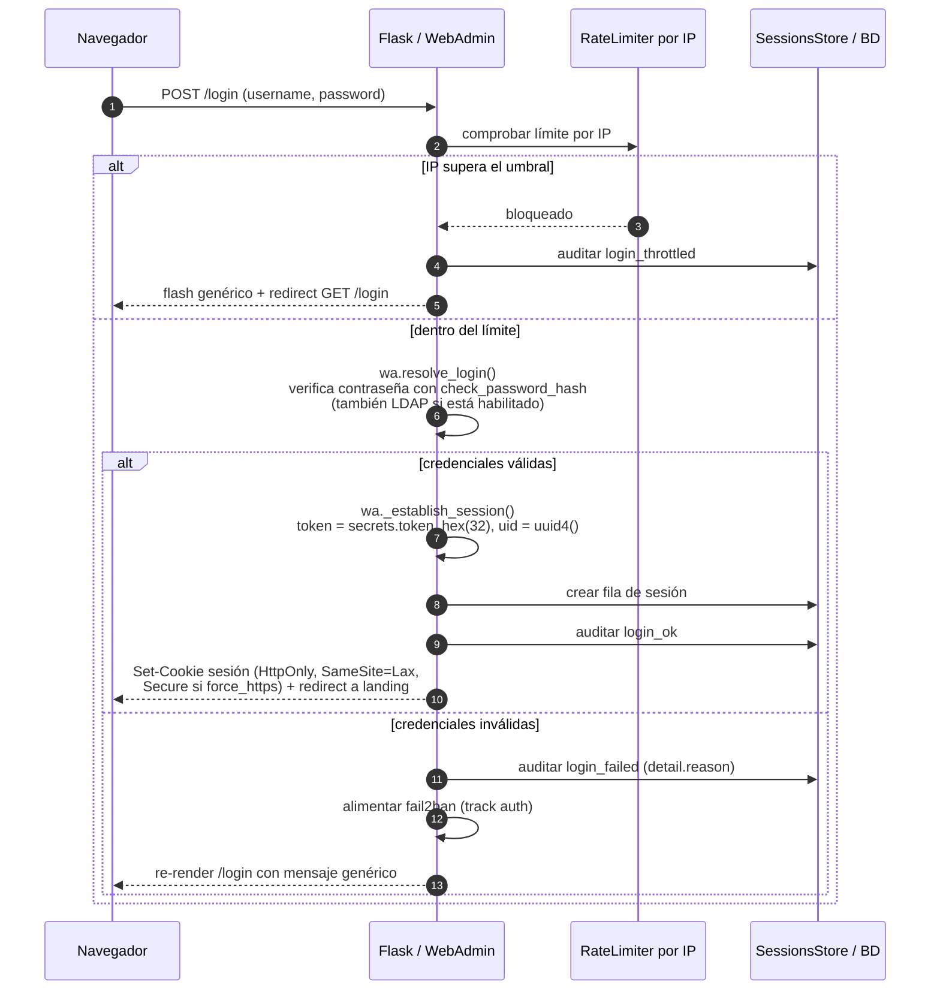
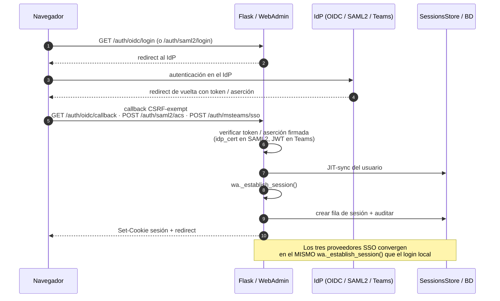
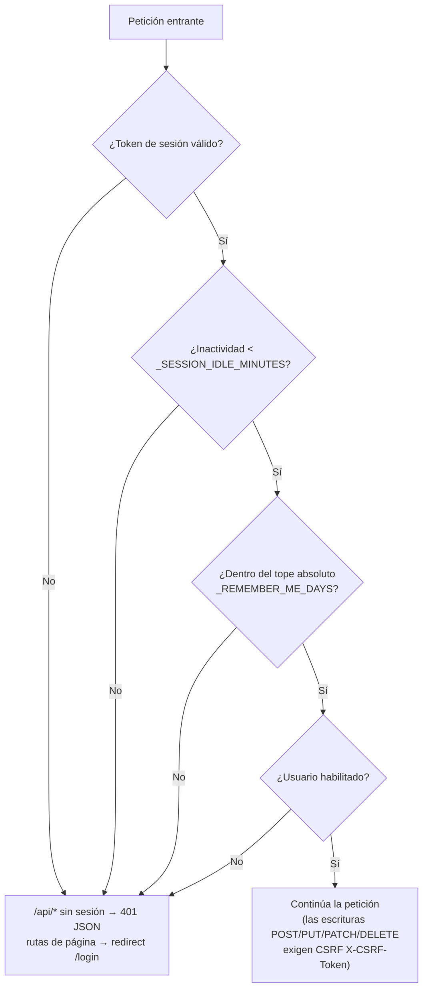

# Seguridad del Panel Web

Referencia completa de los mecanismos de seguridad implementados en la interfaz web de administración (`lib/web_admin`) y los tests que los verifican.

---

## Autenticación

### Flujo de login

1. `POST /login` recibe `username` + `password`.
2. Si **LDAP está habilitado** (`ldap.enabled = true`): se evalúa el campo `auth_source` del usuario en el **almacén de usuarios de la base de datos** (tabla `users` en `data.db`):
   - `auth_source: "ldap"` o usuario desconocido → autenticación contra LDAP primero.
   - `auth_source: "local"` → siempre autenticación local, LDAP ignorado.
   - Si LDAP falla por error de red y `fallback_to_local = true` → intenta autenticación local.
3. Se busca el usuario en el **almacén de usuarios de la base de datos**; si no existe o la contraseña es incorrecta → el **formulario muestra siempre "Invalid credentials"** (mensaje genérico — evita enumeración de usuarios). Si la cuenta existe pero está desactivada o bloqueada → **mismo mensaje genérico** (anti-enumeración). El motivo real se registra en el log de auditoría como `detail.reason`.
4. La contraseña se verifica con `werkzeug.security.check_password_hash` (**scrypt** por defecto en Werkzeug 3.x). El camino de autenticación está diseñado para tener **tiempo constante** con independencia de si el usuario existe (ver [Anti-enumeración por tiempo](#anti-enumeración-por-tiempo-timing)).
5. Si es correcta → se crea una entrada en el **registro de sesiones** del servidor (`_sessions`) con un token de 32 bytes aleatorios (64 hex) y se guarda en la cookie de sesión Flask.
6. El evento `login_ok` o `login_failed` se escribe en el **registro de auditoría**. En caso de fallo, el campo `detail.reason` almacena la clave i18n que describe la causa real (`user_not_found`, `account_disabled`, `account_locked`, `invalid_credentials`, `ldap_invalid_credentials`, `ldap_user_not_found` o `ldap_connection_error`). Los logins LDAP/OIDC exitosos incluyen `detail.auth_source`.
7. El login usa el patrón **POST / Redirect / GET**: en caso de fallo se usa `flash()` y se redirige al `GET /login`, evitando el diálogo de reenvío de formulario al pulsar F5.

### Anti-enumeración por tiempo (timing)

Un atacante no debe poder distinguir **"usuario no existe"** de **"contraseña incorrecta"** — ni por el mensaje (ya es genérico) ni por el **tiempo de respuesta**. Verificar un hash scrypt cuesta ~200 ms; si ese cálculo solo ocurriera para usuarios existentes, un usuario válido respondería mucho más lento que uno inexistente, revelando qué cuentas existen (enumeración por *timing*). `_authenticate` (`lib/web_admin/app.py`) lo evita ejecutando **siempre el mismo trabajo criptográfico**:

- **Usuario inexistente** → se ejecuta igualmente `check_password_hash` contra un **hash señuelo**. El señuelo **no es un hash generado aparte** (podría llevar parámetros de coste distintos y volver a delatar), sino el `password_hash` de un **usuario local real** del almacén, de modo que el coste de verificación **coincide exactamente** con el de una cuenta existente.
- **Cuenta deshabilitada** → también ejecuta el hash antes de devolver el motivo, para no ser más rápida que una contraseña incorrecta.
- **Contadores de intentos fallidos en memoria** → el incremento del contador de bloqueo **no** hace escritura en base de datos por intento (`_persist_users` solo se llama al bloquear/expirar/acertar). Una escritura en BD por intento fallido añadía ~200 ms **solo** al camino del usuario existente, reintroduciendo el canal de *timing*; ahora el contador vive en memoria.

Resultado medido (estado limpio): `admin` (existe) ≈ usuario inexistente, dentro del ruido (p. ej. 191.8 ms vs 194.8 ms). El mensaje mostrado es idéntico (`invalid_credentials`) para inexistente, contraseña incorrecta, cuenta deshabilitada y cuenta bloqueada; el motivo real solo va al log de auditoría.

> Canal residual conocido: la primera petición sobre una cuenta con un **bloqueo ya expirado** ejecuta un `_persist_users` para limpiarlo (~200 ms). Solo afecta a cuentas recientemente bloqueadas — que el atacante ya sabe que existen (fue él quien las bloqueó) — por lo que no aporta información nueva.

### Límite de intentos por IP (rate-limiting)

Además del [bloqueo por cuenta](#bloqueo-de-cuenta-por-intentos-fallidos), hay un **límite por IP de origen** en `/login` (`lib/security/ratelimit.py` :: `RateLimiter`, ventana deslizante en memoria, thread-safe): tras `web_admin|login_ratelimit_max` intentos (por defecto **15**) dentro de `web_admin|login_ratelimit_window_secs` (por defecto **300 s**), la IP recibe `flash` genérico + redirección y se registra `login_throttled` en auditoría. Un login correcto **resetea** el contador de esa IP (usuarios legítimos tras un NAT no se penalizan). Esto frena el *password spraying* (una contraseña común probada contra muchos usuarios, que nunca dispara el bloqueo por-cuenta). El bloqueo por-cuenta usa **contadores en memoria** (el propio `request.remote_addr` no es falsificable salvo que `proxy_count` esté mal configurado — ver [Confianza de proxy](#confianza-de-proxy-e-ip-del-cliente-proxyfix)). Umbrales `0` = desactivado.

### Sesiones persistentes ("Remember me")

- El formulario de login incluye un checkbox `remember_me`.
- Si se activa, `session.permanent = True` (duración configurable).
- La `secret_key` de Flask se genera aleatoriamente la primera vez y se persiste en disco (`.flask_secret`); las instancias posteriores reutilizan la misma clave — las sesiones no se invalidan al reiniciar el proceso.

### Campo `auth_source` en usuarios

Cada usuario en el almacén de la base de datos (tabla `users`) tiene un campo `auth_source` que determina cómo se autentica:

| Valor | Significado |
| ----- | ----------- |
| `"local"` | Contraseña hash local; LDAP/OIDC nunca se aplican |
| `"ldap"` | Autenticado contra LDAP; no tiene `password_hash` |
| `"oidc"` | Autenticado mediante SSO OIDC; no tiene `password_hash` |
| `"saml2"` | Autenticado mediante SSO SAML2; no tiene `password_hash` |

Los usuarios locales llevan `auth_source: "local"`; los autenticados por LDAP/SSO toman el valor correspondiente al crearse o en el primer inicio de sesión.

### Tests de autenticación

| Test | Qué verifica |
|------|-------------|
| `test_root_redirects_to_login` | Ruta `/` redirige a `/login` sin sesión |
| `test_login_success` | Login correcto da acceso al dashboard |
| `test_login_wrong_password` | Contraseña incorrecta → redirección PRG a login + mensaje de error |
| `test_login_wrong_username` | Usuario inexistente → mismo mensaje genérico (sin enumerar) |
| `test_login_empty_fields` | Credenciales vacías → rechazado |
| `test_login_account_disabled` | Cuenta desactivada → mensaje específico "account disabled" |
| `test_login_uses_post_redirect_get` | Login fallido → 302 redirect (PRG), no render directo |
| `test_logout` | Logout invalida la sesión; rutas protegidas redirigen a login |
| `test_login_with_remember_me` | `remember_me` marca la sesión como permanente |
| `test_secret_key_persisted` | La `secret_key` se escribe en disco al crear la instancia |
| `test_secret_key_reused` | Una segunda instancia reutiliza la clave existente |

### Bloqueo de cuenta por intentos fallidos

Tras `_LOCKOUT_MAX_ATTEMPTS` (por defecto **5**) intentos de login fallidos con la contraseña incorrecta, la cuenta queda bloqueada durante `_LOCKOUT_DURATION_SECS` (por defecto **900 s = 15 min**). Mientras está bloqueada, incluso la contraseña correcta es rechazada. El mensaje mostrado al usuario es siempre el genérico "Invalid credentials" para no revelar que la cuenta existe y está bloqueada (anti-enumeración). El log de auditoría sí registra `reason: 'account_locked'`.

Configuración en `config.json → web_admin`:

| Campo                   | Por defecto | Descripción                                                     |
|-------------------------|-------------|----------------------------------------------------------------- |
| `lockout_max_attempts`  | `5`         | Intentos fallidos antes del bloqueo. `0` desactiva el bloqueo.  |
| `lockout_duration_secs` | `900`       | Duración del bloqueo en segundos (60–86400).                    |

El **contador** de intentos fallidos (`_failed_attempts`) se mantiene **en memoria** — no se escribe en la base de datos en cada intento — para no reintroducir el [canal de *timing*](#anti-enumeración-por-tiempo-timing); solo se persiste `_locked_until` **al bloquear** (y se limpia al acertar o expirar). Estos campos no se exponen en `GET /api/v1/users`. Este bloqueo por-cuenta se complementa con el [límite por IP](#límite-de-intentos-por-ip-rate-limiting) contra el *password spraying*.

### Tests de bloqueo de cuenta

| Test | Qué verifica |
|------|-------------|
| `test_lockout_triggers_after_n_attempts` | Tras N intentos fallidos el mensaje menciona "locked" |
| `test_locked_account_rejects_correct_password` | Cuenta bloqueada rechaza la contraseña correcta |
| `test_lockout_returns_minutes_remaining` | El mensaje incluye los minutos restantes |
| `test_successful_login_resets_failed_attempts` | Login correcto limpia `_failed_attempts` y `_locked_until` |
| `test_lockout_disabled_when_max_attempts_zero` | Con `max_attempts=0` nunca se bloquea |
| `test_account_unlocks_after_duration` | Tras expirar el bloqueo, el login correcto funciona |
| `test_authenticate_returns_tuple` | `_authenticate()` devuelve siempre una 2-tupla |
| `test_authenticate_wrong_password_reason` | Contraseña incorrecta → `reason='invalid_credentials'` |
| `test_authenticate_unknown_user_reason` | Usuario inexistente → `reason='user_not_found'` |

---

## Flujo de autenticación

Todos los caminos de inicio de sesión (local, LDAP, OIDC, SAML2, Teams) convergen en un
**único punto**: `wa._establish_session()` (`lib/web_admin/mixins/auth.py`), que crea la fila
en `SessionsStore` con `token = secrets.token_hex(32)` (uid público = `uuid4()`), fija la cookie
de sesión (`HttpOnly`, `SameSite=Lax`, `Secure` si `force_https`/`secure_cookies`), audita el
login y redirige a la landing. Los endpoints concretos están en [ref-api.md](ref-api.md); el
alta completa del SSO con Microsoft Entra ID en [caso-entra-id.md](caso-entra-id.md).

### Login local (`POST /login`)



### Login SSO (OIDC / SAML2 / Teams)



### Validación por petición (`_check_session`)

En **cada** petición, `_check_session()` valida la sesión antes de ejecutar la ruta. Cualquier
comprobación fallida invalida la sesión y corta:



### Ejemplo

Bloque `oidc` **ilustrativo** en `config.json` (los valores reales dependen de tu IdP; el
`client_secret` se persiste cifrado con prefijo `enc:` — ver [Cifrado de Credenciales en
Disco](#cifrado-de-credenciales-en-disco)):

```json
{
  "oidc": {
    "enabled": true,
    "provider_url": "https://login.microsoftonline.com/<tenant-id>/v2.0",
    "issuer": "https://login.microsoftonline.com/<tenant-id>/v2.0",
    "client_id": "00000000-0000-0000-0000-000000000000",
    "client_secret": "enc:gAAAAABn...",
    "scopes": "openid profile email"
  }
}
```

Login local por `curl`, capturando la cookie de sesión y reutilizándola:

```bash
# 1) inicia sesión y guarda la cookie en cookies.txt
curl -i -c cookies.txt \
     --data-urlencode "username=admin" \
     --data-urlencode "password=TU_CONTRASEÑA" \
     https://tu-servidor/login

# 2) reutiliza la cookie en una llamada autenticada
curl -b cookies.txt https://tu-servidor/api/v1/me
```

> El alta completa del SSO (registro en Entra ID, provisioning por Graph, mapeo Grupos→Rol)
> está en [caso-entra-id.md](caso-entra-id.md); el catálogo de endpoints, en
> [ref-api.md](ref-api.md). El catálogo de permisos **no** se repite aquí — vive en
> [ref-permisos.md](ref-permisos.md); esta sección cubre solo la autenticación.

---

## fail2ban interno (bans de IP a nivel de servicio)

Un **fail2ban embebido** (`lib/services/ipban/jail.py` :: `IpBanManager`) banea IP de origen que acumulan ofensas — no solo login fallido, sino **cualquier acceso no autorizado** — y es **agnóstico al servicio**: además de la web, protege el [receptor syslog](#receptor-syslog-entrada-no-confiable) y cualquier futuro puerto expuesto. Es *thread-safe*, sin dependencias de framework, y su estado se persiste en la base de datos general (compartido entre procesos: web + syslog ven el mismo jail).

### Dos vías de ofensa (tracks)

Cada IP acumula ofensas en una **ventana deslizante**, en dos contadores independientes para no banear a un usuario autenticado que curiosea:

| Track   | Qué cuenta                                             | Umbral | Ventana |
|---------|--------------------------------------------------------|--------|---------|
| `auth`  | Login fallido, CSRF inválido, syslog no permitido…     | 10     | 600 s   |
| `authz` | Acceso a secciones sin permiso (403 de sesión válida)  | 30     | 600 s   |

Al cruzar un umbral, la IP entra en el **jail** por un tiempo **escalado** con cada reincidencia:

```text
1er ban 15 min → 2º 1 h → 3º 6 h → 4º 24 h → 5º y siguientes: permanente
```

Las IP en la [lista blanca](#lista-blanca-never-ban) nunca acumulan ofensas ni se banean (se cortocircuitan en la entrada). El *loopback* está siempre exento.

### Acción de bloqueo por servicio (service registry)

Cada servicio declara sus puertos y las **respuestas** que soporta (`lib/services/ipban/exposed.py`). Para una IP baneada:

| Servicio | Puertos                     | Acciones soportadas                    | Por defecto |
|----------|-----------------------------|----------------------------------------|-------------|
| `web`    | tcp:80/443 (tras proxy)     | `page` · `minimal` · `reject` · `json` | `page`      |
| `syslog` | udp/tcp:514, tcp:6514 (TLS) | `drop`                                 | `drop`      |

- `page` = página de error con estilo · `minimal` = error mínimo · `reject` = 403 · `json` = error JSON · `drop` = ni acepta la conexión (para UDP/TCP crudo de syslog).
- La acción se configura por servicio, y admite **override por-ban** (columna «Response» en la tabla de baneadas).

### Lista blanca (never-ban)

Tres fuentes se unen en el *allowlist* del manager: el *loopback*, la CSV programática `web_admin|ipban_whitelist` (env/config) y una **lista gestionada desde la UI** con descripción y autor, persistida en la tabla `ip_whitelist` (`lib/services/ipban/store/whitelist.py` — IP/CIDR normalizado, `description`, `created_at`, `created_by`). Añadir/quitar una entrada empuja el nuevo allowlist al jail en caliente.

### Historial de baneos (auditoría append-only)

Cada evento del ciclo de vida (`banned` / `escalated` / `unbanned`) se registra en `ip_ban_history` con motivo, categoría, nivel, intervalo, ofensas, autor y fecha — se conserva **aunque el ban expire** y desaparezca de la lista activa. Al **retirar un ban** la UI exige un **motivo**, que se guarda en el evento `unbanned`.

### Persistencia

Todo el estado vive en la BD general (tablas con `uid` como PK sintética, logs con `id` autoincremental):

| Tabla                  | Contenido                                             |
|------------------------|-------------------------------------------------------|
| `ip_bans`              | Jail activo (IP baneada + motivo, nivel, expiración)  |
| `ip_offense_counters`  | Contadores por `(ip, track)` en ventana               |
| `ip_offense_log`       | Registro de intentos por IP (para el modal de detalle)|
| `ip_service_action`    | Override de acción por servicio                       |
| `ip_ban_history`       | Historial de eventos ban/escalado/desban              |
| `ip_whitelist`         | Lista blanca gestionada (IP/CIDR + descripción)       |

El conteo **persistido** (no en memoria) sobrevive a reinicios y es correcto con múltiples microservicios; una caché de jail activo (`_active_jail`, TTL 3 s) evita golpear la BD en cada request.

### Configuración (`config.json → web_admin`)

| Campo                       | Por defecto           | Descripción                                          |
|-----------------------------|-----------------------|------------------------------------------------------|
| `ipban_enabled`             | `true`                | Interruptor maestro (`false` ⇒ nunca banea/bloquea). |
| `ipban_auth_threshold`      | `10`                  | Ofensas de la vía `auth` antes del ban (`0`=off).    |
| `ipban_auth_window_secs`    | `600`                 | Ventana de la vía `auth`.                            |
| `ipban_authz_threshold`     | `30`                  | Ofensas de la vía `authz` antes del ban (`0`=off).   |
| `ipban_authz_window_secs`   | `600`                 | Ventana de la vía `authz`.                           |
| `ipban_durations`           | `900,3600,21600,86400` | Escalera de duraciones (s), CSV.                    |
| `ipban_permanent_after`     | `4`                   | Nivel de ban a partir del cual es permanente (`0`=nunca). |
| `ipban_whitelist`           | `''`                  | IP/CIDR programáticos, nunca baneados (CSV).         |

La UI separa **configuración** (ajustes + «Servicios expuestos», en Config → fail2ban) de la **operativa** (sección de nivel superior con sub-pestañas IPs baneadas / Lista blanca / Historial). Ver [explica-web-admin.md → fail2ban](explica-web-admin.md#fail2ban-bans-de-ip).

### Registrado como servicio (pestaña Services)

fail2ban se registra como un **servicio embebido** más (`lib/services/ipban/`), igual que el monitor, el receptor syslog o el procesador de eventos. En la pestaña **Services** aparece con su **estado** (on/off), su **interruptor start/stop** (que conmuta `ipban_enabled` y lo persiste, reconfigurando el jail en caliente) y un **latido (heartbeat) por contenedor**: cada réplica publica su estado y sus contadores (baneadas / en vigilancia / lista blanca) en `service_instances`, así en microservicios se ve **qué pods están aplicando el jail**. A diferencia de los demás, no es un bucle de fondo sino un **gate en línea** en cada request; el start/stop no arranca un hilo, sino que activa/desactiva el interruptor maestro compartido.

Todo el código del servicio vive unificado en `lib/services/ipban/`: `jail.py` (`IpBanManager`, motor sin framework), `exposed.py` (registro de servicios expuestos + acciones de bloqueo), `manager.py` (`_IpBanMixin`, la cola Flask del host: gate + captura de ofensas) y `embedded.py` (superficie Services + heartbeat). La persistencia se agrupa en `lib/services/ipban/store/`, con **una clase y un archivo por tabla** (`bans.py`, `offense_counters.py`, `offense_log.py`, `service_actions.py`, `history.py`, `whitelist.py`) y una fachada `IpBanStore` (`store.py`) que los compone y coordina las operaciones cross-tabla (`clear_offenses`, `prune`). Los routes (`lib/services/ipban/routes.py`) y las plantillas siguen su ubicación estándar, como el resto de servicios.

---

## Autenticación Externa (LDAP / OIDC / SAML2)

> Esta sección describe el **flujo de login**. Para el **registro asistido de la app en
> Microsoft Entra ID** (asistente "Registrar en Azure", provisioning por Graph, mapeo
> Grupos→Rol y **limitaciones**), ver [caso-entra-id.md](caso-entra-id.md).

### LDAP / Active Directory

Cuando `ldap.enabled = true` y el paquete `ldap3` está instalado, el flujo de login de `POST /login` intenta autenticar contra LDAP antes de (o en lugar de) la verificación local, dependiendo del campo `auth_source` del usuario. Ver [Flujo de login](#flujo-de-login) para la lógica completa.

**Seguridad:**

- Las credenciales del usuario nunca se almacenan localmente; el bind LDAP es el único verificador.
- La contraseña de la cuenta de servicio (`bind_password`) se cifra en disco con Fernet.
- Los usuarios LDAP reciben `auth_source: "ldap"` y no tienen `password_hash` en el almacén de usuarios de la base de datos.
- El mapeo grupo → rol se recalcula en cada login para reflejar cambios en el directorio.

### OIDC / OAuth2

Cuando `oidc.enabled = true` y `authlib` está instalado, aparece el botón **Login with SSO** en `/login`. El flujo es:

1. `GET /auth/oidc/login` genera un `state` + `nonce` aleatorios (guardados en sesión Flask) y redirige al IdP.
2. El IdP redirige a `GET /auth/oidc/callback` con el `code` de autorización.
3. El servidor intercambia el code por tokens, verifica la firma del ID token y valida `state` y `nonce`.
4. Se extrae el username del claim configurado (`username_claim`), se sincroniza el usuario en el almacén de usuarios de la base de datos y se crea la sesión.

**Seguridad:**

- El `client_secret` se cifra en disco con Fernet.
- El `state` previene ataques CSRF en el callback.
- El `nonce` previene ataques de replay del ID token.
- Si `auto_create_users = false` y el usuario no existe previamente, el login es rechazado (403).

### SAML2 [alpha]

Cuando `saml2.enabled = true` y el paquete `pysaml2` está instalado, el flujo es:

1. `GET /auth/saml2/login` genera una `AuthnRequest` y redirige al IdP.
2. El IdP envía la aserción `SAMLResponse` (HTTP POST) a `POST /auth/saml2/acs`.
3. El servidor valida la firma y los atributos de la aserción.
4. Se extrae el username del atributo configurado (`username_attr`), se sincroniza el usuario en el almacén de usuarios de la base de datos con `auth_source: "saml2"` y se crea la sesión.
5. `GET /auth/saml2/metadata` expone el XML de metadatos para registrar la app en el IdP.

**Seguridad:**

- La **firma se exige y valida siempre** contra el certificado del IdP (`idp_cert`); una respuesta sin firma se rechaza y sin certificado configurado el flujo falla cerrado. `strict: true` activa toda la batería de validaciones (esquema XML, una sola aserción, `Conditions` NotBefore/NotOnOrAfter, `Audience` = SP entityId, `Issuer`, `Destination` = ACS, SubjectConfirmation Bearer/Recipient). **XXE** cerrado (parser endurecido de python3-saml) y defensas anti-XSW.
- **Endurecimiento de firma** (bloque `security` en `_build_saml_settings`): `wantAssertionsSigned = True` (se exige que la **aserción** esté firmada, no solo el sobre), `rejectDeprecatedAlgorithm = True` (**rechaza SHA-1**) y algoritmos fijados a **RSA-SHA256** (compatible con Entra por defecto).
- **Anti-replay:** `saml2_login` guarda el `request_id` de la `AuthnRequest` en la sesión y `saml2_acs` valida el **`InResponseTo`** de la respuesta contra él (`process_response(request_id=...)`) — bloquea respuestas no solicitadas / *login-CSRF*. Además, cada **id de aserción** validado se registra en una caché de **un solo uso** (TTL 10 min): una `SAMLResponse` capturada no puede reutilizarse dentro de su ventana `NotOnOrAfter`.
- Los usuarios SAML2 reciben `auth_source: "saml2"` y no tienen `password_hash`. El mapeo grupo → rol (tras validar la firma) funciona igual que en LDAP/OIDC.

### SCIM 2.0 (aprovisionamiento proactivo)

LDAP/OIDC/SAML2 crean el usuario **al primer login** (JIT). Con `scim.enabled` ServiceSentry
expone además `/scim/v2/*` para que el IdP **empuje** altas/cambios/bajas **antes** de que
entren (y baje al retirar la asignación). Detalles del flujo/endpoints en
[caso-entra-id.md](caso-entra-id.md) y [explica-web-admin.md](explica-web-admin.md).

**Seguridad:**

- Autenticación por **bearer token** (`scim.token`, cifrado en disco), comparado en
  **tiempo constante** (`hmac.compare_digest`); **independiente de la sesión web** (llamada
  servidor-a-servidor) y **exento de CSRF**. SCIM desactivado, token vacío/por debajo del
  mínimo (`web_admin|scim_min_token_len`, def. 16) o no coincidente → **401** (mensaje
  uniforme, no distingue "desactivado" de "token inválido").
- **Rate-limiting** de la autenticación bearer por IP (`web_admin|scim_ratelimit_max`
  / `web_admin|scim_ratelimit_window_secs`, def. 20/300 s): tras N fallos → **429** + `Retry-After`, y cada fallo se **audita**
  (`scim_auth_failed`) — SCIM no tiene bloqueo por-cuenta, así que este es el freno al
  *guessing* del token (que además es de 256 bits al generarse).
- **Solo toca lo que le pertenece** (evita escalada/lockout con solo el token):
  - Las mutaciones de **usuario** (PATCH/PUT/DELETE) exigen `auth_source == "scim"` — nunca
    puede borrar/deshabilitar cuentas locales/LDAP/OIDC/SAML2 (p. ej. el Administrator local).
  - Las escrituras de **grupo** rechazan (`403`) los grupos **integrados** (`_BUILTIN_GROUPS`,
    p. ej. Administrators) y cualquier grupo con `source != "scim"` — no se puede añadir un
    miembro al grupo admin ni vaciar/borrar el grupo admin.
  - `scim.default_role` **no puede** conceder el rol admin integrado (se degrada a *none*),
    evitando que el IdP aprovisione administradores en masa.
- **Límites anti-DoS:** tamaño de cuerpo (`MAX_CONTENT_LENGTH` 8 MiB), `count` acotado a 200 y
  lista de miembros por escritura acotada a `web_admin|scim_max_members` (def. 2000).
- Los usuarios se crean con `auth_source: "scim"` y **sin `password_hash`** (no pueden hacer
  login local); `active:false` los deshabilita (si `auto_disable`).
- **De-aprovisionamiento (desasignar en el IdP):**
  - **Usuario** → el IdP envía `active:false` → se **desactiva** (`enabled=false`), la cuenta y
    su historial se conservan.
  - **Grupo** → el IdP envía `DELETE` (el esquema *Group* de SCIM no tiene `active`) →
    **soft-delete**: el grupo se **desactiva** (`enabled=false`) pero se **conserva** con su
    mapeo grupo→rol y su membresía. Un grupo desactivado **no concede ninguno de sus roles**
    (los permisos comprueban `enabled`), así que el efecto es el mismo que una baja, sin
    perder la configuración del admin. Al **reasignar** el grupo, el IdP hace `POST` con el
    mismo `externalId` y el grupo se **reactiva** (mismo uid, roles intactos) en vez de crear
    un duplicado. El admin puede aún borrarlo definitivamente desde la UI.
- Toda operación se **audita** con actor **`system`** (acción automática, conservando la IP de
  origen del IdP): `scim_user_created/updated/deleted`, `scim_group_created/updated/deleted`.
  Las **actualizaciones** registran `detail.before`/`detail.after` **solo con los campos que
  cambiaron** (los no-op del IdP no generan entrada); crear/borrar guardan el snapshot completo.

### Tests de autenticación externa

| Archivo | Qué cubre |
| ------- | --------- |
| `test_providers_ldap.py` | Autenticación LDAP correcta, credenciales incorrectas, servidor caído, fallback a local, sincronización de usuario, mapeo de grupos, `allow_email_login` |
| `test_wa_scim.py` | Bearer token (desactivado/ausente/erróneo → 401), CRUD de usuarios SCIM (crear/filtrar/leer/PATCH active/borrar), grupos SCIM (crear con miembros, quitar miembro, borrar desvincula) |
| `test_providers_oidc.py` | Callback OIDC correcto, `state` inválido, `auto_create_users=false`, sincronización de usuario, mapeo de claims |
| `test_wa_saml.py` | Callback ACS SAML2 correcto, sincronización de usuario, mapeo de grupos, firma inválida → rechazado |

---

## Gestión de Sesiones (servidor)

El servidor mantiene un diccionario `_sessions` con metadatos de cada sesión activa:

```python
{
    "<token_hex_64>": {
        "username": "admin",
        "created": "2026-05-02T10:00:00",
        "last_seen": "2026-05-02T10:05:00",
        "ip": "127.0.0.1",
        "user_agent": "Mozilla/5.0 ..."
    }
}
```

Las sesiones se persisten en la tabla `sessions` de la base de datos y se cargan al iniciar.

### Caducidad (idle + absoluta)

En **cada petición** `_check_session` valida la antigüedad de la sesión y la invalida (borra del registro + `session.clear()` + auditoría `session_expired`) si:

- **Inactividad (idle):** `now - last_seen` supera `web_admin|session_idle_minutes` (por defecto **720 min = 12 h**; `0` = desactivado). `last_seen` se refresca en cada petición.
- **Absoluta:** `now - created` supera `web_admin|remember_me_days` (por defecto 30 días).

Así un token robado o una sesión olvidada **no es válido indefinidamente**, aunque la cookie Flask firmada siga intacta.

### Revocación al cambiar la contraseña

Cambiar o resetear la contraseña **revoca las sesiones existentes** de ese usuario (un atacante con un token robado queda expulsado aunque la víctima solo rote la contraseña):

- **Reset por admin** (`PUT /api/v1/users/<u>` con `password`) → `_revoke_user_sessions(username)` (todas).
- **Cambio propio** (`PUT /api/v1/users/me/password`) → `_revoke_user_sessions(uname, except_token=<sesión actual>)` — conserva la sesión desde la que se hace el cambio.

### Revocación

| Endpoint | Permiso | Quién puede | Acción |
| -------- | ------- | ----------- | ------ |
| `GET /api/v1/sessions` | `sessions_view` | Cualquier autenticado con el permiso | Lista sesiones activas |
| `POST /api/v1/sessions/revoke/<uid>` | `sessions_revoke` | Admin: cualquier sesión · No-admin: solo las propias | Revoca una sesión concreta |
| `POST /api/v1/sessions/revoke-user/<user>` | `sessions_revoke` | Admin: cualquier usuario · No-admin: solo `username == self` | Revoca todas las sesiones de un usuario |
| `POST /api/v1/sessions/invalidate` | `sessions_revoke` | **Solo admin** | Revoca **todas** las sesiones activas |

> **Scope de revocación:** los endpoints de revocación comprueban que el requester sea admin antes de permitirle actuar sobre sesiones ajenas. Un no-admin con `sessions_revoke` solo puede cerrar sus propias sesiones, lo que evita ataques de DoS mediante cierre de sesión de administradores.

Una petición con un token revocado (incluso si la cookie Flask sigue siendo válida) recibe **401** en rutas `/api/v1/` o redirección a `/login` en rutas HTML.

El cliente JS detecta el 401 mediante un poll de `/api/v1/me` cada 20 segundos y mediante cualquier llamada API activa. Al detectarlo muestra un toast "Tu sesión ha sido cerrada por un administrador" y redirige al login tras 3,5 segundos.

### Tests de sesiones

| Test | Qué verifica |
|------|-------------|
| `test_session_created_on_login` | Login crea exactamente una entrada en `_sessions` |
| `test_session_token_in_flask_session` | La cookie contiene un token de 64 hex |
| `test_session_records_username` | La entrada registra el nombre de usuario |
| `test_session_removed_on_logout` | Logout elimina la entrada del registro |
| `test_session_invalid_after_revocation` | Token revocado → 401 en `/api/v1/me` |
| `test_forged_session_token_rejected` | Token fabricado a mano → 401 en `/api/v1/me` |
| `test_reused_session_token_after_logout` | Token antiguo re-inyectado → 401 en `/api/v1/me` |
| `test_sessions_persisted_to_db` | Las sesiones se guardan en la tabla `sessions` de la base de datos |
| `test_api_revoke_session_404` | Revocar sesión inexistente → 404 |
| `test_sessions_api_admin_only` | No-admin → 403 en todos los endpoints de sesiones |
| `test_invalidate_all_sessions` | Invalida todas las sesiones, vacía `_sessions` |

---

## Control de Acceso Basado en Roles (RBAC)

> El **catálogo completo** de permisos (63 flags), roles integrados, roles personalizados y
> grupos es la fuente única en **[ref-permisos.md](ref-permisos.md)**. Esta sección cubre solo
> las **propiedades de seguridad** del RBAC.

### Permisos dinámicos por entidad

Además de los flags globales existen **tres familias dinámicas**, cada una con `.view`/`.add`/`.edit`/`.delete`, otorgables por entidad concreta desde el editor de roles:

- `module.<nombre>.*` — por módulo watchful.
- `server.<uid>.*` — por host/servidor concreto (`is_server_perm`).
- `cluster.<uid>.*` — por cluster multi-bind concreto (`is_cluster_perm`).

La autorización por-servidor/cluster se resuelve en `lib/core/modules/routes.py` a partir del
`host_uid`/`host_uids` del ítem; las globales (`servers_*`, `clusters_*`) conceden acceso a
todos. Definidas en `lib/core/permissions.py`.

### Escalada de privilegios bloqueada

- Un usuario solo puede asignar a un rol personalizado los permisos que **él mismo posee**; no
  puede crear un rol con más privilegios que el creador.
- Los roles integrados no pueden eliminarse ni cambiar sus permisos (solo la etiqueta); un rol
  con usuarios asignados no puede borrarse (409).
- El grupo integrado `administrators` no puede borrarse ni renombrarse.
- Los permisos efectivos se calculan por petición con `_get_effective_permissions(username, role)`
  (unión del rol propio + los roles de todos sus grupos). Los permisos desconocidos en un rol
  personalizado se ignoran silenciosamente.

> **Decoradores:** las rutas usan `@login_required` (sesión) y `_perm_required(*perms)`
> (permiso granular; ver [ref-api.md](ref-api.md#guards-de-permiso)). `@write_required` y
> `@admin_required` son shims **obsoletos** sin uso en rutas.

### Reglas de integridad

- Un usuario **no puede eliminarse a sí mismo** → 400 `"own account"`.
- El **último administrador no puede ser degradado** → 400 `"admin must exist"`.
- Los roles integrados están en una lista cerrada (`admin`, `editor`, `viewer`, `none` —este último con cero permisos); cualquier valor que no sea un rol integrado o personalizado válido → 400.

### `_role_is_admin()` — comparación robusta de rol admin

Los roles pueden almacenarse en el registro del usuario (tabla `users`) como nombre de cadena (`"admin"`) o como UUID (`"00000000-..."`), dependiendo de cuándo fue creado el usuario. La función `_role_is_admin(role_val)` en `lib/core/users/routes.py` normaliza ambas formas para que los guards de seguridad no sean eludidos por usuarios cuyo campo `role` no fue migrado al formato UID.

```python
def _role_is_admin(role_val: str) -> bool:
    admin_uid = wa._role_name_to_uid('admin')
    if role_val == admin_uid:
        return True
    if wa._is_uid(role_val):
        return wa._uid_to_role_name(role_val) == 'admin'
    return role_val == 'admin'
```

Usar `_role_is_admin()` **en lugar de** `== admin_uid` en todos los guards que comprueban si el usuario objetivo es administrador.

### Jerarquía de roles (protecciones IDOR)

Protecciones adicionales para evitar escalada de privilegios mediante manipulación de objetos:

| Operación | Requiere admin |
| --------- | -------------- |
| Modificar o eliminar una cuenta con rol `admin` | ✅ |
| Resetear la contraseña de otro usuario | ✅ |
| Asignar el rol `admin` a cualquier usuario | ✅ |
| Crear/editar roles con permisos que el requester no posee | ✅ |
| Crear grupo con rol `admin` | ✅ |
| Modificar un grupo que tiene el rol `admin` | ✅ |
| Asignar el rol `admin` a un grupo | ✅ |
| Editar secciones de config con credenciales externas (`ldap`, `oidc`, `saml2`, `email`, `telegram`) | ✅ |
| Invalidar **todas** las sesiones del sistema | ✅ |
| Revocar sesiones de otro usuario | ✅ |

Un no-admin con los permisos `users_edit`, `roles_edit`, `groups_edit`, `config_edit` o `sessions_revoke` solo puede operar dentro de los límites de su propio nivel de privilegio.

### Tests de RBAC y escalada de privilegios

Los tests de regresión de seguridad están centralizados en `src/tests/test_security_regression.py`. Cada clase cubre un fix específico — si un refactor futuro rompe alguno, la propiedad de seguridad correspondiente está comprometida.

**Tests generales de RBAC** (`test_wa_roles.py`, `test_wa_users.py`):

| Test | Qué verifica |
|------|-------------|
| `test_viewer_cannot_write_modules` | Viewer → 403 en `PUT /api/v1/modules` |
| `test_viewer_cannot_write_config` | Viewer → 403 en `PUT /api/v1/config` |
| `test_viewer_cannot_manage_users` | Viewer → 403 en `POST /api/v1/users` |
| `test_editor_can_write_modules` | Editor → 200 en `PUT /api/v1/modules` |
| `test_editor_can_write_config` | Editor → 200 en `PUT /api/v1/config` |
| `test_editor_cannot_create_or_delete_users` | Editor → 403 en `POST`/`DELETE /api/v1/users` |
| `test_cannot_delete_self` | Admin → 400 al intentar eliminar su propia cuenta |
| `test_cannot_remove_last_admin` | Degradar al único admin → 400 |

**Tests de regresión de seguridad** (`test_security_regression.py`):

| Clase | Fix que protege | Qué verifica |
|-------|----------------|-------------|
| `TestPathTraversalSnmpMib` | #1 — path traversal MIB | `_safe_mib_filename` rechaza `../`, `./`, metacaracteres shell, extensiones incorrectas; `_confined_path` bloquea traversal vía symlinks |
| `TestNonAdminCannotDeleteAdmin` | #2 — jerarquía roles DELETE | No-admin con `users_delete` → 403 al eliminar cuenta admin |
| `TestRoleEscalation` | #3 — escalada via roles | No-admin no puede crear/editar un rol con permisos que él no posee |
| `TestGroupAdminRoleProtection` | #4 — grupos con rol admin | No-admin no puede crear/modificar grupos con rol `admin` |
| `TestConfigSensitiveSections` | #5 — config sensible | No-admin con `config_edit` → 403 en secciones `ldap`, `oidc`, `saml2`, `email`, `telegram` |

**Tests de jerarquía de roles en usuarios** (`test_wa_users.py::TestPasswordResetPrivileges`):

| Test | Qué verifica |
|------|-------------|
| `test_non_admin_cannot_reset_another_users_password` | No-admin → 403 al resetear contraseña ajena; contraseña original intacta |
| `test_non_admin_cannot_reset_admin_password` | No-admin → 403 al resetear contraseña de admin |
| `test_admin_can_reset_any_password` | Admin puede resetear cualquier contraseña |
| `test_non_admin_cannot_grant_admin_role` | No-admin → 403 al asignar rol `admin` a otro usuario |
| `test_non_admin_can_change_own_password_via_me_endpoint` | Cualquier usuario puede cambiar su propia contraseña vía `/me/password` |

**Tests de scope de revocación de sesiones** (`test_wa_roles.py`):

| Test | Qué verifica |
|------|-------------|
| `test_sessions_revoke_invalidate_requires_admin` | No-admin con `sessions_revoke` → 403 en invalidate-all |
| `test_sessions_invalidate_allowed_for_admin` | Admin puede invalidar todas las sesiones |
| `test_sessions_revoke_user_other_requires_admin` | No-admin → 403 al revocar sesiones de otro usuario |
| `test_sessions_revoke_user_self_allowed` | No-admin puede revocar sus propias sesiones |

---

## Cifrado de Credenciales en Disco

Los campos sensibles se cifran en reposo usando **Fernet** (AES-128-CBC + HMAC-SHA256) de la librería `cryptography`. Tanto los secretos de la configuración de módulos como la config editable viven cifrados **en la base de datos** (tablas `module_config` / `module_config_items` y `config`). `config.json` es solo-lectura/arranque: sus secretos se descifran al cargar y, si estaban en claro, se persisten cifrados al migrar a la BD. Los secretos de credenciales/hosts/webhooks/Teams se cifran a nivel de valor dentro de sus columnas JSON. Ver [ref-esquema-bd.md](ref-esquema-bd.md).

### Campos cifrados

| Nombre del campo | Dónde aparece |
|-----------------|---------------|
| `password` | Contraseña MySQL/MariaDB, contraseña SSH del módulo RAID, etc. |
| `ssh_password` | Contraseña SSH del módulo MySQL (modo túnel) |
| `token` | Token del bot de Telegram en `config.json` |
| `bind_password` | Contraseña de la cuenta de servicio LDAP (`config.json → ldap`) |
| `client_secret` | Client Secret OIDC (`config.json → oidc`) |
| `smtp_password` | Contraseña SMTP para notificaciones por email (`config.json → email`) |
| `gmail_refresh_token` | Refresh token de OAuth2 para Gmail (`config.json → email`) |
| `ms365_client_secret` | Client Secret de Microsoft 365 para email (`config.json → email`) |
| `gmail_client_secret` | Client Secret de Gmail para email (`config.json → email`) |
| `sp_key` | Clave privada del Service Provider SAML2 (`config.json → saml2`) |
| `secret` | Secreto HMAC de cada webhook (`config.json → webhooks`) |
| `graph_secret` | Client Secret de Microsoft Graph (Entra ID / SSO / SCIM) |
| `idp_cert` | Certificado del IdP SAML2 usado para validar la firma |
| `webhook_url` | URL de webhook entrante de un canal Microsoft Teams |
| `bot_app_password` | Contraseña de la app del bot de Teams (Bot Framework) |

Estos nombres del core viven en `secret_manager.ENCRYPT_KEYS`
([lib/security/secret_manager.py:25](../src/lib/security/secret_manager.py#L25)).

#### Descubrimiento de secretos de módulos (schema-driven)

El **core no codifica** los nombres de campos secretos de los módulos. Cada
módulo declara sus campos sensibles en su `schema.json` con `"secret": true` o
`"sensitive": true`, y el core los descubre dinámicamente con
`ModuleBase.discover_secret_fields()` (recorre los schemas, incluido un nivel de
`sub_collection`). El conjunto resultante se combina con `ENCRYPT_KEYS` y se
aplica de forma uniforme: cifrado en reposo, enmascarado en las respuestas de la
API (`mask_sensitive`) y restauración al guardar (`restore_sensitive`). Así los
módulos permanecen **100 % independientes del core** y pueden añadir o renombrar
campos secretos sin tocar el núcleo (p. ej. `snmpv3_auth_key`,
`snmpv3_priv_key`, `ssh_key`…).

### Derivación de clave

La clave Fernet se deriva del propio archivo `.flask_secret` (el mismo secreto que protege las cookies de sesión Flask):

1. Se leen los primeros 32 bytes del secreto hex almacenado en `data/.flask_secret`.
2. Se codifican en base64 URL-safe → clave Fernet de 256 bits.

No existe un archivo de clave separado. Si `.flask_secret` se borra o cambia, **los valores cifrados existentes ya no podrán descifrarse** (mismo efecto que rotar la secret key: también invalida las sesiones).

### Formato de los valores cifrados

Los valores cifrados se almacenan con el prefijo `enc:` seguido del token Fernet en base64. El mismo formato se usa tanto en `config.json` (en disco) como en el JSON de la configuración de módulos (ahora en la BD, tablas `module_config` / `module_config_items`):

```json
{
    "mysql": {
        "list": {
            "produccion": {
                "password": "enc:gAAAAABn...",
                "ssh_password": "enc:gAAAAABn..."
            }
        }
    },
    "telegram": {
        "token": "enc:gAAAAABn..."
    }
}
```

Arriba, el bloque `mysql.list…` es la forma lógica de la configuración de módulos (almacenada en la tabla `module_config_items`), mientras que `telegram.token` vive en `config.json`. Los valores sin el prefijo `enc:` (escritos antes de activar el cifrado) se cargan tal cual — **no se requiere migración**. El cifrado se aplica automáticamente la próxima vez que se guarda.

### Transparencia en tiempo de ejecución

- `WebAdmin._read_config_file` descifra los valores **antes** de enviarlos al navegador.
- La escritura de config editable pasa por el `ConfigManager` (`WebAdmin._write_config`), que cifra los campos sensibles **antes** de persistir en la tabla `config` de la BD. (`config.json` es solo-lectura/arranque; ya no se reescribe. El `_save_config_file` que queda en `core/modules/store.py` es de la config de módulos, no de `config.json`.)
- El monitor descifra la configuración de módulos que carga desde la base de datos (`DbBackedModules.read`) y descifra `config.json` al arrancar.
- El resto del código siempre trabaja con texto en claro en memoria.

### Degradación elegante

Si la librería `cryptography` no está instalada, `fernet_from_secret_file` devuelve `None` y el sistema continúa funcionando con valores en texto plano, sin errores.

---

## Hashing de Contraseñas

- `werkzeug.security.generate_password_hash` al crear o cambiar contraseñas. Werkzeug 3.x usa **scrypt** por defecto (más seguro que PBKDF2).
- `werkzeug.security.check_password_hash` al verificar — compatible con cualquier algoritmo soportado por Werkzeug.
- El campo `password_hash` **nunca se expone** en `GET /api/v1/users` ni en ninguna respuesta JSON.

### Política de contraseñas configurable

La validación de contraseñas se controla mediante campos en `config.json → web_admin`:

| Campo | Por defecto | Descripción |
|-------|-------------|-------------|
| `pw_min_len` | `8` | Longitud mínima (1–128). El servidor devuelve 400 si no se cumple. |
| `pw_max_len` | `128` | Longitud máxima (8–256). |
| `pw_require_upper` | `true` | Exige al menos una mayúscula y una minúscula. |
| `pw_require_digit` | `true` | Exige al menos un dígito. |
| `pw_require_symbol` | `false` | Exige al menos un símbolo (`!`, `@`, `#`…). |

Los cambios en estos campos se aplican **en caliente** al guardar `config.json` desde el panel web (sin reiniciar el servidor).

> **Tests:** Los fixtures de pytest usan `pbkdf2:sha256` (más rápido que scrypt) pre-computado una sola vez a nivel de módulo en `conftest.py`. Esto evita recalcular el hash en cada test y permite la ejecución paralela con `pytest-xdist` sin degradación de rendimiento.

### Gestión de contraseñas

| Acción | Quién puede | Endpoint |
|--------|------------|----------|
| Cambiar propia contraseña | Cualquier usuario autenticado | `PUT /api/v1/users/me/password` |
| Resetear contraseña de otro usuario | Admin | `PUT /api/v1/users/<username>` con campo `password` |

El cambio de contraseña propia requiere enviar la contraseña actual (`current_password`); si no coincide → 403.

### Tests de contraseñas

| Test | Qué verifica |
|------|-------------|
| `test_get_users_as_admin` | `password_hash` no aparece en la respuesta de usuarios |
| `test_change_own_password` | Cambio correcto → 200, nueva contraseña válida |
| `test_change_own_password_wrong_current` | Contraseña actual incorrecta → 403 |
| `test_change_own_password_empty_new` | Nueva contraseña vacía → 400 |
| `test_change_password_requires_auth` | Sin sesión → 302 |
| `test_update_user_password` | Admin resetea contraseña de otro usuario → nueva contraseña válida |

---

## Prevención de XSS

- Jinja2 tiene **auto-escape activado** para todas las plantillas HTML.
- Los payloads XSS en campos de usuario (`username`, `display_name`) se almacenan literalmente pero se renderizan escapados en el HTML.
- Las acciones destructivas (eliminar usuario/rol/grupo, revocar sesión) se confirman con un **modal Bootstrap centrado** antes de ejecutarse. Los nombres de usuario se insertan vía `textContent` (no `innerHTML`), por lo que cualquier payload XSS en el nombre no se evalúa como HTML.
- Los mensajes de error del backend (p.ej. en el formulario de login) pasan por el motor de plantillas — nunca se concatenan directamente en HTML.

### Tests de XSS

| Test | Payload probado |
|------|----------------|
| `test_xss_in_display_name` | `<script>alert("xss")</script>` — no aparece sin escapar en el dashboard |
| `test_xss_in_login_form_username` | `<script>alert(1)</script>` en el campo username del login — no se refleja |
| `test_xss_in_username_create` | 7 payloads XSS distintos — servidor no falla (201 o 400/409) |
| `test_ssti_in_display_name` | `{{ config.items() }}` — no se evalúa como template Jinja |
| `test_audit_log_not_injectable` | Payload XSS en auditoría se almacena literalmente |

---

## Protección contra Inyección SQL

La persistencia respaldada por base de datos (usuarios, roles, grupos, sesiones, auditoría…) usa **siempre consultas parametrizadas** (placeholders `?` con los valores como parámetros enlazados, ver `lib/core/*/store.py` y `lib/services/*/store/`); nunca se interpola entrada del usuario en el texto SQL. Los tests verifican que payloads SQL en campos de usuario y en parámetros de URL no causan errores ni comportamiento inesperado.

| Test | Payload |
|------|---------|
| `test_sql_injection_in_username` | `admin' OR '1'='1`, `'; DROP TABLE users;--`, etc. — 201 o 400/409 |
| `test_sql_injection_in_user_lookup` | Mismos payloads en `PUT /api/v1/users/<name>` y `DELETE /api/v1/users/<name>` → 404 o 400 |

---

## Protección contra Path Traversal

Los endpoints que aceptan parámetros de ruta (`/lang/<code>`, `/theme/<mode>`, `/api/v1/sessions/revoke/<uid>`) validan los valores contra listas blancas o los tratan como claves opacas, evitando acceso a ficheros del sistema.

### Operaciones de fichero en módulos watchful

Los módulos que gestionan ficheros en disco (p.ej. el gestor de MIBs del módulo SNMP) aplican dos capas de validación:

1. **Allowlist de nombre de fichero** — solo se aceptan caracteres `[A-Za-z0-9_.-]`, sin separadores de directorio ni metacaracteres de shell.
2. **Confinamiento de path** — tras construir la ruta con `os.path.join`, se resuelve con `pathlib.resolve()` y se verifica que el resultado esté estrictamente dentro del directorio objetivo. Esto bloquea ataques mediante symlinks o edge cases específicos de plataforma.

Las funciones afectadas son `upload_mib`, `delete_mib`, `get_mib_details`, `get_raw_mib_details` e `import_mib_from_url`.

| Test | Endpoint | Payloads |
|------|----------|---------|
| `test_path_traversal_lang_endpoint` | `/lang/<code>` | `../../../etc/passwd`, `%2e%2e%2f…`, etc. → 200/302/404, idioma sin cambiar |
| `test_path_traversal_theme_endpoint` | `/theme/<mode>` | `../../etc/shadow` → 200/302/404, tema sin cambiar |
| `test_path_traversal_session_revoke` | `/api/v1/sessions/revoke/<uid>` | `../../../etc/passwd`, URL-encoded → 404 o 400 |
| `test_sql_injection_in_user_lookup` | `/api/v1/users/<name>` | `../../../etc/passwd` → 404 o 400 |

---

## Protección contra SSRF

Las URLs proporcionadas por el usuario que el servidor descarga (p. ej.
`import_mib_from_url` del módulo SNMP, o cualquier integración futura que haga
peticiones salientes) se validan con `lib.security.net_guard.validate_external_url()`
antes de la petición.

**Bloquea:**
- Esquemas distintos de `http`/`https` (`file://`, `ftp://`, `data://`,
  `gopher://`…) — evita lectura de ficheros locales.
- Direcciones **link-local / de metadatos**: `169.254.0.0/16` y `fe80::/10`
  (incluye el endpoint de metadatos de instancia cloud `169.254.169.254`, usado
  para robar credenciales IAM). Se resuelven **todas** las IPs del hostname con
  `socket.getaddrinfo()` y se comprueba cada una.

**Permite:** direcciones privadas RFC1918 (`10/8`, `172.16/12`, `192.168/16`),
ya que la monitorización de servicios internos es un caso de uso legítimo.

La función devuelve `None` si la URL es aceptable, o un motivo legible si la
rechaza. (La conversión de URLs de GitHub `/blob/` → `raw.githubusercontent.com`
**no** ocurre en esta capa SSRF, sino en el importador de MIBs del módulo SNMP,
`watchfuls/snmp/__init__.py`, antes de descargar.)

---

## Receptor syslog (entrada no confiable)

El receptor syslog procesa datos de red **no confiables** (RFC 3164/5424 por
UDP/TCP/TLS). Por eso:

- En la topología de microservicios corre en un **contenedor aislado**
  (`SS_SERVICE_ROLE=syslog`), separado del panel y del worker, y puede escribir
  en una **BD dedicada** (`syslog_db`) distinta de la principal.
- Una **allowlist** (`syslog.allowed_sources`, IPs o CIDRs) descarta orígenes no
  autorizados; los descartes quedan en un **registro** (tabla `syslog_drops`,
  rate-limited) consultable y purgable desde la UI (`syslog_view`/`syslog_delete`).
- Retención por antigüedad (`retention_days`) y por número de filas (`max_rows`)
  para acotar el crecimiento.

### Validación de direcciones IP

Los campos de dirección IP se validan en **frontend y backend** (el backend es la
puerta autoritativa, con el módulo `ipaddress`):

| Campo | Acepta |
|-------|--------|
| `web_admin.host`, `syslog.bind_host` | IPv4/IPv6 (dirección de bind, sin máscara) |
| `syslog.allowed_sources` | IPv4/IPv6 **o** red CIDR (`192.168.0.0/24`, `2001:db8::/32`) |

Los *connect-hosts* (`database.host`, `email.smtp_host`, `syslog_db.host`) admiten
hostname y por eso **no** se validan como IP. Un valor inválido se rechaza con
`400` antes de guardarse.

---

## Validación de Payloads JSON

Todos los endpoints JSON validan el cuerpo antes de procesarlo.

| Condición | Respuesta |
|-----------|-----------|
| `Content-Type` no es `application/json` | 400 |
| Cuerpo vacío | 400 |
| JSON mal formado | 400 |
| JSON profundamente anidado (50 niveles) | 200 o 400 (no falla con 500) |
| Payload muy grande (500 claves × 1000 chars) | 200, 400 o 413 (no falla con 500) |
| Bytes nulos (`\x00`) en valores | 201 o 400 |
| Unicode abusivo (RTL override, emoji, cadenas largas) | 201, 400 o 409 |

### Tests de validación JSON

| Test | Qué verifica |
|------|-------------|
| `test_non_json_content_type` | 5 endpoints rechazan `text/plain` con 400 |
| `test_empty_body_json_endpoints` | 4 endpoints rechazan cuerpo vacío con 400 |
| `test_deeply_nested_json` | JSON 50 niveles → no crash |
| `test_very_large_json_payload` | ~500 KB de JSON → no crash |
| `test_null_bytes_in_json_fields` | Bytes nulos → 201 o 400 |
| `test_unicode_abuse_in_fields` | RTL override, null char, emoji, cadena larga → no crash |

---

## Métodos HTTP Incorrectos

Los endpoints rechazan métodos HTTP no esperados con **405 Method Not Allowed**.

```
DELETE /api/v1/modules    → 405
POST   /api/v1/modules    → 405   (se usa PUT)
PATCH  /api/v1/modules    → 405
DELETE /api/v1/config     → 405
POST   /api/v1/config     → 405   (se usa PUT)
PUT    /api/v1/users      → 405   (se usa POST para crear)
PATCH  /api/v1/users/...  → 405
GET    /api/v1/sessions/invalidate → 405
```

---

## Redirección Abierta (Open Redirect)

El parámetro `next` del formulario de login se valida contra el mismo origen — no se permite redirigir a URLs externas.

---

## Protección CSRF (double-submit token)

Toda petición que **cambia estado** (`POST`/`PUT`/`PATCH`/`DELETE`) requiere un **token CSRF** válido, mediante el patrón *double-submit*:

- Se genera un token por sesión (`session['_csrf']`, 32 bytes aleatorios) en `WebAdmin._csrf_token()` y se **inyecta** en cada página (constante JS `CSRF_TOKEN` + campo oculto `csrf_token` en el formulario de login).
- Un `before_request` (`_csrf_protect`) exige que la petición traiga el token en la cabecera **`X-CSRF-Token`** (APIs JSON) o en el campo **`csrf_token`** (formularios), y lo compara con el de la sesión con `hmac.compare_digest` (tiempo constante). Si falta o no coincide → **403** JSON (`/api/`) o redirección con aviso (formularios), y se audita `csrf_failed`.
- El frontend añade la cabecera de forma **transparente**: un *wrapper* global de `fetch` (`core/_api.html`) inyecta `X-CSRF-Token` en toda petición mutante *same-origin*, así que `apiPost`/`apiPut`/`apiDelete` y cualquier `fetch` ad-hoc quedan cubiertos sin cambios.
- **`/logout` es `POST`** (antes `GET`) y también protegido → no hay *logout-CSRF*. El enlace de la UI hace `fetch('/logout',{method:'POST'})`.

**Exenciones** (por diseño, autenticadas de otro modo): `/scim/` (token bearer, sin cookies) y los *callbacks* de IdP `/auth/saml2/acs` (protegido por `InResponseTo`, ver [SAML2](#saml2-alpha)) y `/auth/oidc/callback` (protegido por `state`). Combinado con `SameSite=Lax`, la superficie CSRF queda cerrada. En tests se desactiva con `wa._csrf_enabled = False`; hay tests dedicados (`test_wa_csrf.py`) que lo ejercen activado.

## Cabeceras de seguridad HTTP y cookies

En cada respuesta (`after_request`) se emiten cabeceras de defensa en profundidad (con `setdefault`, sin pisar las que ya ponga un proxy):

| Cabecera | Valor | Protege contra |
| --- | --- | --- |
| `Content-Security-Policy` | `default-src 'self'`; `frame-ancestors 'none'`; `base-uri 'self'`; `form-action 'self'`; `object-src 'none'` (+ `'unsafe-inline'` en script/style que la UI usa) | XSS, *clickjacking*, secuestro de base/form |
| `X-Frame-Options` | `DENY` | *Clickjacking* (navegadores antiguos) |
| `X-Content-Type-Options` | `nosniff` | *MIME sniffing* |
| `Referrer-Policy` | `strict-origin-when-cross-origin` | Fuga de URLs en el `Referer` |
| `Permissions-Policy` | `geolocation=(), microphone=(), camera=(), payment=()` | Uso no deseado de APIs del navegador |
| `Strict-Transport-Security` | lo añade el proxy TLS (openresty) | *Downgrade* a HTTP |

**Cookie de sesión:** `HttpOnly` (no accesible por JS) + `SameSite=Lax` (mitiga CSRF) + **`Secure`** cuando `secure_cookies` **o** `force_https` están activos (`SESSION_COOKIE_SECURE = secure_cookies or force_https`), de modo que nunca viaja por HTTP plano. El desarrollo local por HTTP (sin ninguno de esos) sigue funcionando — un `Secure` activo haría que el navegador **descartara** la cookie sobre `http://` (síntoma: bucle de login sin error de contraseña; ver el aviso de depuración en `_csrf_protect`).

> **Despliegue tras proxy TLS (nginx/NPM/openresty):** el flag `Secure` **no se activa por sí solo** aunque el usuario llegue por HTTPS — depende de `secure_cookies`/`force_https` en la config, no del esquema de la petición (que llega como HTTP desde el proxy). Si el acceso es **solo por HTTPS**, activa `web_admin.secure_cookies=true` para que la cookie lleve `Secure` (defensa en profundidad barata). **Compromiso:** con `Secure` activo se pierde el acceso por HTTP/IP en LAN. Si necesitas ambos, mantenlo desactivado y apóyate en **HSTS `preload`** (que el proxy ya emite) para forzar HTTPS en el dominio público.

**Límite de tamaño de cuerpo:** `MAX_CONTENT_LENGTH = 8 MiB` — un *payload* enorme no puede agotar memoria antes de parsearse (protege APIs JSON y SCIM).

**Fichero de clave secreta:** `.flask_secret` se crea con permisos **`0o600`** (solo propietario). Firma las sesiones Flask **y** deriva la clave Fernet de todos los secretos cifrados, así que nunca debe ser legible por otros usuarios del host.

---

## Confianza de proxy e IP del cliente (ProxyFix)

Cuando `web_admin.proxy_count > 0`, la aplicación envuelve la WSGI app en
`werkzeug.middleware.proxy_fix.ProxyFix` con `x_for/x_proto/x_host/x_prefix`
igual al número de proxies de confianza. Solo entonces se leen las cabeceras
`X-Forwarded-*`, de modo que la **IP real del cliente** registrada en sesiones y
auditoría es correcta detrás de un proxy inverso, sin permitir *spoofing* de IP
cuando no hay proxy (con `proxy_count = 0` las cabeceras se ignoran). El middleware
se reaplica **en caliente** al guardar el valor desde el panel (`WebAdmin._apply_config_on_save`
en `lib/web_admin/app.py`), sin reiniciar.

---

## Guardado de configuración versionado (locking optimista)

Cada campo de configuración lleva un **token de versión** (`_field_versions`,
UUID por `sección|campo`) que se renueva en cada guardado. El `PUT /api/v1/config`
es **parcial y versionado**: el cliente envía `{value, version}` por campo y el
servidor **rechaza** el cambio si el token no coincide con el actual (otro usuario
guardó entre medias) → evita sobrescrituras silenciosas en ediciones concurrentes.
Un poll ligero (`GET /api/v1/config/versions`) detecta cambios y muestra el banner
de "configuración actualizada".

---

## Registro de Auditoría

Todos los eventos relevantes para la seguridad quedan registrados en la tabla `audit` de la base de datos con marca de tiempo, usuario, IP y detalle de los cambios a nivel de campo.

| Evento | Cuándo se genera |
|--------|-----------------|
| `login_ok` | Login exitoso (local, LDAP, OIDC o SAML2). Los logins externos incluyen `detail.auth_source`. |
| `login_failed` | Credenciales inválidas, usuario inexistente, cuenta desactivada/bloqueada o error LDAP/SAML2. `detail.reason` almacena la clave i18n: `invalid_credentials`, `user_not_found`, `account_disabled`, `account_locked`, `ldap_invalid_credentials`, `ldap_user_not_found`, `ldap_connection_error`, `saml2_error`, `saml2_not_authenticated`. |
| `logout` | Cierre de sesión |
| `modules_saved` | Guardado de la configuración de módulos (en la BD, con diff de campos) |
| `config_saved` | Guardado de `config.json` (con diff de campos) |
| `user_created` | Creación de usuario |
| `user_updated` | Modificación de usuario (con old/new por campo) |
| `user_deleted` | Eliminación de usuario |
| `password_changed` | Usuario cambia su propia contraseña |
| `password_reset` | Admin resetea la contraseña de otro usuario |
| `user_preferences_changed` | Cambio de preferencias de UI (idioma, tema) |
| `all_sessions_revoked` | Invalidación global de sesiones |
| `session_revoked` | Revocación de una sesión concreta |
| `user_sessions_revoked` | Revocación de todas las sesiones de un usuario |
| `session_ip_changed` | La IP del cliente cambia respecto a la de creación; `detail` contiene `previous_ip` y `current_ip` |
| `group_created` | Creación de grupo |
| `group_updated` | Modificación de grupo (roles, miembros, label o descripción) |
| `group_deleted` | Eliminación de grupo |
| `role_created` | Creación de rol personalizado |
| `role_updated` | Modificación de rol (etiqueta o permisos) |
| `role_deleted` | Eliminación de rol personalizado |
| `checks_run` | Ejecución manual de comprobaciones desde la UI |
| `ldap_test` | Prueba de conexión LDAP desde la UI de configuración |
| `ldap_groups` | Obtención de grupos del directorio LDAP |
| `entra_groups` | Obtención de grupos del tenant de Microsoft Entra ID |
| `telegram_test_ok` / `telegram_test_fail` | Envío de mensaje de prueba por Telegram |
| `email_test_ok` / `email_test_fail` | Envío de email de prueba desde la UI de configuración |
| `webhook_created` | Creación de un nuevo webhook |
| `webhook_updated` | Modificación de un webhook |
| `webhook_enabled` / `webhook_disabled` | Activación o desactivación de un webhook |
| `webhook_deleted` | Eliminación de un webhook |
| `webhook_test_ok` / `webhook_test_fail` | Envío de payload de prueba a un webhook |
| `notif_template_saved` | Guardado de sobrescrituras de cadenas de notificación |
| `notif_template_reset` | Restablecimiento de sobrescrituras de un idioma a los valores por defecto |
| `notif_html_template_saved` | Guardado de plantilla HTML de email personalizada |
| `notif_html_template_reset` | Restablecimiento de plantilla HTML a la integrada |
| `audit_cleared` | Borrado completo del registro de auditoría |
| `audit_entry_deleted` | Borrado de una entrada concreta del registro |
| `language_changed` | Cambio del idioma de la interfaz |
| `watchful_action` | Invocación de una acción dinámica de un módulo watchful |

### Enmascarado de datos sensibles

Los campos sensibles (`token`, `password`, claves de contraseña) se muestran como `***` en el diff almacenado en auditoría — **nunca** se registra el valor real.

### Límite de entradas

El log se recorta automáticamente a `_AUDIT_MAX_ENTRIES` entradas (por defecto 500, configurable hasta 10 000 mediante `web_admin.audit_max_entries`) para evitar crecimiento ilimitado en disco.

### Tests de auditoría

| Test | Qué verifica |
|------|-------------|
| `test_login_audited` | Login correcto → evento `login_ok` |
| `test_failed_login_audited` | Login fallido → evento `login_failed` |
| `test_failed_login_reason_invalid_credentials` | Contraseña errónea → `detail.reason == 'invalid_credentials'` |
| `test_failed_login_reason_user_not_found` | Usuario inexistente → `detail.reason == 'user_not_found'` |
| `test_failed_login_reason_account_disabled` | Cuenta desactivada → `detail.reason == 'account_disabled'` |
| `test_logout_audited` | Logout → evento `logout` |
| `test_modules_save_audited` | Cambio en módulos → evento con diff de campos |
| `test_config_save_audited` | Cambio en config → evento con diff de campos |
| `test_config_save_records_old_and_new` | Diff incluye valores anterior y nuevo |
| `test_sensitive_fields_masked_in_audit` | Token de Telegram → `***` en auditoría |
| `test_user_create_audited` | Creación de usuario → evento con username y rol |
| `test_user_update_audited` | Actualización → evento con diff por campo |
| `test_user_delete_audited` | Eliminación → evento con username |
| `test_password_change_audited` | Cambio de contraseña propia → evento |
| `test_admin_password_reset_audited` | Reset por admin → evento `password_reset` |
| `test_password_reset_separate_from_update` | Cambio de rol + contraseña → dos eventos separados |
| `test_all_sessions_revoked_audited` | Invalidación global → evento |
| `test_audit_api_admin_only` | No-admin → 403 en `GET /api/v1/audit` |
| `test_audit_persisted_to_db` | Log guardado en la tabla `audit` de la base de datos |
| `test_audit_max_entries` | Log recortado a `_AUDIT_MAX_ENTRIES` |
| `test_no_update_audit_when_no_changes` | Sin cambios reales → no emite `user_updated` |
| `test_diff_dicts_helper` | `_diff_dicts` detecta solo campos modificados, anidados |

---

## Acceso No Autenticado

Las rutas `/api/v1/*` devuelven **401 JSON** ante peticiones sin sesión válida. Las rutas HTML (dashboard, login) devuelven **302** redirect a `/login`. Esto permite que el cliente JS detecte la sesión expirada sin seguir el redirect automáticamente.

Lista completa verificada en `test_unauthenticated_api_access`:

```
GET  /api/v1/modules        GET  /api/v1/config         GET  /api/v1/modules/status
GET  /api/v1/modules/overview       GET  /api/v1/users           POST /api/v1/users
PUT  /api/v1/users/<x>      DELETE /api/v1/users/<x>     PUT  /api/v1/users/me/password
GET  /api/v1/sessions       POST /api/v1/sessions/invalidate
POST /api/v1/sessions/revoke/<x>   GET /api/v1/audit     GET  /api/v1/me
GET  /api/v1/notify/webhooks        POST /api/v1/notify/webhooks
GET  /api/v1/notify/templates   GET /api/v1/notify/html-templates
```

---

## Política SSH (Ejecución Remota)

Hay dos rutas de ejecución remota, con políticas de host distintas:

- La clase `Exec` (`lib/system/exe.py`) usa `paramiko.RejectPolicy`: los hosts que no estén en `~/.ssh/known_hosts` son rechazados (no se aceptan hosts desconocidos).
- La ejecución **host-aware de los módulos** (`ModuleBase.host_exec` → `lib/core/hosts/ssh_client.py::connect_host`) es configurable **por host** mediante `ssh_verify_host`: con `True` carga `known_hosts` y aplica `RejectPolicy`; con `False` (**por defecto**) usa `AutoAddPolicy`, es decir **acepta hosts desconocidos** (añade su clave en el primer contacto). Para entornos sensibles, activa `ssh_verify_host` en el perfil del host.
