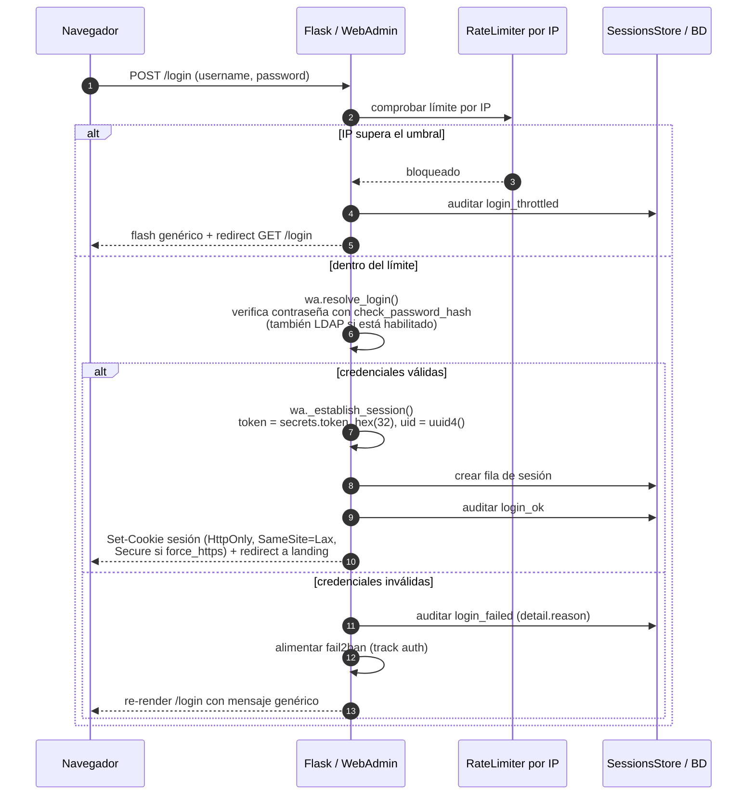
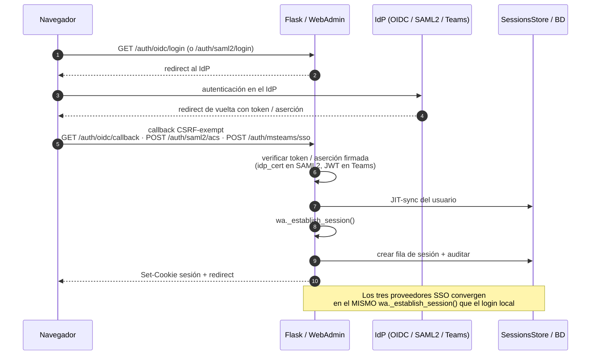
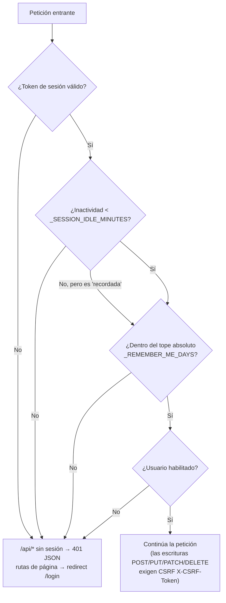

# Seguridad del Panel Web

Referencia completa de los mecanismos de seguridad implementados en la interfaz web de administración (`lib/web_admin`) y los tests que los verifican.

---

## Autenticación

### Flujo de login

1. `POST /login` recibe `username` + `password`.
2. Si **LDAP está habilitado** (`ldap.enabled = true`): se evalúa el campo `auth_source` del usuario en el **almacén de usuarios de la base de datos** (tabla `users` en `data.db`):
   - `auth_source: "ldap"` o usuario desconocido → autenticación contra LDAP primero.
   - `auth_source: "local"` → siempre autenticación local, LDAP ignorado.
   - Si LDAP falla por error de red y `fallback_to_local = true` → intenta autenticación local.
3. Se busca el usuario en el **almacén de usuarios de la base de datos**; si no existe o la contraseña es incorrecta → el **formulario muestra siempre "Invalid credentials"** (mensaje genérico — evita enumeración de usuarios). Si la cuenta existe pero está desactivada o bloqueada → **mismo mensaje genérico** (anti-enumeración). El motivo real se registra en el log de auditoría como `detail.reason`.
4. La contraseña se verifica con `werkzeug.security.check_password_hash` (**scrypt** por defecto en Werkzeug 3.x). El camino de autenticación está diseñado para tener **tiempo constante** con independencia de si el usuario existe (ver [Anti-enumeración por tiempo](#anti-enumeración-por-tiempo-timing)).
5. Si la cuenta **debe un segundo factor** —porque tiene uno dado de alta, o porque la política
   `web_admin.mfa_required` le aplica y no lo tiene— **no se crea sesión ninguna**: queda una
   **nota en la cookie** (`mfa_pending`) y se redirige a `/login/mfa` o a `/login/mfa/enrol`. Un
   inicio de sesión a medias no es una sesión: sin fila en el registro, sin `logged_in` y sin
   pasar `_login_required`, la petición sigue siendo anónima **por no tener sesión**. Al
   verificar el código se **vuelve a leer la cuenta** —entre las dos mitades puede haberse
   desactivado— y entonces sí se crea. Ver [explica-mfa.md](explica-mfa.md).
6. Si es correcta y la cuenta **no debe un segundo factor** → se crea una entrada en el **registro de sesiones** del servidor (`_sessions`) con un token de 32 bytes aleatorios (64 hex) y se guarda en la cookie de sesión Flask.
7. El evento `login_ok` o `login_failed` se escribe en el **registro de auditoría**. En caso de fallo, el campo `detail.reason` almacena la clave i18n que describe la causa real (`user_not_found`, `account_disabled`, `account_locked`, `invalid_credentials`, `ldap_invalid_credentials`, `ldap_user_not_found` o `ldap_connection_error`). Los logins LDAP/OIDC exitosos incluyen `detail.auth_source`.
8. El login usa el patrón **POST / Redirect / GET**: en caso de fallo se usa `flash()` y se redirige al `GET /login`, evitando el diálogo de reenvío de formulario al pulsar F5.

### Segundo factor (MFA)

El detalle completo —política `off`/`admins`/`all`, confianza por proveedor SSO, alta con QR,
códigos de recuperación, antirreplay, llaves de seguridad WebAuthn, auditoría y reset— vive en
**[explica-mfa.md](explica-mfa.md)**, que es la fuente única del tema. Lo que importa aquí es
cómo encaja con lo demás de esta página:

- **No hay sesión hasta que el código verifica.** El paso intermedio es una nota en la cookie,
  así que ninguna guarda de este documento tiene que aprender un estado nuevo.
- **Un código rechazado alimenta fail2ban** por la vía `auth`, igual que una contraseña
  equivocada: si no, la segunda puerta sería la que no tiene límite de intentos. Ver
  [fail2ban interno](#fail2ban-interno-bans-de-ip-a-nivel-de-servicio).
- **El bloqueo de cuenta por intentos sigue siendo el de la contraseña.** Un factor no lo
  sustituye.
- **La semilla se cifra con el mismo Fernet** que el resto de secretos ([Cifrado de
  credenciales](#cifrado-de-credenciales-en-disco)); los códigos de recuperación se guardan
  **hasheados**, porque nadie necesita volver a leerlos.
- **Quitarle el factor a otro** es un permiso propio, `mfa_reset_others`, de nadie por defecto
  ([ref-permisos.md](ref-permisos.md)).

### Anti-enumeración por tiempo (timing)

Un atacante no debe poder distinguir **"usuario no existe"** de **"contraseña incorrecta"** — ni por el mensaje (ya es genérico) ni por el **tiempo de respuesta**. Verificar un hash scrypt cuesta ~200 ms; si ese cálculo solo ocurriera para usuarios existentes, un usuario válido respondería mucho más lento que uno inexistente, revelando qué cuentas existen (enumeración por *timing*). `_authenticate` (`lib/web_admin/app.py`) lo evita ejecutando **siempre el mismo trabajo criptográfico**:

- **Usuario inexistente** → se ejecuta igualmente `check_password_hash` contra un **hash señuelo**. El señuelo **no es un hash generado aparte** (podría llevar parámetros de coste distintos y volver a delatar), sino el `password_hash` de un **usuario local real** del almacén, de modo que el coste de verificación **coincide exactamente** con el de una cuenta existente.
- **Cuenta deshabilitada** → también ejecuta el hash antes de devolver el motivo, para no ser más rápida que una contraseña incorrecta.
- **Contadores de intentos fallidos en memoria** → el incremento del contador de bloqueo **no** hace escritura en base de datos por intento (`_persist_users` solo se llama al bloquear/expirar/acertar). Una escritura en BD por intento fallido añadía ~200 ms **solo** al camino del usuario existente, reintroduciendo el canal de *timing*; ahora el contador vive en memoria.

Resultado medido (estado limpio): `admin` (existe) ≈ usuario inexistente, dentro del ruido (p. ej. 191.8 ms vs 194.8 ms). El mensaje mostrado es idéntico (`invalid_credentials`) para inexistente, contraseña incorrecta, cuenta deshabilitada y cuenta bloqueada; el motivo real solo va al log de auditoría.

> Canal residual conocido: la primera petición sobre una cuenta con un **bloqueo ya expirado** ejecuta un `_persist_users` para limpiarlo (~200 ms). Solo afecta a cuentas recientemente bloqueadas — que el atacante ya sabe que existen (fue él quien las bloqueó) — por lo que no aporta información nueva.

### Límite de intentos por IP (rate-limiting)

Además del [bloqueo por cuenta](#bloqueo-de-cuenta-por-intentos-fallidos), hay un **límite por IP de origen** en `/login` (`lib/security/ratelimit.py` :: `RateLimiter`, ventana deslizante en memoria, thread-safe): tras `web_admin|login_ratelimit_max` intentos (por defecto **15**) dentro de `web_admin|login_ratelimit_window_secs` (por defecto **300 s**), la IP recibe `flash` genérico + redirección y se registra `login_throttled` en auditoría. Un login correcto **resetea** el contador de esa IP (usuarios legítimos tras un NAT no se penalizan). Esto frena el *password spraying* (una contraseña común probada contra muchos usuarios, que nunca dispara el bloqueo por-cuenta). El bloqueo por-cuenta usa **contadores en memoria** (el propio `request.remote_addr` no es falsificable salvo que `proxy_count` esté mal configurado — ver [Confianza de proxy](#confianza-de-proxy-e-ip-del-cliente-proxyfix)). Umbrales `0` = desactivado.

### Sesiones persistentes ("Remember me")

- El formulario de login incluye un checkbox `remember_me`.
- Si se activa, `session.permanent = True` — la **cookie** dura `web_admin|remember_me_days`
  (30 por defecto) en vez de morir al cerrar el navegador.
- …y la sesión queda **exenta del timeout por inactividad**. Esa mitad faltaba: `remember` era
  una propiedad de la cookie y el servidor no se enteraba, así que `session_idle_minutes` (720,
  **12 h**) expiraba una sesión recordada igual de rápido que cualquier otra. Doce horas es
  menos que una noche: quien trabaja a diario iniciaba sesión cada mañana y marcar la casilla no
  cambiaba nada observable. Ahora se guarda en la fila de la sesión (columna `remember`) y
  `_check_session` la mira.
- **El tope absoluto sigue aplicando**: `remember_me_days` desde `created`. «Recordarme» no
  significa «para siempre», significa el número que da nombre a la casilla.
- El timeout por inactividad sigue existiendo y sigue activo por defecto para el resto: protege
  una sesión abierta en una máquina de la que alguien se levantó.
- `last_seen` se escribe en la BD como mucho **una vez por minuto**. Antes se actualizaba solo en
  memoria, así que tras un reinicio la inactividad se contaba desde el **login** — y con el
  vigilante de desarrollo, que reinicia con cada edición, eso era cada pocos minutos.
- La `secret_key` de Flask se genera aleatoriamente la primera vez y se persiste en disco (`.flask_secret`); las instancias posteriores reutilizan la misma clave — las sesiones no se invalidan al reiniciar el proceso.

### Último acceso (`last_login`)

Cada cuenta guarda cuándo inició sesión por última vez, estampado en `_establish_session` — el
único punto del panel donde nace una sesión, así que cubre el formulario local y las tres puertas
SSO por igual. Vacío significa **nunca**.

Existe porque la auditoría no podía contestarlo: `login_ok` está ahí, pero el registro está
limitado **por número de filas**, así que una racha de cualquier otra cosa lo desaloja — y
entonces «qué cuentas ya no tienen a nadie detrás» deja de poder contestarse. Un campo en el
registro lo contesta por lejos que quede el último acceso.

**Usar un token de API no cuenta como iniciar sesión**: eso queda en el `last_used` del token.
Una cuenta cuya única actividad es un script tiene a una persona inactiva detrás, que es justo lo
que una revisión de accesos está buscando.

### Campo `auth_source` en usuarios

Cada usuario en el almacén de la base de datos (tabla `users`) tiene un campo `auth_source` que determina cómo se autentica:

| Valor | Significado |
| ----- | ----------- |
| `"local"` | Contraseña hash local; LDAP/OIDC nunca se aplican |
| `"ldap"` | Autenticado contra LDAP; no tiene `password_hash` |
| `"oidc"` | Autenticado mediante SSO OIDC; no tiene `password_hash` |
| `"saml2"` | Autenticado mediante SSO SAML2; no tiene `password_hash` |

Los usuarios locales llevan `auth_source: "local"`; los autenticados por LDAP/SSO toman el valor correspondiente al crearse o en el primer inicio de sesión.

### Tests de autenticación

| Test | Qué verifica |
|------|-------------|
| `test_root_redirects_to_login` | Ruta `/` redirige a `/login` sin sesión |
| `test_login_success` | Login correcto da acceso al dashboard |
| `test_login_wrong_password` | Contraseña incorrecta → redirección PRG a login + mensaje de error |
| `test_login_wrong_username` | Usuario inexistente → mismo mensaje genérico (sin enumerar) |
| `test_login_empty_fields` | Credenciales vacías → rechazado |
| `test_login_account_disabled` | Cuenta desactivada → mensaje específico "account disabled" |
| `test_login_uses_post_redirect_get` | Login fallido → 302 redirect (PRG), no render directo |
| `test_logout` | Logout invalida la sesión; rutas protegidas redirigen a login |
| `test_login_with_remember_me` | `remember_me` marca la sesión como permanente |
| `test_secret_key_persisted` | La `secret_key` se escribe en disco al crear la instancia |
| `test_secret_key_reused` | Una segunda instancia reutiliza la clave existente |

### Bloqueo de cuenta por intentos fallidos

Tras `_LOCKOUT_MAX_ATTEMPTS` (por defecto **5**) intentos de login fallidos con la contraseña incorrecta, la cuenta queda bloqueada durante `_LOCKOUT_DURATION_SECS` (por defecto **900 s = 15 min**). Mientras está bloqueada, incluso la contraseña correcta es rechazada. El mensaje mostrado al usuario es siempre el genérico "Invalid credentials" para no revelar que la cuenta existe y está bloqueada (anti-enumeración). El log de auditoría sí registra `reason: 'account_locked'`.

**Levantar un bloqueo.** Hasta build.93 lo único que lo limpiaba era **un inicio de sesión
correcto** — que es justo lo que el bloqueo impide—, así que la única salida era esperar a que
caducara, y `lockout_duration_secs` llega a un día. Y era **invisible**: a quien administraba le
decían «no puedo entrar» y no tenía forma de ver que la cuenta estaba bloqueada.

Ahora el estado viaja en el listado de usuarios (`locked_until`, **solo mientras esté en
vigor**), se pinta en la lista y en el modal de edición, y se levanta desde ahí o con
`main.py user unlock <usuario>`.

Va con `users_edit` y no con un permiso propio, a diferencia de quitarle el segundo factor a
alguien: **no concede acceso** —la contraseña sigue teniendo que ser la correcta—, solo levanta
un límite de intentos. Se audita como `user_unlocked`, y **solo cuando había un bloqueo en
vigor**: limpiar las claves de uno ya caducado es mantenimiento, y registrarlo pondría en el
único registro que alguien consulta después algo que no pasó.

Configuración en `config.json → web_admin`:

| Campo                   | Por defecto | Descripción                                                     |
|-------------------------|-------------|----------------------------------------------------------------- |
| `lockout_max_attempts`  | `5`         | Intentos fallidos antes del bloqueo. `0` desactiva el bloqueo.  |
| `lockout_duration_secs` | `900`       | Duración del bloqueo en segundos (60–86400).                    |

El **contador** de intentos fallidos (`_failed_attempts`) se mantiene **en memoria** — no se escribe en la base de datos en cada intento — para no reintroducir el [canal de *timing*](#anti-enumeración-por-tiempo-timing); solo se persiste `_locked_until` **al bloquear** (y se limpia al acertar o expirar). Estos campos no se exponen en `GET /api/v1/users`. Este bloqueo por-cuenta se complementa con el [límite por IP](#límite-de-intentos-por-ip-rate-limiting) contra el *password spraying*.

### Tests de bloqueo de cuenta

| Test | Qué verifica |
|------|-------------|
| `test_lockout_triggers_after_n_attempts` | Tras N intentos fallidos el mensaje menciona "locked" |
| `test_locked_account_rejects_correct_password` | Cuenta bloqueada rechaza la contraseña correcta |
| `test_lockout_returns_minutes_remaining` | El mensaje incluye los minutos restantes |
| `test_successful_login_resets_failed_attempts` | Login correcto limpia `_failed_attempts` y `_locked_until` |
| `test_lockout_disabled_when_max_attempts_zero` | Con `max_attempts=0` nunca se bloquea |
| `test_account_unlocks_after_duration` | Tras expirar el bloqueo, el login correcto funciona |
| `test_authenticate_returns_tuple` | `_authenticate()` devuelve siempre una 2-tupla |
| `test_authenticate_wrong_password_reason` | Contraseña incorrecta → `reason='invalid_credentials'` |
| `test_authenticate_unknown_user_reason` | Usuario inexistente → `reason='user_not_found'` |

---

## Flujo de autenticación

Todos los caminos de inicio de sesión (local, LDAP, OIDC, SAML2, Teams) convergen en un
**único punto**: `wa._establish_session()` (`lib/web_admin/mixins/auth.py`), que crea la fila
en `SessionsStore` con `token = secrets.token_hex(32)` (uid público = `uuid4()`), fija la cookie
de sesión (`HttpOnly`, `SameSite=Lax`, `Secure` si `force_https`/`secure_cookies`), audita el
login y redirige a la landing. Los endpoints concretos están en [ref-api.md](ref-api.md); el
alta completa del SSO con Microsoft Entra ID en [caso-entra-id.md](caso-entra-id.md).

### Login local (`POST /login`)


```mermaid
sequenceDiagram
    autonumber
    participant N as Navegador
    participant WA as Flask / WebAdmin
    participant RL as RateLimiter por IP
    participant DB as SessionsStore / BD

    N->>WA: POST /login (username, password)
    WA->>RL: comprobar límite por IP
    alt IP supera el umbral
        RL-->>WA: bloqueado
        WA->>DB: auditar login_throttled
        WA-->>N: flash genérico + redirect GET /login
    else dentro del límite
        WA->>WA: wa.resolve_login()<br/>verifica contraseña con check_password_hash<br/>(también LDAP si está habilitado)
        alt credenciales válidas
            WA->>WA: wa._establish_session()<br/>token = secrets.token_hex(32), uid = uuid4()
            WA->>DB: crear fila de sesión
            WA->>DB: auditar login_ok
            WA-->>N: Set-Cookie sesión (HttpOnly, SameSite=Lax,<br/>Secure si force_https) + redirect a landing
        else credenciales inválidas
            WA->>DB: auditar login_failed (detail.reason)
            WA->>WA: alimentar fail2ban (track auth)
            WA-->>N: re-render /login con mensaje genérico
        end
    end
```

### Login SSO (OIDC / SAML2 / Teams)


```mermaid
sequenceDiagram
    autonumber
    participant N as Navegador
    participant WA as Flask / WebAdmin
    participant IDP as IdP (OIDC / SAML2 / Teams)
    participant DB as SessionsStore / BD

    N->>WA: GET /auth/oidc/login (o /auth/saml2/login)
    WA-->>N: redirect al IdP
    N->>IDP: autenticación en el IdP
    IDP-->>N: redirect de vuelta con token / aserción
    N->>WA: callback CSRF-exempt<br/>GET /auth/oidc/callback · POST /auth/saml2/acs · POST /auth/msteams/sso
    WA->>WA: verificar token / aserción firmada<br/>(idp_cert en SAML2, JWT en Teams)
    WA->>DB: JIT-sync del usuario
    WA->>WA: wa._establish_session()
    WA->>DB: crear fila de sesión + auditar
    WA-->>N: Set-Cookie sesión + redirect
    Note over WA,DB: Los tres proveedores SSO convergen<br/>en el MISMO wa._establish_session() que el login local
```

### Validación por petición (`_check_session`)

En **cada** petición, `_check_session()` valida la sesión antes de ejecutar la ruta. Cualquier
comprobación fallida invalida la sesión y corta:


```mermaid
flowchart TD
    A["Petición entrante"] --> B{"¿Token de sesión válido?"}
    %% «Recordarme» exime del idle y solo de eso: el tope absoluto sigue aplicando.
    B -- No --> X["/api/* sin sesión → 401 JSON<br/>rutas de página → redirect /login"]
    B -- Sí --> C{"¿Inactividad < _SESSION_IDLE_MINUTES?"}
    C -- No --> X
    C -- "No, pero es 'recordada'" --> D
    C -- Sí --> D{"¿Dentro del tope absoluto<br/>_REMEMBER_ME_DAYS?"}
    D -- No --> X
    D -- Sí --> E{"¿Usuario habilitado?"}
    E -- No --> X
    E -- Sí --> F["Continúa la petición<br/>(las escrituras POST/PUT/PATCH/DELETE<br/>exigen CSRF X-CSRF-Token)"]
```

### Qué ha hecho una sesión

`last_seen` dice que una sesión está viva. Quién ha entrado, desde dónde y desde cuándo se
contestan con la fila de la sesión; **qué ha hecho** no se contestaba en ninguna parte. La
auditoría tampoco: registra las acciones que **tienen nombre** (`config_saved`) y las atribuye a
la **cuenta**, así que dos sesiones de la misma persona se leen como una — y una petición
**rechazada** no dejaba rastro en ningún sitio.

Cada sesión lleva su propio anillo (`web_admin|session_log_max`, 200 por defecto; **0 = sin
límite**, y `web_admin|session_log_enabled` es el interruptor), gemelo del de los tokens: fecha, IP, método, **patrón** de ruta y **código de respuesta**. Se lee
desde el botón de historial de cada fila y, todo junto, desde la vista **Actividad** de
Acceso › Sesiones.

**No se guarda todo, y esa es la regla**: solo las **acciones** (POST/PUT/PATCH/DELETE) y los
**rechazos** (≥ 400). El panel se sondea a sí mismo —salud cada 6 s, *keepalive* cada 20 s, la
pestaña de Acceso cada 30 s—, así que un anillo con las lecturas correctas serían doscientos
latidos con la única línea interesante ya desalojada, y una escritura en la respuesta de cada
sondeo de cada pestaña abierta. Un rechazo, en cambio, es tan a menudo un GET como no: «esta
sesión intentó algo que no puede» es la línea que busca una revisión, y la regla que descarta
lecturas no puede descartarla.

Una petición autenticada **con token** no escribe aquí: un token no es una sesión, y sus llamadas
son del [anillo del token](#qué-ha-hecho-un-token). Las filas **se van con la sesión**, al
revocarla y al cerrarlas todas: actividad de una sesión que ya no existe es invisible en el panel
y crecería sin límite.

### Ejemplo

Bloque `oidc` **ilustrativo** en `config.json` (los valores reales dependen de tu IdP; el
`client_secret` se persiste cifrado con prefijo `enc:` — ver [Cifrado de Credenciales en
Disco](#cifrado-de-credenciales-en-disco)):

```json
{
  "oidc": {
    "enabled": true,
    "provider_url": "https://login.microsoftonline.com/<tenant-id>/v2.0",
    "issuer": "https://login.microsoftonline.com/<tenant-id>/v2.0",
    "client_id": "00000000-0000-0000-0000-000000000000",
    "client_secret": "enc:gAAAAABn...",
    "scopes": "openid profile email"
  }
}
```

Login local por `curl`, capturando la cookie de sesión y reutilizándola:

```bash
# 1) inicia sesión y guarda la cookie en cookies.txt
curl -i -c cookies.txt \
     --data-urlencode "username=admin" \
     --data-urlencode "password=TU_CONTRASEÑA" \
     https://tu-servidor/login

# 2) reutiliza la cookie en una llamada autenticada
curl -b cookies.txt https://tu-servidor/api/v1/me
```

> El alta completa del SSO (registro en Entra ID, provisioning por Graph, mapeo Grupos→Rol)
> está en [caso-entra-id.md](caso-entra-id.md); el catálogo de endpoints, en
> [ref-api.md](ref-api.md). El catálogo de permisos **no** se repite aquí — vive en
> [ref-permisos.md](ref-permisos.md); esta sección cubre solo la autenticación.

---

## fail2ban interno (bans de IP a nivel de servicio)

Un **fail2ban embebido** (`lib/services/ipban/jail.py` :: `IpBanManager`) banea IP de origen que acumulan ofensas — no solo login fallido, sino **cualquier acceso no autorizado** — y es **agnóstico al servicio**: además de la web, protege el [receptor syslog](#receptor-syslog-entrada-no-confiable) y cualquier futuro puerto expuesto. Es *thread-safe*, sin dependencias de framework, y su estado se persiste en la base de datos general (compartido entre procesos: web + syslog ven el mismo jail).

### Dos vías de ofensa (tracks)

Cada IP acumula ofensas en una **ventana deslizante**, en dos contadores independientes para no banear a un usuario autenticado que curiosea:

| Track   | Qué cuenta                                             | Umbral | Ventana |
|---------|--------------------------------------------------------|--------|---------|
| `auth`  | Login fallido, CSRF inválido, syslog no permitido…     | 10     | 600 s   |
| `authz` | Acceso a secciones sin permiso (403 de sesión válida)  | 30     | 600 s   |

Al cruzar un umbral, la IP entra en el **jail** por un tiempo **escalado** con cada reincidencia:

```text
1er ban 15 min → 2º 1 h → 3º 6 h → 4º 24 h → 5º y siguientes: permanente
```

Las IP en la [lista blanca](#lista-blanca-never-ban) nunca acumulan ofensas ni se banean (se cortocircuitan en la entrada). El *loopback* está siempre exento.

### Acción de bloqueo por servicio (service registry)

Cada servicio declara sus puertos y las **respuestas** que soporta (`lib/services/ipban/exposed.py`). Para una IP baneada:

| Servicio | Puertos                     | Acciones soportadas                    | Por defecto |
|----------|-----------------------------|----------------------------------------|-------------|
| `web`    | tcp:80/443 (tras proxy)     | `page` · `minimal` · `reject` · `json` | `page`      |
| `syslog` | udp/tcp:514, tcp:6514 (TLS) | `drop`                                 | `drop`      |

- `page` = página de error con estilo · `minimal` = error mínimo · `reject` = 403 · `json` = error JSON · `drop` = ni acepta la conexión (para UDP/TCP crudo de syslog).
- La acción se configura por servicio, y admite **override por-ban** (columna «Response» en la tabla de baneadas).

### Lista blanca (never-ban)

Tres fuentes se unen en el *allowlist* del manager: el *loopback*, la CSV programática `web_admin|ipban_whitelist` (env/config) y una **lista gestionada desde la UI** con descripción y autor, persistida en la tabla `ip_whitelist` (`lib/services/ipban/store/whitelist.py` — IP/CIDR normalizado, `description`, `created_at`, `created_by`). Añadir/quitar una entrada empuja el nuevo allowlist al jail en caliente.

### Historial de baneos (auditoría append-only)

Cada evento del ciclo de vida (`banned` / `escalated` / `unbanned`) se registra en `ip_ban_history` con motivo, categoría, nivel, intervalo, ofensas, autor y fecha — se conserva **aunque el ban expire** y desaparezca de la lista activa. Al **retirar un ban** la UI exige un **motivo**, que se guarda en el evento `unbanned`.

### Persistencia

Todo el estado vive en la BD general (tablas con `uid` como PK sintética, logs con `id` autoincremental):

| Tabla                  | Contenido                                             |
|------------------------|-------------------------------------------------------|
| `ip_bans`              | Jail activo (IP baneada + motivo, nivel, expiración)  |
| `ip_offense_counters`  | Contadores por `(ip, track)` en ventana               |
| `ip_offense_log`       | Registro de intentos por IP (para el modal de detalle)|
| `ip_service_action`    | Override de acción por servicio                       |
| `ip_ban_history`       | Historial de eventos ban/escalado/desban              |
| `ip_whitelist`         | Lista blanca gestionada (IP/CIDR + descripción)       |

El conteo **persistido** (no en memoria) sobrevive a reinicios y es correcto con múltiples microservicios; una caché de jail activo (`_active_jail`, TTL 3 s) evita golpear la BD en cada request.

### Configuración (`config.json → web_admin`)

| Campo                       | Por defecto           | Descripción                                          |
|-----------------------------|-----------------------|------------------------------------------------------|
| `ipban_enabled`             | `true`                | Interruptor maestro (`false` ⇒ nunca banea/bloquea). |
| `ipban_auth_threshold`      | `10`                  | Ofensas de la vía `auth` antes del ban (`0`=off).    |
| `ipban_auth_window_secs`    | `600`                 | Ventana de la vía `auth`.                            |
| `ipban_authz_threshold`     | `30`                  | Ofensas de la vía `authz` antes del ban (`0`=off).   |
| `ipban_authz_window_secs`   | `600`                 | Ventana de la vía `authz`.                           |
| `ipban_durations`           | `900,3600,21600,86400` | Escalera de duraciones (s), CSV.                    |
| `ipban_permanent_after`     | `4`                   | Nivel de ban a partir del cual es permanente (`0`=nunca). |
| `ipban_whitelist`           | `''`                  | IP/CIDR programáticos, nunca baneados (CSV).         |

La UI separa **configuración** (ajustes + «Servicios expuestos», en Config → fail2ban) de la **operativa** (sección de nivel superior con sub-pestañas IPs baneadas / Lista blanca / Historial). Ver [explica-web-admin.md → fail2ban](explica-web-admin.md#fail2ban-bans-de-ip).

### Registrado como servicio (pestaña Services)

fail2ban se registra como un **servicio embebido** más (`lib/services/ipban/`), igual que el monitor, el receptor syslog o el procesador de eventos. En la pestaña **Services** aparece con su **estado** (on/off), su **interruptor start/stop** (que conmuta `ipban_enabled` y lo persiste, reconfigurando el jail en caliente) y un **latido (heartbeat) por contenedor**: cada réplica publica su estado y sus contadores (baneadas / en vigilancia / lista blanca) en `service_instances`, así en microservicios se ve **qué pods están aplicando el jail**. A diferencia de los demás, no es un bucle de fondo sino un **gate en línea** en cada request; el start/stop no arranca un hilo, sino que activa/desactiva el interruptor maestro compartido.

Todo el código del servicio vive unificado en `lib/services/ipban/`: `jail.py` (`IpBanManager`, motor sin framework), `exposed.py` (registro de servicios expuestos + acciones de bloqueo), `manager.py` (`_IpBanMixin`, la cola Flask del host: gate + captura de ofensas) y `embedded.py` (superficie Services + heartbeat). La persistencia se agrupa en `lib/services/ipban/store/`, con **una clase y un archivo por tabla** (`bans.py`, `offense_counters.py`, `offense_log.py`, `service_actions.py`, `history.py`, `whitelist.py`) y una fachada `IpBanStore` (`store.py`) que los compone y coordina las operaciones cross-tabla (`clear_offenses`, `prune`). Los routes (`lib/services/ipban/routes.py`) y las plantillas siguen su ubicación estándar, como el resto de servicios.

---

## Tokens de API

Todo menos SCIM se autentica con **cookie de sesión + CSRF**, lo que obliga a cualquier
automatización a guardar una contraseña real. Y desde que existe el segundo factor, una
contraseña **ya no completa un inicio de sesión**: encender `mfa_required` deja sin funcionar
todos los scripts, y el único apaño es una cuenta deliberadamente sin proteger.

Un token de API es la respuesta a las dos cosas: 192 bits aleatorios, sin segundo factor que
completar, sin cookie, y revocable por su cuenta sin tocar el acceso de la persona.

```
Authorization: Bearer sst_<id>_<secreto>
```

### Lo que sostiene el diseño

**La intersección.** Un token lleva o una lista de permisos o `'*'`, y en **cada petición** se
cruza con los permisos efectivos actuales de su dueño ([`service.effective`](../src/lib/core/apitokens/service.py)).
De ahí salen dos cosas que no se pueden separar: un token nunca puede hacer más que la cuenta a
la que pertenece, y quitarle un rol a esa cuenta lo estrecha en el mismo instante. La
alternativa —congelar los permisos al crearlo— es una concesión permanente que sobrevive a la
degradación de su dueño. Por eso `'*'` significa **«lo que tenga el dueño»** y no «todo»: es la
misma frase escrita de forma que siga siendo verdad.

**Las rutas que gestionan credenciales rechazan un token** (`_session_required`): mintear,
revocar, cambiar la contraseña, dar de alta o quitar un segundo factor. Un token estrecho que
puede mintear uno ancho no es estrecho, y uno que puede cambiar la contraseña de su dueño es un
punto de apoyo que se queda con la cuenta dentro de la cual estaba acotado. Todo lo demás que
puede hacer una cuenta, puede hacerlo un token suyo.

**El estado de la cuenta manda.** Desactivarla, o marcarla sin inicio de sesión, deja sus
tokens sin efecto. Borrarla los borra. Si no, dar de baja a alguien dejaría abierta una puerta
que nadie piensa en cerrar.

**No es una sesión.** No hay fila en la tabla de sesiones, no sale en esa pantalla y «revocar
todas las sesiones» no lo toca: tiene su propia lista, su propia caducidad y su propia
revocación. Y la respuesta a una llamada con token **no lleva cookie**: el cliente no pidió una
sesión, y dársela convierte una llamada sin estado en una segunda credencial en el disco de
alguien.

### Qué ha hecho un token

`last_used` dice que un token sigue vivo. No dice para qué es, si lo que hace es lo que montaste
ni desde dónde llama — y la auditoría tampoco: registra la **cuenta**, así que lo que escribe un
token se lee como lo que escribió su dueño, y las lecturas no se auditan para nadie.

Cada llamada autenticada por token queda con fecha, IP, método, **patrón** de ruta y **código de
respuesta**, y se lee desde el botón de historial de su fila. Las **negadas** están ahí a
propósito: «este token pidió algo que no puede tener» es la línea que busca una revisión, y un
historial de las que funcionaron es el historial de la mitad que salió como se esperaba.

Es un **anillo por token** —`web_admin|api_token_log_max`, 200 por defecto; **0 = sin límite**,
y quien lo apaga es `web_admin|api_token_log_enabled`— y no un log: una tabla que crece con el tráfico de la API es lo que la contabilidad de una API no puede
ser. Sobrevive a la revocación, que es cuando más se pregunta por él, y se borra con la cuenta.

### `'*'` no es una frase, son dos

`'*'` se resuelve **contra el dueño** en cada petición, así que lo que dice depende de quién sea
el dueño:

- **En tu propia configuración** dice «todos los **míos**», y no concede nada: un token tuyo
  nunca puede más de lo que puedes tú, hoy y cada día siguiente.
- **Creado para otra cuenta** dice «todos los **suyos**, según vayan cambiando». Es la lectura
  útil —así un token para una cuenta sigue encajando con la cuenta en vez de quedarse viejo— y
  es también lo único aquí que **crece sin que nadie lo decida**: quien lo creó vio el secreto
  una vez, y un permiso que esa cuenta reciba el año que viene ensancha una credencial que
  quizá siga teniendo apuntada.

Por eso es una decisión **de administrador** y de nadie más. Un administrador ya tiene todos los
permisos, así que un token que sigue a una cuenta nunca puede llevarle más allá de su propio
techo; a un gestor de usuarios delegado sí podría, y esa es una escalada que llega sola.

Para la identidad interna sigue rechazado, y no por política: no hay conjunto del dueño contra
el que resolverlo, así que `service.effective` devuelve el conjunto vacío. Sería un token que no
puede hacer nada mientras afirma poder todo.

La etiqueta cambia con el significado —«Todos mis permisos» / «Todos sus permisos»— y en la
lista de administración y en la auditoría se lee «Todos los de la cuenta»: quién es el dueño al
que sigue **es** el valor. Y junto a las casillas hay **Todos / Ninguno**, que escribe el mismo
conjunto como lista fija para cuando lo que quieres es una foto y no un seguimiento.

### Tokens de `system`: dónde deja de valer la intersección

`system` es una identidad interna: nombre, UID estable y fila en la lista de usuarios, pero sin
contraseña, sin sesión y **sin permisos** — actúa con la autoridad del panel precisamente porque
nunca pasa por una comprobación de permisos. Un token suyo existe porque la automatización que
cuelga de una persona se cae con la cuenta de esa persona, que es el fallo que esto viene a
evitar.

Lo que hay que saber, dicho sin adornos: **el invariante que gobierna a todos los demás tokens no
aplica aquí**. «Intersecado con los del dueño, en cada petición» necesita un dueño con permisos, y
este no los tiene; intersecar con el conjunto vacío haría que el token no pudiera hacer nada. Así
que su alcance es el que se le dio y **nada lo estrecha después salvo revocarlo**.

A cambio, el techo se mueve en vez de desaparecer:

- **Solo un administrador puede crear uno.** La identidad propia del panel no es algo que reparta
  un gestor de usuarios delegado.
- **Nadie puede dar lo que no tiene.** Los permisos se validan contra los de quien llama, así que
  un token de `system` nunca sale más ancho que el administrador que lo creó.
- **`'*'` se rechaza.** Sin dueño contra el que resolverlo significaría *todo, para siempre*, que
  es justo lo que este diseño existe para no tener. Falla cerrado: si llegara almacenado, el
  cálculo devuelve el conjunto vacío en vez de todos.
- **Sale en la lista de administración** como cualquier otro y se revoca igual.

`anonymous` —la otra identidad interna— no puede tener tokens: es el nombre que el registro usa
para «no sabemos quién», y un token es una identificación.

### Editar el alcance no es rotar

El secreto y el alcance son dos cosas distintas, y cuando un token resulta necesitar un permiso
más, solo una de ellas está mal. Sin poder editarlo, cambiar el alcance costaba una rotación:
un secreto nuevo redesplegado allá donde esté configurado, para arreglar una decisión que no
tiene nada que ver con el secreto. Ese es el coste que se paga una vez y luego se evita
minteando el token ancho — justo lo que esta pantalla existe para hacer innecesario.

El cambio se aplica en la **siguiente petición** del token que ya está desplegado: los permisos
se leen de la fila y se intersecan con los del dueño en cada llamada, así que no hay concesión
cacheada que invalidar. Se valida contra los permisos **de quien llama**, igual que al mintear
—un alcance que no puedes crear no es uno al que puedas llegar editando—, y un token **revocado**
no se edita: ya no es un token, y un alcance sobre él sería una promesa que nadie cumple.

La entrada de auditoría lleva **los dos lados**, antes y después: «qué puede hacer ahora» sin
«qué podía hacer antes» no contesta la única pregunta que se le hace a un registro así.

### Rotar en vez de revocar y volver a crear

Rotar un token con lo que había —revocar, crear otro— cuesta dos cosas que solo duelen en
producción: hay que rehacer el juego de permisos de memoria, y todo lo que usa el token está
roto desde la revocación hasta que el nuevo está desplegado.

**Rotar** crea el sustituto con el mismo nombre, los mismos permisos y el mismo **plazo** —el
original, no la fecha original: un token de 90 días rota a otros 90, mientras que copiar la fecha
devolvería algo que caduca mañana—, y deja el actual **funcionando**. El viejo pasa a llamarse
«(anterior)» y el nuevo hereda el nombre, así que los nombres siguen siendo únicos, quien lea la
lista encuentra el nombre que conoce en el token vigente, y el que hay que retirar es el que lo
dice. Se revoca cuando el cambio está hecho, no antes.

**Clonar** abre el diálogo de creación relleno con los permisos del token elegido. Rehacer un
juego de permisos a mano es como un segundo token acaba siendo sutilmente distinto del que
pretendía imitar, y nadie lo nota hasta que la diferencia es un 403 en algo que corre de noche.

### CSRF

Una petición autenticada por *bearer* está **exenta**, y no por comodidad: el doble-envío
defiende de que una página cross-site haga que **el navegador** emita una petición con sus
cookies puestas. Ninguna página puede añadir una cabecera `Authorization` sin el consentimiento
de este origen, así que aquí no hay ataque que prevenir — y exigirlo rechazaría cada escritura
de un cliente de API. Por eso el hook que resuelve el token corre **antes** que el de CSRF: para
juzgar una petición hay que saber cómo se autenticó (ver [explica-web-admin.md](explica-web-admin.md)).

### Qué se guarda

Solo el **hash SHA-256** del secreto, más un `token_id` en claro que es lo que busca el índice.
El token completo existe una sola vez, en la respuesta que lo crea. Detalles de la tabla y el
porqué de SHA-256 y no scrypt, en
[ref-esquema-bd.md](ref-esquema-bd.md#api_tokens--tokens-de-api-por-usuario).

### Límites y auditoría

Un máximo de **20 tokens activos** por cuenta y una caducidad de como mucho **730 días**;
ninguno de los dos es una frontera de seguridad —el dueño puede mintear más mañana—, están para
que la lista siga siendo una lista y «no caduca» siga siendo una decisión y no la forma que toma
todo token porque nadie tocó el campo.

Se auditan `api_token_created`, `api_token_revoked` y `api_tokens_revoked_by_admin`. El detalle
nombra el token y lo que puede hacer, **nunca el token**: un registro que lleva una credencial
viva es un segundo sitio del que robarla.

Revocar los tokens de **otra** cuenta va con `sessions_revoke`, que es exactamente de lo que
trata ese permiso —acceso permanente a este panel—; inventar un flag aparte para el mismo acto
dejaría instalaciones que conceden uno y no el otro y se sorprenden de qué clase de acceso no
acaban de cortar.

---

## Autenticación Externa (LDAP / OIDC / SAML2)

> Esta sección describe el **flujo de login**. Para el **registro asistido de la app en
> Microsoft Entra ID** (asistente "Registrar en Azure", provisioning por Graph, mapeo
> Grupos→Rol y **limitaciones**), ver [caso-entra-id.md](caso-entra-id.md).

### LDAP / Active Directory

Cuando `ldap.enabled = true` y el paquete `ldap3` está instalado, el flujo de login de `POST /login` intenta autenticar contra LDAP antes de (o en lugar de) la verificación local, dependiendo del campo `auth_source` del usuario. Ver [Flujo de login](#flujo-de-login) para la lógica completa.

**Seguridad:**

- Las credenciales del usuario nunca se almacenan localmente; el bind LDAP es el único verificador.
- La contraseña de la cuenta de servicio (`bind_password`) se cifra en disco con Fernet.
- Los usuarios LDAP reciben `auth_source: "ldap"` y no tienen `password_hash` en el almacén de usuarios de la base de datos.
- El mapeo grupo → rol se recalcula en cada login para reflejar cambios en el directorio.

### OIDC / OAuth2

Cuando `oidc.enabled = true` y `authlib` está instalado, aparece el botón **Login with SSO** en `/login`. El flujo es:

1. `GET /auth/oidc/login` genera un `state` + `nonce` aleatorios (guardados en sesión Flask) y redirige al IdP.
2. El IdP redirige a `GET /auth/oidc/callback` con el `code` de autorización.
3. El servidor intercambia el code por tokens, verifica la firma del ID token y valida `state` y `nonce`.
4. Se extrae el username del claim configurado (`username_claim`), se sincroniza el usuario en el almacén de usuarios de la base de datos y se crea la sesión.

**Seguridad:**

- El `client_secret` se cifra en disco con Fernet.
- El `state` previene ataques CSRF en el callback.
- El `nonce` previene ataques de replay del ID token.
- Si `auto_create_users = false` y el usuario no existe previamente, el login es rechazado (403).

### SAML2 [alpha]

Cuando `saml2.enabled = true` y el paquete `pysaml2` está instalado, el flujo es:

1. `GET /auth/saml2/login` genera una `AuthnRequest` y redirige al IdP.
2. El IdP envía la aserción `SAMLResponse` (HTTP POST) a `POST /auth/saml2/acs`.
3. El servidor valida la firma y los atributos de la aserción.
4. Se extrae el username del atributo configurado (`username_attr`), se sincroniza el usuario en el almacén de usuarios de la base de datos con `auth_source: "saml2"` y se crea la sesión.
5. `GET /auth/saml2/metadata` expone el XML de metadatos para registrar la app en el IdP.

**Seguridad:**

- La **firma se exige y valida siempre** contra el certificado del IdP (`idp_cert`); una respuesta sin firma se rechaza y sin certificado configurado el flujo falla cerrado. `strict: true` activa toda la batería de validaciones (esquema XML, una sola aserción, `Conditions` NotBefore/NotOnOrAfter, `Audience` = SP entityId, `Issuer`, `Destination` = ACS, SubjectConfirmation Bearer/Recipient). **XXE** cerrado (parser endurecido de python3-saml) y defensas anti-XSW.
- **Endurecimiento de firma** (bloque `security` en `_build_saml_settings`): `wantAssertionsSigned = True` (se exige que la **aserción** esté firmada, no solo el sobre), `rejectDeprecatedAlgorithm = True` (**rechaza SHA-1**) y algoritmos fijados a **RSA-SHA256** (compatible con Entra por defecto).
- **Anti-replay:** `saml2_login` guarda el `request_id` de la `AuthnRequest` en la sesión y `saml2_acs` valida el **`InResponseTo`** de la respuesta contra él (`process_response(request_id=...)`) — bloquea respuestas no solicitadas / *login-CSRF*. Además, cada **id de aserción** validado se registra en una caché de **un solo uso** (TTL 10 min): una `SAMLResponse` capturada no puede reutilizarse dentro de su ventana `NotOnOrAfter`.
- Los usuarios SAML2 reciben `auth_source: "saml2"` y no tienen `password_hash`. El mapeo grupo → rol (tras validar la firma) funciona igual que en LDAP/OIDC.

### SCIM 2.0 (aprovisionamiento proactivo)

LDAP/OIDC/SAML2 crean el usuario **al primer login** (JIT). Con `scim.enabled` ServiceSentry
expone además `/scim/v2/*` para que el IdP **empuje** altas/cambios/bajas **antes** de que
entren (y baje al retirar la asignación). Detalles del flujo/endpoints en
[caso-entra-id.md](caso-entra-id.md) y [explica-web-admin.md](explica-web-admin.md).

**Seguridad:**

- Autenticación por **bearer token** (`scim.token`, cifrado en disco), comparado en
  **tiempo constante** (`hmac.compare_digest`); **independiente de la sesión web** (llamada
  servidor-a-servidor) y **exento de CSRF**. SCIM desactivado, token vacío/por debajo del
  mínimo (`web_admin|scim_min_token_len`, def. 16) o no coincidente → **401** (mensaje
  uniforme, no distingue "desactivado" de "token inválido").
- **Rate-limiting** de la autenticación bearer por IP (`web_admin|scim_ratelimit_max`
  / `web_admin|scim_ratelimit_window_secs`, def. 20/300 s): tras N fallos → **429** + `Retry-After`, y cada fallo se **audita**
  (`scim_auth_failed`) — SCIM no tiene bloqueo por-cuenta, así que este es el freno al
  *guessing* del token (que además es de 256 bits al generarse).
- **Solo toca lo que le pertenece** (evita escalada/lockout con solo el token):
  - Las mutaciones de **usuario** (PATCH/PUT/DELETE) exigen `auth_source == "scim"` — nunca
    puede borrar/deshabilitar cuentas locales/LDAP/OIDC/SAML2 (p. ej. el Administrator local).
  - Las escrituras de **grupo** rechazan (`403`) los grupos **integrados** (`_BUILTIN_GROUPS`,
    p. ej. Administrators) y cualquier grupo con `source != "scim"` — no se puede añadir un
    miembro al grupo admin ni vaciar/borrar el grupo admin.
  - `scim.default_role` **no puede** conceder el rol admin integrado (se degrada a *none*),
    evitando que el IdP aprovisione administradores en masa.
- **Límites anti-DoS:** tamaño de cuerpo (`MAX_CONTENT_LENGTH` 8 MiB), `count` acotado a 200 y
  lista de miembros por escritura acotada a `web_admin|scim_max_members` (def. 2000).
- Los usuarios se crean con `auth_source: "scim"` y **sin `password_hash`** (no pueden hacer
  login local); `active:false` los deshabilita (si `auto_disable`).
- **De-aprovisionamiento (desasignar en el IdP):**
  - **Usuario** → el IdP envía `active:false` → se **desactiva** (`enabled=false`), la cuenta y
    su historial se conservan.
  - **Grupo** → el IdP envía `DELETE` (el esquema *Group* de SCIM no tiene `active`) →
    **soft-delete**: el grupo se **desactiva** (`enabled=false`) pero se **conserva** con su
    mapeo grupo→rol y su membresía. Un grupo desactivado **no concede ninguno de sus roles**
    (los permisos comprueban `enabled`), así que el efecto es el mismo que una baja, sin
    perder la configuración del admin. Al **reasignar** el grupo, el IdP hace `POST` con el
    mismo `externalId` y el grupo se **reactiva** (mismo uid, roles intactos) en vez de crear
    un duplicado. El admin puede aún borrarlo definitivamente desde la UI.
- Toda operación se **audita** con actor **`system`** (acción automática, conservando la IP de
  origen del IdP): `scim_user_created/updated/deleted`, `scim_group_created/updated/deleted`.
  Las **actualizaciones** registran `detail.before`/`detail.after` **solo con los campos que
  cambiaron** (los no-op del IdP no generan entrada); crear/borrar guardan el snapshot completo.

### Tests de autenticación externa

| Archivo | Qué cubre |
| ------- | --------- |
| `test_providers_ldap.py` | Autenticación LDAP correcta, credenciales incorrectas, servidor caído, fallback a local, sincronización de usuario, mapeo de grupos, `allow_email_login` |
| `test_wa_scim.py` | Bearer token (desactivado/ausente/erróneo → 401), CRUD de usuarios SCIM (crear/filtrar/leer/PATCH active/borrar), grupos SCIM (crear con miembros, quitar miembro, borrar desvincula) |
| `test_providers_oidc.py` | Callback OIDC correcto, `state` inválido, `auto_create_users=false`, sincronización de usuario, mapeo de claims |
| `test_providers_saml.py` | Callback ACS SAML2 correcto, sincronización de usuario, mapeo de grupos, firma inválida → rechazado |

---

## Gestión de Sesiones (servidor)

El servidor mantiene un diccionario `_sessions` con metadatos de cada sesión activa:

```python
{
    "<token_hex_64>": {
        "username": "admin",
        "created": "2026-05-02T10:00:00",
        "last_seen": "2026-05-02T10:05:00",
        "ip": "127.0.0.1",
        "user_agent": "Mozilla/5.0 ..."
    }
}
```

Las sesiones se persisten en la tabla `sessions` de la base de datos y se cargan al iniciar.

### Caducidad (idle + absoluta)

En **cada petición** `_check_session` valida la antigüedad de la sesión y la invalida (borra del registro + `session.clear()` + auditoría `session_expired`) si:

- **Inactividad (idle):** `now - last_seen` supera `web_admin|session_idle_minutes` (por defecto **720 min = 12 h**; `0` = desactivado). `last_seen` se refresca en cada petición.
- **Absoluta:** `now - created` supera `web_admin|remember_me_days` (por defecto 30 días).

Así un token robado o una sesión olvidada **no es válido indefinidamente**, aunque la cookie Flask firmada siga intacta.

### Revocación al cambiar la contraseña

Cambiar o resetear la contraseña **revoca las sesiones existentes** de ese usuario (un atacante con un token robado queda expulsado aunque la víctima solo rote la contraseña):

- **Reset por admin** (`PUT /api/v1/users/<u>` con `password`) → `_revoke_user_sessions(username)` (todas).
- **Cambio propio** (`PUT /api/v1/users/me/password`) → `_revoke_user_sessions(uname, except_token=<sesión actual>)` — conserva la sesión desde la que se hace el cambio.

### Revocación

| Endpoint | Permiso | Quién puede | Acción |
| -------- | ------- | ----------- | ------ |
| `GET /api/v1/sessions` | `sessions_view` | Cualquier autenticado con el permiso | Lista sesiones activas |
| `POST /api/v1/sessions/revoke/<uid>` | `sessions_revoke` | Admin: cualquier sesión · No-admin: solo las propias | Revoca una sesión concreta |
| `POST /api/v1/sessions/revoke-user/<user>` | `sessions_revoke` | Admin: cualquier usuario · No-admin: solo `username == self` | Revoca todas las sesiones de un usuario |
| `POST /api/v1/sessions/invalidate` | `sessions_revoke` | **Solo admin** | Revoca **todas** las sesiones activas |

> **Scope de revocación:** los endpoints de revocación comprueban que el requester sea admin antes de permitirle actuar sobre sesiones ajenas. Un no-admin con `sessions_revoke` solo puede cerrar sus propias sesiones, lo que evita ataques de DoS mediante cierre de sesión de administradores.

Una petición con un token revocado (incluso si la cookie Flask sigue siendo válida) recibe **401** en rutas `/api/v1/` o redirección a `/login` en rutas HTML.

El cliente JS detecta el 401 mediante un poll de `/api/v1/me` cada 20 segundos y mediante cualquier llamada API activa. Al detectarlo muestra un toast "Tu sesión ha sido cerrada por un administrador" y redirige al login tras 3,5 segundos.

### Tests de sesiones

| Test | Qué verifica |
|------|-------------|
| `test_session_created_on_login` | Login crea exactamente una entrada en `_sessions` |
| `test_session_token_in_flask_session` | La cookie contiene un token de 64 hex |
| `test_session_records_username` | La entrada registra el nombre de usuario |
| `test_session_removed_on_logout` | Logout elimina la entrada del registro |
| `test_session_invalid_after_revocation` | Token revocado → 401 en `/api/v1/me` |
| `test_forged_session_token_rejected` | Token fabricado a mano → 401 en `/api/v1/me` |
| `test_reused_session_token_after_logout` | Token antiguo re-inyectado → 401 en `/api/v1/me` |
| `test_sessions_persisted_to_db` | Las sesiones se guardan en la tabla `sessions` de la base de datos |
| `test_api_revoke_session_404` | Revocar sesión inexistente → 404 |
| `test_sessions_api_admin_only` | No-admin → 403 en todos los endpoints de sesiones |
| `test_invalidate_all_sessions` | Invalida todas las sesiones, vacía `_sessions` |

---

## Control de Acceso Basado en Roles (RBAC)

> El **catálogo completo** de permisos (76 flags), roles integrados, roles personalizados y
> grupos es la fuente única en **[ref-permisos.md](ref-permisos.md)**. Esta sección cubre solo
> las **propiedades de seguridad** del RBAC.

### Permisos dinámicos por entidad

Además de los flags globales existen **tres familias dinámicas**, cada una con `.view`/`.add`/`.edit`/`.delete`, otorgables por entidad concreta desde el editor de roles:

- `module.<nombre>.*` — por módulo watchful.
- `server.<uid>.*` — por host/servidor concreto (`is_server_perm`).
- `cluster.<uid>.*` — por cluster multi-bind concreto (`is_cluster_perm`).

La autorización por-servidor/cluster se resuelve en `lib/core/modules/authz.py` a partir del
`host_uid`/`host_uids` del ítem; las globales (`servers_*`, `clusters_*`) conceden acceso a
todos.

**Cambiar la atadura es cambiar dos hosts.** Un alta se autoriza contra el host destino y una
baja contra el de origen, pero una **modificación** que mueve el check de un host a otro exige
permiso sobre **los dos**. Autorizar sólo el destino —lo que se hacía hasta la auditoría del
2026-08-15— convertía `server.<uid>.edit` en la única escritura que alcanzaba fuera de sus
hosts: se podía traer el check de cualquier otro al propio, y el que se quedaba sin monitorizar
era el otro. Guardas en `tests/unit/test_modules_authz.py` (8). Definidas en `lib/core/permissions/` (el catálogo; la resolución efectiva vive en
`lib/core/permissions/mixin.py`).

### Escalada de privilegios bloqueada

- Un usuario solo puede asignar a un rol personalizado los permisos que **él mismo posee**; no
  puede crear un rol con más privilegios que el creador.
- Los roles integrados no pueden eliminarse ni cambiar sus permisos (solo la etiqueta); un rol
  con usuarios asignados no puede borrarse (409).
- El grupo integrado `administrators` no puede borrarse ni renombrarse.
- Los permisos efectivos se calculan por petición con `_get_effective_permissions(username, role)`
  (unión del rol propio + los roles de todos sus grupos). Los permisos desconocidos en un rol
  personalizado se ignoran silenciosamente.

> **Decoradores:** las rutas usan `@login_required` (sesión) y `_perm_required(*perms)`
> (permiso granular; ver [ref-api.md](ref-api.md#guards-de-permiso)). `@write_required` y
> `@admin_required` son shims **obsoletos** sin uso en rutas.

### Reglas de integridad

- Un usuario **no puede eliminarse a sí mismo** → 400 `"own account"`.
- El **último administrador no puede ser degradado, deshabilitado ni borrado** → 400
  `"admin must exist"` / `cannot_disable_last_admin`. «Administrador» aquí significa lo mismo
  que en el resto del panel: **por rol propio o por pertenecer a un grupo habilitado que lleve
  el rol admin** (`users_svc.user_is_admin` / `count_admins`). Contarlo sólo por el rol propio
  dejaba sin protección a las cuentas administradoras por grupo —lo normal en cuanto hay más de
  dos personas—: se podían degradar, deshabilitar y borrar una tras otra hasta dejar la
  instalación sin ningún administrador (auditoría del 2026-08-15). La misma definición gobierna
  el guard de jerarquía: sólo un administrador puede editar o borrar la cuenta de otro.
- Los roles integrados están en una lista cerrada (`admin`, `editor`, `viewer`, `none` —este último con cero permisos); cualquier valor que no sea un rol integrado o personalizado válido → 400.

### `_is_admin_role()` — «es el rol admin» se decide por UID, nunca por nombre

Los roles pueden estar almacenados en el registro del usuario como la clave heredada
(`"admin"`) o como UUID, según cuándo se creó la cuenta. `_is_admin_role(role_ref)`
(`lib/core/permissions/mixin.py`) normaliza ambas formas, y es el **único** sitio donde se
decide; `_is_admin_requester()` y el `_role_is_admin()` de las rutas de usuarios lo llaman.

```python
def _is_admin_role(self, role_ref: str) -> bool:
    if not role_ref:
        return False
    if role_ref == BUILTIN_ROLE_UIDS.get('admin'):
        return True
    # La clave heredada, sólo mientras ningún rol personalizado esté indexado por ella.
    return role_ref == 'admin' and role_ref not in self._custom_roles
```

**Por qué no se resuelve el nombre** (auditoría del 2026-08-15): la versión anterior preguntaba
`_uid_to_role_name(role) == 'admin'`, y ese método devuelve la **clave interna** para un rol
integrado y el **nombre visible** para uno personalizado. Un rol personalizado llamado `admin`
—sin un solo permiso— contestaba que sí, y eso vale por todo: `_perms_grantable`,
`_role_grantable` y `_groups_grantable` devuelven `True` para un admin sin mirar nada más.
Bastaban `roles_add` y `users_edit`, dos concesiones delegables. Lo que lo mantenía cerrado era
un accidente —mientras el rol integrado se muestra como `Admin`, el nombre `admin` está cogido
sin distinguir mayúsculas— y el panel permite renombrar los roles integrados.

Dos cerraduras, porque fallan de forma distinta: la comprobación decide por UID, y
`role_name_taken()` reserva además las **claves** integradas (`admin`, `editor`, `viewer`,
`none`) como nombres, pase lo que pase con los nombres visibles. Regresión en
`tests/integration/test_wa_admin_check.py::TestARoleNAMEDAdminIsNotTheAdminRole` (5) y
`tests/unit/test_wa_roles.py::TestTheBuiltinRoleKeysAreReservedNames` (3).

**El mismo error, en otro sitio:** el guard de las páginas de sección (`/overview`, `/history`,
`/syslog`) resolvía los permisos desde `session['role']`, que guarda un **nombre visible**. Un
rol personalizado se quedaba sin permisos (a su titular lo echaban de una sección que su rol sí
concede) y uno llamado `admin` casaba con la clave integrada y recogía el juego completo de
permisos de administrador. Ahora usa `_get_session_permissions()`, la misma resolución que el
resto del panel. Regresión en
`tests/integration/test_wa_standalone_pages.py::TestTheGateReadsTheStoredRole` (3).

### Jerarquía de roles (protecciones IDOR)

Protecciones adicionales para evitar escalada de privilegios mediante manipulación de objetos:

| Operación | Requiere admin |
| --------- | -------------- |
| Modificar o eliminar una cuenta con rol `admin` | ✅ |
| Resetear la contraseña de otro usuario | ✅ |
| Asignar el rol `admin` a cualquier usuario | ✅ |
| Crear/editar roles con permisos que el requester no posee | ✅ |
| Crear grupo con rol `admin` | ✅ |
| Modificar un grupo que tiene el rol `admin` | ✅ |
| **Borrar** un grupo que tiene el rol `admin` | ✅ (y además se rechaza, incluso siendo admin, si dejaría la instalación sin ningún administrador) |
| Asignar el rol `admin` a un grupo | ✅ |
| Editar secciones de config con credenciales externas (`ldap`, `oidc`, `saml2`, `email`, `telegram`) | ✅ |
| Invalidar **todas** las sesiones del sistema | ✅ |
| Revocar sesiones de otro usuario | ✅ |

Un no-admin con los permisos `users_edit`, `roles_edit`, `groups_edit`, `config_edit` o `sessions_revoke` solo puede operar dentro de los límites de su propio nivel de privilegio.

### Tests de RBAC y escalada de privilegios

Los tests de regresión de seguridad están centralizados en `src/tests/integration/test_security_regressions.py`. Cada clase cubre un fix específico — si un refactor futuro rompe alguno, la propiedad de seguridad correspondiente está comprometida.

Además, `src/tests/e2e/test_security_live.py` **arranca el panel real contra MySQL, MariaDB y PostgreSQL** y repite los ataques de un auditor: inyección SQL en cada campo de string (un 500 delataría una consulta concatenada; una tabla-canario que sobrevive prueba que ningún `DROP` se coló), la matriz de control de acceso (anónimo no lee nada, un viewer no muta nada, un `users_add` ni acuña admin ni se auto-asciende) y el **IDOR por host** (un permiso sobre el host A no alcanza al B por su UID). Es opt-in (`SS_TEST_*_HOST`) y cada guarda está comprobado desactivándolo y viendo fallar el test — ver [ref-tests.md](ref-tests.md) §143. En navegador, `test_ui_playwright.py` verifica que un payload almacenado **no se ejecuta** al pintarse (canarios `onerror`/`onload`, no `<script>`), que la cookie de sesión no es legible desde JavaScript y que el panel no se deja meter en un iframe.

**Tests generales de RBAC** (`test_wa_roles.py`, `test_wa_users.py`):

| Test | Qué verifica |
|------|-------------|
| `test_viewer_cannot_write_modules` | Viewer → 403 en `PUT /api/v1/modules` |
| `test_viewer_cannot_write_config` | Viewer → 403 en `PUT /api/v1/config` |
| `test_viewer_cannot_manage_users` | Viewer → 403 en `POST /api/v1/users` |
| `test_editor_can_write_modules` | Editor → 200 en `PUT /api/v1/modules` |
| `test_editor_can_write_config` | Editor → 200 en `PUT /api/v1/config` |
| `test_editor_cannot_create_or_delete_users` | Editor → 403 en `POST`/`DELETE /api/v1/users` |
| `test_cannot_delete_self` | Admin → 400 al intentar eliminar su propia cuenta |
| `test_cannot_remove_last_admin` | Degradar al único admin → 400 |

**Tests de regresión de seguridad** (`test_security_regressions.py`):

| Clase | Fix que protege | Qué verifica |
|-------|----------------|-------------|
| `TestPathTraversalSnmpMib` | #1 — path traversal MIB | `_safe_mib_filename` rechaza `../`, `./`, metacaracteres shell, extensiones incorrectas; `_confined_path` bloquea traversal vía symlinks |
| `TestNonAdminCannotDeleteAdmin` | #2 — jerarquía roles DELETE | No-admin con `users_delete` → 403 al eliminar cuenta admin |
| `TestRoleEscalation` | #3 — escalada via roles | No-admin no puede crear/editar un rol con permisos que él no posee |
| `TestGroupAdminRoleProtection` | #4 — grupos con rol admin | No-admin no puede crear/modificar grupos con rol `admin` |
| `TestConfigSensitiveSections` | #5 — config sensible | No-admin con `config_edit` → 403 en secciones `ldap`, `oidc`, `saml2`, `email`, `telegram` |

**Tests de jerarquía de roles en usuarios** (`test_wa_users.py::TestPasswordResetPrivileges`):

| Test | Qué verifica |
|------|-------------|
| `test_non_admin_cannot_reset_another_users_password` | No-admin → 403 al resetear contraseña ajena; contraseña original intacta |
| `test_non_admin_cannot_reset_admin_password` | No-admin → 403 al resetear contraseña de admin |
| `test_admin_can_reset_any_password` | Admin puede resetear cualquier contraseña |
| `test_non_admin_cannot_grant_admin_role` | No-admin → 403 al asignar rol `admin` a otro usuario |
| `test_non_admin_can_change_own_password_via_me_endpoint` | Cualquier usuario puede cambiar su propia contraseña vía `/me/password` |

**Tests de scope de revocación de sesiones** (`test_wa_roles.py`):

| Test | Qué verifica |
|------|-------------|
| `test_sessions_revoke_invalidate_requires_admin` | No-admin con `sessions_revoke` → 403 en invalidate-all |
| `test_sessions_invalidate_allowed_for_admin` | Admin puede invalidar todas las sesiones |
| `test_sessions_revoke_user_other_requires_admin` | No-admin → 403 al revocar sesiones de otro usuario |
| `test_sessions_revoke_user_self_allowed` | No-admin puede revocar sus propias sesiones |

---

## Cifrado de Credenciales en Disco

Los campos sensibles se cifran en reposo usando **Fernet** (AES-128-CBC + HMAC-SHA256) de la librería `cryptography`. Tanto los secretos de la configuración de módulos como la config editable viven cifrados **en la base de datos** (tablas `module_config` / `module_config_items` y `config`). `config.json` es solo-lectura/arranque: sus secretos se descifran al cargar y, si estaban en claro, se persisten cifrados al migrar a la BD. Los secretos de credenciales/hosts/webhooks/Teams se cifran a nivel de valor dentro de sus columnas JSON. Ver [ref-esquema-bd.md](ref-esquema-bd.md).

### Campos cifrados

| Nombre del campo | Dónde aparece |
|-----------------|---------------|
| `password` | Contraseña MySQL/MariaDB, contraseña SSH del módulo RAID, etc. |
| `ssh_password` | Contraseña SSH del módulo MySQL (modo túnel) |
| `token` | Token del bot de Telegram en `config.json` |
| `bind_password` | Contraseña de la cuenta de servicio LDAP (`config.json → ldap`) |
| `client_secret` | Client Secret OIDC (`config.json → oidc`) |
| `smtp_password` | Contraseña SMTP para notificaciones por email (`config.json → email`) |
| `gmail_refresh_token` | Refresh token de OAuth2 para Gmail (`config.json → email`) |
| `ms365_client_secret` | Client Secret de Microsoft 365 para email (`config.json → email`) |
| `gmail_client_secret` | Client Secret de Gmail para email (`config.json → email`) |
| `sp_key` | Clave privada del Service Provider SAML2 (`config.json → saml2`) |
| `secret` | Secreto HMAC de cada webhook (`config.json → webhooks`) |
| `graph_secret` | Client Secret de Microsoft Graph (Entra ID / SSO / SCIM) |
| `idp_cert` | Certificado del IdP SAML2 usado para validar la firma |
| `webhook_url` | URL de webhook entrante de un canal Microsoft Teams |
| `bot_app_password` | Contraseña de la app del bot de Teams (Bot Framework) |

Estos nombres del core viven en `secret_manager.ENCRYPT_KEYS`
([lib/security/secret_manager.py:34](../src/lib/security/secret_manager.py#L34)).

**Fuera de esa lista, con el mismo Fernet:** la semilla TOTP del segundo factor
(`mfa_factors.secret`), que `MfaStore` cifra a mano al escribirla. No está en `ENCRYPT_KEYS`
porque la diferencia importa: `encrypt_sensitive` **guarda el valor en claro y lo registra** si
no puede cifrar —lo correcto para una contraseña que nadie quiere perder—, y para una semilla de
segundo factor lo correcto es lo contrario, **negarse a escribir**. Sin clave no hay alta, y la
política de MFA cede en vez de guardar en claro el secreto que la sostiene. Los códigos de
recuperación no se cifran: se guarda su **hash**, porque nada necesita leerlos de vuelta. Ver
[explica-mfa.md](explica-mfa.md#qué-se-guarda).

#### Descubrimiento de secretos de módulos (schema-driven)

El **core no codifica** los nombres de campos secretos de los módulos. Cada
módulo declara sus campos sensibles en su `schema.json` con `"secret": true` o
`"sensitive": true`, y el core los descubre dinámicamente con
`ModuleBase.discover_secret_fields()` (recorre los schemas, incluido un nivel de
`sub_collection`). El conjunto resultante se combina con `ENCRYPT_KEYS` y se
aplica de forma uniforme: cifrado en reposo, enmascarado en las respuestas de la
API (`mask_sensitive`) y restauración al guardar (`restore_sensitive`). Así los
módulos permanecen **100 % independientes del core** y pueden añadir o renombrar
campos secretos sin tocar el núcleo (p. ej. `snmpv3_auth_key`,
`snmpv3_priv_key`, `ssh_key`…).

### Derivación de clave

La clave Fernet se deriva del propio archivo `.flask_secret` (el mismo secreto que protege las cookies de sesión Flask):

1. Se leen los primeros 32 bytes del secreto hex almacenado en `data/.flask_secret`.
2. Se codifican en base64 URL-safe → clave Fernet de 256 bits.

No existe un archivo de clave separado. Si `.flask_secret` se borra o cambia, **los valores cifrados existentes ya no podrán descifrarse** (mismo efecto que rotar la secret key: también invalida las sesiones).

### Formato de los valores cifrados

Los valores cifrados se almacenan con el prefijo `enc:` seguido del token Fernet en base64. El mismo formato se usa tanto en `config.json` (en disco) como en el JSON de la configuración de módulos (ahora en la BD, tablas `module_config` / `module_config_items`):

```json
{
    "mysql": {
        "list": {
            "produccion": {
                "password": "enc:gAAAAABn...",
                "ssh_password": "enc:gAAAAABn..."
            }
        }
    },
    "telegram": {
        "token": "enc:gAAAAABn..."
    }
}
```

Arriba, el bloque `mysql.list…` es la forma lógica de la configuración de módulos (almacenada en la tabla `module_config_items`), mientras que `telegram.token` vive en `config.json`. Los valores sin el prefijo `enc:` (escritos antes de activar el cifrado) se cargan tal cual — **no se requiere migración**. El cifrado se aplica automáticamente la próxima vez que se guarda.

### Transparencia en tiempo de ejecución

- `WebAdmin._read_config_file` descifra los valores **antes** de enviarlos al navegador.
- La escritura de config editable pasa por el `ConfigManager` (`WebAdmin._write_config`), que cifra los campos sensibles **antes** de persistir en la tabla `config` de la BD. (`config.json` es solo-lectura/arranque; ya no se reescribe. El `_save_config_file` que queda en `core/modules/store.py` es de la config de módulos, no de `config.json`.)
- El monitor descifra la configuración de módulos que carga desde la base de datos (`DbBackedModules.read`) y descifra `config.json` al arrancar.
- El resto del código siempre trabaja con texto en claro en memoria.

### Degradación elegante

Si la librería `cryptography` no está instalada, `fernet_from_secret_file` devuelve `None` y el sistema continúa funcionando con valores en texto plano, sin errores.

---

## Hashing de Contraseñas

- `werkzeug.security.generate_password_hash` al crear o cambiar contraseñas. Werkzeug 3.x usa **scrypt** por defecto (más seguro que PBKDF2).
- `werkzeug.security.check_password_hash` al verificar — compatible con cualquier algoritmo soportado por Werkzeug.
- El campo `password_hash` **nunca se expone** en `GET /api/v1/users` ni en ninguna respuesta JSON.

### Política de contraseñas configurable

La validación de contraseñas se controla mediante campos en `config.json → web_admin`:

| Campo | Por defecto | Descripción |
|-------|-------------|-------------|
| `pw_min_len` | `8` | Longitud mínima (1–128). El servidor devuelve 400 si no se cumple. |
| `pw_max_len` | `128` | Longitud máxima (8–256). |
| `pw_require_upper` | `true` | Exige al menos una mayúscula y una minúscula. |
| `pw_require_digit` | `true` | Exige al menos un dígito. |
| `pw_require_symbol` | `false` | Exige al menos un símbolo (`!`, `@`, `#`…). |

Los cambios en estos campos se aplican **en caliente** al guardar `config.json` desde el panel web (sin reiniciar el servidor).

> **Tests:** Los fixtures de pytest usan `pbkdf2:sha256` (más rápido que scrypt) pre-computado una sola vez a nivel de módulo en `conftest.py`. Esto evita recalcular el hash en cada test y permite la ejecución paralela con `pytest-xdist` sin degradación de rendimiento.

### Gestión de contraseñas

| Acción | Quién puede | Endpoint |
|--------|------------|----------|
| Cambiar propia contraseña | Cualquier usuario autenticado | `PUT /api/v1/users/me/password` |
| Resetear contraseña de otro usuario | Admin | `PUT /api/v1/users/<username>` con campo `password` |

El cambio de contraseña propia requiere enviar la contraseña actual (`current_password`); si no coincide → 403.

### Tests de contraseñas

| Test | Qué verifica |
|------|-------------|
| `test_get_users_as_admin` | `password_hash` no aparece en la respuesta de usuarios |
| `test_change_own_password` | Cambio correcto → 200, nueva contraseña válida |
| `test_change_own_password_wrong_current` | Contraseña actual incorrecta → 403 |
| `test_change_own_password_empty_new` | Nueva contraseña vacía → 400 |
| `test_change_password_requires_auth` | Sin sesión → 302 |
| `test_update_user_password` | Admin resetea contraseña de otro usuario → nueva contraseña válida |

---

## Prevención de XSS

- Jinja2 tiene **auto-escape activado** para todas las plantillas HTML.
- Los payloads XSS en campos de usuario (`username`, `display_name`) se almacenan literalmente pero se renderizan escapados en el HTML.
- Las acciones destructivas (eliminar usuario/rol/grupo, revocar sesión) se confirman con un **modal Bootstrap centrado** antes de ejecutarse. Los nombres de usuario se insertan vía `textContent` (no `innerHTML`), por lo que cualquier payload XSS en el nombre no se evalúa como HTML.
- Los mensajes de error del backend (p.ej. en el formulario de login) pasan por el motor de plantillas — nunca se concatenan directamente en HTML.

### Tests de XSS

| Test | Payload probado |
|------|----------------|
| `test_xss_in_display_name` | `<script>alert("xss")</script>` — no aparece sin escapar en el dashboard |
| `test_xss_in_login_form_username` | `<script>alert(1)</script>` en el campo username del login — no se refleja |
| `test_xss_in_username_create` | 7 payloads XSS distintos — servidor no falla (201 o 400/409) |
| `test_ssti_in_display_name` | `{{ config.items() }}` — no se evalúa como template Jinja |
| `test_audit_log_not_injectable` | Payload XSS en auditoría se almacena literalmente |

---

## Protección contra Inyección SQL

La persistencia respaldada por base de datos (usuarios, roles, grupos, sesiones, auditoría…) usa **siempre consultas parametrizadas** (placeholders `?` con los valores como parámetros enlazados, ver `lib/core/*/store.py` y `lib/services/*/store/`); nunca se interpola entrada del usuario en el texto SQL. Los tests verifican que payloads SQL en campos de usuario y en parámetros de URL no causan errores ni comportamiento inesperado.

| Test | Payload |
|------|---------|
| `test_sql_injection_in_username` | `admin' OR '1'='1`, `'; DROP TABLE users;--`, etc. — 201 o 400/409 |
| `test_sql_injection_in_user_lookup` | Mismos payloads en `PUT /api/v1/users/<name>` y `DELETE /api/v1/users/<name>` → 404 o 400 |

---

## Protección contra Path Traversal

Los endpoints que aceptan parámetros de ruta (`/lang/<code>`, `/theme/<mode>`, `/api/v1/sessions/revoke/<uid>`) validan los valores contra listas blancas o los tratan como claves opacas, evitando acceso a ficheros del sistema.

### Operaciones de fichero en módulos watchful

Los módulos que gestionan ficheros en disco (p.ej. el gestor de MIBs del módulo SNMP) aplican dos capas de validación:

1. **Allowlist de nombre de fichero** — solo se aceptan caracteres `[A-Za-z0-9_.-]`, sin separadores de directorio ni metacaracteres de shell.
2. **Confinamiento de path** — tras construir la ruta con `os.path.join`, se resuelve con `pathlib.resolve()` y se verifica que el resultado esté estrictamente dentro del directorio objetivo. Esto bloquea ataques mediante symlinks o edge cases específicos de plataforma.

Las funciones afectadas son `upload_mib`, `delete_mib`, `get_mib_details`, `get_raw_mib_details` e `import_mib_from_url`.

| Test | Endpoint | Payloads |
|------|----------|---------|
| `test_path_traversal_lang_endpoint` | `/lang/<code>` | `../../../etc/passwd`, `%2e%2e%2f…`, etc. → 200/302/404, idioma sin cambiar |
| `test_path_traversal_theme_endpoint` | `/theme/<mode>` | `../../etc/shadow` → 200/302/404, tema sin cambiar |
| `test_path_traversal_session_revoke` | `/api/v1/sessions/revoke/<uid>` | `../../../etc/passwd`, URL-encoded → 404 o 400 |
| `test_sql_injection_in_user_lookup` | `/api/v1/users/<name>` | `../../../etc/passwd` → 404 o 400 |

---

## Protección contra SSRF

Las URLs proporcionadas por el usuario que el servidor descarga (p. ej.
`import_mib_from_url` del módulo SNMP, o cualquier integración futura que haga
peticiones salientes) se validan con `lib.security.net_guard.validate_external_url()`
antes de la petición.

**Bloquea:**
- Esquemas distintos de `http`/`https` (`file://`, `ftp://`, `data://`,
  `gopher://`…) — evita lectura de ficheros locales.
- Direcciones **link-local / de metadatos**: `169.254.0.0/16` y `fe80::/10`
  (incluye el endpoint de metadatos de instancia cloud `169.254.169.254`, usado
  para robar credenciales IAM). Se resuelven **todas** las IPs del hostname con
  `socket.getaddrinfo()` y se comprueba cada una.

**Permite:** direcciones privadas RFC1918 (`10/8`, `172.16/12`, `192.168/16`),
ya que la monitorización de servicios internos es un caso de uso legítimo.

La función devuelve `None` si la URL es aceptable, o un motivo legible si la
rechaza. (La conversión de URLs de GitHub `/blob/` → `raw.githubusercontent.com`
**no** ocurre en esta capa SSRF, sino en el importador de MIBs del módulo SNMP,
`watchfuls/snmp/__init__.py`, antes de descargar.)

---

## Receptor syslog (entrada no confiable)

El receptor syslog procesa datos de red **no confiables** (RFC 3164/5424 por
UDP/TCP/TLS). Por eso:

- En la topología de microservicios corre en un **contenedor aislado**
  (`SS_SERVICE_ROLE=syslog`), separado del panel y del worker, y puede escribir
  en una **BD dedicada** (`syslog_db`) distinta de la principal.
- Una **allowlist** (`syslog.allowed_sources`, IPs o CIDRs) descarta orígenes no
  autorizados; los descartes quedan en un **registro** (tabla `syslog_drops`,
  rate-limited) consultable y purgable desde la UI (`syslog_view`/`syslog_delete`).
- Retención por antigüedad (`retention_days`) y por número de filas (`max_rows`)
  para acotar el crecimiento.

### Validación de direcciones IP

Los campos de dirección IP se validan en **frontend y backend** (el backend es la
puerta autoritativa, con el módulo `ipaddress`):

| Campo | Acepta |
|-------|--------|
| `web_admin.host`, `syslog.bind_host` | IPv4/IPv6 (dirección de bind, sin máscara) |
| `syslog.allowed_sources` | IPv4/IPv6 **o** red CIDR (`192.168.0.0/24`, `2001:db8::/32`) |

Los *connect-hosts* (`database.host`, `email.smtp_host`, `syslog_db.host`) admiten
hostname y por eso **no** se validan como IP. Un valor inválido se rechaza con
`400` antes de guardarse.

---

## Validación de Payloads JSON

Todos los endpoints JSON validan el cuerpo antes de procesarlo.

| Condición | Respuesta |
|-----------|-----------|
| `Content-Type` no es `application/json` | 400 |
| Cuerpo vacío | 400 |
| JSON mal formado | 400 |
| JSON profundamente anidado (50 niveles) | 200 o 400 (no falla con 500) |
| Payload muy grande (500 claves × 1000 chars) | 200, 400 o 413 (no falla con 500) |
| Bytes nulos (`\x00`) en valores | 201 o 400 |
| Unicode abusivo (RTL override, emoji, cadenas largas) | 201, 400 o 409 |

### Tests de validación JSON

| Test | Qué verifica |
|------|-------------|
| `test_non_json_content_type` | 5 endpoints rechazan `text/plain` con 400 |
| `test_empty_body_json_endpoints` | 4 endpoints rechazan cuerpo vacío con 400 |
| `test_deeply_nested_json` | JSON 50 niveles → no crash |
| `test_very_large_json_payload` | ~500 KB de JSON → no crash |
| `test_null_bytes_in_json_fields` | Bytes nulos → 201 o 400 |
| `test_unicode_abuse_in_fields` | RTL override, null char, emoji, cadena larga → no crash |

---

## Métodos HTTP Incorrectos

Los endpoints rechazan métodos HTTP no esperados con **405 Method Not Allowed**.

```
DELETE /api/v1/modules    → 405
POST   /api/v1/modules    → 405   (se usa PUT)
PATCH  /api/v1/modules    → 405
DELETE /api/v1/config     → 405
POST   /api/v1/config     → 405   (se usa PUT)
PUT    /api/v1/users      → 405   (se usa POST para crear)
PATCH  /api/v1/users/...  → 405
GET    /api/v1/sessions/invalidate → 405
```

---

## Redirección Abierta (Open Redirect)

El parámetro `next` del formulario de login se valida contra el mismo origen — no se permite redirigir a URLs externas.

---

## Protección CSRF (double-submit token)

Toda petición que **cambia estado** (`POST`/`PUT`/`PATCH`/`DELETE`) requiere un **token CSRF** válido, mediante el patrón *double-submit*:

- Se genera un token por sesión (`session['_csrf']`, 32 bytes aleatorios) en `WebAdmin._csrf_token()` y se **inyecta** en cada página (constante JS `CSRF_TOKEN` + campo oculto `csrf_token` en el formulario de login).
- Un `before_request` (`_csrf_protect`) exige que la petición traiga el token en la cabecera **`X-CSRF-Token`** (APIs JSON) o en el campo **`csrf_token`** (formularios), y lo compara con el de la sesión con `hmac.compare_digest` (tiempo constante). Si falta o no coincide → **403** JSON (`/api/`) o redirección con aviso (formularios), y se audita `csrf_failed`.
- El frontend añade la cabecera de forma **transparente**: un *wrapper* global de `fetch` (`core/_api.html`) inyecta `X-CSRF-Token` en toda petición mutante *same-origin*, así que `apiPost`/`apiPut`/`apiDelete` y cualquier `fetch` ad-hoc quedan cubiertos sin cambios.
- **`/logout` es `POST`** (antes `GET`) y también protegido → no hay *logout-CSRF*. El enlace de la UI hace `fetch('/logout',{method:'POST'})`.

**Exenciones** (por diseño, autenticadas de otro modo): `/scim/` (token bearer, sin cookies) y los *callbacks* de IdP `/auth/saml2/acs` (protegido por `InResponseTo`, ver [SAML2](#saml2-alpha)) y `/auth/oidc/callback` (protegido por `state`). Combinado con `SameSite=Lax`, la superficie CSRF queda cerrada. En tests se desactiva con `wa._csrf_enabled = False`; hay tests dedicados (`test_wa_csrf.py`) que lo ejercen activado.

## Cabeceras de seguridad HTTP y cookies

En cada respuesta (`after_request`) se emiten cabeceras de defensa en profundidad (con `setdefault`, sin pisar las que ya ponga un proxy):

| Cabecera | Valor | Protege contra |
| --- | --- | --- |
| `Content-Security-Policy` | `default-src 'self'`; `frame-ancestors 'none'`; `base-uri 'self'`; `form-action 'self'`; `object-src 'none'` (+ `'unsafe-inline'` en script/style que la UI usa) | XSS, *clickjacking*, secuestro de base/form |
| `X-Frame-Options` | `DENY` | *Clickjacking* (navegadores antiguos) |
| `X-Content-Type-Options` | `nosniff` | *MIME sniffing* |
| `Referrer-Policy` | `strict-origin-when-cross-origin` | Fuga de URLs en el `Referer` |
| `Permissions-Policy` | `geolocation=(), microphone=(), camera=(), payment=()` | Uso no deseado de APIs del navegador |
| `Strict-Transport-Security` | lo añade el proxy TLS (openresty) | *Downgrade* a HTTP |

**Cookie de sesión:** `HttpOnly` (no accesible por JS) + `SameSite=Lax` (mitiga CSRF) + **`Secure`** cuando `secure_cookies` **o** `force_https` están activos (`SESSION_COOKIE_SECURE = secure_cookies or force_https`), de modo que nunca viaja por HTTP plano. El desarrollo local por HTTP (sin ninguno de esos) sigue funcionando — un `Secure` activo haría que el navegador **descartara** la cookie sobre `http://` (síntoma: bucle de login sin error de contraseña; ver el aviso de depuración en `_csrf_protect`).

> **Despliegue tras proxy TLS (nginx/NPM/openresty):** el flag `Secure` **no se activa por sí solo** aunque el usuario llegue por HTTPS — depende de `secure_cookies`/`force_https` en la config, no del esquema de la petición (que llega como HTTP desde el proxy). Si el acceso es **solo por HTTPS**, activa `web_admin.secure_cookies=true` para que la cookie lleve `Secure` (defensa en profundidad barata). **Compromiso:** con `Secure` activo se pierde el acceso por HTTP/IP en LAN. Si necesitas ambos, mantenlo desactivado y apóyate en **HSTS `preload`** (que el proxy ya emite) para forzar HTTPS en el dominio público.

**Límite de tamaño de cuerpo:** `MAX_CONTENT_LENGTH = 8 MiB` — un *payload* enorme no puede agotar memoria antes de parsearse (protege APIs JSON y SCIM).

**Fichero de clave secreta:** `.flask_secret` se crea con permisos **`0o600`** (solo propietario). Firma las sesiones Flask **y** deriva la clave Fernet de todos los secretos cifrados, así que nunca debe ser legible por otros usuarios del host.

---

## Confianza de proxy e IP del cliente (ProxyFix)

Cuando `web_admin.proxy_count > 0`, la aplicación envuelve la WSGI app en
`werkzeug.middleware.proxy_fix.ProxyFix` con `x_for/x_proto/x_host/x_prefix`
igual al número de proxies de confianza. Solo entonces se leen las cabeceras
`X-Forwarded-*`, de modo que la **IP real del cliente** registrada en sesiones y
auditoría es correcta detrás de un proxy inverso, sin permitir *spoofing* de IP
cuando no hay proxy (con `proxy_count = 0` las cabeceras se ignoran). El middleware
se reaplica **en caliente** al guardar el valor desde el panel (`WebAdmin._apply_config_on_save`
en `lib/web_admin/app.py`), sin reiniciar.

---

## Guardado de configuración versionado (locking optimista)

Cada campo de configuración lleva un **token de versión** (`_field_versions`,
UUID por `sección|campo`) que se renueva en cada guardado. El `PUT /api/v1/config`
es **parcial y versionado**: el cliente envía `{value, version}` por campo y el
servidor **rechaza** el cambio si el token no coincide con el actual (otro usuario
guardó entre medias) → evita sobrescrituras silenciosas en ediciones concurrentes.
Un poll ligero (`GET /api/v1/config/versions`) detecta cambios y muestra el banner
de "configuración actualizada".

---

## Registro de Auditoría

Todos los eventos relevantes para la seguridad quedan registrados en la tabla `audit` de la base de datos con marca de tiempo, usuario, IP y detalle de los cambios a nivel de campo.

### Quién aparece en la columna «usuario»

Además de las cuentas reales, hay **dos identidades reservadas** (`lib/core/constants.py`):

| Identidad | Qué significa |
|---|---|
| `system` | El panel actuó **por su cuenta**: un servicio arrancando, una poda programada, una migración |
| `anonymous` | Lo provocó **alguien que nunca llegó a identificarse**: un cliente SCIM con un token inválido, y cualquier cosa rechazada antes de que exista una identidad |

Las dos están **bloqueadas como nombre de cuenta**, y no solo en la API de usuarios: las cuentas
entran por cinco puertas —la API, LDAP, OIDC, SAML2 y SCIM, y las cuatro últimas aprovisionan
solas—, así que la comprobación (`is_reserved_username`) se aplica en todas. Un directorio con
un usuario llamado `system` creaba antes un `system` local cuyas acciones se leían como las del
propio panel: el registro seguía completo y dejaba de ser fiable, que es el único modo de fallo
que un log de auditoría no puede permitirse.

En SSO se **rechaza el inicio de sesión** en vez de renombrar la cuenta (no hay cuenta segura a
la que dejar entrar); en SCIM se responde `400 invalidValue` y no `409`, porque el nombre no
está ocupado — no está disponible.

Es el mismo trato que reciben los roles y grupos integrados: declarados una vez en
`lib/core/constants.py` y protegidos por una comprobación compartida.

**Son usuarios integrados, no cadenas sueltas.** Las dos tienen UID estable
(`BUILTIN_USER_UIDS`) y aparecen en la lista de usuarios marcadas con el candado
`Integrado`, igual que el grupo `Administrators`: quien encuentra `system` en la auditoría
puede buscarlo en Usuarios en vez de toparse con un nombre que el resto del sistema no
conoce. `RESERVED_USERNAMES` se **deriva** de ese mapa, así que añadir una tercera identidad
es una línea, no dos que puedan divergir.

Se **sintetizan, nunca se guardan como fila**: una fila es superficie de login (un hash que
poner, una sesión que abrir, una edición de CLI de distancia de ser una cuenta real). No
tienen contraseña, ni sesión, ni rol —figuran con el rol integrado `none` porque el formato
lo exige; `system` actúa con la autoridad del panel precisamente porque nunca pasa por una
comprobación de permisos—. Editarlas o borrarlas se rechaza con `403 user_builtin`.

Una salvedad: si una instalación aprovisionó una cuenta `system` **antes** de que el nombre
quedara reservado, esa cuenta real se sigue mostrando tal cual (y se puede borrar). Ocultarla
tras una fila «integrada, no editable» dejaría al administrador sin ver —ni eliminar— justo
la cuenta que volvió ambiguo el registro. Lo que **sí** se le quita es el inicio de sesión:
`resolve_login` rechaza los nombres reservados antes de tocar credenciales, así que ni la
autenticación local ni el respaldo de LDAP la dejan entrar (SSO ya la rechazaba en cada
`sync_user`). Se audita con `reason: username_reserved` y en pantalla sale el mensaje genérico
de siempre —nombrar la regla confirmaría qué cuentas existen—. La salida es borrarla.

Los tres tipos de identidad integrada —roles, grupos y usuarios— se declaran en un único
`BUILTIN_UIDS`, y el **bloque de variante** del UUID lleva el tipo: `…-8001-…` usuarios,
`…-8002-…` grupos, `…-8003-…` roles (sigue empezando por `8` porque ese dígito es lo que hace
que un UUID sea variante 1 de RFC 4122). `builtin_kind(uid)` responde qué nombra un UID, que es
también lo que hace comprobable que dos integrados no compartan valor.

Esos valores **son** identidad: viven en el `role` de cada usuario, en cada enlace grupo→rol, en
la propia fila del grupo y —como texto dentro de JSON— en las seis claves `*|default_role` y en
cualquier destinatario `group:<uid>`. Cambiar uno otra vez no es editar una constante, es una
reescritura de todo lo que lo contiene: no falla de forma ruidosa, simplemente resuelve a «rol
desconocido» y todo el mundo cae en el rol por defecto. El producto **no lleva migración** (fase
previa a publicación; las bases de datos de desarrollo se reescribieron a mano).

### Cuentas de servicio (`login_enabled`)

Una cuenta puede estar **activa y no iniciar sesión nunca**: posee hosts, recibe notificaciones y
aparece en auditoría, pero nadie entra con ella. Es un interruptor aparte de `enabled` a
propósito: desactivar una cuenta para que no entre también la invalida como propietaria y como
destinataria, que no es lo que significa «esta identidad es de un script».

Desactivado, lo rechazan **todas** las puertas —formulario, LDAP, OIDC y SAML2—; un «no inicia
sesión» que solo cubriera el formulario sería un ajuste que no dice la verdad. Quitarlo **revoca
las sesiones vivas** (si no, la sesión sobrevive al ajuste que debía terminarla), no puedes
quitártelo a ti mismo, y en pantalla sale el mismo fallo genérico que una contraseña incorrecta
—decir «esta cuenta no puede iniciar sesión» confirmaría que existe—, con el motivo real
(`login_disabled`) solo en el registro. Se guarda únicamente cuando está desactivado, así que
toda cuenta anterior a este ajuste sigue igual. Disponible en la API, en el modal de usuario y
como `ssentry user add --no-login`.

| Evento | Cuándo se genera |
|--------|-----------------|
| `login_ok` | Login exitoso (local, LDAP, OIDC o SAML2). Los logins externos incluyen `detail.auth_source`. |
| `login_failed` | Credenciales inválidas, usuario inexistente, cuenta desactivada/bloqueada o error LDAP/SAML2. `detail.reason` almacena la clave i18n: `invalid_credentials`, `user_not_found`, `account_disabled`, `account_locked`, `ldap_invalid_credentials`, `ldap_user_not_found`, `ldap_connection_error`, `saml2_error`, `saml2_not_authenticated`. |
| `logout` | Cierre de sesión |
| `modules_saved` | Guardado de la configuración de módulos (en la BD, con diff de campos) |
| `config_saved` | Guardado de `config.json` (con diff de campos) |
| `user_created` | Creación de usuario |
| `user_updated` | Modificación de usuario (con old/new por campo) |
| `user_deleted` | Eliminación de usuario |
| `password_changed` | Usuario cambia su propia contraseña |
| `password_reset` | Admin resetea la contraseña de otro usuario |
| `user_preferences_changed` | Cambio de preferencias de UI (idioma, tema) |
| `all_sessions_revoked` | Invalidación global de sesiones |
| `session_revoked` | Revocación de una sesión concreta |
| `user_sessions_revoked` | Revocación de todas las sesiones de un usuario |
| `session_ip_changed` | La IP del cliente cambia respecto a la de creación; `detail` contiene `previous_ip` y `current_ip` |
| `group_created` | Creación de grupo |
| `group_updated` | Modificación de grupo (roles, miembros, label o descripción) |
| `group_deleted` | Eliminación de grupo |
| `role_created` | Creación de rol personalizado |
| `role_updated` | Modificación de rol (etiqueta o permisos) |
| `role_deleted` | Eliminación de rol personalizado |
| `checks_run` | Ejecución manual de comprobaciones desde la UI |
| `ldap_test` | Prueba de conexión LDAP desde la UI de configuración |
| `ldap_groups` | Obtención de grupos del directorio LDAP |
| `entra_groups` | Obtención de grupos del tenant de Microsoft Entra ID |
| `telegram_test_ok` / `telegram_test_fail` | Envío de mensaje de prueba por Telegram |
| `email_test_ok` / `email_test_fail` | Envío de email de prueba desde la UI de configuración |
| `webhook_created` | Creación de un nuevo webhook |
| `webhook_updated` | Modificación de un webhook |
| `webhook_enabled` / `webhook_disabled` | Activación o desactivación de un webhook |
| `webhook_deleted` | Eliminación de un webhook |
| `webhook_test_ok` / `webhook_test_fail` | Envío de payload de prueba a un webhook |
| `notif_template_saved` | Guardado de sobrescrituras de cadenas de notificación |
| `notif_template_reset` | Restablecimiento de sobrescrituras de un idioma a los valores por defecto |
| `notif_html_template_saved` | Guardado de plantilla HTML de email personalizada |
| `notif_html_template_reset` | Restablecimiento de plantilla HTML a la integrada |
| `audit_cleared` | Borrado completo del registro de auditoría |
| `audit_entry_deleted` | Borrado de una entrada concreta del registro |
| `language_changed` | Cambio del idioma de la interfaz |
| `watchful_action` | Invocación de una acción dinámica de un módulo watchful |

### Enmascarado de datos sensibles

Los campos sensibles (`token`, `password`, claves de contraseña) se muestran como `***` en el diff almacenado en auditoría — **nunca** se registra el valor real.

### Límite de entradas

El log se recorta automáticamente a `_AUDIT_MAX_ENTRIES` entradas (por defecto 500, configurable hasta 10 000 mediante `web_admin.audit_max_entries`) para evitar crecimiento ilimitado en disco.

### Tests de auditoría

| Test | Qué verifica |
|------|-------------|
| `test_login_audited` | Login correcto → evento `login_ok` |
| `test_failed_login_audited` | Login fallido → evento `login_failed` |
| `test_failed_login_reason_invalid_credentials` | Contraseña errónea → `detail.reason == 'invalid_credentials'` |
| `test_failed_login_reason_user_not_found` | Usuario inexistente → `detail.reason == 'user_not_found'` |
| `test_failed_login_reason_account_disabled` | Cuenta desactivada → `detail.reason == 'account_disabled'` |
| `test_logout_audited` | Logout → evento `logout` |
| `test_modules_save_audited` | Cambio en módulos → evento con diff de campos |
| `test_config_save_audited` | Cambio en config → evento con diff de campos |
| `test_config_save_records_old_and_new` | Diff incluye valores anterior y nuevo |
| `test_sensitive_fields_masked_in_audit` | Token de Telegram → `***` en auditoría |
| `test_user_create_audited` | Creación de usuario → evento con username y rol |
| `test_user_update_audited` | Actualización → evento con diff por campo |
| `test_user_delete_audited` | Eliminación → evento con username |
| `test_password_change_audited` | Cambio de contraseña propia → evento |
| `test_admin_password_reset_audited` | Reset por admin → evento `password_reset` |
| `test_password_reset_separate_from_update` | Cambio de rol + contraseña → dos eventos separados |
| `test_all_sessions_revoked_audited` | Invalidación global → evento |
| `test_audit_api_admin_only` | No-admin → 403 en `GET /api/v1/audit` |
| `test_audit_persisted_to_db` | Log guardado en la tabla `audit` de la base de datos |
| `test_audit_max_entries` | Log recortado a `_AUDIT_MAX_ENTRIES` |
| `test_no_update_audit_when_no_changes` | Sin cambios reales → no emite `user_updated` |
| `test_diff_dicts_helper` | `_diff_dicts` detecta solo campos modificados, anidados |

---

## Acceso No Autenticado

Las rutas `/api/v1/*` devuelven **401 JSON** ante peticiones sin sesión válida. Las rutas HTML (dashboard, login) devuelven **302** redirect a `/login`. Esto permite que el cliente JS detecte la sesión expirada sin seguir el redirect automáticamente.

Lista completa verificada en `test_unauthenticated_api_access`:

```
GET  /api/v1/modules        GET  /api/v1/config         GET  /api/v1/modules/status
GET  /api/v1/modules/overview       GET  /api/v1/users           POST /api/v1/users
PUT  /api/v1/users/<x>      DELETE /api/v1/users/<x>     PUT  /api/v1/users/me/password
GET  /api/v1/sessions       POST /api/v1/sessions/invalidate
POST /api/v1/sessions/revoke/<x>   GET /api/v1/audit     GET  /api/v1/me
GET  /api/v1/notify/webhooks        POST /api/v1/notify/webhooks
GET  /api/v1/notify/templates   GET /api/v1/notify/html-templates
```

---

## Política SSH (Ejecución Remota)

Hay dos rutas de ejecución remota, con políticas de host distintas:

- La clase `Exec` (`lib/system/exe.py`) usa `paramiko.RejectPolicy`: los hosts que no estén en `~/.ssh/known_hosts` son rechazados (no se aceptan hosts desconocidos).
- La ejecución **host-aware de los módulos** (`ModuleBase.host_exec` → `lib/core/hosts/ssh_client.py::connect_host`) es configurable **por host** mediante `ssh_verify_host`: con `True` carga `known_hosts` y aplica `RejectPolicy`; con `False` (**por defecto**) usa `AutoAddPolicy`, es decir **acepta hosts desconocidos** (añade su clave en el primer contacto). Para entornos sensibles, activa `ssh_verify_host` en el perfil del host.

---

## CVE de dependencias

El repositorio pina sus dependencias con hashes en `src/requirements.lock`, así que el conjunto
que se ejecuta es exactamente el auditado — y un espejo que responda con otro artefacto falla al
instalar, no más tarde. La auditoría se pasa así:

```bash
cd src
PYTHONIOENCODING=utf-8 .venv/Scripts/python.exe -m pip_audit \
    --requirement requirements.lock --format json
```

`--requirement` sobre el **lock** y no sobre el entorno instalado: es lo que se despliega
(imagen Docker, `.deb`/`.rpm`, `install.sh`), no lo que tenga una máquina de desarrollo.

### Estado (auditoría de 2026-08-05, 41 paquetes)

**Sin vulnerabilidades conocidas.** La auditoría de ese día encontró 4 avisos en 2 paquetes y
todos quedaron cerrados subiendo el lock entero a la última estable de cada dependencia
(13 paquetes movidos, 4 de ellos de major, sin altas ni bajas transitivas):

Los avisos van **tachados a propósito**: siguen aquí, no se borran al cerrarse. Un CVE
desaparecido de la documentación no deja rastro de que existió, y lo que importa mañana no es
solo que hoy no haya ninguno — es *cuáles* hubo, por qué vía llegaban y con qué versión se
cerraron. Si un suelo de `requirements.txt` se baja algún día, esta tabla dice qué se reabre.

| Paquete | Aviso cerrado | Qué era | Alcance real |
|---|---|---|---|
| `cryptography` 48.0.1 → **50.0.0** | ~~[CVE-2026-69248](https://github.com/advisories/GHSA-m2h6-j472-rp4c)~~ | Un CA intermedio restringido a `foo.example.com` aceptaba un SAN comodín `*.example.com`: se escapaba de las restricciones de nombres | **Alcanzaba** al módulo `ssl_cert`, que verifica cadenas de servidores ajenos |
| `cryptography` | ~~[CVE-2026-69249](https://github.com/advisories/GHSA-jwv3-5hgf-82ww)~~ | Cadenas con auto-firmados duplicados provocaban explosión exponencial (>5 s por cadena): amplificación para DoS | **Alcanzaba**, misma vía |
| `cryptography` | ~~[CVE-2026-69247](https://github.com/advisories/GHSA-g6cj-pr64-35w5)~~ | Oráculo de Bleichenbacher en `pkcs7_decrypt_*`, distinguible por respuesta y por tiempo | No: no se descifra `EnvelopedData` PKCS#7 de terceros |
| `paramiko` 4.0.0 → **5.0.0** | ~~[CVE-2026-44405](https://github.com/advisories/GHSA-r374-rxx8-8654)~~ | `rsakey.py` admitía SHA-1 (cliente SSH) | Sí. Estuvo **sin arreglo publicado** hasta que salió la 5.0.0 |

Los suelos de `requirements.txt` se subieron con ellos (`cryptography>=50.0.0`,
`paramiko>=5.0.0`) y con el motivo escrito al lado: un suelo sin explicación se acaba bajando
para "arreglar" un conflicto de resolución, que es exactamente cómo vuelve un CVE.

### Cómo se sube el lock

Se sube **solo** el paquete afectado, para que la auditoría no arrastre cambios que nadie ha
revisado:

```bash
cd src
.venv/Scripts/python.exe -m piptools compile --generate-hashes --strip-extras \
    -P cryptography==50.0.0 -o requirements.lock requirements.txt
```

Después, **suite completa**: un salto de major en `cryptography` toca cifrado de secretos,
sesiones y verificación de certificados a la vez.

> Precedente útil: en build.39 esta misma auditoría encontró **17 avisos en 7 paquetes** y
> `pip-compile -P` subió exactamente seis sin sorpresas transitivas. La lección no fue el número
> sino el método — auditar el lock, subir por paquete, re-auditar y pasar la suite.
