# Interfaz Web de Administración

ServiceSentry incluye un panel de administración web basado en **Flask**.
Permite gestionar módulos, configuración y usuarios sin tocar archivos directamente.

---

## Organización del Código

La lógica de `WebAdmin` está dividida en **mixins** (lógica de negocio) y **routes** (registro de rutas Flask):

```
lib/web_admin/                # Solo lo genuinamente web; los dominios/servicios/providers viven fuera (abajo)
├── app.py                    # class WebAdmin (hereda mixins de mixins/ + lib/core/* + lib/services/*)
├── constants.py              # SOLO HOME_PAGES + home_page_ids (landing pages). RBAC → lib/core/permissions.py; SYSTEM_USER → lib/core/constants.py; i18n → lib.i18n
├── mixins/                   # Glue de infra que NO es un dominio propio:
│   ├── auth.py               # _AuthMixin (login local: _authenticate)
│   ├── permissions.py        # _PermissionsMixin (permisos efectivos)
│   └── services.py           # _ServicesMixin (descubre + controla los servicios embebidos)
│   # monitoring/syslog/events NO son mixins: el WebAdmin COMPONE un objeto por
│   # servicio (lib/services/*/embedded.py), en self._embedded_services
├── routes/
│   ├── __init__.py           # register_all(app, wa) — registra también los routes de core/servicios/providers
│   ├── auth.py               # /login, /logout (login local; llama a wa._establish_session, def. en mixins/auth.py)
│   ├── status.py             # /status (página pública de estado)
│   ├── pages.py              # vistas HTML: / (entry redirect), /admin, /overview
│   ├── ui.py                 # /lang/<code>, /api/v1/me, /api/v1/health
│   ├── errors.py             # handlers 400, 403, 404, 405, 500
│   └── util.py               # utilidades de ruta compartidas
├── templates/                # Jinja2 (+ partials JS por feature)
└── static/                   # CSS/JS/imágenes

# El resto de mixins/routes viven con su dominio/servicio/provider (self-contained):
#   lib/core/<d>/          routes.py (HTTP fino) + service.py (lógica sin Flask) + store.py
#                          + permissions.py (+ mixin.py en users/roles/groups/sessions/audit)
#     users, roles, groups, sessions, audit, config, credentials, history, hosts,
#     modules (routes.py: config CRUD + /api/v1/modules/watchfuls action dispatch),
#     notify/{telegram,email,webhook}/routes.py (/api/v1/notify/*)
#   lib/services/<svc>/    monitoring/routes.py (/api/v1/monitoring/*), syslog/routes.py,
#     events/routes.py (/api/v1/event/*), ipban/routes.py, manager/routes.py (/api/v1/services)
#   lib/providers/<p>/     ldap/routes.py, oidc/routes.py, saml/routes.py (callbacks SSO),
#     scim/routes.py (/scim/v2/*), entraid/routes.py (/api/v1/auth/entraid*)
```

---

## Iniciar la Interfaz Web

```bash
python3 main.py --web
```

Abre `http://localhost:8080` (o el host/puerto configurado) en el navegador.

---

## Secuencia de arranque (qué carga y cuándo)

De la orden de arranque al servidor sirviendo peticiones, el WebAdmin pasa por tres fases:
**descubrimiento en import**, **construcción** (`WebAdmin.__init__`) y **servidor** (`run()`).

```mermaid
flowchart TD
    subgraph imp["1 · Import (antes de instanciar)"]
        i1["import lib.core.permissions<br/>discover_permissions() escanea lib.core.* + lib.services.*<br/>→ PERMISSIONS · grupos · grants RBAC"]
    end
    imp --> ini

    subgraph ini["2 · WebAdmin.__init__ (construcción, en orden)"]
        direction TB
        a["a) Descubre campos secretos de MÓDULOS<br/>ModuleBase.discover_secret_fields + perfiles de host + credential schemas<br/>→ claves de cifrado/máscara"]
        a --> b["b) _init_entity_store(): abre la BD (conector único)<br/>reconcilia tablas core + reconcile_module_tables (tablas declaradas por módulos)<br/>→ ConfigManager + stores (users/groups/roles/sessions/hosts)"]
        b --> c["c) history + check_state stores (reusan el conector)"]
        c --> d["d) _load_or_create_users (crea el 1er admin si falta)<br/>+ _load_sessions / _load_roles / _load_groups (desde BD)"]
        d --> e["e) _apply_saved_config + log level + audit store + env overrides + ipban"]
        e --> f["f) _create_app(): Flask + secret key + headers de seguridad<br/>+ register_all() → registra rutas core / servicios / providers"]
        f --> g["g) _init_syslog_stores + build_embedded_services()<br/>discover_embedded_services → make_embedded(self) por paquete"]
        g --> h["h) por cada servicio embebido: start_heartbeat() + start_at_boot()<br/>(cada uno decide enabled + embedded + autostart)"]
    end
    ini --> run

    subgraph run["3 · run() (levanta el servidor)"]
        r1["bind de una o varias interfaces (host puede listar varias)<br/>un hilo serve_forever por bind<br/>si ninguna liga → error y salida (nunca 'arrancado' en falso)"]
    end
```



**Cuándo se descubre cada cosa** (self-describing → [explica-descubrimiento.md](explica-descubrimiento.md)):

| Qué | Cuándo | Cómo |
|---|---|---|
| **Permisos** (RBAC) | al **importar** `lib.core.permissions` (antes de la instancia) | `discover_permissions()` escanea `permissions.py` de cada dominio/servicio |
| **Campos secretos, credential schemas, perfiles de host** | al **inicio de `__init__`** | escaneo de `watchfuls/` (`discover_secret_fields`, `credential_secret_fields`, `__host_profile__`) |
| **Tablas de módulo** | en **`_init_entity_store`** | `reconcile_module_tables()` (crea/migra `mod_<m>_<n>`) |
| **Servicios embebidos** | al **final de `__init__`** | `discover_embedded_services()` + `make_embedded()` + `start_at_boot()` |
| **Config de módulos, widgets de Overview** | **perezoso** (bajo demanda) | al leer `/api/v1/modules` / `/api/v1/overview/widget/<id>` |

> El **arranque de cada servicio** (heartbeat + `start_at_boot`, y el modo embebido vs
> dedicado) se detalla en [explica-servicios.md](explica-servicios.md).


## Características

| Característica | Descripción |
|---------------|-------------|
| **Panel de módulos** | Habilitar/deshabilitar módulos, configurar ítems con formularios generados automáticamente desde los schemas; barra de herramientas con **Añadir**, **Recargar** (descarta cambios y recarga desde el servidor) y **Deshacer** (revierte cambios no guardados al último estado guardado) |
| **Servers (hosts)** | Define un servidor una vez (dirección + perfiles de conexión por protocolo: ssh/snmp/db/http/tls…) y vincúlalo desde los checks de cualquier módulo, que heredan dirección + credenciales. Asistente "Detectar duplicados" que agrupa conexiones inline repetidas en hosts compartidos. Secretos cifrados en la BD general. Ver §[Servers (registro de hosts)](#servers-registro-de-hosts) |
| **Clusters** | Pestaña Clusters: checks **multi-bind** (una comprobación vinculada a varios hosts vía `host_uids`), p. ej. `keepalived` VRRP. Modal de creación/edición con hosts miembros; se persisten como ítems de módulo (`PUT /api/v1/modules`). Permisos `clusters_*` + `cluster.{uid}.{acción}`. Ver §[Clusters (checks multi-bind)](#clusters-checks-multi-bind) |
| **Credenciales** | Identidades SSH reutilizables (usuario + clave) referenciables desde hosts y checks, en vez de duplicar secretos; clonado y vista de uso. Secretos cifrados en la BD. Permisos `credentials_*`. |
| **Receptor Syslog** | Servidor syslog integrado (RFC 3164/5424, UDP/TCP/TLS): **página propia** (`/syslog`) con mensajes filtrables (severidad/host/app/búsqueda), allowlist de orígenes y **registro de descartes**; retención por antigüedad/filas; BD dedicada opcional; puede correr embebido o como contenedor aparte. Permisos `syslog_view`/`syslog_delete`. Ver §[Syslog](#syslog) |
| **Gestor de eventos** | Reglas que observan eventos de auditoría o syslog y notifican por los canales configurados (Telegram/Email/webhooks concretos); cooldown global con herencia por regla; **log de notificaciones** enviadas. La evaluación está **desacoplada de la ingesta**: un *procesador de eventos* lee por cursor los mensajes/eventos ya guardados (cooldown persistido), embebido o como contenedor propio. Permisos `events_*`. Ver §[Eventos (reglas de notificación)](#eventos-reglas-de-notificación) |
| **Servicios** | Pestaña Services: estado y **control (start/stop)** de los servicios de fondo (monitor embebido, receptor syslog, **procesador de eventos**, worker, base de datos). Permisos `services_view`/`services_control`. Ver §[Servicios](#servicios) |
| **fail2ban interno** | Baneo de IP a nivel de servicio (web + syslog) por ofensas acumuladas (login fallido, CSRF, acceso no autorizado…), con duraciones escaladas, lista blanca gestionada, watchlist, historial y acción de bloqueo por servicio. Sección operativa propia (IPs baneadas / Lista blanca / Historial) + ajustes en Config → fail2ban. Persistido en BD (cross-proceso). Permisos `config_view`/`config_edit`. Ver §[fail2ban](#fail2ban-bans-de-ip) y [explica-seguridad.md](explica-seguridad.md#fail2ban-interno-bans-de-ip-a-nivel-de-servicio) |
| **Dashboard personalizable** | Widgets arrastrables, redimensionables y ocultables; posición, tamaño y visibilidad persistidos por usuario en la BD (campo `dashboard_layout` de las preferencias de cuenta, con `localStorage` como caché local); modo edición con barra de herramientas por widget (ancho en columnas 2–12, altura sm/md/lg/xl, drag-and-drop HTML5) |
| **Vista general (Overview)** | **Página propia** (`/overview`, separada del panel de administración) con tarjetas de resumen (Modules, Checks, Servers, **Services**, Users, Groups, Roles, Sessions, Webhooks, Credentials, Coverage, Syslog, Events, **fail2ban**) + widgets de tabla (lista de módulos, servidores, sesiones, incidencias, fallos de login, actividad reciente, syslog reciente, **IP baneadas**); cada widget enlaza (click-through) a su pestaña del panel; los widgets de tabla con filtro muestran un **indicador del filtro activo** en la cabecera — uno o varios badges (p.ej. Servers "Error + Mantenimiento" pinta ambos; Syslog pinta "≥ nivel"); auto-refresco configurable (OFF / 10 s / 30 s / 60 s); columnas ordenables. Layout de fábrica + default global por admin. El widget **Services** cuenta los servicios embebidos activos vs parados |
| **Secciones independientes** | **Overview**, **Historial** y **Syslog** no son pestañas del panel: son páginas completas (`/overview`, `/history`, `/syslog`) declaradas en el registro `HOME_PAGES` con su descriptor `standalone` (panel a pintar, función de render, permiso, icono y rótulo de nav). Una sola factoría de rutas las sirve y la barra superior se construye del mismo dato. Una página independiente **solo emite su propio panel**: ni la barra de pestañas del panel ni el marcado de las demás secciones llegan al navegador (no se ocultan por CSS, no se dibujan). La barra superior muestra siempre los mismos cuatro botones en el mismo orden (Overview, History, Syslog, Admin) y la sección en la que estás **no desaparece**: se queda resaltada. `/history` acepta enlace profundo `?module=&key=` (es el salto "ver historial de este check" desde Infraestructura) |
| **Pestaña de configuración** | Editar la configuración (Telegram, monitorización, idioma, …) directamente desde el navegador; paneles colapsables por sección |
| **Mantenimiento (borrado de datos)** | Config → General → **Mantenimiento** reúne los borrados destructivos: *Borrar Una Serie*, *Borrar Todo El Historial* y *Vaciar Mensajes De Syslog*. Antes vivían en la barra de la propia sección que vacían — páginas que se dejan abiertas todo el día. La tarjeta no tiene campos propios: cada dominio aporta su botón como `CONFIG_ACTION` sobre la sección `maintenance`, con el permiso (`history_delete` / `syslog_delete`) que oculta el botón a quien no lo tenga. Elegir *qué* serie borrar abre un modal selector. Ver [explica-descubrimiento.md §7b](explica-descubrimiento.md#7b-acciones-de-config-y-ui-aportadas-por-un-paquete-config_actions--web) |
| **Paginación configurable** | Tamaño de página por defecto (`default_page_size`) y lista de opciones (`page_sizes`) configurables desde la pestaña de configuración → sección Tablas |
| **Tablas de listado unificadas** | Todos los listados (Users, Roles, Groups, Credentials, Servers, Clusters, Sessions, Audit, Events, Syslog) usan un componente común dirigido por esquema: paginación arriba/abajo, ordenación por columna, columnas reordenables (arrastrar), redimensionables (doble clic = auto-ajuste) u **ajustadas al contenido** (`resizable:false`), selector de mostrar/ocultar columnas y persistencia por usuario (columnas visibles, orden y ancho en `table_config`). Ver §[Tablas de Listado](#tablas-de-listado) |
| **Página de estado pública** | `/status` sin autenticación (cuando `public_status=true`); tarjetas colapsables por módulo, **auto-refresco por AJAX** (recarga solo el cuerpo vía `/status?fragment=1`, sin recargar la página → sin parpadeo, mantiene el scroll) con **overlay de "sin conexión"** si el servidor no responde; siempre visible para usuarios logueados |
| **Páginas de error personalizadas** | 400/403/404/405/500 con tema dark/light heredado de la sesión; las rutas `/api/v1/*` devuelven JSON en lugar de HTML |
| **Gestión de usuarios** | Crear, editar y eliminar usuarios; asignar roles y grupos; cambiar contraseña propia; activar/desactivar cuenta desde el modal. La validación + operaciones viven en una capa sin Flask (`lib/core/users/service.py`), compartida con el [CLI de gestión](ref-cli.md) (`user add/enable/disable/passwd/role/group-add/group-del`) |
| **Roles y permisos** | Roles integrados (`admin`, `editor`, `viewer`) + rol especial `none` (sin permisos, por defecto en nuevos usuarios y grupos) + roles personalizados con 63 flags granulares; activar/desactivar desde el modal |
| **Grupos de usuarios** | Agrupar usuarios bajo uno o más roles; los permisos de los grupos se suman a los del rol individual del usuario; grupo `administrators` integrado; activar/desactivar desde el modal |
| **Autenticación LDAP / AD** | Login con credenciales de Active Directory o cualquier servidor LDAP compatible. Sincronización automática de usuarios en primer login. Mapeo grupo → rol configurable. Soporte de login por email (`allow_email_login`). Requiere el paquete opcional `ldap3`. |
| **SSO OIDC / OAuth2** | Login mediante proveedor externo (Microsoft Entra ID, Google, Keycloak…). Botón "Login with SSO" en la pantalla de login. Mapeo de claims y grupos a roles. Wizard de registro automático en Entra ID (Device Code Flow). Requiere `authlib`. |
| **SSO SAML2** | Login federado mediante SAML2 (cualquier IdP compatible: ADFS, Keycloak, Okta…). Rutas `/auth/saml2/login`, `/auth/saml2/acs`, `/auth/saml2/metadata`. Sincronización automática de usuarios y mapeo de grupos a roles. Requiere `python3-saml`. [alpha] |
| **Notificaciones por Email** | Envío de alertas por correo vía SMTP, Microsoft 365 (Graph API) o Gmail (OAuth2). Plantilla HTML personalizable por idioma y tipo (`alert`/`summary`/`test`; el tipo `summary` es editable y previsualizable, pero **aún no se envía** — no hay emails resumen agrupados). Configurable desde la pestaña Configuración → Notifications. |
| **Webhooks** | Lista de webhooks HTTP personalizables para notificaciones salientes. Cada webhook tiene URL, método (POST/PUT/GET), cabeceras personalizadas, plantilla de cuerpo JSON, timeout, secreto HMAC opcional y flag habilitado/deshabilitado. Se gestionan con un modal dedicado en la pestaña de configuración → Notifications. |
| **Despachador de notificaciones** | `notification_dispatcher.dispatch()` enruta cada evento a los canales habilitados (Telegram, Email, Webhook) según la matriz de routing configurable en `config.json → notifications`. |
| **Textos de notificación** | Editor unificado **"Notification Texts"** que cubre, por idioma y con sobrescritura del admin, los **eventos/estados/mensajes del core**, los **mensajes de CADA módulo** watchful y las **cadenas de email**. Se complementa con el editor del **cuerpo HTML** del email (CodeMirror 5: resaltado, autocompletado, formateo, preview en vivo). Detalle del sistema (resolución custom→i18n, listados y tags): ver [explica-notificaciones.md](explica-notificaciones.md#sistema-de-textos-de-notificación-plantillas-listados-y-tags). |
| **Prueba de Telegram** | Enviar un mensaje de prueba para verificar la conectividad del bot |
| **Modo oscuro** | Preferencia por usuario, persistida entre sesiones |
| **Pestaña activa del panel** | El panel `/admin` abre por defecto en **Services** (la pestaña más a la izquierda). Al recargar (F5) o navegar dentro de la misma sesión se restaura la última pestaña vista (`localStorage`, discriminado por `login_id` de sesión); un login nuevo vuelve al default. Si la pestaña guardada deja de existir o el usuario pierde acceso, se cae a la primera pestaña visible |
| **i18n** | Inglés y español; seleccionable por usuario y configurable globalmente con `web_admin.lang` |
| **Registro de auditoría** | Seguimiento de cambios a nivel de campo con enmascarado de datos sensibles |
| **Gestión de sesiones** | Ver sesiones activas en tarjetas con animación hover; revocación con animación de desvanecimiento; auto-refresco del tab Access cada 30 s; poll de keepalive cada 20 s — si la sesión es revocada por otro admin, el usuario ve un toast y es redirigido al login automáticamente |
| **Aviso de conexión perdida** | Overlay modal de "sin conexión" que aparece cuando el servidor deja de responder — dirigido por el **tráfico real** (el wrapper de `fetch` marca perdida/recuperada en cualquier petición, con debounce anti-parpadeo) + los eventos `online`/`offline` del navegador — y se cierra solo al reconectar. Los polls (Services, Access…) **conservan el contenido** en vez de vaciarlo al fallar, y la capa API ya no lanza toasts `connection_error` en cascada |
| **Soporte proxy inverso** | `proxy_count` activa `ProxyFix` de Werkzeug para leer la IP real del cliente cuando Flask está detrás de uno o más proxies (nginx, Traefik…) |

---

## Roles, grupos y permisos


El **catálogo completo** de roles integrados, roles personalizados, grupos y los **63 flags
de permiso** (más los permisos dinámicos por módulo/servidor/cluster y las estructuras
internas `PERMISSIONS`/`PERMISSION_GROUPS`/`_perm_required`/`_get_effective_permissions`) es
la fuente única en **[ref-permisos.md](ref-permisos.md)**. La **semántica de seguridad**
(escalada, IDOR) está en [explica-seguridad.md](explica-seguridad.md); los **endpoints** de
roles/grupos/usuarios, en [ref-api.md](ref-api.md).

Esta sección documenta solo cómo el panel **aplica** esos permisos en la interfaz.

### Restricción de roles en la UI

La función JS `applyRoleRestrictions()` (en `partials/init/_wiring.html`) oculta o muestra
botones y pestañas según los permisos del usuario actual obtenidos de `/api/v1/me`:

- Pestaña Usuarios: visible si tiene cualquier permiso `users_*`.
- Pestaña Auditoría: visible si tiene `audit_view`.
- Pestaña Status: visible si tiene `checks_view` o `checks_run`; oculta cuando ninguno de los dos está activo.
- Botón "Nuevo usuario": solo si `users_add`.
- Botones editar/borrar de cada usuario: solo si `users_edit` / `users_delete`.
- Botón limpiar audit / borrar entrada: solo si `audit_delete`.
- Botón "Nuevo rol" y sección de roles: solo si tiene cualquier permiso `roles_*`.
- Widget "Lista de módulos" del dashboard: oculto cuando falta `modules_view` (las tarjetas de resumen sí son siempre visibles).

---

## Seguridad

Las defensas del panel (hashing de contraseñas scrypt, mínimo 8 caracteres, límites de
longitud server-side, validación anti open-redirect, escape XSS, revocación de sesiones,
confirmación de acciones destructivas con modal —nunca `confirm()` nativo—, enmascarado de
secretos en la auditoría) son la fuente única en **[explica-seguridad.md](explica-seguridad.md)**.

> **Política de host SSH (matiz importante):** no hay un `RejectPolicy` global. Solo la clase
> `Exec` usa `RejectPolicy`; la ruta host-aware por defecto usa `ssh_verify_host=False` →
> `AutoAddPolicy` (acepta hosts desconocidos). Detalle en
> [explica-seguridad.md](explica-seguridad.md) y [explica-hosts.md](explica-hosts.md).

---

## Endpoints REST


Todos los endpoints requieren autenticación (cookie de sesión) salvo los indicados como *público*.
El permiso requerido se indica entre paréntesis.

> 📖 **El inventario completo y autoritativo de la API está en
> [ref-api.md](ref-api.md)** (todos los dominios, con arquitectura de rutas,
> CSRF, versionado y ejemplos). Las tablas de abajo cubren los dominios que gestiona esta
> pestaña; ante cualquier duda, `ref-api.md` es la fuente mantenida.

### Estado público

| Método | Ruta | Permiso | Descripción |
|--------|------|---------|-------------|
| `GET` | `/status` | público* | Página de estado de los servicios. `?fragment=1` devuelve solo el cuerpo dinámico (para el auto-refresco AJAX, sin recargar la página). *Requiere `public_status=true` para acceso anónimo; los usuarios autenticados siempre pueden acceder. |

### Autenticación

| Método | Ruta | Descripción |
| ------ | ---- | ----------- |
| `POST` | `/login` | Iniciar sesión con usuario y contraseña (también maneja LDAP si está habilitado) |
| `POST` | `/logout` | Cerrar sesión e invalidar el token de sesión (requiere CSRF) |
| `GET` | `/auth/oidc/login` | Inicia el flujo OIDC; redirige al IdP (requiere `oidc.enabled = true` y `authlib`) |
| `GET` | `/auth/oidc/callback` | Callback OIDC; crea sesión tras verificar el token del IdP |
| `GET` | `/auth/saml2/login` | Inicia flujo SAML2; redirige al IdP (requiere `saml2.enabled = true` y `pysaml2`) |
| `POST` | `/auth/saml2/acs` | Assertion Consumer Service: procesa la respuesta SAML del IdP y crea sesión |
| `GET` | `/auth/saml2/metadata` | Devuelve el XML de metadatos de la aplicación para registrarla en el IdP |
| `POST` | `/api/v1/auth/entraid/scim/device-code` · `…/device-poll` | Registro/​re-sync de la app SCIM en Entra (Device Code Flow, cliente Graph CLI); el token se lee de config, no viaja en la petición |
| `GET` | `/api/v1/util/token` | Genera un token aleatorio fuerte (`lib/util/generate_token`, `?bytes=` 16–128) para los botones "Generar token"; requiere `config_edit` |

### Módulos

| Método | Ruta | Permiso | Descripción |
|--------|------|---------|-------------|
| `GET` | `/api/v1/modules` | `modules_view` | Obtener todas las configuraciones de módulos |
| `PUT` | `/api/v1/modules` | `modules_edit` | Guardar todas las configuraciones de módulos |
| `GET` | `/api/v1/modules/status` | `checks_view` o `checks_run` | Obtener el estado actual de los checks (tabla `check_state`, solo lectura) |
| `DELETE` | `/api/v1/modules/status` | `checks_run` | Vaciar la tabla `check_state` (fuerza re-notificación en el siguiente ciclo) |
| `GET` | `/api/v1/modules/overview` | auth | Obtener resumen del dashboard (módulos, checks, servidores, sesiones, usuarios, grupos, roles, webhooks, credenciales, cobertura, syslog, eventos, últimos eventos). Cada bloque se incluye solo si el usuario tiene el permiso de vista correspondiente |
| `GET` | `/api/v1/overview/default-layout` | `overview_view` | Obtener el layout global por defecto fijado por un admin (vacío = layout de fábrica) |
| `PUT` | `/api/v1/overview/default-layout` | `overview_set_default` | Fijar el layout actual como default global para todos los usuarios |
| `POST` | `/api/v1/overview/reset-factory` | `overview_reset_factory` | Borrar el default global y volver al layout de fábrica |

### Servers (registro de hosts)

> El **modelo host-céntrico** (perfiles por protocolo, `host_uid`, ejecución host-aware, migración): ver **[explica-hosts.md](explica-hosts.md)**.

Define un servidor una vez (dirección + perfiles de conexión por protocolo) y
reutilízalo desde los checks de cualquier módulo. Los secretos de los perfiles
se enmascaran en lectura y se restauran al guardar (igual que la configuración de módulos, hoy también respaldada por la BD).

| Método | Ruta | Permiso | Descripción |
|--------|------|---------|-------------|
| `GET` | `/api/v1/hosts` | `servers_view` (o view por host) | Listar hosts (secretos enmascarados) |
| `POST` | `/api/v1/hosts` | `servers_edit` | Crear un host `{name, address, tags, description, profiles}` |
| `PUT` | `/api/v1/hosts/<uid>` | `edit` por host | Actualizar un host (secretos omitidos se conservan) |
| `DELETE` | `/api/v1/hosts/<uid>` | `delete` por host | Eliminar un host |
| `POST` | `/api/v1/hosts/<uid>/clone` | `servers_edit` | Clonar un host (dirección + perfiles) con nuevo uid/nombre |
| `GET` | `/api/v1/hosts/<uid>/status` | `servers_view` | Últimos resultados de cada check vinculado al host |
| `POST` | `/api/v1/hosts/test_ssh` | `servers_edit` | Probar conectividad SSH a un host |
| `POST` | `/api/v1/hosts/test_check` | `servers_edit` | Probar un check concreto contra un host |
| `POST` | `/api/v1/hosts/test` | `servers_edit` | Test genérico de una configuración de host |
| `GET` | `/api/v1/hosts/migrate/preview` | `servers_edit` | Propuesta de migración: agrupa conexiones inline repetidas (secretos enmascarados) |
| `POST` | `/api/v1/hosts/migrate/apply` | `servers_edit` | Crear hosts para los candidatos aceptados `{accept:[{id,name}]}` y vincular los checks |

Un host se guarda en la BD general (tabla `hosts`); `profiles` es un JSON
`{protocolo: {campo: valor}}` (ssh/snmp/db/http/tls…). Los protocolos y sus
campos los aporta cada módulo vía `__host_profile__` (ver guía de módulos §4d).

**Vincular un check a un host.** En la config de un módulo host-capaz, cada ítem
muestra un selector **Host**: al elegir uno, los campos de conexión se ocultan y
el check hereda dirección + credenciales del host (`resolve_host` en el monitor).
Módulos host-capaces: snmp, ping, datastore, ssl_cert, ntp, web. `dns` se queda
inline (su target es un dominio, no un servidor con credenciales).

**Asistente de migración** (botón "Detectar duplicados" en *Servers*). Escanea
la configuración de módulos (en la BD), agrupa ítems por dirección uniéndolos solo si son compatibles
(sin conflicto de credenciales en protocolos compartidos) y agregando perfiles
entre módulos; propone N hosts. Tras confirmar, crea los hosts (credenciales
cifradas) y reescribe los checks con `host_uid`, quitando los campos de conexión
ya poseídos por el host. Es opt-in y reversible por revisión (coexistencia con
los checks inline existentes).

### Clusters (checks multi-bind)

Un **cluster** es un único check vinculado a **varios hosts** a la vez — el ítem lleva
un array `host_uids` (en vez de un solo `host_uid`) y el módulo evalúa el conjunto y
agrega el estado. El ejemplo canónico es **`keepalived`** (VRRP multi-nodo: servicio por
nodo, titular de la VIP, split-brain, prioridad — ver [ref-modulos.md](ref-modulos.md), sección keepalived).

- Pestaña **Clusters** propia (`templates/partials/clusters/`): tabla + modal de
  creación/edición con selección de los hosts miembros y sus columnas dinámicas.
- **No tiene CRUD dedicado**: los clusters se persisten como ítems de módulo vía
  `PUT /api/v1/modules` (igual que cualquier check), y su estado sale de
  `/api/v1/modules/status`.
- Autorización: permisos globales `clusters_view/add/edit/delete` **+** permisos
  dinámicos por-cluster `cluster.{uid}.{view|add|edit|delete}` (resueltos en
  `lib/core/modules/routes.py` por el `host_uids` del ítem). Ver §[Permisos](#sistema-de-permisos).

### Credenciales

Identidades SSH reutilizables (usuario + clave/clave-privada) que los hosts y
checks pueden referenciar en lugar de duplicar secretos. Los secretos se cifran en
la BD y se enmascaran en lectura.

| Método | Ruta | Permiso | Descripción |
|--------|------|---------|-------------|
| `GET` | `/api/v1/credentials` | `credentials_view` (o `servers_view`/`modules_view`/`*_edit`) | Listar credenciales (secretos enmascarados) |
| `POST` | `/api/v1/credentials` | `credentials_add` | Crear una credencial |
| `POST` | `/api/v1/credentials/<uid>/clone` | `credentials_add` | Clonar una credencial existente |
| `GET` | `/api/v1/credentials/<uid>/usage` | `credentials_view` | Dónde se usa la credencial (hosts/checks) |
| `PUT` | `/api/v1/credentials/<uid>` | `credentials_edit` | Editar una credencial (secretos omitidos se conservan) |
| `DELETE` | `/api/v1/credentials/<uid>` | `credentials_delete` | Eliminar una credencial |
| `POST` | `/api/v1/credentials/test` | auth | Probar una credencial (conexión SSH) |

### Configuración

| Método | Ruta | Permiso | Descripción |
|--------|------|---------|-------------|
| `GET` | `/api/v1/config` | `config_view` o `config_edit` | Obtener el `config.json` actual (con tokens de versión por campo) |
| `GET` | `/api/v1/config/versions` | `config_view` o `config_edit` | Poll ligero: devuelve solo los tokens de versión (detección de conflictos) |
| `PUT` | `/api/v1/config` | `config_edit` | Guardar `config.json` (guardado parcial versionado con detección de conflictos) |
| `GET` | `/api/v1/config/schema` | `config_view` o `config_edit` | Obtener el schema de validación de los campos de configuración del web admin |
| `GET` | `/api/v1/config/layout` | `config_view` o `config_edit` | Layout de la pantalla de config (tabs → cards) desde el registro central (`lib.config.layout`); el frontend renderiza la config desde esta fuente única |

Los campos numéricos del bloque `web_admin` se validan contra reglas definidas en `INT_RULES` (en `lib/core/config/service.py`):

| Clave (`config.json`) | Atributo | Mín | Máx |
|----------------------|----------|-----|-----|
| `web_admin\|remember_me_days` | `_REMEMBER_ME_DAYS` | 1 | 365 |
| `web_admin\|audit_max_entries` | `_AUDIT_MAX_ENTRIES` | 10 | 10000 |
| `web_admin\|status_refresh_secs` | `_STATUS_REFRESH_SECS` | 10 | 3600 |
| `web_admin\|pw_min_len` | `_PW_MIN_LEN` | 1 | 128 |
| `web_admin\|pw_max_len` | `_PW_MAX_LEN` | 8 | 256 |
| `web_admin\|proxy_count` | `_proxy_count` | 0 | 10 |
| `web_admin\|default_page_size` | `_DEFAULT_PAGE_SIZE` | 0 | 200 |
| `web_admin\|lockout_max_attempts` | `_LOCKOUT_MAX_ATTEMPTS` | 0 | 100 |
| `web_admin\|lockout_duration_secs` | `_LOCKOUT_DURATION_SECS` | 60 | 86400 |
| `ldap\|port` | — | 1 | 65535 |
| `ldap\|timeout` | — | 1 | 60 |
| `email\|smtp_port` | — | 1 | 65535 |

Los campos booleanos se validan vía `BOOL_RULES`:

| Clave (`config.json`) | Atributo |
|----------------------|----------|
| `web_admin\|public_status` | `_public_status` |
| `web_admin\|pw_require_upper` | `_PW_REQUIRE_UPPER` |
| `web_admin\|pw_require_digit` | `_PW_REQUIRE_DIGIT` |
| `web_admin\|pw_require_symbol` | `_PW_REQUIRE_SYMBOL` |
| `ldap\|enabled` | — |
| `ldap\|use_ssl` | — |
| `ldap\|fallback_to_local` | — |
| `ldap\|allow_email_login` | — |
| `oidc\|enabled` | — |
| `oidc\|auto_create_users` | — |
| `email\|enabled` | — |
| `email\|smtp_use_tls` | — |
| `email\|smtp_use_ssl` | — |

El endpoint `/api/v1/config/schema` también expone metadatos para:

| Clave | Tipo especial | Descripción |
|-------|---------------|-------------|
| `web_admin\|status_lang` | `options` | Lista de idiomas disponibles + `""` (vacío = usar idioma por defecto) |
| `web_admin\|audit_sort` | `options` | `time`, `event`, `user`, `ip` — campo por el que ordenar el log |
| `web_admin\|default_page_size` | `options_int` | Lista de enteros tomada de `page_sizes`; el select de la UI se regenera al guardar cambios en `page_sizes` |
| `telegram\|chat_id` | `numericString` | Indica al cliente que el valor debe ser una cadena de solo dígitos |

El campo `web_admin.page_sizes` es un array de enteros no negativos que define las opciones de tamaño de página disponibles en todos los listados del panel. Se sanitiza al guardar: se descartan valores no enteros, booleanos y negativos; si el resultado queda vacío, se restaura el valor por defecto `[25, 50, 100, 200, 0]` (donde `0` significa "Todos"). No forma parte de `INT_RULES` ya que su validación es especial (array, no escalar).

### Notificaciones (estructura de la pestaña de configuración)

La pestaña **Notificaciones** de *Configuración* se compone de **4 sub-tabs**
(`partials/cfg/_render.html`):

| Sub-tab | i18n | Contenido |
|---|---|---|
| **General** | `cfg_notif_subtab_general` | Idioma global de notificaciones (ver abajo) |
| **Routing** | `cfg_notif_subtab_routing` | Matriz `{canal}_on_{kind}` — ver [explica-notificaciones.md → Matriz de routing](explica-notificaciones.md#matriz-de-routing-notifications) |
| **Providers** | `cfg_notif_subtab_providers` | Config y prueba de cada canal, en orden fijo: Event rules → Telegram → Email → **MS Teams** (`_renderMsTeamsSection`) → Webhooks |
| **Templates** | `cfg_notif_subtab_templates` | Editor de textos ("Notification Texts") + editor del cuerpo HTML de email — ver [§Textos y plantillas de notificación](#textos-y-plantillas-de-notificación) |

**Sub-tab General — idioma de notificación.** Su único ajuste es `notif_lang`
(path `notifications|lang`; i18n `notif_lang` = "Notification language"),
aplicable a **todos** los canales — una notificación no tiene contexto de usuario
pero sí de sistema. Selector con opción "— Default —" y la lista de idiomas
mostrada traducida. Ver [explica-notificaciones.md → Idioma de notificación](explica-notificaciones.md#idioma-de-notificación).

### Telegram

| Método | Ruta | Permiso | Descripción |
|--------|------|---------|-------------|
| `POST` | `/api/v1/notify/telegram/test` | `config_edit` | Enviar un mensaje de prueba por Telegram |

### Webhooks

Gestión de webhooks HTTP para notificaciones salientes.

| Método | Ruta | Permiso | Descripción |
|--------|------|---------|-------------|
| `GET` | `/api/v1/notify/webhooks` | `config_view` o `config_edit` | Listar todos los webhooks configurados |
| `POST` | `/api/v1/notify/webhooks` | `config_edit` | Crear un nuevo webhook |
| `PUT` | `/api/v1/notify/webhooks/<id>` | `config_edit` | Editar un webhook existente |
| `DELETE` | `/api/v1/notify/webhooks/<id>` | `config_edit` | Eliminar un webhook |
| `POST` | `/api/v1/notify/webhooks/<id>/test` | `config_edit` | Enviar un payload de prueba al webhook |
| `POST` | `/api/v1/notify/webhook/test` | `config_edit` | Probar un webhook con configuración arbitraria (desde el modal) |

Cada webhook almacena: `id` (UUID), `name`, `url`, `method` (POST/PUT/GET), `timeout` (1–60 s), `headers` (JSON), `body_template` (cadena con `{vars}`), `secret` (cifrado en disco), `secret_header`, `enabled`.

### Textos y plantillas de notificación

> El detalle **canónico** del sistema de textos (resolución custom→i18n, cómo se
> **generan los listados** editables y el **esquema de tags** de cada texto) está en
> **[explica-notificaciones.md → Sistema de textos de notificación](explica-notificaciones.md#sistema-de-textos-de-notificación-plantillas-listados-y-tags)**.
> Aquí solo la UI y sus endpoints (el resto del subsistema —canales, dispatcher,
> matriz, HMAC— también en [explica-notificaciones.md](explica-notificaciones.md)).

El sub-tab **Templates** contiene dos tarjetas colapsables
([detalle de la UI](explica-notificaciones.md#4-el-editor-ui-y-sus-endpoints)):

- **"Notification Texts"** (`partials/cfg/notify/_tpl_strings.html`; i18n
  `notif_tpl_title`) — editor unificado **data-driven** que cubre, por idioma, los
  **eventos/estados/mensajes del core**, los **mensajes de CADA módulo** y las
  **cadenas de email**. Un selector de **idioma** + un selector de **paquete**
  agrupado en optgroups **Core** / **Modules**; por fila, la key + **chips** de tags
  insertables y 4 botones: **undo**, **use-default**, **copy** y **clean**.
- **"Custom HTML Body"** (`_tpl_html.html`) — editor del cuerpo HTML completo del
  email por Idioma → Tipo (`test`/`alert`/`summary`), con CodeMirror 5 (resaltado,
  autocompletado, formateo) y preview en vivo.

Endpoints (`lib/core/notify/email/template_routes.py`):

| Método | Ruta | Permiso | Descripción |
|--------|------|---------|-------------|
| `GET` | `/api/v1/notify/text-packages?lang=` | `config_view` o `config_edit` | Descubre **todos** los paquetes de texto editables de un idioma: **Core** (`core.events`/`core.messages`/`core.statuses`), **Email** (`core.email`) y **uno por módulo** (`mod.<módulo>`); cada entrada `{key, label, default, custom, vars}`. Es la fuente **data-driven** real del editor unificado |
| `PUT` | `/api/v1/notify/text-packages/<lang>` | `config_edit` | Guarda **todos** los overrides del idioma (abarca todos los paquetes). Body `{scoped_key: valor}` (valor vacío = revertir a i18n); reparte por prefijo: `email:*` → store `notif_templates`, `core:*`/`mod:*` → `notif_text_overrides`. Es el **Save** del editor; el "reset language" es este mismo PUT con `{}` |
| `GET` | `/api/v1/notify/templates` | `config_view` o `config_edit` | (legacy) Defaults + sobrescrituras + cadenas por idioma de **email** |
| `PUT` | `/api/v1/notify/templates/<lang>` | `config_edit` | (legacy) Guardar sobrescrituras de las cadenas de email. **La UI ya no lo invoca**: escribe vía `text-packages` con claves `email:*` |
| `DELETE` | `/api/v1/notify/templates/<lang>` | `config_edit` | (legacy) Restablecer las sobrescrituras de email de un idioma |
| `GET` | `/api/v1/notify/html-templates` | `config_view` o `config_edit` | Obtener plantillas HTML almacenadas y variables disponibles por tipo (`HTML_TPL_VARS`) |
| `PUT` | `/api/v1/notify/html-templates/<type>/<lang>` | `config_edit` | Guardar plantilla HTML personalizada (tipo: `test`, `alert`, `summary`) |
| `DELETE` | `/api/v1/notify/html-templates/<type>/<lang>` | `config_edit` | Eliminar plantilla HTML personalizada (restaura la integrada) |
| `GET` | `/api/v1/notify/html-templates/<type>/built-in` | `config_view` o `config_edit` | Previsualizar la plantilla HTML integrada renderizada con datos de muestra |
| `POST` | `/api/v1/notify/html-templates/<type>/preview` | `config_view` o `config_edit` | Renderizar una plantilla HTML arbitraria (del editor) con datos de muestra |

> El tipo HTML **`summary`** es editable y previsualizable, pero ServiceSentry
> **no envía (aún) emails resumen agrupados**; la UI muestra un aviso
> (`notif_html_tpl_summary_note`) para no inducir a error.

### Email (prueba)

| Método | Ruta | Permiso | Descripción |
|--------|------|---------|-------------|
| `POST` | `/api/v1/notify/email/test` | `config_edit` | Enviar un email de prueba con la configuración actual (guardada o no) |

### Microsoft Teams

Gestión de **canales** de Teams (Incoming Webhooks, en su propia tabla) + pruebas
de entrega a canal y a usuario, y descarga del paquete de app de Teams. La UI los
renderiza en el sub-tab Providers (`_renderMsTeamsSection`). Cómo funciona el canal
(a canal vs a usuario; mecanismos `activity_feed`/`bot`): ver
[explica-notificaciones.md → Microsoft Teams](explica-notificaciones.md#microsoft-teams--a-canal-o-a-usuarios).

| Método | Ruta | Permiso | Descripción |
|--------|------|---------|-------------|
| `GET` | `/api/v1/notify/msteams/channels` | `config_view` o `config_edit` | Listar canales (URL de webhook enmascarada) |
| `POST` | `/api/v1/notify/msteams/channels` | `config_edit` | Crear un canal (Incoming Webhook) |
| `PUT` | `/api/v1/notify/msteams/channels/<cid>` | `config_edit` | Editar un canal (URL omitida = se conserva la almacenada) |
| `DELETE` | `/api/v1/notify/msteams/channels/<cid>` | `config_edit` | Eliminar un canal |
| `POST` | `/api/v1/notify/msteams/channels/<cid>/test` | `config_edit` | Enviar una card de prueba a un canal |
| `POST` | `/api/v1/notify/msteams/test` | `config_edit` | Probar la entrega a usuario (config actual, guardada o no) |
| `GET` | `/api/v1/notify/msteams/app-package` | `config_view` o `config_edit` | Descargar el paquete de app de Teams (`manifest.json` + iconos) para el modo `activity_feed` |

### Usuarios

| Método | Ruta | Permiso | Descripción |
|--------|------|---------|-------------|
| `GET` | `/api/v1/users` | `users_view` | Listar todos los usuarios |
| `POST` | `/api/v1/users` | `users_add` | Crear un nuevo usuario |
| `PUT` | `/api/v1/users/<username>` | `users_edit` | Editar un usuario |
| `DELETE` | `/api/v1/users/<username>` | `users_delete` | Eliminar un usuario |
| `GET` | `/api/v1/me` | auth | Obtener información del usuario actual (permisos, preferencias, `table_config`) |
| `PUT` | `/api/v1/users/me/password` | auth | Cambiar la contraseña propia |
| `PUT` | `/api/v1/users/me/preferences` | auth | Guardar preferencias propias: `lang`, `dark_mode`, `table_config` y `dashboard_layout` (sin permiso especial) |

**Configuración de tablas por usuario (`table_config`):** cada usuario guarda
su propia configuración de columnas de las tablas del panel (columnas visibles,
orden, ancho y ordenación) en el campo JSON `table_config` dentro de
`users.extra`. Se persiste server-side vía `PUT /api/v1/users/me/preferences` y
se devuelve en `GET /api/v1/me`, de modo que la disposición de columnas se
mantiene entre dispositivos y sesiones.

**Página de inicio (landing page):** a qué pantalla llega cada usuario tras
iniciar sesión. El valor **global** es `web_admin.landing_page` (`admin` = panel de
administración, `overview` = página de vista general `/overview`, `status` = página
pública de estado); el administrador puede
sobreescribirlo **por usuario** (modal de usuario) y **por grupo** (modal de grupo,
campo `landing_page` del grupo). La **precedencia** es *usuario → primer grupo con
valor (orden alfabético) → global*; si el destino elegido no es visible por permisos,
se cae al siguiente candidato. Los destinos válidos salen del registro `HOME_PAGES`
(un módulo futuro puede añadir su propia página declarándola ahí). La resolución
ocurre en el servidor al iniciar sesión (`routes/auth.py::_landing_url`).

### Grupos

| Método | Ruta | Permiso | Descripción |
|--------|------|---------|-------------|
| `GET` | `/api/v1/groups` | `groups_view` | Listar todos los grupos con miembros y roles |
| `POST` | `/api/v1/groups` | `groups_add` | Crear un grupo |
| `PUT` | `/api/v1/groups/<uid>` | `groups_edit` | Editar roles y miembros de un grupo (label/description ignorados en builtin) |
| `DELETE` | `/api/v1/groups/<uid>` | `groups_delete` | Eliminar un grupo (403 si es builtin) |

### Roles

| Método | Ruta | Permiso | Descripción |
|--------|------|---------|-------------|
| `GET` | `/api/v1/roles` | `roles_view` | Listar todos los roles (integrados + personalizados) |
| `POST` | `/api/v1/roles` | `roles_add` | Crear un rol personalizado |
| `PUT` | `/api/v1/roles/<uid>` | `roles_edit` | Editar rol; en integrados solo se acepta `label`; en personalizados acepta `label` y `permissions` |
| `DELETE` | `/api/v1/roles/<uid>` | `roles_delete` | Eliminar un rol personalizado |

### Sesiones

| Método | Ruta | Permiso | Descripción |
|--------|------|---------|-------------|
| `GET` | `/api/v1/sessions` | `sessions_view` | Listar sesiones activas |
| `POST` | `/api/v1/sessions/invalidate` | `sessions_revoke` | Revocar todas las sesiones |
| `POST` | `/api/v1/sessions/revoke/<uid>` | `sessions_revoke` | Revocar una sesión concreta |
| `POST` | `/api/v1/sessions/revoke-user/<user>` | `sessions_revoke` | Revocar sesiones de un usuario |

### Auditoría

| Método | Ruta | Permiso | Descripción |
|--------|------|---------|-------------|
| `GET` | `/api/v1/audit` | `audit_view` | Listar entradas del registro de auditoría |
| `DELETE` | `/api/v1/audit` | `audit_delete` | Borrar todas las entradas |
| `DELETE` | `/api/v1/audit/<idx>` | `audit_delete` | Borrar una entrada concreta |

### Checks

| Método | Ruta | Permiso | Descripción |
|--------|------|---------|-------------|
| `POST` | `/api/v1/modules/checks/run` | `checks_run` | Lanzar comprobaciones bajo demanda |

### Historial

Series temporales de resultados de checks (almacenadas por `HistoryStore`, ver [explica-arquitectura.md](explica-arquitectura.md)).

| Método | Ruta | Permiso | Descripción |
|--------|------|---------|-------------|
| `GET` | `/api/v1/history/index` | `history_view` | Metadatos de todas las series registradas |
| `GET` | `/api/v1/history` | `history_view` | Consultar datos de serie (`module`, `key`, `hours`, `points`, `field`) |
| `DELETE` | `/api/v1/history` | `history_delete` | Borrar el historial de un par `(module, key)` |
| `DELETE` | `/api/v1/history/all` | `history_delete` | Vaciar todo el historial |
| `POST` | `/api/v1/history/test-write` | `history_view` | Escribir datos de prueba para verificar el almacenamiento |
| `GET` | `/api/v1/history/diag` | `history_view` | Diagnóstico del almacenamiento de historial |

### Monitor (planificador)

Controla el monitor en segundo plano que ejecuta los checks periódicamente
(`_MonitoringMixin`, en `lib/services/monitoring/manager.py`). Las rutas cuelgan del prefijo
`/api/v1/monitoring`.

| Método | Ruta | Permiso | Descripción |
|--------|------|---------|-------------|
| `GET` | `/api/v1/monitoring/status` | `checks_run` | Estado actual del planificador |
| `POST` | `/api/v1/monitoring/start` | `checks_run` | Arrancar el planificador (opcionalmente ejecuta ya) |
| `POST` | `/api/v1/monitoring/stop` | `checks_run` | Detener el planificador |
| `PUT` | `/api/v1/monitoring/config` | `checks_run` | Actualizar el intervalo (`timer_check`) y el interruptor maestro (`enabled`). El `autostart` se edita en Configuración → Monitoring |

### Syslog

Receptor syslog: consulta de mensajes, estadísticas y el registro de descartes
(orígenes rechazados por la allowlist).

| Método | Ruta | Permiso | Descripción |
|--------|------|---------|-------------|
| `GET` | `/api/v1/syslog` | `syslog_view` | Listar mensajes (filtros: severidad, host, app, búsqueda, orden, paginación) |
| `GET` | `/api/v1/syslog/stats` | `syslog_view` | Total + desglose por severidad |
| `GET` | `/api/v1/syslog/facets` | `syslog_view` | Valores distintos (host/app/severidad) para los filtros |
| `GET` | `/api/v1/syslog/status` | `syslog_view` | Estado del listener (running/binds/problemas) |
| `DELETE` | `/api/v1/syslog` | `syslog_delete` | Vaciar mensajes |
| `GET` | `/api/v1/syslog/drops` | `syslog_view` | Listar orígenes descartados (con búsqueda/orden) |
| `DELETE` | `/api/v1/syslog/drops` | `syslog_delete` | Vaciar el registro de descartes |
| `DELETE` | `/api/v1/syslog/drops/<uid>` | `syslog_delete` | Borrar un origen descartado concreto |

### fail2ban (bans de IP)

[fail2ban interno](explica-seguridad.md#fail2ban-interno-bans-de-ip-a-nivel-de-servicio): jail de IP baneadas, watchlist (IP en camino de un ban), lista blanca, historial y acción de bloqueo por servicio. Los ajustes (umbrales/duraciones) están en Config → fail2ban; estos endpoints son la **operativa**.

| Método | Ruta | Permiso | Descripción |
|--------|------|---------|-------------|
| `GET` | `/api/v1/ipbans` | `ipban_ban_view` | IP baneadas activas + watchlist + estado (`enabled`) |
| `POST` | `/api/v1/ipbans` | `ipban_ban_add` | Banear una IP manualmente (`{ip, reason?, duration_secs?}`) |
| `DELETE` | `/api/v1/ipbans/<ip>` | `ipban_ban_delete` | Retirar un ban (requiere `?reason=` — se registra en el historial) |
| `POST` | `/api/v1/ipbans/action` | `ipban_ban_edit` | Override de acción de bloqueo por-ban (`{ip, action}`) |
| `POST` | `/api/v1/ipbans/clear` | `ipban_watchlist_clear` | Limpiar una IP del watchlist (borra sus contadores) |
| `GET` | `/api/v1/ipbans/history` | `ipban_ban_view` / `history_view` / `whitelist_view` | Historial de intentos de una IP (`?ip=`) |
| `GET` | `/api/v1/ipbans/banlog` | `ipban_history_view` | Historial de baneos (ban/escalado/desban), `?ip=` opcional |
| `GET` | `/api/v1/ipbans/services` | `ipban_service_edit`\|`config_view`\|`config_edit` | Servicios expuestos + acción de bloqueo por servicio |
| `POST` | `/api/v1/ipbans/services/action` | `ipban_service_edit`\|`config_edit` | Fijar la acción por defecto de un servicio (`{service, action}`) |
| `GET` | `/api/v1/ipbans/whitelist` | `ipban_whitelist_view` | Lista blanca gestionada (IP/CIDR + descripción + autor) |
| `POST` | `/api/v1/ipbans/whitelist` | `ipban_whitelist_add` | Añadir a la lista blanca (`{value, description?}`) |
| `DELETE` | `/api/v1/ipbans/whitelist/<uid>` | `ipban_whitelist_delete` | Quitar una entrada de la lista blanca |

> La familia `ipban_*` sustituye al antiguo gating `config_*` (permisos granulares por
> acción). El endpoint `/api/v1/ipbans/history` acepta **cualquiera** de `ipban_ban_view`,
> `ipban_history_view` o `ipban_whitelist_view`.

### Eventos (reglas de notificación)

Reglas que observan eventos (`audit` o `syslog`) y notifican por los canales
configurados; más el log de envíos. Ver [ref-configuracion.md → Gestor de eventos](ref-configuracion.md#gestor-de-eventos).

| Método | Ruta | Permiso | Descripción |
|--------|------|---------|-------------|
| `GET` | `/api/v1/event/rules` | `events_view`* | Listar reglas de evento |
| `POST` | `/api/v1/event/rules` | `events_add` | Crear una regla |
| `PUT` | `/api/v1/event/rules/<rid>` | `events_edit` | Editar una regla |
| `DELETE` | `/api/v1/event/rules/<rid>` | `events_delete` | Eliminar una regla |
| `POST` | `/api/v1/event/rules/<rid>/test` | `events_edit` | Disparar la regla con un mensaje de prueba |
| `GET` | `/api/v1/event/notifications` | `events_notify_view` | Listar el log de notificaciones enviadas |
| `DELETE` | `/api/v1/event/notifications` | `events_notify_delete` | Vaciar el log de notificaciones |

> \* `events_view` aquí acepta **cualquiera** de `events_view`/`events_add`/`events_edit`/`events_delete`.

### Servicios

> Cómo funcionan por dentro (descubrimiento, composición, control-plane, líder/failover): ver **[explica-servicios.md](explica-servicios.md)**.

Estado y control de los servicios de fondo (monitor, receptor syslog, procesador de
eventos…) + las vistas de solo lectura `worker` (proceso de monitor externo) y
`database`. **No hay ramas por-servicio**: el WebAdmin compone un objeto embebido
por servicio (`lib/services/*/embedded.py`, en `self._embedded_services`), que se
**autodescubren** vía el `ServiceRegistry`; los endpoints, el card y el log de
arranque **iteran el registro**. Cada entrada de `/api/v1/services` es
auto-descriptiva: trae `label_key`, `icon` y una lista `detail` de filas
(`{label_key, value | value_key, fmt}`) que el frontend pinta genéricamente — un
servicio nuevo aparece solo, sin tocar el panel.

Controlabilidad: un servicio es controlable cuando corre **embebido aquí** (su gate
`SS_*_EMBEDDED` activo) y está activo en config (`enabled`/`mode=embedded`); en modo
`external`/contenedor dedicado se reporta en solo lectura.

| Método | Ruta | Permiso | Descripción |
|--------|------|---------|-------------|
| `GET` | `/api/v1/services` | `services_view` | Estado de cada servicio registrado (label/icon/estado + filas `detail`) |
| `POST` | `/api/v1/services/<name>/<action>` | `services_control` | `start`/`stop` de un servicio controlable; validado vía el registro (`unknown_service`/`not_controllable`/`disabled`) |
| `POST` | `/api/v1/services/<name>/command/<action>` | `services_control` | Comando one-shot (`run_now`/`reload`/`clear_status`/`prune`): se ejecuta en el acto si el servicio corre embebido aquí, o se **encola** (`ServiceCommandsStore`) para que lo drene el worker externo (plano de control distribuido) |

> El registro también es el punto de **reacción a config**: al guardar
> `/api/v1/config`, el WebAdmin recorre `self._embedded_services` llamando a
> `on_config_changed(changed)` de cada uno (syslog re-aplica el listener, el monitor
> para si lo deshabilitas, events para al salir de modo embebido).

### Salud

| Método | Ruta | Permiso | Descripción |
|--------|------|---------|-------------|
| `GET` | `/api/v1/health` | público | Endpoint ligero para comprobación de versión/arranque (devuelve `startup_id`) |

### LDAP

Requiere `ldap.enabled = true` y el paquete opcional `ldap3`.

| Método | Ruta | Permiso | Descripción |
|--------|------|---------|-------------|
| `POST` | `/api/v1/auth/ldap/test` | `config_edit` | Verificar conectividad con el servidor LDAP y, opcionalmente, autenticar un usuario de prueba |
| `POST` | `/api/v1/auth/ldap/groups` | `config_edit` | Listar grupos del directorio LDAP (para poblar el mapeo grupo → rol) |
| `POST` | `/api/v1/auth/ldap/group_lookup` | `config_edit` | Resolver el nombre visible de un grupo LDAP por su DN (usado para auto-completar el mapeo) |

### Entra ID

Wizard interactivo de registro de aplicación en Microsoft Entra ID (Azure AD).

| Método | Ruta | Permiso | Descripción |
|--------|------|---------|-------------|
| `POST` | `/api/v1/auth/entraid/provision/device-code` | `credentials_add`\|`credentials_edit` | Inicia el wizard genérico de registro de app (Device Code); acepta un `profile` de módulo o una spec inline (roles/scopes/redirect_uris…) y devuelve `user_code` para autenticar en el navegador |
| `POST` | `/api/v1/auth/entraid/provision/device-poll` | `credentials_add`\|`credentials_edit` | Sondea el estado del flujo; al completarse crea la app, el service principal y el consentimiento de admin, y devuelve `client_id`, `client_secret`, `tenant_id` y `provider_url` |
| `POST` | `/api/v1/auth/entraid/groups` | `config_edit` | Lista todos los grupos del tenant (client credentials). Parámetro `sec` = `oidc` o `saml2`: usa las credenciales de esa app (SAML2 con su propio `graph_secret`) |
| `POST` | `/api/v1/auth/entraid/group_lookup` | `config_edit` | Resolver el nombre visible de un grupo por su Object ID (auto-completar el mapeo); también acepta `sec` |
| `POST` | `/api/v1/auth/entraid/saml2/device-code` | `config_edit` | Inicia el wizard de registro de la app **SAML2** en Entra ID (Device Code) |
| `POST` | `/api/v1/auth/entraid/saml2/device-poll` | `config_edit` | Sondea el registro SAML2; al completarse crea la app (template + cert + modo SAML + `graph_secret`) y devuelve sus metadatos |
| `POST` | `/api/v1/auth/entraid/saml2/secret/device-code` | `config_edit` | "Añadir credencial de grupos": añade un `graph_secret` a la app SAML2 **existente** (sin recrearla), para el mapeo Grupos→Rol |

### SCIM 2.0 (aprovisionamiento proactivo)

Endpoints `/scim/v2/*` que un IdP (Entra ID, Okta…) usa para **empujar** altas/cambios/bajas de usuarios y grupos (a diferencia del JIT, que espera al primer login). **No usan la sesión web**: se autentican con el **bearer token** `scim.token` (comparación en tiempo constante); si SCIM está desactivado o el token no coincide, responden **401**. Usuarios creados con `auth_source: "scim"`; los grupos SCIM ↔ grupos de ServiceSentry (los miembros heredan los roles del grupo). Config en *Autenticación → SCIM provisioning*; ver [caso-entra-id.md](caso-entra-id.md).

> ⚠️ **Las rutas `/scim/v2/*` NO se pueden cambiar.** Su esquema está fijado por el estándar SCIM 2.0 (IETF RFC 7643/7644): los IdP externos se configuran solo con la URL base y esperan exactamente esas rutas (`ServiceProviderConfig`, `Users`, `Groups`…). Por eso viven **fuera** de `/api/v1/` (la API interna) — son endpoints que exponemos *para que otros los llamen*. Renombrarlas (p.ej. bajo `/api/v1/`) rompería el aprovisionamiento desde cualquier IdP.

| Método | Ruta | Descripción |
|--------|------|-------------|
| `GET` | `/scim/v2/ServiceProviderConfig`, `/ResourceTypes`, `/Schemas` | Documentos de capacidad SCIM (discovery del IdP) |
| `GET` | `/scim/v2/Users` | Listar / filtrar (`?filter=userName eq "x"` — probe de existencia del IdP) con paginación |
| `POST` / `GET` / `PUT` / `PATCH` / `DELETE` | `/scim/v2/Users[/<id>]` | Crear / leer / reemplazar / actualizar (incl. `active:false` → deshabilitar) / borrar un usuario |
| `GET` | `/scim/v2/Groups` | Listar / filtrar (`?filter=displayName eq "x"`) |
| `POST` / `GET` / `PUT` / `PATCH` / `DELETE` | `/scim/v2/Groups[/<id>]` | Crear / leer / reemplazar / actualizar miembros (`add`/`remove`/`replace`) / borrar un grupo |

### Watchfuls (acciones dinámicas)

Endpoint genérico para exponer acciones de los módulos watchful a la UI (p.ej. descubrir ítems disponibles, probar conexiones).

| Método | Ruta | Permiso | Descripción |
|--------|------|---------|-------------|
| `GET` | `/api/v1/modules/watchfuls/<module>/<action>` | auth | Invoca `Watchful.<action>()` sin argumentos |
| `POST` | `/api/v1/modules/watchfuls/<module>/<action>` | auth | Invoca `Watchful.<action>(config)` pasando el cuerpo JSON como configuración |

El nombre del módulo y de la acción deben coincidir con la regex `^[a-z][a-z0-9_]*$`. Solo se permiten las acciones declaradas en `WATCHFUL_ACTIONS` de cada módulo.

### Preferencias de UI

| Método | Ruta | Permiso | Descripción |
|--------|------|---------|-------------|
| `GET` | `/lang/<code>` | auth | Establecer preferencia de idioma (navegación; persiste en el perfil) |

---

## Dashboard Personalizable

La pestaña **Overview** del panel de administración incluye un dashboard totalmente personalizable por usuario. Los cambios se persisten server-side en la BD (campo `dashboard_layout` de las preferencias, vía `PUT /api/v1/users/me/preferences` y devuelto en `GET /api/v1/me`), por lo que el layout se mantiene entre dispositivos y sesiones; además se cachea en `localStorage` con la clave `ss_layout2_<username>`.

> Cómo se **declaran** los widgets (descriptor `OVERVIEW_WIDGETS`, descubrimiento y carga AJAX por widget): ver [explica-descubrimiento.md → Widgets de Overview](explica-descubrimiento.md#2-widgets-de-overview-overview_widgets).


### Widgets disponibles

Tarjetas de resumen (stat cards):

| Widget | ID | Descripción |
| ------ | -- | ----------- |
| Modules | `modules` | Total de módulos y cuántos están habilitados |
| Checks | `checks` | Total de checks y resultado (OK / errores) |
| Servers | `servers` | Total de servidores y desglose por estado |
| Users | `users` | Total de usuarios por rol |
| Groups | `groups` | Total de grupos y membresías |
| Roles | `roles` | Roles integrados + personalizados |
| Sessions | `sessions` | Sesiones activas y usuarios conectados |
| Webhooks | `webhooks` | Total de webhooks y cuántos habilitados |
| Credentials | `credentials` | Total de credenciales por tipo |
| Coverage | `coverage` | % de servidores con al menos un check |
| Syslog | `syslog_stats` | Total de mensajes y desglose por severidad |
| Events | `events` | Reglas de evento (activas/inactivas) + notificaciones enviadas |
| fail2ban | `fail2ban` | Estado On/Off, nº de IP baneadas (o «Sin baneos»), en vigilancia y en lista blanca |

Widgets de tabla:

| Widget | ID | Descripción |
| ------ | -- | ----------- |
| Module List | `modules_list` | Módulo, estado activo, resultado de checks, nº de ítems |
| Server List | `servers_list` | Servidor, estado, checks, módulos activos |
| Sessions | `sessions_list` | Usuario, IP, navegador, última actividad |
| Active Issues | `incidents` | Checks que están fallando (módulo, check, host) |
| Failed Logins | `failed_logins` | Intentos de login fallidos (hora, usuario, IP, detalle) |
| Recent Activity | `activity` | Últimos eventos de auditoría |
| Recent Syslog | `syslog` | Mensajes syslog recientes (filtrables por severidad mínima) |
| Banned IPs | `ipban_list` | IP baneadas por fail2ban (IP, motivo, nivel, expiración) |

Los widgets `fail2ban` / `ipban_list` requieren permiso `config_view` o `config_edit` y enlazan al [tab fail2ban](#fail2ban-bans-de-ip).

Todas las tablas tienen columnas ordenables. Cada widget enlaza (click) a su
pestaña correspondiente. El **layout de fábrica** lo define `_DW_DEFS`
(orden + tamaños) en `partials/overview/_layout.html`; un admin con
`overview_set_default` puede fijar un **default global** para todos los usuarios.

### Modo edición

Para activar el modo edición, pulsa **✏ Edit Dashboard** en la barra de herramientas. Esto habilita:

- **Drag-and-drop** para reordenar widgets — arrastra desde el icono `⠿` de la barra del widget.
- **Control de ancho** `← N →` para cambiar entre columnas del grid (ciclo: 2 → 3 → 4 → 6 → 8 → 9 → 12).
- **Control de altura** `↑ H ↓` para los widgets de tabla (ciclo: auto → sm → md → lg → xl).
- **Ocultar** `✕` para retirar un widget del dashboard (vuelve a aparecer en "Añadir widget").
- **Barra "Añadir widget"** que lista los widgets ocultos para restaurarlos.
- **Restablecer** para volver al layout por defecto.


### Respuesta de `/api/v1/modules/overview`

```json
{
  "modules": [
    {
      "name": "ping",
      "enabled": true,
      "items": 2,
      "checks": { "total": 1, "ok": 1, "error": 0 }
    }
  ],
  "status":   { "total": 1, "ok": 1, "error": 0 },
  "servers":  { "total": 2, "status": { "ok": 2 }, "list": [] },
  "sessions": { "active": 1, "users": ["admin"], "by_role": { "admin": 1 } },
  "users":    { "total": 1, "by_role": { "admin": 1 } },
  "groups":   { "total": 1, "members": 0, "by_role": {} },
  "roles":    { "total": 3, "builtin": 3, "custom": 0 },
  "webhooks": { "total": 1, "enabled": 1 },
  "credentials": { "total": 0, "enabled": 0, "by_type": {} },
  "coverage": { "hosts_total": 2, "hosts_monitored": 2, "pct": 100 },
  "syslog":   { "total": 0, "recent": [], "by_severity": [] },
  "events":   { "total": 0, "enabled": 0, "by_source": {}, "notifications": 0 },
  "ipban":    { "enabled": true, "banned": 0, "watchlist": 0, "whitelist": 1, "bans": [] },
  "failing_checks": [],
  "failed_logins": [],
  "last_events": [{ "ts": "...", "event": "login_ok", "user": "admin", "ip": "..." }]
}
```

Los contadores de `status` se calculan como la suma de `checks.total/ok/error` de
todos los módulos. Cada bloque (`servers`, `syslog`, `events`, `credentials`,
`ipban`…) se incluye solo si el usuario tiene el permiso de vista correspondiente
(`ipban` requiere `config_view`/`config_edit`); en caso contrario llega
vacío/ausente.

---

## Página de Estado Pública (`/status`)

La ruta `/status` muestra el estado actual de todos los módulos en una página pública, sin panel de navegación ni menú de administración.

> **Acceso directo:** [http://localhost:8080/status](http://localhost:8080/status)
> (sustituye `localhost:8080` por el host y puerto de tu instalación)


### Comportamiento de acceso

| Situación | Resultado |
|-----------|-----------|
| `public_status = false` + usuario anónimo | `404 Not Found` |
| `public_status = false` + usuario logueado | `200 OK` |
| `public_status = true` + cualquier visitante | `200 OK` |

### Características

- **Banner superior** verde (todos OK) o rojo (algún fallo) con el nombre de la aplicación.
- **Tarjetas colapsables por módulo** — colapsadas por defecto; se expanden automáticamente si alguna comprobación falla.
- **Contador de refresco** — cuenta regresiva en pantalla y recarga automática de la página; configurable con `status_refresh_secs` (10–3600 s).
- **Idioma configurable** — prioridad de 3 niveles: idioma de sesión del usuario → `status_lang` → `default_lang`. El `<html lang="...">` y todos los textos de la página se renderizan en el idioma resultante.
- No extiende `base.html`; es una página standalone completamente independiente del panel de administración.

### Configuración

| Parámetro `config.json` | Tipo | Por defecto | Descripción |
|------------------------|------|-------------|-------------|
| `web_admin.public_status` | bool | `false` | Permite el acceso anónimo a `/status` |
| `web_admin.status_refresh_secs` | int | `60` | Intervalo de refresco automático (10–3600 s) |
| `web_admin.status_lang` | string | `""` | Idioma fijo para la página `/status`. Prioridad: idioma de sesión del usuario > este ajuste > `web_admin.lang`. Vacío = usa el idioma por defecto del panel. |

---

## Páginas de Error Personalizadas

Los errores HTTP 400, 403, 404, 405 y 500 muestran páginas con el código de error, un icono Bootstrap, título y descripción traducidos al idioma de la sesión activa.

Las páginas heredan `base.html`, por lo que el tema dark/light se aplica automáticamente.

### Comportamiento JSON vs HTML

Si la ruta que genera el error empieza por `/api/v1/` o el cliente envía `Accept: application/json`, la respuesta es JSON:

```json
{"error": "Page Not Found", "code": 404}
```

En cualquier otro caso se devuelve la plantilla `error.html`.

---

## i18n

Los ficheros de idioma están en dos lugares:

| Ubicación | Propósito |
|-----------|-----------|
| `src/lib/i18n/lang/en_EN.py` / `es_ES.py` | Cadenas globales de la UI (navegación, botones, mensajes, etiquetas de permisos y grupos) |
| `src/watchfuls/<modulo>/lang/en_EN.json` / `es_ES.json` | Etiquetas de campos por módulo y nombre de visualización |

Las claves de i18n relacionadas con el sistema de permisos son:

| Clave | Descripción |
|-------|-------------|
| `permission_labels` | Dict `{flag: etiqueta}` con los 63 permisos |
| `perm_group_users` … `perm_group_checks` | Nombre de cada grupo de permisos para el modal de rol |
| `group_roles` | Etiqueta del selector de roles en el modal de grupo |
| `group_builtin_badge` | Texto del badge "Predeterminado" en grupos integrados |
| `role_tab_permissions` | Pestaña "Permisos" del modal de rol |
| `role_tab_assignments` | Pestaña "Asignación" del modal de rol |
| `role_assign_users` | Título de la columna de usuarios en la pestaña Asignación |
| `role_assign_groups` | Título de la columna de grupos en la pestaña Asignación |

Las claves de i18n para páginas de error son:

| Clave | Descripción |
|-------|-------------|
| `err_400_title` / `err_400_desc` | Título y descripción del error 400 |
| `err_403_title` / `err_403_desc` | Título y descripción del error 403 |
| `err_404_title` / `err_404_desc` | Título y descripción del error 404 |
| `err_405_title` / `err_405_desc` | Título y descripción del error 405 |
| `err_500_title` / `err_500_desc` | Título y descripción del error 500 |
| `err_generic_title` / `err_generic_desc` | Fallback para errores sin clave específica |

Para añadir un nuevo idioma, basta con crear un nuevo fichero `.py` en `lib/i18n/lang/`. Se auto-descubre vía `pkgutil`.

---

## Formularios por Schema


La interfaz web genera automáticamente los formularios de configuración de módulos a partir del `schema.json` de cada package. Los campos se renderizan con el tipo de input correcto, rangos de validación y etiquetas del fichero `lang/*.json` del módulo.

Esto implica:
- Sin listas de campos hardcodeadas en JS.
- Los **iconos** de los módulos los declara cada `schema.json` con `__icon__`
  (clase `bi-*`); los **nombres de visualización** salen de `lang/*.json` (`__i18n__`).
  El mismo icono lo usan el panel (`moduleIcon`) y la página `/status` — ver
  [ref-schema-json.md → `__icon__`](ref-schema-json.md#__icon__) e [explica-i18n.md](explica-i18n.md#resolución-de-etiquetas-en-el-navegador).
  El avatar que lo envuelve (`.ss-mod-av`) ajusta su luminosidad al tema activo
  (claro/oscuro) para conservar contraste.
- Añadir un nuevo campo a `schema.json` es suficiente para que aparezca en la UI.

---

## Tablas de Listado

Todos los listados del panel comparten un **componente de tabla dirigido por
esquema** (`createListTable(spec)` en `partials/core/_list_table.html`). Cada tabla
solo declara su esquema (columnas, render de celda, acciones por fila, origen de
datos); el componente genera el resto: tarjeta, cabecera, paginación arriba/abajo,
ordenación, selección/acciones masivas y la fontanería de persistencia.

### Comportamiento de columnas

- **Ordenar**: clic en la cabecera (asc/desc).
- **Reordenar**: arrastrar la cabecera a otra posición.
- **Redimensionar**: arrastrar el borde derecho de la cabecera; **doble clic** la
  auto-ajusta al contenido. El ancho se guarda por usuario.
- **Columnas ajustadas al contenido** (`resizable: false` en el esquema): no se
  redimensionan; ocupan solo lo que mide su contenido (`ss-th-fit`, `width:1%`).
  Se usan para columnas cortas (estado, contadores, switches, UID, fechas…).
- **Mostrar/ocultar columnas**: botón con icono de columnas que abre un menú con
  un check por columna. Las columnas obligatorias (`always`) aparecen bloqueadas
  (icono de candado). "Reset defaults" restaura columnas/orden/anchos.

> **Selector de columnas — Ctrl/⌘ para marcar varias.** Por defecto, al marcar o
> desmarcar una columna el menú se cierra (la tabla se re-renderiza). Si mantienes
> **Ctrl** (o **⌘** en Mac) mientras haces clic, el menú **permanece abierto** para
> elegir varias columnas seguidas; se cierra al hacer clic fuera. Implementado de
> forma genérica en `_buildColChooser`/`_colChooserToggle` (`partials/core/_utils.html`),
> así que aplica a todas las tablas por igual.

### Persistencia por usuario

Las columnas visibles, su orden, el ancho y la ordenación de cada tabla se guardan
en el campo JSON `table_config` (dentro de `users.extra`), con `localStorage` como
caché local. Se sincroniza con `PUT /api/v1/users/me/preferences` y se devuelve en
`GET /api/v1/me`, de modo que la disposición se mantiene entre dispositivos y
sesiones. Desde el modal de usuario (pestaña *Customisations*) un admin puede
**limpiar selectivamente** la configuración guardada de cada tabla.

---

## Registro de Auditoría

Cada cambio de configuración se registra en la tabla `audit` de la BD (`data.db`) con:
- Marca de tiempo
- Usuario que realizó el cambio
- Diff a nivel de campo (`valor_anterior` → `valor_nuevo`)
- Campos sensibles (contraseñas, tokens) mostrados solo como `***`

Los últimos N eventos de auditoría se muestran en el widget **Recent Activity** del dashboard Overview.

Todos los eventos auditados:

| Evento | Cuándo se registra |
|--------|--------------------|
| `login_ok` | Login exitoso (local, LDAP, OIDC o SAML2). Los logins externos incluyen `detail.auth_source`. |
| `login_failed` | Credenciales incorrectas, usuario inexistente, cuenta desactivada/bloqueada o error LDAP. `detail.reason` indica la causa (`invalid_credentials`, `user_not_found`, `account_disabled`, `account_locked`, `ldap_invalid_credentials`, `ldap_user_not_found`, `ldap_connection_error`, `saml2_error`…). |
| `logout` | Cierre de sesión |
| `modules_saved` | Guardado de la configuración de módulos (en la BD, con diff de campos) |
| `config_saved` | Guardado de `config.json` (con diff de campos) |
| `user_created` | Creación de usuario |
| `user_updated` | Modificación de usuario (con diff por campo) |
| `user_deleted` | Eliminación de usuario |
| `password_changed` | Usuario cambia su propia contraseña |
| `password_reset` | Admin resetea la contraseña de otro usuario |
| `user_preferences_changed` | Cambio de preferencias de UI de un usuario (idioma, tema) |
| `all_sessions_revoked` | Invalidación global de sesiones |
| `session_revoked` | Revocación de una sesión concreta |
| `user_sessions_revoked` | Revocación de todas las sesiones de un usuario |
| `session_ip_changed` | La IP del cliente cambia respecto a la IP de creación; `detail` contiene `previous_ip` y `current_ip` |
| `group_created` | Creación de grupo |
| `group_updated` | Modificación de grupo (roles, miembros, label o descripción) |
| `group_deleted` | Eliminación de grupo |
| `role_created` | Creación de rol personalizado |
| `role_updated` | Cambio de etiqueta o permisos de un rol |
| `role_deleted` | Eliminación de rol personalizado |
| `checks_run` | Ejecución manual de comprobaciones desde la UI |
| `ldap_test` | Prueba de conexión LDAP (con o sin usuario de prueba) desde la UI de configuración |
| `ldap_groups` | Obtención de grupos desde el directorio LDAP |
| `entra_groups` | Obtención de grupos del tenant de Microsoft Entra ID |
| `telegram_test_ok` / `telegram_test_fail` | Envío de mensaje de prueba por Telegram |
| `email_test_ok` / `email_test_fail` | Envío de email de prueba desde la UI de configuración |
| `webhook_created` | Creación de un nuevo webhook |
| `webhook_updated` | Modificación de un webhook (con diff de campos) |
| `webhook_enabled` / `webhook_disabled` | Activación o desactivación de un webhook |
| `webhook_deleted` | Eliminación de un webhook |
| `webhook_test_ok` / `webhook_test_fail` | Envío de payload de prueba a un webhook |
| `notif_text_saved` | Guardado del editor unificado "Notification Texts" (overrides de textos core/módulos/email de un idioma); es el que dispara el **Save** del editor (y el "reset language", que hace `PUT text-packages` con `{}`) |
| `notif_template_saved` | Guardado de sobrescrituras de cadenas de notificación (email, ruta legacy `templates/<lang>`) |
| `notif_template_reset` | Restablecimiento de sobrescrituras de un idioma a los valores por defecto (email, ruta legacy) |
| `notif_html_template_saved` | Guardado de plantilla HTML de email personalizada |
| `notif_html_template_reset` | Restablecimiento de plantilla HTML a la integrada |
| `audit_cleared` | Borrado completo del registro de auditoría |
| `audit_entry_deleted` | Borrado de una entrada concreta del registro |
| `language_changed` | Cambio del idioma de la interfaz |
| `watchful_action` | Invocación de una acción dinámica de un módulo watchful |
| `event_rule_created` | Creación de una regla de evento |
| `event_rule_updated` | Modificación de una regla de evento (con diff de campos) |
| `event_rule_deleted` | Eliminación de una regla de evento |
| `event_rule_test` | Disparo de prueba de una regla de evento |
| `notification_log_cleared` | Vaciado del log de notificaciones |
| `syslog_cleared` | Vaciado de los mensajes syslog |
| `syslog_drops_cleared` | Vaciado del registro de descartes de syslog |
| `syslog_started` / `syslog_stopped` | Arranque/parada del receptor syslog desde la pestaña Services |
| `events_worker_started` / `events_worker_stopped` | Arranque/parada del procesador de eventos desde la pestaña Services |
| `host_created` / `host_updated` / `host_deleted` | CRUD del registro de servidores |
| `host_ssh_tested` / `host_test_check` / `host_tested` | Pruebas de conexión/check contra un host |
| `hosts_migrated` | Migración de conexiones inline a hosts compartidos |
| `credential_created` / `credential_cloned` / `credential_updated` / `credential_deleted` | CRUD de credenciales reutilizables |
| `daemon_started` / `daemon_stopped` | Arranque/parada del scheduler embebido |
| `daemon_config_changed` | Cambio de intervalo (`timer_check`) o del interruptor `enabled` del monitor |
| `daemon_checks_run` / `daemon_error` | Ciclo de checks del scheduler / error del scheduler |
| `status_cleared` | Vaciado de la tabla `check_state` |
| `overview_default_layout_set` | Un admin fija el layout global por defecto del Overview |
| `overview_reset_factory` | Restauración del layout de fábrica del Overview |
| `history_deleted` / `history_all_deleted` | Borrado de historial de un `(module, key)` / de todo el historial |
| `entra_app_provisioned` / `entra_app_provision_failed` | Registro automático de la app en Entra ID (OK/fallo) |
