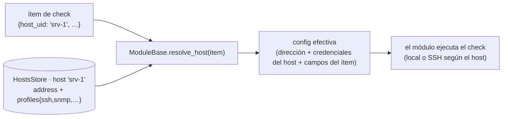

# Hosts (modelo host-céntrico)

Un **host** (servidor) es un objetivo que monitorizas — una **dirección** más sus
**perfiles de conexión por protocolo** (SSH, SNMP, base de datos, HTTP…). La idea central:
**definir la conexión de un servidor UNA sola vez** y que **todos los checks** de cualquier
módulo la reutilicen por referencia (`host_uid`), en vez de re-introducir dirección y
credenciales en cada módulo.

Todo el subsistema vive en `lib/core/hosts/` (parte de la capa fundacional, porque la
conexión a un servidor es propiedad del *servidor*, no de un check concreto).

> Los **campos** de cada protocolo se descubren de los módulos (`__host_profile__`) — ver
> [discovery.md → Perfiles de host](discovery.md#5-perfiles-de-host-__host_profile__). La
> **referencia de esa meta-clave** está en [schema.md](schema.md) / [modules.md](modules.md).
> La **UI y los endpoints** (sección Servers) en [web_admin.md → Servidores](web_admin.md).

---

## Qué es un host

| Pieza | Fichero | Rol |
|---|---|---|
| `HostsStore` | `lib/core/hosts/store.py` | Store relacional (tabla `hosts`): dirección + `profiles` por protocolo; secretos (contraseñas SSH/DB, claves SNMPv3, tokens) **cifrados en reposo** (`secret_manager`) |
| Catálogo de perfiles | `lib/core/hosts/profiles.py` | Construye, de cada `__host_profile__` de módulo, el mapa **protocolo → campos** que la UI usa para pintar los formularios por-protocolo |
| Resolución | `lib/core/hosts/resolve.py` | Primitivas sin store: `host_profile_specs()` (normaliza `__host_profile__`), `resolve_os()` |
| SSH | `lib/core/hosts/ssh_client.py` | Helpers SSH (paramiko, opcional): `connect_host`, `run_command`, `test_connection` |
| Ejecución | `lib/core/hosts/runner.py` | Ejecuta un comando en el host, **local o remoto por SSH** |
| Sonda | `lib/core/hosts/probe.py` | Ejecuta un check de un módulo una sola vez (asistente) |
| Migración | `lib/core/hosts/migrate.py` | Asistente inline→host (agrupar conexiones repetidas) |

Un host declarado como **`remote`** lleva una conexión SSH (usuario + contraseña / fichero de
clave / clave en línea) para que los módulos que necesitan **ejecutar comandos** en el
servidor (p.ej. `raid`) o **abrir un túnel** a través de él (p.ej. `datastore`) reutilicen las
mismas credenciales definidas una vez en el host.

---

## Cómo un check se liga a un host

Un ítem de check referencia un host por **`host_uid`** (o **`host_uids`** para un check
multi-bind que apunta a varios). En tiempo de ejecución, `ModuleBase.resolve_host()` **fusiona
la conexión del host sobre la config del ítem**; qué campos vienen del host lo declara el
módulo con `__host_profile__` en su `schema.json`:

```json
"__host_profile__": {"key": "snmp", "address_field": "host", "fields": ["host", "community"]}
```



- Un ítem **sin** `host_uid` (config inline clásica) se devuelve sin cambios → compatibilidad
  total con checks que llevan su conexión embebida.
- Los campos que aporta el host (los de `__host_profile__`) se **ocultan** en el formulario del
  check cuando está ligado a un host (no se re-piden).

---

## Ejecución host-aware (local vs SSH)

Los módulos de SO ejecutan sus comandos **donde vive el host**: en local o en el servidor
remoto por SSH, de forma transparente. El *contexto de host* que se pasa es:

```python
{"kind": "local"|"remote", "os": "<canónico>", "address": "<host>",
 "ssh": {ssh_port, ssh_user, ssh_password, ssh_key, ssh_key_string, ssh_verify_host}}
```

- **`ModuleBase.host_exec()`** — la ejecución host-aware desde un check (instancia del monitor).
- **`lib/core/hosts/runner.py`** — la variante para las acciones `discover` (que son
  classmethods, sin instancia): reciben el contexto de host y listan ítems en el host ligado.
  Nunca lanza excepción — los fallos vuelven como `('', <error>, -1)`.
- **`ssh_verify_host`** por host controla la política de host key (ver
  [security.md](security.md)): `True` = `known_hosts` + `RejectPolicy`; `False` (por defecto) =
  `AutoAddPolicy` (acepta hosts desconocidos en el primer contacto).

`paramiko` es dependencia **opcional**: sin él, `HAS_PARAMIKO=False` y `test_connection()`
devuelve una pista de instalación en vez de fallar.

---

## Migración asistida inline → hosts

Para bases instaladas antes del modelo host-céntrico, un asistente **agrupa** las conexiones
inline repetidas en hosts reutilizables. Dos funciones **puras** (sin I/O) en
`lib/core/hosts/migrate.py`:


- **`build_migration_plan()`** → propuesta: hosts candidatos + los ítems miembros. El agrupado
  es **seguro**: dos ítems se fusionan solo si comparten dirección **y** no discrepan en las
  credenciales de ningún protocolo compartido (un candidato nunca tiene credenciales ambiguas).
  Perfiles de distintos protocolos en la misma dirección se **agregan** (un servidor SNMP + un
  target ping + una BD en un host → un host con perfiles snmp/db).
- **`apply_to_modules()`** → aplica: crea los hosts y reescribe los ítems para que referencien
  `host_uid`.
- Endpoints y UI del asistente ("Detectar duplicados", preview/apply): [web_admin.md →
  Servidores](web_admin.md).

---

## Resolución compartida

`lib/core/hosts/resolve.py` reúne las primitivas que estaban duplicadas entre el monitor
(`ModuleBase.resolve_host`) y la ruta web de "ejecutar una acción de watchful", para que el
comportamiento (normalizar `__host_profile__`, resolver el SO) viva en un solo sitio:

- **`host_profile_specs(host_profile)`** — normaliza el `__host_profile__` de un módulo (un
  spec, varios o ninguno) a una lista de specs.
- **`resolve_os(...)`** — resuelve el SO canónico del host (para elegir el colector correcto).

---

## Dónde se gestiona

- **UI + endpoints** (crear/editar hosts, perfiles por protocolo, probar conexión, migración):
  [web_admin.md → Servidores](web_admin.md).
- **Meta-clave `__host_profile__`** (referencia de campos): [schema.md](schema.md) y
  [modules.md](modules.md).
- **Descubrimiento** del catálogo protocolo→campos: [discovery.md](discovery.md#5-perfiles-de-host-__host_profile__).
- **Seguridad** de la ejecución remota (`ssh_verify_host`, hardening del host):
  [security.md](security.md) y [ssh-hardening.md](ssh-hardening.md).
