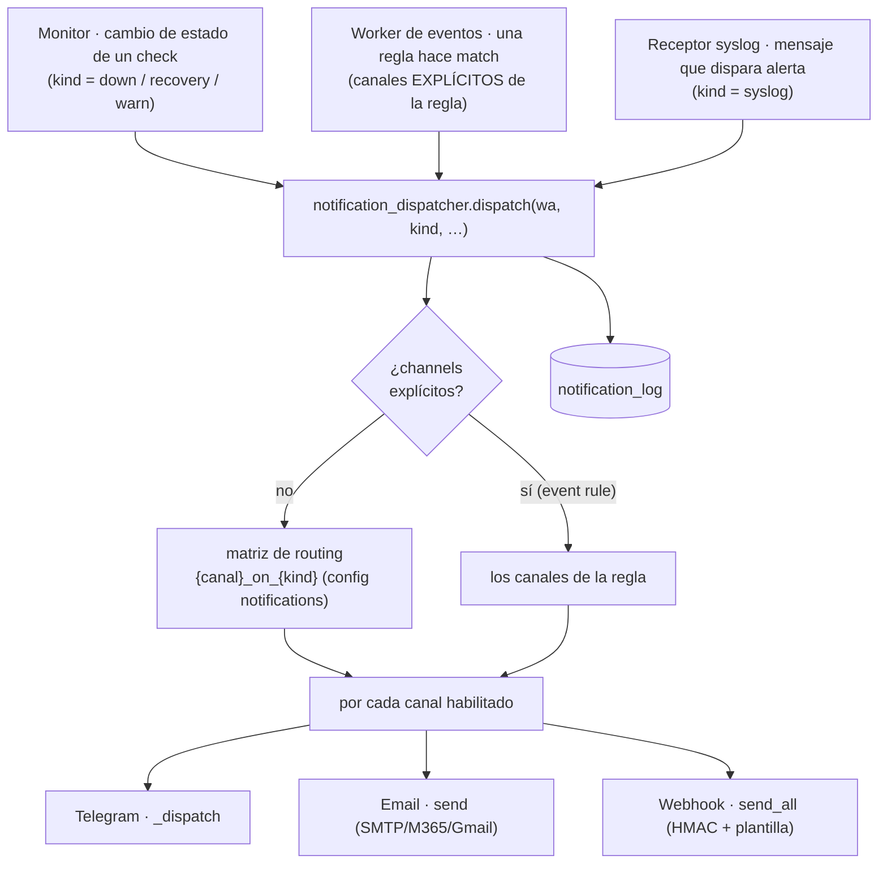

# Notificaciones

El subsistema de notificaciones (`lib/core/notify`, **sin Flask**) es la capa de **entrega**:
un **dispatcher central** enruta cada evento a los canales configurados —
**Telegram**, **Email** y **Webhooks**. Lo usan el monitor, el worker de eventos y el
receptor syslog, y también corre en los procesos de fondo (daemons), por eso vive en la
librería general y no bajo el web.

Este documento cubre los canales, el dispatcher, el flujo evento→notificación, la matriz de
routing y las particularidades de cada canal (firma HMAC, plantillas).

> La **generación** de eventos (worker que drena syslog/audit, reglas, cooldown) está en
> [architecture.md → Procesamiento de Eventos](architecture.md#procesamiento-de-eventos-notificaciones)
> y el servicio en [services.md](services.md). Aquí se documenta lo que pasa **a partir** de
> `dispatch()`.

---

## Canales

| Canal | Transporte | Config (sección) | Notas |
|---|---|---|---|
| **Telegram** | Bot API | `telegram` | Vía `lib/providers/telegram.py`; agrupa mensajes opcional |
| **Email** | SMTP · Microsoft 365 (Graph) · Gmail | `email` | Cuerpo HTML por plantillas i18n; destinatarios múltiples |
| **Webhook** | HTTP POST | `webhooks` (lista) | **Varios destinos**, firma **HMAC** opcional, plantilla de cuerpo |

Cada canal expone su envío en `lib/core/notify/<canal>/notify.py`; el webhook además guarda
sus destinos en `lib/core/notify/webhook/store.py` (`WebhooksStore`, tabla `webhooks`).

---

## El dispatcher central

Punto de entrada único (`lib/core/notify/notification_dispatcher.py`):

```python
dispatch(wa, kind, module='', item='', status='', message='',
         timestamp='', channels=None, webhook_ids=None) -> {canal: (ok, mensaje)}
```

- **`kind`** — el tipo de evento: `down`, `recovery`, `warn`, `syslog`, `audit`, `test`.
- **Selección de canales:**
  - *por defecto* → la **matriz de routing** (`{canal}_on_{kind}` de la sección
    `notifications`): se envía a cada canal cuyo flag esté activo para ese `kind`.
  - *explícita* (`channels=[…]`) → usada por el **gestor de reglas de eventos**, donde
    **cada regla elige sus propios canales** (ignora la matriz global).
- **`webhook_ids`** — restringe el canal webhook a destinos concretos (vacío → todos los
  webhooks habilitados).
- **Devuelve** `{canal: (ok, mensaje)}` por cada canal intentado (los no disparados se omiten);
  el resultado se registra en `notification_log`.

---

## Flujo: quién dispara → dispatch → canales



- **Monitor**: al detectar un **cambio de estado** de un check (no hay spam si el estado no
  cambia) llama a `dispatch(kind=down|recovery|warn)` → matriz global.
- **Worker de eventos**: al hacer match una regla sobre auditoría/syslog, llama a `dispatch`
  con los **canales de la regla** (`channels=…`) → salta la matriz global.
- **Receptor syslog**: mensajes marcados como alerta → `dispatch(kind=syslog)`.

---

## Matriz de routing (`notifications`)

Un flag por **(canal × tipo)**; solo se envía por el canal si su flag está activo para ese
tipo. Editable en *Config → Notificaciones*.

| | `down` | `recovery` | `warn` | `syslog` |
|---|---|---|---|---|
| **Telegram** | `telegram_on_down` | `telegram_on_recovery` | `telegram_on_warn` | `telegram_on_syslog` |
| **Email** | `email_on_down` | `email_on_recovery` | `email_on_warn` | `email_on_syslog` |
| **Webhook** | `webhook_on_down` | `webhook_on_recovery` | `webhook_on_warn` | `webhook_on_syslog` |

(Todos `bool`, por defecto `false`. Detalle de las claves en
[configuration.md → notifications](configuration.md#sección-notifications).) Las **reglas de
eventos** NO usan esta matriz: cada regla lleva su propia lista de canales.

---

## Webhook: HMAC + plantilla + múltiples destinos

Los webhooks son una **lista** (cada uno con URL, método, headers, timeout), no un campo
`sección|campo` — por eso viven en su tabla (`webhooks`) con CRUD propia, no en la config
editable normal.

- **Firma HMAC** (opcional): con `secret`, se firma el cuerpo y se envía en el header
  `secret_header` (por defecto `X-Signature`), para que el receptor verifique autenticidad.
- **Plantilla de cuerpo** (`body_template`): plantilla del JSON POST con variables
  `{kind}`, `{module}`, `{item}`, `{status}`, `{message}`, `{timestamp}`.
- **Destinos concretos**: `dispatch(..., webhook_ids=[…])` limita a webhooks específicos
  (lo usan reglas de evento que apuntan a un destino).

Config y campos: [configuration.md → webhooks](configuration.md#sección-webhooks-en-configjson-auto-gestionada);
prueba de un webhook: endpoint en [web_admin.md](web_admin.md).

---

## Email: SMTP / Microsoft 365 / Gmail + plantillas

El canal email (`lib/core/notify/email/notify.py`) soporta tres transportes: **SMTP**
genérico, **Microsoft 365** (vía Graph, `lib/providers/entraid/mail.py`) y **Gmail**. El
cuerpo se construye con **plantillas HTML i18n** (`lib/core/notify/email/templates.py`),
traducidas con el mismo sistema que el resto de la UI (ver
[i18n.md](i18n.md)) y personalizables desde el panel
(`/api/v1/notify/templates` · `notif_templates` / `notif_html_templates`).

Destinatarios: lista en la config `email`; se parsean múltiples direcciones.

---

## Dónde se configura y se prueba

- **Config** de cada canal + la matriz: [configuration.md](configuration.md) (secciones
  `telegram`, `email`, `webhooks`, `notifications`).
- **UI y endpoints** (probar canal, gestionar webhooks, editar plantillas):
  [web_admin.md](web_admin.md).
- **Reglas de evento** (qué eventos de audit/syslog notifican y por qué canales):
  [architecture.md → Procesamiento de Eventos](architecture.md#procesamiento-de-eventos-notificaciones)
  + el servicio `events` en [services.md](services.md).
