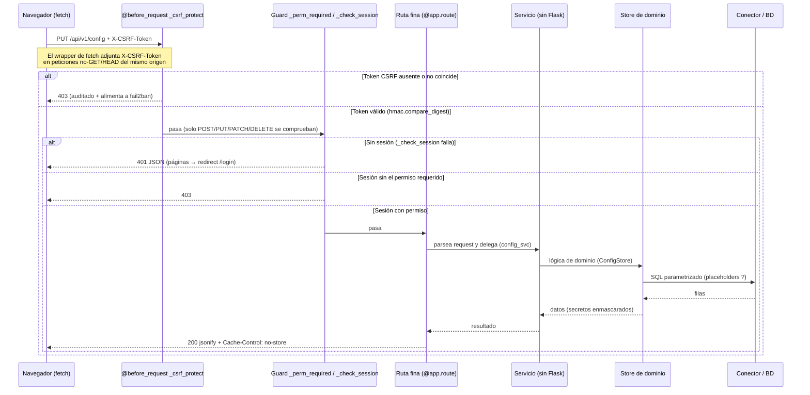
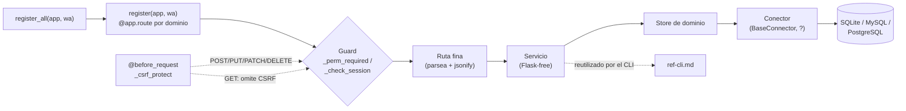

# Referencia de la API REST

> Inventario completo de la superficie HTTP de ServiceSentry, agrupado por dominio.
>
> Fuente de verdad: las definiciones de ruta en el código (`register(app, wa)` de cada
> `routes.py`). Este documento se generó leyendo esas definiciones.

Para el detalle funcional de cada subsistema ver [explica-web-admin.md](explica-web-admin.md),
[explica-servicios.md](explica-servicios.md), [explica-seguridad.md](explica-seguridad.md) y [explica-notificaciones.md](explica-notificaciones.md).

---

## Arquitectura de rutas

**No hay Blueprints de Flask.** Cada ruta es un `@app.route(...)` declarado dentro de una
función `register(app, wa)` a nivel de módulo. El registro está centralizado:

- [lib/web_admin/routes/__init__.py:96](../src/lib/web_admin/routes/__init__.py#L96) —
  `register_all(app, wa)` importa el símbolo `register` de cada `routes.py` de dominio /
  servicio / provider y los invoca en secuencia. Su docstring es el índice autoritativo de
  toda la superficie de URLs.
- Cada `register(app, wa)` recibe el `app` de Flask más `wa` (el objeto `WebAdmin`,
  [lib/web_admin/app.py](../src/lib/web_admin/app.py)), que aporta los decoradores y el
  estado/ayudantes compartidos.

**Rutas finas + capa de servicio sin Flask.** Los `routes.py` son delgados: parsean la
request, aplican los guards de permiso, delegan en un módulo de servicio co-localizado y sin
dependencia de Flask, y hacen `jsonify`. Ejemplos: `lib/core/users/routes.py` → `users_svc`;
`lib/core/config/routes.py:99` → `config_svc.build_config_schema`; `lib/providers/scim/routes.py`
→ `ScimService`. Ver [ref-cli.md](ref-cli.md) (la misma capa de servicio la reutiliza el CLI).

### Guards de permiso

| Decorador | Efecto | Fuente |
|---|---|---|
| `wa._perm_required(*perms)` | Requiere **cualquiera** de los permisos listados | [app.py:339](../src/lib/web_admin/app.py#L339) |
| `wa._login_required` | Solo sesión, sin permiso concreto | [app.py:354](../src/lib/web_admin/app.py#L354) |

Ambos llaman a `self._check_session()`. Una request `/api/*` sin autenticar recibe **401
JSON**; el resto redirige a `/login`. `_admin_required`/`_write_required` son shims obsoletos
sin uso en rutas. Ver el catálogo completo de permisos en [explica-seguridad.md](explica-seguridad.md) y
[explica-web-admin.md](explica-web-admin.md).

### Autenticación, CSRF y versionado

- **Prefijo de versión:** las APIs JSON internas que consume el frontend usan `/api/v1/...`
  (cookie de sesión + CSRF). Las superficies externas/estándar quedan fuera: `/scim/v2/*`
  (RFC 7643/7644), `/auth/<provider>/*` (callbacks de IdP, Teams). No existe `/api/v2`.
- **CSRF:** double-submit token. `@app.before_request _csrf_protect`
  ([app.py:980](../src/lib/web_admin/app.py#L980)) solo comprueba `POST/PUT/PATCH/DELETE`
  ([lib/security/csrf.py:21](../src/lib/security/csrf.py#L21)). El frontend adjunta
  `X-CSRF-Token` automáticamente en el wrapper de `fetch`
  ([core/_api.html:22](../src/lib/web_admin/templates/partials/core/_api.html#L22)).
- **Prefijos exentos de CSRF** (auto-declarados vía `wa._register_csrf_exempt(...)`, no
  hardcodeados): `/scim/`, `/auth/oidc/callback`, `/auth/saml2/acs`, `/auth/msteams/tab`,
  `/auth/msteams/sso`, `/auth/msteams/messages`. Estos endpoints se autentican por su propio
  protocolo (Bearer SCIM con rate-limit por IP, JWT de Bot Framework, respuesta del IdP).
- Respuestas `/api/` llevan `Cache-Control: no-store`. `MAX_CONTENT_LENGTH = 8 MiB`.

### Convenciones de request/response

- La mayoría de endpoints de escritura reciben y devuelven JSON. Los de creación/actualización
  suelen responder `{ok: true, ...}` o el recurso resultante; los de error devuelven
  `{message: "..."}` con el código HTTP correspondiente.
- **Secretos**: en las respuestas de listado/lectura los campos sensibles van **enmascarados**
  (credenciales, hosts, webhooks); al guardar, un valor enmascarado sin cambios se **restaura**
  desde el valor cifrado en BD. Ver [explica-seguridad.md](explica-seguridad.md).
- Códigos típicos: `200` OK, `400` payload inválido, `401` sin sesión, `403` sin permiso o
  fallo CSRF, `404` recurso inexistente, `409` conflicto (p. ej. nombre duplicado), `429`
  rate-limit (login / SCIM).

---

## Flujo de una llamada

Toda petición interna `/api/v1/...` recorre siempre las mismas etapas: el guard CSRF global,
el guard de permiso del decorador, la ruta fina, la capa de servicio sin Flask, el store de
dominio y, por debajo, el conector de BD. No hay más middleware que el descrito aquí.

### Flujo de una llamada API

El siguiente `sequenceDiagram` traza un `PUT` (sujeto a comprobación CSRF), con las tres ramas
de rechazo posibles y la cabecera `Cache-Control: no-store` que llevan las respuestas `/api/`.



### Flujo de llamadas por capas

El `flowchart` muestra el recorrido estático: desde el registro centralizado de rutas hasta la
BD. La misma capa de servicio (sin Flask) la reutiliza el CLI — ver [ref-cli.md](ref-cli.md).



### Ejemplo con cuerpo (PUT /api/v1/config)

Ampliando el ejemplo curl de [Escritura (PUT con CSRF)](#escritura-put-con-csrf), un guardado
parcial versionado con su cuerpo de request y las dos formas de respuesta:

**Request** — cabecera y cuerpo enviados:

```http
PUT /api/v1/config HTTP/1.1
Content-Type: application/json
X-CSRF-Token: 9f2c…a71b
Cookie: session=…

{
  "global|log_level": "info",
  "monitoring|interval": 60
}
```

**Respuesta 200 (OK)** — lleva `Cache-Control: no-store`:

```json
{
  "ok": true,
  "versions": {
    "global|log_level": "c3a1f0",
    "monitoring|interval": "b28d94"
  }
}
```

Los `versions` son los tokens de versión por campo que el frontend usa para el guardado
optimista (poll ligero vía `GET /api/v1/config/versions`).

**Respuesta 403 (fallo CSRF)** — token ausente o no coincidente; el intento se audita y se
alimenta a fail2ban:

```json
{
  "message": "CSRF token missing or invalid"
}
```

---

## Autenticación / sesión — [routes/auth.py](../src/lib/web_admin/routes/auth.py)

| Método | Ruta | Permiso | Propósito |
|---|---|---|---|
| GET, POST | `/login` | público | Página de login local + submit (rate-limit por IP) |
| POST | `/logout` | sesión (+CSRF) | Cierra sesión, revoca el token |

## Páginas / UI

| Método | Ruta | Permiso | Propósito | Fuente |
|---|---|---|---|---|
| GET | `/` | público→redirect | Anónimo→`/login`, si no landing page | pages.py:36 |
| GET | `/admin` | sesión | Dashboard de administración | pages.py:76 |
| GET | `/overview` | sesión | Dashboard Overview | pages.py:82 |
| GET | `/overview2` | sesión | Overview experimental (Alpine) | overview2.py:39 |
| GET | `/status` | público\* | Estado público; invitados solo si `public_status=True` | status.py:84 |
| GET | `/lang/<code>` | público (GET) | Cambia idioma UI y lo persiste | ui.py:22 |
| GET | `/api/v1/me` | sesión | Usuario actual + lista efectiva de `permissions` | ui.py:42 |
| GET | `/api/v1/health` | **público** | `{startup_id}` para chequeo de versión cliente | ui.py:91 |
| GET | `/api/v1/util/token` | `config_edit` | Token hex aleatorio para la UI de config | util.py:21 |

## Configuración — [lib/core/config/routes.py](../src/lib/core/config/routes.py)

| Método | Ruta | Permiso | Propósito |
|---|---|---|---|
| GET | `/api/v1/config` | `config_view`\|`config_edit` | Config efectiva + tokens de versión por campo |
| GET | `/api/v1/config/versions` | `config_view`\|`config_edit` | Poll ligero: solo tokens de versión |
| GET | `/api/v1/config/layout` | `config_view`\|`config_edit` | Layout de la UI de config (tabs→cards) |
| GET | `/api/v1/config/schema` | `config_view`\|`config_edit` | Metadatos UI a nivel de campo |
| PUT | `/api/v1/config` | `config_edit` | Guardado parcial versionado |

## Usuarios — [lib/core/users/routes.py](../src/lib/core/users/routes.py)

| Método | Ruta | Permiso | Propósito |
|---|---|---|---|
| GET | `/api/v1/users` | `users_view` | Todos los usuarios, sin hashes |
| POST | `/api/v1/users` | `users_add` | Crear usuario |
| PUT | `/api/v1/users/<username>` | `users_edit` | Actualizar (rol/nombre/contraseña/grupos) |
| DELETE | `/api/v1/users/<username>` | `users_delete` | Borrar usuario |
| PUT | `/api/v1/users/me/preferences` | sesión | Preferencias propias (lang/dark/landing/table_config/layout) |
| PUT | `/api/v1/users/me/password` | sesión | Cambiar contraseña propia (requiere `current_password`) |

## Roles — [lib/core/roles/routes.py](../src/lib/core/roles/routes.py)

| Método | Ruta | Permiso | Propósito |
|---|---|---|---|
| GET | `/api/v1/roles` | `roles_view` | Todos los roles, keyed por UID |
| POST | `/api/v1/roles` | `roles_add` | Crear rol personalizado |
| PUT | `/api/v1/roles/<uid>` | `roles_edit` | Actualizar nombre/permisos (built-in: solo nombre) |
| DELETE | `/api/v1/roles/<uid>` | `roles_delete` | Borrar rol personalizado |

## Grupos — [lib/core/groups/routes.py](../src/lib/core/groups/routes.py)

| Método | Ruta | Permiso | Propósito |
|---|---|---|---|
| GET | `/api/v1/groups` | `groups_view` | Todos los grupos, keyed por UID |
| POST | `/api/v1/groups` | `groups_add` | Crear grupo |
| PUT | `/api/v1/groups/<uid>` | `groups_edit` | Actualizar etiqueta/desc/roles/miembros |
| DELETE | `/api/v1/groups/<uid>` | `groups_delete` | Borrar grupo |

## Sesiones — [lib/core/sessions/routes.py](../src/lib/core/sessions/routes.py)

| Método | Ruta | Permiso | Propósito |
|---|---|---|---|
| GET | `/api/v1/sessions` | `sessions_view` | Sesiones activas, keyed por uid |
| POST | `/api/v1/sessions/invalidate` | `sessions_revoke` | Revocar TODAS las sesiones |
| POST | `/api/v1/sessions/revoke/<uid>` | `sessions_revoke` | Revocar una sesión |
| POST | `/api/v1/sessions/revoke-user/<username>` | `sessions_revoke` | Revocar todas las de un usuario |

## Auditoría — [lib/core/audit/routes.py](../src/lib/core/audit/routes.py)

| Método | Ruta | Permiso | Propósito |
|---|---|---|---|
| GET | `/api/v1/audit` | `audit_view` | Entradas, más recientes primero |
| DELETE | `/api/v1/audit` | `audit_delete` | Vaciar todo |
| DELETE | `/api/v1/audit/<int:entry_id>` | `audit_delete` | Borrar una entrada |

## Credenciales — [lib/core/credentials/routes.py](../src/lib/core/credentials/routes.py)

| Método | Ruta | Permiso | Propósito |
|---|---|---|---|
| GET | `/api/v1/credentials` | sesión | Listar, secretos enmascarados |
| POST | `/api/v1/credentials` | sesión + `credentials_add` (inline) | Crear |
| POST | `/api/v1/credentials/<uid>/clone` | sesión | Duplicar |
| GET | `/api/v1/credentials/<uid>/usage` | sesión | Dónde se referencia |
| PUT | `/api/v1/credentials/<uid>` | sesión | Actualizar (secretos enmascarados restaurados) |
| DELETE | `/api/v1/credentials/<uid>` | sesión | Borrar |
| POST | `/api/v1/credentials/test` | sesión | Abrir conexión SSH para verificar |

## Hosts — [lib/core/hosts/routes.py](../src/lib/core/hosts/routes.py)

> Todas son `@login_required`; el permiso se aplica **inline** por la familia `servers_*` y
> `_has_server_permission(uid, acción)` (permiso por host). Ver [explica-hosts.md](explica-hosts.md).

| Método | Ruta | Permiso (inline) | Propósito |
|---|---|---|---|
| GET | `/api/v1/hosts` | `servers_view` (global) o view por host | Listar hosts, secretos enmascarados |
| GET | `/api/v1/hosts/<uid>/status` | `view` por host | Últimos resultados de checks |
| POST | `/api/v1/hosts` | `servers_edit` | Crear host |
| POST | `/api/v1/hosts/<uid>/clone` | `servers_edit` | Clonar host |
| PUT | `/api/v1/hosts/<uid>` | `edit` por host | Actualizar host |
| DELETE | `/api/v1/hosts/<uid>` | `delete` por host | Borrar host |
| POST | `/api/v1/hosts/test_ssh` | `edit` por host / `servers_edit` | Probar SSH sin guardar |
| POST | `/api/v1/hosts/test_check` | `edit` por host | Ejecutar un check una vez |
| POST | `/api/v1/hosts/test` | `edit` por host | Test completo: SSH + todos los checks |
| GET | `/api/v1/hosts/migrate/preview` | `servers_edit` | Propuesta de migración, secretos enmascarados |
| POST | `/api/v1/hosts/migrate/apply` | `servers_edit` | Crear hosts para candidatos aceptados |

## Módulos — [lib/core/modules/routes.py](../src/lib/core/modules/routes.py)

| Método | Ruta | Permiso | Propósito |
|---|---|---|---|
| GET | `/api/v1/modules` | sesión | Módulos que el usuario puede ver |
| PUT | `/api/v1/modules` | sesión | Sobrescribir config de módulos |
| GET | `/api/v1/modules/status` | `checks_view`\|`checks_run` | Estado actual de checks |
| DELETE | `/api/v1/modules/status` | `checks_run` | Vaciar tabla check_state |
| POST | `/api/v1/modules/checks/run` | `checks_run` | Ejecutar checks bajo demanda |
| GET | `/api/v1/modules/overview` | `overview_view` | Snapshot ligero del dashboard Overview |
| GET, POST | `/api/v1/modules/watchfuls/<module>/<action>` | `modules_view` (+ inline si muta) | Despacha `Watchful.<action>` del módulo |

## Overview — [lib/core/overview/routes.py](../src/lib/core/overview/routes.py)

| Método | Ruta | Permiso | Propósito |
|---|---|---|---|
| GET | `/api/v1/overview/widget/<wid>` | sesión | Datos autocontenidos de un widget |
| GET | `/api/v1/overview/default-layout` | `overview_view` | Layout por defecto de la organización |
| PUT | `/api/v1/overview/default-layout` | `overview_set_default` | Guardar layout por defecto |
| POST | `/api/v1/overview/reset-factory` | `overview_reset_factory` | Resetear dashboard propio a fábrica |

## Historial — [lib/core/history/routes.py](../src/lib/core/history/routes.py)

| Método | Ruta | Permiso | Propósito |
|---|---|---|---|
| GET | `/api/v1/history/index` | `history_view` | Metadatos de todas las series |
| GET | `/api/v1/history` | `history_view` | Serie temporal de un (module, key) |
| DELETE | `/api/v1/history` | `history_delete` | Borrar historial de un (module, key) |
| DELETE | `/api/v1/history/all` | `history_delete` | Vaciar toda la BD de historial |
| POST | `/api/v1/history/test-write` | `history_view` | Test de escritura + lectura |
| GET | `/api/v1/history/diag` | `history_view` | Estado interno de diagnóstico |

## Notificaciones — plantillas de email — [lib/core/notify/email/template_routes.py](../src/lib/core/notify/email/template_routes.py)

| Método | Ruta | Permiso | Propósito |
|---|---|---|---|
| GET | `/api/v1/notify/templates` | `config_view`\|`config_edit` | Defaults + overrides por idioma (legacy) |
| PUT | `/api/v1/notify/templates/<lang>` | `config_edit` | Guardar overrides de texto (legacy) |
| DELETE | `/api/v1/notify/templates/<lang>` | `config_edit` | Resetear overrides de un idioma |
| GET | `/api/v1/notify/text-packages` | `config_view`\|`config_edit` | Descubrir paquetes de texto editables |
| PUT | `/api/v1/notify/text-packages/<lang>` | `config_edit` | Reemplazar todos los overrides de un idioma |
| GET | `/api/v1/notify/html-templates` | `config_view`\|`config_edit` | Cuerpos HTML personalizados guardados |
| GET | `/api/v1/notify/html-templates/<tpl>/built-in` | `config_view`\|`config_edit` | HTML built-in renderizado |
| POST | `/api/v1/notify/html-templates/<tpl>/preview` | `config_view`\|`config_edit` | Preview en vivo del HTML enviado |
| PUT | `/api/v1/notify/html-templates/<tpl>/<lang>` | `config_edit` | Guardar cuerpo HTML personalizado |
| DELETE | `/api/v1/notify/html-templates/<tpl>/<lang>` | `config_edit` | Borrar cuerpo HTML personalizado |

## Notificaciones — canales

| Método | Ruta | Permiso | Propósito | Fuente |
|---|---|---|---|---|
| GET | `/api/v1/notify/recipients/suggest` | `config_edit` | Typeahead: usuarios + grupos activos | email/routes.py:17 |
| POST | `/api/v1/notify/email/test` | `config_edit` | Enviar email de prueba | email/routes.py:38 |
| POST | `/api/v1/notify/telegram/test` | `config_edit` | Enviar Telegram de prueba | telegram/routes.py:22 |
| POST | `/api/v1/notify/webhook/test` | `config_edit` | Probar webhook con config arbitraria | webhook/test_routes.py:14 |
| GET | `/api/v1/notify/webhooks` | `config_view`\|`config_edit` | Listar webhooks | webhook/routes.py:53 |
| POST | `/api/v1/notify/webhooks` | `config_edit` | Crear webhook | webhook/routes.py:58 |
| PUT | `/api/v1/notify/webhooks/<wh_id>` | `config_edit` | Actualizar webhook | webhook/routes.py:95 |
| DELETE | `/api/v1/notify/webhooks/<wh_id>` | `config_edit` | Borrar webhook | webhook/routes.py:146 |
| POST | `/api/v1/notify/webhooks/<wh_id>/test` | `config_edit` | Probar webhook guardado | webhook/routes.py:158 |
| GET | `/api/v1/notify/msteams/channels` | `config_view`\|`config_edit` | Listar canales Teams | msteams/routes.py:48 |
| POST | `/api/v1/notify/msteams/channels` | `config_edit` | Crear canal | msteams/routes.py:53 |
| PUT | `/api/v1/notify/msteams/channels/<cid>` | `config_edit` | Actualizar canal | msteams/routes.py:75 |
| DELETE | `/api/v1/notify/msteams/channels/<cid>` | `config_edit` | Borrar canal | msteams/routes.py:114 |
| POST | `/api/v1/notify/msteams/channels/<cid>/test` | `config_edit` | Probar canal | msteams/routes.py:124 |
| POST | `/api/v1/notify/msteams/test` | `config_edit` | Probar envío en modo usuario | msteams/routes.py:138 |
| GET | `/api/v1/notify/msteams/app-package` | `config_view`\|`config_edit` | Descargar paquete de app Teams | msteams/routes.py:155 |
| POST | `/auth/msteams/messages` | Bot JWT (CSRF-exempt) | Webhook entrante del bot Teams | msteams/routes.py:179 |

## Gestor de servicios — [lib/services/manager/routes.py](../src/lib/services/manager/routes.py)

| Método | Ruta | Permiso | Propósito |
|---|---|---|---|
| GET | `/api/v1/services` | `services_view` | Estado de todos los servicios registrados |
| POST | `/api/v1/services/<name>/<action>` | `services_control` | start/stop de un servicio controlable |
| POST | `/api/v1/services/<name>/command/<action>` | `services_control` | Comando one-shot (run_now/clear_status/reload/prune) |

## Scheduler de monitorización — [lib/services/monitoring/routes.py](../src/lib/services/monitoring/routes.py)

| Método | Ruta | Permiso | Propósito |
|---|---|---|---|
| GET | `/api/v1/monitoring/status` | `checks_run` | Estado del scheduler |
| POST | `/api/v1/monitoring/start` | `checks_run` | Arrancar scheduler |
| POST | `/api/v1/monitoring/stop` | `checks_run` | Parar scheduler |
| PUT | `/api/v1/monitoring/config` | `checks_run` | Actualizar intervalo/autostart |

## Syslog — [lib/services/syslog/routes.py](../src/lib/services/syslog/routes.py)

| Método | Ruta | Permiso | Propósito |
|---|---|---|---|
| GET | `/api/v1/syslog` | `syslog_view` | Mensajes, más recientes primero, filtrados |
| GET | `/api/v1/syslog/stats` | `syslog_view` | Conteos agregados para gráficas |
| GET | `/api/v1/syslog/facets` | `syslog_view` | Hosts/sources/apps distintos |
| GET | `/api/v1/syslog/status` | `syslog_view` | Estado del listener |
| DELETE | `/api/v1/syslog` | `syslog_delete` | Borrar todos los mensajes |
| GET | `/api/v1/syslog/drops` | `syslog_view` | Emisores rechazados |
| DELETE | `/api/v1/syslog/drops` | `syslog_delete` | Resetear conteo de rechazados |
| DELETE | `/api/v1/syslog/drops/<uid>` | `syslog_delete` | Quitar un source rechazado |

## Eventos — [lib/services/events/routes.py](../src/lib/services/events/routes.py)

| Método | Ruta | Permiso | Propósito |
|---|---|---|---|
| GET | `/api/v1/event/rules` | `events_view`/add/edit/delete | Listar reglas de evento |
| POST | `/api/v1/event/rules` | `events_add` | Crear regla |
| PUT | `/api/v1/event/rules/<rid>` | `events_edit` | Actualizar regla |
| DELETE | `/api/v1/event/rules/<rid>` | `events_delete` | Borrar regla |
| POST | `/api/v1/event/rules/<rid>/test` | `events_edit` | Disparar regla con mensaje de prueba |
| GET | `/api/v1/event/notifications` | `events_notify_view` | Log de notificaciones |
| DELETE | `/api/v1/event/notifications` | `events_notify_delete` | Vaciar log de notificaciones |

## IP bans (fail2ban) — [lib/services/ipban/routes.py](../src/lib/services/ipban/routes.py)

| Método | Ruta | Permiso | Propósito |
|---|---|---|---|
| GET | `/api/v1/ipbans` | `ipban_ban_view` | Baneos activos + watchlist + estado |
| POST | `/api/v1/ipbans` | `ipban_ban_add` | Banear una IP manualmente |
| GET | `/api/v1/ipbans/services` | `ipban_service_edit`\|`config_view`\|`config_edit` | Servicios expuestos + block actions |
| POST | `/api/v1/ipbans/services/action` | `ipban_service_edit`\|`config_edit` | Fijar block action de un servicio |
| GET | `/api/v1/ipbans/banlog` | `ipban_history_view` | Historial banned/escalated/unbanned |
| GET | `/api/v1/ipbans/history` | ban_view/history_view/whitelist_view | Intentos recientes de una IP |
| POST | `/api/v1/ipbans/action` | `ipban_ban_edit` | Override de respuesta por baneo |
| POST | `/api/v1/ipbans/clear` | `ipban_watchlist_clear` | Quitar IP de la watchlist |
| GET | `/api/v1/ipbans/whitelist` | `ipban_whitelist_view` | Entradas never-ban |
| POST | `/api/v1/ipbans/whitelist` | `ipban_whitelist_add` | Añadir never-ban |
| DELETE | `/api/v1/ipbans/whitelist/<uid>` | `ipban_whitelist_delete` | Quitar never-ban |
| DELETE | `/api/v1/ipbans/<path:ip>` | `ipban_ban_delete` | Levantar un baneo |

## Provider — LDAP — [lib/providers/ldap/routes.py](../src/lib/providers/ldap/routes.py)

| Método | Ruta | Permiso | Propósito |
|---|---|---|---|
| POST | `/api/v1/auth/ldap/test` | `config_edit` | Probar conexión / credenciales LDAP |
| POST | `/api/v1/auth/ldap/group_lookup` | `config_edit` | Resolver nombre de grupo por DN |
| POST | `/api/v1/auth/ldap/groups` | `config_edit` | Listar grupos del directorio |

## Provider — Entra ID (JSON) — [lib/providers/entraid/routes.py](../src/lib/providers/entraid/routes.py)

| Método | Ruta | Permiso | Propósito |
|---|---|---|---|
| POST | `/api/v1/auth/entraid/groups` | `config_edit` | Listar grupos del directorio vía Graph |
| POST | `/api/v1/auth/entraid/group_lookup` | `config_edit` | Buscar un grupo por ID |
| POST | `/api/v1/auth/entraid/saml2/device-code` | `config_edit` | Device-code: registrar app SAML2 |
| POST | `/api/v1/auth/entraid/saml2/secret/device-code` | `config_edit` | Device-code: añadir secreto Graph a app SAML2 |
| POST | `/api/v1/auth/entraid/saml2/device-poll` | `config_edit` | Poll del flujo device-code SAML2 |
| POST | `/api/v1/auth/entraid/scim/device-code` | `config_edit` | Device-code: registrar app SCIM |
| POST | `/api/v1/auth/entraid/scim/device-poll` | `config_edit` | Poll del flujo device-code SCIM |
| POST | `/api/v1/auth/entraid/oidc/secret/device-code` | `config_edit` | Device-code: iniciar rotación del secreto de la app OIDC existente |
| POST | `/api/v1/auth/entraid/oidc/secret/device-poll` | `config_edit` | Poll; al completar emite un secreto nuevo (Graph `addPassword`) y lo persiste con su caducidad |
| POST | `/api/v1/auth/entraid/check-permissions` | `credentials_add`\|`credentials_edit` | Verificar permisos Graph de una credencial app-only |
| POST | `/api/v1/auth/entraid/provision/device-code` | `credentials_add`\|`credentials_edit` | Device-code: provisionar app Entra genérica |
| POST | `/api/v1/auth/entraid/provision/device-poll` | `credentials_add`\|`credentials_edit` | Poll del flujo de provisión genérica |

## Provider — Teams SSO — [lib/providers/entraid/sso_routes.py](../src/lib/providers/entraid/sso_routes.py)

| Método | Ruta | Permiso | Propósito |
|---|---|---|---|
| GET | `/auth/msteams/tab` | público (CSRF-exempt) | Renderiza la página de pestaña personal de Teams |
| POST | `/auth/msteams/sso` | token SSO de Teams (CSRF-exempt) | Valida token de Teams, establece sesión |

## Provider — OIDC — [lib/providers/oidc/routes.py](../src/lib/providers/oidc/routes.py)

| Método | Ruta | Permiso | Propósito |
|---|---|---|---|
| GET | `/auth/oidc/login` | público | Inicia login OIDC, redirige al IdP |
| GET | `/auth/oidc/callback` | token IdP (CSRF-exempt) | Intercambia el code, sincroniza usuario, abre sesión |

## Provider — SAML2 — [lib/providers/saml/routes.py](../src/lib/providers/saml/routes.py)

| Método | Ruta | Permiso | Propósito |
|---|---|---|---|
| GET | `/auth/saml2/login` | público | Inicia login SAML2 (SP-initiated) |
| POST | `/auth/saml2/acs` | respuesta SAML (CSRF-exempt) | Assertion Consumer Service |
| GET | `/auth/saml2/metadata` | público | Sirve el metadata XML del SP |

## SCIM 2.0 — [lib/providers/scim/routes.py](../src/lib/providers/scim/routes.py)

> Todas gated por Bearer-token en un `before_request` (rate-limit por IP), CSRF-exempt.

| Método | Ruta | Propósito |
|---|---|---|
| GET | `/scim/v2/ServiceProviderConfig` | Doc de capacidades del provider |
| GET | `/scim/v2/ResourceTypes` | Tipos de recurso soportados |
| GET | `/scim/v2/Schemas` | Esquemas soportados |
| GET / POST | `/scim/v2/Users` | Listar/filtrar (paginado) / Crear |
| GET / PUT / PATCH / DELETE | `/scim/v2/Users/<uid>` | Leer / reemplazar / parchear / borrar |
| GET / POST | `/scim/v2/Groups` | Listar/filtrar / Crear |
| GET / PUT / PATCH / DELETE | `/scim/v2/Groups/<gid>` | Leer / reemplazar / parchear / borrar |

## Plano de control inter-proceso (no Flask) — [lib/services/control_server.py](../src/lib/services/control_server.py)

> `ThreadingHTTPServer` de stdlib en su propio puerto, fuera de `register_all`. Solo relevante
> en modo microservicios. Ver [explica-servicios.md](explica-servicios.md) y [caso-kubernetes.md](caso-kubernetes.md).

| Método | Ruta | Auth | Propósito |
|---|---|---|---|
| GET | `/control/health` | ninguna | Probe k8s: `{ok, key, version}` |
| GET | `/control/info` | Bearer | Snapshot en vivo del servicio |
| POST | `/control/reconcile` | Bearer | Forzar reconcile + drenar cola de comandos |

---

## Ejemplos

### Autenticación y CSRF

```bash
# 1) Login local: obtiene la cookie de sesión
curl -c cookies.txt -X POST https://sentry.example.com/login \
     -d 'username=admin' -d 'password=secreto'

# 2) El token CSRF viaja en la respuesta de /api/v1/me para clientes propios;
#    para llamadas de escritura, el frontend lo envía en la cabecera X-CSRF-Token.
curl -b cookies.txt https://sentry.example.com/api/v1/me
```

### Lectura (GET)

```bash
curl -b cookies.txt https://sentry.example.com/api/v1/modules/status
# 200 → { "<module>": { "<item>": { status, message, severity, ... } }, ... }
```

### Escritura (PUT con CSRF)

```bash
curl -b cookies.txt -X PUT https://sentry.example.com/api/v1/config \
     -H 'Content-Type: application/json' \
     -H 'X-CSRF-Token: <token>' \
     -d '{"global|log_level": "info"}'
# 200 → {ok: true, versions: {...}}   |   403 si falta o no coincide el token CSRF
```

### SCIM (Bearer, sin CSRF)

```bash
curl https://sentry.example.com/scim/v2/Users \
     -H 'Authorization: Bearer <scim-token>'
# 200 → { "Resources": [...], "totalResults": N, ... }
```

### Health (público)

```bash
curl https://sentry.example.com/control/health   # {"ok": true, "key": "monitoring", "version": "..."}
curl https://sentry.example.com/api/v1/health     # {"startup_id": "..."}
```

---

## Ver también

- [explica-web-admin.md](explica-web-admin.md) — interfaz web, roles y permisos, formularios por schema
- [explica-seguridad.md](explica-seguridad.md) — autenticación, RBAC, CSRF, cifrado
- [explica-servicios.md](explica-servicios.md) — servicios de fondo y plano de control
- [explica-notificaciones.md](explica-notificaciones.md) — canales y routing de notificaciones
- [ref-esquema-bd.md](ref-esquema-bd.md) — tablas de la BD que respaldan estos endpoints
