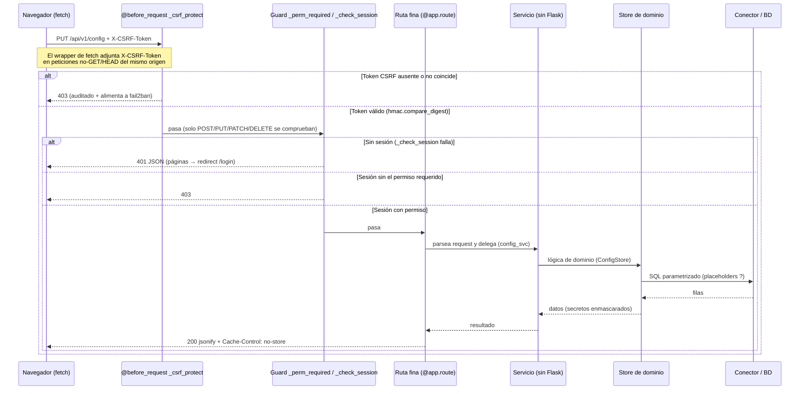
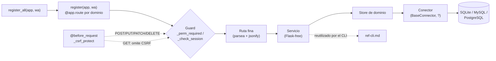

# Referencia de la API REST

> Inventario completo de la superficie HTTP de ServiceSentry, agrupado por dominio.
>
> Fuente de verdad: las definiciones de ruta en el código (`register(app, wa)` de cada
> `routes.py`). Este documento se generó leyendo esas definiciones.

Para el detalle funcional de cada subsistema ver [explica-web-admin.md](explica-web-admin.md),
[explica-servicios.md](explica-servicios.md), [explica-seguridad.md](explica-seguridad.md) y [explica-notificaciones.md](explica-notificaciones.md).

---

## Arquitectura de rutas

**No hay Blueprints de Flask.** Cada ruta es un `@app.route(...)` declarado dentro de una
función `register(app, wa)` a nivel de módulo. El registro está centralizado:

- [lib/web_admin/routes/__init__.py:101](../src/lib/web_admin/routes/__init__.py#L101) —
  `register_all(app, wa)` importa el símbolo `register` de cada `routes.py` de dominio /
  servicio / provider y los invoca en secuencia. Su docstring es el índice autoritativo de
  toda la superficie de URLs.
- Cada `register(app, wa)` recibe el `app` de Flask más `wa` (el objeto `WebAdmin`,
  [lib/web_admin/app.py](../src/lib/web_admin/app.py)), que aporta los decoradores y el
  estado/ayudantes compartidos.

**Rutas finas + capa de servicio sin Flask.** Los `routes.py` son delgados: parsean la
request, aplican los guards de permiso, delegan en un módulo de servicio co-localizado y sin
dependencia de Flask, y hacen `jsonify`. Ejemplos: `lib/core/users/routes.py` → `users_svc`;
`lib/core/config/routes.py:99` → `config_svc.build_config_schema`; `lib/providers/scim/routes.py`
→ `ScimService`. Ver [ref-cli.md](ref-cli.md) (la misma capa de servicio la reutiliza el CLI).

### Guards de permiso

| Decorador | Efecto | Fuente |
|---|---|---|
| `wa._perm_required(*perms)` | Requiere **cualquiera** de los permisos listados | [mixins/guards.py:39](../src/lib/web_admin/mixins/guards.py#L39) |
| `wa._login_required` | Solo sesión, sin permiso concreto | [app.py:347](../src/lib/web_admin/app.py#L347) |

Ambos llaman a `self._check_session()`. Una request `/api/*` sin autenticar recibe **401
JSON**; el resto redirige a `/login`. `_admin_required`/`_write_required` son shims obsoletos
sin uso en rutas. Ver el catálogo completo de permisos en [explica-seguridad.md](explica-seguridad.md) y
[explica-web-admin.md](explica-web-admin.md).

### Autenticación, CSRF y versionado

- **Prefijo de versión:** las APIs JSON internas que consume el frontend usan `/api/v1/...`
  (cookie de sesión + CSRF). Las superficies externas/estándar quedan fuera: `/scim/v2/*`
  (RFC 7643/7644), `/auth/<provider>/*` (callbacks de IdP, Teams). No existe `/api/v2`.
- **CSRF:** double-submit token. `@app.before_request _csrf_protect`
  ([mixins/hooks.py:82](../src/lib/web_admin/mixins/hooks.py#L82)) solo comprueba `POST/PUT/PATCH/DELETE`
  ([lib/security/csrf.py:21](../src/lib/security/csrf.py#L21)). El frontend adjunta
  `X-CSRF-Token` automáticamente en el wrapper de `fetch`
  ([core/_api.html:22](../src/lib/web_admin/templates/partials/core/_api.html#L22)).
- **Prefijos exentos de CSRF** (auto-declarados vía `wa._register_csrf_exempt(...)`, no
  hardcodeados): `/scim/`, `/auth/oidc/callback`, `/auth/saml2/acs`, `/auth/msteams/tab`,
  `/auth/msteams/sso`, `/auth/msteams/messages`. Estos endpoints se autentican por su propio
  protocolo (Bearer SCIM con rate-limit por IP, JWT de Bot Framework, respuesta del IdP).
- Respuestas `/api/` llevan `Cache-Control: no-store`. `MAX_CONTENT_LENGTH = 8 MiB`.

### Convenciones de request/response

- La mayoría de endpoints de escritura reciben y devuelven JSON. Los de creación/actualización
  suelen responder `{ok: true, ...}` o el recurso resultante; los de error devuelven
  `{message: "..."}` con el código HTTP correspondiente.
- **Secretos**: en las respuestas de listado/lectura los campos sensibles van **enmascarados**
  (credenciales, hosts, webhooks); al guardar, un valor enmascarado sin cambios se **restaura**
  desde el valor cifrado en BD. Ver [explica-seguridad.md](explica-seguridad.md).
- Códigos típicos: `200` OK, `400` payload inválido, `401` sin sesión, `403` sin permiso o
  fallo CSRF, `404` recurso inexistente, `409` conflicto (p. ej. nombre duplicado), `429`
  rate-limit (login / SCIM).

---

## Flujo de una llamada

Toda petición interna `/api/v1/...` recorre siempre las mismas etapas: el guard CSRF global,
el guard de permiso del decorador, la ruta fina, la capa de servicio sin Flask, el store de
dominio y, por debajo, el conector de BD. No hay más middleware que el descrito aquí.

### Flujo de una llamada API

El siguiente `sequenceDiagram` traza un `PUT` (sujeto a comprobación CSRF), con las tres ramas
de rechazo posibles y la cabecera `Cache-Control: no-store` que llevan las respuestas `/api/`.


```mermaid
sequenceDiagram
    participant Nav as Navegador (fetch)
    participant CSRF as @before_request _csrf_protect
    participant Guard as Guard _perm_required / _check_session
    participant Ruta as Ruta fina (@app.route)
    participant Svc as Servicio (sin Flask)
    participant Store as Store de dominio
    participant BD as Conector / BD

    Nav->>CSRF: PUT /api/v1/config + X-CSRF-Token
    Note over Nav,CSRF: El wrapper de fetch adjunta X-CSRF-Token<br/>en peticiones no-GET/HEAD del mismo origen
    alt Token CSRF ausente o no coincide
        CSRF-->>Nav: 403 (auditado + alimenta a fail2ban)
    else Token válido (hmac.compare_digest)
        CSRF->>Guard: pasa (solo POST/PUT/PATCH/DELETE se comprueban)
        alt Sin sesión (_check_session falla)
            Guard-->>Nav: 401 JSON (páginas → redirect /login)
        else Sesión sin el permiso requerido
            Guard-->>Nav: 403
        else Sesión con permiso
            Guard->>Ruta: pasa
            Ruta->>Svc: parsea request y delega (config_svc)
            Svc->>Store: lógica de dominio (ConfigStore)
            Store->>BD: SQL parametrizado (placeholders ?)
            BD-->>Store: filas
            Store-->>Svc: datos (secretos enmascarados)
            Svc-->>Ruta: resultado
            Ruta-->>Nav: 200 jsonify + Cache-Control: no-store
        end
    end
```

### Flujo de llamadas por capas

El `flowchart` muestra el recorrido estático: desde el registro centralizado de rutas hasta la
BD. La misma capa de servicio (sin Flask) la reutiliza el CLI — ver [ref-cli.md](ref-cli.md).


```mermaid
flowchart LR
    A["register_all(app, wa)"] --> B["register(app, wa)<br/>@app.route por dominio"]
    B --> C{"Guard<br/>_perm_required /<br/>_check_session"}
    C --> D["Ruta fina<br/>(parsea + jsonify)"]
    D --> E["Servicio<br/>(Flask-free)"]
    E --> F["Store de dominio"]
    F --> G["Conector<br/>(BaseConnector, ?)"]
    G --> H[("SQLite / MySQL /<br/>PostgreSQL")]

    CSRF["@before_request<br/>_csrf_protect"] -.->|"POST/PUT/PATCH/DELETE"| C
    CSRF -.->|"GET: omite CSRF"| C
    E -.->|"reutilizado por el CLI"| CLI["ref-cli.md"]
```

### Ejemplo con cuerpo (PUT /api/v1/config)

Ampliando el ejemplo curl de [Escritura (PUT con CSRF)](#escritura-put-con-csrf), un guardado
parcial versionado con su cuerpo de request y las dos formas de respuesta:

**Request** — cabecera y cuerpo enviados:

```http
PUT /api/v1/config HTTP/1.1
Content-Type: application/json
X-CSRF-Token: 9f2c…a71b
Cookie: session=…

{
  "global|log_level": "info",
  "monitoring|interval": 60
}
```

**Respuesta 200 (OK)** — lleva `Cache-Control: no-store`:

```json
{
  "ok": true,
  "versions": {
    "global|log_level": "c3a1f0",
    "monitoring|interval": "b28d94"
  }
}
```

Los `versions` son los tokens de versión por campo que el frontend usa para el guardado
optimista (poll ligero vía `GET /api/v1/config/versions`).

**Respuesta 403 (fallo CSRF)** — token ausente o no coincidente; el intento se audita y se
alimenta a fail2ban:

```json
{
  "message": "CSRF token missing or invalid"
}
```

---

## Autenticación / sesión — [routes/auth.py](../src/lib/web_admin/routes/auth.py)

| Método | Ruta | Permiso | Propósito |
|---|---|---|---|
| GET, POST | `/login` | público | Página de login local + submit (rate-limit por IP) |
| GET, POST | `/login/mfa` | **login aparcado** | El segundo factor cuando la cuenta lleva uno: código TOTP o código de recuperación |
| GET, POST | `/login/mfa/enrol` | **login aparcado** | Alta obligatoria, cuando la política le aplica a la cuenta y no tiene factor |
| POST | `/login/mfa/webauthn/begin` | **login aparcado** | Opciones de la aserción para la llave de seguridad |
| POST | `/login/mfa/webauthn/verify` | **login aparcado** | La aserción firmada; la misma puerta que el código |
| POST | `/logout` | sesión (+CSRF) | Cierra sesión, revoca el token |

«Login aparcado» **no es una sesión**: es una nota en la cookie (`mfa_pending`) que dice quién
está a medio entrar y por qué puerta. No hay fila en la tabla de sesiones, ni `logged_in`, ni
`_login_required` que pase — hasta que el código verifica, la petición es anónima por no tener
sesión. Ver [explica-mfa.md](explica-mfa.md#la-propiedad-de-la-que-cuelga-todo).

## Páginas / UI

| Método | Ruta | Permiso | Propósito | Fuente |
|---|---|---|---|---|
| GET | `/` | público→redirect | Anónimo→`/login`, si no landing page | pages.py:36 |
| GET | `/admin` | sesión | Dashboard de administración | pages.py:76 |
| GET | `/overview` | sesión | Dashboard Overview | pages.py:82 |
| GET | `/status` | público\* | Estado público; invitados solo si `public_status=True` | status.py:84 |
| GET | `/lang/<code>` | público (GET) | Cambia idioma UI y lo persiste | ui.py:22 |
| GET | `/api/v1/me` | sesión | Usuario actual + lista efectiva de `permissions` | ui.py:42 |
| GET | `/api/v1/health` | **público** | `{startup_id}` para chequeo de versión cliente | ui.py:91 |
| GET | `/api/v1/util/token` | `config_edit` | Token hex aleatorio para la UI de config | util.py:21 |
| GET | `/api/v1/util/timezones` | sesión | Los nombres de zona que **esta instalación** sabe interpretar, ordenados. `source` dice si contestó el servidor o si no hay ninguna — `zoneinfo` lee la base de zonas del sistema, y no tenerla (Windows sin `tzdata`, un contenedor recortado) es corriente y no es un fallo: la interfaz cae entonces a la lista del navegador | util.py:24 |

## Configuración — [lib/core/config/routes.py](../src/lib/core/config/routes.py)

| Método | Ruta | Permiso | Propósito |
|---|---|---|---|
| GET | `/api/v1/config` | `config_view`\|`config_edit` | Config efectiva + tokens de versión por campo |
| GET | `/api/v1/config/versions` | `config_view`\|`config_edit` | Poll ligero: solo tokens de versión |
| GET | `/api/v1/config/layout` | `config_view`\|`config_edit` | Layout de la UI de config (tabs→cards) |
| GET | `/api/v1/config/schema` | `config_view`\|`config_edit` | Metadatos UI a nivel de campo |
| PUT | `/api/v1/config` | `config_edit` | Guardado parcial versionado |
| GET | `/api/v1/config/db/targets/<op>` | `db_maintenance` | Las unidades que recorrerá la ejecución, en orden. Responde `{op, targets, divisible}`: el **motor** decide la forma — una tabla por fila donde la sentencia va por tabla, y `divisible: false` donde no (el `VACUUM` de SQLite es una reescritura indivisible, y partirla en 33 filas inventaría una granularidad que el motor no tiene). Sale del **catálogo**, no de los `TableSpec`: una tabla de módulo creada en runtime es tan real como una declarada |
| POST | `/api/v1/config/db/<op>` | `db_maintenance` | Mantenimiento de la BD principal: `optimize` (estadísticas del planificador; barato y seguro) o `compact` (reescribe y devuelve espacio al disco; **bloquea** la BD mientras dura). `<op>` se busca en una tabla fija, no se llama por nombre sobre el conector. Cuerpo opcional `{table}` para avanzar de una en una: se **valida contra `maintenance_targets(op)`** antes de interpolarse en SQL (un identificador no puede ser parámetro ligado), y eso también rechaza un `compact` por tabla en un motor que no lo divide. Un paso por tabla responde `{ok, operation, table}` y **no** audita; la llamada de cierre —sin `table`— responde `{ok, operation, bytes_before, bytes_after, bytes_freed, freed_human}` y registra la ejecución como la única acción de operador que fue. Los tamaños son `null` si el motor no los da: desconocido, nunca cero |

## Usuarios — [lib/core/users/routes.py](../src/lib/core/users/routes.py)

| Método | Ruta | Permiso | Propósito |
|---|---|---|---|
| GET | `/api/v1/users` | `users_view` | Todos los usuarios, sin hashes, + las identidades integradas |
| POST | `/api/v1/users` | `users_add` | Crear usuario |
| PUT | `/api/v1/users/<username>` | `users_edit` | Actualizar (rol/nombre/contraseña/grupos) |
| DELETE | `/api/v1/users/<username>` | `users_delete` | Borrar usuario |
| POST | `/api/v1/users/<username>/unlock` | `users_edit` | Levantar el **bloqueo por intentos fallidos**. Responde `{ok, cleared}`: `cleared` es si había uno **en vigor** —una cuenta que no estaba bloqueada no es un error, el que llama pidió que no lo estuviera y no lo está—. No concede acceso: la contraseña sigue teniendo que ser correcta, por eso va con `users_edit` y no con un permiso propio. Ver [explica-seguridad.md](explica-seguridad.md#bloqueo-de-cuenta-por-intentos-fallidos) |
| PUT | `/api/v1/users/me/preferences` | sesión | Preferencias propias (lang/dark/landing/table_config/layout) |
| PUT | `/api/v1/users/me/password` | sesión | Cambiar contraseña propia (requiere `current_password`) |

Cada registro lleva `last_login`: cuándo inició sesión esa cuenta por última vez, o cadena
vacía si **nunca** lo hizo —que es una respuesta real y la primera que busca una revisión de
accesos—. Se estampa en `_establish_session`, el único sitio del panel donde nace una sesión, así
que vale igual para el formulario local que para OIDC, SAML o Entra. **Usar un token de API no
es iniciar sesión** y no lo toca: eso queda en el `last_used` del propio token, porque una cuenta
cuya única actividad es un script tiene a una persona inactiva detrás, que es justo la distinción
que busca una revisión.

Cada registro lleva `locked_until`: la caducidad del bloqueo por intentos fallidos **mientras
siga en vigor**, o cadena vacía. Uno caducado no se reporta —la ruta de inicio de sesión lo
limpia en el siguiente intento, así que enseñarlo sería mostrar un candado que ya no retiene a
nadie— y el contador de intentos no sale nunca: cuántos le quedan a alguien no es algo que se le
pregunte a una lista.

Cada registro lleva `login_enabled`: `false` es una **cuenta de servicio** —activa, propietaria y
destinataria de avisos, pero sin inicio de sesión por ninguna vía (formulario, LDAP, OIDC o
SAML2)—. Se acepta en `POST` y `PUT`; quitarlo revoca las sesiones vivas de esa cuenta y no puedes
quitártelo a ti mismo (`400 cannot_disable_own_login`).

Cada registro lleva `builtin`. Es `true` solo para las dos identidades bajo las que escribe el
propio panel —`system` y `anonymous`—, que se **sintetizan** en la respuesta (no son filas) para
que quien las vea en auditoría pueda consultarlas: UID estable, rol `none`, `auth_source:
"internal"`, sin contraseña ni sesión. `PUT`/`DELETE` sobre ellas responden `403 user_builtin`.
Ver [explica-seguridad.md](explica-seguridad.md#quién-aparece-en-la-columna-usuario).

## Segundo factor (MFA) — [lib/core/mfa/routes.py](../src/lib/core/mfa/routes.py)

| Método | Ruta | Permiso | Propósito |
|---|---|---|---|
| GET | `/api/v1/account/mfa` | sesión | Qué tiene esta cuenta: `enrolled`, `methods`, códigos restantes y si la instalación puede ofrecer llaves (`webauthn_ok` + `webauthn_reason`). **Nunca el secreto**, ni siquiera cifrado |
| POST | `/api/v1/account/mfa/begin` | sesión | Empieza un alta: secreto, enlace `otpauth://` y QR |
| POST | `/api/v1/account/mfa/confirm` | sesión | Lo demuestra con un código; responde los códigos de recuperación **una sola vez** |
| POST | `/api/v1/account/mfa/recovery` | sesión (+ código actual) | Juego nuevo de códigos de recuperación; invalida el anterior |
| POST | `/api/v1/account/mfa/disable` | sesión (+ código actual) | Apaga el segundo factor de la propia cuenta |
| POST | `/api/v1/account/mfa/webauthn/begin` | sesión | Opciones de registro de una llave de seguridad |
| POST | `/api/v1/account/mfa/webauthn/confirm` | sesión | La respuesta de registro; guarda credencial, clave pública y algoritmo |
| DELETE | `/api/v1/users/<uid>/mfa` | `mfa_reset_others` | Quita el segundo factor **de otra cuenta**, con sus códigos |

**A los siete primeros no los guarda ningún permiso**, y es deliberado: gestionar el propio
segundo factor es como cambiar la propia contraseña —cada cuenta lo hace en su página—, y un
flag ahí sería una forma de impedirle a alguien protegerse. El guardado es el último, porque es
el único que **baja** la protección de una cuenta que no es la de quien llama.

Todo lo que cambia estado vuelve a comprobar a quien llama: apagarlo pide un código actual, o
una sesión prestada bastaría para dejar la cuenta en la contraseña que alguien ya tiene. El
`DELETE` se lleva **todos** los factores y los códigos en una transacción; dejar medio factor en
pie es peor que ninguno, porque se lee como protección que no está. Ver
[explica-mfa.md](explica-mfa.md).

## Tokens de API — [lib/core/apitokens/routes.py](../src/lib/core/apitokens/routes.py)

| Método | Ruta | Permiso | Propósito |
|---|---|---|---|
| GET | `/api/v1/account/tokens` | sesión | Los tokens de esta cuenta. Nunca el hash, nunca el token |
| POST | `/api/v1/account/tokens` | sesión | Mintear uno. **La única vez que el token existe entero** es esta respuesta. Cuerpo: `{name, permissions, expires_days}` — `permissions` es una lista de flags o `'*'` |
| GET | `/api/v1/account/tokens/<uid>/access` | sesión | **Historial**: las llamadas recientes de un token propio (fecha, IP, método, patrón de ruta y código), las negadas incluidas |
| POST | `/api/v1/account/tokens/<uid>/rotate` | sesión | **Rotar**: un secreto nuevo con el mismo nombre, permisos y plazo, **sin que el actual pare** — pasa a llamarse «(anterior)» y sigue funcionando hasta que lo revoques. Devuelve el token nuevo una vez |
| PUT | `/api/v1/account/tokens/<uid>` | sesión | **Editar el alcance** sin tocar el secreto. Cuerpo: `{permissions}` (lista de flags o `'*'`). Se aplica en la siguiente petición del token que ya está desplegado; un token revocado no se edita |
| DELETE | `/api/v1/account/tokens/<uid>` | sesión | Revocar uno propio |
| GET | `/api/v1/tokens` | `sessions_view` | **Todos** los tokens de la instalación, con la cuenta de cada uno. Un token cuya cuenta ya no existe sale igual, con la cuenta vacía |
| POST | `/api/v1/users/<username>/tokens` | `users_edit` | Mintear un token **para esa cuenta**. Los permisos tienen que ser de **quien llama** y se aplica la jerarquía de cuentas; `'*'` se rechaza aquí. `username` puede ser `system` (solo administradores) |
| GET | `/api/v1/tokens/access` | `sessions_view` | **Todas** las llamadas de **todos** los tokens, la más nueva primero (tope 500). Cada fila lleva el token y la cuenta a la que pertenece |
| GET | `/api/v1/tokens/<uid>/access` | `sessions_view` | El mismo historial, de cualquier token — incluido uno cuya cuenta ya no existe |
| GET | `/api/v1/users/<username>/permissions` | `users_edit` | Lo que esa cuenta puede llegar a tener — el conjunto que acota las casillas del diálogo. `unbounded: true` para la identidad interna, que no tiene ninguno y a la que no acota nadie salvo quien llama |
| PUT | `/api/v1/tokens/<uid>` | `users_edit` | Cambiar el alcance de un token cualquiera. Acotado por los permisos de quien llama **y** por los del dueño; `'*'` rechazado; un token sin cuenta no se reescala |
| POST | `/api/v1/tokens/<uid>/rotate` | `users_edit` | Rotar un token cualquiera. No cambia el alcance, así que solo interviene la jerarquía de cuentas |
| DELETE | `/api/v1/tokens/<uid>` | `sessions_revoke` | Revocar un token cualquiera |
| DELETE | `/api/v1/users/<username>/tokens` | `sessions_revoke` | Cortar **todos** los de otra cuenta (baja, o una fuga) |

**Ninguna de las cuatro acepta un token**: gestionar credenciales se queda detrás de un inicio
de sesión real. Un token estrecho que puede mintear uno ancho no es estrecho, y uno que puede
revocar a sus hermanos es un punto de apoyo que borra su rastro. Por lo mismo,
`PUT /api/v1/users/me/password` y todas las rutas de segundo factor rechazan un token.

Dos tokens **vivos** de la misma cuenta no pueden llamarse igual (`409`), sin distinguir
mayúsculas ni espacios: el nombre es lo único de la lista que dice para qué es un token, y dos
iguales convierten revocar el correcto en cara o cruz. El de uno revocado sí se reutiliza.

Para usar uno:

```bash
curl -H 'Authorization: Bearer sst_<id>_<secreto>' https://panel.ejemplo/api/v1/users
```

Lo que puede hacer es la **intersección** de lo que se le dio con lo que su dueño puede hacer
**ahora**: quitarle un rol a la cuenta estrecha el token en el mismo instante, y `'*'` significa
«lo que tenga el dueño», no «todo». No necesita token CSRF —ninguna página cross-site puede
poner una cabecera `Authorization`— y la respuesta no lleva cookie de sesión. Ver
[explica-seguridad.md](explica-seguridad.md#tokens-de-api).

## Roles — [lib/core/roles/routes.py](../src/lib/core/roles/routes.py)

| Método | Ruta | Permiso | Propósito |
|---|---|---|---|
| GET | `/api/v1/roles` | `roles_view` | Todos los roles, keyed por UID |
| POST | `/api/v1/roles` | `roles_add` | Crear rol personalizado |
| PUT | `/api/v1/roles/<uid>` | `roles_edit` | Actualizar nombre/permisos (built-in: solo nombre) |
| DELETE | `/api/v1/roles/<uid>` | `roles_delete` | Borrar rol personalizado |

## Grupos — [lib/core/groups/routes.py](../src/lib/core/groups/routes.py)

| Método | Ruta | Permiso | Propósito |
|---|---|---|---|
| GET | `/api/v1/groups` | `groups_view` | Todos los grupos, keyed por UID |
| POST | `/api/v1/groups` | `groups_add` | Crear grupo |
| PUT | `/api/v1/groups/<uid>` | `groups_edit` | Actualizar etiqueta/desc/roles/miembros |
| DELETE | `/api/v1/groups/<uid>` | `groups_delete` | Borrar grupo |

## Infraestructura (vivo) — [lib/core/infra/routes.py](../src/lib/core/infra/routes.py)

Sólo lectura: la sección muestra **qué están haciendo** las máquinas; lo que las define vive en el registro (`/api/v1/hosts`), tras los permisos que el registro ya tiene.

| Método | Ruta | Permiso | Descripción |
|---|---|---|---|
| GET | `/api/v1/infra/hosts` | `infra_view` | La flota: una fila por máquina, **peor primero**, con su estado y cuánto de ella se vigila. Proyección en lista blanca: los `profiles` (credencial de cada protocolo) no viajan |
| GET | `/api/v1/infra/hosts/<uid>` | `infra_view` | Una máquina: lo que devolvió cada check (`results`) y los números que su módulo **declaró** como medida (`metrics`), cada uno con etiqueta, unidad y las coordenadas de su serie |

## Empresas — [lib/core/orgs/routes.py](../src/lib/core/orgs/routes.py)

De quién es cada cosa. Estuvo dentro del inventario físico, que es donde se hizo la pregunta por
primera vez; es del core desde build.125, porque la misma sociedad que paga el armario tiene
usuarios en el directorio y licencias en Microsoft 365, y un registro que vive dentro de una
sección es uno que las demás no pueden usar sin nombrarla.

| Método | Ruta | Permiso | Descripción |
|---|---|---|---|
| GET | `/api/v1/orgs` | `orgs_view` | Las empresas que quien llama puede ver, con `said` —**qué tiene dicho cada una**, por ámbito— y con `scopes`, la lista de **lo que puede ser de una empresa**. Lo DICHO y no lo heredado: una sede con cuarenta equipos dentro cuenta como una sede, porque los equipos no lo dicen, lo heredan. Y estrechada: quien tiene concedida una sociedad ve esa, no la lista de filiales del grupo |
| POST | `/api/v1/orgs` | `orgs_edit` | Crear una |
| PUT | `/api/v1/orgs/<uid>` | `orgs_edit` | Renombrarla, o corregir su abreviatura o su descripción |
| DELETE | `/api/v1/orgs/<uid>` | `orgs_edit` | Borrarla, **y toda pertenencia que la nombraba** — si no, el resolutor devuelve un uid que ya no se puede buscar. Lo que era suyo no se borra: vuelve a estar sin fichar |
| POST | `/api/v1/orgs/owner` | `orgs_edit` | Decir de quién es algo (`scope` + `uid` + `org_uid`). Con `org_uid` vacío **deja de decirse**, que es volver a heredar y no es lo mismo que «de nadie». El `scope` vale si **alguien lo declara** (`ORG_SCOPES` en su `manifest.py`): hoy `site`, `room`, `rack` e `item` del inventario y `host` del registro de máquinas — el día que un módulo fiche buzones, este mismo extremo los ficha |

## Inventario físico (DCIM) — [lib/core/dcim/routes/](../src/lib/core/dcim/routes/)

> Un paquete y no un fichero: eran 3571 líneas, un tercio del dominio. Repartidas **por asunto y no por capa** — `places` (sedes, salas, racks), `power` (la cadena eléctrica), `racks` (un armario por dentro), `docs` (los dos documentos del catálogo), `library` (marcas y plataformas), `builds` (las plantillas) y `catalog` (el catálogo y su importación)—, cada una con sus rutas dichas en su propia cabecera. Lo que comparten —los permisos y los ayudantes que usa más de una— se arma una vez en `_context.py`.

Dónde está el equipamiento y de quién es. Ver [explica-dcim.md](explica-dcim.md).

> **Toda lectura estrecha**, no solo el listado: la sección va de un SITIO, y un sitio puede
> tener equipos de varias sociedades. Lo que puede ver quien llama se resuelve una vez por
> petición y se aplica a lo que sea que se devuelva; un item que no es suyo vuelve como
> **posición y tamaño y nada más** (`foreign: true`). El hueco libre sí viaja entero: no dice de
> quién es nada y es la mitad del valor de tener esto.
>
> **Toda escritura se comprueba contra el dueño de lo que se CAMBIA**, no de aquello a lo que se
> cambia: mover el servidor de otro una U sigue siendo tocar el servidor de otro.

| Método | Ruta | Permiso | Propósito |
|---|---|---|---|
| GET | `/api/v1/dcim/export` | `dcim_view` (+ `dcim_catalog_view` para los modelos) | Un **fichero** con los modelos (`?types=`) y las plantillas (`?builds=`) que se pidan, separados por comas. Con cabecera de descarga: lo que se ha pedido es llevárselo, y verlo en pantalla obliga a copiarlo a mano. Cada mitad exige su permiso de lectura y se calla si no lo hay, en vez de negar el fichero entero. Sin `uid` ninguno —un identificador es de la base que lo acuñó— y **sin imágenes**, que pesan más que todo lo demás junto |
| POST | `/api/v1/dcim/import` | `dcim_catalog_manage` y/o `dcim_build_edit` | Traer lo que falte de un sobre. **Nada se pisa**: un modelo que ya está —mismo fabricante y modelo— se salta, y una plantilla cuyo nombre ya existe también; lo saltado se cuenta y se devuelve, que es la diferencia entre «no ha hecho nada» y «ya lo tenías». Primero los modelos y después las plantillas, para que la que llegue detrás encuentre el chasis del que habla. Una plataforma que aquí no exista **no se inventa**: se devuelve en `platforms_missing` |
| GET | `/api/v1/dcim/orgs` | `dcim_view` | Las empresas que quien llama puede ver, por su nombre: es lo que hace falta para pintar la chapa de un armario y para el desplegable con el que se ficha. **El registro en sí es del core** (`/api/v1/orgs`) — crear, renombrar y borrar una sociedad no es una operación del inventario, porque la misma sociedad tiene usuarios en el directorio |
| GET | `/api/v1/dcim/sites` | `dcim_view` | Las sedes, con sus salas y cuántos racks tiene cada una |
| POST · PUT · DELETE | `/api/v1/dcim/sites[/<uid>]` | `dcim_edit` | Alta, edición y baja |
| POST · PUT · DELETE | `/api/v1/dcim/rooms[/<uid>]` | `dcim_edit` | Ídem para salas |
| POST · PUT · DELETE | `/api/v1/dcim/racks[/<uid>]` | `dcim_edit` | Ídem para racks |
| GET | `/api/v1/dcim/racks/<uid>` | `dcim_view` | Un rack: sus items (los ajenos, opacos) y **qué U quedan libres por cara** |
| GET | `/api/v1/dcim/hosts` | `dcim_view` | Las máquinas a las que se puede enlazar un item: uid, nombre, dirección y tipo — cuatro campos, no la ficha entera. Estrechada por la regla del **registro** (`devices_view` / `server.<uid>.view`), porque lo que se ofrece son sus fichas |
| POST | `/api/v1/dcim/items` | `dcim_edit` | Colocar algo en un rack. **400 si no cabe**: dos cosas en una U es el dibujo de un armario que no puede existir, y se niega antes de escribirse |. Con `build_uid` **nace de una plantilla**: la altura, el fondo, la cara, el rol y el modelo salen puestos —lo tecleado manda sobre ellos— y sus componentes se **copian** al equipo, que devuelve cuántos en `parts`
| PUT | `/api/v1/dcim/items/<uid>` | `dcim_edit` | Moverlo o reetiquetarlo. Moverse a donde ya está uno mismo no choca consigo |
| DELETE | `/api/v1/dcim/items/<uid>` | `dcim_edit` | Sacarlo |
| GET | `/api/v1/dcim/catalog` | `dcim_catalog_view` | El catálogo de modelos: `q` filtra, `maker` y `kind` acotan, `offset` pagina. Devuelve `total` además de la página — sin él, doscientos de seis mil parecen todos — más los `sources` y los `kinds` que hay —del catálogo ENTERO y no de la página: un filtro que cambia de opciones al pasar de página es un filtro del que nadie se fía— y la `library_url` configurada |. `tree` acota por **forma** —dispositivo, módulo, armario o componente—, que es el filtro de primer nivel porque nadie busca «un armario o un DIMM»; y la respuesta trae `kinds_by_tree`, el vocabulario de clases de cada uno: un DIMM no es «switch, servidor u otro». `brand_uid` acota por la marca **como fila**, que es lo que sigue siendo cierto después de renombrarla — acotar por el texto dejaría de encontrar sus modelos el día que «HP» pase a ser «Hewlett Packard Enterprise»
| GET | `/api/v1/dcim/catalog/browse` | `dcim_catalog_manage` | Qué fabricantes trae una biblioteca de GitHub, **sin descargar ningún modelo**: una petición al índice del repositorio. Pide el permiso de importar y no el de leer, porque cuesta una petición a una máquina ajena hecha por este servidor. Un fallo llega con **200 y el motivo dentro** (`error` + `detail`): un 400 lo perdería, porque el envoltorio de GET del panel descarta el cuerpo de cualquier respuesta que no sea 2xx |
| POST | `/api/v1/dcim/catalog/upload` | `dcim_catalog_manage` | Importar un zip que viaja EN la petición (multipart, campo `file`, 64 MB). Esto es una aplicación web: pedir una ruta del disco del servidor es pedir un acceso que quien administra desde un navegador no tiene por qué tener |
| POST | `/api/v1/dcim/catalog/drop` | `dcim_catalog_manage` | Quitar varios: `uids` los marcados, o `source` un origen entero — que es la unidad en la que entraron |
| POST | `/api/v1/dcim/catalog` | `dcim_catalog_manage` | Escribir un modelo a mano, para lo que no está en ninguna biblioteca. Con `from` **clona** otro: se lleva sus puertos y sus medidas, y sus imágenes **copiadas** —no el nombre de las suyas, que haría que borrar cualquiera de los dos dejara al otro sin ellas—, y sus **adjuntos** igual, copiados por la misma razón. Origen `manual`: ninguna importación lo toca |
| PUT | `/api/v1/dcim/catalog/<uid>` | `dcim_catalog_manage` | Corregir uno — sobre todo la **clase** que se dedujo. Queda marcada como decidida por una persona, y **sobrevive a reimportar la biblioteca**: al reemplazar un origen las clases marcadas se rescatan por nombre normalizado |
| GET | `/api/v1/dcim/catalog/<uid>/files` | `dcim_catalog_view` | Los **adjuntos** de un modelo: manuales, hojas de características, firmware. Se leen con el permiso de consultar: buscar el manual a las once de la noche no es administrar el catálogo |
| POST | `/api/v1/dcim/catalog/<uid>/files` | `dcim_catalog_manage` | Colgar uno (multipart, campo `file`; `kind` dice de qué es). **Sin lista blanca de tipos**, y es una decisión: lo útil aquí es abierto y una lista se queda corta cada semana. Lo que lo hace seguro es que siempre sale como descarga |
| GET | `/api/v1/dcim/files/<uid>` | `dcim_catalog_view` | Bajárselo. `application/octet-stream` + `attachment` + `nosniff`: el panel no renderiza nunca un fichero subido, así que un HTML o un SVG no se ejecutan en este origen |
| DELETE | `/api/v1/dcim/files/<uid>` | `dcim_catalog_manage` | Quitarlo, y borrar el fichero |
| POST | `/api/v1/dcim/catalog/<uid>/image/<face>` | `dcim_catalog_manage` | Poner la imagen frontal o trasera de un modelo (multipart, campo `file`). El tipo lo decide lo que hay **dentro** del fichero y el nombre lo acuña el almacén de medios; la que sustituye se borra del disco |
| DELETE | `/api/v1/dcim/catalog/<uid>/image/<face>` | `dcim_catalog_manage` | Quitarla, y borrar el fichero |
| DELETE | `/api/v1/dcim/catalog/<uid>` | `dcim_catalog_manage` | Quitar un modelo, con sus imágenes |
| GET | `/api/v1/dcim/catalog/suggest` | `dcim_catalog_view` | Qué modelo apuntan las palabras del propio dispositivo (`maker`, `model`). **Propone; no escribe** |
| POST | `/api/v1/dcim/catalog/import` | `dcim_catalog_manage` | Importar: de GitHub por fabricantes (`github` + `vendors`), de GitHub **entero** (`all`, que se baja el repositorio de una vez porque para «todos» diez mil ficheros de uno en uno son tres cuartos de hora), de un directorio o de un zip (`path`). Devuelve `job`; 409 si ya hay uno en marcha |
| GET | `/api/v1/dcim/catalog/import/<job_id>` | `dcim_catalog_view` | Mirar esa importación |
| GET | `/api/v1/dcim/catalog/import` | `dcim_catalog_view` | ¿Hay una en marcha? La respuesta es del **servidor**, no de la memoria de un navegador: F5 pierde el id del trabajo y nada más |
| GET | `/api/v1/dcim/catalog/<uid>/history` | `dcim_catalog_view` | Qué decía esta ficha antes y **quién la cambió**. Un modelo del catálogo es un dato compartido —de él cuelgan plantillas, piezas estampadas en veinte máquinas y la altura de un alzado— y la corrección que rompe algo se descubre semanas después. Se lee con el permiso de consultar: mirar lo que decía ayer es leer |
| POST | `/api/v1/dcim/catalog/<uid>/restore` | `dcim_catalog_manage` | Volver a una versión (`rev`). **No borra lo de en medio**: volver atrás es un cambio más y queda registrado — si no, la respuesta a «quién dejó esto así» sería distinta según cuándo se preguntara. La imagen no se restaura: lo guardado era el nombre de un fichero que puede haberse borrado al sustituirlo |
| GET | `/api/v1/dcim/profiles` | `dcim_catalog_view` | Qué se pregunta de un componente de cada clase, con las dos versiones que compiten por serlo: la que viene con el panel y la guardada |
| PUT | `/api/v1/dcim/profiles` | `dcim_catalog_manage` | Sustituirlo **sin publicar una versión del panel**: manda el de `version` más alta. Lo que se descarta —una clase que no existe, un control que la pantalla no sabe dibujar— se devuelve en `dropped` en vez de guardarse en silencio |
| GET | `/api/v1/dcim/profiles/history` | `dcim_catalog_view` | Quién cambió el documento y cuándo. Solo las versiones guardadas: la que viene con el panel no tiene historial porque su historial son los commits |
| GET | `/api/v1/dcim/profiles/compare` | `dcim_catalog_view` | Qué cambia entre dos versiones (`a`, y `b` o el documento en vigor), **por clase y por campo** — a dos volcados de JSON uno al lado del otro no se les puede preguntar qué se le añadió a los discos |
| DELETE | `/api/v1/dcim/profiles` | `dcim_catalog_manage` | Quitar el guardado y volver al que viene dentro |
| GET | `/api/v1/dcim/racks/<uid>/history` | `dcim_view` | **Cómo estaba el armario y qué le pasó.** Una foto por cambio: cada versión es el estado —«cómo estaba en marzo»— y su diferencia con la anterior es el acontecimiento —«quién movió el switch»—. La más antigua no se compara contra nada: la diferencia contra el vacío diría que llegaron seis equipos, que es cierto y no es lo que pasó. La foto entera viaja con cada renglón, para poder comparar dos cualesquiera sin una petición por par |
| GET | `/api/v1/dcim/said?host=<uid>` | `dcim_edit` + ver esa máquina | Lo que un dispositivo ha **dicho de sí mismo** —hoy su número de serie—, para ofrecerlo en la ficha de un equipo. Nada aquí escribe: el panel ofrece y una persona acepta, igual que con el modelo que sugiere el catálogo. Varios valores no es un error (un switch apilado tiene varios chasis) y viajan todos, para que se elija |
| GET | `/api/v1/dcim/connectors` | `dcim_view` | El **catálogo de conectores**: por dónde se enchufa cada cosa, agrupado por familia, con el vocabulario de **señales** que las nombra. Se lee con el permiso de consultar y no con el del catálogo: quien está cableando a las tres de la mañana necesita saber si el latiguillo es un C13 o un C19 |
| PUT | `/api/v1/dcim/connectors` | `dcim_catalog_manage` | Sustituirlo **sin publicar una versión del panel**: manda el de `version` más alta. Lo que se descarta —una familia que ninguna pantalla dibuja, una generación sin `id`— vuelve en `dropped`, y las señales fuera del vocabulario se avisan sin tirarlas |
| GET | `/api/v1/dcim/connectors/history` | `dcim_view` | Quién cambió el documento y cuándo. Solo las versiones guardadas: el historial del que viene dentro son los commits |
| DELETE | `/api/v1/dcim/connectors` | `dcim_catalog_manage` | Quitar el guardado y volver al que viene con el panel |
| POST | `/api/v1/dcim/connectors/<cid>/image` | `dcim_catalog_manage` | Ponerle una **foto** a un conector. Los que vienen con el panel llevan dibujo —uno por *forma*— y al que alguien añada no se le parece ninguno. En un solo paso: el fichero se guarda y el documento se escribe con una versión más alta, porque entre subirlo y guardar el documento hay un hueco por el que se pierde el fichero. El tipo lo decide lo que hay DENTRO |
| DELETE | `/api/v1/dcim/connectors/<cid>/image` | `dcim_catalog_manage` | Quitársela y volver al dibujo de su forma; el fichero se borra del disco |
| GET | `/api/v1/dcim/brands` | `dcim_catalog_view` | Las **marcas**, que son la raíz del catálogo, con cuántos modelos tiene cada una. Se leen sin permiso de gestión a propósito: la dirección por la que se abre un ticket es lo que hace falta a las tres de la mañana, y esa es la hora a la que nadie tiene el permiso bueno |
| POST | `/api/v1/dcim/brands` | `dcim_catalog_manage` | Escribir una. Las trescientas de la biblioteca **se dan de alta solas al importar** —nadie las va a teclear— así que esto es para la otra: el taller que montó el armario, el distribuidor del que aún no hay nada |
| PUT | `/api/v1/dcim/brands/<uid>` | `dcim_catalog_manage` | Cambiarla. El `slug` no se escribe desde fuera: se deriva del nombre, o dos marcas podrían hacerse pasar por la misma |
| DELETE | `/api/v1/dcim/brands/<uid>` | `dcim_catalog_manage` | Retirar su ficha. **400 mientras tenga modelos**, y no por integridad referencial: el nombre sigue escrito en cada fila del catálogo y el repaso del arranque la daría de alta otra vez, así que lo único que se habría perdido es lo que escribimos nosotros |
| GET | `/api/v1/dcim/platforms` | `dcim_view` | Las **plataformas**: con qué sale un equipo —Debian, RouterOS, ESXi—, con cuántas plantillas nombran cada una. Se leen con `dcim_view` y no con el permiso del catálogo: quien monta un rack tiene que poder ELEGIR una, igual que elige un modelo de chasis |
| POST | `/api/v1/dcim/platforms` | `dcim_catalog_manage` | Dar una de alta. 400 si ya hay otra que se llama igual: «Debian 12» y «debian 12» son la misma, y dos filas serían dos respuestas a una pregunta que solo tiene una |
| PUT | `/api/v1/dcim/platforms/<uid>` | `dcim_catalog_manage` | Cambiarla. Renombrarla es editar una fila; las plantillas que apuntaban a ella siguen apuntando |
| DELETE | `/api/v1/dcim/platforms/<uid>` | `dcim_catalog_manage` | Retirarla. **400 mientras alguna plantilla la nombre**, con cuántas son: una plantilla que dice «sale con» y no dice con qué es peor que una que no lo dice, porque parece que se sabe |
| GET | `/api/v1/dcim/builds` | `dcim_view` | Las **plantillas**: lo que de verdad se compra, entre lo que un fabricante vende y la caja del U 12. Cada una con cuántas piezas lleva y **cuántos equipos han salido de ella** — sin eso, una plantilla es una nota en un documento. Se lee con `dcim_view` y no con el permiso del catálogo: hay que poder ELEGIR una al colocar un equipo |
| GET | `/api/v1/dcim/builds/<uid>` | `dcim_view` | Una, con lo que lleva puesto — y con `summary`: **qué máquina sale de ella**. Los gigas, los teras en bruto, las CPU y sus núcleos, las fuentes y los puertos de red. Calculado en el servidor porque hace falta la ficha del catálogo de cada pieza —los núcleos de una CPU están en su modelo, no en la pieza— y porque una suma que hacen dos pantallas por su cuenta acaba dando dos resultados. Lo que no se pudo contar viene en `unknown`: un total al que le faltan tres discos y no lo dice es peor que no darlo. Y `fields` + `power_types`: **qué se pregunta de un chasis** —la ventilación, el peso—, dicho por el documento de perfiles. Estaban servidos solo en el catálogo, así que una plantilla los enseñaba y no había forma de corregirlos aunque el dato sea suyo desde que se copia |
| POST | `/api/v1/dcim/builds` | `dcim_build_edit` | Escribir una. Con `from` **clona** otra con sus piezas —la del año que viene es la de este con otros discos— y, sin `name`, se inventa uno libre: un nombre que generó el panel no es un nombre que alguien tecleó |
| PUT | `/api/v1/dcim/builds/<uid>` | `dcim_build_edit` | Cambiarla. 400 si el nombre ya es de otra: dos estándares con el mismo nombre no se distinguen donde se eligen |
| DELETE | `/api/v1/dcim/builds/<uid>` | `dcim_build_edit` | Retirarla. Los equipos que salieron de ella **no se tocan**, ni pierden el vínculo: nacieron de esto y eso siguió siendo verdad. Devuelve cuántos eran |
| POST | `/api/v1/dcim/builds/<uid>/image/<face>` | `dcim_build_edit` | Su **propia** foto de una cara. Las dos llegan copiadas del catálogo, y copiadas quiere decir suyas: la del catálogo es la del chasis desnudo y la de aquí puede ser la del equipo montado, con sus tarjetas y su etiqueta. La que sustituye se borra del disco, o cada cambio deja un fichero al que no apunta nadie. El tipo lo decide lo que hay DENTRO del fichero |
| DELETE | `/api/v1/dcim/builds/<uid>/image/<face>` | `dcim_build_edit` | Quitarla, del disco también |
| GET | `/api/v1/dcim/builds/<uid>/history` | `dcim_view` | **Qué decía antes**, y quién la cambió. Una plantilla es un dato compartido: de ella salieron veinte máquinas y es el estándar con el que se compra. Poner un componente cuenta como cambio, y cada versión guarda de qué constaba. Se lee con el permiso de consultar: mirar lo de ayer es leer |
| POST | `/api/v1/dcim/builds/<uid>/restore` | `dcim_build_edit` | Volver a una versión, **como un cambio más** — lo de en medio no se borra. Los componentes **no** se reescriben: de ellos cuelgan los ya estampados en los equipos. La foto tampoco, que lo guardado es el nombre de un fichero que puede haberse borrado |
| GET | `/api/v1/dcim/builds/<uid>/files` | `dcim_view` | Los **adjuntos** de una plantilla: la oferta, el pliego, la foto de cómo queda montada. La misma tabla que los de un modelo del catálogo, distinguidos por `scope` |
| POST | `/api/v1/dcim/builds/<uid>/files` | `dcim_build_edit` | Colgar uno. Sin lista blanca de tipos, y por eso mismo **siempre sale como descarga**: `application/octet-stream`, `attachment` y `nosniff`, así que un HTML disfrazado de `.png` no se renderiza |
| POST | `/api/v1/dcim/builds/<uid>/parts` | `dcim_build_edit` | Ponerle un componente |. Mismo trato que `parts`: con `type_uid` sale del catálogo
| PUT · DELETE | `/api/v1/dcim/build-parts/<uid>` | `dcim_build_edit` | Cambiarlo o quitarlo. No se muda de plantilla por el cuerpo de la petición |
| POST | `/api/v1/dcim/rooms/<uid>/plan` | `dcim_edit` | Subir el plano de una sala. **El tipo lo decide el contenido**, no la extensión, y el nombre lo acuña el panel: lo que traía el fichero no llega nunca a un disco. Tope 2 MB. Sustituir borra el anterior |
| DELETE | `/api/v1/dcim/rooms/<uid>/plan` | `dcim_edit` | Quitarlo — se borra **el fichero**, no solo la referencia |
| GET | `/api/v1/dcim/media/<name>` | `dcim_view` | Servir una imagen guardada. Un SVG va como descarga: puede traer script dentro |
| GET | `/api/v1/dcim/media-dir` | `config_edit` | A qué carpeta van de verdad las imágenes — para la caja vacía de Configuración. **No la crea** |
| GET | `/api/v1/dcim/board` | `dcim_view` | El cuadro de mando: baldosas por sede, desglose por empresa y **el camino hasta cada cosa que falla** (sede › sala › rack › U). Estrechado como todo lo demás: en un rack compartido, la filial no ve el problema del departamento. La lista se recorta a 20 y la respuesta lo dice (`capped`, `trouble_total`) |
| GET | `/api/v1/dcim/rooms/<uid>/features` | `dcim_view` | Lo que hay en la sala que no es un rack, **ya ordenado por capas** (suelo → sala → aire), con el catálogo de tipos y sus medidas de fábrica |
| POST | `/api/v1/dcim/features` | `dcim_edit` | Poner una pieza. El tipo se valida contra `FEATURE_KINDS`; el permiso se mira en **la sala**, no en la pieza —una columna no es de nadie— |
| PUT | `/api/v1/dcim/features/<uid>` | `dcim_edit` | Moverla, girarla, nombrarla. `room_uid` no se puede escribir: mudarla sería entrar en una sala cuyo permiso no se ha mirado |
| DELETE | `/api/v1/dcim/features/<uid>` | `dcim_edit` | Quitarla |
| POST | `/api/v1/dcim/rooms/<uid>/import` | `dcim_edit` | Traer un plano de un fichero. Las piezas se **reemplazan enteras**; los racks se emparejan **por nombre** y solo se mueven, y **uno que el fichero no nombre NO se borra** —dentro hay equipos—. Devuelve contado lo que hizo: piezas, racks movidos, nuevos, intactos y saltados |
| GET | `/api/v1/dcim/racks/<uid>/power` | `dcim_view` | Cómo está alimentado el armario: regletas con tomas libres y carga, de qué se alimenta cada equipo, y **qué se apaga si cae una rama**. En un armario compartido los TOTALES de una regleta son de todos —hacen falta para planificar— pero de quién es cada cable no, y un aviso sobre el equipo del vecino no se le cuenta a nadie más |
| GET | `/api/v1/dcim/sources` | `dcim_view` | Lo que hay **aguas arriba**: acometidas, cuadros, SAI y grupos, con la cadena de cada regleta recorrida **dos veces** —como está ahora y como estaría sin ningún bypass echado— y los dos hallazgos: una regleta que ahora mismo no pasa por ningún SAI pero pasaría, y las dos ramas de un armario colgando del mismo SAI. No se estrecha por empresa (un cuadro es del edificio) pero sí de qué regletas se habla |
| GET | `/api/v1/dcim/items/<uid>/parts` | `dcim_view` | Lo que hay **dentro** de un equipo: discos, memoria, fuentes, tarjetas… y el cargador del mini-PC. De un equipo ajeno **no se lista ni uno**: a diferencia de un equipo —que sale ocupando U para que la sala sea planificable— un disco no ocupa nada que nadie más necesite saber |. Si nació de una plantilla, trae también `build` y `diff`: lo que lleva **contra lo que su plantilla decía**, de más y de menos. Ninguna de las dos partes es «el error» — que le hayan cambiado los discos es un hecho sobre esa máquina
| POST · PUT · DELETE | `/api/v1/dcim/parts[/<uid>]` | `dcim_edit` **en el equipo** | Un componente. `qty` porque seis discos idénticos son una fila con un seis; `size` como texto porque «4 TB» ya está bien escrito |. Con `type_uid` la pieza **sale de un modelo del catálogo**: la marca, el nombre y el tamaño los pone él y no la petición — dejar ganar a quien pide sería dejar que la misma pieza se llamara de dos formas según por qué pantalla entrara, y once formas de escribir «Samsung PM9A3» no se pueden contar juntas. La bahía, la cantidad y el número de serie sí son de la pieza
| POST | `/api/v1/dcim/sources/<uid>/clone` | `dcim_edit` **en la sede** | Copiar una fuente **con todo lo que cuelga de ella**, colgando la copia de donde cuelga el original. Un cuadro de sala se declara igual en la sala de al lado con sus dos SAI detrás, y a mano son quince filas y cuatro sitios donde equivocarse de padre. En el servidor y no en quince llamadas: a mitad de la decimoquinta, un error de red deja medio árbol escrito. **No se copian** el bypass (una maniobra en curso no es una forma de estar cableado), el equipo que la mide (dos filas medidas por el mismo aparato son una de las dos mintiendo) ni las regletas, que cuelgan de la fuente y no son la fuente |
| POST · PUT · DELETE | `/api/v1/dcim/sources[/<uid>]` | `dcim_edit` **en la sede** | Una fuente. **Echar o quitar un bypass se audita** (`dcim_bypass`): no es editar un campo, es una maniobra que deja sin protección lo que cuelga. Borrar una deja lo de abajo *sin decir* de qué cuelga, que es la verdad. **400 si el padre no existe, es ella misma o ya cuelga de ella**: el árbol se dibuja desde las raíces hacia abajo, así que cualquiera de las tres deja la fila sin dibujar —y sin el botón con el que se arreglaría |
| POST · PUT · DELETE | `/api/v1/dcim/rows[/<uid>]` | `dcim_edit` **en la sala** | Una fila de racks, con a qué pasillo da cada cara. Deshacerla deja sus armarios sueltos, no los borra. Las filas y sus avisos viajan con `/rooms/<uid>/features` |
| POST · PUT · DELETE | `/api/v1/dcim/pdus[/<uid>]` | `dcim_edit` | Una regleta. Borrarla se lleva sus cables: dejarlos sería una lista de equipos alimentados por algo que ya no existe |
| POST · PUT · DELETE | `/api/v1/dcim/feeds[/<uid>]` | `dcim_edit` | Un cable: este equipo se alimenta de esta regleta. El permiso se mira en el ARMARIO |
| GET | `/api/v1/dcim/racks/<uid>/cables` | `dcim_view` | Lo **declarado** contra lo que los dispositivos dicen ver. Cuatro estados: coincide, no se ve (una pregunta —puede haber un panel pasivo en medio—), otro puerto (alguien movió el latiguillo y no cambió la etiqueta) y sin declarar (alguien enchufó y no lo apuntó). Usa el MISMO mapa que dibuja infraestructura |
| POST · PUT · DELETE | `/api/v1/dcim/cables[/<uid>]` | `dcim_cable_edit` | Un cable. Su propia bandera: mover un equipo de U y decir por dónde va un cable son dos trabajos, muchas veces de dos personas |
| GET | `/api/v1/dcim/cables/<uid>/run` | `dcim_view` **en los dos extremos** | **De qué tirada forma parte este cable**: sus tramos en orden, de punta a punta, atravesando los paneles. Un enlace que pasa por un panel son tres cables y una tirada, y la ficha de uno de los tres no dice de dónde viene ni a dónde va. De lo **declarado** y sin contraste —una tirada es un hecho escrito— y **por cable**, porque calcularla para las doscientas filas de una búsqueda sería pagar doscientas veces lo que se mira una |
| POST · PUT · DELETE | `/api/v1/dcim/links[/<uid>]` | `dcim_edit` **en las dos sedes** | Un enlace entre sedes. Las dos porque cambiarlo cambia lo que se ve en las dos puntas; pedir permiso sobre una sola dejaría dibujar líneas hasta sedes que no se pueden ni abrir. Las puntas no se cambian por el cuerpo de un PUT. Los enlaces vuelven con el cuadro (`/board`), con su estado y los avisos de sede-con-un-solo-camino |
| GET | `/api/v1/dcim/fits` | `dcim_view` | **Dónde cabe esto**, y por qué no donde no cabe. `u`, `depth`, `watts`, `branches` (2 por defecto: lo normal es lo redundante). Las U libres se dan como **tramos seguidos** —doce sueltas no admiten un 2U— y la ocupación cuenta **la de todos**: la U 12 está ocupada aunque lo que la ocupe sea de otra sociedad |

## Sesiones — [lib/core/sessions/routes.py](../src/lib/core/sessions/routes.py)

| Método | Ruta | Permiso | Propósito |
|---|---|---|---|
| GET | `/api/v1/sessions` | `sessions_view` | Sesiones activas, keyed por uid |
| GET | `/api/v1/sessions/access` | `sessions_view` | **Todo lo registrado** de **todas** las sesiones vivas, lo más nuevo primero (tope 500). Cada fila lleva la cuenta. Se registran las **acciones** (POST/PUT/PATCH/DELETE) y los **rechazos** (≥ 400); las lecturas correctas no, porque el panel se sondea a sí mismo |
| GET | `/api/v1/sessions/<uid>/access` | `sessions_view` | Lo mismo de **una** sesión, con `max` (la profundidad del anillo; 0 = sin límite) y `enabled` (si se está registrando), para distinguir «no ha hecho nada registrable» de «el registro está apagado» |
| POST | `/api/v1/sessions/invalidate` | `sessions_revoke` | Revocar TODAS las sesiones |
| POST | `/api/v1/sessions/revoke/<uid>` | `sessions_revoke` | Revocar una sesión |
| POST | `/api/v1/sessions/revoke-user/<username>` | `sessions_revoke` | Revocar todas las de un usuario |

## Auditoría — [lib/core/audit/routes.py](../src/lib/core/audit/routes.py)

| Método | Ruta | Permiso | Propósito |
|---|---|---|---|
| GET | `/api/v1/audit` | `audit_view` | Entradas, más recientes primero |
| DELETE | `/api/v1/audit` | `audit_delete` | Vaciar todo |
| DELETE | `/api/v1/audit/<int:entry_id>` | `audit_delete` | Borrar una entrada |

## Credenciales — [lib/core/credentials/routes.py](../src/lib/core/credentials/routes.py)

| Método | Ruta | Permiso | Propósito |
|---|---|---|---|
| GET | `/api/v1/credentials` | sesión | Listar, secretos enmascarados |
| POST | `/api/v1/credentials` | sesión + `credentials_add` (inline) | Crear |
| POST | `/api/v1/credentials/<uid>/clone` | sesión | Duplicar |
| GET | `/api/v1/credentials/usage` | sesión + `credentials_*` | Dónde se referencia **cada** credencial (una pasada) |
| GET | `/api/v1/credentials/<uid>/usage` | sesión | Dónde se referencia |
| PUT | `/api/v1/credentials/<uid>` | sesión | Actualizar (secretos enmascarados restaurados) |
| DELETE | `/api/v1/credentials/<uid>` | sesión | Borrar |
| POST | `/api/v1/credentials/test` | sesión | Abrir conexión SSH para verificar |

## Hosts — [lib/core/hosts/routes.py](../src/lib/core/hosts/routes.py)

> Todas son `@login_required`; el permiso se aplica **inline** por la familia `servers_*` y
> `_has_server_permission(uid, acción)` (permiso por host). Ver [explica-hosts.md](explica-hosts.md).

| Método | Ruta | Permiso (inline) | Propósito |
|---|---|---|---|
| GET/POST | `/api/v1/snmp/<acción>` | `snmp_view` (lectura) · `snmp_manage` (el resto) | La biblioteca de MIB, el catálogo de perfiles de dispositivo y preguntarle a un dispositivo qué sirve. 42 acciones; las declara `lib/core/snmp/manifest.py`. `discover` **no** está aquí: busca OIDs para el campo de un check, así que sigue en `/api/v1/modules/watchfuls/snmp/discover` |
| GET | `/api/v1/hosts` | `devices_view` (global) o view por host | Listar hosts, secretos enmascarados |
| GET | `/api/v1/hosts/<uid>/status` | `view` por host | Últimos resultados de checks |
| POST | `/api/v1/hosts` | `devices_edit` | Crear host |
| POST | `/api/v1/hosts/<uid>/clone` | `devices_edit` | Clonar host |
| PUT | `/api/v1/hosts/<uid>` | `edit` por host | Actualizar host |
| DELETE | `/api/v1/hosts/<uid>` | `delete` por host | Borrar host |
| POST | `/api/v1/hosts/test_ssh` | `edit` por host / `devices_edit` | Probar SSH sin guardar |
| POST | `/api/v1/hosts/test_check` | `edit` por host | Ejecutar un check una vez |
| POST | `/api/v1/hosts/test` | `edit` por host | Test completo: SSH + todos los checks |
| GET | `/api/v1/hosts/migrate/preview` | `devices_edit` | Propuesta de migración, secretos enmascarados |
| POST | `/api/v1/hosts/migrate/apply` | `devices_edit` | Crear hosts para candidatos aceptados |

## Módulos — [lib/core/modules/routes.py](../src/lib/core/modules/routes.py)

| Método | Ruta | Permiso | Propósito |
|---|---|---|---|
| GET | `/api/v1/modules` | sesión | Módulos que el usuario puede ver |
| PUT | `/api/v1/modules` | sesión | Sobrescribir config de módulos |
| GET | `/api/v1/modules/status` | `checks_view`\|`checks_run` | Estado actual de checks |
| DELETE | `/api/v1/modules/status` | `checks_run` | Vaciar tabla check_state |
| POST | `/api/v1/modules/checks/run` | `checks_run` | Ejecutar checks bajo demanda |
| GET | `/api/v1/modules/overview` | `overview_view` | Snapshot ligero del dashboard Overview |
| GET | `/api/v1/modules/page/<module>` | `modules_view` | Datos de la **sección propia** de un módulo (`__page__`), desde su hook `page_data` (últimos resultados del monitor). 404 si el módulo no declara página |
| GET, POST | `/api/v1/modules/watchfuls/<module>/<action>` | `modules_view` (+ inline si muta) | Despacha `Watchful.<action>` del módulo. Es también por dónde entran el **refresco en vivo** de una sección (`__page__.refresh`) y los datos de una **vista** que declara `action` — una llamada por ítem configurado, con la config de ese ítem en el cuerpo |

## Copias de seguridad — [lib/core/backup/routes.py](../src/lib/core/backup/routes.py)

| Método | Ruta | Permiso | Propósito |
|---|---|---|---|
| GET | `/api/v1/backups` | `backup_view` | Archivos presentes, con su manifiesto y estado de bloqueo |
| POST | `/api/v1/backups` | `backup_create` | Crear una copia (asíncrona: devuelve `job_id`) |
| GET | `/api/v1/backups/jobs/<job_id>` | `backup_view` | Progreso del trabajo en curso |
| GET | `/api/v1/backups/browse` | `config_edit` | Navegar directorios del servidor (elegir destino) |
| POST | `/api/v1/backups/mkdir` | `config_edit` | Crear directorio de destino |
| GET | `/api/v1/backups/<name>/download` | `backup_download` | Descargar el archivo |
| GET | `/api/v1/backups/<name>/tables` | `backup_view` | Qué tablas trae el archivo, por parte — lo que alimenta la restauración selectiva |
| POST | `/api/v1/backups/<name>/verify` | `backup_verify` | Verificar integridad sin restaurar |
| POST | `/api/v1/backups/<name>/restore` | `backup_restore` | Restaurar; acepta `parts` y `tables` (ver más abajo) |
| POST | `/api/v1/backups/<name>/lock` | `backup_delete` | Proteger / desproteger contra borrado y retención |
| DELETE | `/api/v1/backups/<name>` | `backup_delete` | Borrar el archivo |

> **`tables` ausente y `tables: []` no son lo mismo.** Ausente significa *todas las del ámbito*;
> una lista vacía significa *ninguna*. La asimetría es deliberada y está cubierta por tests: un
> cliente que envía la selección del usuario sin filtrar no puede restaurar de más por omisión.

### Programación y retención — [routes_schedule.py](../src/lib/core/backup/routes_schedule.py)

| Método | Ruta | Permiso | Propósito |
|---|---|---|---|
| GET | `/api/v1/backups/tasks` | `backup_view` | Tareas programadas |
| PUT | `/api/v1/backups/tasks` | `backup_schedule` | Crear / editar una tarea |
| DELETE | `/api/v1/backups/tasks/<uid>` | `backup_schedule` | Borrar una tarea |
| POST | `/api/v1/backups/tasks/<uid>/run` | `backup_create` | Ejecutarla ahora |
| POST | `/api/v1/backups/tasks/preview` | `backup_view` | Qué borraría la retención, antes de aplicarla |
| GET | `/api/v1/backups/profiles` | `backup_view` | Perfiles (qué partes entran en una copia) |
| PUT | `/api/v1/backups/profiles` | `backup_schedule` | Crear / editar un perfil |
| DELETE | `/api/v1/backups/profiles/<uid>` | `backup_schedule` | Borrar un perfil |

## Diagnóstico — [lib/core/diagnostics/routes.py](../src/lib/core/diagnostics/routes.py)

| Método | Ruta | Permiso | Propósito |
|---|---|---|---|
| GET | `/api/v1/diagnostics` | `diagnostics_view` | Todo lo que se responde **sin salir de la máquina**: runtime, sistema, red/TLS, base de datos, almacenamiento, dependencias, librerías opcionales y **los otros procesos** de la instalación |
| GET | `/api/v1/diagnostics/report` | `diagnostics_view` | Lo mismo como documento — `?format=txt\|json\|xml`, `inline` para leerlo antes de pegarlo |
| POST | `/api/v1/diagnostics/update-check` | `diagnostics_view` | Preguntar a la API de releases si hay una versión más nueva |
| POST | `/api/v1/diagnostics/dependency-check` | `diagnostics_view` | Preguntar a PyPI la última versión publicada y a OSV.dev los avisos que afectan a la instalada |

**El corte es local / remoto, y por eso son cuatro rutas y no una.** Meterlo todo en un GET
haría que una página que lee el proceso esperase a un socket que el cortafuegos de alguien está
descartando. Las dos comprobaciones remotas ocurren **al pulsar un botón**, nunca al pintar, y
cada una queda auditada (`diagnostics_update_checked`, `diagnostics_dependencies_checked`) —
«quién hizo que esta máquina saliera a internet, y cuándo» es una pregunta con dueño.

Son **POST para algo que lee**: no es la obtención de un recurso, es *hacer que esta máquina
hable con el exterior*, y eso va detrás de un verbo que un navegador no emite solo desde un
prefetch o un enlace.

En modo multi-servicio `instances` trae los demás procesos (worker, syslog, eventos) con qué
ejecutan y **en qué se diferencian de este**, leído del registro de latidos —no por HTTP: los
servicios standalone no responden HTTP salvo que se fije `SS_CONTROL_TOKEN`, que no es el valor
por defecto—. La comprobación remota cubre además lo que **solo ellos** ejecutan, en la misma
tanda de peticiones.

La lista de paquetes se construye **en el servidor** —lo que fija el lock más el resto de lo
instalado—: un cliente que pudiera nombrarlos convertiría el panel en un proxy hacia un
servicio externo. La respuesta dice por nombre cuáles no fija el lock (`unpinned`), separa
«desactualizadas del lock» de `behind_unpinned`, y cada aviso viaja con su enlace, su gravedad
y los otros identificadores del mismo fallo.

## Overview — [lib/core/overview/routes.py](../src/lib/core/overview/routes.py)

| Método | Ruta | Permiso | Propósito |
|---|---|---|---|
| GET | `/api/v1/overview/widget/<wid>` | sesión | Datos autocontenidos de un widget |
| GET | `/api/v1/overview/default-layout` | `overview_view` | Layout por defecto de la organización |
| PUT | `/api/v1/overview/default-layout` | `overview_set_default` | Guardar layout por defecto |
| POST | `/api/v1/overview/reset-factory` | `overview_reset_factory` | Resetear dashboard propio a fábrica |

## Historial — [lib/core/history/routes.py](../src/lib/core/history/routes.py)

| Método | Ruta | Permiso | Propósito |
|---|---|---|---|
| GET | `/api/v1/history/index` | `history_view` | Metadatos de todas las series |
| GET | `/api/v1/history` | `history_view` | Serie temporal de un (module, key) |
| DELETE | `/api/v1/history` | `history_delete` | Borrar historial de un (module, key) |
| DELETE | `/api/v1/history/all` | `history_delete` | Vaciar toda la BD de historial |
| POST | `/api/v1/history/test-write` | `history_view` | Test de escritura + lectura |
| GET | `/api/v1/history/diag` | `history_view` | Estado interno de diagnóstico |

## Notificaciones — plantillas de email — [lib/core/notify/email/template_routes.py](../src/lib/core/notify/email/template_routes.py)

| Método | Ruta | Permiso | Propósito |
|---|---|---|---|
| GET | `/api/v1/notify/templates` | `config_view`\|`config_edit` | Defaults + overrides por idioma (legacy) |
| PUT | `/api/v1/notify/templates/<lang>` | `config_edit` | Guardar overrides de texto (legacy) |
| DELETE | `/api/v1/notify/templates/<lang>` | `config_edit` | Resetear overrides de un idioma |
| GET | `/api/v1/notify/text-packages` | `config_view`\|`config_edit` | Descubrir paquetes de texto editables |
| PUT | `/api/v1/notify/text-packages/<lang>` | `config_edit` | Reemplazar todos los overrides de un idioma |
| GET | `/api/v1/notify/html-templates` | `config_view`\|`config_edit` | Cuerpos HTML personalizados guardados |
| GET | `/api/v1/notify/html-templates/<tpl>/built-in` | `config_view`\|`config_edit` | HTML built-in renderizado |
| POST | `/api/v1/notify/html-templates/<tpl>/preview` | `config_view`\|`config_edit` | Preview en vivo del HTML enviado |
| PUT | `/api/v1/notify/html-templates/<tpl>/<lang>` | `config_edit` | Guardar cuerpo HTML personalizado |
| DELETE | `/api/v1/notify/html-templates/<tpl>/<lang>` | `config_edit` | Borrar cuerpo HTML personalizado |

## Notificaciones — canales

| Método | Ruta | Permiso | Propósito | Fuente |
|---|---|---|---|---|
| GET | `/api/v1/notify/recipients/suggest` | `config_edit` | Typeahead: usuarios + grupos activos | email/routes.py:17 |
| POST | `/api/v1/notify/email/test` | `config_edit` | Enviar email de prueba | email/routes.py:38 |
| POST | `/api/v1/notify/telegram/test` | `config_edit` | Enviar Telegram de prueba | telegram/routes.py:22 |
| POST | `/api/v1/notify/webhook/test` | `config_edit` | Probar webhook con config arbitraria | webhook/test_routes.py:14 |
| GET | `/api/v1/notify/webhooks` | `config_view`\|`config_edit` | Listar webhooks | webhook/routes.py:53 |
| POST | `/api/v1/notify/webhooks` | `config_edit` | Crear webhook | webhook/routes.py:58 |
| PUT | `/api/v1/notify/webhooks/<wh_id>` | `config_edit` | Actualizar webhook | webhook/routes.py:95 |
| DELETE | `/api/v1/notify/webhooks/<wh_id>` | `config_edit` | Borrar webhook | webhook/routes.py:146 |
| POST | `/api/v1/notify/webhooks/<wh_id>/test` | `config_edit` | Probar webhook guardado | webhook/routes.py:158 |
| GET | `/api/v1/notify/msteams/channels` | `config_view`\|`config_edit` | Listar canales Teams | msteams/routes.py:48 |
| POST | `/api/v1/notify/msteams/channels` | `config_edit` | Crear canal | msteams/routes.py:53 |
| PUT | `/api/v1/notify/msteams/channels/<cid>` | `config_edit` | Actualizar canal | msteams/routes.py:75 |
| DELETE | `/api/v1/notify/msteams/channels/<cid>` | `config_edit` | Borrar canal | msteams/routes.py:114 |
| POST | `/api/v1/notify/msteams/channels/<cid>/test` | `config_edit` | Probar canal | msteams/routes.py:124 |
| POST | `/api/v1/notify/msteams/test` | `config_edit` | Probar envío en modo usuario | msteams/routes.py:138 |
| GET | `/api/v1/notify/msteams/app-package` | `config_view`\|`config_edit` | Descargar paquete de app Teams | msteams/routes.py:155 |
| POST | `/auth/msteams/messages` | Bot JWT (CSRF-exempt) | Webhook entrante del bot Teams | msteams/routes.py:179 |

## Gestor de servicios — [lib/services/manager/routes.py](../src/lib/services/manager/routes.py)

| Método | Ruta | Permiso | Propósito |
|---|---|---|---|
| GET | `/api/v1/services` | `services_view` | Estado de todos los servicios registrados |
| POST | `/api/v1/services/<name>/<action>` | `services_control` | start/stop de un servicio controlable |
| POST | `/api/v1/services/<name>/command/<action>` | `services_control` | Comando one-shot (run_now/clear_status/reload/prune) |

## Scheduler de monitorización — [lib/services/monitoring/routes.py](../src/lib/services/monitoring/routes.py)

| Método | Ruta | Permiso | Propósito |
|---|---|---|---|
| GET | `/api/v1/monitoring/status` | `checks_run` | Estado del scheduler |
| POST | `/api/v1/monitoring/start` | `checks_run` | Arrancar scheduler |
| POST | `/api/v1/monitoring/stop` | `checks_run` | Parar scheduler |
| PUT | `/api/v1/monitoring/config` | `checks_run` | Actualizar intervalo/autostart |

## Syslog — [lib/services/syslog/routes.py](../src/lib/services/syslog/routes.py)

| Método | Ruta | Permiso | Propósito |
|---|---|---|---|
| GET | `/api/v1/syslog` | `syslog_view` | Mensajes, más recientes primero, filtrados |
| GET | `/api/v1/syslog/stats` | `syslog_view` | Conteos agregados para gráficas |
| GET | `/api/v1/syslog/facets` | `syslog_view` | Hosts/sources/apps distintos |
| GET | `/api/v1/syslog/status` | `syslog_view` | Estado del listener |
| DELETE | `/api/v1/syslog` | `syslog_delete` | Borrar todos los mensajes |
| GET | `/api/v1/syslog/drops` | `syslog_view` | Emisores rechazados |
| DELETE | `/api/v1/syslog/drops` | `syslog_delete` | Resetear conteo de rechazados |
| DELETE | `/api/v1/syslog/drops/<uid>` | `syslog_delete` | Quitar un source rechazado |

## Eventos — [lib/services/events/routes.py](../src/lib/services/events/routes.py)

| Método | Ruta | Permiso | Propósito |
|---|---|---|---|
| GET | `/api/v1/event/rules` | `events_view`/add/edit/delete | Listar reglas de evento |
| POST | `/api/v1/event/rules` | `events_add` | Crear regla |
| PUT | `/api/v1/event/rules/<rid>` | `events_edit` | Actualizar regla |
| DELETE | `/api/v1/event/rules/<rid>` | `events_delete` | Borrar regla |
| POST | `/api/v1/event/rules/<rid>/test` | `events_edit` | Disparar regla con mensaje de prueba |
| GET | `/api/v1/event/notifications` | `events_notify_view` | Log de notificaciones |
| DELETE | `/api/v1/event/notifications` | `events_notify_delete` | Vaciar log de notificaciones |

## IP bans (fail2ban) — [lib/services/ipban/routes.py](../src/lib/services/ipban/routes.py)

| Método | Ruta | Permiso | Propósito |
|---|---|---|---|
| GET | `/api/v1/ipbans` | `ipban_ban_view` | Baneos activos + watchlist + estado |
| POST | `/api/v1/ipbans` | `ipban_ban_add` | Banear una IP manualmente |
| GET | `/api/v1/ipbans/services` | `ipban_service_edit`\|`config_view`\|`config_edit` | Servicios expuestos + block actions |
| POST | `/api/v1/ipbans/services/action` | `ipban_service_edit`\|`config_edit` | Fijar block action de un servicio |
| GET | `/api/v1/ipbans/banlog` | `ipban_history_view` | Historial banned/escalated/unbanned |
| DELETE | `/api/v1/ipbans/banlog` | `ipban_history_delete` | Vaciar el historial de baneos (los baneos activos se conservan); auditado |
| GET | `/api/v1/ipbans/history` | ban_view/history_view/whitelist_view | Intentos recientes de una IP |
| POST | `/api/v1/ipbans/action` | `ipban_ban_edit` | Override de respuesta por baneo |
| POST | `/api/v1/ipbans/clear` | `ipban_watchlist_clear` | Quitar IP de la watchlist |
| GET | `/api/v1/ipbans/whitelist` | `ipban_whitelist_view` | Entradas never-ban |
| POST | `/api/v1/ipbans/whitelist` | `ipban_whitelist_add` | Añadir never-ban |
| DELETE | `/api/v1/ipbans/whitelist/<uid>` | `ipban_whitelist_delete` | Quitar never-ban |
| DELETE | `/api/v1/ipbans/<path:ip>` | `ipban_ban_delete` | Levantar un baneo |

## Provider — LDAP — [lib/providers/ldap/routes.py](../src/lib/providers/ldap/routes.py)

| Método | Ruta | Permiso | Propósito |
|---|---|---|---|
| POST | `/api/v1/auth/ldap/test` | `config_edit` | Probar conexión / credenciales LDAP |
| POST | `/api/v1/auth/ldap/group_lookup` | `config_edit` | Resolver nombre de grupo por DN |
| POST | `/api/v1/auth/ldap/groups` | `config_edit` | Listar grupos del directorio |

## Provider — Entra ID (JSON) — [lib/providers/entraid/routes.py](../src/lib/providers/entraid/routes.py)

| Método | Ruta | Permiso | Propósito |
|---|---|---|---|
| POST | `/api/v1/auth/entraid/groups` | `config_edit` | Listar grupos del directorio vía Graph |
| POST | `/api/v1/auth/entraid/group_lookup` | `config_edit` | Buscar un grupo por ID |
| POST | `/api/v1/auth/entraid/saml2/device-code` | `config_edit` | Device-code: registrar app SAML2 |
| POST | `/api/v1/auth/entraid/saml2/secret/device-code` | `config_edit` | Device-code: añadir secreto Graph a app SAML2 |
| POST | `/api/v1/auth/entraid/saml2/device-poll` | `config_edit` | Poll del flujo device-code SAML2 |
| POST | `/api/v1/auth/entraid/scim/device-code` | `config_edit` | Device-code: registrar app SCIM |
| POST | `/api/v1/auth/entraid/scim/device-poll` | `config_edit` | Poll del flujo device-code SCIM |
| POST | `/api/v1/auth/entraid/oidc/secret/device-code` | `config_edit` | Device-code: iniciar rotación del secreto de la app OIDC existente |
| POST | `/api/v1/auth/entraid/oidc/secret/device-poll` | `config_edit` | Poll; al completar emite un secreto nuevo (Graph `addPassword`) y lo persiste con su caducidad |
| POST | `/api/v1/auth/entraid/sso/check-permissions` | `config_edit` | Verificar que los permisos Graph de la app de una sección SSO (`oidc`/`saml2`) están concedidos **y consentidos** |
| POST | `/api/v1/auth/entraid/check-permissions` | `credentials_add`\|`credentials_edit` | Verificar permisos Graph de una credencial app-only |
| POST | `/api/v1/auth/entraid/cred/secret/device-code` | `credentials_add`\|`credentials_edit` | Device-code: iniciar rotación del secreto de la app **existente** de una credencial |
| POST | `/api/v1/auth/entraid/cred/secret/device-poll` | `credentials_add`\|`credentials_edit` | Poll; al completar emite un secreto nuevo, lo guarda en la credencial y lo devuelve al editor |
| POST | `/api/v1/auth/entraid/provision/device-code` | `credentials_add`\|`credentials_edit` | Device-code: provisionar app Entra genérica |
| POST | `/api/v1/auth/entraid/provision/device-poll` | `credentials_add`\|`credentials_edit` | Poll del flujo de provisión genérica |
| POST | `/api/v1/auth/entraid/provision/assign-role` | `credentials_add`\|`credentials_edit` | Asignar el rol Azure en la suscripción elegida, reutilizando el token ARM del poll |

## Provider — Teams SSO — [lib/providers/entraid/sso_routes.py](../src/lib/providers/entraid/sso_routes.py)

| Método | Ruta | Permiso | Propósito |
|---|---|---|---|
| GET | `/auth/msteams/tab` | público (CSRF-exempt) | Renderiza la página de pestaña personal de Teams |
| POST | `/auth/msteams/sso` | token SSO de Teams (CSRF-exempt) | Valida token de Teams, establece sesión |

## Provider — OIDC — [lib/providers/oidc/routes.py](../src/lib/providers/oidc/routes.py)

| Método | Ruta | Permiso | Propósito |
|---|---|---|---|
| GET | `/auth/oidc/login` | público | Inicia login OIDC, redirige al IdP |
| GET | `/auth/oidc/callback` | token IdP (CSRF-exempt) | Intercambia el code, sincroniza usuario, abre sesión |

## Provider — SAML2 — [lib/providers/saml/routes.py](../src/lib/providers/saml/routes.py)

| Método | Ruta | Permiso | Propósito |
|---|---|---|---|
| GET | `/auth/saml2/login` | público | Inicia login SAML2 (SP-initiated) |
| POST | `/auth/saml2/acs` | respuesta SAML (CSRF-exempt) | Assertion Consumer Service |
| GET | `/auth/saml2/metadata` | público | Sirve el metadata XML del SP |

## SCIM 2.0 — [lib/providers/scim/routes.py](../src/lib/providers/scim/routes.py)

> Todas gated por Bearer-token en un `before_request` (rate-limit por IP), CSRF-exempt.

| Método | Ruta | Propósito |
|---|---|---|
| GET | `/scim/v2/ServiceProviderConfig` | Doc de capacidades del provider |
| GET | `/scim/v2/ResourceTypes` | Tipos de recurso soportados |
| GET | `/scim/v2/Schemas` | Esquemas soportados |
| GET / POST | `/scim/v2/Users` | Listar/filtrar (paginado) / Crear |
| GET / PUT / PATCH / DELETE | `/scim/v2/Users/<uid>` | Leer / reemplazar / parchear / borrar |
| GET / POST | `/scim/v2/Groups` | Listar/filtrar / Crear |
| GET / PUT / PATCH / DELETE | `/scim/v2/Groups/<gid>` | Leer / reemplazar / parchear / borrar |

## Plano de control inter-proceso (no Flask) — [lib/services/control_server.py](../src/lib/services/control_server.py)

> `ThreadingHTTPServer` de stdlib en su propio puerto, fuera de `register_all`. Solo relevante
> en modo microservicios. Ver [explica-servicios.md](explica-servicios.md) y [caso-kubernetes.md](caso-kubernetes.md).

| Método | Ruta | Auth | Propósito |
|---|---|---|---|
| GET | `/control/health` | ninguna | Probe k8s: `{ok, key, version}` |
| GET | `/control/info` | Bearer | Snapshot en vivo del servicio |
| POST | `/control/reconcile` | Bearer | Forzar reconcile + drenar cola de comandos |

---

## Ejemplos

### Autenticación y CSRF

```bash
# 1) Login local: obtiene la cookie de sesión
curl -c cookies.txt -X POST https://sentry.example.com/login \
     -d 'username=admin' -d 'password=secreto'

# 2) El token CSRF viaja en la respuesta de /api/v1/me para clientes propios;
#    para llamadas de escritura, el frontend lo envía en la cabecera X-CSRF-Token.
curl -b cookies.txt https://sentry.example.com/api/v1/me
```

### Lectura (GET)

```bash
curl -b cookies.txt https://sentry.example.com/api/v1/modules/status
# 200 → { "<module>": { "<item>": { status, message, severity, ... } }, ... }
```

### Escritura (PUT con CSRF)

```bash
curl -b cookies.txt -X PUT https://sentry.example.com/api/v1/config \
     -H 'Content-Type: application/json' \
     -H 'X-CSRF-Token: <token>' \
     -d '{"global|log_level": "info"}'
# 200 → {ok: true, versions: {...}}   |   403 si falta o no coincide el token CSRF
```

### SCIM (Bearer, sin CSRF)

```bash
curl https://sentry.example.com/scim/v2/Users \
     -H 'Authorization: Bearer <scim-token>'
# 200 → { "Resources": [...], "totalResults": N, ... }
```

### Health (público)

```bash
curl https://sentry.example.com/control/health   # {"ok": true, "key": "monitoring", "version": "..."}
curl https://sentry.example.com/api/v1/health     # {"startup_id": "..."}
```

---

## Ver también

- [explica-web-admin.md](explica-web-admin.md) — interfaz web, roles y permisos, formularios por schema
- [explica-seguridad.md](explica-seguridad.md) — autenticación, RBAC, CSRF, cifrado
- [explica-servicios.md](explica-servicios.md) — servicios de fondo y plano de control
- [explica-notificaciones.md](explica-notificaciones.md) — canales y routing de notificaciones
- [ref-esquema-bd.md](ref-esquema-bd.md) — tablas de la BD que respaldan estos endpoints
- [explica-mfa.md](explica-mfa.md) — el segundo factor: política, alta, verificación y reset
- [explica-seguridad.md](explica-seguridad.md#tokens-de-api) — tokens de API: alcance, CSRF y qué se guarda
