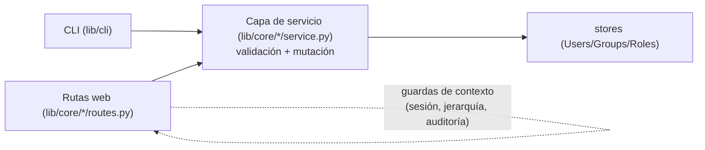

# CLI

`main.py` es a la vez el **lanzador de servicios** (panel web / monitor / syslog / eventos) y una
**herramienta de administración one-shot** (gestión de usuarios y grupos, estado y recarga de
servicios). Este documento cubre los **subcomandos de gestión**; los *modos de servicio*
(`--web` / `--monitor` / `--syslog` / `--events`) están en
[ref-configuracion.md → Opciones de Línea de Comandos](ref-configuracion.md#opciones-de-línea-de-comandos).

```bash
python3 main.py <opciones-globales> <subcomando> ...
```

Los subcomandos se ejecutan contra un **contexto headless** (solo la BD + los stores que hacen
falta; sin Flask, sin panel web, sin hilos de daemon) y **salen**. Comparten la BD con una
instancia en marcha, así que se pueden lanzar en caliente. Las opciones globales
(`-p/--path`, `-l/--lang`, `--log-level`) van **antes** del subcomando.

> **Nota:** operan directamente sobre los datos como el administrador del sistema — no aplican
> las guardas de contexto del solicitante (no editarte a ti mismo, jerarquía de roles) que sí
> aplican las rutas web; sí aplican las guardas de **datos** (política de contraseña, unicidad,
> "debe quedar al menos un admin activo").

---

## Gestión de usuarios (`user`)

| Comando | Descripción |
|---|---|
| `user add <username> [-P PW] [--role R] [--display N] [--email E] [--group G]… [--disabled]` | Crear un usuario. `--password/-P` se pide de forma oculta si se omite. `--role` acepta `admin`/`editor`/`viewer`/`none` o un rol personalizado (por defecto `none`). `--group` es repetible (nombre o uid). |
| `user enable <username>` | Activar un usuario |
| `user disable <username>` | Desactivar un usuario (no puede desactivarse el último admin activo) |
| `user passwd <username> [-P PW]` | Cambiar la contraseña (se pide oculta si se omite `-P`) |
| `user role <username> <role>` | Cambiar el rol (no puede quitarse el rol al último admin) |
| `user group-add <username> <group>` | Añadir el usuario a un grupo (por nombre o uid) |
| `user group-del <username> <group>` | Quitar el usuario de un grupo |

```bash
python3 main.py user add alice -P 'S3cret!' --role editor --email alice@example.com --group devs
python3 main.py user role alice admin
python3 main.py user disable bob
python3 main.py user passwd bob            # pide la contraseña de forma oculta
```

## Gestión de grupos (`group`)

| Comando | Descripción |
|---|---|
| `group add <name> [-d DESC] [--role R]…` | Crear un grupo. `--role` (repetible) concede roles al grupo; sus miembros heredan esos permisos. |
| `group del <name>` | Eliminar un grupo (por nombre o uid) y quitarlo de todos los usuarios. Los grupos integrados no se pueden borrar. |

```bash
python3 main.py group add devs -d 'Equipo de desarrollo' --role editor
python3 main.py group del devs
```

## Estado y recarga de servicios

| Comando | Descripción |
|---|---|
| `status` | Muestra el estado de los servicios de fondo (running / stopped / sin instancia), si están habilitados en config y cuántas instancias vivas hay (por latido reciente). |
| `reload` | Encola un comando `reload` para cada servicio-daemon; un proceso en marcha lo drena en su siguiente latido (~10 s), invalida la caché de config y reconcilia (arranca/para según `enabled`). |

```bash
python3 main.py status
python3 main.py reload
```

`reload` no reinicia el proceso: recarga la configuración y deja que cada servicio converja al
estado deseado. Los cambios que sí requieren reinicio del proceso (puerto, proxy_count, BD de
syslog) los indica el panel con su banner de reinicio.

---

## Arquitectura (fuente única, sin drift)

Regla general del proyecto: **las rutas son solo HTTP** (parseo de petición, sesión,
persistencia, auditoría) y la **lógica vive en un `service.py` sin Flask** por dominio, en
`lib/core/<dominio>/service.py`. Todos los dominios de núcleo siguen este patrón
(`users`, `groups`, `roles`, `modules`, `config`, `hosts`, `credentials`, `history`,
`overview`, `sessions`, `audit`); cada `service.py` es un conjunto de funciones puras sobre
dicts/stores que **valida + muta** y lanza `AdminOpError(key, *args)` (clave i18n) en las
violaciones — **sin** persistir ni auditar (de eso se encarga quien llama) y **sin** las
guardas de contexto del solicitante (jerarquía de roles, no-editarte-a-ti-mismo,
anti-escalada de permisos), que se quedan en la ruta porque necesitan la sesión.

El CLI reutiliza directamente las funciones de gestión que necesita:

- `lib/core/users/service.py` — `create_user`, `update_user`, `set_password`, `set_role`,
  `set_enabled`, `add_group`/`remove_group`, `validate_password` (+ `PasswordPolicy`),
  `resolve_role_uid`.
- `lib/core/groups/service.py` — `create_group`, `update_group`, `delete_group` (la
  membresía vive en el usuario, así que los add/remove-member están en el servicio de
  usuarios).
- `lib/core/roles/service.py` — `create_role`, `update_*_role`, `delete_role`,
  `build_roles_view`, `role_name_taken`, `filter_valid_permissions`.

Al compartir esta capa, las reglas (política de contraseña, unicidad, resolución de rol,
guarda de "último admin"…) tienen **una sola implementación**, usada por las rutas web y el
CLI sin duplicación:



- **CLI** (`lib/cli/`): `context.py` monta el contexto headless (copia el patrón de
  `MonitorService.__init__`: fernet + conector BD + stores); `commands.py` son los handlers.
- **Auto-discovery** (sin nombres hardcodeados): `status` lista los servicios vía
  `discover_embedded_services()` (descriptor `EMBEDDED_SERVICE`); `reload` apunta a los que
  corren un daemon que drena comandos vía `discover_standalone_services()` (descriptor
  `STANDALONE`) — un servicio nuevo se detecta solo. Ver [explica-descubrimiento.md](explica-descubrimiento.md).

> El único punto que **no** se comparte es `api_update_user` (role/enable/passwd por la vía
> web), que mantiene su lógica inline por su tracking granular de auditoría (`changes`); usa las
> mismas guardas de datos porque delega la política de contraseña en la capa de servicio.
