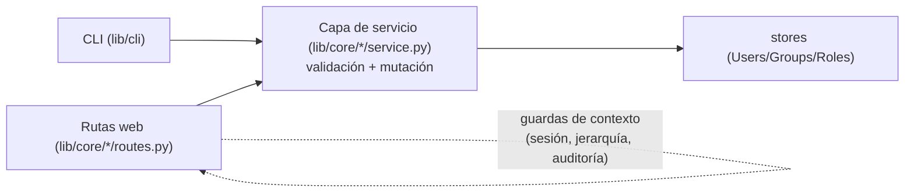

# CLI

`main.py` es a la vez el **lanzador de servicios** (panel web / monitor / syslog / eventos) y una
**herramienta de administración one-shot** (gestión de usuarios y grupos, estado y recarga de
servicios, sede de demostración). Este documento cubre los **subcomandos de gestión**; los *modos de servicio*
(`--web` / `--monitor` / `--syslog` / `--events`) están en
[ref-configuracion.md → Opciones de Línea de Comandos](ref-configuracion.md#opciones-de-línea-de-comandos).

```bash
python3 main.py <opciones-globales> <subcomando> ...
```

Los subcomandos se ejecutan contra un **contexto headless** (solo la BD + los stores que hacen
falta; sin Flask, sin panel web, sin hilos de daemon) y **salen**. Comparten la BD con una
instancia en marcha, así que se pueden lanzar en caliente. Las opciones globales
(`-p/--path`, `-l/--lang`, `--log-level`) van **antes** del subcomando.

> **Nota:** operan directamente sobre los datos como el administrador del sistema — no aplican
> las guardas de contexto del solicitante (no editarte a ti mismo, jerarquía de roles) que sí
> aplican las rutas web; sí aplican las guardas de **datos** (política de contraseña, unicidad,
> "debe quedar al menos un admin activo").

---

## Gestión de usuarios (`user`)

| Comando | Descripción |
|---|---|
| `user add <username> [-P PW] [--role R] [--display N] [--email E] [--group G]… [--disabled] [--no-login]` | Crear un usuario. `--password/-P` se pide de forma oculta si se omite. `--role` acepta `admin`/`editor`/`viewer`/`none` o un rol personalizado (por defecto `none`). `--group` es repetible (nombre o uid). `--no-login` crea una **cuenta de servicio**: activa (posee cosas, recibe avisos) pero sin inicio de sesión por ninguna vía — ver [explica-seguridad.md](explica-seguridad.md#cuentas-de-servicio-login_enabled). |
| `user enable <username>` | Activar un usuario |
| `user disable <username>` | Desactivar un usuario (no puede desactivarse el último admin activo) |
| `user passwd <username> [-P PW]` | Cambiar la contraseña (se pide oculta si se omite `-P`) |
| `user role <username> <role>` | Cambiar el rol (no puede quitarse el rol al último admin) |
| `user group-add <username> <group>` | Añadir el usuario a un grupo (por nombre o uid) |
| `user group-del <username> <group>` | Quitar el usuario de un grupo |
| `user unlock <username>` | Levantar el **bloqueo por intentos fallidos**. Aquí además de en el panel porque la cuenta bloqueada puede ser la única que habría podido pulsar el botón |
| `user mfa-reset <username>` | Quitar el **segundo factor** y sus códigos de recuperación. Ver [explica-mfa.md](explica-mfa.md#quitar-el-factor-de-otra-cuenta) |
| `user mfa-status` | Qué cuentas llevan segundo factor, y cuántos códigos de recuperación les quedan |

```bash
python3 main.py user add alice -P 'S3cret!' --role editor --email alice@example.com --group devs
python3 main.py user role alice admin
python3 main.py user disable bob
python3 main.py user passwd bob            # pide la contraseña de forma oculta
python3 main.py user unlock bob            # se equivocó cinco veces
python3 main.py user mfa-reset bob         # perdió el móvil Y los códigos
python3 main.py user mfa-status
```

> **Por qué el reset del MFA está también aquí.** El camino soportado desde la web pide el
> permiso `mfa_reset_others`, que no tiene nadie por defecto; si la única cuenta que lo llevaba
> es justo la que no puede entrar, el panel no ofrece salida. Esto la da desde la máquina, y no
> concede alcance nuevo: quien puede ejecutarlo ya puede leer la base de datos.

## Gestión de grupos (`group`)

| Comando | Descripción |
|---|---|
| `group add <name> [-d DESC] [--role R]…` | Crear un grupo. `--role` (repetible) concede roles al grupo; sus miembros heredan esos permisos. |
| `group del <name>` | Eliminar un grupo (por nombre o uid) y quitarlo de todos los usuarios. Los grupos integrados no se pueden borrar. |

```bash
python3 main.py group add devs -d 'Equipo de desarrollo' --role editor
python3 main.py group del devs
```

## Estado y recarga de servicios

| Comando | Descripción |
|---|---|
| `status` | Muestra el estado de los servicios de fondo (running / stopped / sin instancia), si están habilitados en config y cuántas instancias vivas hay (por latido reciente). |
| `reload` | Encola un comando `reload` para cada servicio-daemon; un proceso en marcha lo drena en su siguiente latido (~10 s), invalida la caché de config y reconcilia (arranca/para según `enabled`). |

```bash
python3 main.py status
python3 main.py reload
```

`reload` no reinicia el proceso: recarga la configuración y deja que cada servicio converja al
estado deseado. Los cambios que sí requieren reinicio del proceso (puerto, proxy_count, BD de
syslog) los indica el panel con su banner de reinicio.

## Sede de demostración (`dcim demo`)

| Comando | Descripción |
|---|---|
| `dcim demo` | Crea la sede **Demo** con todo lo que admite el inventario físico. Se niega si ya existe. |
| `dcim demo --replace` | La borra y la vuelve a crear. |
| `dcim demo --remove` | La borra con todo lo que cuelga de ella: filas, ficheros de plano y las dos empresas de ejemplo, si nada más las usa. |
| `dcim demo --no-images` | La crea sin bajar las fotos del fabricante de los básicos del catálogo que use (por defecto se bajan si hay internet). |

```bash
python3 main.py dcim demo
python3 main.py dcim demo --replace
python3 main.py dcim demo --remove
```

La sede tiene:

- **Cinco plantas** (sótano, baja, primera, segunda y tercera), cada una con su plano de fondo en
  SVG, sus muros, puertas hacia el pasillo y ventanas, y una escalera en el mismo punto de todas,
  que en 3D forma un único hueco.
- **Un edificio de verdad**, con 29 salas colocadas:
  - sótano: energía, grupo electrógeno y sala de baterías;
  - baja: comunicaciones de operadores, laboratorio, expediciones, recepción y una sala de
    reuniones grande, y un rack y un cuadro sueltos en la zona general;
  - primera: el CPD principal, el NOC y el almacén técnico;
  - segunda: oficina abierta de 24 puestos, cuatro despachos, dos salas de reuniones, sala de
    formación, office y la sala de comunicaciones de la planta;
  - tercera: sala de servidores refrigerada por splits de pared, sala HPC con pasillo caliente
    confinado y climatizadores en fila, comunicaciones de planta, oficina de 18 puestos, sala de
    reuniones y despacho.
- **Refrigeración de cada tipo**: pasillo frío confinado con CRAC de sala, pasillo caliente con
  climatizadores en fila, splits de pared y sin climatización. Los modelos dicen su flujo de aire
  (servidores de delante a detrás, switches de detrás a delante).
- **Equipos en aviso y en error**: la mayoría de los equipos activos de los CPD y de las salas de
  comunicaciones salen en verde, unos cuantos en aviso y otros en error; el laboratorio y la sede
  de respaldo quedan sin vigilar. Es un estado de demostración (`dc_item.demo_state`): la demo no
  crea dispositivos ni comprobaciones, así que el monitor no vigila nada y no puede llegar ninguna
  alerta de máquinas que no existen. Cada uno lo dice en su descripción.
- **Seguridad en el mapa**: todo lo que va en pared —los IQ, extintores, cuadros, BIE, pulsadores,
  alumbrado de emergencia, botiquín y DEA— está pegado a su pared y mirando a la sala. Cada sala
  tiene detectores de humo en el techo, alumbrado de emergencia sobre la puerta y extintor; cada
  pasillo, alumbrado sobre cada puerta, extintores, pulsadores y BIE; cada planta, su cuadro en la
  fachada; y recepción, botiquín y desfibrilador.
- **Control de accesos**, con modelos del catálogo general (los de Salto y un torno genérico de los
  básicos del panel, que la demo trae si faltan y que se quedan al borrarla): un IQ de Salto por planta, cilindros Neo en las puertas de las salas
  técnicas y los despachos, cerraduras XS4 Locker en las taquillas de recepción y los armarios de
  planta, y dos tornos con lector en la entrada. Cada cerradura cuelga del IQ de su planta; casi
  todas en verde, un cilindro con la pila baja, un torno sin comunicación y una taquilla con aviso
  de manipulación.
- **Comunicaciones de planta**: cada una con su rack, paneles de puestos cableados puerto a puerto a
  sus switches de acceso, SAI junto al rack y fibra a los dos núcleos.
- **Un CPD** con dos filas enfrentadas sobre un pasillo frío confinado, una fila de red con los
  dos núcleos, CRAC, bandejas, pilares y una zona de reserva. Hay racks medio vacíos y uno vacío,
  para que la vista «Ocupación» tenga contraste.
- **Equipos de todas las formas**: atornillados, de medio ancho, montados sobre una bandeja,
  delante y detrás, regletas en el lateral y un SAI en el suelo junto al rack. Algunos servidores
  llevan componentes (memoria, discos, fuentes).
- **Energía completa**: acometida → cuadro general → cuadro CPD → SAI A y SAI B (este en
  bypass) → regletas A/B de cada rack → tomas. Hay dos casos que la vista de energía señala: un
  servidor con los dos cables en la rama A y un rack de GPU por encima de la carga segura.
- **Cableado** dentro de los racks, entre racks, entre plantas por fibra, y dos enlaces WAN
  (MPLS e IPsec) con una segunda sede pequeña, **Demo · Respaldo**, que existe solo para que los
  enlaces tengan dónde llegar.
- **Dos empresas**: la operadora de la sede y un cliente que tiene dos racks alquilados.
- **Modelos propios con foto**: la demo trae sus modelos de catálogo (fabricante «Demo», origen
  `demo`) con sus puertos —cuántos, de qué tipo y dónde está cada uno— y con el frontal y la
  trasera en SVG, ficheros del repositorio en `lib/core/dcim/data/demo/faces/`, así que el alzado y el rack en 3D enseñan bahías
  de discos, puertos y fuentes en vez de cajas lisas. Se borran con la demo, salvo los que use
  algún equipo propio.

Se crea en el idioma de la instalación: los textos están en `lib/core/dcim/data/demo/<idioma>.json`
(castellano e inglés), y solo «Demo» se llama igual en todos. Solo toca las dos sedes que crea,
buscándolas por su nombre en cualquiera de los idiomas. Se escribe directamente en el
almacén, sin pasar por el panel, y cada equipo atornillado se comprueba antes con la misma regla
de hueco que aplica la API. Los equipos no están vinculados a ningún dispositivo vigilado, así
que su estado sale gris.

---

## Arquitectura (fuente única, sin drift)

Regla general del proyecto: **las rutas son solo HTTP** (parseo de petición, sesión,
persistencia, auditoría) y la **lógica vive en un `service.py` sin Flask** por dominio, en
`lib/core/<dominio>/service.py`. Todos los dominios de núcleo siguen este patrón
(`users`, `groups`, `roles`, `modules`, `config`, `devices`, `credentials`, `history`,
`overview`, `sessions`, `audit`); cada `service.py` es un conjunto de funciones puras sobre
dicts/stores que **valida + muta** y lanza `AdminOpError(key, *args)` (clave i18n) en las
violaciones — **sin** persistir ni auditar (de eso se encarga quien llama) y **sin** las
guardas de contexto del solicitante (jerarquía de roles, no-editarte-a-ti-mismo,
anti-escalada de permisos), que se quedan en la ruta porque necesitan la sesión.

El CLI reutiliza directamente las funciones de gestión que necesita:

- `lib/core/users/service.py` — `create_user`, `update_user`, `set_password`, `set_role`,
  `set_enabled`, `add_group`/`remove_group`, `validate_password` (+ `PasswordPolicy`),
  `resolve_role_uid`.
- `lib/core/groups/service.py` — `create_group`, `update_group`, `delete_group` (la
  membresía vive en el usuario, así que los add/remove-member están en el servicio de
  usuarios).
- `lib/core/roles/service.py` — `create_role`, `update_*_role`, `delete_role`,
  `build_roles_view`, `role_name_taken`, `filter_valid_permissions`.

Al compartir esta capa, las reglas (política de contraseña, unicidad, resolución de rol,
guarda de "último admin"…) tienen **una sola implementación**, usada por las rutas web y el
CLI sin duplicación:


```mermaid
flowchart LR
    cli["CLI (lib/cli)"] --> svc
    web["Rutas web (lib/core/*/routes.py)"] --> svc
    svc["Capa de servicio (lib/core/*/service.py)<br/>validación + mutación"] --> stores["stores (Users/Groups/Roles)"]
    web -. guardas de contexto<br/>(sesión, jerarquía, auditoría) .-> web
```

- **CLI** (`lib/cli/`): `context.py` monta el contexto headless (copia el patrón de
  `MonitorService.__init__`: fernet + conector BD + stores); `commands.py` son los handlers.
- **Auto-discovery** (sin nombres hardcodeados): `status` lista los servicios vía
  `discover_embedded_services()` (descriptor `EMBEDDED_SERVICE`); `reload` apunta a los que
  corren un daemon que drena comandos vía `discover_standalone_services()` (descriptor
  `STANDALONE`) — un servicio nuevo se detecta solo. Ver [explica-descubrimiento.md](explica-descubrimiento.md).

> El único punto que **no** se comparte es `api_update_user` (role/enable/passwd por la vía
> web), que mantiene su lógica inline por su tracking granular de auditoría (`changes`); usa las
> mismas guardas de datos porque delega la política de contraseña en la capa de servicio.
