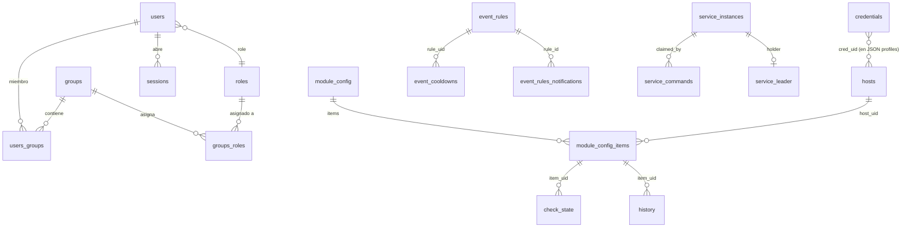

# Esquema de base de datos (runtime)

> Referencia de las **tablas físicas** que ServiceSentry crea y usa en ejecución.
>
> ⚠️ No confundir con [ref-schema-json.md](ref-schema-json.md), que documenta el `schema.json` de los
> módulos (definición de campos de configuración), **no** la base de datos.

**Fuente de verdad:** cada tabla se declara **una sola vez** como un `TableSpec`
([lib/db/schema.py:50](../src/lib/db/schema.py#L50)) compuesto de `Column` / `Index`, y se
reconcilia en el arranque de cada *store* mediante `connector.reconcile_table(spec)`
([lib/db/base.py:222](../src/lib/db/base.py#L222)). Los tipos simbólicos (`TEXT`, `INTEGER`,
`REAL`, `AUTOINCREMENT`) se traducen a DDL nativo por motor (ver
[§ Portabilidad multi-motor](#portabilidad-multi-motor)).

Backends soportados: **SQLite** (por defecto), **MySQL/MariaDB**, **PostgreSQL**. El
esquema se valida y evoluciona automáticamente en cada arranque; **no** hay migraciones
manuales ni herramienta de migración externa.

> **Nota de exactitud:** este documento se generó leyendo las declaraciones `TableSpec` en
> el código. No existen claves foráneas declaradas: **el motor nunca emite `FOREIGN KEY`**;
> las relaciones son referencias por UID (integridad gestionada en la capa de aplicación).

---

## Índice de tablas

Hay **32 tablas** core/servicio, más un mecanismo de tablas de módulo dinámicas
(`mod_<módulo>_<nombre>`) que hoy **ningún watchful declara**.

| Grupo | Tablas |
| ----- | ------ |
| Identidad / control de acceso | `users`, `users_groups`, `groups`, `groups_roles`, `roles`, `sessions` |
| Configuración | `config`, `module_config`, `module_config_items` |
| Activos / secretos | `credentials`, `hosts` |
| Auditoría / historial / estado | `audit`, `history`, `check_state` |
| Notificaciones | `webhooks`, `msteams_channels`, `msteams_bot_refs` |
| Gestor de eventos | `event_rules`, `event_rules_notifications`, `event_cursor`, `event_cooldowns` |
| fail2ban / ipban | `ip_bans`, `ip_ban_history`, `ip_offense_counters`, `ip_offense_log`, `ip_service_action`, `ip_whitelist` |
| Syslog | `syslog`, `syslog_drops` |
| Plano de control distribuido | `service_instances`, `service_leader`, `service_commands` |

> **Telegram no tiene tabla**: sus destinatarios viven en la configuración.
> **`syslog` / `syslog_drops`** pueden vivir en un **conector dedicado** (BD de syslog
> separada) si se configura `syslog_db`; el resto usa el conector principal.

---

## Diagrama entidad-relación

---

## Identidad / control de acceso

### `users` — cuentas de usuario del WebAdmin
[lib/core/users/store.py:40](../src/lib/core/users/store.py#L40)

| Columna | Tipo | Null | Default | Clave |
|---|---|---|---|---|
| uid | TEXT | no | — | PK |
| username | TEXT | no | `''` | UNIQUE |
| password_hash | TEXT | no | `''` | |
| role | TEXT | no | `''` | |
| display_name | TEXT | no | `''` | |
| email | TEXT | no | `''` | |
| lang | TEXT | no | `''` | |
| dark_mode | INTEGER | sí | — | |
| enabled | INTEGER | no | `1` | |
| auth_source | TEXT | no | `'local'` | |
| extra | TEXT | no | `'{}'` | JSON (overflow: preferencias, `table_config`, `landing_page`…) |
| created_at | TEXT | no | `''` | |
| updated_at | TEXT | no | `''` | |
| updated_by | TEXT | no | `''` | |

Índices: `idx_users_role(role)`.

### `users_groups` — pertenencia usuario↔grupo (M:N)
[lib/core/users/store.py:61](../src/lib/core/users/store.py#L61)

| Columna | Tipo | Null | Default | Clave |
|---|---|---|---|---|
| uid | TEXT | no | — | PK (id de fila sintético) |
| user_uid | TEXT | no | — | → `users.uid` |
| group_uid | TEXT | no | — | → `groups.uid` |

Restricción única: `(user_uid, group_uid)`.
Índices: `idx_users_groups_user(user_uid)`, `idx_users_groups_group(group_uid)`.

### `groups` — grupos de usuarios
[lib/core/groups/store.py:28](../src/lib/core/groups/store.py#L28)

| Columna | Tipo | Null | Default | Clave |
|---|---|---|---|---|
| uid | TEXT | no | — | PK |
| name | TEXT | no | `''` | índice único |
| description | TEXT | no | `''` | |
| enabled | INTEGER | no | `1` | |
| landing_page | TEXT | no | `''` | |
| source | TEXT | no | `'local'` | |
| external_id | TEXT | no | `''` | SCIM externalId |
| created_at | TEXT | no | `''` | |
| updated_at | TEXT | no | `''` | |
| updated_by | TEXT | no | `''` | |

Índices: `idx_groups_name(name)` UNIQUE. El nombre `groups` se **entrecomilla** (palabra
reservada en MySQL) — [store.py:77](../src/lib/core/groups/store.py#L77).

### `groups_roles` — asignación grupo↔rol (M:N)
[lib/core/groups/store.py:45](../src/lib/core/groups/store.py#L45)

| Columna | Tipo | Null | Default | Clave |
|---|---|---|---|---|
| uid | TEXT | no | — | PK |
| group_uid | TEXT | no | — | → `groups.uid` |
| role_uid | TEXT | no | — | → `roles.uid` |
| created_at | TEXT | no | `''` | |
| created_by | TEXT | no | `''` | |

Restricción única: `(group_uid, role_uid)`. Índices: `idx_gr_group`, `idx_gr_role`.

### `roles` — roles personalizados + overrides de built-in
[lib/core/roles/store.py:25](../src/lib/core/roles/store.py#L25)

| Columna | Tipo | Null | Default | Clave |
|---|---|---|---|---|
| uid | TEXT | no | — | PK |
| name | TEXT | no | `''` | índice único |
| description | TEXT | no | `''` | |
| permissions | TEXT | no | `'[]'` | lista JSON de permisos |
| enabled | INTEGER | no | `1` | |
| created_at | TEXT | no | `''` | |
| updated_at | TEXT | no | `''` | |
| updated_by | TEXT | no | `''` | |

Índices: `idx_roles_name(name)` UNIQUE.

### `sessions` — sesiones del WebAdmin
[lib/core/sessions/store.py:24](../src/lib/core/sessions/store.py#L24)

| Columna | Tipo | Null | Default | Clave |
|---|---|---|---|---|
| uid | TEXT | no | — | **PK** (id de sesión estable) |
| token | TEXT | no | `''` | UNIQUE (secreto) |
| user_uid | TEXT | no | `''` | → `users.uid` |
| created | TEXT | no | `''` | |
| last_seen | TEXT | no | `''` | |
| ip | TEXT | no | `''` | |
| user_agent | TEXT | no | `''` | |

Índices: `idx_sessions_user_uid(user_uid)`. Rename heredado: `sid`→`uid`.

---

## Configuración

### `config` — configuración editable (una fila por campo)
[lib/core/config/store.py:36](../src/lib/core/config/store.py#L36)

| Columna | Tipo | Null | Default | Clave |
|---|---|---|---|---|
| uid | TEXT | no | — | PK |
| path | TEXT | no | `''` | UNIQUE (`sección\|campo`) |
| value | TEXT | no | `''` | JSON |
| created_at | TEXT | no | `''` | |
| updated_at | TEXT | no | `''` | |
| updated_by | TEXT | no | `''` | |

Índices: `idx_config_path(path)`. Ver [ref-configuracion.md](ref-configuracion.md) para el flujo
config.json (solo lectura/arranque) → BD (editable).

### `module_config` — configuración por módulo watchful
[lib/core/modules/store.py:65](../src/lib/core/modules/store.py#L65)

| Columna | Tipo | Null | Default | Clave |
|---|---|---|---|---|
| uid | TEXT | no | — | PK |
| module | TEXT | no | `''` | UNIQUE |
| data | TEXT | no | `'{}'` | JSON (nivel-módulo + meta `__*__`) |
| created_at | TEXT | no | `''` | |
| updated_at | TEXT | no | `''` | |
| updated_by | TEXT | no | `''` | |

Índices: `idx_module_config_module(module)`.

### `module_config_items` — configuración por item
[lib/core/modules/store.py:79](../src/lib/core/modules/store.py#L79)

| Columna | Tipo | Null | Default | Clave |
|---|---|---|---|---|
| uid | TEXT | no | — | PK (clave del item en el dict) |
| module_uid | TEXT | no | `''` | → `module_config.uid` |
| collection | TEXT | no | `'list'` | |
| host_uid | TEXT | no | `''` | → `hosts.uid` |
| label | TEXT | no | `''` | |
| enabled | INTEGER | no | `1` | |
| data | TEXT | no | `'{}'` | JSON (resto del item) |
| created_at | TEXT | no | `''` | |
| updated_at | TEXT | no | `''` | |
| updated_by | TEXT | no | `''` | |

Índices: `idx_module_config_items_moduid(module_uid)`, `idx_module_config_items_host(host_uid)`.

---

## Activos / secretos

> Los campos secretos se cifran **a nivel de valor** con Fernet dentro de las columnas JSON
> (`data`/`profiles`). Ver [explica-seguridad.md](explica-seguridad.md).

### `credentials` — credenciales SSH reutilizables
[lib/core/credentials/store.py:40](../src/lib/core/credentials/store.py#L40)

| Columna | Tipo | Null | Default | Clave |
|---|---|---|---|---|
| uid | TEXT | no | — | PK |
| name | TEXT | no | `''` | UNIQUE |
| ctype | TEXT | no | `'ssh'` | |
| enabled | INTEGER | no | `1` | |
| description | TEXT | no | `''` | |
| data | TEXT | no | `'{}'` | JSON, secretos cifrados |
| created_at | TEXT | no | `''` | |
| updated_at | TEXT | no | `''` | |
| updated_by | TEXT | no | `''` | |

Índices: `idx_credentials_name(name)`.

### `hosts` — hosts monitorizados
[lib/core/hosts/store.py:36](../src/lib/core/hosts/store.py#L36)

| Columna | Tipo | Null | Default | Clave |
|---|---|---|---|---|
| uid | TEXT | no | — | PK |
| name | TEXT | no | `''` | UNIQUE |
| address | TEXT | no | `''` | |
| kind | TEXT | no | `'local'` | local/remote |
| os | TEXT | no | `'auto'` | |
| maintenance | INTEGER | no | `0` | |
| virtual | INTEGER | no | `0` | (reservada, entrecomillada) |
| tags | TEXT | no | `'[]'` | lista JSON |
| description | TEXT | no | `''` | |
| profiles | TEXT | no | `'{}'` | JSON, perfiles por protocolo; secretos cifrados |
| modules | TEXT | no | `'[]'` | lista JSON |
| created_at | TEXT | no | `''` | |
| updated_at | TEXT | no | `''` | |
| updated_by | TEXT | no | `''` | |

Índices: `idx_hosts_name(name)`. Ver [explica-hosts.md](explica-hosts.md) para el modelo host-céntrico.

---

## Auditoría / historial / estado

### `audit` — registro de auditoría
[lib/core/audit/store.py:25](../src/lib/core/audit/store.py#L25)

| Columna | Tipo | Null | Default | Clave |
|---|---|---|---|---|
| id | AUTOINCREMENT | — | — | PK |
| ts | TEXT | no | `''` | ISO 8601 |
| event | TEXT | no | `''` | |
| user | TEXT | no | `''` | (reservada en PG, entrecomillada) |
| ip | TEXT | no | `''` | |
| detail | TEXT | no | `''` | JSON |

Índices: `idx_audit_id(id DESC)`, `idx_audit_event(event)`.

### `history` — series temporales de resultados de checks
[lib/core/history/store.py:38](../src/lib/core/history/store.py#L38)

| Columna | Tipo | Null | Default | Clave |
|---|---|---|---|---|
| id | AUTOINCREMENT | — | — | PK |
| ts | REAL | no | — | epoch Unix |
| module | TEXT | no | — | |
| item_uid | TEXT | sí | — | → item configurado |
| key | TEXT | no | — | (reservada en MySQL, entrecomillada) |
| status | INTEGER | no | — | 1=OK / 0=error |
| data | TEXT | sí | — | JSON |

Índices: `idx_history_uid_ts(item_uid, ts)`, `idx_history_mkts(module, key, ts)`.
El *downsampling* por buckets usa `CAST(FLOOR((ts - ?) / ?) AS <int>)` (portable multi-motor).

### `check_state` — estado vivo por check (reemplaza status.json)
[lib/services/monitoring/check_state/store.py:49](../src/lib/services/monitoring/check_state/store.py#L49)

| Columna | Tipo | Null | Default | Clave |
|---|---|---|---|---|
| uid | TEXT | no | — | PK (sintético) |
| module | TEXT | no | — | |
| key | TEXT | no | — | UID del item (entrecomillada) |
| item_uid | TEXT | sí | — | |
| metric | TEXT | no | `''` | |
| status | INTEGER | no | — | |
| message | TEXT | sí | — | |
| other_data | TEXT | sí | — | JSON |
| fail_count | INTEGER | no | `0` | |
| last_change_ts | REAL | no | `0` | |
| severity | TEXT | no | `''` | `''` / error / warning |

Restricción única: `(module, key, metric)`. Sin índices secundarios.

---

## Notificaciones

### `webhooks` — webhooks salientes
[lib/core/notify/webhook/store.py:29](../src/lib/core/notify/webhook/store.py#L29)

| Columna | Tipo | Null | Default | Clave |
|---|---|---|---|---|
| uid | TEXT | no | — | PK |
| data | TEXT | no | `'{}'` | JSON (url/method/…/secret cifrado) |
| created_at | TEXT | no | `''` | |
| updated_at | TEXT | no | `''` | |
| updated_by | TEXT | no | `''` | |

Sin índices.

### `msteams_channels` — destinos de canal Teams
[lib/core/notify/msteams/store.py:28](../src/lib/core/notify/msteams/store.py#L28)

Misma forma que `webhooks` (`uid` PK, `data` JSON con `webhook_url` cifrado, timestamps de
auditoría). Sin índices.

### `msteams_bot_refs` — referencias de conversación de Bot Framework
[lib/core/notify/msteams/bot_store.py:27](../src/lib/core/notify/msteams/bot_store.py#L27)

| Columna | Tipo | Null | Default | Clave |
|---|---|---|---|---|
| user_key | TEXT | no | — | PK (aad id / UPN, en minúsculas) |
| data | TEXT | no | `'{}'` | JSON |
| updated_at | TEXT | no | `''` | |

Sin índices.

---

## Gestor de eventos

### `event_rules` — reglas evento→notificación
[lib/services/events/store/rules.py:34](../src/lib/services/events/store/rules.py#L34)

| Columna | Tipo | Null | Default | Clave |
|---|---|---|---|---|
| uid | TEXT | no | — | PK |
| name | TEXT | no | `''` | |
| enabled | INTEGER | no | `1` | |
| description | TEXT | no | `''` | |
| data | TEXT | no | `'{}'` | JSON (source/events/channels/…) |
| created_at | TEXT | no | `''` | |
| updated_at | TEXT | no | `''` | |
| updated_by | TEXT | no | `''` | |

Índices: `idx_event_rules_name(name)`.

### `event_rules_notifications` — log de envíos de notificación
[lib/services/events/store/log.py:22](../src/lib/services/events/store/log.py#L22)

| Columna | Tipo | Null | Default | Clave |
|---|---|---|---|---|
| id | AUTOINCREMENT | — | — | PK |
| ts | REAL | no | `0` | |
| rule_id | TEXT | no | `''` | → `event_rules.uid` |
| rule_name | TEXT | no | `''` | |
| source | TEXT | no | `''` | |
| channels | TEXT | no | `''` | |
| ok | INTEGER | no | `0` | |
| message | TEXT | no | `''` | |

Índices: `idx_notiflog_ts(ts)`. Limitado a 1000 filas.

### `event_cursor` — cursor de ingesta por fuente
[lib/services/events/store/cursor.py:20](../src/lib/services/events/store/cursor.py#L20)

| Columna | Tipo | Null | Default | Clave |
|---|---|---|---|---|
| uid | TEXT | no | — | PK |
| source | TEXT | no | `''` | UNIQUE (`audit`/`syslog`) |
| last_id | INTEGER | no | `0` | |

### `event_cooldowns` — timestamps de enfriamiento por regla
[lib/services/events/store/cooldowns.py:20](../src/lib/services/events/store/cooldowns.py#L20)

| Columna | Tipo | Null | Default | Clave |
|---|---|---|---|---|
| uid | TEXT | no | — | PK |
| rule_uid | TEXT | no | `''` | UNIQUE → `event_rules.uid` |
| last_fire | REAL | no | `0` | |

---

## fail2ban / ipban

> Familia compartida entre procesos (el monitor y el WebAdmin comparten la misma BD).
> Ver [explica-servicios.md](explica-servicios.md).

### `ip_bans` — jail activo
[lib/services/ipban/store/bans.py:19](../src/lib/services/ipban/store/bans.py#L19)

| Columna | Tipo | Null | Default | Clave |
|---|---|---|---|---|
| uid | TEXT | no | — | PK |
| ip | TEXT | no | `''` | UNIQUE |
| reason | TEXT | no | `''` | |
| category | TEXT | no | `''` | |
| level | INTEGER | no | `1` | |
| offenses | INTEGER | no | `0` | |
| banned_at | REAL | no | `0` | |
| banned_until | REAL | sí | — | NULL = permanente |
| first_seen | REAL | no | `0` | |
| created_by | TEXT | no | `'system'` | |
| detail | TEXT | no | `''` | |
| block_action | TEXT | no | `''` | |

Índices: `idx_ip_bans_until(banned_until)`. Limitado a 5000 filas.

### `ip_ban_history` — eventos de ciclo de vida de baneos
[lib/services/ipban/store/history.py:16](../src/lib/services/ipban/store/history.py#L16)

| Columna | Tipo | Null | Default | Clave |
|---|---|---|---|---|
| id | AUTOINCREMENT | — | — | PK |
| ip | TEXT | no | `''` | |
| event | TEXT | no | `''` | banned/escalated/unbanned |
| reason | TEXT | no | `''` | |
| category | TEXT | no | `''` | |
| level | INTEGER | no | `0` | |
| offenses | INTEGER | no | `0` | |
| banned_at | REAL | no | `0` | |
| banned_until | REAL | sí | — | |
| created_by | TEXT | no | `'system'` | |
| ts | REAL | no | `0` | |

Índices: `idx_ip_banhist_ip(ip, id)`. Limitado a 20000 filas.

### `ip_offense_counters` — contadores de ventana fija
[lib/services/ipban/store/offense_counters.py:18](../src/lib/services/ipban/store/offense_counters.py#L18)

| Columna | Tipo | Null | Default | Clave |
|---|---|---|---|---|
| uid | TEXT | no | — | PK |
| ip | TEXT | no | `''` | |
| track | TEXT | no | `''` | |
| count | INTEGER | no | `0` | |
| window_start | REAL | no | `0` | |
| updated_at | REAL | no | `0` | |

Restricción única: `(ip, track)`. Índices: `idx_ip_offc_updated(updated_at)`. Limitado a 20000.

### `ip_offense_log` — log de intentos por IP
[lib/services/ipban/store/offense_log.py:14](../src/lib/services/ipban/store/offense_log.py#L14)

| Columna | Tipo | Null | Default | Clave |
|---|---|---|---|---|
| id | AUTOINCREMENT | — | — | PK |
| ip | TEXT | no | `''` | |
| ts | REAL | no | `0` | |
| category | TEXT | no | `''` | |

Índices: `idx_ip_offlog_ip(ip, id)`. Limitado a 20000.

### `ip_service_action` — acción de bloqueo por servicio
[lib/services/ipban/store/service_actions.py:18](../src/lib/services/ipban/store/service_actions.py#L18)

| Columna | Tipo | Null | Default | Clave |
|---|---|---|---|---|
| uid | TEXT | no | — | PK |
| service | TEXT | no | `''` | UNIQUE |
| action | TEXT | no | `''` | |

### `ip_whitelist` — lista de nunca-banear
[lib/services/ipban/store/whitelist.py:20](../src/lib/services/ipban/store/whitelist.py#L20)

| Columna | Tipo | Null | Default | Clave |
|---|---|---|---|---|
| uid | TEXT | no | — | PK |
| value | TEXT | no | `''` | UNIQUE (IP/CIDR) |
| description | TEXT | no | `''` | |
| created_at | REAL | no | `0` | |
| created_by | TEXT | no | `''` | |

Índices: `idx_ip_whitelist_value(value)`. Limitado a 2000.

---

## Syslog

> `syslog` y `syslog_drops` pueden residir en un **conector dedicado** (BD separada) si se
> configura `syslog_db`. Ver [ref-configuracion.md](ref-configuracion.md) y [explica-servicios.md](explica-servicios.md).

### `syslog` — mensajes recibidos
[lib/services/syslog/store/messages.py:22](../src/lib/services/syslog/store/messages.py#L22)

| Columna | Tipo | Null | Default | Clave |
|---|---|---|---|---|
| id | AUTOINCREMENT | — | — | PK |
| ts | REAL | no | — | |
| received_at | TEXT | no | `''` | |
| source | TEXT | no | `''` | |
| hostname | TEXT | no | `''` | |
| app | TEXT | no | `''` | |
| procid | TEXT | no | `''` | |
| severity | INTEGER | no | `5` | |
| facility | INTEGER | no | `1` | |
| msgid | TEXT | no | `''` | |
| message | TEXT | no | `''` | |
| raw | TEXT | no | `''` | |

Índices: `idx_syslog_ts`, `idx_syslog_sev_ts(severity, ts)`, `idx_syslog_host_ts(hostname, ts)`,
`idx_syslog_app_ts(app, ts)`, `idx_syslog_fac_ts(facility, ts)`.

### `syslog_drops` — emisores rechazados por allowlist
[lib/services/syslog/store/drops.py:20](../src/lib/services/syslog/store/drops.py#L20)

| Columna | Tipo | Null | Default | Clave |
|---|---|---|---|---|
| uid | TEXT | no | — | PK |
| source | TEXT | no | `''` | UNIQUE |
| transport | TEXT | no | `''` | |
| count | INTEGER | no | `0` | |
| first_seen | REAL | no | `0` | |
| last_seen | REAL | no | `0` | |

Índices: `idx_syslog_drops_last(last_seen)`. Limitado a 500.

---

## Plano de control distribuido

> Solo relevante en modo microservicios (servicios standalone). Ver [explica-servicios.md](explica-servicios.md)
> y [caso-kubernetes.md](caso-kubernetes.md).

### `service_instances` — estado observado por heartbeat
[lib/services/manager/instances.py:30](../src/lib/services/manager/instances.py#L30)

| Columna | Tipo | Null | Default | Clave |
|---|---|---|---|---|
| uid | TEXT | no | — | PK |
| instance_id | TEXT | no | `''` | UNIQUE |
| service_key | TEXT | no | `''` | monitoring/syslog/events |
| mode | TEXT | no | `''` | embedded/standalone |
| host | TEXT | sí | — | |
| pid | INTEGER | sí | — | |
| version | TEXT | sí | — | |
| control_url | TEXT | sí | — | |
| running | INTEGER | no | `0` | |
| started_at | REAL | sí | — | |
| last_seen | REAL | sí | — | |
| last_cycle_at | REAL | sí | — | |
| detail | TEXT | no | `''` | JSON |

Índices: `idx_svcinst_key(service_key)`, `idx_svcinst_lastseen(last_seen)`.

### `service_leader` — lease de líder (alta disponibilidad)
[lib/services/manager/leader.py:34](../src/lib/services/manager/leader.py#L34)

| Columna | Tipo | Null | Default | Clave |
|---|---|---|---|---|
| uid | TEXT | no | — | PK |
| service_key | TEXT | no | `''` | UNIQUE |
| holder_instance_id | TEXT | no | `''` | → `service_instances.instance_id` |
| holder_host | TEXT | sí | — | |
| acquired_at | REAL | sí | — | |
| renewed_at | REAL | sí | — | |
| expires_at | REAL | sí | — | |

### `service_commands` — cola de comandos one-shot
[lib/services/manager/commands.py:27](../src/lib/services/manager/commands.py#L27)

| Columna | Tipo | Null | Default | Clave |
|---|---|---|---|---|
| id | AUTOINCREMENT | — | — | PK |
| service_key | TEXT | no | `''` | |
| action | TEXT | no | `''` | |
| args | TEXT | no | `''` | JSON |
| created_by | TEXT | no | `''` | |
| created_at | REAL | sí | — | |
| claimed_at | REAL | sí | — | |
| claimed_by | TEXT | sí | — | → `instance_id` |
| done_at | REAL | sí | — | |
| ok | INTEGER | sí | — | null hasta terminar |
| result | TEXT | sí | — | |

Índices: `idx_svccmd_pending(service_key, claimed_at)`, `idx_svccmd_created(created_at)`.

---

## Tablas de módulo dinámicas

Un watchful puede declarar tablas propias vía `discover_db_tables()`, namespaced por
`module_table()` como `mod_<módulo>_<nombre>`
([lib/db/module_tables.py:60](../src/lib/db/module_tables.py#L60)) y reconciliadas en el
arranque por `reconcile_module_tables()`
([lib/db/module_tables.py:153](../src/lib/db/module_tables.py#L153)). Un fallo aquí **nunca
aborta el arranque**.

> **Estado actual:** ningún watchful del árbol declara tablas de módulo (0 coincidencias de
> `discover_db_tables` en `src/watchfuls`). Es un mecanismo disponible sin tablas en uso.

**Fuera del conector:** `watchfuls/snmp/mib_catalog.py` abre su propio archivo SQLite de
catálogo MIB con `sqlite3.connect` directo — **no** pasa por la capa de conectores ni se
reconcilia.

---

## Portabilidad multi-motor

### Modelo declarativo (definición única)

Cada tabla es un `TableSpec` inmutable de `Column` (nombre, tipo simbólico, nullable,
default, primary_key, unique) e `Index`, más `composite_pk`, `unique_constraints` y
`renames` (viejo→nuevo) opcionales.

### Reconcile en el arranque — `reconcile_table(spec)` ([base.py:222](../src/lib/db/base.py#L222))

1. Si la tabla no existe → `create_table_ddl` + un `create_index_ddl` por índice.
2. Aplica renames declarados primero (solo si la col vieja existe y la nueva no) — portable
   `ALTER TABLE … RENAME COLUMN`.
3. Introspecciona el esquema vivo (`describe_table`, `list_indexes`) y calcula `diff_table`.
4. Si hay diff: `needs_rebuild` (desajuste de tipo/nullable/default/pk/orden, o falta una
   columna no-final) → `_apply_rebuild`; si no → `_apply_incremental`.
5. Columnas/índices presentes en la BD pero **ausentes** del spec se **conservan y registran,
   nunca se eliminan**.

### Camino incremental — `_apply_incremental` ([base.py:315](../src/lib/db/base.py#L315))

- `add_column_if_missing` para columnas finales.
- Una columna NOT NULL **sin default** se añade **nullable** (seguridad multi-motor).
- `UNIQUE` **nunca** se inlinea en `ADD COLUMN`: se crea un índice único aparte
  `ux_<tabla>_<col>`.
- Índices cambiados se eliminan y recrean.

### Camino de reconstrucción — `_apply_rebuild` ([base.py:358](../src/lib/db/base.py#L358))

Crear-copiar-borrar-renombrar en una transacción (SQLite/PostgreSQL, DDL transaccional).
`COALESCE(col, default)` rellena columnas recién NOT NULL. MySQL lo sobreescribe
([mysql.py:96](../src/lib/db/mysql.py#L96)) porque su DDL auto-commitea: construye la tabla
de reemplazo y hace un `RENAME TABLE` atómico.

### Mapa de tipos por motor — `_type_map` ([base.py:211](../src/lib/db/base.py#L211))

| Token simbólico | SQLite | MySQL | PostgreSQL |
|---|---|---|---|
| `AUTOINCREMENT` | `INTEGER PRIMARY KEY AUTOINCREMENT` | `INT AUTO_INCREMENT PRIMARY KEY` | `SERIAL PRIMARY KEY` |
| `REAL` | `REAL` | `DOUBLE` | `DOUBLE PRECISION` |
| `TEXT` | `TEXT` | `TEXT` | `TEXT` |
| `INTEGER` | `INTEGER` | `INT` | `INTEGER` |
| `TEXT_KEY` (TEXT indexado) | `TEXT` | `VARCHAR(255)` | `TEXT` |

`TEXT_KEY` es el tipo de columna clave/indexada: cualquier columna TEXT que sea PK, única o
parte de un índice lo usa (MySQL no puede indexar TEXT sin límite → `VARCHAR(255)`).

- `KIND` (`'sqlite'`/`'mysql'`/`'postgresql'`) decide el last-insert-id y la extracción JSON.
- `quote_ident`: comillas dobles por defecto, backtick en MySQL.
- Normalización de tipos para el diff: `canonical_type` / `canonical_default`
  ([schema.py:95](../src/lib/db/schema.py#L95)).

### Notas

- **Backfill a nivel de store**, no en el motor: users/groups/roles rellenan columnas de
  auditoría vacías tras el reconcile; los secretos se cifran a nivel de valor con Fernet
  dentro de columnas JSON.
- El arnés de portabilidad en vivo (`tests/test_db_portability_live.py`) valida el ciclo
  completo contra MySQL/PostgreSQL reales (opt-in por variables de entorno).

---

## Ver también

- [explica-arquitectura.md](explica-arquitectura.md) — visión general de componentes y concurrencia
- [ref-configuracion.md](ref-configuracion.md) — flujo config.json → BD y tablas de módulo
- [ref-schema-json.md](ref-schema-json.md) — `schema.json` de módulos (NO la BD)
- [explica-servicios.md](explica-servicios.md) — servicios de fondo y plano de control
- [explica-seguridad.md](explica-seguridad.md) — cifrado de secretos en reposo
