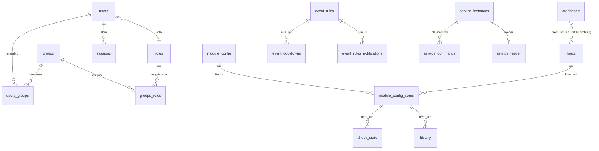

# Esquema de base de datos (runtime)

> Referencia de las **tablas físicas** que ServiceSentry crea y usa en ejecución.
>
> ⚠️ No confundir con [ref-schema-json.md](ref-schema-json.md), que documenta el `schema.json` de los
> módulos (definición de campos de configuración), **no** la base de datos.

**Fuente de verdad:** cada tabla se declara **una sola vez** como un `TableSpec`
([lib/db/schema.py:51](../src/lib/db/schema.py#L51)) compuesto de `Column` / `Index`, y se
reconcilia en el arranque de cada *store* mediante `connector.reconcile_table(spec)`
([lib/db/base.py:232](../src/lib/db/base.py#L232)). Los tipos simbólicos (`TEXT`, `INTEGER`,
`REAL`, `AUTOINCREMENT`) se traducen a DDL nativo por motor (ver
[§ Portabilidad multi-motor](#portabilidad-multi-motor)).

Backends soportados: **SQLite** (por defecto), **MySQL/MariaDB**, **PostgreSQL**. El
esquema se valida y evoluciona automáticamente en cada arranque; **no** hay migraciones
manuales ni herramienta de migración externa.

> **Nota de exactitud:** este documento se generó leyendo las declaraciones `TableSpec` en
> el código. No existen claves foráneas declaradas: **el motor nunca emite `FOREIGN KEY`**;
> las relaciones son referencias por UID (integridad gestionada en la capa de aplicación).

---

## Índice de tablas

Hay **67 tablas** core/servicio, más un mecanismo de tablas de módulo dinámicas
(`mod_<módulo>_<nombre>`) que hoy **ningún watchful declara**.

> Las dos de SNMP se llamaron `mod_snmp_*` mientras la biblioteca MIB era de un módulo.
> Al pasar al core perdieron el prefijo: existe para que dos módulos no colisionen, y
> el core ya es un espacio de nombres — `snmp_catalog` va al lado de `hosts` y
> `history`. Se renombraron sin migración porque no había nada en producción.

| Grupo | Tablas |
| ----- | ------ |
| Identidad / control de acceso | `users`, `users_groups`, `groups`, `groups_roles`, `roles`, `sessions`, `session_access`, `mfa_factors`, `mfa_recovery`, `api_tokens`, `api_token_access` |
| Coordinación entre procesos | `entity_versions` |
| Configuración | `config`, `module_config`, `module_config_items` |
| Activos / secretos | `credentials`, `hosts` |
| Auditoría / historial / estado | `audit`, `history`, `check_state`, `job_history` (qué hizo cada trabajo en segundo plano, después de hacerlo) |
| Infraestructura | `net_evidence` (lo que cada dispositivo ha *visto*: tabla de reenvío y caché ARP) |
| Inventario físico (DCIM) | `dc_org`, `dc_owner` (de quién es cada cosa), `dc_site`, `dc_room`, `dc_rack`, `dc_item` (lo que ocupa cada U), `dc_feature` (lo que hay en la sala que no es un rack), `dc_pdu` y `dc_feed` (de qué come cada equipo), `dc_cable` (lo que alguien declaró enchufado, para contrastarlo con lo que los dispositivos ven), `dc_link` (lo que une dos sedes), `dc_brand` (las marcas: la raíz del catálogo), `dc_type` (catálogo de modelos importado), `dc_schema` (qué campos puede tener un modelo), `dc_rev` (qué decía una ficha antes, y quién la cambió), `dc_profile` (qué se pregunta de un componente de cada clase), `dc_file` (los adjuntos de una ficha: manuales, hojas, firmware), `dc_platform` (con qué sale un equipo: Debian, RouterOS, ESXi), `dc_build` y `dc_build_part` (las plantillas: lo que de verdad se compra, entre el catálogo y el inventario) |
| Notificaciones | `webhooks`, `msteams_channels`, `msteams_bot_refs` |
| Gestor de eventos | `event_rules`, `event_rules_notifications`, `event_cursor`, `event_cooldowns` |
| fail2ban / ipban | `ip_bans`, `ip_ban_history`, `ip_offense_counters`, `ip_offense_log`, `ip_service_action`, `ip_whitelist` |
| SNMP | `snmp_catalog` (perfiles de dispositivo escritos en el panel), `snmp_mib_versions` (historial de ediciones de fuentes MIB) |
| Syslog | `syslog`, `syslog_drops` |
| Plano de control distribuido | `service_instances`, `service_leader`, `service_commands` |

> **Telegram no tiene tabla**: sus destinatarios viven en la configuración.
> **`syslog` / `syslog_drops`** pueden vivir en un **conector dedicado** (BD de syslog
> separada) si se configura `syslog_db`; el resto usa el conector principal.

---

## Diagrama entidad-relación


```mermaid
erDiagram
    users ||--o{ users_groups : "miembro"
    groups ||--o{ users_groups : "contiene"
    groups ||--o{ groups_roles : "asigna"
    roles ||--o{ groups_roles : "asignado a"
    users ||--o{ sessions : "abre"
    users }o--|| roles : "role"
    module_config ||--o{ module_config_items : "items"
    hosts ||--o{ module_config_items : "host_uid"
    credentials }o--o{ hosts : "cred_uid (en JSON profiles)"
    module_config_items ||--o{ check_state : "item_uid"
    module_config_items ||--o{ history : "item_uid"
    event_rules ||--o{ event_cooldowns : "rule_uid"
    event_rules ||--o{ event_rules_notifications : "rule_id"
    service_instances ||--o{ service_commands : "claimed_by"
    service_instances ||--o| service_leader : "holder"
```

---

## Identidad / control de acceso

> **Cómo se escriben estas tres tablas** (`users`, `groups`, `roles`). No se reemplazan
> enteras: cada guardado escribe la **diferencia** contra lo que ese proceso leyó, y solo borra
> filas que tenía y ha dejado de tener. Una fila que apareció mientras editaba es de otro
> escritor —el CLI, otra réplica— y no se toca. El modelo entero, con el fallo que lo motivó,
> está en [explica-arquitectura.md](explica-arquitectura.md#más-de-un-proceso-sobre-la-misma-bd);
> la mecánica, en `lib/core/entity_sync.py`.
>
> Los permisos de un rol viven como **lista JSON** en `roles.permissions`, no en una tabla de
> unión: el catálogo de permisos es *código* (se descubre del `manifest.py` de cada dominio) y
> las claves por instancia (`module.<id>.<acción>`) son ilimitadas, así que no hay tabla a la
> que referenciar — ver [ref-permisos.md](ref-permisos.md).

### `users` — cuentas de usuario del WebAdmin
[lib/core/users/store.py:42](../src/lib/core/users/store.py#L42)

| Columna | Tipo | Null | Default | Clave |
|---|---|---|---|---|
| uid | TEXT | no | — | PK |
| username | TEXT | no | `''` | UNIQUE |
| password_hash | TEXT | no | `''` | |
| role | TEXT | no | `''` | |
| display_name | TEXT | no | `''` | |
| email | TEXT | no | `''` | |
| lang | TEXT | no | `''` | |
| dark_mode | INTEGER | sí | — | |
| enabled | INTEGER | no | `1` | |
| auth_source | TEXT | no | `'local'` | |
| extra | TEXT | no | `'{}'` | JSON (overflow: preferencias, `table_config`, `landing_page`…) |
| created_at | TEXT | no | `''` | |
| updated_at | TEXT | no | `''` | |
| updated_by | TEXT | no | `''` | |

Índices: `idx_users_role(role)`.

### `users_groups` — pertenencia usuario↔grupo (M:N)
[lib/core/users/store.py:63](../src/lib/core/users/store.py#L63)

| Columna | Tipo | Null | Default | Clave |
|---|---|---|---|---|
| uid | TEXT | no | — | PK (id de fila sintético) |
| user_uid | TEXT | no | — | → `users.uid` |
| group_uid | TEXT | no | — | → `groups.uid` |

Restricción única: `(user_uid, group_uid)`.
Índices: `idx_users_groups_user(user_uid)`, `idx_users_groups_group(group_uid)`.

### `groups` — grupos de usuarios
[lib/core/groups/store.py:29](../src/lib/core/groups/store.py#L29)

| Columna | Tipo | Null | Default | Clave |
|---|---|---|---|---|
| uid | TEXT | no | — | PK |
| name | TEXT | no | `''` | índice único |
| description | TEXT | no | `''` | |
| enabled | INTEGER | no | `1` | |
| landing_page | TEXT | no | `''` | |
| source | TEXT | no | `'local'` | |
| external_id | TEXT | no | `''` | SCIM externalId |
| created_at | TEXT | no | `''` | |
| updated_at | TEXT | no | `''` | |
| updated_by | TEXT | no | `''` | |

Índices: `idx_groups_name(name)` UNIQUE. El nombre `groups` se **entrecomilla** (palabra
reservada en MySQL) — [store.py:77](../src/lib/core/groups/store.py#L77).

### `groups_roles` — asignación grupo↔rol (M:N)
[lib/core/groups/store.py:46](../src/lib/core/groups/store.py#L46)

| Columna | Tipo | Null | Default | Clave |
|---|---|---|---|---|
| uid | TEXT | no | — | PK |
| group_uid | TEXT | no | — | → `groups.uid` |
| role_uid | TEXT | no | — | → `roles.uid` |
| created_at | TEXT | no | `''` | |
| created_by | TEXT | no | `''` | |

Restricción única: `(group_uid, role_uid)`. Índices: `idx_gr_group`, `idx_gr_role`.

### `roles` — roles personalizados + overrides de built-in
[lib/core/roles/store.py:27](../src/lib/core/roles/store.py#L27)

| Columna | Tipo | Null | Default | Clave |
|---|---|---|---|---|
| uid | TEXT | no | — | PK |
| name | TEXT | no | `''` | índice único |
| description | TEXT | no | `''` | |
| permissions | TEXT | no | `'[]'` | lista JSON de permisos |
| enabled | INTEGER | no | `1` | |
| created_at | TEXT | no | `''` | |
| updated_at | TEXT | no | `''` | |
| updated_by | TEXT | no | `''` | |

Índices: `idx_roles_name(name)` UNIQUE.

### `sessions` — sesiones del WebAdmin
[lib/core/sessions/store.py:28](../src/lib/core/sessions/store.py#L28)

| Columna | Tipo | Null | Default | Clave |
|---|---|---|---|---|
| uid | TEXT | no | — | **PK** (id de sesión estable) |
| token | TEXT | no | `''` | UNIQUE (secreto) |
| user_uid | TEXT | no | `''` | → `users.uid` |
| created | TEXT | no | `''` | |
| last_seen | TEXT | no | `''` | |
| ip | TEXT | no | `''` | |
| user_agent | TEXT | no | `''` | |
| remember | INTEGER | no | `0` | Se inició con «Recordarme» → **exenta del timeout por inactividad** |

Índices: `idx_sessions_user_uid(user_uid)`. Rename heredado: `sid`→`uid`.

`last_seen` se **escribe en la BD** como mucho una vez por minuto (igual que el `last_used` de
un token, y por lo mismo: corre en cada petición y el panel se sondea solo). Durante mucho
tiempo no se escribía nunca después de crear la fila, así que tras un reinicio la caducidad por
inactividad contaba desde el **login** y no desde la última petición.

---

### `session_access` — qué ha hecho cada sesión
[lib/core/sessions/store.py:59](../src/lib/core/sessions/store.py#L59) · gemela de
[`api_token_access`](#api_token_access--qué-ha-hecho-cada-token)

| Columna | Tipo | Null | Default | Clave |
|---|---|---|---|---|
| uid | TEXT | no | — | **PK** |
| session_uid | TEXT | no | `''` | → `sessions.uid` (el id **público**, nunca el token) |
| ts | TEXT | no | `''` | |
| ip | TEXT | no | `''` | Desde dónde llegó la petición |
| method | TEXT | no | `''` | |
| path | TEXT | no | `''` | El **patrón** de la ruta, no la URL |
| status | INTEGER | no | `0` | El código de respuesta: las **rechazadas** son las que importan |

Índices: `idx_session_access_ses(session_uid)`.

`last_seen` dice que una sesión está viva y nada más. Quién ha entrado, desde dónde y desde
cuándo se contestan con la fila de arriba; **qué ha hecho** no se contestaba en ningún sitio: la
auditoría registra las acciones que tienen nombre (`config_saved`) y las atribuye a la
**cuenta**, así que dos sesiones de la misma persona se leen como una — y una petición
**rechazada** no dejaba rastro en ninguna parte.

**No se guarda todo, y esa es la regla de diseño**: solo las **acciones**
(POST/PUT/PATCH/DELETE) y los **rechazos** (status ≥ 400). El panel se sondea a sí mismo
—`/api/v1/health` cada 6 s, el *keepalive* cada 20 s, la pestaña de Acceso cada 30 s—, así que un
anillo que guardara las lecturas correctas serían 200 latidos con la única línea interesante ya
desalojada, y además una escritura en la respuesta de cada sondeo de cada pestaña abierta.

Anillo **por sesión** (`web_admin|session_log_max`, 200 por defecto; **0 = sin límite**, y el
interruptor `web_admin|session_log_enabled` es lo que lo apaga): una sesión ocupada no puede
desalojar el historial de una tranquila, y la tranquila es donde una sola petición inesperada es
toda la señal.

Las filas **se van con la sesión** — al revocarla, al revocar las de una cuenta y al reescribir
la tabla entera (arranque, «cerrar todas las sesiones»). Actividad con un `session_uid` que ya no
existe es invisible en el panel, que solo muestra la de las sesiones vivas, y crecería sin
límite, que es justo lo que un anillo evita.

---

### `mfa_factors` — segundo factor dado de alta, por usuario
[lib/core/mfa/store.py:39](../src/lib/core/mfa/store.py#L39) · el porqué de todo esto, en
[explica-mfa.md](explica-mfa.md#qué-se-guarda)

| Columna | Tipo | Null | Default | Clave |
|---|---|---|---|---|
| uid | TEXT | no | — | **PK** |
| user_uid | TEXT | no | `''` | → `users.uid` |
| method | TEXT | no | `'totp'` | `totp` o `webauthn`; una cuenta puede llevar **una fila de cada** |
| secret | TEXT | no | `''` | **cifrado** (Fernet, prefijo `enc:`) |
| confirmed | INTEGER | no | `0` | un alta empezada y no demostrada no concede nada |
| last_step | INTEGER | no | `-1` | anti-replay: el último paso TOTP aceptado |
| label | TEXT | no | `''` | |
| credential_id | TEXT | no | `''` | **WebAuthn**: la credencial que presentará el navegador, base64url |
| public_key | TEXT | no | `''` | **WebAuthn**: la clave COSE tal como la mandó el autenticador (base64url del CBOR) |
| alg | INTEGER | no | `0` | **WebAuthn**: el algoritmo, grabado al **registrar** |
| sign_count | INTEGER | no | `0` | **WebAuthn**: el contador del autenticador; 0 = no lleva |
| created | TEXT | no | `''` | |
| updated | TEXT | no | `''` | |

Índices: `idx_mfa_factors_user(user_uid)`.

**Las cuatro columnas de WebAuthn son propias y no reutilizan `secret`**: una clave pública no
es un secreto, y meterla ahí haría que dar de alta una llave de seguridad fallara en una
instalación sin clave de cifrado —por un valor que no tiene nada que proteger—. La clave COSE se
guarda **en la forma en que llegó** y se vuelve a parsear con el decodificador que está probado
contra la norma: una sola representación y ningún segundo sitio que pueda discrepar sobre qué
es la clave. Y `alg` se graba al registrar porque una clave que nombra su propio algoritmo
cuando llega la aserción es el fallo del `alg` de JWT con otras palabras.

`sign_count` avanza con un `UPDATE … WHERE sign_count < ?`, monótono igual que `last_step`: dos
aserciones compitiendo no pueden dejar que la posterior baje el listón para la anterior, que es
justo el estado que intentaría producir un autenticador clonado.

**Tabla propia y no una columna en `users`**: el `extra` de `users` se fusiona en el diccionario
que devuelve el store, y ese diccionario es el que serializa la API de usuarios — un secreto
TOTP ahí estaría a un `GET /api/v1/users` de distancia de cualquiera con `users_view`.

`last_step` está en la BD y no en memoria porque «ya usado» tiene que valer **entre procesos**:
dos réplicas del web con un contador local cada una aceptarían el mismo código dos veces.

---

### `mfa_recovery` — códigos de recuperación de un solo uso
[lib/core/mfa/store.py:60](../src/lib/core/mfa/store.py#L60)

| Columna | Tipo | Null | Default | Clave |
|---|---|---|---|---|
| uid | TEXT | no | — | **PK** |
| user_uid | TEXT | no | `''` | → `users.uid` |
| code_hash | TEXT | no | `''` | **hash**, no cifrado |
| used_at | TEXT | no | `''` | vacío = sin gastar |
| created | TEXT | no | `''` | |

Índices: `idx_mfa_recovery_user(user_uid)`.

Hasheados y no cifrados: nada necesita leer un código de recuperación, sólo comprobarlo — se usa
el mismo hasher que las contraseñas, así el coste se mueve con él en vez de ser una segunda
decisión que nadie revisa. Gastar uno es un `UPDATE … WHERE used_at = ''`, que es lo que hace
que dos peticiones con el mismo código sólo cambien una fila.

---

### `api_tokens` — tokens de API por usuario
[lib/core/apitokens/store.py:32](../src/lib/core/apitokens/store.py#L32) · el porqué, en
[explica-seguridad.md](explica-seguridad.md#tokens-de-api)

| Columna | Tipo | Null | Default | Clave |
|---|---|---|---|---|
| uid | TEXT | no | — | **PK** |
| user_uid | TEXT | no | `''` | → `users.uid` |
| name | TEXT | no | `''` | Lo que su dueño le llamó |
| token_id | TEXT | no | `''` | La mitad **pública**: es la que busca el índice |
| token_hash | TEXT | no | `''` | **SHA-256** del secreto. Nunca el token |
| permissions | TEXT | no | `'[]'` | Lista JSON de flags, o `'*'` = «lo que tenga el dueño» |
| expires_at | TEXT | no | `''` | Vacío = no caduca |
| last_used | TEXT | no | `''` | Escrito como mucho una vez por minuto |
| revoked | INTEGER | no | `0` | |
| created | TEXT | no | `''` | |
| created_by | TEXT | no | `''` | |

Índices: `idx_api_tokens_user(user_uid)`, `idx_api_tokens_tid(token_id)`.

---

### `api_token_access` — qué ha hecho cada token
[lib/core/apitokens/store.py](../src/lib/core/apitokens/store.py) · el porqué, en
[explica-seguridad.md](explica-seguridad.md#tokens-de-api)

| Columna | Tipo | Null | Default | Clave |
|---|---|---|---|---|
| uid | TEXT | no | — | **PK** |
| token_uid | TEXT | no | `''` | → `api_tokens.uid` |
| ts | TEXT | no | `''` | |
| ip | TEXT | no | `''` | Desde dónde llamó |
| method | TEXT | no | `''` | |
| path | TEXT | no | `''` | El **patrón** de la ruta, no la URL |
| status | INTEGER | no | `0` | El código de respuesta: las **negadas** son las que importan |

Índices: `idx_api_token_access_tok(token_uid)`.

Es un **anillo por token**, no un log: se guardan las N llamadas más recientes de cada uno
(`web_admin|api_token_log_max`, 200 por defecto) y las viejas se descartan. **0 = sin límite**
—entonces sí es un log y crece con el tráfico—; para no registrar nada está el interruptor
`web_admin|api_token_log_enabled`. Son dos ajustes porque «sin límite» y «sin filas» son
respuestas opuestas y un solo número no puede significar las dos. Una
tabla que crece con el tráfico de la API es justo lo que la contabilidad de una API no puede
ser, y las preguntas que esto contesta —qué ha estado haciendo, desde dónde llama— son sobre
el pasado reciente. Quien necesite «para siempre» tiene un proxy inverso delante.

**Por token y no global**: un token hablador desalojaría el historial de uno tranquilo, y el
tranquilo es donde una sola llamada inesperada es toda la señal.

Se guarda el **patrón** de la ruta (`/api/v1/users/<username>`) y no la URL: un anillo lleno de
un nombre por fila contesta «qué endpoints usa este token» con un muro de cadenas casi iguales,
y la URL cruda es además donde acaban un id o un correo en una tabla que ve cualquiera que pueda
leer la lista de tokens. Una petición sin regla (un 404) no tiene patrón, así que ahí se guarda
la ruta tal cual —que es exactamente cuando la URL es el dato—.

Se borra con su token cuando se borra la cuenta; **sobrevive a la revocación**, que es cuando
más se pregunta por él.

---

**Solo se guarda el hash**, como un código de recuperación y a diferencia de todos los secretos
cifrados del proyecto. La diferencia es qué haría con él quien lea la base de datos: un valor
cifrado existe porque algo tiene que **usarlo** después (una contraseña SMTP, un token de bot),
así que tiene que poder recuperarse. Un token no lo necesita nadie de vuelta —alguien lo
presenta y se comprueba—, así que dejarlo recuperable sería guardar una credencial sin motivo.

`token_id` es la mitad en claro, y es lo que convierte la verificación en **una búsqueda
indexada** en vez de hashear el candidato contra cada fila. No lleva secreto: nombra al token
como un nombre de usuario nombra a una cuenta.

El hash es **SHA-256 y a propósito no scrypt**. Un KDF de contraseñas es lento adrede, para
encarecer adivinar un secreto elegido por una persona; aquí el secreto son 192 bits aleatorios,
donde adivinar no es un modelo de amenaza. Lo que sí es real es que esto corre en **cada
petición de API**, y un hash lento ahí es una denegación de servicio que cualquiera dispara
mandando basura.

---

### `entity_versions` — contador de cambios por tabla
[lib/db/freshness.py:35](../src/lib/db/freshness.py#L35)

| Columna | Tipo | Null | Default | Clave |
|---|---|---|---|---|
| name | TEXT | no | — | PK — la tabla vigilada |
| version | INTEGER | no | `0` | se incrementa en cada escritura |

Una fila por tabla vigilada (`users`, `groups`, `roles`). Cada escritor la incrementa
**dentro de su misma transacción**, así que la versión y las filas que describe se hacen
visibles a la vez: ningún lector puede ver una sin las otras.

Existe para que un proceso sepa si otro tocó la tabla sin releerla entera. Es un **contador**
y no una marca de tiempo a propósito: los escritores son máquinas distintas, y con timestamps
una réplica con el reloj unos segundos atrasado escribe una fila por debajo del máximo actual
—`MAX(updated_at)` no se mueve, el recuento tampoco— y su cambio queda invisible para todos
los demás hasta que una escritura ajena mueva el máximo. Silencioso, y justo en el escenario
para el que existe el mecanismo.

Ver [explica-arquitectura.md](explica-arquitectura.md#más-de-un-proceso-sobre-la-misma-bd).

---

## Configuración

### `config` — configuración editable (una fila por campo)
[lib/core/config/store.py:33](../src/lib/core/config/store.py#L33)

| Columna | Tipo | Null | Default | Clave |
|---|---|---|---|---|
| uid | TEXT | no | — | PK |
| path | TEXT | no | `''` | UNIQUE (`sección\|campo`) |
| value | TEXT | no | `''` | JSON |
| created_at | TEXT | no | `''` | |
| updated_at | TEXT | no | `''` | |
| updated_by | TEXT | no | `''` | |

Índices: `idx_config_path(path)`. Ver [ref-configuracion.md](ref-configuracion.md) para el flujo
config.json (solo lectura/arranque) → BD (editable).

### `module_config` — configuración por módulo watchful
[lib/core/modules/store.py:62](../src/lib/core/modules/store.py#L62)

| Columna | Tipo | Null | Default | Clave |
|---|---|---|---|---|
| uid | TEXT | no | — | PK |
| module | TEXT | no | `''` | UNIQUE |
| data | TEXT | no | `'{}'` | JSON (nivel-módulo + meta `__*__`) |
| created_at | TEXT | no | `''` | |
| updated_at | TEXT | no | `''` | |
| updated_by | TEXT | no | `''` | |

Índices: `idx_module_config_module(module)`.

### `module_config_items` — configuración por item
[lib/core/modules/store.py:75](../src/lib/core/modules/store.py#L75)

| Columna | Tipo | Null | Default | Clave |
|---|---|---|---|---|
| uid | TEXT | no | — | PK (clave del item en el dict) |
| module_uid | TEXT | no | `''` | → `module_config.uid` |
| collection | TEXT | no | `'list'` | |
| host_uid | TEXT | no | `''` | → `hosts.uid` |
| label | TEXT | no | `''` | |
| enabled | INTEGER | no | `1` | |
| data | TEXT | no | `'{}'` | JSON (resto del item) |
| created_at | TEXT | no | `''` | |
| updated_at | TEXT | no | `''` | |
| updated_by | TEXT | no | `''` | |

Índices: `idx_module_config_items_moduid(module_uid)`, `idx_module_config_items_host(host_uid)`.

---

## Activos / secretos

> Los campos secretos se cifran **a nivel de valor** con Fernet dentro de las columnas JSON
> (`data`/`profiles`). Ver [explica-seguridad.md](explica-seguridad.md).

### `credentials` — credenciales SSH reutilizables
[lib/core/credentials/store.py:40](../src/lib/core/credentials/store.py#L40)

| Columna | Tipo | Null | Default | Clave |
|---|---|---|---|---|
| uid | TEXT | no | — | PK |
| name | TEXT | no | `''` | UNIQUE |
| ctype | TEXT | no | `'ssh'` | |
| enabled | INTEGER | no | `1` | |
| description | TEXT | no | `''` | |
| data | TEXT | no | `'{}'` | JSON, secretos cifrados |
| created_at | TEXT | no | `''` | |
| updated_at | TEXT | no | `''` | |
| updated_by | TEXT | no | `''` | |

Índices: `idx_credentials_name(name)`.

### `hosts` — hosts monitorizados
[lib/core/hosts/store.py:36](../src/lib/core/hosts/store.py#L36)

| Columna | Tipo | Null | Default | Clave |
|---|---|---|---|---|
| uid | TEXT | no | — | PK |
| name | TEXT | no | `''` | UNIQUE |
| address | TEXT | no | `''` | |
| kind | TEXT | no | `'none'` | Cómo ejecuta el panel comandos en el dispositivo: `none` (ninguno — el defecto, y la respuesta para equipo que sólo se lee por SNMP), `local` (en la máquina del panel) o `remote` (por SSH, con la conexión de `profiles['ssh']`). No es lo que el dispositivo **es** (`device_type`) ni los protocolos que contesta (`profiles`) |
| os | TEXT | no | `'auto'` | |
| maintenance | INTEGER | no | `0` | |
| virtual | INTEGER | no | `0` | (reservada, entrecomillada) |
| device_type | TEXT | no | `''` | qué es el dispositivo (`manifest.HOST_TYPES`); vacío = sin clasificar |
| tags | TEXT | no | `'[]'` | lista JSON |
| description | TEXT | no | `''` | |
| profiles | TEXT | no | `'{}'` | JSON, perfiles por protocolo; secretos cifrados |
| modules | TEXT | no | `'[]'` | lista JSON |
| created_at | TEXT | no | `''` | |
| updated_at | TEXT | no | `''` | |
| updated_by | TEXT | no | `''` | |
| watch | TEXT | no | `'[]'` | lista JSON de `{module, row}`: las filas de esta máquina que alguien ha dicho que merecen aviso. Un puerto de switch caído puede ser un PC apagado o el enlace del servidor, y ningún MIB los distingue — se anota contra la máquina, no en un perfil, porque es conocimiento de ESTA instalación |

Índices: `idx_hosts_name(name)`. Ver [explica-hosts.md](explica-hosts.md) para el modelo host-céntrico.

---

## Auditoría / historial / estado

### `audit` — registro de auditoría
[lib/core/audit/store.py:26](../src/lib/core/audit/store.py#L26)

| Columna | Tipo | Null | Default | Clave |
|---|---|---|---|---|
| id | AUTOINCREMENT | — | — | PK |
| ts | TEXT | no | `''` | ISO 8601 |
| event | TEXT | no | `''` | |
| user | TEXT | no | `''` | (reservada en PG, entrecomillada) |
| ip | TEXT | no | `''` | |
| detail | TEXT | no | `''` | JSON |

Índices: `idx_audit_id(id DESC)`, `idx_audit_event(event)`.

### `history` — series temporales de resultados de checks
[lib/core/history/store.py:39](../src/lib/core/history/store.py#L39)

| Columna | Tipo | Null | Default | Clave |
|---|---|---|---|---|
| id | AUTOINCREMENT | — | — | PK |
| ts | REAL | no | — | epoch Unix |
| module | TEXT | no | — | |
| item_uid | TEXT | sí | — | → item configurado |
| key | TEXT | no | — | (reservada en MySQL, entrecomillada) |
| status | INTEGER | no | — | 1=OK / 0=error |
| data | TEXT | sí | — | JSON |

Índices: `idx_history_uid_ts(item_uid, ts)`, `idx_history_mkts(module, key, ts)`.
El *downsampling* por buckets usa `CAST(FLOOR((ts - ?) / ?) AS <int>)` (portable multi-motor).

### `check_state` — estado vivo por check (reemplaza status.json)
[lib/services/monitoring/check_state/store.py:56](../src/lib/services/monitoring/check_state/store.py#L56)

| Columna | Tipo | Null | Default | Clave |
|---|---|---|---|---|
| uid | TEXT | no | — | PK (sintético) |
| module | TEXT | no | — | |
| key | TEXT | no | — | UID del item (entrecomillada) |
| item_uid | TEXT | sí | — | |
| metric | TEXT | no | `''` | |
| status | INTEGER | no | — | |
| message | TEXT | sí | — | |
| other_data | TEXT | sí | — | JSON |
| fail_count | INTEGER | no | `0` | |
| last_change_ts | REAL | no | `0` | |
| severity | TEXT | no | `''` | `''` / error / warning |
| module_state | TEXT | sí | — | JSON, estado de trabajo propio del módulo |

Restricción única: `(module, key, metric)`. Sin índices secundarios.

> **`module_state` no es un resultado.** Las demás columnas son la respuesta de un
> check; esta es lo que el módulo necesita para producir la **siguiente**, y nunca se
> muestra. El caso que la hizo falta es un contador: una tasa es la diferencia entre dos
> lecturas, así que la lectura anterior tiene que sobrevivir al ciclo. Se escribe como
> `status.set_conf([módulo, clave, 'module_state', …])` y va la **última** en el esquema:
> una columna que falta solo se añade con `ADD COLUMN` mientras todas las anteriores ya
> estén, y en cualquier otra posición la actualización reconstruiría la tabla entera.

### `job_history` — qué hizo cada trabajo en segundo plano

[lib/core/jobs/history.py:31](../src/lib/core/jobs/history.py#L31)

| Columna | Tipo | Null | Default | Clave |
|---|---|---|---|---|
| uid | TEXT | no | — | PK |
| job_id | TEXT | no | `''` | el id con el que lo sondeaba su propia pantalla, para poder volver a ella mientras el trabajo está en los dos sitios |
| source | TEXT | no | `''` | el paquete que lo corrió (`infra`, `backup`, `snmp`) |
| kind | TEXT | no | `''` | qué clase de trabajo (`collect`, `backup`, `mib_compile`, `snmp_test`) |
| label | TEXT | no | `''` | sobre qué: el nombre de una máquina, de una tarea, de un MIB |
| state | TEXT | no | `''` | `running` / `done` / `failed` / `interrupted` |
| started_at | REAL | no | `0` | |
| ended_at | REAL | no | `0` | |
| done | INTEGER | no | `0` | hasta dónde llegó |
| total | INTEGER | no | `0` | de cuánto, cuando el trabajo tiene tamaño contable |
| error | TEXT | no | `''` | recortado a 2000 caracteres |
| owner | TEXT | no | `''` | **quién** lo lanzó: `host:pid:rol`, la misma identidad que el heartbeat escribe en el registro de servicios (`ServiceInstancesStore`) y que enseña la pantalla de estado — un nombre que se puede buscar, no doce dígitos hex. Cambia en cada arranque, y eso es lo que permite que la barrida sólo cierre las filas cuyo dueño ya no está: dos paneles sobre la misma base de datos no se declaran el trabajo muerto el uno al otro |
| log | TEXT | no | `'[]'` | lo que dijo mientras lo hacía, como lista JSON de líneas |
| log_dropped | INTEGER | no | `0` | cuántas líneas se descartaron para caber en el tope |

Índices: `idx_job_history_ended(ended_at)`, `idx_job_history_kind(kind)`.

> **Se abre cuando el trabajo EMPIEZA y se cierra cuando termina.** Dos motivos, y el segundo
> salió de la pantalla: archivar desde la pantalla haría que un trabajo que nadie abrió fuera
> un trabajo que nunca pasó; y archivar **al final** pierde todo lo que nunca lo tiene.
> Reinicia el panel con una obtención en marcha y desaparecía por completo — fuera de la
> lista de trabajos en marcha, porque ésa vive en el proceso que murió, y nunca en el historial,
> porque nunca terminó. Ni acabó ni pareció haber empezado.
>
> Por eso la fila existe desde el primer momento en estado `running` — y una fila así cuando
> el proceso **arranca** es de un proceso que ya no está: un trabajo son hilos de un proceso
> y muere con él. Ésas se cierran como `interrupted`, que es verdad y es justo lo que nadie
> podía ver. Una fila `running` no sale en el historial: es el presente, y está en la otra
> pestaña.
>
> **Por qué el registro es una columna JSON y no una tabla.** El log de un trabajo se lee
> entero o no se lee; una segunda tabla sería un *join* por cada fila de una lista que no lo
> muestra. El tope de líneas es de la instalación (`web_admin|jobs_history_lines`) y conserva
> el **final** —que es donde está lo que falló—, dejando dicho cuántas descartó: un log que se
> corta en silencio es uno del que nadie se fía del final.
>
> Se poda cada 25 escrituras, no con un hilo propio: un hilo para borrar un puñado de filas
> sería un hilo que explicar en cada volcado, y un `DELETE` en cada escritura sería un borrado
> para una tabla que crece de una en una. Dos límites, porque contestan preguntas distintas:
> cuántos se guardan (`jobs_history_keep`) y hasta dónde atrás (`jobs_history_days`).

### `net_evidence` — lo que un dispositivo ha visto (no lo que un check ha encontrado)

[lib/core/infra/evidence.py:38](../src/lib/core/infra/evidence.py#L38)

| Columna | Tipo | Null | Default | Clave |
|---|---|---|---|---|
| uid | TEXT | no | — | el dispositivo que lo VIO |
| kind | TEXT | no | — | qué clase de avistamiento (`fdb`, `bridgeport`, `ifname`, `arp`) |
| key | TEXT | no | — | lo visto (una MAC, una dirección) |
| value | TEXT | sí | — | dónde se vio (un puerto, una MAC) |
| ts | REAL | no | `0` | |

Restricción única: `(uid, kind, key)`. Índice: `idx_net_evidence_kind(kind, key)`.

> **Por qué no son resultados.** La tabla de reenvío de un switch y la caché ARP de una máquina
> son lo único que dice qué equipo hay de verdad al otro lado de un cable, y no caben en
> `check_state` por cuatro motivos a la vez: son **muchas** (una fila por MAC aprendida, miles
> en un switch), son **volátiles** (caducan en minutos, así que se crearían y podarían cada
> ciclo), **nadie las quiere como checks** («la MAC aa:bb ya no está en el puerto 8» no es una
> alerta, es alguien yendo a una reunión) y sólo valen algo **cruzadas** entre dispositivos. Se
> guarda sólo la foto actual, **reemplazada entera** por dispositivo y clase: que una entrada
> desaparezca es información —una MAC que caducó es una máquina que ya no está en ese puerto—
> y fusionar dejaría el mapa dibujando un cable que se desenchufó la semana pasada.
>
> Quién la escribe es el **módulo**, y qué cuenta como avistamiento lo dice el **perfil**
> (`"evidence": "<clase>"` en una métrica): el núcleo no sabe qué es una tabla de reenvío.


---

## Inventario físico (DCIM)

Dónde está el equipamiento y de quién es. **Dos árboles, no uno**: `dc_site` → `dc_room` →
`dc_rack` → `dc_item` es la contención, estrictamente anidada; `dc_org` + `dc_owner` es la
pertenencia, que no contiene nada. Ver [explica-dcim.md](explica-dcim.md).

### `dc_org` — empresa

[lib/core/dcim/store.py](../src/lib/core/dcim/store.py)

| Columna | Tipo | Null | Default | Clave |
|---|---|---|---|---|
| uid | TEXT | no | — | PK |
| name | TEXT | no | `''` | único |
| short | TEXT | no | `''` | forma corta para insignias y alzados |
| description | TEXT | no | `''` | |
| created_at | TEXT | no | `''` | auditoría |
| updated_at | TEXT | no | `''` | auditoría |
| updated_by | TEXT | no | `''` | auditoría |

### `dc_owner` — de quién es cada cosa

| Columna | Tipo | Null | Default | Clave |
|---|---|---|---|---|
| scope | TEXT | no | — | `site` \| `room` \| `rack` \| `item` \| `host` |
| uid | TEXT | no | — | lo que pertenece a alguien |
| org_uid | TEXT | no | — | la empresa |
| set_at | TEXT | no | `''` | cuándo se dijo |
| set_by | TEXT | no | `''` | quién lo dijo |

Único: `(scope, uid)`. Índice: `idx_dc_owner_org(org_uid)`.

> **Una fila por pertenencia DICHA**, nunca por pertenencia heredada. La regla —dila donde
> quieras, se hereda hacia abajo, la más concreta manda— es una sola, y escrita como una columna
> `org_uid` en cinco tablas son cinco implementaciones de ella. Guardar lo heredado sería además
> una mentira que sobrevive al día en que alguien mueve un rack de sala.
>
> `scope` incluye `host`, que **no es una tabla de este dominio**: una VM, un VIP o una máquina
> encima de una mesa también son de alguien y no están en ningún rack.

### `dc_site` — datacenter o sede

| Columna | Tipo | Null | Default | Clave |
|---|---|---|---|---|
| uid | TEXT | no | — | PK |
| name | TEXT | no | `''` | único |
| address | TEXT | no | `''` | |
| lat | REAL | sí | — | dónde está; se guarda aunque no se dibuje |
| lon | REAL | sí | — | |
| timezone | TEXT | no | `''` | |
| operator_uid | TEXT | no | `''` | **quién lo opera**, que no es de quién es lo de dentro |
| description | TEXT | no | `''` | |
| created_at | TEXT | no | `''` | auditoría |
| updated_at | TEXT | no | `''` | auditoría |
| updated_by | TEXT | no | `''` | auditoría |
| pos_x | REAL | sí | — | dónde cae en el **mapa de sedes** (no en la Tierra): el mapa no usa teselas, así que las sedes son cajas que alguien coloca. NULL = nadie la ha colocado, y entonces se sitúa proyectando `lat`/`lon` |
| pos_y | REAL | sí | — | |

### `dc_room` — sala

| Columna | Tipo | Null | Default | Clave |
|---|---|---|---|---|
| uid | TEXT | no | — | PK |
| site_uid | TEXT | no | — | índice `idx_dc_room_site` |
| name | TEXT | no | `''` | |
| plan | TEXT | no | `''` | **nombre** del plano en el almacén de medios, nunca una ruta |
| description | TEXT | no | `''` | |
| created_at | TEXT | no | `''` | auditoría |
| updated_at | TEXT | no | `''` | auditoría |
| updated_by | TEXT | no | `''` | auditoría |
| cooling | TEXT | no | `''` | cómo se enfría; vacío = **nadie lo ha dicho**, que no es `none` |
| plan_mm | INTEGER | no | `0` | ancho del plano **en la sala**, en mm; el alto sale de la proporción de la imagen. 0 = sin escalar |
| width_mm | INTEGER | no | `0` | cuánto mide la sala; 0 = nadie lo ha dicho y el plano se encuadra a lo que hay |
| depth_mm | INTEGER | no | `0` | |
| tile_mm | INTEGER | no | `600` | la baldosa del suelo técnico. Es un dato de la sala y no una constante —hay suelos de 500 y de 610— y de ahí salen el imán del editor y los nombres de posición («B7»), que es como se dan por teléfono |

### `dc_rack` — rack

| Columna | Tipo | Null | Default | Clave |
|---|---|---|---|---|
| uid | TEXT | no | — | PK |
| room_uid | TEXT | no | — | índice `idx_dc_rack_room` |
| name | TEXT | no | `''` | |
| u_height | INTEGER | no | `42` | |
| width_mm | INTEGER | no | `600` | milímetros, que es como se venden |
| depth_mm | INTEGER | no | `1000` | |
| pos_x | REAL | no | `0` | dónde está en el plano de la sala |
| pos_y | REAL | no | `0` | |
| rotation | INTEGER | no | `0` | hacia dónde mira |
| desc_units | INTEGER | no | `0` | 1 = numerado de arriba abajo |
| rail_front_mm | INTEGER | no | `0` | de la puerta al mástil delantero |
| rail_depth_mm | INTEGER | no | `0` | **entre mástiles** — lo que decide si un servidor entra |
| rail_rear_mm | INTEGER | no | `0` | del mástil trasero al fondo: por ahí salen los cables |
| access | TEXT | no | `'front,rear,left,right'` | **por qué lados se llega**; un armario de pared no tiene trasera |
| row_uid | TEXT | no | `''` | a qué fila pertenece. Vacío = suelto, que es un estado real: el armario de comunicaciones de un rincón no está en ninguna fila y nunca lo estará |
| description | TEXT | no | `''` | |
| created_at | TEXT | no | `''` | auditoría |
| updated_at | TEXT | no | `''` | auditoría |
| updated_by | TEXT | no | `''` | auditoría |

> La posición en el plano vive **aquí** y no en la disposición guardada del navegador: dónde
> ESTÁ un rack es un hecho de la sala, y el siguiente que abra el plano necesita la misma
> respuesta.
>
> **El acceso se guarda como el HECHO** —qué lados son accesibles— y no como un tipo de
> armario: dos racks iguales, uno en medio de un pasillo y otro colgado en la pared, no se
> manejan igual, y la diferencia es dónde están. La pantalla ofrece las colocaciones corrientes
> como atajo para rellenarlo. Lo no dicho es **todo accesible** y no nada: un inventario que se
> está entrando tiene cientos de racks sin este dato, y tratarlos como inaccesibles llenaría la
> pantalla de avisos sobre algo que nadie ha afirmado.
>
> **Los tres tramos de profundidad no se obligan a sumar `depth_mm`.** Lo que decide si un
> servidor entra no es el fondo del armario sino `rail_depth_mm` —donde se atornillan sus
> raíles— más lo que quede detrás para los cables: un armario de 1000 con los mástiles mal
> puestos admite menos que uno de 800 bien puestos. Cuando la suma no cuadra con el fondo
> declarado, el panel lo **dice** y no lo corrige: lo que alguien midió con un metro y lo que
> dice la suma son dos cosas, y quedarse con la segunda pierde la primera.

### `dc_row` — una fila de racks

Una fila **se declara**, no se deduce de que los racks caigan alineados: eso falla de las dos
formas —dos racks alineados por casualidad parecen una fila, y una fila con un hueco deja de
parecerlo—. Y no es una etiqueta: de ella cuelga a qué pasillo da cada cara, que es lo que decide
si el aire caliente de una fila entra en la aspiración de la de enfrente. Eso no se deduce de la
orientación de los racks —dos filas enfrentadas comparten pasillo frío porque alguien lo diseñó
así— y por eso se dice.

| Columna | Tipo | Null | Default | Clave |
|---|---|---|---|---|
| uid | TEXT | no | — | PK |
| room_uid | TEXT | no | — | la sala; índice |
| name | TEXT | no | `''` | «la fila B», que es como se dice por teléfono |
| front_aisle | TEXT | no | `''` | de qué pasillo aspira |
| rear_aisle | TEXT | no | `''` | a cuál descarga. Cruzar los dos entre filas da el aviso de «está respirando lo que expulsa la de enfrente», que no se ve mirando el plano: las cajas están perfectamente alineadas |
| description | TEXT | no | `''` | |
| created_at | TEXT | no | `''` | auditoría |
| updated_at | TEXT | no | `''` | auditoría |
| updated_by | TEXT | no | `''` | auditoría |

### `dc_link` — un enlace entre dos sedes

La misma pregunta que la potencia, un nivel arriba: **si se cae este enlace, ¿qué sede se queda
sola?** Y se rompe igual de callada — dos circuitos contratados a dos operadores distintos que
resultan ir por la misma zanja son dos líneas en el mapa y un solo camino en el suelo.

Los extremos son **sedes**, y opcionalmente el equipo que lo termina en cada punta: un circuito no
tiene estado —es un contrato— y el router que lo termina sí. Sin ninguna punta enlazada, el enlace
no sale ni bien ni mal: sale sin vigilar, que es lo que es.

| Columna | Tipo | Null | Default | Clave |
|---|---|---|---|---|
| uid | TEXT | no | — | PK |
| a_site | TEXT | no | — | una punta; índice |
| b_site | TEXT | no | — | la otra; índice |
| a_item | TEXT | no | `''` | el equipo que lo termina, si se sabe: es lo único que le da estado |
| b_item | TEXT | no | `''` | |
| kind | TEXT | no | `'ipsec'` | uno de `LINK_KINDS`. Importa para la redundancia de verdad: dos VPN sobre la misma línea de internet no son dos caminos |
| provider | TEXT | no | `''` | quién lo vende |
| circuit_id | TEXT | no | `''` | **la referencia que hay que decir por teléfono a las tres de la mañana**. Es lo único de esta tabla que no se puede deducir de ninguna otra parte |
| bandwidth_mbps | INTEGER | no | `0` | |
| path | TEXT | no | `''` | por dónde va físicamente, cuando alguien lo sabe. De aquí sale el aviso de «dos operadores, una zanja» |
| label | TEXT | no | `''` | |
| description | TEXT | no | `''` | |
| created_at | TEXT | no | `''` | auditoría |
| updated_at | TEXT | no | `''` | auditoría |
| updated_by | TEXT | no | `''` | auditoría |

### `dc_cable` — un cable de red declarado

Lo que alguien **dijo** que hay enchufado. No es documentación: es la mitad que faltaba. El panel
ya sabía lo que los dispositivos dicen ver (LLDP, tablas de reenvío) y no sabía nada de lo declarado,
así que «el switch ve a este servidor por la Gi1/0/7» era un hecho suelto. Con la etiqueta al lado
pasa a ser «y lo declarado dice que ese puerto va al panel B, así que o la etiqueta miente o
alguien movió el latiguillo».

**Los dos extremos son `dc_item`, no máquinas.** Un panel de parcheo no contesta a nada y es donde
acaba la mitad de los cables de una sala: exigir una máquina haría inexpresable justo el cable que
se documenta a mano, porque nadie más lo va a saber.

| Columna | Tipo | Null | Default | Clave |
|---|---|---|---|---|
| uid | TEXT | no | — | PK |
| a_item | TEXT | no | — | un extremo; índice |
| a_port | TEXT | no | `''` | el puerto declarado en ese extremo |
| b_item | TEXT | no | — | el otro extremo; índice |
| b_port | TEXT | no | `''` | |
| kind | TEXT | no | `'copper'` | uno de `CABLE_KINDS`. Un latiguillo de cobre y una fibra monomodo no se cambian igual ni se piden igual, y en la caja de repuestos hay de uno y no del otro |
| label | TEXT | no | `''` | lo que pone en la etiqueta, que es con lo que trabaja quien está allí con una linterna. Se repite, se borra y se equivoca — y aun así es el dato |
| color | TEXT | no | `''` | |
| length_mm | INTEGER | no | `0` | cuánto mide, en milímetros. La pantalla pregunta metros con un decimal: nadie mide un latiguillo en milímetros y todo el mundo lo compra en metros |
| description | TEXT | no | `''` | |
| created_at | TEXT | no | `''` | auditoría |
| updated_at | TEXT | no | `''` | auditoría |
| updated_by | TEXT | no | `''` | auditoría |
| category | TEXT | no | `''` | de qué categoría, que no es lo mismo que de qué está hecho: `kind` dice cobre o fibra y esto dice Cat 6A o OM4. Decide si un enlace de 10 Gb va a funcionar, y dos latiguillos de categorías distintas son indistinguibles a un metro. Abierto: lo que no esté en `CABLE_CATEGORIES` se puede escribir igual |

### `dc_source` — lo que hay aguas arriba de una regleta

Acometidas, cuadros, SAI y grupos. Las cuatro instalaciones que hay que poder decir son en
realidad **tres cadenas y un interruptor**:

```text
Cuadro → PDU
Cuadro → SAI → PDU
Cuadro → SAI → Cuadro → PDU        …y esa misma con el bypass echado: Cuadro → PDU
```

La última no es una instalación distinta: es la anterior **con el SAI fuera**. Por eso el bypass
no es otra cadena sino una marca en el nodo que se salta — modelarlas como dos obligaría a
mantener dos verdades sobre el mismo cobre y a acordarse de cambiar las dos. Y por eso la misma
cadena se puede recorrer dos veces, con el bypass y sin él, que es lo que contesta **«¿qué pierdo
si lo echan?» antes de que lo echen**.

| Columna | Tipo | Null | Default | Clave |
|---|---|---|---|---|
| uid | TEXT | no | — | PK |
| site_uid | TEXT | no | `''` | la sede, no la sala: un cuadro general alimenta varias salas, y atarlo a una obligaría a inventar una copia por sala; índice |
| name | TEXT | no | `''` | |
| kind | TEXT | no | `'panel'` | uno de `SOURCE_KINDS`: `mains`, `panel`, `ups`, `generator` |
| upstream_uid | TEXT | no | `''` | quién lo alimenta a él. Vacío = principio de la cadena, que es lo que es una acometida |
| bypass | INTEGER | no | `0` | **si ahora mismo se le está saltando**. Lo lleva el nodo que se salta (el SAI) aunque el interruptor esté en el cuadro, que es lo normal |
| bypass_at | TEXT | no | `''` | dónde está físicamente ese interruptor, para que la etiqueta cuadre con lo que hay en la pared |
| capacity_w | INTEGER | no | `0` | |
| autonomy_min | INTEGER | no | `0` | minutos de batería. Sin ellos un SAI es un nombre; con ellos es «tengo ocho minutos para apagar cuarenta máquinas» |
| host_uid | TEXT | no | `''` | la máquina, si el SAI contesta: dice si está en batería AHORA |
| description | TEXT | no | `''` | |
| created_at | TEXT | no | `''` | auditoría |
| updated_at | TEXT | no | `''` | auditoría |
| updated_by | TEXT | no | `''` | auditoría |

### `dc_pdu` — una regleta

De qué come un armario. **Una PDU gestionada es además un host**: contesta por SNMP y dice
cuántos amperios está dando ahora, así que cuando lo es tenemos las dos mitades —lo declarado y
lo medido— y el desacuerdo entre ellas es la razón de que esto exista.

| Columna | Tipo | Null | Default | Clave |
|---|---|---|---|---|
| uid | TEXT | no | — | PK |
| rack_uid | TEXT | no | — | el armario; índice |
| name | TEXT | no | `''` | |
| feed | TEXT | no | `'a'` | la rama: `a`, `b` o `none`. Decide qué se apaga cuando cae un SAI, y por eso es columna y no una etiqueta dentro del nombre |
| outlets | INTEGER | no | `0` | cuántas tomas tiene; de aquí sale «cuántas quedan» |
| capacity_w | INTEGER | no | `0` | lo que aguanta: el límite del que hay que quedarse lejos, no el objetivo |
| host_uid | TEXT | no | `''` | la máquina, si la regleta contesta |
| description | TEXT | no | `''` | |
| created_at | TEXT | no | `''` | auditoría |
| updated_at | TEXT | no | `''` | auditoría |
| updated_by | TEXT | no | `''` | auditoría |
| color | TEXT | no | `''` | de qué color se pinta. Vacío = el de su rama (`FEED_COLORS`: A azul, B rojo). Existe porque hay salas con tres alimentaciones y salas donde el color de cada rama estaba decidido antes de que llegara este panel — y discutir con la etiqueta pegada en la regleta de verdad es una discusión que el panel pierde |
| source_uid | TEXT | no | `''` | de qué cuadro o SAI cuelga. Vacío = nadie lo ha dicho, que es distinto de que no tenga: media sala técnica cuelga de un cuadro que nadie documentó |
| item_uid | TEXT | no | `''` | qué equipo del armario ES, cuando ocupa uno. Vacío es lo normal: la mayoría van atornilladas al lateral y no ocupan U — por eso una regleta puede existir sin equipo. Cuando sí ocupa, son la misma cosa descrita dos veces, y sin este enlace el panel pedía declararla dos veces y luego la contaba entre los equipos «sin enchufar» |

### `dc_feed` — un cable de alimentación

Este equipo come de esta regleta. **Una fila por cable y no una columna en el equipo**, porque un
equipo con una sola fila es justo el hallazgo: tiene dos fuentes y solo una está enchufada, o las
dos cuelgan de la misma rama.

| Columna | Tipo | Null | Default | Clave |
|---|---|---|---|---|
| uid | TEXT | no | — | PK |
| item_uid | TEXT | no | — | el equipo; índice |
| pdu_uid | TEXT | no | — | la regleta; índice |
| outlet | INTEGER | no | `0` | la toma. 0 = «en esa regleta, no sé en cuál», que es lo que alguien sabe mirando una foto — obligarle a inventarse un número sería peor dato que ninguno |
| watts_said | INTEGER | no | `0` | lo que **alguien dijo** que consume por este cable. La placa dice el máximo que puede pedir, no lo que pide; se compara con lo medido sin corregir ninguno |
| label | TEXT | no | `''` | etiqueta del cable |
| created_at | TEXT | no | `''` | auditoría |
| updated_at | TEXT | no | `''` | auditoría |
| updated_by | TEXT | no | `''` | auditoría |

### `dc_feature` — lo que hay en la sala que no es un rack

Columnas, puertas, mamparas, climatizadores, cuadros, bandejas, pasillos confinados. **Tabla
propia y no `dc_item`**: nada las vigila y no contienen nada, así que meterlas con los equipos
haría que el recuento de una sala incluyera extintores, que el vuelco de estado tuviera que
aprender a ignorar puertas, y que «equipos sin vigilar» devolviera mamparas. Existen para que el
plano se pueda leer y planificar: «¿cabe otra fila?» no se contesta sin saber dónde está la
columna.

| Columna | Tipo | Null | Default | Clave |
|---|---|---|---|---|
| uid | TEXT | no | — | PK |
| room_uid | TEXT | no | — | la sala; índice |
| kind | TEXT | no | `''` | uno de `FEATURE_KINDS`, cerrado y validado al escribir |
| label | TEXT | no | `''` | |
| pos_x | REAL | no | `0` | milímetros, como un rack — que es lo que deja dibujar las dos cosas en el mismo plano sin convertir nada |
| pos_y | REAL | no | `0` | |
| width_mm | INTEGER | no | `600` | |
| depth_mm | INTEGER | no | `600` | |
| rotation | INTEGER | no | `0` | grados |
| created_at | TEXT | no | `''` | auditoría |
| updated_at | TEXT | no | `''` | auditoría |
| updated_by | TEXT | no | `''` | auditoría |

### `dc_item` — lo que ocupa una U

| Columna | Tipo | Null | Default | Clave |
|---|---|---|---|---|
| uid | TEXT | no | — | PK |
| rack_uid | TEXT | no | — | índice `idx_dc_item_rack` |
| u_start | INTEGER | no | `1` | la U más baja que ocupa |
| u_height | INTEGER | no | `1` | cuántas ocupa |
| face | TEXT | no | `'full'` | `full` \| `front` \| `rear` |
| host_uid | TEXT | no | `''` | el dispositivo del registro, **si lo hay**; índice `idx_dc_item_host` |
| type_uid | TEXT | no | `''` | el modelo del catálogo, si se ha casado |
| label | TEXT | no | `''` | lo que está rotulado por delante, que es lo que se lee con una linterna |
| serial | TEXT | no | `''` | |
| asset | TEXT | no | `''` | el número que le puso el inventario contable |
| description | TEXT | no | `''` | |
| created_at | TEXT | no | `''` | auditoría |
| updated_at | TEXT | no | `''` | auditoría |
| updated_by | TEXT | no | `''` | auditoría |
| depth_mm | INTEGER | no | `0` | su fondo; el catálogo no lo sabe (sólo si es de profundidad completa) |
| role | TEXT | no | `''` | qué CLASE de dispositivo es (`ITEM_ROLES`: servidor, switch, router, cortafuegos, cabina, panel de parcheo, panel de fibra, SAI, regleta, bandeja, KVM, consola, tapa ciega, otro). Vacío = nadie lo ha dicho, que es una pregunta; `other` es una respuesta. De aquí cuelga que un panel de parcheo deje de contarse como «sin vigilar»: no es que nadie lo mire, es que no hay nada que mirar |
| build_uid | TEXT | no | `''` | de qué **plantilla nació** (`dc_build`); índice `idx_dc_item_build`. No es lo que lleva hoy: las piezas se copian al crearlo y desde ese momento son suyas. Es lo que contesta «cuáles son los veinte del estándar de 2024» aunque a tres les hayan cambiado los discos |
| purchased_at | TEXT | no | `''` | fecha ISO. Lo que solo tiene ESTA caja: ningún modelo ni plantilla puede saberlo |
| warranty_until | TEXT | no | `''` | fecha ISO. Sin ella, «qué se queda sin garantía este trimestre» no tiene dónde contestarse. Texto y no fecha nativa: son tres motores con tres tipos, y lo único que se hace con esto es ordenarlo y compararlo, que en ISO es lo mismo |
| supplier | TEXT | no | `''` | a quién se le compró |
| u_slots | INTEGER | no | `1` | en cuántas partes se divide el U que ocupa. `1` es el U entero, que es lo que vale todo lo que se escribió antes de que un U pudiera partirse — así que esta columna llega por `ADD COLUMN` y no cambia ni una fila. Un **número** y no un enum de «arriba \| abajo \| izquierda \| derecha»: en cuántas se parte lo decide quien monta, dos para un patch panel de 0,5 U y ocho para una bandeja de Raspberry, y una lista escrita aquí se queda corta el primer día |
| u_slot | INTEGER | no | `1` | cuál de esas partes toma, empezando en 1 |
| u_slot_span | INTEGER | no | `1` | cuántas partes seguidas toma. Dos cosas en un U se pisan o no comparando fracciones **con enteros** (`fits`), porque un tercio no existe en coma flotante y dos que casi encajan es exactamente el dibujo que no puede existir |
| u_split | TEXT | no | `'width'` | por dónde se parte: `width` (uno al lado del otro — dos mini PC, ocho Raspberry) o `height` (uno encima del otro — dos patch panel de 0,5 U). A la rejilla le da igual, porque lo que comprueba es si el trozo está libre; al **dibujo** no, que existe para parecerse a lo que se ve al abrir el armario |
| parent_uid | TEXT | no | `''` | montado **en** otro elemento (los mini PC sobre una bandeja); índice `idx_dc_item_parent`. El que lo lleva ocupa el U y el montado **no**, porque ese U ya está pagado — y hereda su rack, su U, su altura y su cara, para que el alzado y los recuentos sigan leyendo lo mismo sin saber que esto va montado. Un solo nivel: una bandeja sobre una bandeja no es una sala. Y **no se retira lo que lleva algo encima**, porque quitarlo dejaría tres máquinas colgando de un sitio que ya no está |

> **Un rack contiene items, y algunos items son hosts** — nunca al revés. Un panel de parcheo
> ocupa 1U y no es un host; una tapa ciega no es nada; un chasis de blades ocupa 7U y contiene
> ocho cosas que sí lo son; un servidor apagado sigue ocupando su U. Por eso `host_uid` es
> opcional y la tabla `hosts` no se toca: cada lado sobrevive a que borren el otro.
>
> **La cara es parte de la posición.** Un equipo de 1U llena la U 12 por delante *y* por detrás;
> un panel de parcheo puede llenar solo la trasera; dos equipos de media profundidad comparten
> una U por caras opuestas. Sin eso, «¿está libre la U 12?» no tiene respuesta.


### `dc_part` — un componente dentro de un equipo

Seis discos, la memoria, las dos fuentes, la tarjeta de red — y el cargador del mini-PC que vive
en una bandeja, que no es un componente elegante y es exactamente lo que hay que reponer cuando
desaparece.

**Una fila por componente y no un campo de descripción**, porque la pregunta que se hace no es
«qué lleva este servidor» sino «cuántos discos de 4 TB tengo y en qué máquinas» — y eso a una
descripción no se le puede preguntar.

| Columna | Tipo | Null | Default | Clave |
|---|---|---|---|---|
| uid | TEXT | no | — | PK |
| item_uid | TEXT | no | — | el equipo; índice |
| kind | TEXT | no | `'other'` | uno de `PART_KINDS`: disco, SSD, memoria, CPU, tarjeta de red, HBA, GPU, fuente, ventilador, transceptor, batería, módulo, **accesorio** y otro |
| slot | TEXT | no | `''` | cómo se llama en la máquina: «bahía 3», «DIMM A1», «PSU 2» — lo que hay que decirle a quien está delante con un destornillador |
| model | TEXT | no | `''` | |
| serial | TEXT | no | `''` | |
| size | TEXT | no | `''` | como **texto**: «4 TB», «32 GB», «750 W». En bytes habría que decidir si 4 TB son 4·10¹² o 4·2⁴⁰ —las dos respuestas están en algún albarán— y convertir para enseñar lo que alguien ya escribió bien |
| qty | INTEGER | no | `1` | seis discos idénticos son **una fila con un seis**: nadie apunta el número de serie de cada uno, y obligar a ello garantiza que no se apunte ninguno |
| description | TEXT | no | `''` | |
| created_at | TEXT | no | `''` | auditoría |
| updated_at | TEXT | no | `''` | auditoría |
| updated_by | TEXT | no | `''` | auditoría |

| type_uid | TEXT | no | `''` | el modelo del catálogo, cuando alguien lo dijo. Opcional a propósito: el disco que salió del cajón no está en ningún catálogo y sigue siendo un disco. Lo que da es poder preguntar «cuántos KSM32RD8/32 hay puestos» sin depender de que las once formas de escribir el mismo modelo coincidan |
| brand | TEXT | no | `''` | la MARCA, aparte del modelo. «Samsung PM9A3» en una sola casilla son once formas de escribir lo mismo que no se pueden contar juntas — y contar juntas es la única pregunta que se le hace a esto. Como texto y no como `brand_uid`, igual que `dc_type.manufacturer`: el vínculo bueno lo tiene el modelo del catálogo, que es a quien apunta `type_uid` |
| kit_qty | INTEGER | no | `1` | cuántas piezas trae una unidad de lo que se compró. Estampada como lo demás: una máquina que dice llevar dos kits sigue diciendo cuántos módulos son aunque alguien borre el modelo del catálogo |
| mount | TEXT | no | `''` | dentro de la caja o **colgando de ella**. `''` = dentro, que es lo que eran todas las que ya había: una columna nueva no puede inventarse el valor. Aparte de `kind` porque son dos preguntas —`kind` dice **qué es** (un disco, una fuente, un adaptador) y esto **dónde está**— y en un solo campo habría que inventar `nic_externa` el día que alguien enchufe una tarjeta de red por USB, que es el caso que trajo esto. Lo de dentro va en una bahía; lo que cuelga, enchufado a un puerto que se ve. Se estampa al equipo con lo demás: el día de la mudanza, lo externo es justo lo que hay que acordarse de meter en la caja |

### `dc_build` — una plantilla: lo que de verdad se compra

[lib/core/dcim/builds.py](../src/lib/core/dcim/builds.py)

El catálogo dice **lo que un fabricante vende** y el inventario dice **qué caja hay en el U 12**.
Entre los dos falta el escalón en el que se trabaja: un R740 es un chasis, y lo que se pide veinte
veces es ese chasis *con* doce DIMM, ocho SSD y una controladora. Eso no figura en el catálogo de
nadie —no lo vende nadie— y sin esta tabla se teclea veinte veces.

| Columna | Tipo | Null | Default | Clave |
|---|---|---|---|---|
| uid | TEXT | no | — | PK |
| name | TEXT | no | `''` | **único**, índice `idx_dc_build_name`. Un nombre nuestro —«Servidor CPD estándar 2024»— y no el del fabricante: eso es lo que dice una factura. Dos con el mismo nombre son dos estándares que nadie distingue en el desplegable donde se eligen |
| type_uid | TEXT | no | `''` | el chasis, en `dc_type`. Opcional: exigirlo obligaría a inventarse una fila de catálogo para poder describir lo que ya se tiene |
| role | TEXT | no | `''` | uno de `ITEM_ROLES`; se copia al equipo, que es donde decide si cuenta como «sin vigilar» o no tiene nada que vigilar |
| u_tenths | INTEGER | no | `0` | la altura en **décimas de U**, como `dc_type.u_tenths`: hay chasis de 0,5 U y en unidades enteras no se pueden escribir. `0` = **la del modelo del catálogo**, que es lo normal: un R740 mide lo que mide se le ponga lo que se le ponga |
| depth_mm | INTEGER | no | `0` | |
| face | TEXT | no | `'full'` | |
| description | TEXT | no | `''` | |
| created_at | TEXT | no | `''` | auditoría |
| updated_at | TEXT | no | `''` | auditoría |
| updated_by | TEXT | no | `''` | auditoría |
| notes | TEXT | no | `''` | lo que no cabe en un renglón: por qué se eligió ese chasis, qué se probó y no valía, con quién se negoció el precio. Hoy eso vive en un correo, y el correo se pierde antes que el servidor |
| valid_from | TEXT | no | `''` | desde cuándo se compra así. Un estándar tiene vigencia: sin estas dos fechas, «¿esto todavía se pide?» solo lo sabe quien estaba |
| valid_to | TEXT | no | `''` | hasta cuándo. Puesta, la plantilla sale marcada como retirada en la lista — y no se borra: los equipos que salieron de ella siguen existiendo |
| platform_uid | TEXT | no | `''` | con qué sale, en `dc_platform`. Una fila y no texto: cuatro formas de escribir «Debian 12» son cuatro respuestas a una pregunta que solo tiene una. Renombrada en `TableSpec` desde `platform`, que fue una caja de texto mientras se escribía esto |
| u_slots | INTEGER | no | `1` | en cuántas partes se divide el U que ocupa esto. Dos para un patch panel de 0,5 U, ocho para una bandeja de Raspberry. Es del **estándar**; lo que no lo es —*cuál* de las partes toma cada caja, una arriba y otra abajo— vive en `dc_item` |
| u_slot_span | INTEGER | no | `1` | cuántas de esas partes toma |
| u_split | TEXT | no | `'width'` | por dónde se parte: `width` o `height`. Se copia al equipo al crearlo desde la plantilla |
| manufacturer | TEXT | no | `''` | **copiado** del modelo del catálogo al elegirlo |
| model | TEXT | no | `''` | idem |
| full_depth | INTEGER | no | `1` | idem |
| airflow | TEXT | no | `''` | idem |
| power_type | TEXT | no | `''` | idem |
| ports | TEXT | no | `'{}'` | los puertos, `{familia: {tipo: n}}`, copiados y **editables aquí** |
| port_list | TEXT | no | `'{}'` | y **cómo se llama cada una**: `{familia: [{name, type, gen, signals, volts, watts}, …]}`, en el orden que las tiene el equipo. `type` es la **forma** —`usb-c`—, `gen` cuál de las generaciones que ese conector declara es la de esta boca —`usb3.2g2`, que además fija su velocidad—, `signals` **qué lleva** —datos, DisplayPort, corriente— y `volts`/`watts` **cuánto come por ahí**, donde pase corriente: el voltaje como texto porque una etiqueta pone `100-240` y elegir una de las dos sería inventárselo, y los vatios como número porque son los que se suman para saber qué pide un armario. Los dos últimos son del puerto y no del modelo, porque un conector por combinación serían cientos. Copiado igual. La pantalla solo lo enseña mientras cuadre con el recuento — los nombres son los que trajo la biblioteca y el recuento se puede corregir a mano, y enseñar veintiocho nombres al lado de un «32» sería enseñar una lista que ya no es de este equipo |
| extra | TEXT | no | `'{}'` | lo que no cabe en columnas, empezando por las seis fechas de la vida del equipo |
| front_image | TEXT | no | `''` | copiada **de verdad**, con nombre nuevo: apuntar al fichero del catálogo es una bomba de relojería —borrar cualquiera de los dos se lleva el fichero y el otro enseña un hueco sin que nada haya fallado— |
| rear_image | TEXT | no | `''` | idem |

> **Lo copiado se rellena solo una vez, y solo donde falta.** Las nueve columnas de arriba
> son nuevas, y `ADD COLUMN` no puede inventarse el valor: las plantillas escritas antes las
> traían vacías, y la ficha dejó de enseñar las fotos, las medidas y los puertos el día que
> dejó de leerlas en vivo del catálogo. `BuildStore.stamp_missing()` las rellena desde el
> modelo la primera vez que alguien abre la pantalla — **solo los huecos**, porque lo que ya
> tiene valor puede haberse corregido a mano, y solo si el modelo sigue existiendo.

> **Se estampa, no se enlaza.** Al crear un equipo desde una plantilla, sus piezas se **copian** a
> `dc_part` y desde ese momento son suyas. Si el equipo las leyera de la plantilla, el día que
> alguien saca un disco averiado no habría dónde decirlo, y editar el estándar reescribiría la
> ficha de veinte máquinas que nadie ha tocado. Que una máquina se separe de su plantilla no es un
> error que haya que impedir: es un hecho sobre esa máquina, y `builds.compare()` existe para
> poder leerlo.
>
> Lo único que sobrevive del vínculo es `dc_item.build_uid`: de qué plantilla **nació**. Sin él,
> «cuáles son los veinte del estándar de 2024» no tiene respuesta.
>
> **Retirarla no toca los equipos**, ni siquiera les quita el vínculo: nacieron de esto, y eso
> siguió siendo verdad después de que alguien retirara el estándar. Lo que se pierde es poder
> mirar de qué constaba, y por eso la pantalla dice cuántos hay antes de preguntar.

### `dc_build_part` — lo que una plantilla lleva puesto

| Columna | Tipo | Null | Default | Clave |
|---|---|---|---|---|
| uid | TEXT | no | — | PK |
| build_uid | TEXT | no | — | la plantilla; índice `idx_dc_build_part_build` |
| kind | TEXT | no | `'other'` | uno de `PART_KINDS`, **los mismos que `dc_part`** |
| slot | TEXT | no | `''` | |
| type_uid | TEXT | no | `''` | el modelo del catálogo, cuando lo hay: con él la plantilla dice «este DIMM» y no «32 GB», que es la diferencia entre poder pedir el recambio y tener que buscarlo |
| model | TEXT | no | `''` | |
| size | TEXT | no | `''` | |
| qty | INTEGER | no | `1` | |
| description | TEXT | no | `''` | |
| created_at | TEXT | no | `''` | auditoría |
| updated_at | TEXT | no | `''` | auditoría |
| updated_by | TEXT | no | `''` | auditoría |
| brand | TEXT | no | `''` | la marca, por lo mismo que en `dc_part`: la misma forma, porque estampar es copiar |
| kit_qty | INTEGER | no | `1` | cuántas piezas trae una unidad de lo que se compró. Estampada como lo demás: una máquina que dice llevar dos kits sigue diciendo cuántos módulos son aunque alguien borre el modelo del catálogo |
| mount | TEXT | no | `''` | dentro de la caja o **colgando de ella**. `''` = dentro, que es lo que eran todas las que ya había: una columna nueva no puede inventarse el valor. Aparte de `kind` porque son dos preguntas —`kind` dice **qué es** (un disco, una fuente, un adaptador) y esto **dónde está**— y en un solo campo habría que inventar `nic_externa` el día que alguien enchufe una tarjeta de red por USB, que es el caso que trajo esto. Lo de dentro va en una bahía; lo que cuelga, enchufado a un puerto que se ve. Se estampa al equipo con lo demás: el día de la mudanza, lo externo es justo lo que hay que acordarse de meter en la caja |

> **La misma forma que `dc_part` a propósito**: crear un equipo desde una plantilla es copiarlas.
> Lo que NO se copia es el número de serie — es lo único que tiene esa unidad y ninguna otra, y
> heredarlo serían veinte máquinas con el mismo, que es peor que ninguno.

### `dc_brand` — las marcas

[lib/core/dcim/brands.py](../src/lib/core/dcim/brands.py)

Hasta aquí una marca era **una cadena de texto repetida ocho mil quinientas veces**. Eso alcanza
para agrupar una rejilla y para nada más: no hay dónde apuntar por dónde se abre un ticket, ni el
número de contrato; renombrar «HP» a «Hewlett Packard Enterprise» son ocho mil quinientos
`UPDATE`; y dos formas de escribir el mismo nombre son dos marcas que nadie puede juntar.

Con esta tabla el orden queda como es de verdad:

    marca → modelo del catálogo (`dc_type`) → plantilla (`dc_build`) → equipo (`dc_item`)

| Columna | Tipo | Null | Default | Clave |
|---|---|---|---|---|
| uid | TEXT | no | — | PK |
| name | TEXT | no | `''` | **único**. Lo que se lee, y lo que cambia |
| slug | TEXT | no | `''` | índice **único** `idx_dc_brand_slug`. El nombre normalizado —minúsculas, sin puntuación— y **la identidad de verdad**: `HP`, `H.P.` y `hp` son la misma, y la biblioteca los escribe de las tres formas según quién subiera el fichero. Sin esto, reimportar crea una marca nueva cada vez que alguien pone un punto donde no lo había |
| description | TEXT | no | `''` | |
| url | TEXT | no | `''` | la web comercial |
| support_url | TEXT | no | `''` | **por dónde se abre un ticket o se baja un firmware**, que no es la misma y es la que hace falta a las tres de la mañana |
| account | TEXT | no | `''` | el número de cliente o de contrato: lo primero que piden por teléfono |
| created_at | TEXT | no | `''` | auditoría |
| updated_at | TEXT | no | `''` | auditoría |
| updated_by | TEXT | no | `''` | auditoría |

> **Se dan de alta solas al importar.** Nadie va a teclear trescientas marcas antes de traerse la
> biblioteca — y si hubiera que hacerlo, no se haría. `CatalogStore` las crea por slug según
> aparecen, y `backfill_brands()` da de alta las de lo que ya estaba importado: `ADD COLUMN` no
> puede inventarse el valor, así que sin ese repaso quien ya tenía el catálogo vería la pantalla
> de marcas vacía sobre ocho mil quinientos modelos.
>
> **Y no se borra una que tenga modelos** — no por integridad referencial, sino porque volvería:
> el nombre sigue escrito en cada fila de `dc_type` y el repaso del arranque la daría de alta
> otra vez. Lo único que se habría perdido es la web de soporte y el número de cliente, que es
> justo lo que no se puede volver a descargar.

### `dc_platform` — con qué sale un equipo

[lib/core/dcim/platforms.py](../src/lib/core/dcim/platforms.py)

«Sale con» era una caja de texto dentro de cada plantilla. Veinte plantillas con una caja de
texto son «Debian 12», «debian 12», «Debian GNU/Linux 12» y «deb12» — y entonces «cuántas
máquinas hay que actualizar» no tiene una respuesta: tiene cuatro y ninguna está entera.

Misma regla que las marcas: **el slug es la identidad y el nombre es lo que se lee**. Renombrar
«Debian 12» a «Debian 12 (bookworm)» es editar una fila, y las plantillas que apuntaban a ella
siguen apuntando.

| Columna | Tipo | Null | Default | Clave |
|---|---|---|---|---|
| uid | TEXT | no | — | PK |
| name | TEXT | no | `''` | **único**. Lo que se lee |
| slug | TEXT | no | `''` | índice **único** `idx_dc_platform_slug`. El nombre normalizado: lo que impide que «Debian 12» y «debian  12» acaben siendo dos plataformas que nadie puede juntar |
| brand_uid | TEXT | no | `''` | de quién es, **cuando es de alguien** (`dc_brand`). Opcional a propósito: RouterOS es de MikroTik, pero Debian no es de nadie que salga en una factura, y obligar a rellenarlo sería obligar a inventárselo |
| kind | TEXT | no | `'os'` | uno de `KINDS`: `os`, `firmware`, `hypervisor`, `appliance`, `other`. Separa lo que se instala en una máquina de lo que **es** la máquina |
| version | TEXT | no | `''` | aparte del nombre, para poder preguntar «cuántas Debian hay» y «cuántas van por la 12» sin partir cadenas |
| family | TEXT | no | `''` | lo que **agrupa** la lista: `Windows 11` junta a Pro, Home y Enterprise, y así se lee en árbol —fabricante → familia → edición— en vez de en veintiséis renglones planos. Una columna y no dos: la hoja se calcula quitándole el prefijo al nombre, y guardar la edición aparte sería guardar dos veces lo mismo con la posibilidad de que discrepen. El desplegable de una plantilla sigue plano y con el nombre entero, porque ahí «Pro» a secas no diría de qué |
| description | TEXT | no | `''` | |
| extra | TEXT | no | `'{}'` | las fechas de su vida, en JSON: **las mismas seis** que las de un modelo del catálogo —fin de venta, fin de mantenimiento, fin de parches de seguridad, última alta de soporte, última renovación, fin de soporte— y sacadas del mismo sitio, el grupo `lifecycle` del documento de perfiles. Un sistema operativo deja de recibir parches igual que un servidor deja de venderse, y dos listas serían dos que se separan. En JSON y no en columnas porque añadir la séptima tiene que ser editar ese documento y no una migración. Las pasadas salen en rojo |
| url | TEXT | no | `''` | |
| notes | TEXT | no | `''` | |
| created_at | TEXT | no | `''` | auditoría |
| updated_at | TEXT | no | `''` | auditoría |
| updated_by | TEXT | no | `''` | auditoría |

> **No es solo de dispositivos físicos.** Una máquina virtual corre RouterOS igual que lo corre
> un router de metal, y lo que se pregunta de las dos es lo mismo: qué versión y hasta cuándo
> tiene parches. Por eso la plataforma es una tabla del catálogo y no una columna de la
> plantilla: lo que apunte a ella después apunta a la misma fila.
>
> **Se lee sin permiso de gestión** y se escribe con `dcim_catalog_manage`: quien monta un rack
> tiene que poder elegir una, igual que elige un modelo de chasis.
>
> **Y no se retira una que alguna plantilla nombre.** Una plantilla que dice «sale con» y no dice
> con qué es peor que una que no lo dice, porque parece que se sabe.

### `dc_type` — catálogo de modelos

[lib/core/dcim/catalog.py](../src/lib/core/dcim/catalog.py)

| Columna | Tipo | Null | Default | Clave |
|---|---|---|---|---|
| uid | TEXT | no | — | PK |
| manufacturer | TEXT | no | `''` | índice `idx_dc_type_maker` |
| model | TEXT | no | `''` | |
| slug | TEXT | no | `''` | el del fichero de origen |
| u_tenths | INTEGER | no | `10` | altura en **décimas** de U: hay modelos de 0,5U |
| full_depth | INTEGER | no | `1` | |
| part_number | TEXT | no | `''` | |
| airflow | TEXT | no | `''` | |
| subdevice | TEXT | no | `''` | `parent` \| `child`: un chasis de blades y sus blades |
| is_powered | INTEGER | no | `1` | |
| front_image | TEXT | no | `''` | |
| rear_image | TEXT | no | `''` | |
| ports | TEXT | no | `'{}'` | JSON: **cuentas por tipo**, no la lista |
| port_list | TEXT | no | `'{}'` | y **cómo se llama cada una**: `{familia: [{name, type, gen, signals, volts, watts}, …]}`, en el orden que las tiene el equipo — todo menos `name` y `type` opcional, que la biblioteca no lo trae. Son dos preguntas distintas: contar decide si el switch sirve, nombrar es lo que se mira con el latiguillo en la mano —`gi1` es lo que dice la configuración del equipo y lo que va en la etiqueta—. La biblioteca lo trae desde el primer día y se estaba tirando al contar. En una columna JSON y no en filas, que es lo que evita el millón de filas sin perder el nombre; con tope de `PORT_LIST_MAX` entradas por familia, y lo que se pierde al llegar es el detalle, nunca el recuento |
| source | TEXT | no | `''` | de qué importación vino |
| imported_at | TEXT | no | `''` | |
| match_key | TEXT | no | `''` | índice `idx_dc_type_match`; nombre normalizado |
| tree | TEXT | no | `'device-types'` | `device-types` \| `module-types` \| `rack-types` \| `component-types`: un dispositivo, un **módulo** (una tarjeta de línea, un transceptor), un **armario** o un **componente** (memoria, discos, CPU, tarjetas). La misma forma con cuatro significados: sin esta columna un transceptor ocupa U en un alzado y un armario de 42U figura como un equipo de 42U. **El árbol decide qué vocabulario se aplica a `kind`**: `PART_KINDS` para un componente —un DIMM no es «switch, servidor u otro»— y `KINDS` para los demás. Los tres primeros se importan de la biblioteca; el cuarto no viene de ninguna —los `module-types` de NetBox son tarjetas de línea y transceptores, no memoria ni discos— así que se escribe a mano una vez y se reutiliza siempre |
| extra | TEXT | no | `'{}'` | JSON con lo que **solo** tiene una forma: de un armario, sus medidas exteriores, el fondo de montaje y el peso que aguanta. Una columna y no ocho, porque son datos de 140 filas de 8500 y ocho columnas vacías las pagarían todas |
| kind | TEXT | no | `''` | Qué clase de cosa es —`switch`, `pdu`, `rack`, `transceiver`, `psu`…—, deducido **al importar** de los puertos y del árbol. Lo que este dominio no escribe como un hecho es el papel de un dispositivo COLOCADO (`dc_item.role`, que decide quien lo coloca); esto clasifica el modelo del catálogo, y guardarlo es lo que permite filtrar 8500 filas por «switch» sin traérselas todas |
| kind_set | INTEGER | no | `0` | Si la clase la decidió **una persona**. Sin esta marca no hay forma de distinguir lo deducido de lo corregido, y reimportar la biblioteca obligaría a elegir entre perder todas las correcciones o no actualizar nunca lo deducido: al reemplazar un origen, las clases marcadas se rescatan por `match_key` y se vuelven a poner |
| description | TEXT | no | `''` | La línea que explica qué es cuando el nombre no lo dice —«APC NetShelter SX, 42U, 1991H x 600W x 1070D mm»—. La traen los tres esquemas de la biblioteca, y es donde está el «42U» que alguien escribe en el buscador de un armario que se llama `AR3100`: por eso la búsqueda mira también aquí |
| brand_uid | TEXT | no | `''` | la marca, como **fila** (`dc_brand`); índice `idx_dc_type_brand_uid`. La columna `manufacturer` se queda: es lo que dijo el fichero de origen y lo que sigue siendo cierto si alguien retira la ficha de la marca — un modelo no deja de ser de Dell porque nadie quiera guardar el teléfono de Dell |
| size | TEXT | no | `''` | el TAMAÑO, que solo tienen los componentes: «32 GB», «1.92 TB», «750 W». Columna y no una clave dentro de `extra` —donde están las medidas de un armario— porque no es lo mismo: aquello son ocho campos de 140 filas, y esto es **el campo que se lee en cada renglón** de lo que más se teclea a mano; dentro de un JSON no se ordena, no se busca y no se enseña sin desenvolverlo. Como texto, por lo mismo que en `dc_part` |
| url | TEXT | no | `''` | la **página del producto**: la hoja de características, el firmware, el manual. No la trae ninguna biblioteca y es lo primero que se busca cuando hay que saber si una tarjeta entra en un chasis. La marca tiene la suya, comercial y de soporte; esta es la de ESTE modelo, que es otra cosa |
| updated_at | TEXT | no | `''` | cuándo se tocó por última vez |
| updated_by | TEXT | no | `''` | y quién |
| rev | INTEGER | no | `1` | por qué **versión** va. El historial (`dc_rev`) las tiene una a una; esto es el resumen que quiere una ficha —cuándo y cuántas— sin abrirlo. Columnas y no una consulta al historial porque la lista enseña doscientas filas, y contar versiones de doscientas fichas para pintar dos casillas sería pagar el resumen a precio del detalle |
| kit_qty | INTEGER | no | `1` | cuántas piezas trae **una** de estas. Un kit de dos módulos se compra como uno y se monta como dos; una caja de cincuenta tornillos, igual. «Cuántos DIMM de 16 GB tengo» quiere la segunda cifra y «cuántos pedí» quiere la primera, y con una sola casilla hay que elegir cuál se contesta mal. Columna y no atributo del documento porque el panel **multiplica por ella**, y lo que se multiplica no puede depender de que nadie renombre una clave en un JSON |
| power_type | TEXT | no | `''` | por dónde come: `internal` \| `external` \| `poe`. `is_powered` dice **si** come y no dice cómo, y la diferencia entre una fuente dentro y un alimentador externo decide si hace falta una toma en la regleta o un enchufe en la pared — y si al mover el equipo hay que acordarse de llevarse algo que no está atornillado. `none` no es un valor de aquí: eso lo dice `is_powered` en cero, y tenerlo en dos sitios serían dos respuestas a la misma pregunta |

> **Se importa, no se empaqueta.** El origen es
> [devicetype-library](https://github.com/netbox-community/devicetype-library) (CC0-1.0), varios
> miles de YAML. Traerlo dentro convertiría cada release del panel en una release del catálogo
> de otro; llega bajo demanda desde GitHub, como la biblioteca de MIBs y por el mismo proveedor
> compartido — y también desde un directorio o un zip, que es lo que resuelve la instalación
> sin salida a internet. El repositorio es configurable (`web_admin|dcim_catalog_url`): el de
> NetBox viene puesto, pero un fork propio o un espejo interno valen igual.
>
> **Se guarda un subconjunto**, no el fichero: guardarlo entero sería guardar el esquema de otro
> proyecto y obligar a cada lector de aquí a conocerlo.
>
> **Y los puertos se cuentan, no se listan.** Un switch de 48 puertos lista 48 interfaces; cinco
> mil modelos así son un millón de filas que ninguna pantalla lee. Lo que quiere un alzado es
> «48 × 1000base-t, 4 × sfp+».
>
> `u_tenths` en décimas por un puñado de modelos de 0,5U: una columna de enteros los redondearía
> unos sobre otros.
>
> **`source` permite reimportar sin arrasar.** Un panel puede tener la biblioteca *y* cuatro
> modelos que alguien tecleó para equipo que nadie ha publicado: vaciar la tabla se llevaría por
> delante justo los que no se pueden volver a bajar.

---

## Notificaciones

### `dc_rev` — qué decía una ficha antes, y quién la cambió

[lib/core/dcim/revisions.py](../src/lib/core/dcim/revisions.py)

Un modelo del catálogo es un dato **compartido**: de él cuelgan las plantillas, las piezas
estampadas en veinte máquinas y la altura con la que se dibuja un alzado. **Y una plantilla lo
es igual**: de ella salieron veinte equipos y es el estándar con el que se compra. Corregir
cualquiera de las dos no es editar una fila, es cambiar lo que otros ya usaban — y la corrección que rompe algo casi nunca se
descubre el día que se hace, sino semanas después, cuando alguien dice «esto antes ponía otra
cosa» y no hay forma de saber si tiene razón.

| Columna | Tipo | Null | Default | Clave |
|---|---|---|---|---|
| uid | TEXT | no | — | PK |
| scope | TEXT | no | `'type'` | de qué clase de cosa es la versión: `type` (un modelo del catálogo), **`build`** (una plantilla) o el documento de perfiles. Una tabla por cada una serían tres almacenes haciendo estas mismas cuatro cosas. Misma forma que `dc_owner` |
| ref_uid | TEXT | no | — | la ficha; índice `idx_dc_rev_ref` con `scope` y `seq` |
| at | TEXT | no | `''` | |
| seq | INTEGER | no | `0` | **el orden**, que no lo puede dar la fecha: este proyecto guarda segundos, y dos cambios del mismo segundo se ordenarían al azar — que es como una versión aparece antes que la que la produjo y la diferencia sale del revés. Un contador por ficha lo resuelve y no depende del reloj de nadie |
| by | TEXT | no | `''` | **quién** |
| action | TEXT | no | `'edit'` | `create` \| `edit` \| `image` \| `image_drop` \| `restore`, y en una plantilla también `part_add` \| `part_edit` \| `part_drop`. Aparte de la diferencia, porque poner una imagen o un disco no cambia ningún campo comparable y sin esto sería un renglón vacío |
| data | TEXT | no | `'{}'` | la ficha entera **como quedó**, en JSON |

> **Se guarda el estado DESPUÉS de cada cambio**, no el de antes. Así la última versión es lo que
> hay ahora y la lista se lee sola: cada renglón trae lo que ese cambio hizo —la diferencia con el
> anterior, calculada al leer— y volver a una versión es escribir sus valores. Guardando el estado
> previo haría falta traer la fila actual desde fuera para poder leer el último cambio.
>
> **Una importación no deja versiones.** Reemplaza el origen entero —miles de filas, con uid
> nuevos— así que un historial por uid no sobreviviría de todas formas, y guardarlo haría crecer
> la tabla en ocho mil renglones cada vez que alguien actualiza la biblioteca. Se versiona lo que
> alguien decidió a mano, que es lo que nadie puede volver a descargar.
>
> **Y se poda** a las últimas `KEEP` (30) por ficha: sin tope, esta tabla crece durante toda la
> vida de la instalación por una función que casi nadie mira.

### `dc_file` — los adjuntos de una ficha

[lib/core/dcim/files.py](../src/lib/core/dcim/files.py)

El manual, la hoja de características, el fichero de firmware, el PDF de la garantía. Hoy eso vive
en la carpeta de alguien —o en un correo de hace tres años— y el día que hace falta es un martes a
las once de la noche con una tarjeta que no arranca.

| Columna | Tipo | Null | Default | Clave |
|---|---|---|---|---|
| uid | TEXT | no | — | PK |
| scope | TEXT | no | `'type'` | de qué clase de cosa cuelga. Hoy solo `type`; la columna existe porque lo siguiente que va a querer adjuntos es un equipo del inventario —su albarán, su certificado— y una segunda tabla sería un segundo almacén igual. Misma forma que `dc_rev` |
| ref_uid | TEXT | no | — | la ficha; índice `idx_dc_file_ref` con `scope` |
| kind | TEXT | no | `'other'` | `manual` \| `datasheet` \| `firmware` \| `warranty` \| `other`. Corto a propósito: es para poder mirar «el manual» entre nueve ficheros, no para clasificar. Lo que **no** está es la factura, y es la misma línea que separa las dos capas: un modelo es genérico —el manual del R740 vale para los veinte que hay— y una factura es de UNA unidad, la que tiene número de serie. Eso colgará del equipo del inventario, que es para lo que está `scope` |
| label | TEXT | no | `''` | cómo se llamaba. Una **etiqueta que se enseña, no una ruta**: la del disco la acuña el panel |
| stored | TEXT | no | `''` | el nombre acuñado, en el almacén de medios. Con extensión `.bin` a propósito: si llevara la de verdad, un servidor mal configurado delante podría decidir servirlo por su cuenta, y esa decisión no es suya |
| size | INTEGER | no | `0` | |
| created_at | TEXT | no | `''` | auditoría |
| created_by | TEXT | no | `''` | auditoría |

> **No hay lista blanca de tipos, y es una decisión.** Lo útil aquí es abierto: un PDF, el `.docx`
> que mandó el distribuidor, un `.zip` con el firmware. Una lista se queda corta cada semana y
> quien la sufre acaba renombrando ficheros para colarlos, que es peor que no tenerla.
>
> Lo que hace que eso sea seguro es **cómo salen**: siempre como descarga, con
> `application/octet-stream`, `Content-Disposition: attachment` y `nosniff`. El panel no renderiza
> nunca un fichero subido, así que un HTML o un SVG con guion dentro no se ejecuta en este origen
> — la misma regla que ya se aplicaba a los SVG del almacén de imágenes, aquí llevada a todo. Y el
> nombre que se ofrece en la cabecera va saneado a ASCII: lo que llegó por la red no decide cómo
> se escribe una cabecera.
>
> Borrar un modelo se lleva sus adjuntos, o quedarían ficheros en el disco a los que no apunta
>
> Y **clonar un modelo los copia**, ficheros incluidos, como ya hacía con las imágenes: dos
> fichas apuntando al mismo fichero significa que borrar cualquiera de las dos deja a la otra
> sin manual sin que nada haya fallado. Contar cuántas fichas usan un fichero sería un
> mecanismo entero cuyo fallo se paga perdiendo el documento; duplicar unos megas de un PDF
> que se clona dos veces al año, no.
>
> **Y viven separados de lo que trajo una importación.** La carpeta de medios tiene dos
> subcarpetas —`library/` y `own/`— y el nombre guardado lleva la suya delante. Es la misma
> línea que el catálogo traza con `source`: mil doscientas imágenes de alzado se vuelven a
> bajar con un botón y la foto del armario que montó el electricista no está en ningún otro
> sitio. De ahí cuelga poder guardar lo propio sin arrastrar ochocientos megas, y mirar la
> carpeta y saber qué se perdería. El prefijo es **opcional en el patrón del nombre**, así
> que los ficheros planos de una instalación anterior se siguen leyendo sin mover nada.
> nadie — el mismo agujero que se tapó con las imágenes al reimportar.

### `dc_profile` — qué se pregunta de un componente de cada clase

[lib/core/dcim/profiles.py](../src/lib/core/dcim/profiles.py) · el documento que viene con el
panel: [data/component_profiles.json](../src/lib/core/dcim/data/component_profiles.json)

«Samsung PM9A3 · 1.92 TB» alcanza para reconocer un disco en una lista y no para comprarlo: hace
falta saber si es M.2 o de 2,5", si va por NVMe o por SATA, y si la bahía libre lo admite. Eso
cambia con cada clase —una CPU tiene zócalo y núcleos, un transceptor tiene alcance— así que no
cabe en columnas; va en `dc_type.extra`, la misma columna JSON que las medidas de un armario.

**Y la lista de qué preguntar tampoco cabe en el código.** Once clases con cuatro atributos
escritas en un `.py` son una lista que hay que publicar una release para tocar, y quien sabe qué
formato tiene la tarjeta nueva casi nunca es quien toca el código.

| Columna | Tipo | Null | Default | Clave |
|---|---|---|---|---|
| name | TEXT | no | — | PK. Hoy solo `component`; con nombre y no una tabla de una fila, porque el siguiente documento que alguien quiera poder actualizar sin una release no tiene por qué estrenar tabla |
| version | INTEGER | no | `0` | |
| body | TEXT | no | `'{}'` | el documento, en JSON: `version`, `kinds` (los atributos de cada clase), `common` (lo que dicen todas — el peso) y `size` (cómo se llama la casilla de tamaño en cada clase, con un ejemplo). Lo común va **aparte de los atributos** porque un atributo es lo que distingue a una clase de otra, y algo que tienen todas no distingue nada; y el tamaño se etiqueta por clase porque la misma casilla es la capacidad de un disco, los gigas de un DIMM y los vatios de una fuente |
| updated_at | TEXT | no | `''` | auditoría |
| updated_by | TEXT | no | `''` | auditoría |

> **Manda la versión más alta** entre el documento que viene con el panel y el guardado aquí. El
> número es justo para eso: una actualización que publique la 3 supera a un parche local que iba
> por la 2, y un parche que va por la 4 sigue en pie hasta que se publique la 5. Sin el número
> habría que elegir entre que una mejora publicada no llegue nunca a quien tocó algo una vez, o
> que un parche desaparezca sin aviso.
>
> **Y en la base de datos y no en un fichero del disco** por lo mismo que el catálogo de perfiles
> SNMP: un despliegue con contenedor web y contenedor de trabajos comparte la base y no el disco,
> y esto viaja además en la copia de seguridad.
>
> Se limpia **al leer** y no solo al escribir —clases que no existen, controles que la pantalla
> no sabe dibujar— porque también se lee el que viene con el panel: una comprobación que solo
> corre en la puerta de entrada no protege del fichero que llega por la otra. Lo que se descarta
> al guardar se dice, en vez de dejar media pantalla sin atributos sin que nadie se entere.

### `dc_schema` — qué campos puede tener un modelo

[lib/core/dcim/schemas.py](../src/lib/core/dcim/schemas.py)

| Columna | Tipo | Null | Default | Clave |
|---|---|---|---|---|
| uid | TEXT | no | — | PK |
| name | TEXT | no | `''` | índice `idx_dc_schema_name`; **es la identidad**: volver a traer la biblioteca actualiza los tres, no añade tres más |
| tree | TEXT | no | `'device-types'` | a qué describe. Vacío en uno propio que no quiera parecerse a ninguno de los tres |
| source | TEXT | no | `'manual'` | `library` se sobrescribe al volver a traerlo; `manual` no lo toca ninguna descarga |
| based_on | TEXT | no | `''` | de cuál se clonó, para poder decirlo. No es una dependencia: borrar el original no deja al clon cojo |
| fields | TEXT | no | `'[]'` | JSON: `[{name, type, enum, required, target}]`. `target` dice dónde acaba el valor —una columna de `dc_type`, la cuenta de puertos o `extra`— y se decide en **un** sitio, porque tres pantallas decidiéndolo son tres formas de guardar lo mismo en sitios distintos |
| imported_at | TEXT | no | `''` | |

> **Un esquema no es una tabla.** Los campos que el panel sabe guardar en una columna van a su columna; el resto va a `dc_type.extra`. Un esquema capaz de crear columnas sería un esquema capaz de romper la base de datos desde un formulario — y el destino de cada campo lo decide el servidor, nunca la petición.

> **De dónde salen.** `schema/devicetype.json`, `schema/moduletype.json` y `schema/racktype.json` de la biblioteca configurada, más `schema/generated_schema.json`, que es donde viven las listas de valores compartidas: sin seguir esos `$ref`, la unidad de peso se pediría como texto libre y alguien escribiría «kilos» donde el importador espera `kg`.

### `webhooks` — webhooks salientes
[lib/core/notify/webhook/store.py:28](../src/lib/core/notify/webhook/store.py#L28)

| Columna | Tipo | Null | Default | Clave |
|---|---|---|---|---|
| uid | TEXT | no | — | PK |
| data | TEXT | no | `'{}'` | JSON (url/method/…/secret cifrado) |
| created_at | TEXT | no | `''` | |
| updated_at | TEXT | no | `''` | |
| updated_by | TEXT | no | `''` | |

Sin índices.

### `backup_tasks` — tareas de copia programadas
[lib/core/backup/tasks_store.py:29](../src/lib/core/backup/tasks_store.py#L29)

| Columna | Tipo | Null | Default | Clave |
|---|---|---|---|---|
| uid | TEXT | no | — | PK |
| data | TEXT | no | `'{}'` | JSON (name/enabled/mode/every_hours/days[]/at/parts[]/secrets/profile/keep_*) |
| created_at | TEXT | no | `''` | |
| updated_at | TEXT | no | `''` | |
| updated_by | TEXT | no | `''` | |

Sin índices.

Una tabla y no `config.json` porque una tarea es un **registro**, no un ajuste: se crea, se
renombra, se desactiva y se borra de una en una, como un webhook o un host. Varias tareas es
justo el motivo de que exista: la configuración interesa a diario y el syslog quizá una vez por
semana, y con un solo intervalo eso no se puede decir sin copiarlo todo al ritmo del más
exigente. Nada de `data` va cifrado: una tarea dice **qué** copiar y cada cuánto, nunca una
credencial.

`profile` es el uid de un perfil de retención (tabla siguiente), vacío = «la política propia de
esta tarea». Los `keep_*` de la tarea **se conservan aunque siga un perfil**: son a lo que vuelve
al desvincularla, y lo que queda en pie si el perfil desaparece.

### `backup_profiles` — perfiles de retención compartidos
[lib/core/backup/profiles_store.py:30](../src/lib/core/backup/profiles_store.py#L30)

| Columna | Tipo | Null | Default | Clave |
|---|---|---|---|---|
| uid | TEXT | no | — | PK |
| data | TEXT | no | `'{}'` | JSON (name/keep_last/keep_daily/keep_weekly/keep_monthly/keep_yearly/max_size) |
| created_at | TEXT | no | `''` | |
| updated_at | TEXT | no | `''` | |
| updated_by | TEXT | no | `''` | |

Sin índices.

Una política con nombre que varias tareas **siguen**, no copian: editar «GFS estándar» cambia de
una vez la retención de todas las tareas que apuntan a él, que es el motivo entero de que exista
en lugar de un botón que rellene las casillas. Borrar uno en uso se rechaza (409) en vez de dejar
esas tareas sobre los números que tuvieran guardados: sería un cambio de política que nadie pidió
y que nada anuncia.

### `msteams_channels` — destinos de canal Teams
[lib/core/notify/msteams/store.py:27](../src/lib/core/notify/msteams/store.py#L27)

| Columna | Tipo | Null | Default | Clave |
|---|---|---|---|---|
| uid | TEXT | no | — | PK |
| data | TEXT | no | `'{}'` | JSON (`name`, `enabled`, `webhook_url` cifrado) |
| created_at | TEXT | no | `''` | |
| updated_at | TEXT | no | `''` | |
| updated_by | TEXT | no | `''` | |

Misma forma que `webhooks` — ambos son `JsonDocStore`. Sin índices.

### `msteams_bot_refs` — referencias de conversación de Bot Framework
[lib/core/notify/msteams/bot_store.py:27](../src/lib/core/notify/msteams/bot_store.py#L27)

| Columna | Tipo | Null | Default | Clave |
|---|---|---|---|---|
| user_key | TEXT | no | — | PK (aad id / UPN, en minúsculas) |
| data | TEXT | no | `'{}'` | JSON |
| updated_at | TEXT | no | `''` | |

Sin índices.

---

## Gestor de eventos

### `event_rules` — reglas evento→notificación
[lib/services/events/store/rules.py:34](../src/lib/services/events/store/rules.py#L34)

| Columna | Tipo | Null | Default | Clave |
|---|---|---|---|---|
| uid | TEXT | no | — | PK |
| name | TEXT | no | `''` | |
| enabled | INTEGER | no | `1` | |
| description | TEXT | no | `''` | |
| data | TEXT | no | `'{}'` | JSON (source/events/channels/…) |
| created_at | TEXT | no | `''` | |
| updated_at | TEXT | no | `''` | |
| updated_by | TEXT | no | `''` | |

Índices: `idx_event_rules_name(name)`.

### `event_rules_notifications` — log de envíos de notificación
[lib/services/events/store/log.py:22](../src/lib/services/events/store/log.py#L22)

| Columna | Tipo | Null | Default | Clave |
|---|---|---|---|---|
| id | AUTOINCREMENT | — | — | PK |
| ts | REAL | no | `0` | |
| rule_id | TEXT | no | `''` | → `event_rules.uid` |
| rule_name | TEXT | no | `''` | |
| source | TEXT | no | `''` | |
| channels | TEXT | no | `''` | |
| ok | INTEGER | no | `0` | |
| message | TEXT | no | `''` | |

Índices: `idx_notiflog_ts(ts)`. Limitado a 1000 filas.

### `event_cursor` — cursor de ingesta por fuente
[lib/services/events/store/cursor.py:20](../src/lib/services/events/store/cursor.py#L20)

| Columna | Tipo | Null | Default | Clave |
|---|---|---|---|---|
| uid | TEXT | no | — | PK |
| source | TEXT | no | `''` | UNIQUE (`audit`/`syslog`) |
| last_id | INTEGER | no | `0` | |

### `event_cooldowns` — timestamps de enfriamiento por regla
[lib/services/events/store/cooldowns.py:20](../src/lib/services/events/store/cooldowns.py#L20)

| Columna | Tipo | Null | Default | Clave |
|---|---|---|---|---|
| uid | TEXT | no | — | PK |
| rule_uid | TEXT | no | `''` | UNIQUE → `event_rules.uid` |
| last_fire | REAL | no | `0` | |

---

## fail2ban / ipban

> Familia compartida entre procesos (el monitor y el WebAdmin comparten la misma BD).
> Ver [explica-servicios.md](explica-servicios.md).

### `ip_bans` — jail activo
[lib/services/ipban/store/bans.py:19](../src/lib/services/ipban/store/bans.py#L19)

| Columna | Tipo | Null | Default | Clave |
|---|---|---|---|---|
| uid | TEXT | no | — | PK |
| ip | TEXT | no | `''` | UNIQUE |
| reason | TEXT | no | `''` | |
| category | TEXT | no | `''` | |
| level | INTEGER | no | `1` | |
| offenses | INTEGER | no | `0` | |
| banned_at | REAL | no | `0` | |
| banned_until | REAL | sí | — | NULL = permanente |
| first_seen | REAL | no | `0` | |
| created_by | TEXT | no | `'system'` | |
| detail | TEXT | no | `''` | |
| block_action | TEXT | no | `''` | |

Índices: `idx_ip_bans_until(banned_until)`. Limitado a 5000 filas.

### `ip_ban_history` — eventos de ciclo de vida de baneos
[lib/services/ipban/store/history.py:16](../src/lib/services/ipban/store/history.py#L16)

| Columna | Tipo | Null | Default | Clave |
|---|---|---|---|---|
| id | AUTOINCREMENT | — | — | PK |
| ip | TEXT | no | `''` | |
| event | TEXT | no | `''` | banned/escalated/unbanned |
| reason | TEXT | no | `''` | |
| category | TEXT | no | `''` | |
| level | INTEGER | no | `0` | |
| offenses | INTEGER | no | `0` | |
| banned_at | REAL | no | `0` | |
| banned_until | REAL | sí | — | |
| created_by | TEXT | no | `'system'` | |
| ts | REAL | no | `0` | |

Índices: `idx_ip_banhist_ip(ip, id)`. Limitado a 20000 filas.

### `ip_offense_counters` — contadores de ventana fija
[lib/services/ipban/store/offense_counters.py:18](../src/lib/services/ipban/store/offense_counters.py#L18)

| Columna | Tipo | Null | Default | Clave |
|---|---|---|---|---|
| uid | TEXT | no | — | PK |
| ip | TEXT | no | `''` | |
| track | TEXT | no | `''` | |
| count | INTEGER | no | `0` | |
| window_start | REAL | no | `0` | |
| updated_at | REAL | no | `0` | |

Restricción única: `(ip, track)`. Índices: `idx_ip_offc_updated(updated_at)`. Limitado a 20000.

### `ip_offense_log` — log de intentos por IP
[lib/services/ipban/store/offense_log.py:14](../src/lib/services/ipban/store/offense_log.py#L14)

| Columna | Tipo | Null | Default | Clave |
|---|---|---|---|---|
| id | AUTOINCREMENT | — | — | PK |
| ip | TEXT | no | `''` | |
| ts | REAL | no | `0` | |
| category | TEXT | no | `''` | |

Índices: `idx_ip_offlog_ip(ip, id)`. Limitado a 20000.

### `ip_service_action` — acción de bloqueo por servicio
[lib/services/ipban/store/service_actions.py:18](../src/lib/services/ipban/store/service_actions.py#L18)

| Columna | Tipo | Null | Default | Clave |
|---|---|---|---|---|
| uid | TEXT | no | — | PK |
| service | TEXT | no | `''` | UNIQUE |
| action | TEXT | no | `''` | |

### `ip_whitelist` — lista de nunca-banear
[lib/services/ipban/store/whitelist.py:20](../src/lib/services/ipban/store/whitelist.py#L20)

| Columna | Tipo | Null | Default | Clave |
|---|---|---|---|---|
| uid | TEXT | no | — | PK |
| value | TEXT | no | `''` | UNIQUE (IP/CIDR) |
| description | TEXT | no | `''` | |
| created_at | REAL | no | `0` | |
| created_by | TEXT | no | `''` | |

Índices: `idx_ip_whitelist_value(value)`. Limitado a 2000.

---

## Syslog

> `syslog` y `syslog_drops` pueden residir en un **conector dedicado** (BD separada) si se
> configura `syslog_db`. Ver [ref-configuracion.md](ref-configuracion.md) y [explica-servicios.md](explica-servicios.md).

### `syslog` — mensajes recibidos
[lib/services/syslog/store/messages.py:22](../src/lib/services/syslog/store/messages.py#L22)

| Columna | Tipo | Null | Default | Clave |
|---|---|---|---|---|
| id | AUTOINCREMENT | — | — | PK |
| ts | REAL | no | — | |
| received_at | TEXT | no | `''` | |
| source | TEXT | no | `''` | |
| hostname | TEXT | no | `''` | |
| app | TEXT | no | `''` | |
| procid | TEXT | no | `''` | |
| severity | INTEGER | no | `5` | |
| facility | INTEGER | no | `1` | |
| msgid | TEXT | no | `''` | |
| message | TEXT | no | `''` | |
| raw | TEXT | no | `''` | |

Índices: `idx_syslog_ts`, `idx_syslog_sev_ts(severity, ts)`, `idx_syslog_host_ts(hostname, ts)`,
`idx_syslog_app_ts(app, ts)`, `idx_syslog_fac_ts(facility, ts)`.

### `syslog_drops` — emisores rechazados por allowlist
[lib/services/syslog/store/drops.py:20](../src/lib/services/syslog/store/drops.py#L20)

| Columna | Tipo | Null | Default | Clave |
|---|---|---|---|---|
| uid | TEXT | no | — | PK |
| source | TEXT | no | `''` | UNIQUE |
| transport | TEXT | no | `''` | |
| count | INTEGER | no | `0` | |
| first_seen | REAL | no | `0` | |
| last_seen | REAL | no | `0` | |

Índices: `idx_syslog_drops_last(last_seen)`. Limitado a 500.

---

## Plano de control distribuido

> Solo relevante en modo microservicios (servicios standalone). Ver [explica-servicios.md](explica-servicios.md)
> y [caso-kubernetes.md](caso-kubernetes.md).

### `service_instances` — estado observado por heartbeat
[lib/services/manager/instances.py:30](../src/lib/services/manager/instances.py#L30)

| Columna | Tipo | Null | Default | Clave |
|---|---|---|---|---|
| uid | TEXT | no | — | PK |
| instance_id | TEXT | no | `''` | UNIQUE |
| service_key | TEXT | no | `''` | monitoring/syslog/events |
| mode | TEXT | no | `''` | embedded/standalone |
| host | TEXT | sí | — | |
| pid | INTEGER | sí | — | |
| version | TEXT | sí | — | |
| control_url | TEXT | sí | — | |
| running | INTEGER | no | `0` | |
| started_at | REAL | sí | — | |
| last_seen | REAL | sí | — | |
| last_cycle_at | REAL | sí | — | |
| detail | TEXT | no | `''` | JSON |
| env | TEXT | no | `''` | JSON |

Índices: `idx_svcinst_key(service_key)`, `idx_svcinst_lastseen(last_seen)`.

`env` es la huella del proceso —intérprete, SO, sus paquetes y qué librerías opcionales
tiene— y es lo que permite ver desde el panel las dependencias de los **otros contenedores**
en modo multi-servicio: sin ella, la pantalla de diagnóstico describe el proceso web y nada
más. Se escribe **una sola vez, al arrancar** (`ServiceInstancesStore.set_env`) y no viaja en
el latido: nada de eso puede cambiar sin reiniciar, y un reinicio es una fila nueva. Va en su
propia columna y no dentro de `detail` porque `detail` se reescribe en cada latido, y son unos
pocos KB por instancia.

### `snmp_catalog` — perfiles de dispositivo escritos en el panel
[lib/core/snmp/profile_store.py](../src/lib/core/snmp/profile_store.py)

Una fila por entrada, y la entrada **es** el documento. No una columna por campo: qué es un
perfil lo decide `profiles.normalise`, que lee un documento — un esquema aquí sería una
segunda declaración de la misma forma, y las dos discreparían la primera vez que una ganara
un campo.

Un *grupo* es una entrada cuyos miembros son ids de otras entradas; un *perfil*, una cuyos
miembros son OIDs. Todo lo de abajo ya los trata como una sola cosa, así que guardarlos
aparte sería el único sitio del producto que insiste en que son distintos.

| Columna | Tipo | Null | Default | Clave |
|---|---|---|---|---|
| pid | TEXT | no | — | PK — es lo que guarda un dispositivo, y dos filas con un id son dos respuestas a «qué mide» |
| body | TEXT | no | `'{}'` | El documento del perfil, tal cual |
| author | TEXT | no | `''` | |
| created_at | REAL | no | `0` | |
| updated_at | REAL | no | `0` | |

En la BD y no en ficheros junto a los MIB porque un despliegue con contenedor web y
contenedor worker **comparte la base de datos y no el disco**: un perfil escrito en el panel
que el muestreador no pudiera leer sería un dispositivo con algo asignado que no mide nada,
sin error en ninguna parte.

### `snmp_mib_versions` — historial de ediciones de fuentes MIB
[lib/core/snmp/mibs/versions.py](../src/lib/core/snmp/mibs/versions.py)

| Columna | Tipo | Null | Default | Clave |
|---|---|---|---|---|
| uid | TEXT | no | — | PK |
| mib | TEXT | no | `''` | El nombre del módulo MIB: por lo que compila pysmi, y lo que sobrevive a mover el fichero de carpeta |
| relpath | TEXT | no | `''` | Dónde estaba cuando se escribió esta versión — a donde vuelve a escribir un guardado |
| version | INTEGER | no | `1` | |
| content | TEXT | no | `''` | |
| size | INTEGER | no | `0` | |
| sha | TEXT | no | `''` | |
| parent_sha | TEXT | no | `''` | El sha de lo que esta versión **reemplazó**. Los números no contestan sobre qué base: v2 es «el arreglo», pero ¿el arreglo a qué? |
| author | TEXT | no | `''` | |
| note | TEXT | no | `''` | |
| created_at | REAL | no | `0` | |

Índice: `idx_snmp_mib_versions_mib` sobre `(mib, version)`.

### `service_leader` — lease de líder (alta disponibilidad)
[lib/services/manager/leader.py:34](../src/lib/services/manager/leader.py#L34)

| Columna | Tipo | Null | Default | Clave |
|---|---|---|---|---|
| uid | TEXT | no | — | PK |
| service_key | TEXT | no | `''` | UNIQUE |
| holder_instance_id | TEXT | no | `''` | → `service_instances.instance_id` |
| holder_host | TEXT | sí | — | |
| acquired_at | REAL | sí | — | |
| renewed_at | REAL | sí | — | |
| expires_at | REAL | sí | — | |

### `service_commands` — cola de comandos one-shot
[lib/services/manager/commands.py:27](../src/lib/services/manager/commands.py#L27)

| Columna | Tipo | Null | Default | Clave |
|---|---|---|---|---|
| id | AUTOINCREMENT | — | — | PK |
| service_key | TEXT | no | `''` | |
| action | TEXT | no | `''` | |
| args | TEXT | no | `''` | JSON |
| created_by | TEXT | no | `''` | |
| created_at | REAL | sí | — | |
| claimed_at | REAL | sí | — | |
| claimed_by | TEXT | sí | — | → `instance_id` |
| done_at | REAL | sí | — | |
| ok | INTEGER | sí | — | null hasta terminar |
| result | TEXT | sí | — | |

Índices: `idx_svccmd_pending(service_key, claimed_at)`, `idx_svccmd_created(created_at)`.

---

## Tablas de módulo dinámicas

Un watchful puede declarar tablas propias vía `discover_db_tables()`, namespaced por
`module_table()` como `mod_<módulo>_<nombre>`
([lib/db/module_tables.py:60](../src/lib/db/module_tables.py#L60)) y reconciliadas en el
arranque por `reconcile_module_tables()`
([lib/db/module_tables.py:153](../src/lib/db/module_tables.py#L153)). Un fallo aquí **nunca
aborta el arranque**.

> **Estado actual:** ningún watchful del árbol declara tablas de módulo (0 coincidencias de
> `discover_db_tables` en `src/watchfuls`). Es un mecanismo disponible sin tablas en uso.

**Fuera del conector:** `lib/core/snmp/mibs/catalog.py` abre su propio archivo SQLite de
catálogo MIB con `sqlite3.connect` directo — **no** pasa por la capa de conectores ni se
reconcilia.

---

## Portabilidad multi-motor

### Modelo declarativo (definición única)

Cada tabla es un `TableSpec` inmutable de `Column` (nombre, tipo simbólico, nullable,
default, primary_key, unique) e `Index`, más `composite_pk`, `unique_constraints` y
`renames` (viejo→nuevo) opcionales.

### Reconcile en el arranque — `reconcile_table(spec)` ([base.py:232](../src/lib/db/base.py#L232))

1. Si la tabla no existe → `create_table_ddl` + un `create_index_ddl` por índice.
2. Aplica renames declarados primero (solo si la col vieja existe y la nueva no) — portable
   `ALTER TABLE … RENAME COLUMN`.
3. Introspecciona el esquema vivo (`describe_table`, `list_indexes`) y calcula `diff_table`.
4. Si hay diff: `needs_rebuild` (desajuste de tipo/nullable/default/pk/orden, o falta una
   columna no-final) → `_apply_rebuild`; si no → `_apply_incremental`.
5. Columnas/índices presentes en la BD pero **ausentes** del spec se **conservan y registran,
   nunca se eliminan**.

### Camino incremental — `_apply_incremental` ([base.py:325](../src/lib/db/base.py#L325))

- `add_column_if_missing` para columnas finales.
- Una columna NOT NULL **sin default** se añade **nullable** (seguridad multi-motor).
- `UNIQUE` **nunca** se inlinea en `ADD COLUMN`: se crea un índice único aparte
  `ux_<tabla>_<col>`.
- Índices cambiados se eliminan y recrean.

### Camino de reconstrucción — `_apply_rebuild` ([base.py:368](../src/lib/db/base.py#L368))

Crear-copiar-borrar-renombrar en una transacción (SQLite/PostgreSQL, DDL transaccional).
`COALESCE(col, default)` rellena columnas recién NOT NULL. MySQL lo sobreescribe
([mysql.py:100](../src/lib/db/mysql.py#L100)) porque su DDL auto-commitea: construye la tabla
de reemplazo y hace un `RENAME TABLE` atómico.

### Mapa de tipos por motor — `_type_map` ([base.py:222](../src/lib/db/base.py#L222))

| Token simbólico | SQLite | MySQL | PostgreSQL |
|---|---|---|---|
| `AUTOINCREMENT` | `INTEGER PRIMARY KEY AUTOINCREMENT` | `INT AUTO_INCREMENT PRIMARY KEY` | `SERIAL PRIMARY KEY` |
| `REAL` | `REAL` | `DOUBLE` | `DOUBLE PRECISION` |
| `TEXT` | `TEXT` | `TEXT` | `TEXT` |
| `INTEGER` | `INTEGER` | `INT` | `INTEGER` |
| `TEXT_KEY` (TEXT indexado) | `TEXT` | `VARCHAR(255)` | `TEXT` |

`TEXT_KEY` es el tipo de columna clave/indexada: cualquier columna TEXT que sea PK, única o
parte de un índice lo usa (MySQL no puede indexar TEXT sin límite → `VARCHAR(255)`).

- `KIND` (`'sqlite'`/`'mysql'`/`'postgresql'`) decide el last-insert-id y la extracción JSON.
- `quote_ident`: comillas dobles por defecto, backtick en MySQL.
- Normalización de tipos para el diff: `canonical_type` / `canonical_default`
  ([schema.py:95](../src/lib/db/schema.py#L95)).

### Notas

- **Backfill a nivel de store**, no en el motor: users/groups/roles rellenan columnas de
  auditoría vacías tras el reconcile; los secretos se cifran a nivel de valor con Fernet
  dentro de columnas JSON.
- El arnés de portabilidad en vivo (`tests/e2e/test_db_portability_live.py`) valida el ciclo
  completo contra MySQL/PostgreSQL reales (opt-in por variables de entorno).

---

## Mantenimiento: optimizar y compactar

Borrar filas **no** devuelve espacio al disco. El motor marca las páginas como reutilizables
dentro del fichero, pero el fichero no encoge: se borra un año de histórico y la gráfica de
disco sigue igual. Recuperarlo es una operación aparte, y el panel la ofrece en
**Configuración › Mantenimiento** (`POST /api/v1/config/db/<op>`, permiso `db_maintenance`).

Son **dos** acciones porque cuestan cosas muy distintas:

| Acción | Qué hace | Coste | Motor |
|---|---|---|---|
| `optimize` | Actualiza las estadísticas que el planificador usa para elegir índice. No toca el almacenamiento ni borra nada | Barato y seguro; sin confirmación | SQLite `ANALYZE` + `PRAGMA optimize` · MySQL `ANALYZE TABLE` · PostgreSQL `ANALYZE` |
| `compact` | Reescribe el almacenamiento y devuelve el espacio libre al sistema de ficheros | **Retiene la base de datos** mientras dura; pide confirmación con aviso | SQLite `VACUUM` · MySQL `OPTIMIZE TABLE` (reconstruye en InnoDB) · PostgreSQL `VACUUM FULL` |

Van separadas a propósito: si solo existiera la operación combinada, la barata y segura —la
que interesa poder lanzar a menudo— nunca se podría ejecutar sola.

**La ejecución avanza de una en una y lo enseña.** Una sola llamada que solo vuelve cuando ha
terminado todo no dice nada mientras trabaja, y en una base de datos grande ese silencio no se
distingue de un cuelgue. El modal lista las unidades **antes** de empezar y marca cada una al
volver, así que un tick significa que *esa* unidad terminó —no que ha pasado tiempo— y una
ejecución que se atasca enseña exactamente dónde.

De qué se compone la lista lo decide el **motor**, vía `maintenance_targets(op)`:

| Motor | `optimize` | `compact` |
|---|---|---|
| SQLite | una fila por tabla (`ANALYZE <tabla>`) | **una sola fila**: toda la base de datos (`VACUUM` es indivisible) |
| MySQL | una fila por tabla | una fila por tabla |
| PostgreSQL | una fila por tabla | una fila por tabla (además acorta cuánto tiempo está bloqueada cada una) |

Nunca se deduce del nombre del motor: `divisible: false` es lo que lo dice. Partir el `VACUUM`
de SQLite en 33 filas inventaría una granularidad que el motor no tiene, y cada tick sería una
afirmación falsa sobre trabajo que no había terminado.

El nombre de tabla que llega del cliente se **valida contra `maintenance_targets(op)`** antes
de interpolarse en SQL —un identificador no puede ser parámetro ligado, así que aceptarlo tal
cual sería un punto de inyección—, y de paso eso rechaza un `compact` por tabla en un motor que
no lo divide: en SQLite reescribiría la base **entera** una vez por tabla.

Los pasos por unidad **no** escriben entrada de auditoría cada uno: la ejecución es *una* acción
de operador, y una fila por tabla enterraría el registro al que pertenece. La llamada de cierre
—la que no lleva tabla— es la que audita y la que mide lo recuperado.

**`vacuum()` no es `compact()`.** El conector conserva `vacuum()` como la recuperación
**rutinaria** posterior a un borrado masivo, que `HistoryStore` llama sola tras podar filas.
En PostgreSQL esa distinción es todo el asunto: `VACUUM` a secas marca espacio reutilizable
sin bloquear a nadie, mientras que `VACUUM FULL` reescribe bajo un `ACCESS EXCLUSIVE` que
bloquea incluso a los lectores. Apuntar ambos a la forma fuerte convertiría un paso automático
de segundo plano en algo capaz de congelar el panel.

**MySQL no tiene forma global.** Nombra sus tablas una a una (`list_tables()` desde
`information_schema`, filtrando a `BASE TABLE` para no pasarle una vista a `OPTIMIZE`), y se
ejecuta **una sentencia por tabla**: una sola lista separada por comas falla entera en cuanto
una tabla la rechaza, y un mantenimiento que se detiene a medias deja al administrador sin
saber hasta dónde llegó.

**El resultado dice cuánto liberó.** Se mide el tamaño antes y después
(`lib/core/config/service.py::database_size`) y se registra en auditoría junto a la operación.
En SQLite se cuentan también `-wal` y `-shm`: contar solo el fichero principal reportaría como
recuperación una caída que simplemente se mudó al WAL. Si el motor no quiere dar el dato —una
PostgreSQL gestionada puede negar `pg_database_size` a un no-superusuario— se reporta como
**desconocido**, nunca como cero, que se leería como «no liberó nada».

## Ver también

- [explica-arquitectura.md](explica-arquitectura.md) — visión general de componentes y concurrencia
- [ref-configuracion.md](ref-configuracion.md) — flujo config.json → BD y tablas de módulo
- [ref-schema-json.md](ref-schema-json.md) — `schema.json` de módulos (NO la BD)
- [explica-servicios.md](explica-servicios.md) — servicios de fondo y plano de control
- [explica-seguridad.md](explica-seguridad.md) — cifrado de secretos en reposo
- [explica-mfa.md](explica-mfa.md) — qué escribe y qué lee `mfa_factors` / `mfa_recovery`
