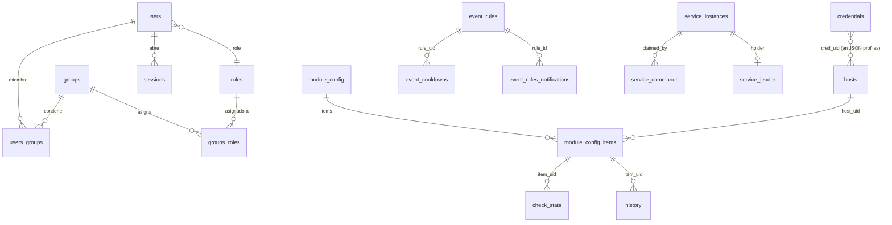

# Esquema de base de datos (runtime)

> Referencia de las **tablas físicas** que ServiceSentry crea y usa en ejecución.
>
> ⚠️ No confundir con [ref-schema-json.md](ref-schema-json.md), que documenta el `schema.json` de los
> módulos (definición de campos de configuración), **no** la base de datos.

**Fuente de verdad:** cada tabla se declara **una sola vez** como un `TableSpec`
([lib/db/schema.py:51](../src/lib/db/schema.py#L51)) compuesto de `Column` / `Index`, y se
reconcilia en el arranque de cada *store* mediante `connector.reconcile_table(spec)`
([lib/db/base.py:232](../src/lib/db/base.py#L232)). Los tipos simbólicos (`TEXT`, `INTEGER`,
`REAL`, `AUTOINCREMENT`) se traducen a DDL nativo por motor (ver
[§ Portabilidad multi-motor](#portabilidad-multi-motor)).

Backends soportados: **SQLite** (por defecto), **MySQL/MariaDB**, **PostgreSQL**. El
esquema se valida y evoluciona automáticamente en cada arranque; **no** hay migraciones
manuales ni herramienta de migración externa.

> **Nota de exactitud:** este documento se generó leyendo las declaraciones `TableSpec` en
> el código. No existen claves foráneas declaradas: **el motor nunca emite `FOREIGN KEY`**;
> las relaciones son referencias por UID (integridad gestionada en la capa de aplicación).

---

## Índice de tablas

Hay **40 tablas** core/servicio, más un mecanismo de tablas de módulo dinámicas
(`mod_<módulo>_<nombre>`) que hoy **ningún watchful declara**.

| Grupo | Tablas |
| ----- | ------ |
| Identidad / control de acceso | `users`, `users_groups`, `groups`, `groups_roles`, `roles`, `sessions`, `session_access`, `mfa_factors`, `mfa_recovery`, `api_tokens`, `api_token_access` |
| Coordinación entre procesos | `entity_versions` |
| Configuración | `config`, `module_config`, `module_config_items` |
| Activos / secretos | `credentials`, `hosts` |
| Auditoría / historial / estado | `audit`, `history`, `check_state` |
| Notificaciones | `webhooks`, `msteams_channels`, `msteams_bot_refs` |
| Gestor de eventos | `event_rules`, `event_rules_notifications`, `event_cursor`, `event_cooldowns` |
| fail2ban / ipban | `ip_bans`, `ip_ban_history`, `ip_offense_counters`, `ip_offense_log`, `ip_service_action`, `ip_whitelist` |
| Syslog | `syslog`, `syslog_drops` |
| Plano de control distribuido | `service_instances`, `service_leader`, `service_commands` |

> **Telegram no tiene tabla**: sus destinatarios viven en la configuración.
> **`syslog` / `syslog_drops`** pueden vivir en un **conector dedicado** (BD de syslog
> separada) si se configura `syslog_db`; el resto usa el conector principal.

---

## Diagrama entidad-relación

```mermaid
erDiagram
    users ||--o{ users_groups : "miembro"
    groups ||--o{ users_groups : "contiene"
    groups ||--o{ groups_roles : "asigna"
    roles ||--o{ groups_roles : "asignado a"
    users ||--o{ sessions : "abre"
    users }o--|| roles : "role"
    module_config ||--o{ module_config_items : "items"
    hosts ||--o{ module_config_items : "host_uid"
    credentials }o--o{ hosts : "cred_uid (en JSON profiles)"
    module_config_items ||--o{ check_state : "item_uid"
    module_config_items ||--o{ history : "item_uid"
    event_rules ||--o{ event_cooldowns : "rule_uid"
    event_rules ||--o{ event_rules_notifications : "rule_id"
    service_instances ||--o{ service_commands : "claimed_by"
    service_instances ||--o| service_leader : "holder"
```

---

## Identidad / control de acceso

> **Cómo se escriben estas tres tablas** (`users`, `groups`, `roles`). No se reemplazan
> enteras: cada guardado escribe la **diferencia** contra lo que ese proceso leyó, y solo borra
> filas que tenía y ha dejado de tener. Una fila que apareció mientras editaba es de otro
> escritor —el CLI, otra réplica— y no se toca. El modelo entero, con el fallo que lo motivó,
> está en [explica-arquitectura.md](explica-arquitectura.md#más-de-un-proceso-sobre-la-misma-bd);
> la mecánica, en `lib/core/entity_sync.py`.
>
> Los permisos de un rol viven como **lista JSON** en `roles.permissions`, no en una tabla de
> unión: el catálogo de permisos es *código* (se descubre del `manifest.py` de cada dominio) y
> las claves por instancia (`module.<id>.<acción>`) son ilimitadas, así que no hay tabla a la
> que referenciar — ver [ref-permisos.md](ref-permisos.md).

### `users` — cuentas de usuario del WebAdmin
[lib/core/users/store.py:42](../src/lib/core/users/store.py#L42)

| Columna | Tipo | Null | Default | Clave |
|---|---|---|---|---|
| uid | TEXT | no | — | PK |
| username | TEXT | no | `''` | UNIQUE |
| password_hash | TEXT | no | `''` | |
| role | TEXT | no | `''` | |
| display_name | TEXT | no | `''` | |
| email | TEXT | no | `''` | |
| lang | TEXT | no | `''` | |
| dark_mode | INTEGER | sí | — | |
| enabled | INTEGER | no | `1` | |
| auth_source | TEXT | no | `'local'` | |
| extra | TEXT | no | `'{}'` | JSON (overflow: preferencias, `table_config`, `landing_page`…) |
| created_at | TEXT | no | `''` | |
| updated_at | TEXT | no | `''` | |
| updated_by | TEXT | no | `''` | |

Índices: `idx_users_role(role)`.

### `users_groups` — pertenencia usuario↔grupo (M:N)
[lib/core/users/store.py:63](../src/lib/core/users/store.py#L63)

| Columna | Tipo | Null | Default | Clave |
|---|---|---|---|---|
| uid | TEXT | no | — | PK (id de fila sintético) |
| user_uid | TEXT | no | — | → `users.uid` |
| group_uid | TEXT | no | — | → `groups.uid` |

Restricción única: `(user_uid, group_uid)`.
Índices: `idx_users_groups_user(user_uid)`, `idx_users_groups_group(group_uid)`.

### `groups` — grupos de usuarios
[lib/core/groups/store.py:29](../src/lib/core/groups/store.py#L29)

| Columna | Tipo | Null | Default | Clave |
|---|---|---|---|---|
| uid | TEXT | no | — | PK |
| name | TEXT | no | `''` | índice único |
| description | TEXT | no | `''` | |
| enabled | INTEGER | no | `1` | |
| landing_page | TEXT | no | `''` | |
| source | TEXT | no | `'local'` | |
| external_id | TEXT | no | `''` | SCIM externalId |
| created_at | TEXT | no | `''` | |
| updated_at | TEXT | no | `''` | |
| updated_by | TEXT | no | `''` | |

Índices: `idx_groups_name(name)` UNIQUE. El nombre `groups` se **entrecomilla** (palabra
reservada en MySQL) — [store.py:77](../src/lib/core/groups/store.py#L77).

### `groups_roles` — asignación grupo↔rol (M:N)
[lib/core/groups/store.py:46](../src/lib/core/groups/store.py#L46)

| Columna | Tipo | Null | Default | Clave |
|---|---|---|---|---|
| uid | TEXT | no | — | PK |
| group_uid | TEXT | no | — | → `groups.uid` |
| role_uid | TEXT | no | — | → `roles.uid` |
| created_at | TEXT | no | `''` | |
| created_by | TEXT | no | `''` | |

Restricción única: `(group_uid, role_uid)`. Índices: `idx_gr_group`, `idx_gr_role`.

### `roles` — roles personalizados + overrides de built-in
[lib/core/roles/store.py:27](../src/lib/core/roles/store.py#L27)

| Columna | Tipo | Null | Default | Clave |
|---|---|---|---|---|
| uid | TEXT | no | — | PK |
| name | TEXT | no | `''` | índice único |
| description | TEXT | no | `''` | |
| permissions | TEXT | no | `'[]'` | lista JSON de permisos |
| enabled | INTEGER | no | `1` | |
| created_at | TEXT | no | `''` | |
| updated_at | TEXT | no | `''` | |
| updated_by | TEXT | no | `''` | |

Índices: `idx_roles_name(name)` UNIQUE.

### `sessions` — sesiones del WebAdmin
[lib/core/sessions/store.py:28](../src/lib/core/sessions/store.py#L28)

| Columna | Tipo | Null | Default | Clave |
|---|---|---|---|---|
| uid | TEXT | no | — | **PK** (id de sesión estable) |
| token | TEXT | no | `''` | UNIQUE (secreto) |
| user_uid | TEXT | no | `''` | → `users.uid` |
| created | TEXT | no | `''` | |
| last_seen | TEXT | no | `''` | |
| ip | TEXT | no | `''` | |
| user_agent | TEXT | no | `''` | |

Índices: `idx_sessions_user_uid(user_uid)`. Rename heredado: `sid`→`uid`.

---

### `session_access` — qué ha hecho cada sesión
[lib/core/sessions/store.py:59](../src/lib/core/sessions/store.py#L59) · gemela de
[`api_token_access`](#api_token_access--qué-ha-hecho-cada-token)

| Columna | Tipo | Null | Default | Clave |
|---|---|---|---|---|
| uid | TEXT | no | — | **PK** |
| session_uid | TEXT | no | `''` | → `sessions.uid` (el id **público**, nunca el token) |
| ts | TEXT | no | `''` | |
| ip | TEXT | no | `''` | Desde dónde llegó la petición |
| method | TEXT | no | `''` | |
| path | TEXT | no | `''` | El **patrón** de la ruta, no la URL |
| status | INTEGER | no | `0` | El código de respuesta: las **rechazadas** son las que importan |

Índices: `idx_session_access_ses(session_uid)`.

`last_seen` dice que una sesión está viva y nada más. Quién ha entrado, desde dónde y desde
cuándo se contestan con la fila de arriba; **qué ha hecho** no se contestaba en ningún sitio: la
auditoría registra las acciones que tienen nombre (`config_saved`) y las atribuye a la
**cuenta**, así que dos sesiones de la misma persona se leen como una — y una petición
**rechazada** no dejaba rastro en ninguna parte.

**No se guarda todo, y esa es la regla de diseño**: solo las **acciones**
(POST/PUT/PATCH/DELETE) y los **rechazos** (status ≥ 400). El panel se sondea a sí mismo
—`/api/v1/health` cada 6 s, el *keepalive* cada 20 s, la pestaña de Acceso cada 30 s—, así que un
anillo que guardara las lecturas correctas serían 200 latidos con la única línea interesante ya
desalojada, y además una escritura en la respuesta de cada sondeo de cada pestaña abierta.

Anillo **por sesión** (`web_admin|session_log_max`, 200 por defecto; 0 lo apaga): una sesión
ocupada no puede desalojar el historial de una tranquila, y la tranquila es donde una sola
petición inesperada es toda la señal.

Las filas **se van con la sesión** — al revocarla, al revocar las de una cuenta y al reescribir
la tabla entera (arranque, «cerrar todas las sesiones»). Actividad con un `session_uid` que ya no
existe es invisible en el panel, que solo muestra la de las sesiones vivas, y crecería sin
límite, que es justo lo que un anillo evita.

---

### `mfa_factors` — segundo factor dado de alta, por usuario
[lib/core/mfa/store.py:39](../src/lib/core/mfa/store.py#L39) · el porqué de todo esto, en
[explica-mfa.md](explica-mfa.md#qué-se-guarda)

| Columna | Tipo | Null | Default | Clave |
|---|---|---|---|---|
| uid | TEXT | no | — | **PK** |
| user_uid | TEXT | no | `''` | → `users.uid` |
| method | TEXT | no | `'totp'` | `totp` o `webauthn`; una cuenta puede llevar **una fila de cada** |
| secret | TEXT | no | `''` | **cifrado** (Fernet, prefijo `enc:`) |
| confirmed | INTEGER | no | `0` | un alta empezada y no demostrada no concede nada |
| last_step | INTEGER | no | `-1` | anti-replay: el último paso TOTP aceptado |
| label | TEXT | no | `''` | |
| credential_id | TEXT | no | `''` | **WebAuthn**: la credencial que presentará el navegador, base64url |
| public_key | TEXT | no | `''` | **WebAuthn**: la clave COSE tal como la mandó el autenticador (base64url del CBOR) |
| alg | INTEGER | no | `0` | **WebAuthn**: el algoritmo, grabado al **registrar** |
| sign_count | INTEGER | no | `0` | **WebAuthn**: el contador del autenticador; 0 = no lleva |
| created | TEXT | no | `''` | |
| updated | TEXT | no | `''` | |

Índices: `idx_mfa_factors_user(user_uid)`.

**Las cuatro columnas de WebAuthn son propias y no reutilizan `secret`**: una clave pública no
es un secreto, y meterla ahí haría que dar de alta una llave de seguridad fallara en una
instalación sin clave de cifrado —por un valor que no tiene nada que proteger—. La clave COSE se
guarda **en la forma en que llegó** y se vuelve a parsear con el decodificador que está probado
contra la norma: una sola representación y ningún segundo sitio que pueda discrepar sobre qué
es la clave. Y `alg` se graba al registrar porque una clave que nombra su propio algoritmo
cuando llega la aserción es el fallo del `alg` de JWT con otras palabras.

`sign_count` avanza con un `UPDATE … WHERE sign_count < ?`, monótono igual que `last_step`: dos
aserciones compitiendo no pueden dejar que la posterior baje el listón para la anterior, que es
justo el estado que intentaría producir un autenticador clonado.

**Tabla propia y no una columna en `users`**: el `extra` de `users` se fusiona en el diccionario
que devuelve el store, y ese diccionario es el que serializa la API de usuarios — un secreto
TOTP ahí estaría a un `GET /api/v1/users` de distancia de cualquiera con `users_view`.

`last_step` está en la BD y no en memoria porque «ya usado» tiene que valer **entre procesos**:
dos réplicas del web con un contador local cada una aceptarían el mismo código dos veces.

---

### `mfa_recovery` — códigos de recuperación de un solo uso
[lib/core/mfa/store.py:60](../src/lib/core/mfa/store.py#L60)

| Columna | Tipo | Null | Default | Clave |
|---|---|---|---|---|
| uid | TEXT | no | — | **PK** |
| user_uid | TEXT | no | `''` | → `users.uid` |
| code_hash | TEXT | no | `''` | **hash**, no cifrado |
| used_at | TEXT | no | `''` | vacío = sin gastar |
| created | TEXT | no | `''` | |

Índices: `idx_mfa_recovery_user(user_uid)`.

Hasheados y no cifrados: nada necesita leer un código de recuperación, sólo comprobarlo — se usa
el mismo hasher que las contraseñas, así el coste se mueve con él en vez de ser una segunda
decisión que nadie revisa. Gastar uno es un `UPDATE … WHERE used_at = ''`, que es lo que hace
que dos peticiones con el mismo código sólo cambien una fila.

---

### `api_tokens` — tokens de API por usuario
[lib/core/apitokens/store.py:32](../src/lib/core/apitokens/store.py#L32) · el porqué, en
[explica-seguridad.md](explica-seguridad.md#tokens-de-api)

| Columna | Tipo | Null | Default | Clave |
|---|---|---|---|---|
| uid | TEXT | no | — | **PK** |
| user_uid | TEXT | no | `''` | → `users.uid` |
| name | TEXT | no | `''` | Lo que su dueño le llamó |
| token_id | TEXT | no | `''` | La mitad **pública**: es la que busca el índice |
| token_hash | TEXT | no | `''` | **SHA-256** del secreto. Nunca el token |
| permissions | TEXT | no | `'[]'` | Lista JSON de flags, o `'*'` = «lo que tenga el dueño» |
| expires_at | TEXT | no | `''` | Vacío = no caduca |
| last_used | TEXT | no | `''` | Escrito como mucho una vez por minuto |
| revoked | INTEGER | no | `0` | |
| created | TEXT | no | `''` | |
| created_by | TEXT | no | `''` | |

Índices: `idx_api_tokens_user(user_uid)`, `idx_api_tokens_tid(token_id)`.

---

### `api_token_access` — qué ha hecho cada token
[lib/core/apitokens/store.py](../src/lib/core/apitokens/store.py) · el porqué, en
[explica-seguridad.md](explica-seguridad.md#tokens-de-api)

| Columna | Tipo | Null | Default | Clave |
|---|---|---|---|---|
| uid | TEXT | no | — | **PK** |
| token_uid | TEXT | no | `''` | → `api_tokens.uid` |
| ts | TEXT | no | `''` | |
| ip | TEXT | no | `''` | Desde dónde llamó |
| method | TEXT | no | `''` | |
| path | TEXT | no | `''` | El **patrón** de la ruta, no la URL |
| status | INTEGER | no | `0` | El código de respuesta: las **negadas** son las que importan |

Índices: `idx_api_token_access_tok(token_uid)`.

Es un **anillo por token**, no un log: se guardan las N llamadas más recientes de cada uno
(`web_admin|api_token_log_max`, 200 por defecto; 0 lo apaga) y las viejas se descartan. Una
tabla que crece con el tráfico de la API es justo lo que la contabilidad de una API no puede
ser, y las preguntas que esto contesta —qué ha estado haciendo, desde dónde llama— son sobre
el pasado reciente. Quien necesite «para siempre» tiene un proxy inverso delante.

**Por token y no global**: un token hablador desalojaría el historial de uno tranquilo, y el
tranquilo es donde una sola llamada inesperada es toda la señal.

Se guarda el **patrón** de la ruta (`/api/v1/users/<username>`) y no la URL: un anillo lleno de
un nombre por fila contesta «qué endpoints usa este token» con un muro de cadenas casi iguales,
y la URL cruda es además donde acaban un id o un correo en una tabla que ve cualquiera que pueda
leer la lista de tokens. Una petición sin regla (un 404) no tiene patrón, así que ahí se guarda
la ruta tal cual —que es exactamente cuando la URL es el dato—.

Se borra con su token cuando se borra la cuenta; **sobrevive a la revocación**, que es cuando
más se pregunta por él.

---

**Solo se guarda el hash**, como un código de recuperación y a diferencia de todos los secretos
cifrados del proyecto. La diferencia es qué haría con él quien lea la base de datos: un valor
cifrado existe porque algo tiene que **usarlo** después (una contraseña SMTP, un token de bot),
así que tiene que poder recuperarse. Un token no lo necesita nadie de vuelta —alguien lo
presenta y se comprueba—, así que dejarlo recuperable sería guardar una credencial sin motivo.

`token_id` es la mitad en claro, y es lo que convierte la verificación en **una búsqueda
indexada** en vez de hashear el candidato contra cada fila. No lleva secreto: nombra al token
como un nombre de usuario nombra a una cuenta.

El hash es **SHA-256 y a propósito no scrypt**. Un KDF de contraseñas es lento adrede, para
encarecer adivinar un secreto elegido por una persona; aquí el secreto son 192 bits aleatorios,
donde adivinar no es un modelo de amenaza. Lo que sí es real es que esto corre en **cada
petición de API**, y un hash lento ahí es una denegación de servicio que cualquiera dispara
mandando basura.

---

### `entity_versions` — contador de cambios por tabla
[lib/db/freshness.py:35](../src/lib/db/freshness.py#L35)

| Columna | Tipo | Null | Default | Clave |
|---|---|---|---|---|
| name | TEXT | no | — | PK — la tabla vigilada |
| version | INTEGER | no | `0` | se incrementa en cada escritura |

Una fila por tabla vigilada (`users`, `groups`, `roles`). Cada escritor la incrementa
**dentro de su misma transacción**, así que la versión y las filas que describe se hacen
visibles a la vez: ningún lector puede ver una sin las otras.

Existe para que un proceso sepa si otro tocó la tabla sin releerla entera. Es un **contador**
y no una marca de tiempo a propósito: los escritores son máquinas distintas, y con timestamps
una réplica con el reloj unos segundos atrasado escribe una fila por debajo del máximo actual
—`MAX(updated_at)` no se mueve, el recuento tampoco— y su cambio queda invisible para todos
los demás hasta que una escritura ajena mueva el máximo. Silencioso, y justo en el escenario
para el que existe el mecanismo.

Ver [explica-arquitectura.md](explica-arquitectura.md#más-de-un-proceso-sobre-la-misma-bd).

---

## Configuración

### `config` — configuración editable (una fila por campo)
[lib/core/config/store.py:33](../src/lib/core/config/store.py#L33)

| Columna | Tipo | Null | Default | Clave |
|---|---|---|---|---|
| uid | TEXT | no | — | PK |
| path | TEXT | no | `''` | UNIQUE (`sección\|campo`) |
| value | TEXT | no | `''` | JSON |
| created_at | TEXT | no | `''` | |
| updated_at | TEXT | no | `''` | |
| updated_by | TEXT | no | `''` | |

Índices: `idx_config_path(path)`. Ver [ref-configuracion.md](ref-configuracion.md) para el flujo
config.json (solo lectura/arranque) → BD (editable).

### `module_config` — configuración por módulo watchful
[lib/core/modules/store.py:62](../src/lib/core/modules/store.py#L62)

| Columna | Tipo | Null | Default | Clave |
|---|---|---|---|---|
| uid | TEXT | no | — | PK |
| module | TEXT | no | `''` | UNIQUE |
| data | TEXT | no | `'{}'` | JSON (nivel-módulo + meta `__*__`) |
| created_at | TEXT | no | `''` | |
| updated_at | TEXT | no | `''` | |
| updated_by | TEXT | no | `''` | |

Índices: `idx_module_config_module(module)`.

### `module_config_items` — configuración por item
[lib/core/modules/store.py:75](../src/lib/core/modules/store.py#L75)

| Columna | Tipo | Null | Default | Clave |
|---|---|---|---|---|
| uid | TEXT | no | — | PK (clave del item en el dict) |
| module_uid | TEXT | no | `''` | → `module_config.uid` |
| collection | TEXT | no | `'list'` | |
| host_uid | TEXT | no | `''` | → `hosts.uid` |
| label | TEXT | no | `''` | |
| enabled | INTEGER | no | `1` | |
| data | TEXT | no | `'{}'` | JSON (resto del item) |
| created_at | TEXT | no | `''` | |
| updated_at | TEXT | no | `''` | |
| updated_by | TEXT | no | `''` | |

Índices: `idx_module_config_items_moduid(module_uid)`, `idx_module_config_items_host(host_uid)`.

---

## Activos / secretos

> Los campos secretos se cifran **a nivel de valor** con Fernet dentro de las columnas JSON
> (`data`/`profiles`). Ver [explica-seguridad.md](explica-seguridad.md).

### `credentials` — credenciales SSH reutilizables
[lib/core/credentials/store.py:40](../src/lib/core/credentials/store.py#L40)

| Columna | Tipo | Null | Default | Clave |
|---|---|---|---|---|
| uid | TEXT | no | — | PK |
| name | TEXT | no | `''` | UNIQUE |
| ctype | TEXT | no | `'ssh'` | |
| enabled | INTEGER | no | `1` | |
| description | TEXT | no | `''` | |
| data | TEXT | no | `'{}'` | JSON, secretos cifrados |
| created_at | TEXT | no | `''` | |
| updated_at | TEXT | no | `''` | |
| updated_by | TEXT | no | `''` | |

Índices: `idx_credentials_name(name)`.

### `hosts` — hosts monitorizados
[lib/core/hosts/store.py:36](../src/lib/core/hosts/store.py#L36)

| Columna | Tipo | Null | Default | Clave |
|---|---|---|---|---|
| uid | TEXT | no | — | PK |
| name | TEXT | no | `''` | UNIQUE |
| address | TEXT | no | `''` | |
| kind | TEXT | no | `'local'` | local/remote |
| os | TEXT | no | `'auto'` | |
| maintenance | INTEGER | no | `0` | |
| virtual | INTEGER | no | `0` | (reservada, entrecomillada) |
| tags | TEXT | no | `'[]'` | lista JSON |
| description | TEXT | no | `''` | |
| profiles | TEXT | no | `'{}'` | JSON, perfiles por protocolo; secretos cifrados |
| modules | TEXT | no | `'[]'` | lista JSON |
| created_at | TEXT | no | `''` | |
| updated_at | TEXT | no | `''` | |
| updated_by | TEXT | no | `''` | |

Índices: `idx_hosts_name(name)`. Ver [explica-hosts.md](explica-hosts.md) para el modelo host-céntrico.

---

## Auditoría / historial / estado

### `audit` — registro de auditoría
[lib/core/audit/store.py:26](../src/lib/core/audit/store.py#L26)

| Columna | Tipo | Null | Default | Clave |
|---|---|---|---|---|
| id | AUTOINCREMENT | — | — | PK |
| ts | TEXT | no | `''` | ISO 8601 |
| event | TEXT | no | `''` | |
| user | TEXT | no | `''` | (reservada en PG, entrecomillada) |
| ip | TEXT | no | `''` | |
| detail | TEXT | no | `''` | JSON |

Índices: `idx_audit_id(id DESC)`, `idx_audit_event(event)`.

### `history` — series temporales de resultados de checks
[lib/core/history/store.py:39](../src/lib/core/history/store.py#L39)

| Columna | Tipo | Null | Default | Clave |
|---|---|---|---|---|
| id | AUTOINCREMENT | — | — | PK |
| ts | REAL | no | — | epoch Unix |
| module | TEXT | no | — | |
| item_uid | TEXT | sí | — | → item configurado |
| key | TEXT | no | — | (reservada en MySQL, entrecomillada) |
| status | INTEGER | no | — | 1=OK / 0=error |
| data | TEXT | sí | — | JSON |

Índices: `idx_history_uid_ts(item_uid, ts)`, `idx_history_mkts(module, key, ts)`.
El *downsampling* por buckets usa `CAST(FLOOR((ts - ?) / ?) AS <int>)` (portable multi-motor).

### `check_state` — estado vivo por check (reemplaza status.json)
[lib/services/monitoring/check_state/store.py:50](../src/lib/services/monitoring/check_state/store.py#L50)

| Columna | Tipo | Null | Default | Clave |
|---|---|---|---|---|
| uid | TEXT | no | — | PK (sintético) |
| module | TEXT | no | — | |
| key | TEXT | no | — | UID del item (entrecomillada) |
| item_uid | TEXT | sí | — | |
| metric | TEXT | no | `''` | |
| status | INTEGER | no | — | |
| message | TEXT | sí | — | |
| other_data | TEXT | sí | — | JSON |
| fail_count | INTEGER | no | `0` | |
| last_change_ts | REAL | no | `0` | |
| severity | TEXT | no | `''` | `''` / error / warning |

Restricción única: `(module, key, metric)`. Sin índices secundarios.

---

## Notificaciones

### `webhooks` — webhooks salientes
[lib/core/notify/webhook/store.py:28](../src/lib/core/notify/webhook/store.py#L28)

| Columna | Tipo | Null | Default | Clave |
|---|---|---|---|---|
| uid | TEXT | no | — | PK |
| data | TEXT | no | `'{}'` | JSON (url/method/…/secret cifrado) |
| created_at | TEXT | no | `''` | |
| updated_at | TEXT | no | `''` | |
| updated_by | TEXT | no | `''` | |

Sin índices.

### `backup_tasks` — tareas de copia programadas
[lib/core/backup/tasks_store.py:29](../src/lib/core/backup/tasks_store.py#L29)

| Columna | Tipo | Null | Default | Clave |
|---|---|---|---|---|
| uid | TEXT | no | — | PK |
| data | TEXT | no | `'{}'` | JSON (name/enabled/mode/every_hours/days[]/at/parts[]/secrets/profile/keep_*) |
| created_at | TEXT | no | `''` | |
| updated_at | TEXT | no | `''` | |
| updated_by | TEXT | no | `''` | |

Sin índices.

Una tabla y no `config.json` porque una tarea es un **registro**, no un ajuste: se crea, se
renombra, se desactiva y se borra de una en una, como un webhook o un host. Varias tareas es
justo el motivo de que exista: la configuración interesa a diario y el syslog quizá una vez por
semana, y con un solo intervalo eso no se puede decir sin copiarlo todo al ritmo del más
exigente. Nada de `data` va cifrado: una tarea dice **qué** copiar y cada cuánto, nunca una
credencial.

`profile` es el uid de un perfil de retención (tabla siguiente), vacío = «la política propia de
esta tarea». Los `keep_*` de la tarea **se conservan aunque siga un perfil**: son a lo que vuelve
al desvincularla, y lo que queda en pie si el perfil desaparece.

### `backup_profiles` — perfiles de retención compartidos
[lib/core/backup/profiles_store.py:30](../src/lib/core/backup/profiles_store.py#L30)

| Columna | Tipo | Null | Default | Clave |
|---|---|---|---|---|
| uid | TEXT | no | — | PK |
| data | TEXT | no | `'{}'` | JSON (name/keep_last/keep_daily/keep_weekly/keep_monthly/keep_yearly/max_size) |
| created_at | TEXT | no | `''` | |
| updated_at | TEXT | no | `''` | |
| updated_by | TEXT | no | `''` | |

Sin índices.

Una política con nombre que varias tareas **siguen**, no copian: editar «GFS estándar» cambia de
una vez la retención de todas las tareas que apuntan a él, que es el motivo entero de que exista
en lugar de un botón que rellene las casillas. Borrar uno en uso se rechaza (409) en vez de dejar
esas tareas sobre los números que tuvieran guardados: sería un cambio de política que nadie pidió
y que nada anuncia.

### `msteams_channels` — destinos de canal Teams
[lib/core/notify/msteams/store.py:27](../src/lib/core/notify/msteams/store.py#L27)

| Columna | Tipo | Null | Default | Clave |
|---|---|---|---|---|
| uid | TEXT | no | — | PK |
| data | TEXT | no | `'{}'` | JSON (`name`, `enabled`, `webhook_url` cifrado) |
| created_at | TEXT | no | `''` | |
| updated_at | TEXT | no | `''` | |
| updated_by | TEXT | no | `''` | |

Misma forma que `webhooks` — ambos son `JsonDocStore`. Sin índices.

### `msteams_bot_refs` — referencias de conversación de Bot Framework
[lib/core/notify/msteams/bot_store.py:27](../src/lib/core/notify/msteams/bot_store.py#L27)

| Columna | Tipo | Null | Default | Clave |
|---|---|---|---|---|
| user_key | TEXT | no | — | PK (aad id / UPN, en minúsculas) |
| data | TEXT | no | `'{}'` | JSON |
| updated_at | TEXT | no | `''` | |

Sin índices.

---

## Gestor de eventos

### `event_rules` — reglas evento→notificación
[lib/services/events/store/rules.py:34](../src/lib/services/events/store/rules.py#L34)

| Columna | Tipo | Null | Default | Clave |
|---|---|---|---|---|
| uid | TEXT | no | — | PK |
| name | TEXT | no | `''` | |
| enabled | INTEGER | no | `1` | |
| description | TEXT | no | `''` | |
| data | TEXT | no | `'{}'` | JSON (source/events/channels/…) |
| created_at | TEXT | no | `''` | |
| updated_at | TEXT | no | `''` | |
| updated_by | TEXT | no | `''` | |

Índices: `idx_event_rules_name(name)`.

### `event_rules_notifications` — log de envíos de notificación
[lib/services/events/store/log.py:22](../src/lib/services/events/store/log.py#L22)

| Columna | Tipo | Null | Default | Clave |
|---|---|---|---|---|
| id | AUTOINCREMENT | — | — | PK |
| ts | REAL | no | `0` | |
| rule_id | TEXT | no | `''` | → `event_rules.uid` |
| rule_name | TEXT | no | `''` | |
| source | TEXT | no | `''` | |
| channels | TEXT | no | `''` | |
| ok | INTEGER | no | `0` | |
| message | TEXT | no | `''` | |

Índices: `idx_notiflog_ts(ts)`. Limitado a 1000 filas.

### `event_cursor` — cursor de ingesta por fuente
[lib/services/events/store/cursor.py:20](../src/lib/services/events/store/cursor.py#L20)

| Columna | Tipo | Null | Default | Clave |
|---|---|---|---|---|
| uid | TEXT | no | — | PK |
| source | TEXT | no | `''` | UNIQUE (`audit`/`syslog`) |
| last_id | INTEGER | no | `0` | |

### `event_cooldowns` — timestamps de enfriamiento por regla
[lib/services/events/store/cooldowns.py:20](../src/lib/services/events/store/cooldowns.py#L20)

| Columna | Tipo | Null | Default | Clave |
|---|---|---|---|---|
| uid | TEXT | no | — | PK |
| rule_uid | TEXT | no | `''` | UNIQUE → `event_rules.uid` |
| last_fire | REAL | no | `0` | |

---

## fail2ban / ipban

> Familia compartida entre procesos (el monitor y el WebAdmin comparten la misma BD).
> Ver [explica-servicios.md](explica-servicios.md).

### `ip_bans` — jail activo
[lib/services/ipban/store/bans.py:19](../src/lib/services/ipban/store/bans.py#L19)

| Columna | Tipo | Null | Default | Clave |
|---|---|---|---|---|
| uid | TEXT | no | — | PK |
| ip | TEXT | no | `''` | UNIQUE |
| reason | TEXT | no | `''` | |
| category | TEXT | no | `''` | |
| level | INTEGER | no | `1` | |
| offenses | INTEGER | no | `0` | |
| banned_at | REAL | no | `0` | |
| banned_until | REAL | sí | — | NULL = permanente |
| first_seen | REAL | no | `0` | |
| created_by | TEXT | no | `'system'` | |
| detail | TEXT | no | `''` | |
| block_action | TEXT | no | `''` | |

Índices: `idx_ip_bans_until(banned_until)`. Limitado a 5000 filas.

### `ip_ban_history` — eventos de ciclo de vida de baneos
[lib/services/ipban/store/history.py:16](../src/lib/services/ipban/store/history.py#L16)

| Columna | Tipo | Null | Default | Clave |
|---|---|---|---|---|
| id | AUTOINCREMENT | — | — | PK |
| ip | TEXT | no | `''` | |
| event | TEXT | no | `''` | banned/escalated/unbanned |
| reason | TEXT | no | `''` | |
| category | TEXT | no | `''` | |
| level | INTEGER | no | `0` | |
| offenses | INTEGER | no | `0` | |
| banned_at | REAL | no | `0` | |
| banned_until | REAL | sí | — | |
| created_by | TEXT | no | `'system'` | |
| ts | REAL | no | `0` | |

Índices: `idx_ip_banhist_ip(ip, id)`. Limitado a 20000 filas.

### `ip_offense_counters` — contadores de ventana fija
[lib/services/ipban/store/offense_counters.py:18](../src/lib/services/ipban/store/offense_counters.py#L18)

| Columna | Tipo | Null | Default | Clave |
|---|---|---|---|---|
| uid | TEXT | no | — | PK |
| ip | TEXT | no | `''` | |
| track | TEXT | no | `''` | |
| count | INTEGER | no | `0` | |
| window_start | REAL | no | `0` | |
| updated_at | REAL | no | `0` | |

Restricción única: `(ip, track)`. Índices: `idx_ip_offc_updated(updated_at)`. Limitado a 20000.

### `ip_offense_log` — log de intentos por IP
[lib/services/ipban/store/offense_log.py:14](../src/lib/services/ipban/store/offense_log.py#L14)

| Columna | Tipo | Null | Default | Clave |
|---|---|---|---|---|
| id | AUTOINCREMENT | — | — | PK |
| ip | TEXT | no | `''` | |
| ts | REAL | no | `0` | |
| category | TEXT | no | `''` | |

Índices: `idx_ip_offlog_ip(ip, id)`. Limitado a 20000.

### `ip_service_action` — acción de bloqueo por servicio
[lib/services/ipban/store/service_actions.py:18](../src/lib/services/ipban/store/service_actions.py#L18)

| Columna | Tipo | Null | Default | Clave |
|---|---|---|---|---|
| uid | TEXT | no | — | PK |
| service | TEXT | no | `''` | UNIQUE |
| action | TEXT | no | `''` | |

### `ip_whitelist` — lista de nunca-banear
[lib/services/ipban/store/whitelist.py:20](../src/lib/services/ipban/store/whitelist.py#L20)

| Columna | Tipo | Null | Default | Clave |
|---|---|---|---|---|
| uid | TEXT | no | — | PK |
| value | TEXT | no | `''` | UNIQUE (IP/CIDR) |
| description | TEXT | no | `''` | |
| created_at | REAL | no | `0` | |
| created_by | TEXT | no | `''` | |

Índices: `idx_ip_whitelist_value(value)`. Limitado a 2000.

---

## Syslog

> `syslog` y `syslog_drops` pueden residir en un **conector dedicado** (BD separada) si se
> configura `syslog_db`. Ver [ref-configuracion.md](ref-configuracion.md) y [explica-servicios.md](explica-servicios.md).

### `syslog` — mensajes recibidos
[lib/services/syslog/store/messages.py:22](../src/lib/services/syslog/store/messages.py#L22)

| Columna | Tipo | Null | Default | Clave |
|---|---|---|---|---|
| id | AUTOINCREMENT | — | — | PK |
| ts | REAL | no | — | |
| received_at | TEXT | no | `''` | |
| source | TEXT | no | `''` | |
| hostname | TEXT | no | `''` | |
| app | TEXT | no | `''` | |
| procid | TEXT | no | `''` | |
| severity | INTEGER | no | `5` | |
| facility | INTEGER | no | `1` | |
| msgid | TEXT | no | `''` | |
| message | TEXT | no | `''` | |
| raw | TEXT | no | `''` | |

Índices: `idx_syslog_ts`, `idx_syslog_sev_ts(severity, ts)`, `idx_syslog_host_ts(hostname, ts)`,
`idx_syslog_app_ts(app, ts)`, `idx_syslog_fac_ts(facility, ts)`.

### `syslog_drops` — emisores rechazados por allowlist
[lib/services/syslog/store/drops.py:20](../src/lib/services/syslog/store/drops.py#L20)

| Columna | Tipo | Null | Default | Clave |
|---|---|---|---|---|
| uid | TEXT | no | — | PK |
| source | TEXT | no | `''` | UNIQUE |
| transport | TEXT | no | `''` | |
| count | INTEGER | no | `0` | |
| first_seen | REAL | no | `0` | |
| last_seen | REAL | no | `0` | |

Índices: `idx_syslog_drops_last(last_seen)`. Limitado a 500.

---

## Plano de control distribuido

> Solo relevante en modo microservicios (servicios standalone). Ver [explica-servicios.md](explica-servicios.md)
> y [caso-kubernetes.md](caso-kubernetes.md).

### `service_instances` — estado observado por heartbeat
[lib/services/manager/instances.py:30](../src/lib/services/manager/instances.py#L30)

| Columna | Tipo | Null | Default | Clave |
|---|---|---|---|---|
| uid | TEXT | no | — | PK |
| instance_id | TEXT | no | `''` | UNIQUE |
| service_key | TEXT | no | `''` | monitoring/syslog/events |
| mode | TEXT | no | `''` | embedded/standalone |
| host | TEXT | sí | — | |
| pid | INTEGER | sí | — | |
| version | TEXT | sí | — | |
| control_url | TEXT | sí | — | |
| running | INTEGER | no | `0` | |
| started_at | REAL | sí | — | |
| last_seen | REAL | sí | — | |
| last_cycle_at | REAL | sí | — | |
| detail | TEXT | no | `''` | JSON |
| env | TEXT | no | `''` | JSON |

Índices: `idx_svcinst_key(service_key)`, `idx_svcinst_lastseen(last_seen)`.

`env` es la huella del proceso —intérprete, SO, sus paquetes y qué librerías opcionales
tiene— y es lo que permite ver desde el panel las dependencias de los **otros contenedores**
en modo multi-servicio: sin ella, la pantalla de diagnóstico describe el proceso web y nada
más. Se escribe **una sola vez, al arrancar** (`ServiceInstancesStore.set_env`) y no viaja en
el latido: nada de eso puede cambiar sin reiniciar, y un reinicio es una fila nueva. Va en su
propia columna y no dentro de `detail` porque `detail` se reescribe en cada latido, y son unos
pocos KB por instancia.

### `service_leader` — lease de líder (alta disponibilidad)
[lib/services/manager/leader.py:34](../src/lib/services/manager/leader.py#L34)

| Columna | Tipo | Null | Default | Clave |
|---|---|---|---|---|
| uid | TEXT | no | — | PK |
| service_key | TEXT | no | `''` | UNIQUE |
| holder_instance_id | TEXT | no | `''` | → `service_instances.instance_id` |
| holder_host | TEXT | sí | — | |
| acquired_at | REAL | sí | — | |
| renewed_at | REAL | sí | — | |
| expires_at | REAL | sí | — | |

### `service_commands` — cola de comandos one-shot
[lib/services/manager/commands.py:27](../src/lib/services/manager/commands.py#L27)

| Columna | Tipo | Null | Default | Clave |
|---|---|---|---|---|
| id | AUTOINCREMENT | — | — | PK |
| service_key | TEXT | no | `''` | |
| action | TEXT | no | `''` | |
| args | TEXT | no | `''` | JSON |
| created_by | TEXT | no | `''` | |
| created_at | REAL | sí | — | |
| claimed_at | REAL | sí | — | |
| claimed_by | TEXT | sí | — | → `instance_id` |
| done_at | REAL | sí | — | |
| ok | INTEGER | sí | — | null hasta terminar |
| result | TEXT | sí | — | |

Índices: `idx_svccmd_pending(service_key, claimed_at)`, `idx_svccmd_created(created_at)`.

---

## Tablas de módulo dinámicas

Un watchful puede declarar tablas propias vía `discover_db_tables()`, namespaced por
`module_table()` como `mod_<módulo>_<nombre>`
([lib/db/module_tables.py:60](../src/lib/db/module_tables.py#L60)) y reconciliadas en el
arranque por `reconcile_module_tables()`
([lib/db/module_tables.py:153](../src/lib/db/module_tables.py#L153)). Un fallo aquí **nunca
aborta el arranque**.

> **Estado actual:** ningún watchful del árbol declara tablas de módulo (0 coincidencias de
> `discover_db_tables` en `src/watchfuls`). Es un mecanismo disponible sin tablas en uso.

**Fuera del conector:** `watchfuls/snmp/mib_catalog.py` abre su propio archivo SQLite de
catálogo MIB con `sqlite3.connect` directo — **no** pasa por la capa de conectores ni se
reconcilia.

---

## Portabilidad multi-motor

### Modelo declarativo (definición única)

Cada tabla es un `TableSpec` inmutable de `Column` (nombre, tipo simbólico, nullable,
default, primary_key, unique) e `Index`, más `composite_pk`, `unique_constraints` y
`renames` (viejo→nuevo) opcionales.

### Reconcile en el arranque — `reconcile_table(spec)` ([base.py:232](../src/lib/db/base.py#L232))

1. Si la tabla no existe → `create_table_ddl` + un `create_index_ddl` por índice.
2. Aplica renames declarados primero (solo si la col vieja existe y la nueva no) — portable
   `ALTER TABLE … RENAME COLUMN`.
3. Introspecciona el esquema vivo (`describe_table`, `list_indexes`) y calcula `diff_table`.
4. Si hay diff: `needs_rebuild` (desajuste de tipo/nullable/default/pk/orden, o falta una
   columna no-final) → `_apply_rebuild`; si no → `_apply_incremental`.
5. Columnas/índices presentes en la BD pero **ausentes** del spec se **conservan y registran,
   nunca se eliminan**.

### Camino incremental — `_apply_incremental` ([base.py:325](../src/lib/db/base.py#L325))

- `add_column_if_missing` para columnas finales.
- Una columna NOT NULL **sin default** se añade **nullable** (seguridad multi-motor).
- `UNIQUE` **nunca** se inlinea en `ADD COLUMN`: se crea un índice único aparte
  `ux_<tabla>_<col>`.
- Índices cambiados se eliminan y recrean.

### Camino de reconstrucción — `_apply_rebuild` ([base.py:368](../src/lib/db/base.py#L368))

Crear-copiar-borrar-renombrar en una transacción (SQLite/PostgreSQL, DDL transaccional).
`COALESCE(col, default)` rellena columnas recién NOT NULL. MySQL lo sobreescribe
([mysql.py:100](../src/lib/db/mysql.py#L100)) porque su DDL auto-commitea: construye la tabla
de reemplazo y hace un `RENAME TABLE` atómico.

### Mapa de tipos por motor — `_type_map` ([base.py:222](../src/lib/db/base.py#L222))

| Token simbólico | SQLite | MySQL | PostgreSQL |
|---|---|---|---|
| `AUTOINCREMENT` | `INTEGER PRIMARY KEY AUTOINCREMENT` | `INT AUTO_INCREMENT PRIMARY KEY` | `SERIAL PRIMARY KEY` |
| `REAL` | `REAL` | `DOUBLE` | `DOUBLE PRECISION` |
| `TEXT` | `TEXT` | `TEXT` | `TEXT` |
| `INTEGER` | `INTEGER` | `INT` | `INTEGER` |
| `TEXT_KEY` (TEXT indexado) | `TEXT` | `VARCHAR(255)` | `TEXT` |

`TEXT_KEY` es el tipo de columna clave/indexada: cualquier columna TEXT que sea PK, única o
parte de un índice lo usa (MySQL no puede indexar TEXT sin límite → `VARCHAR(255)`).

- `KIND` (`'sqlite'`/`'mysql'`/`'postgresql'`) decide el last-insert-id y la extracción JSON.
- `quote_ident`: comillas dobles por defecto, backtick en MySQL.
- Normalización de tipos para el diff: `canonical_type` / `canonical_default`
  ([schema.py:95](../src/lib/db/schema.py#L95)).

### Notas

- **Backfill a nivel de store**, no en el motor: users/groups/roles rellenan columnas de
  auditoría vacías tras el reconcile; los secretos se cifran a nivel de valor con Fernet
  dentro de columnas JSON.
- El arnés de portabilidad en vivo (`tests/e2e/test_db_portability_live.py`) valida el ciclo
  completo contra MySQL/PostgreSQL reales (opt-in por variables de entorno).

---

## Mantenimiento: optimizar y compactar

Borrar filas **no** devuelve espacio al disco. El motor marca las páginas como reutilizables
dentro del fichero, pero el fichero no encoge: se borra un año de histórico y la gráfica de
disco sigue igual. Recuperarlo es una operación aparte, y el panel la ofrece en
**Configuración › Mantenimiento** (`POST /api/v1/config/db/<op>`, permiso `db_maintenance`).

Son **dos** acciones porque cuestan cosas muy distintas:

| Acción | Qué hace | Coste | Motor |
|---|---|---|---|
| `optimize` | Actualiza las estadísticas que el planificador usa para elegir índice. No toca el almacenamiento ni borra nada | Barato y seguro; sin confirmación | SQLite `ANALYZE` + `PRAGMA optimize` · MySQL `ANALYZE TABLE` · PostgreSQL `ANALYZE` |
| `compact` | Reescribe el almacenamiento y devuelve el espacio libre al sistema de ficheros | **Retiene la base de datos** mientras dura; pide confirmación con aviso | SQLite `VACUUM` · MySQL `OPTIMIZE TABLE` (reconstruye en InnoDB) · PostgreSQL `VACUUM FULL` |

Van separadas a propósito: si solo existiera la operación combinada, la barata y segura —la
que interesa poder lanzar a menudo— nunca se podría ejecutar sola.

**La ejecución avanza de una en una y lo enseña.** Una sola llamada que solo vuelve cuando ha
terminado todo no dice nada mientras trabaja, y en una base de datos grande ese silencio no se
distingue de un cuelgue. El modal lista las unidades **antes** de empezar y marca cada una al
volver, así que un tick significa que *esa* unidad terminó —no que ha pasado tiempo— y una
ejecución que se atasca enseña exactamente dónde.

De qué se compone la lista lo decide el **motor**, vía `maintenance_targets(op)`:

| Motor | `optimize` | `compact` |
|---|---|---|
| SQLite | una fila por tabla (`ANALYZE <tabla>`) | **una sola fila**: toda la base de datos (`VACUUM` es indivisible) |
| MySQL | una fila por tabla | una fila por tabla |
| PostgreSQL | una fila por tabla | una fila por tabla (además acorta cuánto tiempo está bloqueada cada una) |

Nunca se deduce del nombre del motor: `divisible: false` es lo que lo dice. Partir el `VACUUM`
de SQLite en 33 filas inventaría una granularidad que el motor no tiene, y cada tick sería una
afirmación falsa sobre trabajo que no había terminado.

El nombre de tabla que llega del cliente se **valida contra `maintenance_targets(op)`** antes
de interpolarse en SQL —un identificador no puede ser parámetro ligado, así que aceptarlo tal
cual sería un punto de inyección—, y de paso eso rechaza un `compact` por tabla en un motor que
no lo divide: en SQLite reescribiría la base **entera** una vez por tabla.

Los pasos por unidad **no** escriben entrada de auditoría cada uno: la ejecución es *una* acción
de operador, y una fila por tabla enterraría el registro al que pertenece. La llamada de cierre
—la que no lleva tabla— es la que audita y la que mide lo recuperado.

**`vacuum()` no es `compact()`.** El conector conserva `vacuum()` como la recuperación
**rutinaria** posterior a un borrado masivo, que `HistoryStore` llama sola tras podar filas.
En PostgreSQL esa distinción es todo el asunto: `VACUUM` a secas marca espacio reutilizable
sin bloquear a nadie, mientras que `VACUUM FULL` reescribe bajo un `ACCESS EXCLUSIVE` que
bloquea incluso a los lectores. Apuntar ambos a la forma fuerte convertiría un paso automático
de segundo plano en algo capaz de congelar el panel.

**MySQL no tiene forma global.** Nombra sus tablas una a una (`list_tables()` desde
`information_schema`, filtrando a `BASE TABLE` para no pasarle una vista a `OPTIMIZE`), y se
ejecuta **una sentencia por tabla**: una sola lista separada por comas falla entera en cuanto
una tabla la rechaza, y un mantenimiento que se detiene a medias deja al administrador sin
saber hasta dónde llegó.

**El resultado dice cuánto liberó.** Se mide el tamaño antes y después
(`lib/core/config/service.py::database_size`) y se registra en auditoría junto a la operación.
En SQLite se cuentan también `-wal` y `-shm`: contar solo el fichero principal reportaría como
recuperación una caída que simplemente se mudó al WAL. Si el motor no quiere dar el dato —una
PostgreSQL gestionada puede negar `pg_database_size` a un no-superusuario— se reporta como
**desconocido**, nunca como cero, que se leería como «no liberó nada».

## Ver también

- [explica-arquitectura.md](explica-arquitectura.md) — visión general de componentes y concurrencia
- [ref-configuracion.md](ref-configuracion.md) — flujo config.json → BD y tablas de módulo
- [ref-schema-json.md](ref-schema-json.md) — `schema.json` de módulos (NO la BD)
- [explica-servicios.md](explica-servicios.md) — servicios de fondo y plano de control
- [explica-seguridad.md](explica-seguridad.md) — cifrado de secretos en reposo
- [explica-mfa.md](explica-mfa.md) — qué escribe y qué lee `mfa_factors` / `mfa_recovery`
