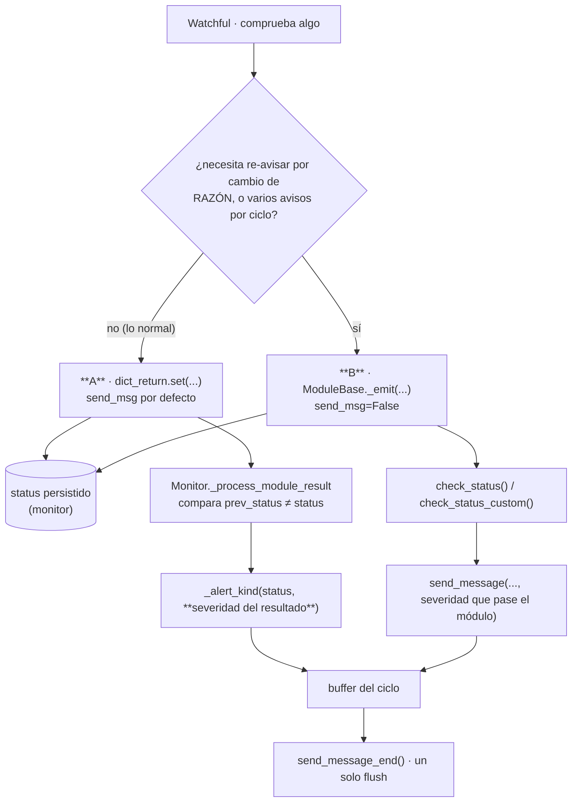
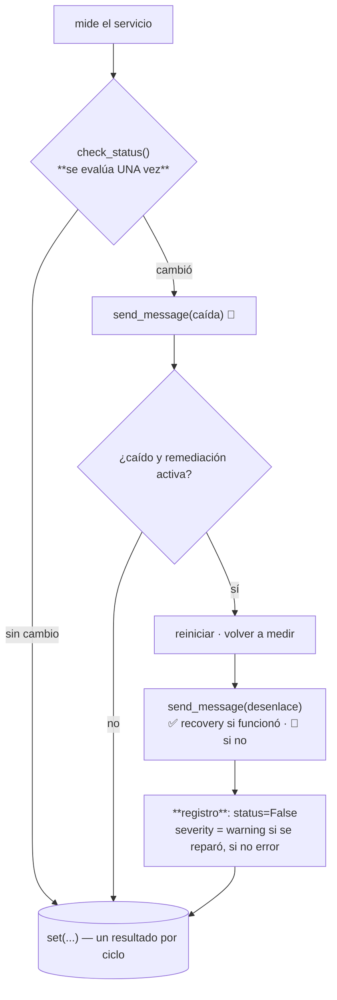
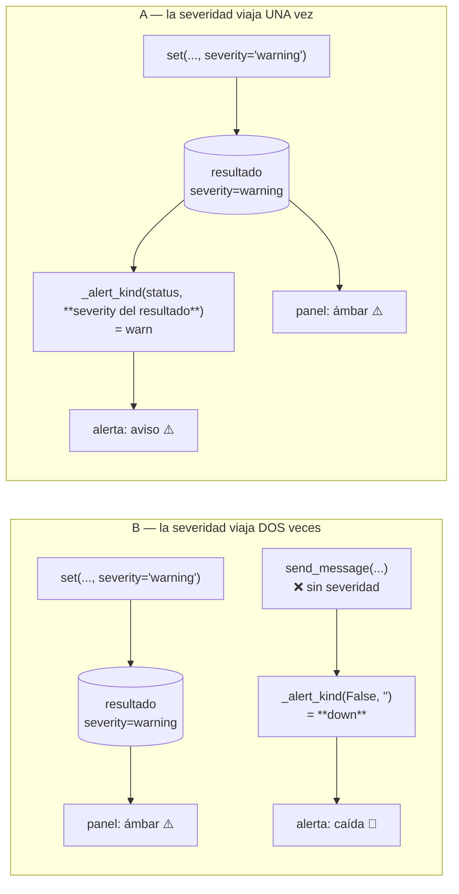

# Cómo un watchful publica un resultado

Un módulo hace dos cosas con cada comprobación: **registrar** el estado (para el panel, el
histórico y el Overview) y **notificar** cuando ese estado cambia. Hay dos formas de hacerlo, y
la elección no es de estilo: cambia qué errores son posibles.

> **Regla:** el patrón **A (automático) es el predeterminado**. El **B (manual)** solo para los
> tres casos que A no puede expresar, listados abajo.



Los dos acaban en el mismo buffer y el mismo envío. La diferencia está en **quién decide** y, sobre
todo, en **de dónde sale la severidad**.

---

## A — Automático (predeterminado)

El módulo **solo registra**. El monitor decide si notificar.

```python
self.dict_return.set(key, ok, message,
                     other_data={'used': pct, 'alert': limit},
                     severity='warning' if soft_breach else None,
                     name=label)
```

Eso es todo. En `Monitor._process_module_result` el monitor compara con el estado persistido y,
si cambió, emite la alerta leyendo la severidad **del propio resultado**.

**Por qué es el predeterminado:** hace estructuralmente imposible el error más caro que ha tenido
este código. Ver *El bug que motivó esta nota*.

Lo usan: `cpu`, `filesystemusage`, `raid`, `ram_swap`, `temperature`, y las ramas de
error/excepción de casi todos los demás.

### `name=` no es opcional

Sin él, el monitor cae a `_item_label()`, que resuelve **el host enlazado** vía `host_uid`. Eso
es una cosa distinta de la etiqueta del check.

**Once sitios lo omitían.** Consecuencia: la misma comprobación aparecía en la columna Item con
dos nombres distintos según cómo hubiera fallado — `"A example.com"` en el camino normal, `"ns1"`
al lanzar excepción. Todos eran ramas de error, o sea justo cuando la notificación más importa.

Y ojo: **`other_data={'name': …}` no sirve**. `get_name()` lee el campo de nivel superior. Dos
módulos llevaban esa confusión, y a simple vista parecían correctos.

---

## B — Manual (`ModuleBase._emit`)

El módulo registra **y** notifica:

```python
self._emit(key, ok, message, other_data, severity='warning', name=label)
```

Internamente: `set(..., send_msg=False)` + `check_status()` + `send_message()`. El `send_msg=False`
apaga la ruta del monitor; ese `send_message` explícito es **la única** notificación.

> `send_msg=False` **no** afecta al registro del estado: `_process_module_result` guarda el estado
> de todas las claves y solo condiciona el bloque de notificación. Silencia el aviso, no la
> persistencia.

### Los tres casos que justifican B

| Necesidad | Cómo | Quién |
|---|---|---|
| Re-avisar cuando cambia la **razón**, no solo el estado | `change_msg=<razón interna>` → usa `check_status_custom` | `datastore`, `hddtemp` |
| **Varios avisos** en un mismo ciclo | imposible con `_emit`; emparejar a mano | `service_status` |
| Un **nombre** propio distinto del host resuelto | `name=` | la mayoría |

El tercero ya no obliga a B: A también acepta `name=`. Quedan dos motivos reales.

### Si emparejas a mano (ni A ni `_emit`)

Solo hay un sitio así en el repo, `service_status`, y por una razón estructural: el gate se evalúa
**una vez** y gobierna **dos** envíos (la caída y el desenlace de la reparación). Con `_emit` el
segundo quedaría mudo, porque `check_status` compara contra el estado *almacenado*, que la caída
aún no ha actualizado dentro del mismo ciclo.



Los dos envíos cuelgan del **mismo** gate. Por eso `_emit` no sirve aquí: llamarlo dos veces
volvería a consultar `check_status`, que compara contra el estado *almacenado* —aún sin
actualizar dentro del ciclo— y el segundo aviso saldría mudo.

Fíjate en la disociación deliberada: la **alerta** del desenlace se envía con el estado reparado
(para que enrute como recuperación, que es la noticia), mientras el **registro** queda en warning.
La alerta cuenta la novedad; el registro conserva el incidente. Si el ciclo se guardara como OK
limpio, un servicio que se muere cada noche parecería perfectamente sano.

`tests/test_watchful_emit_patterns.py` falla si aparece un segundo sitio así. No lo prohíbe:
obliga a justificarlo.

---

## El bug que motivó esta nota

`_emit` pasaba `severity` al resultado registrado pero **no** a la notificación. Como también pasa
`send_msg=False`, ese envío explícito era el único — así que la fila salía ámbar en el panel
mientras la alerta se enrutaba como caída dura.

Afectaba a toda severidad `warning` de `azure` (VM apagada, cuota al límite, presupuesto en curso
de reventar, credencial por caducar), `m365` (umbrales de almacenamiento, licencias bajas),
`keepalived` y `proxmox`. Vivió replicado **byte a byte en cuatro módulos**, porque cada uno tenía
su copia.



En el patrón A ese fallo no puede ocurrir: el monitor lee la severidad del resultado guardado en
vez de confiar en que el módulo la repita en una segunda llamada. Un dato que viaja una sola vez
no puede desincronizarse consigo mismo.

**La lección no es "usa A".** Es que un emparejamiento duplicado en N sitios se equivoca en N
sitios, y que el patrón donde el dato viaja una sola vez tiene menos formas de romperse.

---

## Un tercer fallo, distinto de los otros dos

`proxmox` pasaba `send_msg=False` en su rama de excepción **y no notificaba por ningún lado**.
Ni `check_status`, ni `send_message`. Una excepción no controlada ponía el check en rojo en el
panel y no avisaba a nadie.

No era A (silenciado) ni B (sin el envío manual): era la mitad de cada uno. Es exactamente lo que
detecta `TestManualPatternStaysRare`.

---

## Elegir, en una frase

**Registra y calla (A), salvo que necesites re-avisar por cambio de razón o mandar más de un aviso
por ciclo (B).** Y pon `name=` siempre, en los dos.

## Qué lo vigila

`tests/test_watchful_emit_patterns.py`:

| Test | Impide |
|---|---|
| `test_automatic_results_carry_an_explicit_name` | Un resultado sin `name=`, que se etiquetaría con el host |
| `test_other_data_name_is_not_mistaken_for_the_real_one` | La confusión `other_data['name']` |
| `test_manual_emit_is_the_exception_not_the_rule` | Una deriva silenciosa hacia el emparejamiento a mano |

Y `tests/test_warning_severity.py` cubre que la severidad llega a **las dos** salidas.
