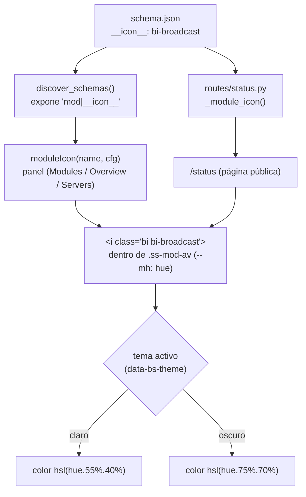

# Referencia de `schema.json`

Guía completa de todas las opciones disponibles en los archivos `schema.json` de los módulos watchful de ServiceSentry.

---

## Estructura general

Cada módulo tiene un archivo `schema.json` en la raíz de su carpeta. El archivo es un objeto JSON con una clave por **colección**:

```json
{
    "__module__": { ... },
    "list":       { ... }
}
```

| Colección | Descripción |
|-----------|-------------|
| `__module__` | Campos de configuración a nivel de módulo (afectan a todo el módulo) |
| `list` | Campos de configuración por ítem (una entrada por recurso monitorizado) |
| `config` | Colección alternativa para módulos sin ítems individuales (p. ej. `ram_swap`) |

---

## Propiedades de campo

Cada campo dentro de una colección es un objeto con las siguientes propiedades:

### `type` — **obligatorio**

Tipo de dato del campo.

| Valor | Control UI | Tipo Python |
|-------|-----------|-------------|
| `"bool"` | Toggle switch | `bool` |
| `"str"` | Input text | `str` |
| `"int"` | Input number (entero) | `int` |
| `"float"` | Input number (decimal) | `float` |
| `"list"` | (reservado) | `list` |

---

### `default` — **obligatorio**

Valor por defecto cuando el campo falta en la configuración del módulo. Usado por Python para rellenar valores ausentes y por la UI para inicializar formularios nuevos.

```json
"timeout": {"type": "int", "default": 10}
```

---

### `min` / `max`

Valor mínimo y máximo permitido para campos numéricos (`int` o `float`). Aplicado como atributo HTML en el input y validado al perder el foco.

```json
"port": {"type": "int", "default": 80, "min": 1, "max": 65535}
```

---

### `sensitive` / `secret`

Si `sensitive` es `true`, el campo se renderiza como `<input type="password">`
(contenido oculto) y se **enmascara** en las respuestas de la API. Si `secret`
es `true`, además se **cifra en reposo** con Fernet (prefijo `enc:`). Usados para
contraseñas, tokens y claves privadas.

```json
"password":       {"type": "str", "default": "", "sensitive": true},
"snmpv3_auth_key": {"type": "str", "default": "", "secret": true}
```

> El core **descubre automáticamente** estos campos en los `schema.json` de los
> módulos mediante `ModuleBase.discover_secret_fields()` y los protege de forma
> uniforme (cifrado, enmascarado, restauración al guardar) sin codificar sus
> nombres. Así los módulos permanecen independientes del core. Ver
> [security.md](security.md) → *Descubrimiento de secretos de módulos*.

---

### `options`

Lista de valores permitidos para campos `str`. La UI genera un `<select>` desplegable en lugar de un input libre.

```json
"conn_type": {"type": "str", "default": "tcp", "options": ["tcp", "socket", "ssh"]}
```

Las etiquetas visibles de cada opción se definen en los archivos de idioma bajo `option_labels`:

```json
"option_labels": {
    "conn_type": {"tcp": "TCP directo", "socket": "Socket Unix", "ssh": "Túnel SSH"}
}
```

---

### `group`

Nombre del grupo visual al que pertenece el campo. Los campos con el mismo `group` se agrupan bajo un encabezado con ese nombre. La etiqueta visible del encabezado se define en `group_labels` de los archivos de idioma.

```json
"host":     {"type": "str", "default": "", "group": "server"},
"port":     {"type": "int", "default": 0,  "group": "server"},
"password": {"type": "str", "default": "", "group": "server", "sensitive": true}
```

---

### `show_when`

Condición de visibilidad. El campo solo se muestra cuando el campo de control tiene uno de los valores indicados. Las condiciones múltiples se evalúan con AND lógico.

```json
"socket": {
    "type": "str",
    "default": "",
    "show_when": {"conn_type": ["socket"], "db_type": ["mysql", "postgres"]}
}
```

Cuando el campo está oculto, su valor no se incluye en el payload enviado al servidor.

---

### `placeholder`

Texto de marcador de posición estático para el input. El valor especial `"__key__"` muestra la clave del ítem como placeholder (útil como fallback cuando el campo está vacío).

```json
"host": {"type": "str", "default": "", "placeholder": "192.168.1.1"}
```

---

### `placeholder_module`

Nombre de un campo a **nivel de módulo** (`__module__`) cuyo valor se usa como placeholder dinámico en los ítems. Permite heredar el valor por defecto del módulo como sugerencia visual.

```json
"timeout": {"type": "int", "default": 0, "placeholder_module": "timeout"}
```

Cuando el usuario modifica el campo de módulo, todos los placeholders de ítems se actualizan automáticamente.

---

### `placeholder_map`

Objeto que mapea el valor de otro campo al placeholder de este campo. Usado para mostrar el puerto por defecto según el motor de base de datos seleccionado.

```json
"port": {
    "type": "int",
    "default": 0,
    "placeholder_map": {
        "mysql": 3306, "postgres": 5432, "mssql": 1433,
        "mongodb": 27017, "redis": 6379, "influxdb": 8086
    },
    "placeholder_map_field": "db_type"
}
```

Las claves del `placeholder_map` son los valores del campo de control indicado por `placeholder_map_field` (en el ejemplo, `db_type`).

---

### `placeholder_map_field`

Nombre del campo de control cuyo valor se usa como clave en `placeholder_map`. Cuando ese campo cambia, el placeholder de este campo se recalcula con la entrada correspondiente del mapa.

---

### `input_action`

Botón de icono acoplado al input (Bootstrap input-group). Permite ejecutar una acción directamente desde el campo, como listar bases de datos o seleccionar un recurso.

```json
"db": {
    "type": "str",
    "default": "",
    "input_action": {
        "id":           "list_databases",
        "url":          "/api/v1/watchfuls/datastore/list_databases",
        "extra":        {},
        "icon":         "bi-database",
        "result":       "field_picker",
        "result_field": "db"
    }
}
```

Propiedades de `input_action`:

| Propiedad | Tipo | Descripción |
|-----------|------|-------------|
| `id` | str | Identificador; se busca en `action_labels` del idioma para la etiqueta del botón |
| `url` | str | Endpoint al que se hace POST con los datos del ítem como body |
| `extra` | dict | Campos extra añadidos al payload antes del envío |
| `icon` | str | Clase Bootstrap Icons (p. ej. `"bi-database"`) |
| `result` | str | Modo de resultado: `"toast"`, `"list"` o `"field_picker"` |
| `result_field` | str | Solo para `"field_picker"`: campo del ítem que se rellena con el valor elegido |

Modos de resultado (`result`):
- `"toast"` — muestra la respuesta como notificación emergente
- `"list"` — muestra `res.data.items` como badges bajo el campo
- `"field_picker"` — abre un modal con la lista `res.data.items`; al seleccionar, escribe en `result_field`

---

### `hidden`

Si es `true`, el campo se almacena en la configuración del módulo pero nunca se renderiza en la UI. Útil para guardar metadatos internos generados automáticamente (p. ej. el tipo SNMP detectado al hacer un Discover).

```json
"snmp_type": {"type": "str", "default": "", "hidden": true}
```

---

### `readonly`

Si es `true`, el campo se renderiza como un input no editable (sin `onchange`). El usuario puede ver el valor pero no modificarlo manualmente. Para campos que solo deben cambiarse a través de la acción de descubrimiento integrada.

```json
"oid": {"type": "str", "default": "1.3.6.1.2.1.1.1.0", "readonly": true}
```

---

### `numericString`

Si es `true` en un campo `str`, el input restringe las pulsaciones de teclado a solo dígitos (sin letras ni símbolos). Útil para campos como `chat_id` de Telegram que son strings numéricas.

```json
"chat_id": {"type": "str", "default": "", "numericString": true}
```

---

### `options_int`

Lista de enteros permitidos para un campo `int`. La UI genera un `<select>` con estas opciones en lugar de un input numérico libre. A diferencia de `options` (para strings), aquí los valores son enteros.

```json
"page_size": {"type": "int", "default": 25, "options_int": [10, 25, 50, 100, 0]}
```

El valor `0` se muestra con la etiqueta `t('all')` (traducida como "Todos").

---

### `zero_as_blank`

Si es `true`, el valor `0` se muestra como campo vacío (placeholder en lugar de `0`). Semántica: "0 significa usar el valor por defecto del módulo". Se combina con `placeholder_module` o `placeholder_map`.

```json
"port": {"type": "int", "default": 0, "zero_as_blank": true, "placeholder_module": "port"}
```

---

### `inherit_blank`

Solo para campos `int`/`float` a nivel de módulo (`__module__`). Si es `true`, dejar el campo en blanco lo almacena como `null` (distinto de `0`, que sigue siendo un valor real) y hace que herede el valor global de `Configuration > Modules` (config editable `modules|<campo>`, en la tabla `config` de la BD), que se muestra como placeholder. Es la contraparte en la UI de la resolución ítem → módulo → global de `ModuleBase.module_default()`. Usado en `threads` y `timeout` de cada módulo.

```json
"timeout": {"type": "int", "default": 10, "min": 0, "max": 300, "inherit_blank": true}
```

---

### `nullable`

Para campos `int`/`float`. Si es `true`, dejar el campo en blanco lo almacena como
`null` (distinto de `0`) — semántica "usar el valor por defecto". La UI renderiza un
input numérico que en blanco muestra como placeholder el default del campo (o el de
`placeholder_map`). Se diferencia de `inherit_blank` (que es la cascada ítem→módulo
→global de los módulos); `nullable` es genérico y se usa también en la config del
panel (p. ej. puertos de syslog/BD).

```json
"udp_port": {"type": "int", "default": 514, "nullable": true}
```

---

### `multi`

Para campos `str`. Renderiza el valor como una **lista de chips** eliminables
(separadores coma/espacio/línea), almacenada como cadena unida por comas. Útil para
listas de IPs, interfaces, etc.

```json
"allowed_sources": {"type": "str", "default": "", "multi": true}
```

---

### `ipkind`

Declara un campo como **dirección IP** y activa validación en cliente y servidor.
Valores: `"ip"` (IPv4/IPv6, sin máscara) o `"cidr"` (dirección IP **o** red CIDR).
Combinable con `multi` (lista de IPs validadas). Un valor inválido se rechaza con
`400` al guardar.

```json
"bind_host": {"type": "str", "default": "", "multi": true, "ipkind": "ip"}
```

---

### `term_field`

Nombre de un campo hermano cuyo valor selecciona la etiqueta/hint/acción del campo
desde el diccionario `field_terms` del i18n del módulo. Permite que un mismo campo
cambie de nombre visible según otro campo (p. ej. en `datastore`, el campo `db`
muestra "Base de datos" / "Índice" / "Bucket" según `db_type`).

---

### `result_multi`

Para campos con `input_action`. Si es `true`, el resultado de la acción se renderiza
como **chips** eliminables (varios valores) en vez de un único texto; el picker
permite seleccionar varios elementos.

---

### `options_deps`

Mapa de valores de un campo `options` a paquetes Python opcionales requeridos. Si el paquete no está instalado, la opción se muestra desactivada con un tooltip de instalación.

```json
"db_type": {
    "type": "str",
    "default": "mysql",
    "options": ["mysql", "postgres", "mssql", "mongodb", "redis"],
    "options_deps": {
        "postgres": "psycopg2-binary",
        "mssql":    "pyodbc"
    }
}
```

`discover_schemas()` comprueba la presencia de cada paquete e inyecta `options_disabled` en el schema si alguno falta. La UI renderiza las opciones afectadas como disabled con el mensaje de instalación.

---

### `__pick_from_collection__`

Nombre de otra colección del mismo módulo. Añade un botón picker al input que abre un modal con las claves de esa colección para selección directa.

```json
"server": {
    "type": "str",
    "default": "",
    "__pick_from_collection__": "servers"
}
```

---

### `supported_platforms`

Lista de plataformas en las que el campo está disponible. En plataformas no incluidas, el campo se renderiza como un badge "No compatible" desactivado en lugar de un control interactivo.

```json
"local": {
    "type": "bool",
    "default": true,
    "supported_platforms": ["linux"]
}
```

Valores válidos: `"linux"`, `"win32"`, `"darwin"`.

Cuando `discover_schemas()` detecta que la plataforma actual no está en la lista, añade `__unsupported__: true` al campo en los schemas devueltos. La UI renderiza entonces el badge "No compatible" en lugar del control.

---

## Meta-claves de colección (`__*__`)

Las claves que empiezan y terminan con `__` controlan el comportamiento de la UI. No corresponden a campos de datos y son ignoradas por Python en tiempo de ejecución.

---

### `__field_order__`

Lista de nombres de campo que fija el orden de renderizado en el formulario. Los campos no incluidos en la lista se añaden al final en orden de declaración.

```json
"__field_order__": ["enabled", "db_type", "conn_type", "host", "port", "password"]
```

---

### `__group_when__`

Objeto `{nombre_grupo: condición_show_when}`. Controla cuándo el **encabezado** de un grupo es visible, independientemente de la visibilidad de los campos que contiene. Si un grupo no aparece aquí, su encabezado siempre se muestra.

```json
"__group_when__": {
    "ssh": {"conn_type": ["ssh"]}
}
```

---

### `__actions__`

Lista de botones de acción para el formulario del ítem. Cada acción genera un botón que hace POST al endpoint indicado con los datos actuales del ítem.

```json
"__actions__": [
    {
        "id":         "test_connection",
        "url":        "/api/v1/watchfuls/datastore/test_connection",
        "extra":      {},
        "icon":       "bi-plug",
        "variant":    "outline-info",
        "full_width": true,
        "result":     "toast"
    },
    {
        "id":         "test_ssh",
        "url":        "/api/v1/watchfuls/datastore/test_connection",
        "extra":      {"_test_mode": "ssh"},
        "show_when":  {"conn_type": ["ssh"]},
        "group":      "ssh",
        "icon":       "bi-hdd-network",
        "variant":    "outline-secondary",
        "full_width": true,
        "result":     "toast"
    }
]
```

Propiedades de cada acción:

| Propiedad | Tipo | Descripción |
|-----------|------|-------------|
| `id` | str | Identificador único. Se busca en `action_labels` del idioma |
| `url` | str | Endpoint al que se hace POST con los datos del ítem |
| `extra` | dict | Campos extra fusionados con el payload antes del envío |
| `icon` | str | Clase Bootstrap Icons |
| `variant` | str | Variante Bootstrap del botón (`"outline-info"`, `"outline-secondary"`, etc.) |
| `full_width` | bool | Si `true`, el botón ocupa el 100 % del ancho disponible |
| `result` | str | Modo de resultado: `"toast"` (notificación), `"list"` (badges), `"field_picker"` (modal de selección) |
| `result_field` | str | Solo para `"field_picker"`: campo que recibe el valor seleccionado |
| `show_when` | dict | Igual que en campos: oculta el botón según el valor de otro campo |
| `group` | str | Si se especifica, el botón se inyecta dentro del bloque visual del grupo en lugar de al pie del formulario |

---

### `__test__`

URL del endpoint de test rápido. Aparece como botón en el encabezado de la colección (no en cada ítem individualmente). Hace POST con los datos del ítem seleccionado.

```json
"__test__": "/api/v1/watchfuls/datastore/test_connection"
```

La acción invocada debe estar en `WATCHFUL_ACTIONS` del módulo.

---

### `__discovery__`

Nombre de la acción de descubrimiento (sin URL completa). La URL se construye con `api_ver` del `__module__`. Activa el botón "Descubrir" en el encabezado. Por defecto la UI hace GET; si se define `__discovery_method__: "POST"`, hace POST con la configuración como body.

```json
"__discovery__": "discover"
```

---

### `__discovery_method__`

Método HTTP para la llamada de descubrimiento. Omitir equivale a `"GET"`. Usar `"POST"` cuando el endpoint necesita la configuración del módulo en el body (p. ej. credenciales de conexión para filtrar resultados por servidor).

```json
"__discovery_method__": "POST"
```

---

### `__discovery_field__`

Nombre del campo que recibe un botón de búsqueda inline (input-group). Al pulsar el botón se abre el modal de descubrimiento en modo "selección de campo": los ítems ya añadidos aparecen desactivados y seleccionar uno escribe su valor en el campo. Requiere `__discovery__`.

```json
"__discovery_field__": "partition"
```

---

### `__discovery_subtitle__`

Plantilla de cadena para el subtítulo visible en cada fila del modal de descubrimiento. Los placeholders `{campo}` se sustituyen con los valores del ítem descubierto.

```json
"__discovery_subtitle__": "{mib_module}::{mib_name}"
```

Los separadores que queden vacíos (`::`) se colapsan automáticamente.

---

### `__discovery_type_field__`

Nombre del campo del ítem descubierto que contiene el tipo o sintaxis del elemento. Se usa para renderizar el badge de tipo en el modal. Valor por defecto: `"status"`.

```json
"__discovery_type_field__": "mib_type"
```

---

### `__discovery_category_field__`

Nombre del campo del ítem descubierto que contiene la categoría. La categoría se usa para seleccionar el icono y color del badge, y para asignar el operador por defecto al añadir.

```json
"__discovery_category_field__": "mib_category"
```

---

### `__discovery_categories__`

Mapa de nombres de categoría a definición visual `{icon, color}`. El icono es una clase Bootstrap Icons y el color es cualquier valor CSS válido.

```json
"__discovery_categories__": {
    "numeric": {"icon": "bi-hash",   "color": "#38bdf8"},
    "string":  {"icon": "bi-fonts",  "color": "#4ade80"},
    "ip":      {"icon": "bi-globe2", "color": "#818cf8"}
}
```

---

### `__discovery_default_operators__`

Mapa de categoría a operador que se preselecciona al añadir el ítem. El campo `operator` del nuevo ítem se rellena automáticamente con este valor.

```json
"__discovery_default_operators__": {
    "numeric": "any",
    "string":  "contains",
    "ip":      "eq",
    "oid":     "eq"
}
```

---

### `__discovery_type_store_field__`

Nombre del campo (oculto, `hidden: true`) donde se almacena el tipo del ítem al añadirlo desde el modal de descubrimiento. Permite que la UI adapte los controles del formulario según el tipo sin necesidad de cargar datos externos.

```json
"__discovery_type_store_field__": "snmp_type"
```

---

### `__key_mirrors_field__`

Nombre de un campo. Cuando está definido, la clave del ítem se sincroniza automáticamente con el valor de ese campo cada vez que se selecciona un valor desde el modal de descubrimiento. El botón de renombrar se oculta para los ítems de esta colección.

```json
"__key_mirrors_field__": "service"
```

Usado en `service_status`: la clave del ítem es siempre igual al valor del campo `service`.

---

### `__new_item_fields__`

Lista de campos que deben rellenarse obligatoriamente al crear un ítem nuevo. La UI muestra solo esos campos en el diálogo de creación antes de desplegar el formulario completo.

```json
"__new_item_fields__": ["db_type"]
```

---

---

## Sub-colecciones (`type: "sub_collection"`)

Una colección puede contener otra colección anidada. Se declara como un campo normal con `"type": "sub_collection"` y su propia definición de campos y meta-claves.

```json
{
    "servers": {
        "__new_item_fields__": ["host"],
        "enabled": {"type": "bool", "default": true},
        "host":    {"type": "str",  "default": ""},
        "port":    {"type": "int",  "default": 161},
        "checks": {
            "type":                 "sub_collection",
            "__discovery__":        "discover",
            "__discovery_method__": "POST",
            "__discovery_field__":  "oid",
            "enabled":  {"type": "bool", "default": true},
            "oid":      {"type": "str",  "default": "", "readonly": true},
            "operator": {"type": "str",  "default": "any", "options": ["any", "eq", "ne"]},
            "value":    {"type": "str",  "default": ""}
        }
    }
}
```

La sub-colección se muestra como una colección anidada dentro de cada ítem padre. Los botones de discover de la sub-colección reciben en su POST body tanto los escalares del módulo como el ítem padre completo.

---

## Colección `__module__`

Define los ajustes a nivel de módulo. Campos habituales:

| Campo | Tipo | Descripción |
|-------|------|-------------|
| `enabled` | bool | Habilita o deshabilita el módulo completo |
| `threads` | int | Número de hilos paralelos para procesar ítems |
| `timeout` | int | Timeout por defecto para las comprobaciones |
| `attempt` | int | Número de reintentos por comprobación (módulo `ping`) |
| `alert` | int | Umbral de alerta en porcentaje o grados |
| `code` | int | Código HTTP esperado (módulo `web`) |
| `local` | bool | Usar monitorización local (módulo `raid`) |

Además de los campos de datos, `__module__` puede contener la propiedad especial:

### `api_ver`

Versión de la API que usa el módulo para sus endpoints watchful. Controla el prefijo de la URL (`/api/v1/`, `/api/v2/`, etc.). Por defecto `"v1"`.

```json
"__module__": {
    "api_ver": "v1",
    "enabled": {"type": "bool", "default": true},
    "threads": {"type": "int",  "default": 5, "min": 1, "max": 100}
}
```

La UI usa este valor para construir todas las URLs de acciones del módulo (`discover`, `test_connection`, etc.).

### `__history__`

Declara qué campo(s) numérico(s) registra el módulo como **serie temporal** (para
las gráficas de historial). `{"field": "temp", "unit": "°C", "label": "Temperatura"}`,
o `{"fields": {nombre: {unit, label}}}` para varios; `{"field": null}` para módulos
solo-estado. Lo lee `routes/history.py`.

### `__icon__`

Icono Bootstrap del módulo (string, p. ej. `"bi-broadcast"`), a nivel raíz del
`schema.json`. Lo declara el módulo una sola vez y lo consumen **los dos**: la
pestaña **Modules** del panel (`moduleIcon()`, que renderiza la clase `bi-*` como
`<i class="bi …">`) y la **página de estado pública** (`/status`) — sin ningún mapa
nombre→icono hardcodeado en el core. `discover_schemas` lo expone como
`"<modulo>|__icon__"`. Fallbacks si se omite: `📦` en el panel, `bi-puzzle-fill` en
`/status`.

```json
"__icon__": "bi-broadcast"
```

**Flujo de resolución** — una declaración en el `schema.json`, dos consumidores
(panel y `/status`), tinte adaptado al tema:



Prioridad completa de `moduleIcon` (con `config.icon` y fallback `__i18n__`/emoji)
en [i18n.md → Resolución de etiquetas](i18n.md#resolución-de-etiquetas-en-el-navegador).

### `__host_profile__`

Declara los campos de conexión que un check puede **heredar de un host vinculado**
del registro. Dict (o lista de dicts) con `{"key": <protocolo>, "address_field":
<campo de dirección>, "fields": [campos a heredar]}`. Lo resuelve
`ModuleBase.resolve_host()`. Ver [web_admin.md → Servers](web_admin.md#servers-registro-de-hosts).

```json
"__host_profile__": {"key": "snmp", "address_field": "host", "fields": ["host"]}
```

### `__host_multiple__`

Bool. Si es `true`, el check puede vincularse a **varios hosts** (selección múltiple).
Por defecto `false`.

### `__credential__`

Declara campos de **credencial reutilizable** del módulo (separados de los campos
inline del ítem), referenciables desde el registro de credenciales. `{"type":
"web_auth", "fields": ["auth_user", "auth_password"]}`. Usado por `datastore`
(`datastore_auth`) y `web` (`web_auth`).

### Meta-claves de UI / descubrimiento adicionales

Usadas por la UI (lista/modal de descubrimiento), normalmente en `list`:

| Meta-clave | Descripción |
|-----------|-------------|
| `__check_title_field__` | Campo que contiene la etiqueta visible del ítem (p. ej. `"label"`, `"process"`) |
| `__title_editable__` | Bool: permite renombrar el ítem editando ese campo |
| `__discovery_uid_key__` | Bool: la clave del ítem es un UUID opaco (no editable) |
| `__discovery_label_template__` | Plantilla `{campo}` para construir la etiqueta de cada fila descubierta (p. ej. `"{host} - {db_type}"`) |
| `__discovery_inputs__` | Lista de controles de entrada extra en el modal de descubrimiento (filtros) |
| `__discovery_value_field__` | Campo del resultado de descubrimiento con el que se rellena el ítem (en vez de la clave) |

### Gating por dependencias (variables de clase Python)

No son de `schema.json` sino de la clase `Watchful`:

| Variable | Efecto en `discover_schemas()` |
|----------|--------------------------------|
| `MISSING_DEPS: list[str]` | Si tiene paquetes ausentes, marca el módulo/colección `__unsupported__` e inyecta `__missing_deps__` (la UI muestra "pip install …") |
| `PARTIAL_DEPS: list[str]` | Inyecta `__partial_deps__` (badge de aviso; el módulo sigue usable) |
| `WATCHFUL_TOOLBAR: tuple` | Se propaga como `__toolbar__` (botones de barra de herramientas del módulo) |
| `WATCHFUL_UI: frozenset` | Se propaga como `__ui__` (capacidades de UI legacy) |

> Claves inyectadas en runtime por `discover_schemas()` (no se escriben en
> `schema.json`): `__unsupported__`, `__missing_deps__`, `__partial_deps__`,
> `options_disabled`, `__toolbar__`, `__ui__`.

---

## Archivos de idioma (`lang/*.json`)

Complementan `schema.json` con etiquetas, hints y textos de UI. No forman parte de `schema.json` directamente pero son fusionados por `discover_schemas()`.

| Sección | Descripción |
|---------|-------------|
| `pretty_name` | Nombre visible del módulo en la UI |
| `labels` | Etiqueta visible de cada campo (`{campo: "Etiqueta"}`) |
| `hints` | Texto de ayuda bajo el campo en la UI (`{campo: "Descripción..."}`) |
| `option_labels` | Etiquetas de las opciones de campos con `options` (`{campo: {valor: "Etiqueta"}}`) |
| `group_labels` | Nombre visible de cada grupo (`{nombre_grupo: "Etiqueta"}`) |
| `action_labels` | Etiqueta del botón de cada acción (`{id_accion: "Etiqueta"}`) |
| `collections` | Nombre visible de cada colección (`{"list": "Servidores"}`) |
| `rename_item_prompt` | Texto personalizado para el modal de renombrar ítem |
| `new_item_key_label` | Etiqueta personalizada para el campo de clave en el modal de nuevo ítem |

---

## Procesamiento en Python (`discover_schemas`)

`ModuleBase.discover_schemas()` genera el objeto `ITEM_SCHEMAS` que consume la UI:

1. Lee `schema.json` de cada módulo (siempre desde disco, sin caché)
2. Importa el módulo para acceder a `WATCHFUL_ACTIONS` y `SUPPORTED_PLATFORMS`
3. Fusiona `label_i18n` desde `lang/*.json` en cada campo
4. Marca con `__unsupported__: true` los campos cuya `supported_platforms` excluye la plataforma actual
5. Si el módulo tiene `SUPPORTED_PLATFORMS` y la plataforma no está incluida, añade `__unsupported__: true` a toda la colección
6. Construye la entrada `__i18n__` combinando `info.json` + `lang/*.json`

El resultado es un dict plano con claves `"modulo|coleccion"`:

```python
{
    "datastore|__module__": {...},
    "datastore|list":       {...},
    "datastore|__i18n__":   {"en_EN": {...}, "es_ES": {...}},
    "ping|__module__":      {...},
    "ping|list":            {...},
    ...
}
```

---

## Exposición de acciones web (`WATCHFUL_ACTIONS`)

Para que un classmethod del módulo sea invocable desde la UI, debe estar listado en `WATCHFUL_ACTIONS`:

```python
class Watchful(ModuleBase):
    WATCHFUL_ACTIONS: frozenset[str] = frozenset({'test_connection', 'list_databases'})
```

El endpoint genérico `GET|POST /api/v1/watchfuls/<module>/<action>` comprueba que la acción esté en este frozenset antes de ejecutarla. Cualquier acción no listada devuelve `404`.

- **GET**: llama al classmethod sin argumentos → usado por `discover()`
- **POST**: llama al classmethod con el body JSON como `dict` → usado por `test_connection()` y `list_databases()`

Las respuestas de acciones que devuelven listas de recursos (como `list_databases`) usan siempre la clave `"items"`, no `"databases"` ni ningún nombre específico de motor.

---

## Guardia de plataforma a nivel de módulo (`SUPPORTED_PLATFORMS`)

Esta variable de **clase Python** (no una propiedad de `schema.json`) protege el módulo entero en plataformas no soportadas. Se declara directamente en la clase `Watchful`:

```python
class Watchful(ModuleBase):
    SUPPORTED_PLATFORMS = ('linux', 'darwin')   # no disponible en Windows
```

Cuando la plataforma actual no está en la tupla, `discover_schemas()` añade `__unsupported__: true` a **todas las colecciones** del módulo. La UI renderiza entonces un badge "No compatible" en lugar de los formularios interactivos.

| Valor      | Plataforma |
|------------|------------|
| `"linux"`  | Linux      |
| `"darwin"` | macOS      |
| `"win32"`  | Windows    |

**Distinción con `supported_platforms` de campo:**

| Mecanismo | Dónde se declara | Alcance |
| --- | --- | --- |
| Clase `SUPPORTED_PLATFORMS` | `watchful.py` / `__init__.py` | Módulo completo — toda la colección queda inactiva |
| Campo `supported_platforms` | `schema.json`, por campo | Solo ese campo — el resto del formulario sigue activo |

Usa `SUPPORTED_PLATFORMS` en la clase cuando el módulo entero es inútil en esa plataforma (p. ej. `temperature` en Windows). Usa `supported_platforms` por campo cuando solo una opción específica no está disponible (p. ej. el campo `local` de `raid`, que usa `/proc/mdstat` y solo existe en Linux aunque el módulo soporta monitorización remota en cualquier plataforma).

---

## Módulos y sus características de schema

| Módulo | Colecciones | `__actions__` | `__test__` | `__discovery__` | POST discovery | Sub-colección | `__discovery_field__` | `__key_mirrors_field__` | `WATCHFUL_TOOLBAR` |
|--------|-------------|:---:|:---:|:---:|:---:|:---:|:---:|:---:|:---:|
| `cpu` | `__module__`, `list` | — | — | — | — | — | — | — | — |
| `datastore` | `__module__`, `list` | ✓ | ✓ | — | — | — | — | — | — |
| `dns` | `__module__`, `list` | — | — | ✓ | ✓ | — | ✓ (`host`) | — | — |
| `filesystemusage` | `__module__`, `list` | — | — | ✓ | — | — | ✓ (`partition`) | — | — |
| `hddtemp` | `__module__`, `list` | — | — | — | — | — | — | — | — |
| `ntp` | `__module__`, `list` | — | — | — | — | — | — | — | — |
| `ping` | `__module__`, `list` | — | — | — | — | — | — | — | — |
| `process` | `__module__`, `list` | — | — | ✓ | — | — | ✓ (`process`) | ✓ (`process`) | — |
| `raid` | `__module__`, `list` | — | — | — | — | — | — | — | — |
| `ram_swap` | `__module__` | — | — | — | — | — | — | — | — |
| `service_status` | `__module__`, `list` | — | — | ✓ | — | — | ✓ (`service`) | ✓ (`service`) | — |
| `snmp` | `__module__`, `servers` → `checks` | — | — | ✓ | ✓ | ✓ (`checks`) | ✓ (`oid`) | ✓ (`oid`) | ✓ (file_manager, mib_browser) |
| `ssl_cert` | `__module__`, `list` | — | — | — | — | — | — | — | — |
| `temperature` | `__module__`, `list` | — | — | ✓ | — | — | — | — | — |
| `ups` | `__module__`, `list` | — | ✓ | — | — | — | — | — | — |
| `web` | `__module__`, `list` | — | ✓ | — | — | — | — | — | — |
