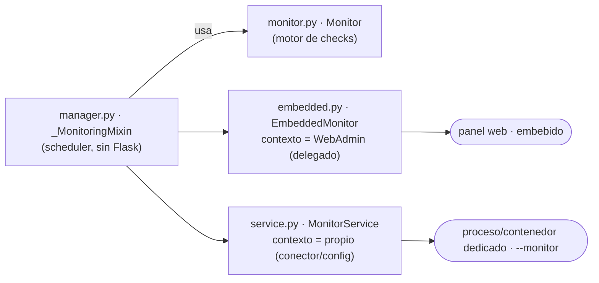
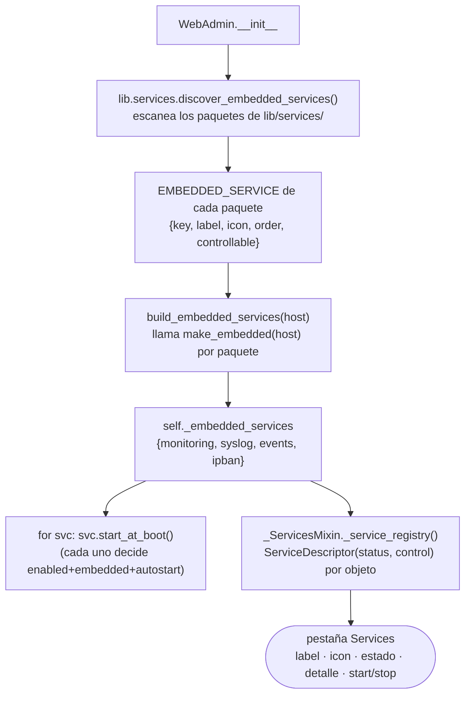
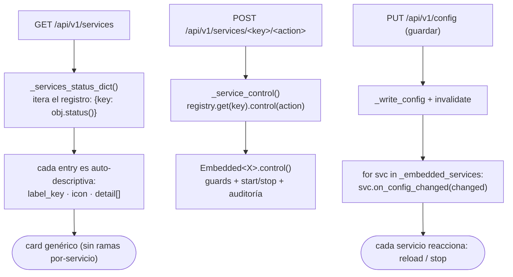
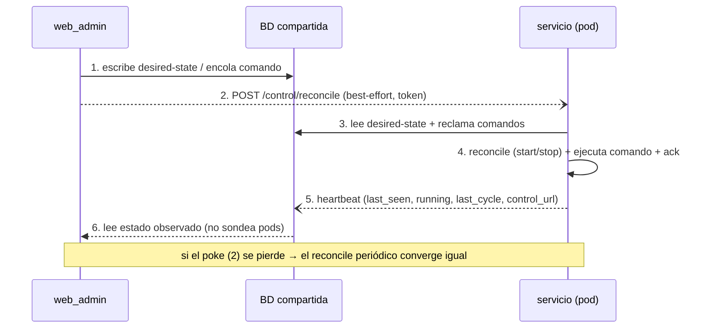

# Servicios de fondo

ServiceSentry ejecuta **servicios de larga vida** (monitor, syslog, eventos, fail2ban).
Cada uno corre con el **mismo código** en **dos modos** — **embebido** en el panel web o
**standalone** como su propio proceso/contenedor — y, en modo microservicios, se coordinan
por la **base de datos compartida**. Este documento cubre qué servicios hay, cómo se crean,
cómo se descubren, cómo se comprueba su estado y cómo se comunican entre pods.

> El *descubrimiento* self-describing (descriptor `EMBEDDED_SERVICE`) es un caso del patrón
> general — ver [discovery.md → Servicios embebidos](discovery.md#3-servicios-embebidos-embedded_service).
> La *ejecución de checks* del monitor está en [architecture.md → Ejecución de checks](architecture.md#ejecución-de-checks-un-único-ejecutor).

---

## Qué servicios hay

| Servicio (`key`) | Qué hace | Naturaleza | Modo standalone |
|---|---|---|---|
| **monitoring** | Scheduler de checks: un `Monitor` persistente ejecuta los módulos por ciclo, detecta cambios de estado, despacha notificaciones y poda el historial | loop de fondo | `--monitor` |
| **syslog** | Receptor syslog centralizado: parser RFC 3164/5424 + listener UDP/TCP(+TLS), allowlist de orígenes, retención | listener de red | `--syslog` |
| **events** | Procesador de eventos desacoplado: evalúa reglas sobre auditoría/syslog mediante un worker por cursor, con cooldowns | loop de fondo (por cursor) | `--events` |
| **ipban** | fail2ban interno: gate de peticiones **inline** sobre un jail en BD (no es un loop) — bans progresivos por IP; registrado en la pestaña Services | gate inline | — (siempre en-proceso) |

Cada uno vive en `lib/services/<key>/`. Los tres primeros son procesos de fondo que pueden
externalizarse a su propio contenedor; **ipban** es un gate en la cola de peticiones del
panel (ver [security.md → fail2ban](security.md#fail2ban-interno-bans-de-ip-a-nivel-de-servicio)),
pero se autodescribe y aparece en la pestaña Services como los demás.

---

## Anatomía de un servicio (cómo se crea)

Un servicio es un **paquete** en `lib/services/<key>/`. El mismo código lo hospedan dos
*hosts* distintos (el WebAdmin embebido o el runner standalone); solo cambia quién aporta
el contexto (config, stores, debug):

| Fichero | Rol |
|---|---|
| `__init__.py` | Se autodescribe: `EMBEDDED_SERVICE = {key, label_key, icon, order, controllable}` (pestaña Services) + `STANDALONE = {key, dest, banner, order}` (modo CLI) + `make_embedded(host)` (fábrica del objeto embebido) |
| `manager.py` | El **mixin compartido** (`_<X>Mixin`, sin Flask): toda la lógica de ciclo de vida (scheduler / listener / worker) — la usan ambos hosts |
| `embedded.py` | `Embedded<X>`: host = **WebAdmin** (delega config/stores). Aporta `status()`, `control(action)`, `start_at_boot()` y opcional `on_config_changed(changed)` |
| `service.py` | `<X>Service`: host = **propio** (construye su conector/config). El runner del modo standalone (`--<key>`) |
| `store/`, `routes/`, `permissions.py`, `overview_widget.py` | Opcionales: persistencia, endpoints, permisos self-describing y widget de Overview del servicio |

> syslog y events siguen el mismo patrón (`manager.py` compartido + `embedded.py` +
> `service.py`). El gate `SS_*_EMBEDDED` decide si el panel lo hospeda (`embedded.py`) o
> lo posee un proceso dedicado (`service.py`).

**Añadir un servicio nuevo** = soltar un paquete en `lib/services/` con su `EMBEDDED_SERVICE`
+ `embedded.py` (que aporta `status`/`control`/`start_at_boot` y, opcional, `on_config_changed`).
Aparece solo en la API, el card, el log de arranque y el control — **cero ediciones** en el
panel ni el frontend.

---

## Arranque del panel: descubrir → componer → arrancar

El WebAdmin **no hereda** los servicios: los **compone**. Cada paquete se autodescribe
(`EMBEDDED_SERVICE`), el registro los descubre, y el panel construye un objeto embebido por
servicio que se arranca a sí mismo según su gating.

`main.py` usa el mismo escaneo (`discover_standalone_services()`) para despachar
`--monitor` / `--syslog` / `--events` al runner del paquete correspondiente.

---

## Pestaña Services: estado y control

El registro es genérico: el panel itera los servicios y cada uno se describe a sí mismo
(estado + acciones), sin ramas por-servicio.

Permisos: ver la [pestaña Services en web_admin.md](web_admin.md#servicios). El estado se
sondea con `daemon/status` para el countdown; el control (`start`/`stop`) va por
`/api/v1/services/<key>/<action>`.

---

## Modo microservicios: plano de control distribuido

Cuando un servicio corre **embebido**, el panel lo controla con una llamada en proceso
(`Embedded<X>.control()`). Cuando corre en **otro contenedor/pod** (`SS_*_EMBEDDED=0`), no
hay objeto local que llamar — la coordinación va por la **base de datos compartida**, que es
la **fuente de verdad**. Se separan tres conceptos en tres sitios distintos:

| Concepto | Qué es | Dónde vive |
|---|---|---|
| **Desired state** | lo que el operador quiere (`enabled`, intervalo…) | tabla `config` (declarativo, editable en el panel) |
| **Observed state** | qué está realmente vivo (latido, último ciclo, versión, `control_url`) | tabla `service_instances` ([`ServiceInstancesStore`]) |
| **Comandos** | acciones one-shot (`run_now`/`reload`/`clear_status`/`prune`) | tabla `service_commands` ([`ServiceCommandsStore`], claim atómico) |
| **Liderazgo** | quién es el dueño activo de un servicio single-owner | tabla `service_leader` ([`ServiceLeaderStore`], lease con TTL) |

Cada servicio **reconcilia** hacia el desired-state y **publica su latido**; el panel **lee**
el estado observado y, para acelerar, **hace un poke HTTP** opcional. El poke es solo un
acelerador: si se pierde, el reconcile periódico converge igual.

### Cómo se comprueba el estado (microservicios)

El panel **no sondea los pods**: lee el **estado observado** de `service_instances`, que cada
instancia publica en su latido. Para diagnóstico directo, cada servicio standalone levanta un
**servidor de control** (sin Flask):

- **`control_server.py`** — `ThreadingHTTPServer` (stdlib) que cada servicio standalone levanta
  si hay `SS_CONTROL_TOKEN`. Endpoints:
  - `GET /control/health` — sin auth, para probes de k8s: `{ok, key, version}`, sin datos sensibles.
  - `GET /control/info` — Bearer token: snapshot vivo (status, BD, líder, versión…).
  - `POST /control/reconcile` — Bearer token: fuerza reconcile + drena la cola de comandos.

### Cómo se comunican (piezas)

- **`_HeartbeatMixin`** (`lib/services/heartbeat.py`): hilo de latido (~10 s) que escribe
  `service_instances`, **drena la cola de comandos** del servicio y expone `_control_reconcile()`
  (el objetivo del poke). Lo mezclan tanto los `Embedded<X>` como los `*Service` standalone.
- **`_reconcile_once()`** por servicio: re-lee config y aplica el desired-state (start/stop,
  reload de listener…). Lo invocan el timer **y** el poke.
- **Poke desde el panel**: `_poke_service_instances(key)` → `POST /control/reconcile` a las
  instancias externas vivas (descubiertas por `control_url` del heartbeat). Se dispara al
  **encolar un comando** para un servicio externo y al **guardar config** que le afecte
  (`_poke_services_for_config`).

Variables de entorno del poke (mapean a un Secret de k8s): `SS_CONTROL_TOKEN` (sin token →
listener apagado, solo reconcile periódico), `SS_CONTROL_PORT` (8765), `SS_CONTROL_BIND`
(0.0.0.0), `SS_CONTROL_ADVERTISE` (dirección que se publica como `control_url`).

> **Principio**: el panel nunca *manda* a un proceso remoto; **declara desired-state** y los
> servicios reconcilian. Robusto ante reinicios (el estado vive en la BD, no en la orden) y
> particiones de red (el poke es opcional).

---

## Alta disponibilidad: lease de líder + hot-standby

Algunos servicios **no pueden** correr en más de una instancia a la vez: dos schedulers de
monitor duplicarían cada check (y cada alerta); dos workers de eventos avanzarían el mismo
cursor y duplicarían cada notificación. Para permitir **varias réplicas** sin duplicar
trabajo, esos servicios usan un **lease de líder** en BD ([`ServiceLeaderStore`], tabla
`service_leader`):

- Cada réplica intenta **adquirir/renovar** el lease en su loop de heartbeat
  (`_renew_leadership`); el `try_acquire` es *race-safe* (UPDATE condicional
  `WHERE holder=<viejo> OR expires_at<now`).
- **Solo el líder hace el trabajo**: `_work_allowed()` gatea el ciclo del monitor
  (`_monitoring_loop`) y el tick de eventos (`_event_worker_tick`). Las demás réplicas quedan
  en **hot-standby** (vivas pero ociosas).
- Si el líder cae y deja de renovar, el lease **caduca** (TTL ~30 s) y otra réplica lo toma →
  *failover* automático en segundos. Un cierre limpio hace `release()` para un relevo instantáneo.
- `_LEADER_GATED=True` lo activa por servicio: **monitor** y **events** sí; **syslog** no (es
  **active-active** — tras un balanceador cada mensaje llega a una réplica, sin duplicar). La
  pestaña Servicios marca cada instancia **Líder/En espera**.

> Acciones explícitas (check on-demand, comando `run_now`) **no** están gateadas por líder: las
> ejecuta cualquier réplica (el claim de la cola garantiza "una sola vez").

---

## Despliegue

Cómo empaquetar cada servicio como contenedor/pod (topologías, variables, redes) está en la
doc de despliegue, que **usa** este modelo:

- [docker.md](docker.md) — topologías monolítica / microservicios / microservicios + Traefik.
- [kubernetes.md](kubernetes.md) — un Deployment por rol, probes contra `/control/health`, NetworkPolicy.
- [deployment.md](deployment.md) — gestión de servicios (systemd/OpenRC) y comandos de servicio.

[`ServiceInstancesStore`]: ../src/lib/services/control/instances.py
[`ServiceCommandsStore`]: ../src/lib/services/control/commands.py
[`ServiceLeaderStore`]: ../src/lib/services/control/leader.py
