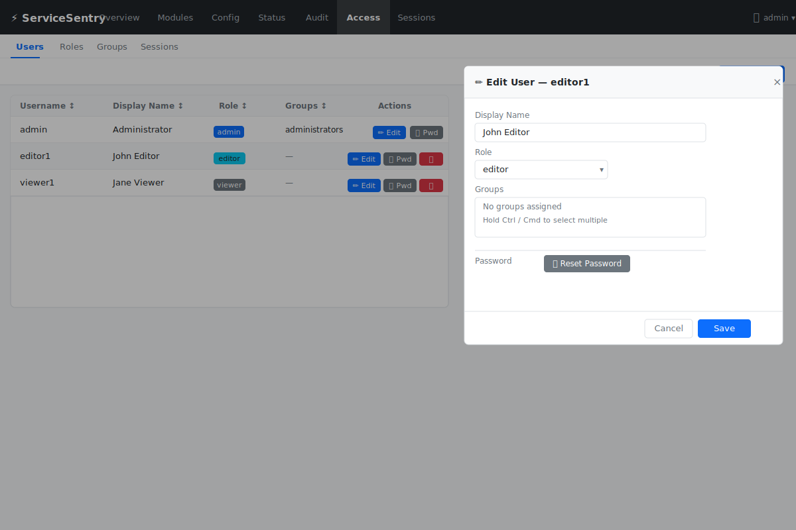
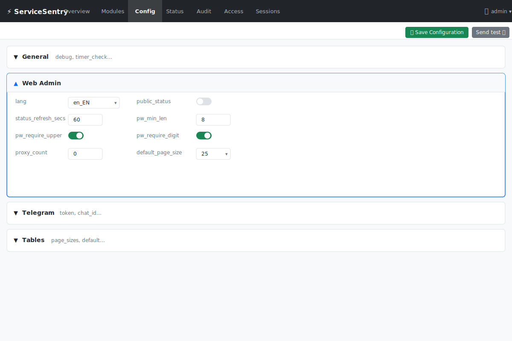
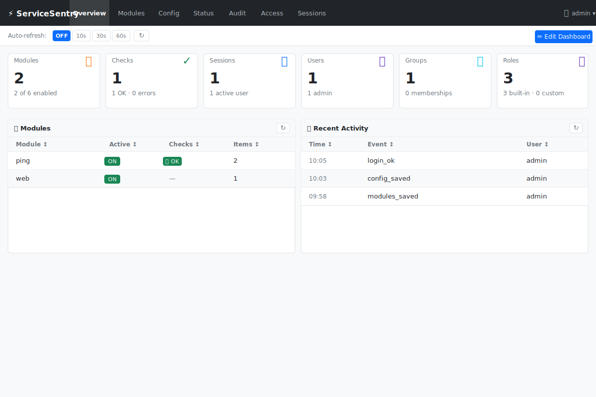
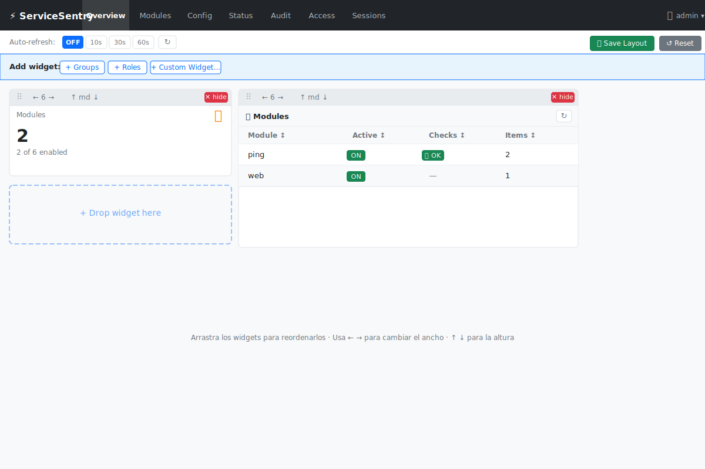
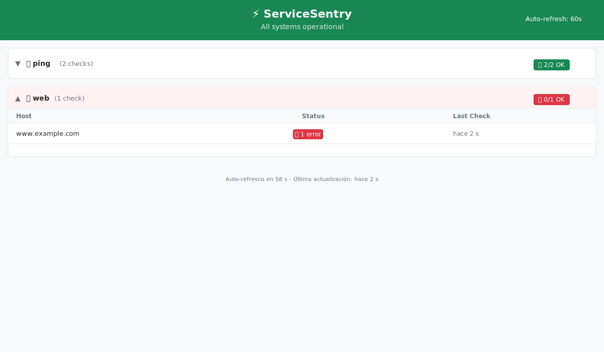
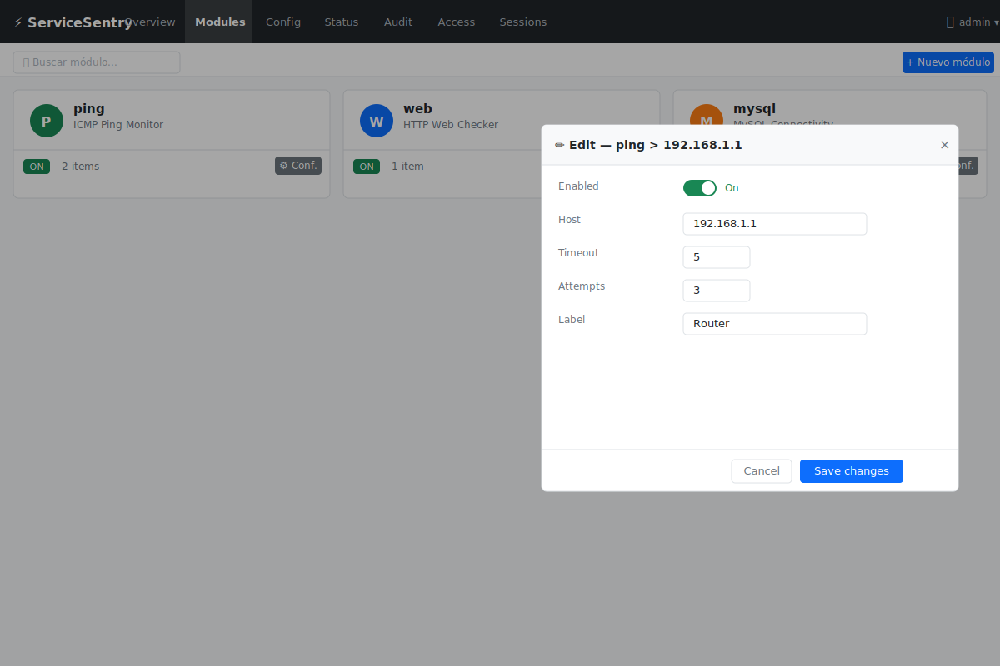

# Interfaz Web de Administración

ServiceSentry incluye un panel de administración web basado en **Flask**.
Permite gestionar módulos, configuración y usuarios sin tocar archivos directamente.

---

## Organización del Código

La lógica de `WebAdmin` está dividida en **mixins** (lógica de negocio) y **routes** (registro de rutas Flask):

```
lib/web_admin/
├── app.py            # class WebAdmin(hereda todos los mixins)
├── mixins/
│   ├── users.py      # _UsersMixin
│   ├── roles.py      # _RolesMixin
│   ├── groups.py     # _GroupsMixin
│   ├── permissions.py# _PermissionsMixin
│   ├── sessions.py   # _SessionsMixin
│   ├── audit.py      # _AuditMixin
│   └── checks.py     # _ChecksMixin
└── routes/
    ├── __init__.py   # register_all(app, wa)
    ├── auth.py       # /login, /logout
    ├── users.py      # /api/users, /api/me
    ├── roles.py      # /api/roles
    ├── groups.py     # /api/groups
    ├── modules.py    # /api/modules, /api/status, /api/overview
    ├── config.py     # /api/config, /api/config/schema
    ├── sessions.py   # /api/sessions
    ├── telegram.py   # /api/telegram/test
    ├── audit.py      # /api/audit
    ├── checks.py     # /api/checks/run
    ├── status.py     # /status (página pública de estado, sin autenticación)
    ├── errors.py     # handlers 400, 403, 404, 405, 500
    └── ui.py         # /, /lang, /theme
```

---

## Iniciar la Interfaz Web

```bash
python3 main.py --web
```

Abre `http://localhost:8080` (o el host/puerto configurado) en el navegador.

---

## Características

| Característica | Descripción |
|---------------|-------------|
| **Panel de módulos** | Habilitar/deshabilitar módulos, configurar ítems con formularios generados automáticamente desde los schemas |
| **Dashboard personalizable** | Widgets arrastrables, redimensionables y ocultables; posición, tamaño y visibilidad persistidos por usuario en `localStorage`; modo edición con barra de herramientas por widget (ancho en columnas 2–12, altura sm/md/lg/xl, drag-and-drop HTML5) |
| **Vista general (Overview)** | 6 tarjetas de resumen (Modules, Checks, Sessions, Users, Groups, Roles) + 2 widgets de tabla (lista de módulos con estado por check, actividad reciente); auto-refresco configurable (OFF / 10 s / 30 s / 60 s); columnas ordenables |
| **Pestaña de configuración** | Editar `config.json` (Telegram, daemon, idioma) directamente desde el navegador; paneles colapsables por sección |
| **Paginación configurable** | Tamaño de página por defecto (`default_page_size`) y lista de opciones (`page_sizes`) configurables desde la pestaña de configuración → sección Tablas |
| **Página de estado pública** | `/status` sin autenticación (cuando `public_status=true`); tarjetas colapsables por módulo, auto-refresco configurable, siempre visible para usuarios logueados |
| **Páginas de error personalizadas** | 400/403/404/405/500 con tema dark/light heredado de la sesión; las rutas `/api/*` devuelven JSON en lugar de HTML |
| **Gestión de usuarios** | Crear, editar y eliminar usuarios; asignar roles; cambiar contraseña propia |
| **Roles y permisos** | Roles integrados (`admin`, `editor`, `viewer`) + roles personalizados con 23 flags granulares; los roles integrados permiten editar la etiqueta y gestionar qué usuarios/grupos tienen asignado ese rol; sus permisos se muestran en solo lectura |
| **Grupos de usuarios** | Agrupar usuarios bajo uno o más roles; los permisos de los grupos se suman a los del rol individual del usuario; grupo `administrators` integrado (permite editar roles y miembros, pero no nombre ni etiqueta) |
| **Prueba de Telegram** | Enviar un mensaje de prueba para verificar la conectividad del bot |
| **Modo oscuro** | Preferencia por usuario, persistida entre sesiones |
| **i18n** | Inglés y español; seleccionable por usuario y configurable globalmente con `web_admin.lang` |
| **Registro de auditoría** | Seguimiento de cambios a nivel de campo con enmascarado de datos sensibles |
| **Gestión de sesiones** | Ver sesiones activas; los usuarios con permiso `sessions_revoke` pueden revocar cualquier sesión |
| **Soporte proxy inverso** | `proxy_count` activa `ProxyFix` de Werkzeug para leer la IP real del cliente cuando Flask está detrás de uno o más proxies (nginx, Traefik…) |

---

## Roles de Usuario



### Roles integrados

| Rol | Permisos |
|-----|----------|
| `admin` | Todos los permisos (23 flags) |
| `editor` | `modules_view`, `modules_add`, `modules_edit`, `config_edit`, `checks_view`, `checks_run`, `audit_view`, `users_view`, `users_edit`, `roles_view`, `roles_edit`, `groups_view`, `groups_edit` |
| `viewer` | `modules_view`, `users_view`, `roles_view`, `groups_view`, `audit_view`, `sessions_view`, `checks_view` |

> Los roles integrados **no pueden eliminarse** ni cambiar sus permisos via API. Sí permiten actualizar la **etiqueta** (`label`) y gestionar qué usuarios y grupos tienen ese rol asignado. La etiqueta personalizada se persiste en `roles.json` bajo la clave `__builtin_labels__`.

### Roles personalizados

Se pueden crear roles adicionales desde la pestaña **Acceso → Roles** asignando
cualquier combinación de los 21 permisos disponibles. Los roles personalizados se
persisten en `roles.json`.

```
/api/roles             POST   → crear rol
/api/roles/<name>      PUT    → editar rol
/api/roles/<name>      DELETE → eliminar rol (falla si hay usuarios asignados)
```

---

## Grupos de Usuarios

Los grupos permiten asignar uno o varios **roles** a un conjunto de usuarios.
Los permisos son **aditivos**: el usuario obtiene sus permisos de rol propios más
la unión de los permisos de todos los roles de todos sus grupos.

### Grupo integrado

| Grupo | Roles | Notas |
|-------|-------|-------|
| `administrators` | `admin` | No puede borrarse; permite editar roles asignados y miembros; `label`/`description` son inmutables |

### API de grupos

```
/api/groups             GET    → listar grupos con miembros y roles
/api/groups             POST   → crear grupo
/api/groups/<name>      PUT    → editar roles y miembros (label/description ignorados en builtin)
/api/groups/<name>      DELETE → eliminar grupo (403 si es builtin)
```

Cada grupo tiene:
- `roles: []` — lista de nombres de rol cuyos permisos se añaden a los miembros
- `members` — calculado dinámicamente a partir de `users.json` (campo `groups` de cada usuario)

---

## Sistema de Permisos

El sistema de control de acceso usa **23 flags granulares** por acción y recurso.

| Grupo | Permiso | Descripción |
|-------|---------|-------------|
| **Usuarios** | `users_view` | Ver la lista de usuarios |
| | `users_add` | Crear usuarios |
| | `users_edit` | Editar propiedades / rol de usuarios |
| | `users_delete` | Eliminar usuarios |
| **Roles** | `roles_view` | Ver la lista de roles |
| | `roles_add` | Crear roles personalizados |
| | `roles_edit` | Editar roles personalizados |
| | `roles_delete` | Eliminar roles personalizados |
| **Grupos** | `groups_view` | Ver la lista de grupos |
| | `groups_add` | Crear grupos |
| | `groups_edit` | Editar grupos |
| | `groups_delete` | Eliminar grupos |
| **Auditoría** | `audit_view` | Leer el registro de auditoría |
| | `audit_delete` | Borrar entradas del registro |
| **Módulos** | `modules_view` | Ver la lista de módulos |
| | `modules_add` | Crear nuevas entradas de módulo |
| | `modules_edit` | Guardar cambios en módulos |
| **Config** | `config_view` | Leer `config.json` sin poder editarlo |
| | `config_edit` | Guardar cambios en configuración |
| **Sesiones** | `sessions_view` | Ver sesiones activas |
| | `sessions_revoke` | Revocar sesiones |
| **Checks** | `checks_view` | Ver resultados de checks y la pestaña Status |
| | `checks_run` | Lanzar comprobaciones bajo demanda |

### Implementación interna

- `PERMISSIONS` — tupla con los 23 flags.
- `PERMISSION_GROUPS` — lista de `(key_i18n, [perms])` para renderizar el modal de edición de roles agrupado.
- `BUILTIN_ROLE_PERMISSIONS` — dict `{role: frozenset}` para los roles integrados.
- `_perm_required(*perms)` — factoría de decoradores: acepta si el usuario tiene **alguno** de los permisos indicados.
- `_get_effective_permissions(username, role)` — devuelve la unión del frozenset del rol del usuario más los permisos de todos los roles de todos sus grupos.
- `GET /api/me` — incluye el campo `permissions: list[str]` con los permisos efectivos de la sesión activa.

### Restricción de roles en la UI

La función JS `applyRoleRestrictions()` (en `_js_init.html`) oculta o muestra
botones y pestañas según los permisos del usuario actual obtenidos de `/api/me`:

- Pestaña Usuarios: visible si tiene cualquier permiso `users_*`.
- Pestaña Auditoría: visible si tiene `audit_view`.
- Pestaña Status: visible si tiene `checks_view` o `checks_run`; oculta cuando ninguno de los dos está activo.
- Botón "Nuevo usuario": solo si `users_add`.
- Botones editar/borrar de cada usuario: solo si `users_edit` / `users_delete`.
- Botón limpiar audit / borrar entrada: solo si `audit_delete`.
- Botón "Nuevo rol" y sección de roles: solo si tiene cualquier permiso `roles_*`.
- Widget "Lista de módulos" del dashboard: oculto cuando falta `modules_view` (las tarjetas de resumen sí son siempre visibles).

---

## Seguridad

- Contraseñas hasheadas con `werkzeug.security` (scrypt por defecto en Werkzeug 3.x; los tests usan `pbkdf2:sha256` para acelerar la ejecución paralela).
- Contraseña nueva mínimo 8 caracteres; validada en el servidor.
- Límites de longitud aplicados en el servidor: username ≤ 64 chars, display_name ≤ 128, group name ≤ 64, label ≤ 128, description ≤ 512.
- Redireccionamientos validados contra el mismo origen (evita open redirect).
- Nombres de usuario escapados en mensajes de la UI (evita XSS en títulos de modales).
- Sesiones revocables desde el panel de administración.
- Las acciones destructivas (eliminar usuario/rol/grupo, revocar sesión) se confirman con un modal Bootstrap centrado antes de ejecutarse — nunca con `confirm()` nativo del navegador.
- Política de host SSH por defecto cambiada a `RejectPolicy` (hosts desconocidos rechazados).
- Campos sensibles (contraseñas, tokens) enmascarados en el diff del registro de auditoría.

---

## Endpoints REST



Todos los endpoints requieren autenticación (cookie de sesión) salvo los indicados como *público*.
El permiso requerido se indica entre paréntesis.

### Estado público

| Método | Ruta | Permiso | Descripción |
|--------|------|---------|-------------|
| `GET` | `/status` | público* | Página de estado de los servicios. *Requiere `public_status=true` para acceso anónimo; los usuarios autenticados siempre pueden acceder. |

### Autenticación

| Método | Ruta | Descripción |
|--------|------|-------------|
| `POST` | `/login` | Iniciar sesión con usuario y contraseña |
| `GET` | `/logout` | Cerrar sesión e invalidar la sesión actual |

### Módulos

| Método | Ruta | Permiso | Descripción |
|--------|------|---------|-------------|
| `GET` | `/api/modules` | `modules_view` | Obtener todas las configuraciones de módulos |
| `PUT` | `/api/modules` | `modules_edit` | Guardar todas las configuraciones de módulos |
| `GET` | `/api/status` | `checks_view` o `checks_run` | Obtener el contenido de `status.json` (solo lectura) |
| `GET` | `/api/overview` | auth | Obtener resumen del dashboard (módulos, checks, sesiones, usuarios, grupos, roles, últimos eventos) |

### Configuración

| Método | Ruta | Permiso | Descripción |
|--------|------|---------|-------------|
| `GET` | `/api/config` | `config_view` o `config_edit` | Obtener el `config.json` actual |
| `PUT` | `/api/config` | `config_edit` | Guardar `config.json` |
| `GET` | `/api/config/schema` | `config_view` o `config_edit` | Obtener el schema de validación de los campos de configuración del web admin |

Los campos numéricos del bloque `web_admin` se validan contra reglas definidas en `INT_RULES` (en `routes/config.py`):

| Clave (`config.json`) | Atributo | Mín | Máx |
|----------------------|----------|-----|-----|
| `web_admin\|remember_me_days` | `_REMEMBER_ME_DAYS` | 1 | 365 |
| `web_admin\|audit_max_entries` | `_AUDIT_MAX_ENTRIES` | 10 | 10000 |
| `web_admin\|status_refresh_secs` | `_STATUS_REFRESH_SECS` | 10 | 3600 |
| `web_admin\|pw_min_len` | `_PW_MIN_LEN` | 1 | 128 |
| `web_admin\|pw_max_len` | `_PW_MAX_LEN` | 8 | 256 |
| `web_admin\|proxy_count` | `_proxy_count` | 0 | 10 |
| `web_admin\|default_page_size` | `_DEFAULT_PAGE_SIZE` | 0 | 200 |

Los campos booleanos se validan vía `BOOL_RULES`:

| Clave (`config.json`) | Atributo |
|----------------------|----------|
| `web_admin\|public_status` | `_public_status` |
| `web_admin\|pw_require_upper` | `_PW_REQUIRE_UPPER` |
| `web_admin\|pw_require_digit` | `_PW_REQUIRE_DIGIT` |
| `web_admin\|pw_require_symbol` | `_PW_REQUIRE_SYMBOL` |

El endpoint `/api/config/schema` también expone metadatos para:

| Clave | Tipo especial | Descripción |
|-------|---------------|-------------|
| `web_admin\|status_lang` | `options` | Lista de idiomas disponibles + `""` (vacío = usar idioma por defecto) |
| `web_admin\|audit_sort` | `options` | `time`, `event`, `user`, `ip` — campo por el que ordenar el log |
| `web_admin\|default_page_size` | `options_int` | Lista de enteros tomada de `page_sizes`; el select de la UI se regenera al guardar cambios en `page_sizes` |
| `telegram\|chat_id` | `numericString` | Indica al cliente que el valor debe ser una cadena de solo dígitos |

El campo `web_admin.page_sizes` es un array de enteros no negativos que define las opciones de tamaño de página disponibles en todos los listados del panel. Se sanitiza al guardar: se descartan valores no enteros, booleanos y negativos; si el resultado queda vacío, se restaura el valor por defecto `[25, 50, 100, 200, 0]` (donde `0` significa "Todos"). No forma parte de `INT_RULES` ya que su validación es especial (array, no escalar).

### Telegram

| Método | Ruta | Permiso | Descripción |
|--------|------|---------|-------------|
| `POST` | `/api/telegram/test` | `config_edit` | Enviar un mensaje de prueba por Telegram |

### Usuarios

| Método | Ruta | Permiso | Descripción |
|--------|------|---------|-------------|
| `GET` | `/api/users` | `users_view` | Listar todos los usuarios |
| `POST` | `/api/users` | `users_add` | Crear un nuevo usuario |
| `PUT` | `/api/users/<username>` | `users_edit` | Editar un usuario |
| `DELETE` | `/api/users/<username>` | `users_delete` | Eliminar un usuario |
| `GET` | `/api/me` | auth | Obtener información del usuario actual |
| `PUT` | `/api/users/me/password` | auth | Cambiar la contraseña propia |

### Grupos

| Método | Ruta | Permiso | Descripción |
|--------|------|---------|-------------|
| `GET` | `/api/groups` | auth | Listar todos los grupos con miembros y roles |
| `POST` | `/api/groups` | `groups_add` | Crear un grupo |
| `PUT` | `/api/groups/<name>` | `groups_edit` | Editar roles y miembros de un grupo (label/description ignorados en builtin) |
| `DELETE` | `/api/groups/<name>` | `groups_delete` | Eliminar un grupo (403 si es builtin) |

### Roles

| Método | Ruta | Permiso | Descripción |
|--------|------|---------|-------------|
| `GET` | `/api/roles` | auth | Listar todos los roles (integrados + personalizados) |
| `POST` | `/api/roles` | `roles_add` | Crear un rol personalizado |
| `PUT` | `/api/roles/<name>` | `roles_edit` | Editar rol; en integrados solo se acepta `label`; en personalizados acepta `label` y `permissions` |
| `DELETE` | `/api/roles/<name>` | `roles_delete` | Eliminar un rol personalizado |

### Sesiones

| Método | Ruta | Permiso | Descripción |
|--------|------|---------|-------------|
| `GET` | `/api/sessions` | `sessions_view` | Listar sesiones activas |
| `POST` | `/api/sessions/invalidate` | `sessions_revoke` | Revocar todas las sesiones |
| `POST` | `/api/sessions/revoke/<sid>` | `sessions_revoke` | Revocar una sesión concreta |
| `POST` | `/api/sessions/revoke-user/<user>` | `sessions_revoke` | Revocar sesiones de un usuario |

### Auditoría

| Método | Ruta | Permiso | Descripción |
|--------|------|---------|-------------|
| `GET` | `/api/audit` | `audit_view` | Listar entradas del registro de auditoría |
| `DELETE` | `/api/audit` | `audit_delete` | Borrar todas las entradas |
| `DELETE` | `/api/audit/<idx>` | `audit_delete` | Borrar una entrada concreta |

### Checks

| Método | Ruta | Permiso | Descripción |
|--------|------|---------|-------------|
| `POST` | `/api/checks/run` | `checks_run` | Lanzar comprobaciones bajo demanda |

### Preferencias de UI

| Método | Ruta | Permiso | Descripción |
|--------|------|---------|-------------|
| `GET` | `/lang/<lang>` | auth | Establecer preferencia de idioma |
| `GET` | `/theme/<theme>` | auth | Establecer preferencia de tema (light/dark) |

---

## Dashboard Personalizable

La pestaña **Overview** del panel de administración incluye un dashboard totalmente personalizable por usuario. Los cambios se persisten en `localStorage` con la clave `ss_layout2_<username>`.



### Widgets disponibles

| Widget | ID | Descripción |
| ------ | -- | ----------- |
| Modules | `modules` | Tarjeta: total de módulos y cuántos están habilitados |
| Checks | `checks` | Tarjeta: total de checks y resultado (OK / errores) |
| Sessions | `sessions` | Tarjeta: sesiones activas y usuarios conectados |
| Users | `users` | Tarjeta: total de usuarios por rol |
| Groups | `groups` | Tarjeta: total de grupos y membresías |
| Roles | `roles` | Tarjeta: roles integrados + personalizados |
| Module List | `modules_list` | Tabla: módulo, estado activo, resultado de checks, nº de ítems; columnas ordenables |
| Recent Activity | `activity` | Tabla: últimos 10 eventos de auditoría; columnas ordenables |

### Modo edición

Para activar el modo edición, pulsa **✏ Edit Dashboard** en la barra de herramientas. Esto habilita:

- **Drag-and-drop** para reordenar widgets — arrastra desde el icono `⠿` de la barra del widget.
- **Control de ancho** `← N →` para cambiar entre columnas del grid (ciclo: 2 → 3 → 4 → 6 → 8 → 9 → 12).
- **Control de altura** `↑ H ↓` para los widgets de tabla (ciclo: auto → sm → md → lg → xl).
- **Ocultar** `✕` para retirar un widget del dashboard (vuelve a aparecer en "Añadir widget").
- **Barra "Añadir widget"** que lista los widgets ocultos para restaurarlos.
- **Restablecer** para volver al layout por defecto.



### Respuesta de `/api/overview`

```json
{
  "modules": [
    {
      "name": "ping",
      "enabled": true,
      "items": 2,
      "checks": { "total": 1, "ok": 1, "error": 0 }
    }
  ],
  "status":   { "total": 1, "ok": 1, "error": 0 },
  "sessions": { "active": 1, "users": ["admin"] },
  "users":    { "total": 1, "by_role": { "admin": 1 } },
  "groups":   { "total": 1, "members": 0 },
  "roles":    { "total": 3, "builtin": 3, "custom": 0 },
  "last_events": [{ "ts": "...", "event": "login_ok", "user": "admin", "ip": "..." }]
}
```

Los contadores de `status` se calculan como la suma de `checks.total/ok/error` de todos los módulos.

---

## Página de Estado Pública (`/status`)

La ruta `/status` muestra el estado actual de todos los módulos en una página pública, sin panel de navegación ni menú de administración.



### Comportamiento de acceso

| Situación | Resultado |
|-----------|-----------|
| `public_status = false` + usuario anónimo | `404 Not Found` |
| `public_status = false` + usuario logueado | `200 OK` |
| `public_status = true` + cualquier visitante | `200 OK` |

### Características

- **Banner superior** verde (todos OK) o rojo (algún fallo) con el nombre de la aplicación.
- **Tarjetas colapsables por módulo** — colapsadas por defecto; se expanden automáticamente si alguna comprobación falla.
- **Contador de refresco** — cuenta regresiva en pantalla y recarga automática de la página; configurable con `status_refresh_secs` (10–3600 s).
- **Idioma configurable** — prioridad de 3 niveles: idioma de sesión del usuario → `status_lang` → `default_lang`. El `<html lang="...">` y todos los textos de la página se renderizan en el idioma resultante.
- No extiende `base.html`; es una página standalone completamente independiente del panel de administración.

### Configuración

| Parámetro `config.json` | Tipo | Por defecto | Descripción |
|------------------------|------|-------------|-------------|
| `web_admin.public_status` | bool | `false` | Permite el acceso anónimo a `/status` |
| `web_admin.status_refresh_secs` | int | `60` | Intervalo de refresco automático (10–3600 s) |
| `web_admin.status_lang` | string | `""` | Idioma fijo para la página `/status`. Prioridad: idioma de sesión del usuario > este ajuste > `web_admin.lang`. Vacío = usa el idioma por defecto del panel. |

---

## Páginas de Error Personalizadas

Los errores HTTP 400, 403, 404, 405 y 500 muestran páginas con el código de error, un icono Bootstrap, título y descripción traducidos al idioma de la sesión activa.

Las páginas heredan `base.html`, por lo que el tema dark/light se aplica automáticamente.

### Comportamiento JSON vs HTML

Si la ruta que genera el error empieza por `/api/` o el cliente envía `Accept: application/json`, la respuesta es JSON:

```json
{"error": "Page Not Found", "code": 404}
```

En cualquier otro caso se devuelve la plantilla `error.html`.

---

## i18n

Los ficheros de idioma están en dos lugares:

| Ubicación | Propósito |
|-----------|-----------|
| `src/lib/web_admin/lang/en_EN.py` / `es_ES.py` | Cadenas globales de la UI (navegación, botones, mensajes, etiquetas de permisos y grupos) |
| `src/watchfuls/<modulo>/lang/en_EN.json` / `es_ES.json` | Etiquetas de campos por módulo y nombre de visualización |

Las claves de i18n relacionadas con el sistema de permisos son:

| Clave | Descripción |
|-------|-------------|
| `permission_labels` | Dict `{flag: etiqueta}` con los 21 permisos |
| `perm_group_users` … `perm_group_checks` | Nombre de cada grupo de permisos para el modal de rol |
| `group_roles` | Etiqueta del selector de roles en el modal de grupo |
| `group_builtin_badge` | Texto del badge "Predeterminado" en grupos integrados |
| `role_tab_permissions` | Pestaña "Permisos" del modal de rol |
| `role_tab_assignments` | Pestaña "Asignación" del modal de rol |
| `role_assign_users` | Título de la columna de usuarios en la pestaña Asignación |
| `role_assign_groups` | Título de la columna de grupos en la pestaña Asignación |

Las claves de i18n para páginas de error son:

| Clave | Descripción |
|-------|-------------|
| `err_400_title` / `err_400_desc` | Título y descripción del error 400 |
| `err_403_title` / `err_403_desc` | Título y descripción del error 403 |
| `err_404_title` / `err_404_desc` | Título y descripción del error 404 |
| `err_405_title` / `err_405_desc` | Título y descripción del error 405 |
| `err_500_title` / `err_500_desc` | Título y descripción del error 500 |
| `err_generic_title` / `err_generic_desc` | Fallback para errores sin clave específica |

Para añadir un nuevo idioma, basta con crear un nuevo fichero `.py` en `lib/web_admin/lang/`. Se auto-descubre vía `pkgutil`.

---

## Formularios por Schema



La interfaz web genera automáticamente los formularios de configuración de módulos a partir del `schema.json` de cada package. Los campos se renderizan con el tipo de input correcto, rangos de validación y etiquetas del fichero `lang/*.json` del módulo.

Esto implica:
- Sin listas de campos hardcodeadas en JS.
- Los iconos y nombres de visualización de los módulos vienen de `info.json` y `lang/*.json`.
- Añadir un nuevo campo a `schema.json` es suficiente para que aparezca en la UI.

---

## Registro de Auditoría

Cada cambio de configuración se registra en `audit.json` con:
- Marca de tiempo
- Usuario que realizó el cambio
- Diff a nivel de campo (`valor_anterior` → `valor_nuevo`)
- Campos sensibles (contraseñas, tokens) mostrados solo como `***`

Los últimos N eventos de auditoría se muestran en el widget **Recent Activity** del dashboard Overview.

Todos los eventos auditados:

| Evento | Cuándo se registra |
|--------|--------------------|
| `login_ok` | Login exitoso |
| `login_failed` | Contraseña incorrecta o usuario inexistente |
| `logout` | Cierre de sesión |
| `modules_saved` | Guardado de `modules.json` |
| `config_saved` | Guardado de `config.json` |
| `user_created` | Creación de usuario |
| `user_updated` | Modificación de usuario |
| `user_deleted` | Eliminación de usuario |
| `password_changed` | Usuario cambia su propia contraseña |
| `password_reset` | Admin resetea la contraseña de otro usuario |
| `all_sessions_revoked` | Invalidación global de sesiones |
| `session_revoked` | Revocación de una sesión concreta |
| `user_sessions_revoked` | Revocación de todas las sesiones de un usuario |
| `group_created` | Creación de grupo |
| `group_updated` | Modificación de grupo (roles, miembros, label o descripción) |
| `group_deleted` | Eliminación de grupo |
| `role_created` | Se crea un rol personalizado |
| `role_updated` | Se cambia etiqueta o permisos de un rol |
| `role_deleted` | Se elimina un rol personalizado |
| `checks_run` | Ejecución manual de comprobaciones desde la UI |
